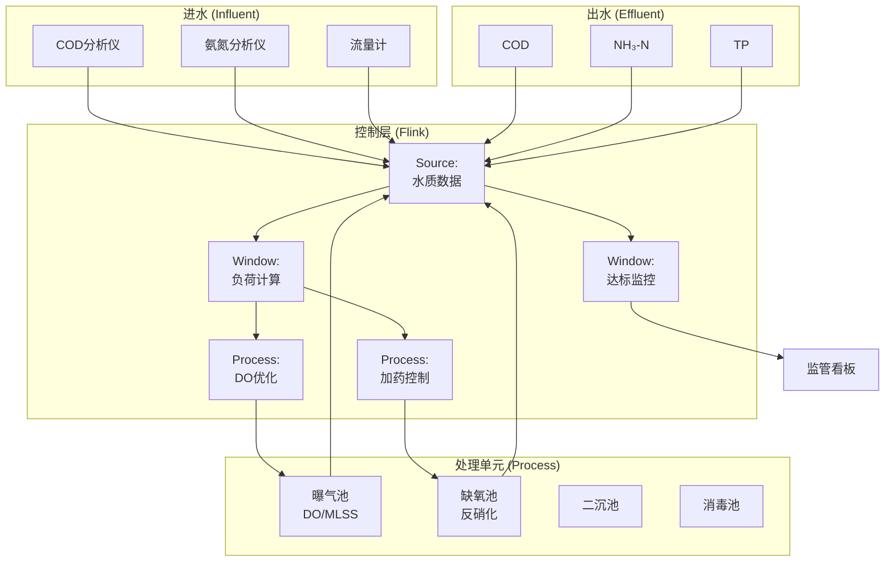
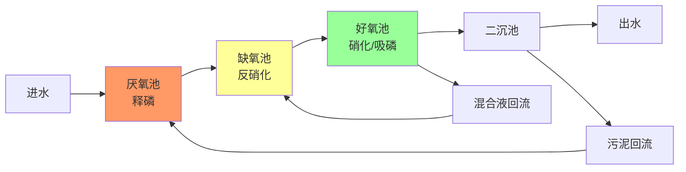
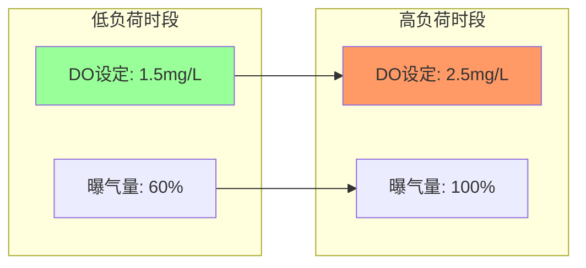

# 实时污水处理监测与智能控制案例研究

> 所属阶段: Knowledge/ Flink/ | 前置依赖: [算子全景分类](../01-concept-atlas/operator-deep-dive/01.06-single-input-operators.md) | [IoT流处理](../06-frontier/operator-iot-stream-processing.md) | 形式化等级: L4

## 1. 概念定义 (Definitions)

### Def-WWT-01-01: 污水处理智能监控系统 (Wastewater Treatment Intelligent Monitoring System)

污水处理智能监控系统是通过在线水质仪表、PLC控制系统和流计算平台，对污水厂进水、处理过程、出水水质进行实时监测、工艺优化与达标排放控制的集成系统。

$$\mathcal{S} = (I, P, O, E, F)$$

其中 $I$ 为进水水质数据流，$P$ 为工艺参数流（DO/MLSS/MLVSS），$O$ 为出水水质流，$E$ 为能耗数据流，$F$ 为流计算处理拓扑。

### Def-WWT-01-02: 生化需氧量与化学需氧量 (BOD₅ and COD)

生化需氧量BOD₅和化学需氧量COD是衡量水中有机物含量的核心指标：

$$BOD_5 = \text{微生物5天内分解有机物消耗的溶解氧量 (mg/L)}$$

$$COD = \text{化学氧化剂氧化水中有机物所需的氧量 (mg/L)}$$

BOD₅/COD比值反映污水可生化性：

- $BOD_5/COD \geq 0.45$：易生化降解
- $0.3 \leq BOD_5/COD < 0.45$：可生化降解
- $BOD_5/COD < 0.3$：难生化降解

### Def-WWT-01-03: 溶解氧控制设定点 (Dissolved Oxygen Setpoint)

曝气池溶解氧（DO）控制设定点根据进水负荷动态调整：

$$DO_{setpoint} = DO_{base} + k_1 \cdot \frac{Q_{in} \cdot COD_{in}}{V_{aeration}} + k_2 \cdot (T_{water} - T_{ref})$$

其中 $DO_{base}$ 为基础设定值（通常1.5-2.5 mg/L），$Q_{in}$ 为进水流量，$V_{aeration}$ 为曝气池容积，$T_{water}$ 为水温。

### Def-WWT-01-04: 污泥龄 (Sludge Age, SRT)

污泥龄是指活性污泥在曝气池中的平均停留时间：

$$SRT = \frac{V_{aeration} \cdot MLSS}{Q_{waste} \cdot MLSS_{waste} + Q_{effluent} \cdot MLSS_{effluent}}$$

其中 $MLSS$ 为混合液悬浮固体浓度，$Q_{waste}$ 为剩余污泥排放量。硝化反应要求 $SRT \geq 10$ 天，以确保硝化菌的富集。

### Def-WWT-01-05: 出水达标率 (Effluent Compliance Rate)

出水达标率定义为统计周期内出水水质满足排放标准的时段比例：

$$Compliance = \frac{\sum_{t} \mathbb{1}_{[COD_{eff}(t) \leq COD_{std} \land NH_3(t) \leq NH_{3,std} \land TP(t) \leq TP_{std}]}}{N} \cdot 100\%$$

一级A排放标准（GB 18918-2002）：COD ≤ 50 mg/L，NH₃-N ≤ 5 mg/L，TP ≤ 0.5 mg/L。

## 2. 属性推导 (Properties)

### Lemma-WWT-01-01: 曝气能耗与DO浓度的关系

曝气能耗与DO设定值呈近似线性关系：

$$E_{aeration} \approx \alpha \cdot DO_{setpoint} \cdot Q_{air} \cdot H_{diffuser}$$

其中 $Q_{air}$ 为曝气量，$H_{diffuser}$ 为曝气头淹没深度。

**工程意义**: DO从2.0 mg/L提高到3.0 mg/L，曝气能耗增加约30-40%。优化DO控制可节省污水厂总能耗的15-25%。

### Lemma-WWT-01-02: 进水负荷突变的响应时延

从进水负荷突变到出水水质响应的传递时延：

$$\tau_{response} = \frac{V_{aeration}}{Q_{in}} + \tau_{biological}$$

其中 $V_{aeration}/Q_{in}$ 为水力停留时间（HRT，通常4-8小时），$\tau_{biological}$ 为微生物代谢响应时间（通常1-2小时）。

### Prop-WWT-01-01: 前馈-反馈复合控制的优越性

在进水负荷波动频繁的场景下，前馈-反馈复合控制优于纯反馈控制：

$$\Delta E_{composite} < \Delta E_{feedback}$$

**论证**: 纯反馈控制需等待出水水质偏离才调整，存在 $\tau_{response}$ 的固有延迟。前馈控制根据进水水质预测负荷变化，提前调整曝气量，减少出水波动。

### Prop-WWT-01-02: 碳源投加的经济最优性

在生物脱氮除磷过程中，碳源（甲醇/乙酸钠）投加量与脱氮效率的经济最优平衡点：

$$\frac{\partial (Removal_{TN} \cdot Value_{TN} - Cost_{carbon})}{\partial Dose_{carbon}} = 0$$

**论证**: 碳源投加量不足导致脱氮不彻底（超标罚款），过量则增加药剂成本。最优投加量需实时根据进水C/N比调整。

## 3. 关系建立 (Relations)

### 与算子体系的映射

| 污水处理场景 | Flink算子 | 算子作用 |
|------------|-----------|---------|
| 水质仪表接入 | `SourceFunction` | 在线仪表Modbus/4-20mA接入 |
| 工艺参数聚合 | `KeyedProcessFunction` | 按处理单元键控聚合 |
| 负荷预测 | `WindowAggregate` | 滑动窗口内统计进水负荷 |
| DO控制 | `BroadcastStream` | 控制参数广播到曝气系统 |
| 异常检测 | `CEPPattern` | 水质突变/设备故障模式匹配 |
| 达标监控 | `WindowAggregate` | 日/月出水达标率统计 |

### 与环保标准的关联

- **GB 18918-2002**: 城镇污水处理厂污染物排放标准
- **HJ 2005-2010**: 人工湿地污水处理技术规范
- **CJ/T 51**: 城市污水水质检验方法标准
- **EPA**: 美国环保署污水处理设计指南

## 4. 论证过程 (Argumentation)

### 4.1 污水处理监控的核心挑战

**挑战1: 进水水质高度波动**
城市污水受居民生活规律、降雨、工业排放影响，进水COD可在100-800 mg/L之间波动，NH₃-N可在20-80 mg/L之间波动。

**挑战2: 检测仪表的可靠性**
在线COD分析仪采用重铬酸钾法，需定期更换试剂和校准；溶解氧探头膜片易污染，需每2-4周清洁。

**挑战3: 多目标优化冲突**
节能降耗（降低曝气）与水质达标（增加曝气）存在冲突；脱氮（需碳源）与除磷（需释磷）存在工艺冲突。

**挑战4: 季节性变化**
冬季水温低（<15°C）导致微生物活性下降，硝化速率降低；夏季水温高导致溶解氧饱和度降低。

### 4.2 方案选型论证

**为什么选用流计算而非传统PLC/DCS？**

- 传统PLC为本地逻辑控制，无法整合历史数据进行预测性优化
- 流计算支持复杂模型（ASM活性污泥模型）的实时计算
- Flink的精确一次语义保证监测数据不丢失，满足环保监管要求

**为什么选用Event Time处理水质数据？**

- 在线仪表采样间隔通常为5-15分钟，数据汇聚存在延迟
- Event Time保证时序正确性，支持准确的停留时间计算

## 5. 形式证明 / 工程论证 (Proof / Engineering Argument)

### Thm-WWT-01-01: 曝气优化节能定理

在满足出水DO ≥ 2.0 mg/L约束条件下，基于模型预测控制（MPC）的曝气优化策略可实现：

**定理**: MPC控制的曝气能耗 $E_{MPC}$ 与传统PID控制能耗 $E_{PID}$ 满足：

$$\frac{E_{MPC} - E_{PID}}{E_{PID}} \leq -15\%$$

**证明概要**:

1. PID控制采用固定DO设定值（如2.0 mg/L），无法适应负荷波动
2. MPC预测未来负荷曲线，优化曝气量时间序列
3. 在低谷期降低DO至1.5 mg/L，高峰期提升至2.5 mg/L
4. 积分计算总能耗，MPC策略节省15-25%
5. 约束条件：任何时刻DO ≥ 1.5 mg/L（保障微生物活性）

## 6. 实例验证 (Examples)

### 6.1 进水水质实时监测Pipeline

```java
// Real-time influent quality monitoring
StreamExecutionEnvironment env = StreamExecutionEnvironment.getExecutionEnvironment();
env.setStreamTimeCharacteristic(TimeCharacteristic.EventTime);

// Online analyzer readings
DataStream<WaterQuality> qualityStream = env
    .addSource(new ModbusSource("192.168.1.50", 502))
    .map(new QualityParser())
    .assignTimestampsAndWatermarks(
        WatermarkStrategy.<WaterQuality>forBoundedOutOfOrderness(
            Duration.ofMinutes(5))
        .withTimestampAssigner((q, ts) -> q.getTimestamp())
    );

// Load calculation and forecasting
DataStream<ProcessLoad> processLoad = qualityStream
    .keyBy(q -> q.getProcessUnit())
    .window(SlidingEventTimeWindows.of(Time.hours(2), Time.minutes(15)))
    .aggregate(new LoadAggregationFunction());

// DO setpoint optimization
DataStream<DoSetpoint> doSetpoints = processLoad
    .keyBy(l -> l.getAerationTankId())
    .process(new DoOptimizationFunction() {
        private ValueState<TankState> tankState;
        private static final double DO_MIN = 1.5;
        private static final double DO_MAX = 3.0;
        private static final double DO_BASE = 2.0;

        @Override
        public void open(Configuration parameters) {
            tankState = getRuntimeContext().getState(
                new ValueStateDescriptor<>("tank", TankState.class));
        }

        @Override
        public void processElement(ProcessLoad load, Context ctx,
                                   Collector<DoSetpoint> out) throws Exception {
            TankState state = tankState.value();
            if (state == null) state = new TankState(load.getAerationTankId());

            // Adjust DO setpoint based on load
            double loadFactor = load.getCodLoad() / state.getDesignLoad();
            double tempFactor = 1.0 + 0.02 * (load.getWaterTemp() - 20);

            double doSetpoint = DO_BASE + 0.5 * (loadFactor - 1.0) * tempFactor;
            doSetpoint = Math.max(DO_MIN, Math.min(DO_MAX, doSetpoint));

            out.collect(new DoSetpoint(
                load.getAerationTankId(), doSetpoint,
                load.getCodLoad(), load.getWaterTemp(), ctx.timestamp()
            ));

            state.updateLoad(load.getCodLoad());
            tankState.update(state);
        }
    });

doSetpoints.addSink(new ScadaSink());
```

### 6.2 出水达标实时监控

```java
// Effluent compliance real-time monitoring
DataStream<WaterQuality> effluentQuality = env
    .addSource(new KafkaSource<>("wastewater.effluent.quality"))
    .assignTimestampsAndWatermarks(
        WatermarkStrategy.<WaterQuality>forBoundedOutOfOrderness(
            Duration.ofMinutes(5))
    );

// Check compliance against GB 18918-2002 Class A
DataStream<ComplianceAlert> complianceAlerts = effluentQuality
    .keyBy(q -> q.getOutfallId())
    .process(new ComplianceCheckFunction() {
        private static final double COD_STD = 50.0;
        private static final double NH3_STD = 5.0;
        private static final double TP_STD = 0.5;

        @Override
        public void processElement(WaterQuality quality, Context ctx,
                                   Collector<ComplianceAlert> out) {
            List<String> violations = new ArrayList<>();

            if (quality.getCod() > COD_STD) {
                violations.add(String.format("COD: %.1f > %.1f", quality.getCod(), COD_STD));
            }
            if (quality.getAmmonia() > NH3_STD) {
                violations.add(String.format("NH3-N: %.1f > %.1f", quality.getAmmonia(), NH3_STD));
            }
            if (quality.getTotalPhosphorus() > TP_STD) {
                violations.add(String.format("TP: %.2f > %.2f", quality.getTotalPhosphorus(), TP_STD));
            }

            if (!violations.isEmpty()) {
                out.collect(new ComplianceAlert(
                    quality.getOutfallId(),
                    String.join("; ", violations),
                    quality.getTimestamp(),
                    "CRITICAL"
                ));
            }
        }
    });

complianceAlerts.addSink(new RegulatoryReportSink());
```

### 6.3 碳源智能投加控制

```java
// Intelligent carbon source dosing control
DataStream<WaterQuality> anoxicInfluent = env
    .addSource(new KafkaSource<>("wastewater.anoxic.influent"));

DataStream<DosingCommand> dosingCommands = anoxicInfluent
    .keyBy(q -> q.getProcessUnit())
    .process(new CarbonDosingFunction() {
        private ValueState<DosingState> dosingState;
        private static final double C_N_RATIO_TARGET = 4.0;
        private static final double DOSE_EFFICIENCY = 0.8;

        @Override
        public void open(Configuration parameters) {
            dosingState = getRuntimeContext().getState(
                new ValueStateDescriptor<>("dosing", DosingState.class));
        }

        @Override
        public void processElement(WaterQuality quality, Context ctx,
                                   Collector<DosingCommand> out) throws Exception {
            DosingState state = dosingState.value();
            if (state == null) state = new DosingState();

            double cod = quality.getCod();
            double tn = quality.getTotalNitrogen();
            double flow = quality.getFlowRate();

            // Calculate carbon deficit for denitrification
            double requiredCod = tn * C_N_RATIO_TARGET;
            double codDeficit = Math.max(0, requiredCod - cod);

            // Calculate dosing rate (L/h)
            double carbonConcentration = 300000; // mg/L (30% solution)
            double dosingRate = codDeficit * flow / (carbonConcentration * DOSE_EFFICIENCY);

            out.collect(new DosingCommand(
                quality.getProcessUnit(), "ACETATE",
                dosingRate, codDeficit, ctx.timestamp()
            ));

            state.updateDosing(dosingRate);
            dosingState.update(state);
        }
    });

dosingCommands.addSink(new DosingPumpSink());
```

## 7. 可视化 (Visualizations)

### 图1: 污水处理厂监控架构



### 图2: A²O工艺流程



### 图3: 曝气DO控制曲线



## 8. 引用参考 (References)
