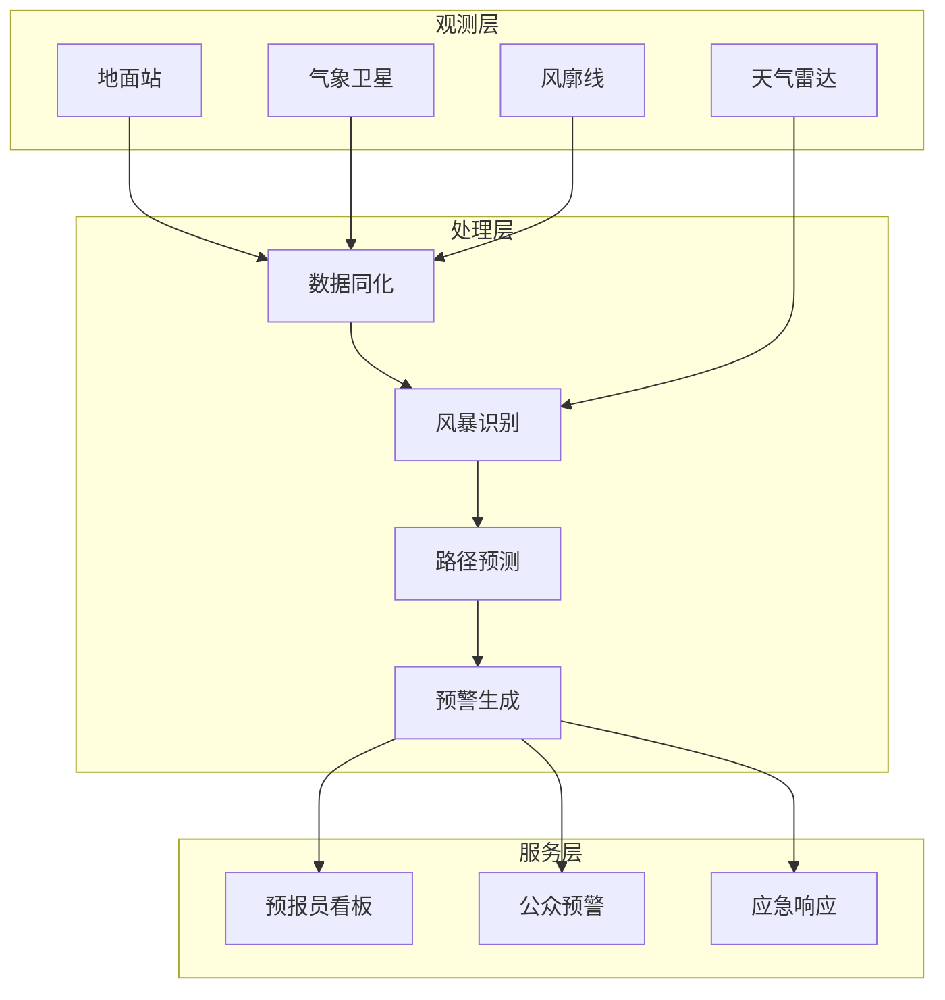

# 算子与实时气象预警

> **所属阶段**: Knowledge/10-case-studies | **前置依赖**: [01.06-single-input-operators.md](../01-concept-atlas/operator-deep-dive/01.06-single-input-operators.md), [realtime-environmental-monitoring-case-study.md](../10-case-studies/realtime-environmental-monitoring-case-study.md) | **形式化等级**: L3
> **文档定位**: 流处理算子在实时气象数据处理、极端天气预警与气候趋势分析中的算子指纹与Pipeline设计
> **版本**: 2026.04

---

## 目录

- [1. 概念定义 (Definitions)](#1-概念定义-definitions)
- [2. 属性推导 (Properties)](#2-属性推导-properties)
- [3. 关系建立 (Relations)](#3-关系建立-relations)
- [4. 论证过程 (Argumentation)](#4-论证过程-argumentation)
- [5. 形式证明 / 工程论证 (Proof / Engineering Argument)](#5-形式证明--工程论证-proof--engineering-argument)
- [6. 实例验证 (Examples)](#6-实例验证-examples)
- [7. 可视化 (Visualizations)](#7-可视化-visualizations)
- [8. 引用参考 (References)](#8-引用参考-references)

---

## 1. 概念定义 (Definitions)

### Def-WTH-01-01: 气象观测网（Meteorological Observation Network）

气象观测网是分布在全球的自动化气象站、雷达和卫星组成的监测体系：

$$\text{ObsNet} = \{s_i : (\text{type}_i, \text{lat}_i, \text{lon}_i, \text{frequency}_i)\}_{i=1}^{n}$$

### Def-WTH-01-02: 数值天气预报（Numerical Weather Prediction, NWP）

NWP是基于物理方程的大气状态模拟：

$$\frac{\partial \mathbf{u}}{\partial t} = -(\mathbf{u} \cdot \nabla)\mathbf{u} - \frac{1}{\rho}\nabla p + \nu\nabla^2\mathbf{u} + \mathbf{g}$$

### Def-WTH-01-03: 强对流预警（Severe Convection Warning）

强对流预警是对雷暴、冰雹、龙卷等天气的提前预报：

$$\text{Warning} = P(\text{Event}) > \theta_{warning} \land \text{LeadTime} > T_{min}$$

### Def-WTH-01-04: 降水概率（Probability of Precipitation, PoP）

$$\text{PoP} = C \times A$$

其中 $C$ 为预报区域降水置信度，$A$ 为区域降水覆盖率。

### Def-WTH-01-05: 雷达反射率（Radar Reflectivity）

雷达反射率与降水强度的关系：

$$Z = a \cdot R^b$$

其中 $Z$ 为反射率（dBZ），$R$ 为雨强（mm/h），典型值 $a=200, b=1.6$。

---

## 2. 属性推导 (Properties)

### Lemma-WTH-01-01: 天气预报的可预报性极限

大气 Lorenz 系统的 Lyapunov 指数：

$$\lambda_1 \approx 0.3 \text{ day}^{-1}$$

可预报性上限约 $1/\lambda_1 \approx 3-5$ 天。

### Lemma-WTH-01-02: 雷达数据的空间分辨率

雷达波束宽度：

$$\Delta r = r \cdot \theta_{beam}$$

其中 $\theta_{beam} \approx 1°$，$r$ 为距离。100km处分辨率约1.7km。

### Prop-WTH-01-01: 集合预报的Brier技巧评分

$$\text{BSS} = 1 - \frac{\text{BS}_{forecast}}{\text{BS}_{climatology}}$$

BSS > 0 表示预报优于气候平均。

### Prop-WTH-01-02: 预警提前期与准确率权衡

| 提前期 |  tornado 准确率 | 暴雨准确率 |
|--------|----------------|-----------|
| 0-15min | 85% | 90% |
| 15-60min | 70% | 80% |
| 1-6h | 50% | 65% |
| 6-24h | 30% | 50% |

---

## 3. 关系建立 (Relations)

### 3.1 气象预警Pipeline算子映射

| 应用场景 | 算子组合 | 数据源 | 延迟要求 |
|---------|---------|--------|---------|
| **数据同化** | AsyncFunction + map | 观测+模型 | < 1h |
| **强对流识别** | ProcessFunction | 雷达回波 | < 5min |
| **预警生成** | Broadcast + map | 阈值规则 | < 1min |
| **影响评估** | window+aggregate | 人口/资产 | < 10min |
| **公众发布** | AsyncFunction | 多渠道 | < 30s |

### 3.2 算子指纹

| 维度 | 气象预警特征 |
|------|------------|
| **核心算子** | AsyncFunction（NWP调用）、ProcessFunction（雷达特征提取）、BroadcastProcessFunction（预警规则）、window+aggregate（统计） |
| **状态类型** | ValueState（站点历史）、MapState（预警区域）、BroadcastState（阈值配置） |
| **时间语义** | 事件时间（观测时间戳） |
| **数据特征** | 高维（多变量）、大体积（雷达体扫）、强空间相关 |
| **状态规模** | 按格点分Key，区域级可达百万级 |
| **性能瓶颈** | NWP模型计算、雷达数据解码 |

---

## 4. 论证过程 (Argumentation)

### 4.1 为什么气象需要流处理而非传统批处理

传统批处理的问题：
- 小时级更新：强对流天气发展快，小时级更新滞后
- 固定网格：无法动态调整关注区域
- 人工判读：预报员工作强度大

流处理的优势：
- 分钟级更新：雷达每6分钟一次扫描，实时分析
- 自动识别：算法自动检测对流特征
- 动态预警：根据实况自动调整预警级别

### 4.2 多源数据同化的挑战

**问题**: 地面站、雷达、卫星、飞机观测的时间和空间分辨率各异。

**方案**:
1. **时间插值**: 将各观测统一到分析时刻
2. **空间降尺度**: 将粗分辨率数据插值到细网格
3. **质量质控**: 剔除异常观测

### 4.3 预警误报的控制

**问题**: 高灵敏度导致大量误报，公众信任度下降。

**方案**: 采用分级预警（蓝/黄/橙/红），结合实况验证动态调整阈值。

---

## 5. 形式证明 / 工程论证 (Proof / Engineering Argument)

### 5.1 雷达回波实时处理

```java
// 雷达体扫数据流
DataStream<RadarSweep> radar = env.addSource(new RadarSource());

// 回波特征提取
radar.keyBy(RadarSweep::getRadarId)
    .process(new KeyedProcessFunction<String, RadarSweep, StormCell>() {
        private ValueState<StormHistory> stormState;
        
        @Override
        public void processElement(RadarSweep sweep, Context ctx, Collector<StormCell> out) throws Exception {
            // 提取反射率>40dBZ的区域
            List<StormCell> cells = extractCells(sweep, 40.0);
            
            StormHistory history = stormState.value();
            if (history == null) history = new StormHistory();
            
            for (StormCell cell : cells) {
                StormCell tracked = history.track(cell);
                
                // 计算移动速度和方向
                if (tracked.getAge() > 2) {
                    double speed = tracked.getSpeed();
                    double direction = tracked.getDirection();
                    
                    // 外推30分钟位置
                    double[] futurePos = extrapolate(tracked.getLat(), tracked.getLon(), speed, direction, 30);
                    
                    out.collect(new StormCell(tracked.getId(), tracked.getMaxReflectivity(),
                        futurePos[0], futurePos[1], "PREDICTED", ctx.timestamp()));
                }
            }
            
            stormState.update(history);
        }
    })
    .addSink(new StormTrackingSink());
```

### 5.2 强对流自动预警

```java
// 风暴单元流
DataStream<StormCell> storms = env.addSource(new StormTrackingSource());

// 预警规则引擎
storms.keyBy(StormCell::getId)
    .connect(warningRulesBroadcast)
    .process(new BroadcastProcessFunction<StormCell, WarningRule, WeatherWarning>() {
        @Override
        public void processElement(StormCell cell, ReadOnlyContext ctx, Collector<WeatherWarning> out) {
            ReadOnlyBroadcastState<String, WarningRule> rules = ctx.getBroadcastState(RULE_DESCRIPTOR);
            
            for (Map.Entry<String, WarningRule> entry : rules.immutableEntries()) {
                WarningRule rule = entry.getValue();
                
                if (rule.matches(cell)) {
                    String level = rule.getWarningLevel(cell);
                    out.collect(new WeatherWarning(
                        cell.getId(), rule.getType(), level,
                        cell.getLat(), cell.getLon(),
                        cell.getPredictedTime(), ctx.timestamp()
                    ));
                }
            }
        }
        
        @Override
        public void processBroadcastElement(WarningRule rule, Context ctx, Collector<WeatherWarning> out) {
            ctx.getBroadcastState(RULE_DESCRIPTOR).put(rule.getType(), rule);
        }
    })
    .addSink(new WarningDistributionSink());
```

### 5.3 影响区域人口评估

```java
// 预警流
DataStream<WeatherWarning> warnings = env.addSource(new WarningSource());

// 影响评估
warnings.map(new MapFunction<WeatherWarning, ImpactAssessment>() {
    @Override
    public ImpactAssessment map(WeatherWarning warning) {
        // 查询受影响区域人口
        double affectedArea = Math.PI * Math.pow(warning.getRadius(), 2);
        int population = queryPopulation(warning.getLat(), warning.getLon(), warning.getRadius());
        int economicValue = queryGDP(warning.getLat(), warning.getLon(), warning.getRadius());
        
        return new ImpactAssessment(warning.getId(), affectedArea, population, economicValue, warning.getTimestamp());
    }
})
.addSink(new EmergencyResponseSink());
```

---

## 6. 实例验证 (Examples)

### 6.1 实战：城市强对流监测预警

```java
// 1. 多雷达数据接入
DataStream<RadarSweep> radarData = env.addSource(new RadarNetworkSource());

// 2. 风暴识别与跟踪
DataStream<StormCell> storms = radarData
    .keyBy(RadarSweep::getRadarId)
    .process(new StormTrackingFunction());

// 3. 自动预警
storms.connect(warningRulesBroadcast)
    .process(new SevereWeatherWarningFunction())
    .addSink(new PublicAlertSink());

// 4. 影响评估
DataStream<WeatherWarning> warnings = env.addSource(new WarningSource());
warnings.map(new ImpactAssessmentFunction())
    .addSink(new EmergencyCommandSink());
```

---

## 7. 可视化 (Visualizations)

### 气象预警Pipeline



---

## 8. 引用参考 (References)

[^1]: WMO, "Guidelines for Nowcasting Techniques", https://www.wmo.int/

[^2]: NOAA, "National Severe Weather Service", https://www.weather.gov/

[^3]: ECMWF, "Numerical Weather Prediction", https://www.ecmwf.int/

[^4]: Wikipedia, "Numerical Weather Prediction", https://en.wikipedia.org/wiki/Numerical_weather_prediction

[^5]: Wikipedia, "Weather Radar", https://en.wikipedia.org/wiki/Weather_radar

---

*关联文档*: [01.06-single-input-operators.md](../01-concept-atlas/operator-deep-dive/01.06-single-input-operators.md) | [realtime-environmental-monitoring-case-study.md](../10-case-studies/realtime-environmental-monitoring-case-study.md) | [realtime-iot-stream-processing-case-study.md](../06-frontier/operator-iot-stream-processing.md)
