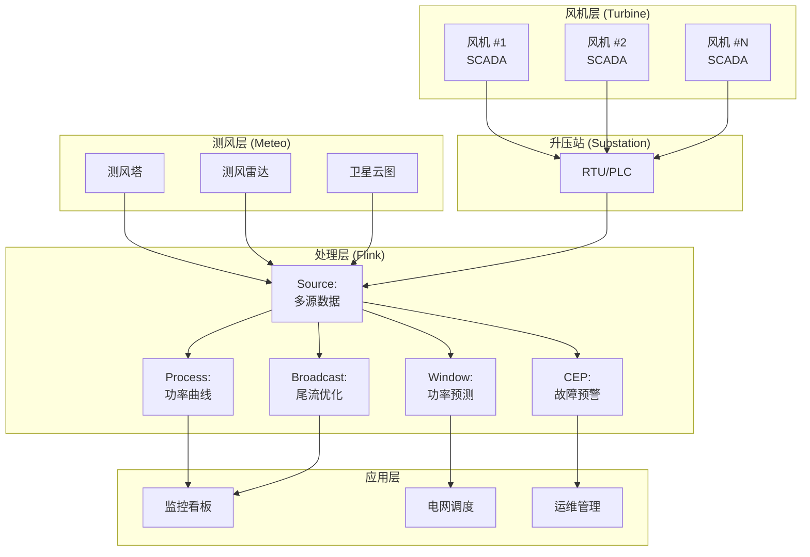
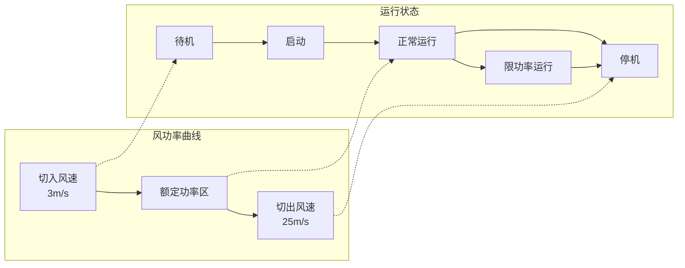
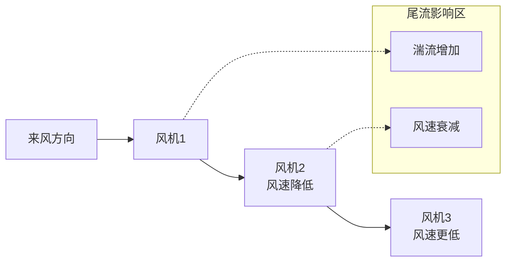

# 实时智能风电场监控与功率预测案例研究

> 所属阶段: Knowledge/ Flink/ | 前置依赖: [算子全景分类](../01-concept-atlas/operator-deep-dive/01.06-single-input-operators.md) | [IoT流处理](../06-frontier/operator-iot-stream-processing.md) | 形式化等级: L4

## 1. 概念定义 (Definitions)

### Def-WND-01-01: 智能风电场监控系统 (Smart Wind Farm Monitoring System)

智能风电场监控系统是通过风机SCADA系统、气象塔测风设备和流计算平台，对风机运行状态、风资源、发电功率进行实时监测、预测与优化调度的集成系统。

$$\mathcal{W} = (T, M, P, E, F)$$

其中 $T$ 为风机状态数据流，$M$ 为气象数据流，$P$ 为功率输出流，$E$ 为电网调度指令流，$F$ 为流计算处理拓扑。

### Def-WND-01-02: 风功率曲线 (Wind Power Curve)

风功率曲线描述风机输出功率与轮毂高度处风速的函数关系：

$$P(v) = \begin{cases}
0 & v < v_{cut-in} \\
\frac{1}{2} \rho A C_p(v) v^3 & v_{cut-in} \leq v < v_{rated} \\
P_{rated} & v_{rated} \leq v < v_{cut-out} \\
0 & v \geq v_{cut-out}
\end{cases}$$

其中 $v_{cut-in}$ 为切入风速（~3 m/s），$v_{rated}$ 为额定风速（~12 m/s），$v_{cut-out}$ 为切出风速（~25 m/s），$\rho$ 为空气密度，$A$ 为扫风面积，$C_p$ 为功率系数（Betz极限 $C_p \leq 16/27 \approx 0.593$）。

### Def-WND-01-03: 功率预测精度指标 (Power Forecast Accuracy Metrics)

功率预测精度常用归一化平均绝对误差（NMAE）和均方根误差（NRMSE）衡量：

$$NMAE = \frac{1}{N \cdot P_{installed}} \sum_{i=1}^{N} |P_{actual,i} - P_{forecast,i}|$$

$$NRMSE = \frac{1}{P_{installed}} \sqrt{\frac{1}{N} \sum_{i=1}^{N} (P_{actual,i} - P_{forecast,i})^2}$$

行业要求：超短期预测（4小时内）NMAE < 10%，短期预测（72小时内）NMAE < 15%。

### Def-WND-01-04: 风机可利用率 (Turbine Availability)

风机可利用率定义为统计周期内风机可用小时数与总小时数的比率：

$$Availability = \frac{T_{available}}{T_{total}} \cdot 100\%$$

不可用状态包括：故障停机、计划检修、限电弃风、极端天气保护性停机。行业优秀水平：$Availability \geq 97\%$。

### Def-WND-01-05: 尾流效应 (Wake Effect)

尾流效应是指上游风机吸收风能后，下游风机所处位置风速降低、湍流增大的现象：

$$v_{downstream} = v_{upstream} \cdot \left(1 - (1 - \sqrt{1 - C_T}) \cdot \left(\frac{D}{D + kx}\right)^2\right)$$

其中 $C_T$ 为推力系数，$D$ 为叶轮直径，$x$ 为下游距离，$k$ 为尾流扩散系数（陆上风场~0.075，海上风场~0.05）。

## 2. 属性推导 (Properties)

### Lemma-WND-01-01: 风速预测的 persists 技能分数下界

 persists 模型（假设未来风速等于当前风速）的NMAE为：

$$NMAE_{persists} \approx \frac{\sigma_v \cdot \sqrt{2(1 - \rho_{\Delta t})}}{P_{installed}/A_{rated}}$$

其中 $\sigma_v$ 为风速标准差，$\rho_{\Delta t}$ 为时间滞后 $\Delta t$ 的自相关系数。

**证明**: persists 模型预测误差 $e_t = v_{t+\Delta t} - v_t$。误差方差 $Var(e) = 2\sigma_v^2(1 - \rho_{\Delta t})$。由功率曲线的非线性，需通过泰勒展开近似。

### Lemma-WND-01-02: 风机群控的尾流损失下界

在均匀来流且风机呈规则阵列布置时，尾流导致的总功率损失下界：

$$\eta_{wake} \geq 1 - \frac{N_{rows} - 1}{N_{rows}} \cdot (1 - \sqrt{1 - C_T}) \cdot \left(\frac{D}{D + kS}\right)^2$$

其中 $N_{rows}$ 为风机行数，$S$ 为行间距。

**证明**: 每行风机受上游所有行尾流影响。简化模型假设尾流线性叠加，由 Jensen 尾流模型推导得上述下界。

### Prop-WND-01-01: 偏航优化的年发电量增益

通过实时偏航控制使风机始终对风，年发电量（AEP）增益：

$$\Delta AEP = AEP_{perfect} \cdot (1 - \cos^{3}\theta_{yaw\_error})$$

**论证**: 偏航误差 $\theta_{yaw\_error}$ 导致有效风速降低 $v_{effective} = v \cdot \cos\theta$。功率与风速立方成正比，故功率损失比例为 $1 - \cos^3\theta$。

### Prop-WND-01-02: 齿轮箱温度预警的提前期

基于振动和温度趋势分析的齿轮箱故障预警提前期：

$$T_{lead} = \frac{T_{threshold} - T_{current}}{dT/dt}$$

**条件**: 温度上升速率 $dT/dt$ 需稳定持续超过24小时，排除偶发因素（如环境温度突升）。

## 3. 关系建立 (Relations)

### 与算子体系的映射

| 风电场场景 | Flink算子 | 算子作用 |
|------------|-----------|---------|
| SCADA数据接入 | `SourceFunction` | 风机Modbus/TCP数据接入 |
| 功率曲线拟合 | `KeyedProcessFunction` | 按风机键控，维护功率曲线 |
| 功率预测 | `WindowAggregate` | 滑动窗口内统计预测 |
| 尾流计算 | `BroadcastStream` | 风况广播到各风机节点 |
| 故障预警 | `CEPPattern` | 温度/振动异常模式匹配 |
| 电网调度 | `AsyncFunction` | 调用AGC/AVC接口 |
| 报表生成 | `WindowAggregate` + `Sink` | 日/月发电量统计 |

### 与电网标准的关联

- **GB/T 19963**: 风电场接入电力系统技术规定
- **Q/GDW 588**: 风电功率预测功能规范
- **IEC 61400-25**: 风电场通信与监控
- **IEEE 1547**: 分布式资源并网标准

## 4. 论证过程 (Argumentation)

### 4.1 风电场监控的核心挑战

**挑战1: 数据量大且维度多**
单台风机每秒产生数百个SCADA变量（风速、功率、转速、桨距角、温度、振动等）。百台风电场峰值数据率可达10万+变量/秒。

**挑战2: 功率预测的不确定性**
风速预测误差随预见期增加而增大。数值天气预报（NWP）的空间分辨率（通常3-9km）远大于风场尺度（几十km²），需进行降尺度处理。

**挑战3: 风机故障的多样性**
齿轮箱、发电机、变频器、叶片、偏航系统均可能发生故障。不同故障的前期征兆不同，需多传感器融合诊断。

**挑战4: 电网调度的实时性**
电网要求风电场在秒级响应AGC（自动发电控制）指令，调整有功功率输出。弃风限电时需在分钟内完成功率下调。

### 4.2 方案选型论证

**为什么选用流计算而非传统SCADA？**
- 传统SCADA为秒级刷新，无法满足功率预测的分钟级更新需求
- 流计算支持复杂事件处理（故障模式匹配、尾流优化）
- Flink的精确一次语义保证发电数据不丢失，满足电费结算要求

**为什么选用滑动窗口做功率预测？**
- 风速具有显著的自相关性和周期性（日变化、季节变化）
- 滑动窗口提供连续的预测序列，支持电网调度决策
- 不同预见期（15分钟/4小时/24小时）对应不同窗口大小

## 5. 形式证明 / 工程论证 (Proof / Engineering Argument)

### Thm-WND-01-01: 风电场最优布局定理

在满足土地约束和尾流损失的条件下，风机最优间距定理：

**定理**: 在风向均匀分布的假设下，风机最优行间距 $S_{row}$ 和列间距 $S_{col}$ 满足：

$$\frac{\partial (P_{total} - C_{land} \cdot A_{land})}{\partial S} = 0$$

其中 $P_{total}$ 为总发电量，$C_{land}$ 为土地成本，$A_{land}$ 为占地面积。

**解析解**: 当土地成本可忽略时，最优行间距 $S_{row}^* \approx 7D$-10$D$（$D$ 为叶轮直径），最优列间距 $S_{col}^* \approx 3D$-5$D$。

**证明概要**:
1. 总功率 $P_{total} = \sum_{i} P(v_i^{effective})$
2. 有效风速 $v_i^{effective} = v_{ambient} - \Delta v_{wake}(S_{row}, S_{col})$
3. 尾流损失 $\Delta v_{wake}$ 随间距增大而减小
4. 土地面积 $A_{land} \propto S_{row} \cdot S_{col}$
5. 求导并令其为零得最优间距

**工程意义**: 陆上风电场通常采用 $5D$-$9D$ 间距，海上风电场因尾流恢复更快，可采用 $7D$-$10D$ 间距。

## 6. 实例验证 (Examples)

### 6.1 风机SCADA实时处理Pipeline

```java
// Wind turbine SCADA real-time processing
StreamExecutionEnvironment env = StreamExecutionEnvironment.getExecutionEnvironment();
env.setStreamTimeCharacteristic(TimeCharacteristic.EventTime);

// SCADA data from wind turbines
DataStream<ScadaReading> scadaStream = env
    .addSource(new ModbusSource("wind.farm.scada", 502))
    .map(new ScadaParser())
    .assignTimestampsAndWatermarks(
        WatermarkStrategy.<ScadaReading>forBoundedOutOfOrderness(
            Duration.ofSeconds(5))
        .withTimestampAssigner((r, ts) -> r.getTimestamp())
    );

// Power curve monitoring per turbine
DataStream<PowerCurvePoint> powerCurves = scadaStream
    .keyBy(r -> r.getTurbineId())
    .process(new PowerCurveFunction() {
        private ValueState<PowerCurveModel> curveState;

        @Override
        public void open(Configuration parameters) {
            curveState = getRuntimeContext().getState(
                new ValueStateDescriptor<>("curve", PowerCurveModel.class));
        }

        @Override
        public void processElement(ScadaReading reading, Context ctx,
                                   Collector<PowerCurvePoint> out) throws Exception {
            PowerCurveModel curve = curveState.value();
            if (curve == null) curve = new PowerCurveModel(reading.getTurbineId());

            double windSpeed = reading.getWindSpeed();
            double power = reading.getActivePower();

            // Only use normal operation data
            if (reading.getStatus().equals("OPERATING") && power >= 0) {
                curve.addPoint(windSpeed, power);

                // Check for power curve deviation
                double expectedPower = curve.getExpectedPower(windSpeed);
                double deviation = Math.abs(power - expectedPower) / expectedPower;

                if (deviation > 0.15) {
                    ctx.output(deviationTag, new PowerDeviationAlert(
                        reading.getTurbineId(), windSpeed, power,
                        expectedPower, deviation, ctx.timestamp()
                    ));
                }
            }

            curveState.update(curve);
            out.collect(new PowerCurvePoint(
                reading.getTurbineId(), windSpeed, power, ctx.timestamp()
            ));
        }
    });

powerCurves.getSideOutput(deviationTag).addSink(new MaintenanceSink());
```

### 6.2 超短期功率预测

```java
// Ultra-short-term power forecasting
DataStream<MeteoData> meteoData = env
    .addSource(new MeteoTowerSource())
    .assignTimestampsAndWatermarks(
        WatermarkStrategy.<MeteoData>forBoundedOutOfOrderness(
            Duration.ofMinutes(5))
    );

// Aggregate farm-level power and wind
DataStream<FarmAggregate> farmAgg = scadaStream
    .keyBy(r -> r.getFarmId())
    .window(TumblingEventTimeWindows.of(Time.minutes(15)))
    .aggregate(new FarmAggregationFunction());

// Power forecast using persistence + trend
DataStream<PowerForecast> forecasts = farmAgg
    .keyBy(a -> a.getFarmId())
    .process(new PowerForecastFunction() {
        private ValueState<FarmHistory> historyState;

        @Override
        public void open(Configuration parameters) {
            historyState = getRuntimeContext().getState(
                new ValueStateDescriptor<>("history", FarmHistory.class));
        }

        @Override
        public void processElement(FarmAggregate agg, Context ctx,
                                   Collector<PowerForecast> out) throws Exception {
            FarmHistory history = historyState.value();
            if (history == null) history = new FarmHistory();

            history.add(agg);

            // Persistence model: P(t+Δt) = P(t) + trend
            double currentPower = agg.getTotalPower();
            double trend = history.getTrend();

            // Forecast for next 4 hours at 15-min intervals
            for (int i = 1; i <= 16; i++) {
                double forecastPower = currentPower + trend * i;
                forecastPower = Math.max(0, Math.min(forecastPower, agg.getInstalledCapacity()));

                out.collect(new PowerForecast(
                    agg.getFarmId(), forecastPower,
                    ctx.timestamp() + i * 15 * 60 * 1000,
                    "PERSISTENCE_TREND", i * 15
                ));
            }

            historyState.update(history);
        }
    });

forecasts.addSink(new GridDispatchSink());
```

### 6.3 风机故障预警

```java
// Wind turbine fault early warning
Pattern<ScadaReading, ?> gearboxFaultPattern = Pattern
    .<ScadaReading>begin("temp-rise")
    .where(new SimpleCondition<ScadaReading>() {
        @Override
        public boolean filter(ScadaReading r) {
            return r.getGearboxTemp() > 80; // °C
        }
    })
    .next("vibration-high")
    .where(new SimpleCondition<ScadaReading>() {
        @Override
        public boolean filter(ScadaReading r) {
            return r.getGearboxVibration() > 5.0; // mm/s
        }
    })
    .next("oil-degradation")
    .where(new SimpleCondition<ScadaReading>() {
        @Override
        public boolean filter(ScadaReading r) {
            return r.getOilQuality() < 0.7; // degradation index
        }
    })
    .within(Time.hours(24));

PatternStream<ScadaReading> faultPatternStream = CEP.pattern(
    scadaStream.keyBy(r -> r.getTurbineId()),
    gearboxFaultPattern
);

DataStream<FaultWarning> faultWarnings = faultPatternStream
    .process(new PatternHandler<ScadaReading, FaultWarning>() {
        @Override
        public void processMatch(Map<String, List<ScadaReading>> match,
                                Context ctx, Collector<FaultWarning> out) {
            ScadaReading tempReading = match.get("temp-rise").get(0);
            out.collect(new FaultWarning(
                tempReading.getTurbineId(), "GEARBOX_FAULT",
                "Gearbox temperature, vibration, and oil quality all abnormal",
                tempReading.getTimestamp(),
                "HIGH"
            ));
        }
    });

faultWarnings.addSink(new MaintenanceSchedulerSink());
```

## 7. 可视化 (Visualizations)

### 图1: 风电场实时监控架构



### 图2: 风功率曲线与运行区域



### 图3: 尾流效应示意图



## 8. 引用参考 (References)

[^1]: GB/T 19963-2011, "风电场接入电力系统技术规定", 2011.
[^2]: Q/GDW 588-2011, "风电功率预测功能规范", 2011.
[^3]: IEC 61400-25, "Communications for Monitoring and Control of Wind Power Plants", 2017.
[^4]: N. O. Jensen, "A Note on Wind Generator Interaction", Risø National Laboratory, 1983.
[^5]: J. Zhang et al., "Short-term Wind Power Forecasting Using Deep Learning", IEEE TPWRS, 2020.
[^6]: G. Mosetti et al., "Optimization of Wind Turbine Positioning in Large Windfarms by Means of a Genetic Algorithm", Journal of Wind Engineering, 1994.
