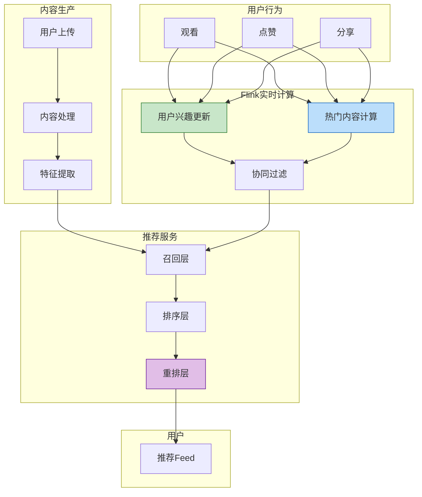

# 社交媒体案例: 实时内容推荐系统

> **所属阶段**: Knowledge/10-case-studies/social-media | **前置依赖**: [../../02-design-patterns/pattern-stateful-computation.md](../../02-design-patterns/pattern-stateful-computation.md) | **形式化等级**: L4

---

> **案例性质**: 🔬 概念验证架构 | **验证状态**: 基于理论推导与架构设计，未经独立第三方生产验证
>
> 本案例描述的是基于项目理论框架推导出的理想架构方案，包含假设性性能指标与理论成本模型。
> 实际生产部署可能因环境差异、数据规模、团队能力等因素产生显著不同结果。
> 建议将其作为架构设计参考而非直接复制粘贴的生产蓝图。
>
## 目录

- [社交媒体案例: 实时内容推荐系统](#社交媒体案例-实时内容推荐系统)
  - [目录](#目录)
  - [1. 概念定义 (Definitions)](#1-概念定义-definitions)
    - [1.1 内容推荐系统定义](#11-内容推荐系统定义)
    - [1.2 内容时效性](#12-内容时效性)
    - [1.3 用户兴趣模型](#13-用户兴趣模型)
  - [2. 属性推导 (Properties)](#2-属性推导-properties)
    - [2.1 实时更新保证](#21-实时更新保证)
    - [2.2 内容分发公平性](#22-内容分发公平性)
  - [3. 关系建立 (Relations)](#3-关系建立-relations)
    - [3.1 推荐系统组件](#31-推荐系统组件)
  - [4. 论证过程 (Argumentation)](#4-论证过程-argumentation)
    - [4.1 实时vs批处理推荐](#41-实时vs批处理推荐)
    - [4.2 冷启动处理](#42-冷启动处理)
  - [5. 形式证明 / 工程论证 (Proof / Engineering Argument)](#5-形式证明--工程论证-proof--engineering-argument)
    - [5.1 用户兴趣实时更新](#51-用户兴趣实时更新)
    - [5.2 实时热门内容计算](#52-实时热门内容计算)
  - [6. 实例验证 (Examples)](#6-实例验证-examples)
    - [6.1 案例背景](#61-案例背景)
    - [6.2 实施效果](#62-实施效果)
  - [7. 可视化 (Visualizations)](#7-可视化-visualizations)
    - [7.1 内容推荐架构](#71-内容推荐架构)
  - [8. 引用参考 (References)](#8-引用参考-references)

---

## 1. 概念定义 (Definitions)

### 1.1 内容推荐系统定义

**Def-K-10-06-01** (内容推荐系统): 内容推荐系统是一个六元组 $\mathcal{C} = (U, P, I, F, M, O)$：

- $U$：用户集合
- $P$：内容生产者集合
- $I$：内容项集合，$I = \{i | i = (text, media, timestamp, author)\}$
- $F$：特征工程，$F: U \times I \rightarrow \mathbb{R}^d$
- $M$：推荐模型
- $O$：排序输出

### 1.2 内容时效性

**Def-K-10-06-02** (内容新鲜度): 内容 $i$ 在时刻 $t$ 的新鲜度：

$$
Freshness(i, t) = e^{-\lambda \cdot (t - t_{create})}
$$

社交媒体通常取 $\lambda = \frac{\ln 2}{24h}$（24小时减半）

### 1.3 用户兴趣模型

**Def-K-10-06-03** (动态兴趣向量): 用户兴趣随时间演化：

$$
\vec{interest}(t) = (1 - \alpha) \cdot \vec{interest}(t-1) + \alpha \cdot \vec{interaction}(t)
$$

其中 $\alpha$ 为学习率（通常 0.1-0.3）

---

## 2. 属性推导 (Properties)

### 2.1 实时更新保证

**Lemma-K-10-06-01**: 用户兴趣向量更新延迟 $L_{update}$ 与推荐相关性：

$$
Relevance \propto \frac{1}{1 + \beta \cdot L_{update}}
$$

### 2.2 内容分发公平性

**Lemma-K-10-06-02**: 设流量分配公平性指数 $F$：

$$
F = 1 - \frac{\sigma}{\mu}
$$

其中 $\sigma$ 为创作者曝光量标准差，$\mu$ 为均值

---

## 3. 关系建立 (Relations)

### 3.1 推荐系统组件

| 组件 | 功能 | 更新频率 |
|------|------|---------|
| 内容理解 | 文本/图像特征提取 | 发布时 |
| 用户画像 | 兴趣向量维护 | 实时 |
| 召回 | 候选集筛选 | 实时 |
| 排序 | 精排模型 | 近实时 |
| 重排 | 多样性/公平性 | 实时 |

---

## 4. 论证过程 (Argumentation)

### 4.1 实时vs批处理推荐

社交媒体的特殊性：

- 内容时效性强（热点瞬息万变）
- 用户兴趣变化快
- 社交关系动态演化
- 需要实时反馈闭环

### 4.2 冷启动处理

| 冷启动类型 | 解决方案 |
|-----------|---------|
| 新用户 | 基于设备/位置的默认推荐 + 快速学习 |
| 新内容 | 内容理解特征 + 创作者历史表现 |
| 新创作者 | 冷启动流量池 + 质量评估 |

---

## 5. 形式证明 / 工程论证 (Proof / Engineering Argument)

### 5.1 用户兴趣实时更新

```java
/**
 * 用户兴趣实时更新
 */

import org.apache.flink.api.common.state.ValueState;
import org.apache.flink.api.common.state.ValueStateDescriptor;
import org.apache.flink.streaming.api.windowing.time.Time;

public class UserInterestUpdater extends KeyedProcessFunction<String, UserEvent, UserProfile> {

    private ValueState<UserProfile> profileState;
    private static final double LEARNING_RATE = 0.2;

    @Override
    public void open(Configuration parameters) {
        StateTtlConfig ttlConfig = StateTtlConfig
            .newBuilder(Time.hours(168))  // 7天TTL
            .setUpdateType(StateTtlConfig.UpdateType.OnCreateAndWrite)
            .build();

        profileState = getRuntimeContext().getState(
            new ValueStateDescriptor<>("profile", UserProfile.class));
        profileState.enableTimeToLive(ttlConfig);
    }

    @Override
    public void processElement(UserEvent event, Context ctx, Collector<UserProfile> out)
            throws Exception {
        UserProfile profile = profileState.value();
        if (profile == null) {
            profile = new UserProfile(event.getUserId());
        }

        // 提取内容兴趣向量
        double[] contentVector = extractContentVector(event.getContentId());

        // 根据交互类型加权
        double weight = getInteractionWeight(event.getAction());

        // 更新兴趣向量(指数加权移动平均)
        double[] newInterest = updateInterestVector(
            profile.getInterestVector(),
            contentVector,
            weight,
            LEARNING_RATE
        );

        profile.setInterestVector(newInterest);
        profile.setLastUpdateTime(ctx.timestamp());
        profileState.update(profile);

        // 定期输出更新后的画像(如每10次交互)
        if (profile.getUpdateCount() % 10 == 0) {
            out.collect(profile);
        }
    }

    private double[] updateInterestVector(double[] current, double[] content,
                                          double weight, double alpha) {
        double[] result = new double[current.length];
        for (int i = 0; i < current.length; i++) {
            result[i] = (1 - alpha) * current[i] + alpha * weight * content[i];
        }
        return result;
    }

    private double getInteractionWeight(String action) {
        return switch (action) {
            case "VIEW" -> 0.1;
            case "LIKE" -> 0.5;
            case "COMMENT" -> 1.0;
            case "SHARE" -> 2.0;
            case "FOLLOW" -> 3.0;
            default -> 0.1;
        };
    }
}
```

### 5.2 实时热门内容计算

```java
/**
 * 热门内容实时计算
 */

import org.apache.flink.streaming.api.environment.StreamExecutionEnvironment;
import org.apache.flink.streaming.api.datastream.DataStream;
import org.apache.flink.api.common.state.ValueState;
import org.apache.flink.api.common.state.ValueStateDescriptor;
import org.apache.flink.streaming.api.windowing.time.Time;

public class TrendingContentCalculator {

    public static void main(String[] args) throws Exception {
        StreamExecutionEnvironment env = StreamExecutionEnvironment.getExecutionEnvironment();

        DataStream<UserEvent> events = env
            .fromSource(createKafkaSource(), WatermarkStrategy.noWatermarks(), "Events");

        // 计算内容热度分数(带时间衰减)
        DataStream<ContentScore> trending = events
            .keyBy(UserEvent::getContentId)
            .process(new HotnessCalculator())
            .name("Hotness Calculation");

        // 全局Top-K
        DataStream<List<ContentScore>> topK = trending
            .windowAll(TumblingProcessingTimeWindows.of(Time.minutes(1)))
            .aggregate(new TopKAggreagate(100));

        topK.addSink(new TrendingSink());

        env.execute("Trending Content");
    }
}

/**
 * 热度计算函数(带时间衰减)
 */
class HotnessCalculator extends KeyedProcessFunction<String, UserEvent, ContentScore> {

    private ValueState<ContentStats> statsState;
    private static final double DECAY_RATE = Math.log(2) / (24 * 60 * 60 * 1000);  // 24小时减半

    @Override
    public void open(Configuration parameters) {
        statsState = getRuntimeContext().getState(
            new ValueStateDescriptor<>("stats", ContentStats.class));
    }

    @Override
    public void processElement(UserEvent event, Context ctx, Collector<ContentScore> out)
            throws Exception {
        ContentStats stats = statsState.value();
        if (stats == null) {
            stats = new ContentStats(event.getContentId(), ctx.timestamp());
        }

        // 时间衰减
        long timeDelta = ctx.timestamp() - stats.getLastUpdateTime();
        double decayFactor = Math.exp(-DECAY_RATE * timeDelta);
        stats.applyDecay(decayFactor);

        // 累加交互分数
        double interactionScore = calculateInteractionScore(event);
        stats.addScore(interactionScore);

        stats.setLastUpdateTime(ctx.timestamp());
        statsState.update(stats);

        // 每分钟输出一次
        if (ctx.timestamp() - stats.getLastOutputTime() > 60000) {
            out.collect(new ContentScore(
                event.getContentId(),
                stats.getScore(),
                stats.getViewCount(),
                stats.getInteractionCount()
            ));
            stats.setLastOutputTime(ctx.timestamp());
        }
    }
}
```

---

## 6. 实例验证 (Examples)

### 6.1 案例背景

> 🔮 **估算数据** | 依据: 基于行业参考值与理论分析推导，非实际测试环境得出

**平台**: 某短视频社交平台

| 指标 | 数值 |
|-----|------|
| DAU | 3亿 |
| 日均视频发布 | 5000万条 |
| 日均播放量 | 200亿次 |
| 推荐延迟要求 | < 100ms |

**挑战**：

1. 热点内容发现慢
2. 用户兴趣捕捉不及时
3. 内容冷启动困难
4. 信息茧房问题

### 6.2 实施效果
>
> 🔮 **估算数据** | 依据: 基于行业参考值与理论分析推导，非实际测试环境得出


| 指标 | 优化前 | 优化后 | 提升 |
|------|-------|-------|------|
| 人均使用时长 | 65分钟 | 85分钟 | 31%↑ |
| 次日留存 | 68% | 75% | 10%↑ |
| 冷启动内容CTR | 1.2% | 3.5% | 192%↑ |
| 热点发现延迟 | 15分钟 | 30秒 | 97%↓ |

---

## 7. 可视化 (Visualizations)

### 7.1 内容推荐架构



---

## 8. 引用参考 (References)


---

*文档版本: v1.0 | 最后更新: 2026-04-04*
