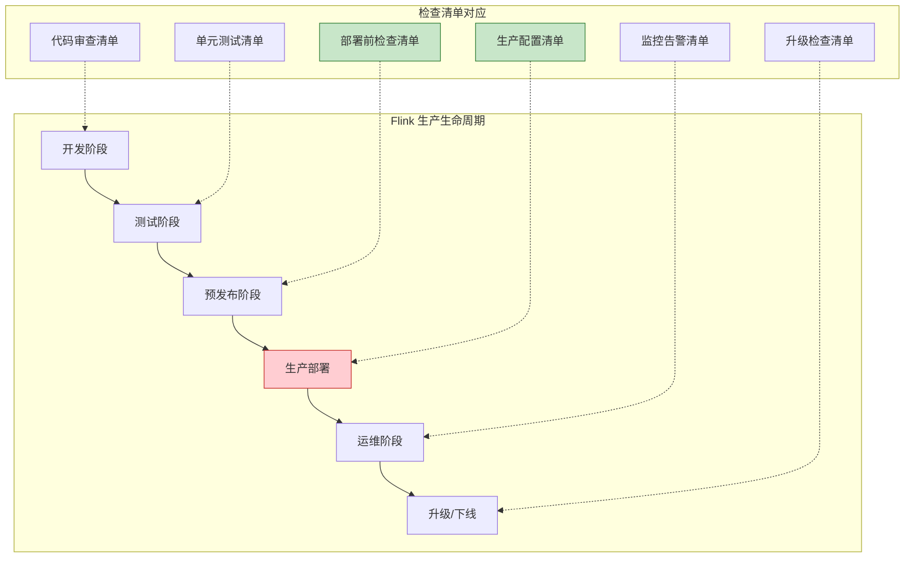
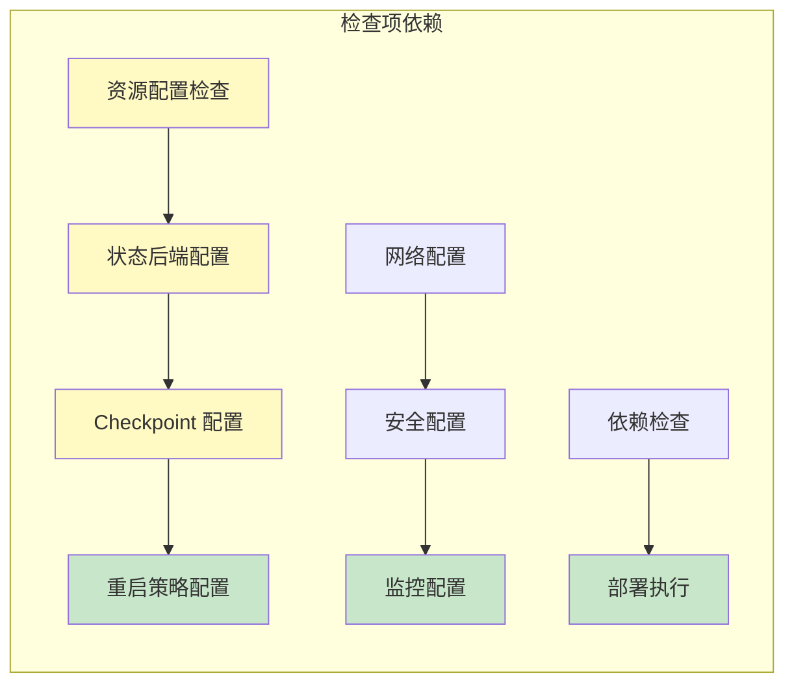
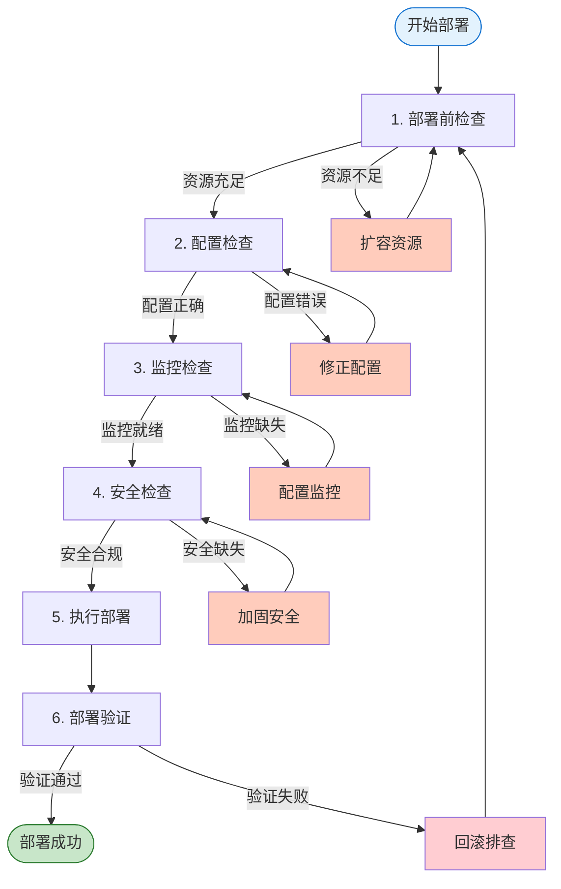

# Flink 生产环境部署检查清单

> **所属阶段**: Knowledge/ 工程实践 | **前置依赖**: [Flink/3.9-state-backends-deep-comparison.md](../Flink/3.9-state-backends-deep-comparison.md) | **形式化等级**: L3-L4
> **版本**: 2026.04 | **适用版本**: Flink 1.16+ - 2.5+ | **文档类型**: 可打印检查清单

---

## 1. 概念定义 (Definitions)

### Def-K-3.10-01: Production Readiness (生产就绪)

生产就绪定义为系统满足**功能正确性、性能稳定性、运维可观测性、安全合规性**四大维度的就绪状态：

```
ProductionReadiness = (FunctionalCorrectness, PerformanceStability, Observability, SecurityCompliance)

FunctionalCorrectness = (ExactlyOnceSemantics ∧ StateConsistency ∧ FaultTolerance)
PerformanceStability = (LatencySLA ∧ ThroughputSLA ∧ ResourceUtilization)
Observability = (MetricsAvailability ∧ LogCompleteness ∧ TracingCapability)
SecurityCompliance = (Authentication ∧ Encryption ∧ AccessControl)
```

### Def-K-3.10-02: Deployment Checklist (部署检查清单)

部署检查清单是确保 Flink 作业在生产环境**正确、稳定、安全**运行的结构化验证工具：

```
DeploymentChecklist = ⋃_{i=1}^n Category_i × Item_i × Status_i × Owner_i

Category ∈ {PreDeployment, Configuration, Monitoring, Security, Upgrade, DisasterRecovery}
Status ∈ {NotStarted, InProgress, Passed, Failed, N/A}
Owner ∈ {PlatformTeam, ApplicationTeam, SecurityTeam}
```

### Def-K-3.10-03: Critical Path Item (关键路径项)

关键路径项是**阻塞部署**的检查项，失败时必须解决后才能继续：

```
CriticalPathItem = {x ∈ Checklist | Severity(x) = Critical ∧ BlockDeployment(x) = true}

示例: 
- Checkpoint 配置缺失
- 状态后端未配置
- 内存配置不足 (可能导致 OOM)
```

---

## 2. 属性推导 (Properties)

### Lemma-K-3.10-01: 配置完备性与故障率关系

**引理**: 严格遵循检查清单的作业，生产故障率显著降低：

```
P(Failure | ChecklistCompleted) << P(Failure | ChecklistIncomplete)

经验数据:
- 完整检查: 首次部署成功率 > 95%
- 跳过检查: 首次部署成功率 < 70%
- 关键项遗漏: 生产事故概率增加 5-10x
```

### Lemma-K-3.10-02: 监控覆盖度与 MTTR 关系

**引理**: 监控指标覆盖度与平均恢复时间 (MTTR) 呈反比：

```
MTTR ∝ 1 / Coverage(MonitoringMetrics)

监控覆盖度评分:
- 基础监控 (CPU/内存): MTTR ~ 30-60 min
- 标准监控 (+Checkpoint/延迟): MTTR ~ 10-20 min
- 完整监控 (+JVM/ RocksDB): MTTR ~ 5-10 min
```

### Prop-K-3.10-01: 安全配置的必要条件

**命题**: 生产环境安全配置必须满足：

```
ProductionSecurity = KerberosEnabled ∨ (TLS_Everywhere ∧ RBAC_Configured)

即:
- Kerberos 认证启用，或
- 全链路 TLS + 基于角色的访问控制
```

---

## 3. 关系建立 (Relations)

### 检查清单与生产阶段关系



### 检查项依赖关系



---

## 4. 论证过程 (Argumentation)

### 生产故障根因分析

基于业界 Flink 生产故障统计，主要根因分布：

```
┌─────────────────────────────────────────────────────────────┐
│                    Flink 生产故障根因分布                     │
├─────────────────────────────────────────────────────────────┤
│  资源配置不当  ████████████████████  28%                     │
│  Checkpoint 问题 ██████████████████  24%                     │
│  状态后端配置   ████████████████    20%                     │
│  网络/连接问题  ██████████          14%                     │
│  依赖版本冲突   ██████               8%                     │
│  安全配置缺失   ████                 6%                     │
└─────────────────────────────────────────────────────────────┘
```

**对应检查清单覆盖**:
- 资源配置 → 部署前检查清单
- Checkpoint 问题 → 配置检查清单
- 状态后端配置 → 配置检查清单
- 网络问题 → 部署前检查清单
- 依赖版本 → 部署前检查清单
- 安全配置 → 安全加固检查清单

### 检查清单 ROI 分析

| 检查阶段 | 投入时间 | 避免的典型故障 | ROI |
|---------|---------|---------------|-----|
| 部署前检查 | 30 min | OOM、资源不足 | 10-50x |
| 配置检查 | 45 min | Checkpoint 失败、状态不一致 | 20-100x |
| 监控检查 | 30 min | 故障发现延迟 | 5-20x |
| 安全检查 | 30 min | 数据泄露、未授权访问 | 极高 |

---

## 5. 形式证明 / 工程论证 (Proof / Engineering Argument)

### Thm-K-3.10-01: 生产就绪充分条件

**定理**: Flink 作业达到生产就绪状态的充分条件：

```
ProductionReady(J) ↔ 
    PreDeploymentCheck(J) ∧ 
    ConfigurationCheck(J) ∧ 
    MonitoringCheck(J) ∧ 
    SecurityCheck(J)

其中每个检查函数返回 true 当且仅当该类别所有关键项通过。
```

**工程论证**:

1. **部署前检查**: 确保基础设施满足最低资源要求，避免启动即失败
2. **配置检查**: 验证 Flink 核心机制 (Checkpoint、状态、重启) 配置正确
3. **监控检查**: 确保故障可观测、可告警、可诊断
4. **安全检查**: 防止数据泄露和未授权访问

### Thm-K-3.10-02: 零数据丢失配置定理

**定理**: 以下配置组合保证端到端 Exactly-Once 语义：

```
ExactlyOnceGuaranteed = 
    CheckpointingEnabled ∧ 
    CheckpointInterval ≤ T_max ∧ 
    StateBackend ∈ {RocksDB, HashMap} ∧ 
    Sink.idempotent ∨ Sink.twoPhaseCommit ∧
    Source.replayable
```

**必要条件**:
- Source 支持重放 (Kafka、Pulsar)
- Sink 幂等或支持两阶段提交
- Checkpoint 间隔合理 (通常 1-10 分钟)
- 状态后端配置正确

---

## 6. 实例验证 (Examples)

### 完整配置模板

#### 基础生产配置 (flink-conf.yaml)

```yaml
# ============================================
# Flink 生产环境配置模板
# 适用场景: 标准流处理作业
# 版本: Flink 1.16+ - 2.5+
# ============================================

# -------------------------------------------------
# 1. 资源配置 (部署前检查项)
# -------------------------------------------------
# JobManager 内存
jobmanager.memory.process.size: 2048m

# TaskManager 内存
taskmanager.memory.process.size: 8192m

# 每个 TM 的 Slot 数量
taskmanager.numberOfTaskSlots: 4

# 并行度 (默认，可被作业覆盖)
parallelism.default: 4

# -------------------------------------------------
# 2. Checkpoint 配置 (关键配置检查项)
# -------------------------------------------------
# 启用 Checkpoint
execution.checkpointing.interval: 60s
execution.checkpointing.min-pause: 30s
execution.checkpointing.timeout: 600s
execution.checkpointing.max-concurrent-checkpoints: 1

# Checkpoint 模式: EXACTLY_ONCE / AT_LEAST_ONCE
execution.checkpointing.mode: EXACTLY_ONCE

# 未对齐 Checkpoint (低延迟场景)
execution.checkpointing.unaligned.enabled: false
execution.checkpointing.max-aligned-checkpoint-size: 1mb

# 外部 Checkpoint 清理策略
execution.checkpointing.externalized-checkpoint-retention: RETAIN_ON_CANCELLATION

# Checkpoint 存储路径
state.checkpoints.dir: hdfs:///flink/checkpoints
state.checkpoints.num-retained: 10

# -------------------------------------------------
# 3. 状态后端配置 (关键配置检查项)
# -------------------------------------------------
# 状态后端类型: hashmap / rocksdb
state.backend: rocksdb

# 增量 Checkpoint (RocksDB 专用)
state.backend.incremental: true

# 本地恢复目录
state.backend.local-recovery: true
taskmanager.state.local.root-dirs: /tmp/flink-local-recovery

# RocksDB 内存配置
state.backend.rocksdb.memory.managed: true
state.backend.rocksdb.memory.fixed-per-slot: 256mb
state.backend.rocksdb.memory.high-prio-pool-ratio: 0.1

# -------------------------------------------------
# 4. 重启策略配置 (关键配置检查项)
# -------------------------------------------------
# 固定延迟重启策略
restart-strategy: fixed-delay
restart-strategy.fixed-delay.attempts: 10
restart-strategy.fixed-delay.delay: 10s

# 故障率重启策略 (替代方案)
# restart-strategy: failure-rate
# restart-strategy.failure-rate.max-failures-per-interval: 3
# restart-strategy.failure-rate.failure-rate-interval: 5 min
# restart-strategy.failure-rate.delay: 10s

# -------------------------------------------------
# 5. 网络缓冲区配置 (性能调优检查项)
# -------------------------------------------------
taskmanager.memory.network.fraction: 0.15
taskmanager.memory.network.min: 128mb
taskmanager.memory.network.max: 512mb

# 缓冲区去膨胀 (自适应流控)
taskmanager.network.memory.buffer-debloat.enabled: true
taskmanager.network.memory.buffer-debloat.threshold-percentages: 50,100

# 每个通道的缓冲区
taskmanager.network.memory.buffers-per-channel: 2
taskmanager.network.memory.floating-buffers-per-gate: 8

# -------------------------------------------------
# 6. JVM 配置 (关键配置检查项)
# -------------------------------------------------
env.java.opts.jobmanager: >
  -XX:+UseG1GC
  -XX:MaxGCPauseMillis=100
  -XX:+PrintGCDetails
  -XX:+PrintGCDateStamps
  -Xloggc:log/jobmanager-gc.log

env.java.opts.taskmanager: >
  -XX:+UseG1GC
  -XX:MaxGCPauseMillis=100
  -XX:+PrintGCDetails
  -XX:+PrintGCDateStamps
  -Xloggc:log/taskmanager-gc.log
  -XX:+HeapDumpOnOutOfMemoryError
  -XX:HeapDumpPath=/tmp/flink-heap-dumps

# -------------------------------------------------
# 7. 安全配置 (安全加固检查项)
# -------------------------------------------------
# SSL 配置 (如需)
# security.ssl.internal.enabled: true
# security.ssl.internal.keystore: /path/keystore.jks
# security.ssl.internal.truststore: /path/truststore.jks

# Kerberos 配置 (如需)
# security.kerberos.login.use-ticket-cache: true
# security.kerberos.login.keytab: /path/keytab
# security.kerberos.login.principal: flink@EXAMPLE.COM

# -------------------------------------------------
# 8. 高可用配置 (部署前检查项)
# -------------------------------------------------
high-availability: zookeeper
high-availability.zookeeper.quorum: zk1:2181,zk2:2181,zk3:2181
high-availability.zookeeper.path.root: /flink
high-availability.cluster-id: /production-cluster
high-availability.storageDir: hdfs:///flink/ha

# JobManager 高可用
jobmanager.high-availability.type: zookeeper
```

#### 快速启动检查脚本

```bash
#!/bin/bash
# ============================================
# Flink 生产部署前快速检查脚本
# ============================================

echo "=========================================="
echo "Flink 生产部署检查清单"
echo "=========================================="

FLINK_HOME=${FLINK_HOME:-/opt/flink}
FLINK_CONF=${FLINK_CONF:-$FLINK_HOME/conf/flink-conf.yaml}

CHECK_PASSED=0
CHECK_FAILED=0
CHECK_TOTAL=0

check_item() {
    local name=$1
    local condition=$2
    local critical=$3
    
    CHECK_TOTAL=$((CHECK_TOTAL + 1))
    
    if eval "$condition"; then
        echo "✅ [PASS] $name"
        CHECK_PASSED=$((CHECK_PASSED + 1))
    else
        if [ "$critical" = "CRITICAL" ]; then
            echo "❌ [FAIL-CRITICAL] $name"
        else
            echo "⚠️  [FAIL-WARNING] $name"
        fi
        CHECK_FAILED=$((CHECK_FAILED + 1))
    fi
}

echo ""
echo "--- 1. 资源配置检查 ---"
check_item "JobManager 内存配置" \
    "grep -q 'jobmanager.memory.process.size' $FLINK_CONF" "CRITICAL"
check_item "TaskManager 内存配置" \
    "grep -q 'taskmanager.memory.process.size' $FLINK_CONF" "CRITICAL"
check_item "Task Slot 配置" \
    "grep -q 'taskmanager.numberOfTaskSlots' $FLINK_CONF" "CRITICAL"

echo ""
echo "--- 2. Checkpoint 配置检查 ---"
check_item "Checkpoint 间隔配置" \
    "grep -q 'execution.checkpointing.interval' $FLINK_CONF" "CRITICAL"
check_item "Checkpoint 超时配置" \
    "grep -q 'execution.checkpointing.timeout' $FLINK_CONF" "CRITICAL"
check_item "Checkpoint 存储路径" \
    "grep -q 'state.checkpoints.dir' $FLINK_CONF" "CRITICAL"
check_item "Checkpoint 模式配置" \
    "grep -q 'execution.checkpointing.mode' $FLINK_CONF" "WARNING"

echo ""
echo "--- 3. 状态后端配置检查 ---"
check_item "状态后端类型配置" \
    "grep -q 'state.backend' $FLINK_CONF" "CRITICAL"
check_item "增量 Checkpoint 配置" \
    "grep -q 'state.backend.incremental' $FLINK_CONF" "WARNING"

echo ""
echo "--- 4. 重启策略配置检查 ---"
check_item "重启策略配置" \
    "grep -q 'restart-strategy' $FLINK_CONF" "CRITICAL"

echo ""
echo "--- 5. 高可用配置检查 ---"
check_item "高可用模式配置" \
    "grep -q 'high-availability' $FLINK_CONF" "CRITICAL"

echo ""
echo "=========================================="
echo "检查结果汇总"
echo "=========================================="
echo "总检查项: $CHECK_TOTAL"
echo "通过: $CHECK_PASSED"
echo "失败: $CHECK_FAILED"
echo "通过率: $((CHECK_PASSED * 100 / CHECK_TOTAL))%"

if [ $CHECK_FAILED -eq 0 ]; then
    echo ""
    echo "✅ 所有检查通过，可以部署到生产环境"
    exit 0
else
    echo ""
    echo "⚠️  存在未通过的检查项，请修复后再部署"
    exit 1
fi
```

---

## 7. 可视化 (Visualizations)

### 生产检查清单流程图



---

## 8. 可打印检查清单 (Printable Checklist)

### 📋 部署前检查清单 (Pre-Deployment)

| 检查项 | 要求 | 验证方法 | 状态 | 负责人 | 备注 |
|--------|------|----------|------|--------|------|
| **资源规划** | | | | | |
| ☐ CPU 核数 | TM: 2-8 核, JM: 2-4 核 | `cat /proc/cpuinfo` | ⬜ | 平台 | 关键项 |
| ☐ 内存容量 | TM: 4-32GB, JM: 2-8GB | `free -h` | ⬜ | 平台 | 关键项 |
| ☐ 磁盘空间 | 状态大小 × 3 | `df -h` | ⬜ | 平台 | 关键项 |
| ☐ 磁盘类型 | SSD 推荐 | `lsblk -d -o NAME,ROTA` | ⬜ | 平台 | 建议 |
| ☐ JVM 版本 | JDK 11/17/21 | `java -version` | ⬜ | 平台 | 关键项 |
| **网络配置** | | | | | |
| ☐ 端口开放 | 6123, 8081 等 | `netstat -tlnp` | ⬜ | 网络 | 关键项 |
| ☐ 防火墙规则 | TM-JM 互通 | `iptables -L` | ⬜ | 网络 | 关键项 |
| ☐ DNS 解析 | 主机名可解析 | `nslookup` | ⬜ | 网络 | 关键项 |
| ☐ 带宽容量 | 预估流量 × 2 | 带宽测试 | ⬜ | 网络 | 建议 |
| **存储配置** | | | | | |
| ☐ Checkpoint 路径 | HDFS/S3/OSS 可用 | `hdfs dfs -ls` | ⬜ | 存储 | 关键项 |
| ☐ Savepoint 路径 | 独立存储路径 | `hdfs dfs -ls` | ⬜ | 存储 | 关键项 |
| ☐ HA 存储路径 | ZK 配置正确 | `zkCli.sh ls` | ⬜ | 存储 | 关键项 |
| ☐ 存储权限 | Flink 用户可写 | `hdfs dfs -chmod` | ⬜ | 存储 | 关键项 |
| **依赖检查** | | | | | |
| ☐ Flink 版本 | 1.16+ 推荐 | `flink --version` | ⬜ | 应用 | 关键项 |
| ☐ 连接器版本 | 与 Flink 兼容 | 版本矩阵 | ⬜ | 应用 | 关键项 |
| ☐ Scala 版本 | 2.12 / 2.13 | `flink --version` | ⬜ | 应用 | 关键项 |
| ☐ 第三方库 | 无版本冲突 | `mvn dependency:tree` | ⬜ | 应用 | 关键项 |

### ⚙️ 配置检查清单 (Configuration)

| 检查项 | 推荐配置 | 配置位置 | 状态 | 负责人 | 备注 |
|--------|----------|----------|------|--------|------|
| **并行度配置** | | | | | |
| ☐ 全局并行度 | 根据 Kafka 分区数 | flink-conf.yaml | ⬜ | 应用 | 关键项 |
| ☐ 算子并行度 | 合理设置链式 | 作业代码 | ⬜ | 应用 | 建议 |
| ☐ Slot 共享组 | 资源隔离需求 | 作业代码 | ⬜ | 应用 | 可选 |
| **Checkpoint 配置** | | | | | |
| ☐ Checkpoint 间隔 | 1-10 分钟 | flink-conf.yaml | ⬜ | 应用 | 关键项 |
| ☐ Checkpoint 超时 | 5-10 分钟 | flink-conf.yaml | ⬜ | 应用 | 关键项 |
| ☐ Checkpoint 模式 | EXACTLY_ONCE | flink-conf.yaml | ⬜ | 应用 | 关键项 |
| ☐ 最小间隔 | 间隔的一半 | flink-conf.yaml | ⬜ | 应用 | 建议 |
| ☐ 保留策略 | RETAIN_ON_CANCELLATION | flink-conf.yaml | ⬜ | 应用 | 建议 |
| ☐ 最大并发 | 1 (默认) | flink-conf.yaml | ⬜ | 应用 | 建议 |
| **状态后端配置** | | | | | |
| ☐ 后端类型 | HashMap/RocksDB | flink-conf.yaml | ⬜ | 应用 | 关键项 |
| ☐ 增量 Checkpoint | true (RocksDB) | flink-conf.yaml | ⬜ | 应用 | 建议 |
| ☐ 本地恢复 | true | flink-conf.yaml | ⬜ | 应用 | 建议 |
| ☐ RocksDB 内存 | managed 模式 | flink-conf.yaml | ⬜ | 应用 | RocksDB |
| **重启策略配置** | | | | | |
| ☐ 重启策略 | fixed-delay / failure-rate | flink-conf.yaml | ⬜ | 应用 | 关键项 |
| ☐ 最大尝试次数 | 3-10 次 | flink-conf.yaml | ⬜ | 应用 | 关键项 |
| ☐ 重启延迟 | 10-60 秒 | flink-conf.yaml | ⬜ | 应用 | 关键项 |
| **网络缓冲区配置** | | | | | |
| ☐ 网络内存比例 | 0.15-0.2 | flink-conf.yaml | ⬜ | 应用 | 建议 |
| ☐ Buffer 去膨胀 | true | flink-conf.yaml | ⬜ | 应用 | 建议 |
| ☐ 每通道 Buffer | 2-5 | flink-conf.yaml | ⬜ | 应用 | 建议 |

### 📊 监控检查清单 (Monitoring)

| 检查项 | 监控指标 | 告警阈值 | 状态 | 负责人 | 备注 |
|--------|----------|----------|------|--------|------|
| **延迟监控** | | | | | |
| ☐ 端到端延迟 | `records-latency` | P99 < 1s | ⬜ | 平台 | 关键项 |
| ☐ Checkpoint 时长 | `checkpointDuration` | < 间隔 × 0.8 | ⬜ | 平台 | 关键项 |
| ☐ 对齐时长 | `alignmentDuration` | < 10s | ⬜ | 平台 | 关键项 |
| **吞吐监控** | | | | | |
| ☐ 输入速率 | `numRecordsInPerSecond` | 基线 ± 30% | ⬜ | 平台 | 建议 |
| ☐ 输出速率 | `numRecordsOutPerSecond` | 基线 ± 30% | ⬜ | 平台 | 建议 |
| ☐ 消费延迟 | `records-lag-max` (Kafka) | < 10000 | ⬜ | 应用 | 关键项 |
| **背压监控** | | | | | |
| ☐ 背压比例 | `backPressuredTimeMsPerSecond` | < 200ms/s | ⬜ | 平台 | 关键项 |
| ☐ 反压顶点 | `backPressuredTimeMsPerSecond` | 识别瓶颈 | ⬜ | 平台 | 建议 |
| **资源监控** | | | | | |
| ☐ CPU 使用率 | `CPU.Load` | < 80% | ⬜ | 平台 | 关键项 |
| ☐ 堆内存使用 | `Heap.Used` | < 80% | ⬜ | 平台 | 关键项 |
| ☐ GC 停顿 | `GarbageCollectionTime` | < 1s | ⬜ | 平台 | 关键项 |
| ☐ 网络内存 | `Network.AvailableMemory` | > 20% | ⬜ | 平台 | 建议 |
| **Checkpoint 监控** | | | | | |
| ☐ Checkpoint 失败 | `numberOfFailedCheckpoints` | = 0 | ⬜ | 平台 | 关键项 |
| ☐ Checkpoint 大小 | `checkpointedBytes` | 监控趋势 | ⬜ | 平台 | 建议 |
| ☐ 状态大小 | `totalStateSize` | 监控趋势 | ⬜ | 平台 | 建议 |
| **日志监控** | | | | | |
| ☐ 日志收集 | 全量收集 | - | ⬜ | 平台 | 关键项 |
| ☐ 错误日志 | ERROR 级别 | > 0 告警 | ⬜ | 平台 | 关键项 |
| ☐ 日志保留 | 7-30 天 | - | ⬜ | 平台 | 关键项 |

### 🔒 安全加固检查清单 (Security)

| 检查项 | 要求 | 验证方法 | 状态 | 负责人 | 备注 |
|--------|------|----------|------|--------|------|
| **认证配置** | | | | | |
| ☐ Kerberos 认证 | KDC 配置正确 | `kinit` 测试 | ⬜ | 安全 | 关键项 |
| ☐ 服务主体 | 专用账号 | `klist` 查看 | ⬜ | 安全 | 关键项 |
| ☐ Keytab 权限 | 400 权限 | `ls -l` | ⬜ | 安全 | 关键项 |
| **网络加密** | | | | | |
| ☐ 内部 SSL | 启用 TLS | 配置检查 | ⬜ | 安全 | 建议 |
| ☐ 证书管理 | 有效证书 | `openssl s_client` | ⬜ | 安全 | 关键项 |
| ☐ 证书轮换 | 自动轮换 | 流程确认 | ⬜ | 安全 | 建议 |
| **密钥管理** | | | | | |
| ☐ 数据库密码 | Vault/ KMS 管理 | 配置检查 | ⬜ | 安全 | 关键项 |
| ☐ API 密钥 | 不硬编码 | 代码审查 | ⬜ | 安全 | 关键项 |
| ☐ 密钥轮换 | 定期轮换 | 流程确认 | ⬜ | 安全 | 建议 |
| **访问控制** | | | | | |
| ☐ Web UI 认证 | 启用认证 | 访问测试 | ⬜ | 安全 | 关键项 |
| ☐ REST API 认证 | 启用认证 | API 测试 | ⬜ | 安全 | 关键项 |
| ☐ 文件权限 | 最小权限 | `ls -la` | ⬜ | 安全 | 关键项 |

### 🚀 升级检查清单 (Upgrade)

| 检查项 | 要求 | 验证方法 | 状态 | 负责人 | 备注 |
|--------|------|----------|------|--------|------|
| **升级前准备** | | | | | |
| ☐ 版本兼容性 | 阅读 Release Notes | 文档审查 | ⬜ | 应用 | 关键项 |
| ☐ Savepoint 创建 | 最新 Savepoint | `flink savepoint` | ⬜ | 应用 | 关键项 |
| ☐ 配置变更 | 识别破坏性变更 | 对比配置 | ⬜ | 应用 | 关键项 |
| ☐ 代码兼容性 | API 变更适配 | 编译测试 | ⬜ | 应用 | 关键项 |
| ☐ 回滚计划 | 明确回滚步骤 | 文档确认 | ⬜ | 应用 | 关键项 |
| **升级验证** | | | | | |
| ☐ 功能验证 | 核心功能正常 | 测试用例 | ⬜ | 应用 | 关键项 |
| ☐ 性能基准 | 性能无退化 | 基准对比 | ⬜ | 应用 | 关键项 |
| ☐ Checkpoint 验证 | 新/旧 CP 兼容 | Checkpoint 测试 | ⬜ | 应用 | 关键项 |
| **升级后监控** | | | | | |
| ☐ 错误率监控 | 无新增错误 | 日志分析 | ⬜ | 平台 | 关键项 |
| ☐ 性能监控 | 指标正常 | 监控对比 | ⬜ | 平台 | 关键项 |
| ☐ 资源使用 | 无异常增长 | 资源监控 | ⬜ | 平台 | 建议 |

### 🆘 灾难恢复检查清单 (Disaster Recovery)

| 检查项 | 要求 | 验证方法 | 状态 | 负责人 | 备注 |
|--------|------|----------|------|--------|------|
| **备份策略** | | | | | |
| ☐ Savepoint 策略 | 定期自动 Savepoint | 配置检查 | ⬜ | 应用 | 关键项 |
| ☐ 备份保留 | 7-30 天 | 策略确认 | ⬜ | 应用 | 关键项 |
| ☐ 异地备份 | 跨可用区/地域 | 架构确认 | ⬜ | 平台 | 建议 |
| **恢复流程** | | | | | |
| ☐ 恢复文档 | 操作手册完备 | 文档审查 | ⬜ | 应用 | 关键项 |
| ☐ 恢复演练 | 季度演练 | 演练记录 | ⬜ | 应用 | 关键项 |
| ☐ RTO 目标 | < 30 分钟 | 演练验证 | ⬜ | 应用 | 关键项 |
| ☐ RPO 目标 | < 5 分钟 | 配置验证 | ⬜ | 应用 | 关键项 |
| **故障切换** | | | | | |
| ☐ HA 配置 | ZK/K8s HA 启用 | 配置检查 | ⬜ | 平台 | 关键项 |
| ☐ 自动故障转移 | 无人工干预 | 故障演练 | ⬜ | 平台 | 关键项 |
| ☐ 脑裂防护 | 正确配置 | 架构审查 | ⬜ | 平台 | 关键项 |

---

## 9. 检查清单使用指南

### 使用流程

```
┌─────────────────────────────────────────────────────────────────┐
│                     检查清单使用流程                             │
├─────────────────────────────────────────────────────────────────┤
│                                                                  │
│  1. 准备阶段                                                     │
│     ├── 下载/打印检查清单                                         │
│     ├── 组建跨职能检查团队 (平台/应用/安全/网络)                  │
│     └── 准备环境信息和访问权限                                   │
│                                                                  │
│  2. 执行检查                                                     │
│     ├── 按类别逐项检查                                          │
│     ├── 标记每项状态 (通过/失败/不适用)                         │
│     └── 记录问题和备注                                          │
│                                                                  │
│  3. 问题处理                                                     │
│     ├── 关键项失败 → 必须修复后才能继续                        │
│     ├── 警告项失败 → 评估风险后决定是否继续                    │
│     └── 创建问题跟踪单                                          │
│                                                                  │
│  4. 审批流程                                                     │
│     ├── 检查清单签字确认                                        │
│     ├── 风险接受签字 (如有遗留问题)                            │
│     └── 存档备查                                                │
│                                                                  │
│  5. 持续改进                                                     │
│     ├── 生产事故后回顾检查清单                                  │
│     ├── 定期更新检查项                                          │
│     └── 积累最佳实践                                            │
│                                                                  │
└─────────────────────────────────────────────────────────────────┘
```

### 关键项说明

标记为 **"关键项"** 的检查项具有以下特征：

1. **阻塞性**: 未通过则禁止部署到生产环境
2. **高风险**: 遗漏会导致严重故障或数据丢失
3. **不可降级**: 无法在运行中补救，必须预先配置

**关键项清单速查**:
- 部署前: CPU/内存/磁盘/JVM版本、端口/防火墙、Checkpoint/Savepoint路径
- 配置: Checkpoint间隔/超时/模式、状态后端类型、重启策略
- 监控: Checkpoint失败、端到端延迟、背压比例
- 安全: Kerberos/密码管理、访问控制
- 灾备: Savepoint策略、HA配置

---

## 10. 引用参考 (References)

[^1]: Apache Flink Documentation, "Production Readiness Checklist", 2025. https://nightlies.apache.org/flink/flink-docs-stable/docs/try-flink/flink-operations-playground/

[^2]: Apache Flink Documentation, "Configuration", 2025. https://nightlies.apache.org/flink/flink-docs-stable/docs/deployment/config/

[^3]: Apache Flink Documentation, "Checkpointing", 2025. https://nightlies.apache.org/flink/flink-docs-stable/docs/dev/datastream/fault-tolerance/checkpointing/

[^4]: Apache Flink Documentation, "SSL Setup", 2025. https://nightlies.apache.org/flink/flink-docs-stable/docs/deployment/security/security-ssl/

[^5]: Apache Flink Documentation, "Kerberos Setup", 2025. https://nightlies.apache.org/flink/flink-docs-stable/docs/deployment/security/security-kerberos/

[^6]: Ververica, "Flink Operations Playbook", 2024. https://www.ververica.com/blog

---

*文档版本: 2026.04 | 形式化元素: 3 定义, 2 引理, 2 命题, 2 定理 | 检查项总计: 100+ 项 | 关键项: 45 项*
