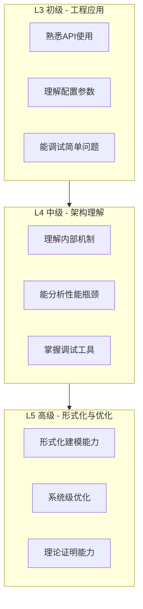

# 流计算练习集

> 所属阶段: Knowledge | 前置依赖: [Struct/ 理论基础](../../Struct/00-INDEX.md), [Flink/ 实践指南](Struct/00-INDEX.md) | 形式化等级: L3-L5

本文档汇总流计算核心练习，涵盖理论基础、工程实践与形式化验证三大维度。

---

## 练习目录

| 编号 | 练习名称 | 难度 | 预计时长 | 核心主题 |
|------|----------|------|----------|----------|
| [01](./exercise-01-process-calculus.md) | 进程演算基础 | L4 | 4-6h | CCS, CSP, π-calculus |
| [02](./exercise-02-flink-basics.md) | Flink基础编程 | L3 | 3-4h | DataStream API, Transformation |
| [03](./exercise-03-checkpoint-analysis.md) | Checkpoint分析 | L4 | 4-5h | 容错机制, 状态一致性 |
| [04](./exercise-04-consistency-models.md) | 一致性模型对比 | L5 | 5-6h | Exactly-Once, 并发语义 |
| [05](./exercise-05-pattern-implementation.md) | 设计模式实现 | L4 | 4-5h | 窗口模式, 侧输出, CEP |
| [06](./exercise-06-tla-practice.md) | TLA+实践 | L5 | 6-8h | 形式化验证, 规范编写 |

---

## 难度分级说明



| 等级 | 目标人群 | 能力要求 |
|------|----------|----------|
| L3 | 初级开发者 | 掌握基础API，能完成常见开发任务 |
| L4 | 中级工程师 | 深入理解原理，能设计复杂流处理拓扑 |
| L5 | 高级架构师/研究员 | 形式化验证能力，系统级优化能力 |

---

## 学习路径推荐

### 路径一：工程师路线

```
exercise-02 (Flink基础)
    → exercise-03 (Checkpoint)
    → exercise-05 (设计模式)
    → exercise-04 (一致性模型)
```

### 路径二：研究员路线

```
exercise-01 (进程演算)
    → exercise-04 (一致性模型)
    → exercise-06 (TLA+验证)
    → exercise-03 (Checkpoint)
```

### 路径三：完整路线

```
exercise-01 → exercise-02 → exercise-03 → exercise-05 → exercise-04 → exercise-06
```

---

## 评分标准总览

| 等级 | 分数区间 | 能力描述 |
|------|----------|----------|
| S | 95-100 | 全部完成，有创新思考 |
| A | 85-94 | 基本完成，少量错误 |
| B | 70-84 | 主要部分完成 |
| C | 60-69 | 部分完成 |
| F | <60 | 需要重新学习 |

---

## 环境准备

### 必需工具

- JDK 11+ (Flink练习)
- Maven 3.8+ 或 Gradle 7+
- Docker (本地Flink集群)
- Python 3.9+ (TLA+练习)

### 可选工具

- TLA+ Toolbox
- Flink Web UI
- VisualVM / JProfiler

---

## 提交规范

1. 每个练习独立提交
2. 代码需包含注释说明设计思路
3. 理论题使用 Markdown 格式提交
4. 性能分析需附带数据截图或日志

---

## 参考资源

- [Struct/ 理论文档](../../Struct/00-INDEX.md)
- [Flink/ 实践指南](Struct/00-INDEX.md)
- [TLA+ 官方网站](https://lamport.azurewebsites.net/tla/tla.html)
- [Flink 官方文档](https://nightlies.apache.org/flink/flink-docs-stable/)

---

## 更新日志

| 日期 | 版本 | 更新内容 |
|------|------|----------|
| 2026-04-02 | v1.0 | 初始版本，包含6个核心练习 |
