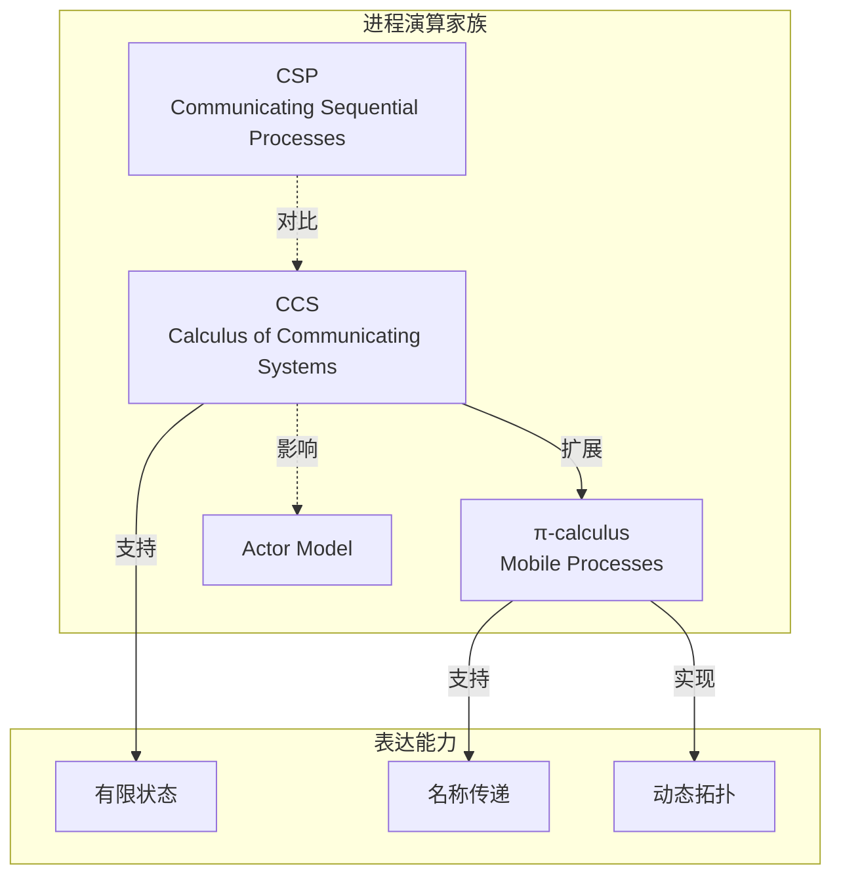

# 练习 01: 进程演算基础

> 所属阶段: Knowledge | 前置依赖: [Struct/01-foundations.md](../Struct/01-foundations.md) | 形式化等级: L4

---

## 目录

- [练习 01: 进程演算基础](#练习-01-进程演算基础)
  - [目录](#目录)
  - [1. 学习目标](#1-学习目标)
  - [2. 预备知识](#2-预备知识)
    - [2.1 必读材料](#21-必读材料)
    - [2.2 概念清单](#22-概念清单)
  - [3. 练习题](#3-练习题)
    - [3.1 理论题 (60分)](#31-理论题-60分)
      - [题目 1.1: CCS 语法解析 (15分)](#题目-11-ccs-语法解析-15分)
      - [题目 1.2: 哲学家就餐问题建模 (20分)](#题目-12-哲学家就餐问题建模-20分)
      - [题目 1.3: π-calculus 名称传递 (15分)](#题目-13-π-calculus-名称传递-15分)
      - [题目 1.4: CSP 迹语义分析 (10分)](#题目-14-csp-迹语义分析-10分)
    - [3.2 编程题 (40分)](#32-编程题-40分)
      - [题目 1.5: 使用 Go 模拟 Actor 行为 (20分)](#题目-15-使用-go-模拟-actor-行为-20分)
      - [题目 1.6: 互模拟验证工具使用 (20分)](#题目-16-互模拟验证工具使用-20分)
  - [4. 参考答案链接](#4-参考答案链接)
  - [5. 评分标准](#5-评分标准)
    - [总分分布](#总分分布)
    - [各题分值](#各题分值)
  - [6. 进阶挑战 (Bonus)](#6-进阶挑战-bonus)
  - [7. 参考资源](#7-参考资源)
  - [8. 可视化](#8-可视化)
    - [进程演算关系图](#进程演算关系图)

## 1. 学习目标

完成本练习后，你将能够：

- **Def-K-01-01**: 掌握 CCS/CSP/π-calculus 的基本语法与语义
- **Def-K-01-02**: 使用进程演算建模简单的并发系统
- **Def-K-01-03**: 理解互模拟等价的概念及其证明方法
- **Def-K-01-04**: 能够分析并发系统的死锁与活锁

---

## 2. 预备知识

### 2.1 必读材料

1. **CCS (Calculus of Communicating Systems)**
   - Milner, R. (1989). *Communication and Concurrency*
   - 重点章节：第3-5章

2. **CSP (Communicating Sequential Processes)**
   - Hoare, C.A.R. (1985). *Communicating Sequential Processes*
   - 重点章节：第1-4章

3. **π-calculus**
   - Milner, R. (1999). *Communicating and Mobile Systems: The π-calculus*
   - 重点章节：第1-3章

### 2.2 概念清单

| 概念 | 符号 | 直观解释 |
|------|------|----------|
| 动作前缀 | $a.P$ | 执行动作 $a$ 后继续为 $P$ |
| 选择和 | $P + Q$ | 非确定性选择 $P$ 或 $Q$ |
| 并行组合 | $P \| Q$ | $P$ 和 $Q$ 并发执行 |
| 限制 | $(\nu a)P$ | 限制 $a$ 只在 $P$ 内部可见 |
| 重命名 | $P[f]$ | 通过函数 $f$ 重命名动作 |

---

## 3. 练习题

### 3.1 理论题 (60分)

#### 题目 1.1: CCS 语法解析 (15分)

**难度**: L3

给定以下 CCS 进程定义：

```
P = a.b.0 + a.c.0
Q = a.(b.0 + c.0)
R = P | Q
```

请回答：

1. 画出 $P$ 和 $Q$ 的迁移图（LTS）(5分)
2. $P$ 和 $Q$ 是否强互模拟等价？证明你的结论 (5分)
3. $P$ 和 $Q$ 是否弱互模拟等价？说明理由 (5分)

---

#### 题目 1.2: 哲学家就餐问题建模 (20分)

**难度**: L4

使用 CCS 建模经典的哲学家就餐问题（5位哲学家）。

要求：

1. 定义哲学家进程 $Phil_i$ 和叉子进程 $Fork_i$ (8分)
2. 给出完整系统的并行组合表达式 (4分)
3. 分析系统中可能发生的死锁情况 (4分)
4. 提出一种避免死锁的建模方案 (4分)

---

#### 题目 1.3: π-calculus 名称传递 (15分)

**难度**: L4

给定以下 π-calculus 进程：

```
P = (νc)(ā⟨c⟩.P' | c(x).Q)
Q = b(y).Q'
```

其中 $ā⟨c⟩$ 表示在通道 $a$ 上发送名称 $c$。

请回答：

1. 执行一步归约后，系统状态是什么？(5分)
2. 解释为什么 π-calculus 被称为 "mobile" (5分)
3. 对比 CCS 和 π-calculus 在表达能力上的差异 (5分)

---

#### 题目 1.4: CSP 迹语义分析 (10分)

**难度**: L4

给定 CSP 进程：

```
P = a → b → STOP ⊓ a → c → STOP
Q = a → (b → STOP ⊓ c → STOP)
```

其中 $⊓$ 表示外部选择。

请回答：

1. 分别给出 $P$ 和 $Q$ 的迹集合 $traces(P)$ 和 $traces(Q)$ (4分)
2. 判断 $P$ 和 $Q$ 在迹语义下是否等价 (3分)
3. 说明 CSP 外部选择与 CCS 选择的区别 (3分)

---

### 3.2 编程题 (40分)

#### 题目 1.5: 使用 Go 模拟 Actor 行为 (20分)

**难度**: L4

使用 Go 语言的 goroutine 和 channel 实现一个简单的 Actor 系统。

**要求**：

1. 实现 Actor 的创建、消息发送、消息处理基本功能 (8分)
2. 实现一个简单的请求-响应模式 (6分)
3. 实现 Actor 的父子监督关系（简单的错误传播）(6分)

**参考代码框架**：

```go
package main

import "fmt"

type Message struct {
    From    string
    Payload interface{}
    // TODO: 补充必要字段
}

type Actor struct {
    ID       string
    Mailbox  chan Message
    Behavior func(Message)
    Children []*Actor
    Parent   *Actor
}

// TODO: 实现 Actor 系统核心功能

func main() {
    // TODO: 演示请求-响应和监督关系
}
```

---

#### 题目 1.6: 互模拟验证工具使用 (20分)

**难度**: L5

使用 CADP (Construction and Analysis of Distributed Processes) 或 mCRL2 工具验证以下性质：

**任务**：

1. 编写上述哲学家问题的 mCRL2 规范 (8分)
2. 验证系统是否存在死锁 (6分)
3. 对比不同避免死锁策略的效果 (6分)

**提交要求**：

- `.mcrl2` 源文件
- 验证脚本和结果截图
- 分析报告（不少于500字）

---

## 4. 参考答案链接

| 题目 | 答案位置 | 补充说明 |
|------|----------|----------|
| 1.1 | [answers/01-process-calculus.md](./answers/01-process-calculus.md#11) | 包含完整LTS图示 |
| 1.2 | [answers/01-process-calculus.md](./answers/01-process-calculus.md#12) | 含多种建模方案对比 |
| 1.3 | [answers/01-process-calculus.md](./answers/01-process-calculus.md#13) | π-calculus 归约详解 |
| 1.4 | [answers/01-process-calculus.md](./answers/01-process-calculus.md#14) | CSP语义对比表 |
| 1.5 | [answers/01-code/actor-simulation.go](./answers/01-code/actor-simulation.go) | 完整Go实现 |
| 1.6 | [answers/01-code/dining-philosophers.mcrl2](./answers/01-code/dining-philosophers.mcrl2) | mCRL2规范 |

---

## 5. 评分标准

### 总分分布

| 等级 | 分数区间 | 要求 |
|------|----------|------|
| S (优秀) | 95-100 | 全部完成，编程题有创新设计 |
| A (良好) | 85-94 | 理论题基本正确，编程题完整运行 |
| B (中等) | 70-84 | 主要题目完成，少量错误 |
| C (及格) | 60-69 | 过半题目完成 |
| F (不及格) | <60 | 需重新学习基础 |

### 各题分值

| 题目 | 分值 | 关键评分点 |
|------|------|------------|
| 1.1 | 15 | LTS图准确性、互模拟证明完整性 |
| 1.2 | 20 | 建模准确性、死锁分析深度 |
| 1.3 | 15 | 归约步骤正确、表达能力对比 |
| 1.4 | 10 | 迹语义计算正确 |
| 1.5 | 20 | 代码完整性、并发安全性 |
| 1.6 | 20 | 规范正确性、验证完整性 |

---

## 6. 进阶挑战 (Bonus)

完成以下任一任务可获得额外 10 分：

1. **Session Types 实现**：使用某种编程语言实现一个基于 Session Types 的类型检查器
2. **Actor 性能测试**：对比不同 Actor 库（Akka, Orleans, Go-actor）的性能表现
3. **混合系统建模**：使用 Hybrid CSP 建模一个包含连续物理量的系统

---

## 7. 参考资源


---

## 8. 可视化

### 进程演算关系图



---

*最后更新: 2026-04-02*
