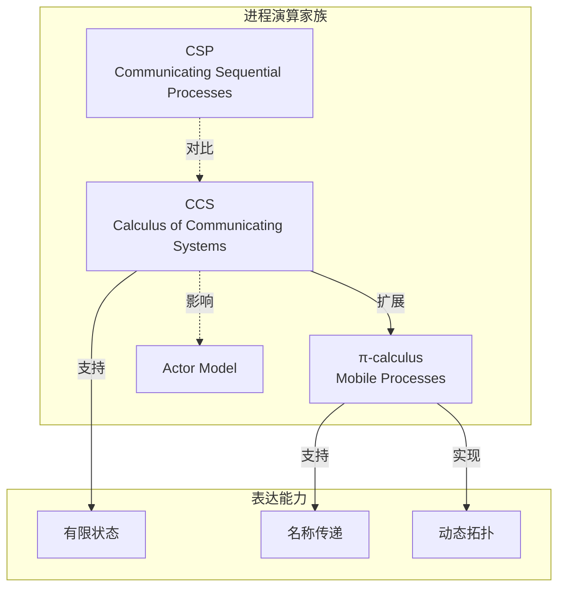

# 练习 01: 进程演算基础

> 所属阶段: Knowledge | 前置依赖: [统一流式理论](../../Struct/01-foundation/01.01-unified-streaming-theory.md) | 形式化等级: L4

---

## 目录

- [练习 01: 进程演算基础](#练习-01-进程演算基础)
  - [目录](#目录)
  - [1. 学习目标](#1-学习目标)
  - [2. 预备知识](#2-预备知识)
    - [2.1 必读材料](#21-必读材料)
    - [2.2 概念清单](#22-概念清单)
  - [3. 练习题](#3-练习题)
    - [3.1 理论题 (60分)](#31-理论题-60分)
      - [题目 1.1: CCS 语法解析 (15分)](#题目-11-ccs-语法解析-15分)
      - [题目 1.2: 哲学家就餐问题建模 (20分)](#题目-12-哲学家就餐问题建模-20分)
      - [题目 1.3: π-calculus 名称传递 (15分)](#题目-13-π-calculus-名称传递-15分)
      - [题目 1.4: CSP 迹语义分析 (10分)](#题目-14-csp-迹语义分析-10分)
    - [3.2 编程题 (40分)](#32-编程题-40分)
      - [题目 1.5: 使用 Go 模拟 Actor 行为 (20分)](#题目-15-使用-go-模拟-actor-行为-20分)
      - [题目 1.6: 互模拟验证工具使用 (20分)](#题目-16-互模拟验证工具使用-20分)
  - [4. 参考答案链接](#4-参考答案链接)
  - [5. 评分标准](#5-评分标准)
    - [总分分布](#总分分布)
    - [各题分值](#各题分值)
  - [6. 进阶挑战 (Bonus)](#6-进阶挑战-bonus)
  - [7. 参考资源](#7-参考资源)
  - [8. 可视化](#8-可视化)
    - [进程演算关系图](#进程演算关系图)

## 1. 学习目标

完成本练习后，你将能够：

- **Def-K-01-01**: 掌握 CCS/CSP/π-calculus 的基本语法与语义
- **Def-K-01-02**: 使用进程演算建模简单的并发系统
- **Def-K-01-03**: 理解互模拟等价的概念及其证明方法
- **Def-K-01-04**: 能够分析并发系统的死锁与活锁

---

## 2. 预备知识

### 2.1 必读材料

1. **CCS (Calculus of Communicating Systems)**
   - Milner, R. (1989). *Communication and Concurrency*
   - 重点章节：第3-5章

2. **CSP (Communicating Sequential Processes)**
   - Hoare, C.A.R. (1985). *Communicating Sequential Processes*
   - 重点章节：第1-4章

3. **π-calculus**
   - Milner, R. (1999). *Communicating and Mobile Systems: The π-calculus*
   - 重点章节：第1-3章

### 2.2 概念清单

| 概念 | 符号 | 直观解释 |
|------|------|----------|
| 动作前缀 | $a.P$ | 执行动作 $a$ 后继续为 $P$ |
| 选择和 | $P + Q$ | 非确定性选择 $P$ 或 $Q$ |
| 并行组合 | $P \| Q$ | $P$ 和 $Q$ 并发执行 |
| 限制 | $(\nu a)P$ | 限制 $a$ 只在 $P$ 内部可见 |
| 重命名 | $P[f]$ | 通过函数 $f$ 重命名动作 |

---

## 3. 练习题

### 3.1 理论题 (60分)

#### 题目 1.1: CCS 语法解析 (15分)

**难度**: L3

给定以下 CCS 进程定义：

```
P = a.b.0 + a.c.0
Q = a.(b.0 + c.0)
R = P | Q
```

请回答：

1. 画出 $P$ 和 $Q$ 的迁移图（LTS）(5分)
2. $P$ 和 $Q$ 是否强互模拟等价？证明你的结论 (5分)
3. $P$ 和 $Q$ 是否弱互模拟等价？说明理由 (5分)

---

#### 题目 1.2: 哲学家就餐问题建模 (20分)

**难度**: L4

使用 CCS 建模经典的哲学家就餐问题（5位哲学家）。

要求：

1. 定义哲学家进程 $Phil_i$ 和叉子进程 $Fork_i$ (8分)
2. 给出完整系统的并行组合表达式 (4分)
3. 分析系统中可能发生的死锁情况 (4分)
4. 提出一种避免死锁的建模方案 (4分)

---

#### 题目 1.3: π-calculus 名称传递 (15分)

**难度**: L4

给定以下 π-calculus 进程：

```
P = (νc)(ā⟨c⟩.P' | c(x).Q)
Q = b(y).Q'
```

其中 $ā⟨c⟩$ 表示在通道 $a$ 上发送名称 $c$。

请回答：

1. 执行一步归约后，系统状态是什么？(5分)
2. 解释为什么 π-calculus 被称为 "mobile" (5分)
3. 对比 CCS 和 π-calculus 在表达能力上的差异 (5分)

---

#### 题目 1.4: CSP 迹语义分析 (10分)

**难度**: L4

给定 CSP 进程：

```
P = a → b → STOP ⊓ a → c → STOP
Q = a → (b → STOP ⊓ c → STOP)
```

其中 $⊓$ 表示外部选择。

请回答：

1. 分别给出 $P$ 和 $Q$ 的迹集合 $traces(P)$ 和 $traces(Q)$ (4分)
2. 判断 $P$ 和 $Q$ 在迹语义下是否等价 (3分)
3. 说明 CSP 外部选择与 CCS 选择的区别 (3分)

---

### 3.2 编程题 (40分)

#### 题目 1.5: 使用 Go 模拟 Actor 行为 (20分)

**难度**: L4

使用 Go 语言的 goroutine 和 channel 实现一个简单的 Actor 系统。

**要求**：

1. 实现 Actor 的创建、消息发送、消息处理基本功能 (8分)
2. 实现一个简单的请求-响应模式 (6分)
3. 实现 Actor 的父子监督关系（简单的错误传播）(6分)

**参考代码框架**：

```go
package main

import "fmt"

type Message struct {
    From      string        // 发送者ID,标识消息来源Actor
    Payload   interface{}   // 消息内容,可以是任意类型
    ReplyTo   chan Message  // 用于请求-响应模式的回复通道(可选)
    MsgType   MessageType   // 消息类型,区分不同类别的消息
    Timestamp int64         // 发送时间戳(毫秒),用于超时处理
}

// MessageType 定义消息类型枚举
type MessageType int

const (
    MsgTypeNormal     MessageType = iota // 普通消息
    MsgTypeRequest                       // 请求消息(需要响应)
    MsgTypeResponse                      // 响应消息
    MsgTypeSupervisor                    // 监督消息(错误报告)
)

// **参考答案**:
// type Message struct {
//     From    string              // 发送者ID
//     Payload interface{}         // 消息内容
//     ReplyTo chan Message        // 用于请求-响应模式的回复通道
//     MsgType MessageType         // 消息类型枚举(可选,用于区分消息类别)
//     Timestamp int64             // 发送时间戳(可选,用于超时处理)
// }
//
// type MessageType int
// const (
//     MsgTypeNormal MessageType = iota
//     MsgTypeRequest
//     MsgTypeResponse
//     MsgTypeSupervisor
// )

type Actor struct {
    ID       string              // Actor唯一标识
    Mailbox  chan Message        // 消息邮箱(缓冲通道)
    Behavior func(Message)       // 消息处理行为函数
    Children []*Actor            // 子Actor列表(监督树)
    Parent   *Actor              // 父Actor(监督者)
    system   *ActorSystem        // 所属Actor系统
    stopCh   chan struct{}       // 停止信号通道
}

// ActorSystem 管理所有Actor的生命周期
type ActorSystem struct {
    actors map[string]*Actor     // Actor注册表
    mu     sync.RWMutex          // 读写锁保护并发访问
}

// NewActorSystem 创建新的Actor系统
func NewActorSystem() *ActorSystem {
    return &ActorSystem{
        actors: make(map[string]*Actor),
    }
}

// Register 注册Actor到系统
func (as *ActorSystem) Register(actor *Actor) {
    as.mu.Lock()
    defer as.mu.Unlock()
    as.actors[actor.ID] = actor
}

// Get 根据ID获取Actor
func (as *ActorSystem) Get(id string) (*Actor, bool) {
    as.mu.RLock()
    defer as.mu.RUnlock()
    actor, ok := as.actors[id]
    return actor, ok
}

// Send 发送消息到指定Actor(异步)
func (as *ActorSystem) Send(to string, msg Message) error {
    actor, ok := as.Get(to)
    if !ok {
        return fmt.Errorf("actor %s not found", to)
    }
    select {
    case actor.Mailbox <- msg:
        return nil
    default:
        return fmt.Errorf("actor %s mailbox is full", to)
    }
}

// Spawn 创建并启动一个新的Actor
func (as *ActorSystem) Spawn(id string, behavior func(Message), parent *Actor) *Actor {
    actor := &Actor{
        ID:       id,
        Mailbox:  make(chan Message, 100), // 缓冲大小100
        Behavior: behavior,
        Children: []*Actor{},
        Parent:   parent,
        system:   as,
        stopCh:   make(chan struct{}),
    }

    // 如果有父Actor,添加到子列表
    if parent != nil {
        parent.Children = append(parent.Children, actor)
    }

    // 注册到系统
    as.Register(actor)

    // 启动Actor的goroutine
    go actor.run()

    return actor
}

// run 是Actor的主循环
func (a *Actor) run() {
    // 使用recover捕获panic,实现错误监督
    defer func() {
        if r := recover(); r != nil {
            fmt.Printf("[Supervision] Actor %s panic recovered: %v\n", a.ID, r)
            if a.Parent != nil {
                // 向父Actor报告错误(监督)
                a.Parent.Mailbox <- Message{
                    From:      a.ID,
                    Payload:   fmt.Sprintf("child_failed: %v", r),
                    MsgType:   MsgTypeSupervisor,
                    Timestamp: time.Now().UnixMilli(),
                }
            }
        }
    }()

    for {
        select {
        case msg := <-a.Mailbox:
            // 处理消息
            a.Behavior(msg)
        case <-a.stopCh:
            // 收到停止信号
            fmt.Printf("[Actor] %s stopped\n", a.ID)
            return
        }
    }
}

// Stop 停止Actor
func (a *Actor) Stop() {
    close(a.stopCh)
}

// RequestResponse 发送请求并等待响应(同步)
func (a *Actor) RequestResponse(target string, payload interface{}, timeout time.Duration) (Message, error) {
    replyCh := make(chan Message, 1)
    msg := Message{
        From:      a.ID,
        Payload:   payload,
        ReplyTo:   replyCh,
        MsgType:   MsgTypeRequest,
        Timestamp: time.Now().UnixMilli(),
    }

    // 发送请求
    if err := a.system.Send(target, msg); err != nil {
        return Message{}, err
    }

    // 等待响应或超时
    select {
    case resp := <-replyCh:
        return resp, nil
    case <-time.After(timeout):
        return Message{}, fmt.Errorf("request timeout after %v", timeout)
    }
}

// **参考答案**:Actor系统核心实现
/*
package main

import (
    "fmt"
    "sync"
    "time"
)

// ActorSystem 管理所有Actor
type ActorSystem struct {
    actors map[string]*Actor
    mu     sync.RWMutex
}

func NewActorSystem() *ActorSystem {
    return &ActorSystem{
        actors: make(map[string]*Actor),
    }
}

func (as *ActorSystem) Register(actor *Actor) {
    as.mu.Lock()
    defer as.mu.Unlock()
    as.actors[actor.ID] = actor
}

func (as *ActorSystem) Get(id string) (*Actor, bool) {
    as.mu.RLock()
    defer as.mu.RUnlock()
    actor, ok := as.actors[id]
    return actor, ok
}

// Send 发送消息到指定Actor
func (as *ActorSystem) Send(to string, msg Message) error {
    actor, ok := as.Get(to)
    if !ok {
        return fmt.Errorf("actor %s not found", to)
    }
    actor.Mailbox <- msg
    return nil
}

// Spawn 创建并启动一个新Actor
func (as *ActorSystem) Spawn(id string, behavior func(Message), parent *Actor) *Actor {
    actor := &Actor{
        ID:       id,
        Mailbox:  make(chan Message, 100),
        Behavior: behavior,
        Children: []*Actor{},
        Parent:   parent,
        system:   as,
        stopCh:   make(chan struct{}),
    }

    if parent != nil {
        parent.Children = append(parent.Children, actor)
    }

    as.Register(actor)

    // 启动Actor goroutine
    go actor.run()

    return actor
}

func (a *Actor) run() {
    defer func() {
        if r := recover(); r != nil {
            fmt.Printf("Actor %s panic: %v\n", a.ID, r)
            if a.Parent != nil {
                // 向父Actor报告错误
                a.Parent.Mailbox <- Message{
                    From:    a.ID,
                    Payload: fmt.Sprintf("child_failed: %v", r),
                    MsgType: MsgTypeSupervisor,
                }
            }
        }
    }()

    for {
        select {
        case msg := <-a.Mailbox:
            a.Behavior(msg)
        case <-a.stopCh:
            return
        }
    }
}

func (a *Actor) Stop() {
    close(a.stopCh)
}

// RequestResponse 发送请求并等待响应
func (a *Actor) RequestResponse(target string, payload interface{}, timeout time.Duration) (Message, error) {
    replyCh := make(chan Message, 1)
    msg := Message{
        From:    a.ID,
        Payload: payload,
        ReplyTo: replyCh,
        MsgType: MsgTypeRequest,
    }

    if err := a.system.Send(target, msg); err != nil {
        return Message{}, err
    }

    select {
    case resp := <-replyCh:
        return resp, nil
    case <-time.After(timeout):
        return Message{}, fmt.Errorf("request timeout")
    }
}
*/

func main() {
    fmt.Println("=== Actor System Demo ===")

    // 创建Actor系统
    system := NewActorSystem()

    // ========== 1. 创建父Actor(监督者) ==========
    parentBehavior := func(msg Message) {
        switch msg.MsgType {
        case MsgTypeSupervisor:
            fmt.Printf("[Parent-Supervisor] Child %s reported failure: %v\n",
                msg.From, msg.Payload)
        default:
            fmt.Printf("[Parent] Received from %s: %v\n", msg.From, msg.Payload)
        }
    }
    parent := system.Spawn("parent", parentBehavior, nil)
    fmt.Println("Created parent actor")

    // ========== 2. 创建子Actor(有监督关系) ==========
    childBehavior := func(msg Message) {
        switch msg.Payload.(type) {
        case string:
            content := msg.Payload.(string)
            if content == "panic" {
                panic("simulated error in child actor")
            }
            fmt.Printf("[Child] Received: %s\n", content)

            // 请求-响应模式:如果有ReplyTo通道,发送响应
            if msg.ReplyTo != nil {
                response := Message{
                    From:      "child",
                    Payload:   fmt.Sprintf("Response to: %s", content),
                    MsgType:   MsgTypeResponse,
                    Timestamp: time.Now().UnixMilli(),
                }
                msg.ReplyTo <- response
            }
        default:
            fmt.Printf("[Child] Received: %v\n", msg.Payload)
        }
    }
    child := system.Spawn("child", childBehavior, parent)
    fmt.Println("Created child actor with parent supervision")

    // ========== 3. 演示普通消息发送 ==========
    fmt.Println("\n--- Test 1: Normal Message ---")
    system.Send("child", Message{
        From:      "main",
        Payload:   "Hello, Actor!",
        MsgType:   MsgTypeNormal,
        Timestamp: time.Now().UnixMilli(),
    })
    time.Sleep(100 * time.Millisecond)

    // ========== 4. 演示请求-响应模式 ==========
    fmt.Println("\n--- Test 2: Request-Response Pattern ---")
    go func() {
        resp, err := parent.RequestResponse("child", "What time is it?", 2*time.Second)
        if err != nil {
            fmt.Printf("[Request] Failed: %v\n", err)
        } else {
            fmt.Printf("[Request] Got response: %v\n", resp.Payload)
        }
    }()
    time.Sleep(200 * time.Millisecond)

    // ========== 5. 演示错误监督(触发panic) ==========
    fmt.Println("\n--- Test 3: Supervision (Error Propagation) ---")
    time.Sleep(100 * time.Millisecond)
    system.Send("child", Message{
        From:      "main",
        Payload:   "panic",  // 特殊消息触发panic
        MsgType:   MsgTypeNormal,
        Timestamp: time.Now().UnixMilli(),
    })
    time.Sleep(300 * time.Millisecond)

    // ========== 6. 清理 ==========
    fmt.Println("\n--- Cleanup ---")
    child.Stop()
    parent.Stop()
    time.Sleep(100 * time.Millisecond)

    fmt.Println("\n=== Demo Complete ===")
}

// 预期输出示例:
// === Actor System Demo ===
// Created parent actor
// Created child actor with parent supervision
//
// --- Test 1: Normal Message ---
// [Child] Received: Hello, Actor!
//
// --- Test 2: Request-Response Pattern ---
// [Child] Received: What time is it?
// [Request] Got response: Response to: What time is it?
//
// --- Test 3: Supervision (Error Propagation) ---
// [Supervision] Actor child panic recovered: simulated error in child actor
// [Parent-Supervisor] Child child reported failure: child_failed: simulated error in child actor
//
// --- Cleanup ---
// [Actor] child stopped
// [Actor] parent stopped
//
// === Demo Complete ===

// **参考答案**:演示请求-响应和监督关系
/*
func main() {
    system := NewActorSystem()

    // 1. 创建父Actor(监督者)
    parentBehavior := func(msg Message) {
        switch msg.MsgType {
        case MsgTypeSupervisor:
            fmt.Printf("[Supervisor] Child %s reported failure: %v\n", msg.From, msg.Payload)
        default:
            fmt.Printf("[Parent] Received from %s: %v\n", msg.From, msg.Payload)
        }
    }
    parent := system.Spawn("parent", parentBehavior, nil)

    // 2. 创建子Actor(有监督关系)
    childBehavior := func(msg Message) {
        if msg.Payload == "panic" {
            panic("simulated error")
        }
        fmt.Printf("[Child] Received: %v\n", msg.Payload)

        // 请求-响应模式:回复消息
        if msg.ReplyTo != nil {
            msg.ReplyTo <- Message{
                From:    "child",
                Payload: fmt.Sprintf("response to: %v", msg.Payload),
            }
        }
    }
    child := system.Spawn("child", childBehavior, parent)

    // 3. 演示消息发送
    system.Send("child", Message{From: "main", Payload: "hello"})

    // 4. 演示请求-响应
    go func() {
        resp, err := parent.RequestResponse("child", "request data", 5*time.Second)
        if err != nil {
            fmt.Printf("Request failed: %v\n", err)
        } else {
            fmt.Printf("Response received: %v\n", resp.Payload)
        }
    }()

    // 5. 演示错误传播(触发panic)
    time.Sleep(100 * time.Millisecond)
    system.Send("child", Message{From: "main", Payload: "panic"})

    // 等待观察输出
    time.Sleep(500 * time.Millisecond)

    child.Stop()
    parent.Stop()
}
*/
```

---

#### 题目 1.6: 互模拟验证工具使用 (20分)

**难度**: L5

使用 CADP (Construction and Analysis of Distributed Processes) 或 mCRL2 工具验证以下性质：

**任务**：

1. 编写上述哲学家问题的 mCRL2 规范 (8分)
2. 验证系统是否存在死锁 (6分)
3. 对比不同避免死锁策略的效果 (6分)

**提交要求**：

- `.mcrl2` 源文件
- 验证脚本和结果截图
- 分析报告（不少于500字）

---

## 4. 参考答案链接

| 题目 | 答案位置 | 补充说明 |
|------|----------|----------|
| 1.1 | **answers/01-process-calculus.md**（答案待添加） | 包含完整LTS图示 |
| 1.2 | **answers/01-process-calculus.md**（答案待添加） | 含多种建模方案对比 |
| 1.3 | **answers/01-process-calculus.md**（答案待添加） | π-calculus 归约详解 |
| 1.4 | **answers/01-process-calculus.md**（答案待添加） | CSP语义对比表 |
| 1.5 | **answers/01-code/actor-simulation.go**（代码示例待添加） | 完整Go实现 |
| 1.6 | **answers/01-code/dining-philosophers.mcrl2**（代码示例待添加） | mCRL2规范 |

---

## 5. 评分标准

### 总分分布

| 等级 | 分数区间 | 要求 |
|------|----------|------|
| S (优秀) | 95-100 | 全部完成，编程题有创新设计 |
| A (良好) | 85-94 | 理论题基本正确，编程题完整运行 |
| B (中等) | 70-84 | 主要题目完成，少量错误 |
| C (及格) | 60-69 | 过半题目完成 |
| F (不及格) | <60 | 需重新学习基础 |

### 各题分值

| 题目 | 分值 | 关键评分点 |
|------|------|------------|
| 1.1 | 15 | LTS图准确性、互模拟证明完整性 |
| 1.2 | 20 | 建模准确性、死锁分析深度 |
| 1.3 | 15 | 归约步骤正确、表达能力对比 |
| 1.4 | 10 | 迹语义计算正确 |
| 1.5 | 20 | 代码完整性、并发安全性 |
| 1.6 | 20 | 规范正确性、验证完整性 |

---

## 6. 进阶挑战 (Bonus)

完成以下任一任务可获得额外 10 分：

1. **Session Types 实现**：使用某种编程语言实现一个基于 Session Types 的类型检查器
2. **Actor 性能测试**：对比不同 Actor 库（Akka, Orleans, Go-actor）的性能表现
3. **混合系统建模**：使用 Hybrid CSP 建模一个包含连续物理量的系统

---

## 7. 参考资源


---

## 8. 可视化

### 进程演算关系图



---

*最后更新: 2026-04-02*
