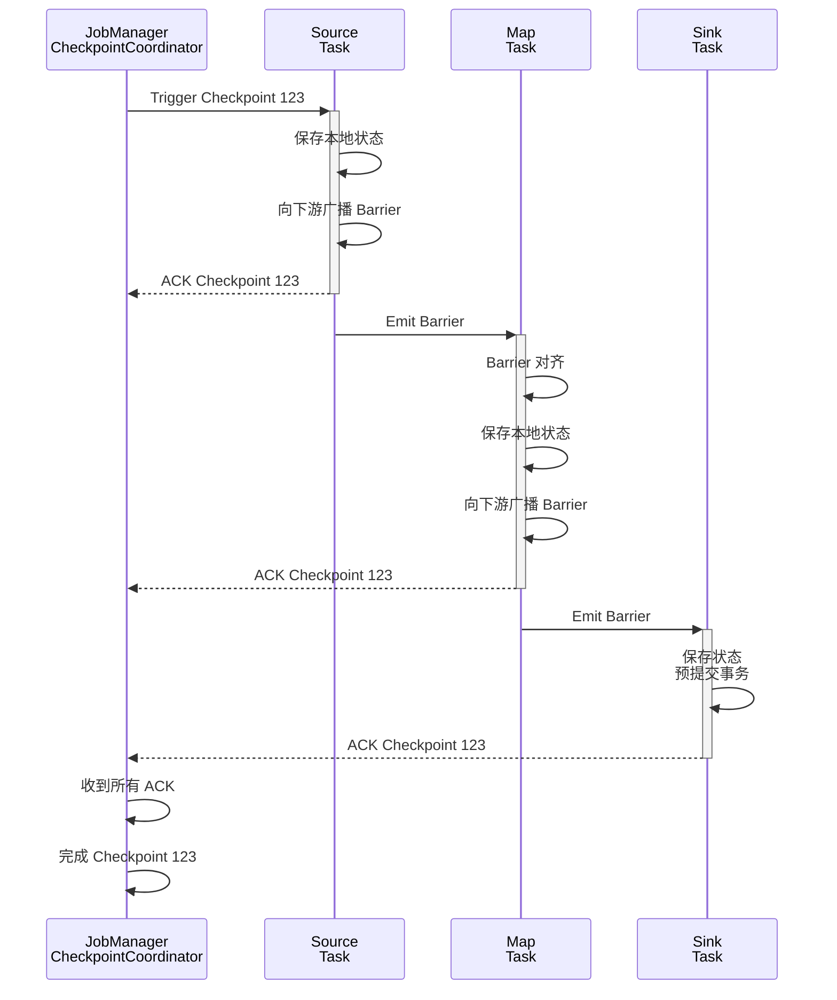

# 练习 03: Checkpoint 分析

> 所属阶段: Knowledge | 前置依赖: [Checkpoint机制](../../Flink/02-core/checkpoint-mechanism-deep-dive.md), [exercise-02](./exercise-02-flink-basics.md) | 形式化等级: L4

---

## 目录

- [练习 03: Checkpoint 分析](#练习-03-checkpoint-分析)
  - [目录](#目录)
  - [1. 学习目标](#1-学习目标)
  - [2. 预备知识](#2-预备知识)
    - [2.1 Checkpoint 核心概念](#21-checkpoint-核心概念)
    - [2.2 关键配置参数](#22-关键配置参数)
  - [3. 练习题](#3-练习题)
    - [3.1 理论题 (40分)](#31-理论题-40分)
      - [题目 3.1: Checkpoint 执行流程 (10分)](#题目-31-checkpoint-执行流程-10分)
      - [题目 3.2: Exactly-Once 语义分析 (10分)](#题目-32-exactly-once-语义分析-10分)
      - [题目 3.3: Checkpoint 失败诊断 (10分)](#题目-33-checkpoint-失败诊断-10分)
      - [题目 3.4: 状态后端对比 (10分)\\n](#题目-34-状态后端对比-10分n)
    - [3.2 编程与分析题 (60分)](#32-编程与分析题-60分)
      - [题目 3.5: Checkpoint 配置优化 (15分)](#题目-35-checkpoint-配置优化-15分)
      - [题目 3.6: Checkpoint 性能分析 (20分)](#题目-36-checkpoint-性能分析-20分)
      - [题目 3.7: 故障恢复测试 (15分)](#题目-37-故障恢复测试-15分)
      - [题目 3.8: 非对齐 Checkpoint 分析 (10分)](#题目-38-非对齐-checkpoint-分析-10分)
  - [4. 参考答案链接](#4-参考答案链接)
  - [5. 评分标准](#5-评分标准)
    - [总分分布](#总分分布)
    - [重点评分项](#重点评分项)
  - [6. 进阶挑战 (Bonus)](#6-进阶挑战-bonus)
  - [7. 参考资源](#7-参考资源)
  - [8. 可视化](#8-可视化)
    - [Checkpoint 执行流程](#checkpoint-执行流程)

## 1. 学习目标

完成本练习后，你将能够：

- **Def-K-03-01**: 深入理解 Checkpoint 的触发机制与执行流程
- **Def-K-03-02**: 掌握 Checkpoint 超时、失败的诊断方法
- **Def-K-03-03**: 能够配置与优化 Checkpoint 参数
- **Def-K-03-04**: 理解 Exactly-Once 语义在 Checkpoint 中的实现

---

## 2. 预备知识

### 2.1 Checkpoint 核心概念

| 概念 | 说明 |
|------|------|
| Checkpoint Barrier | 特殊的记录，用于分隔前后 Checkpoint 的数据 |
| Snapshot | 各算子状态的一致性快照 |
| Checkpoint Coordinator | JobManager 组件，负责协调 Checkpoint |
| State Backend | 状态存储后端（Memory/FS/RocksDB）|
| Incremental Checkpoint | 仅保存增量状态变更 |

### 2.2 关键配置参数

```java

// [伪代码片段 - 不可直接运行] 仅展示核心逻辑
import org.apache.flink.streaming.api.CheckpointingMode;

// Checkpoint 配置示例
env.enableCheckpointing(60000);  // 1分钟
env.getCheckpointConfig().setCheckpointingMode(
    CheckpointingMode.EXACTLY_ONCE);
env.getCheckpointConfig().setMinPauseBetweenCheckpoints(30000);
env.getCheckpointConfig().setCheckpointTimeout(600000);
env.getCheckpointConfig().setMaxConcurrentCheckpoints(1);
env.getCheckpointConfig().enableExternalizedCheckpoints(
    ExternalizedCheckpointCleanup.RETAIN_ON_CANCELLATION);
```

---

## 3. 练习题

### 3.1 理论题 (40分)

#### 题目 3.1: Checkpoint 执行流程 (10分)

**难度**: L4

描述 Flink Checkpoint 的完整执行流程：

1. 从 Checkpoint Coordinator 发起，到完成的完整步骤 (6分)
2. 画出 Barrier 在流中的传播过程 (4分)

**答题要点**：

- 同步阶段与异步阶段的区分
- Barrier 对齐与非对齐的区别
- 状态快照的触发时机

---

#### 题目 3.2: Exactly-Once 语义分析 (10分)

**难度**: L4

分析以下场景下 Exactly-Once 的保障机制：

**场景 A**：使用 Kafka Source + 内存状态 + Print Sink
**场景 B**：使用 Kafka Source + RocksDB + Kafka Sink（两阶段提交）

请回答：

1. 场景 A 能否保证 Exactly-Once？为什么？(4分)
2. 场景 B 的两阶段提交流程是什么？(4分)
3. 如果 Sink 不支持两阶段提交，如何实现端到端 Exactly-Once？(2分)

---

#### 题目 3.3: Checkpoint 失败诊断 (10分)

**难度**: L4

给定以下日志片段：

```
2024-01-15 10:23:45,123 WARN  Checkpoint 123 - expired before completing
2024-01-15 10:23:45,234 INFO  Failed to trigger checkpoint 123
    due to CheckpointExpiredException
2024-01-15 10:24:00,456 WARN  Source: CustomSource -> Map
    back-pressured, buffer usage: 95%
```

请回答：

1. 分析 Checkpoint 失败的根本原因 (4分)
2. 提出至少3种解决方案 (4分)
3. 如何调整参数避免类似问题？(2分)

---

#### 题目 3.4: 状态后端对比 (10分)\n

**难度**: L4

对比三种状态后端：

| 特性 | MemoryStateBackend | FsStateBackend | RocksDBStateBackend |
|------|-------------------|----------------|---------------------|
| 存储位置 | | | |
| 状态大小限制 | | | |
| 增量 Checkpoint | | | |
| 适用场景 | | | |
| 性能特点 | | | |

请补充上表，并针对以下场景推荐合适的 State Backend：

- 小型状态 (< 100MB)，快速恢复
- 大型状态 (> 10GB)，增量备份
- 需要随机读写的 MapState

---

### 3.2 编程与分析题 (60分)

#### 题目 3.5: Checkpoint 配置优化 (15分)

**难度**: L4

给定一个处理大规模 IoT 数据的 Flink 作业，特征如下：

- 10万+ 设备，每个设备有 100 个传感器
- 每秒 100万 条记录
- 需要保存 24 小时的历史状态用于异常检测
- 使用 Kafka Source 和 HBase Sink

**任务**：

1. 选择合适的 State Backend 并说明理由 (3分)
2. 配置 Checkpoint 参数（间隔、超时、并发数等）(6分)
3. 配置增量 Checkpoint 和本地恢复 (3分)
4. 配置 HBase Sink 的 Exactly-Once 写入 (3分)

---

#### 题目 3.6: Checkpoint 性能分析 (20分)

**难度**: L4

使用以下程序生成 Checkpoint 指标数据：

```java
import org.apache.flink.streaming.api.environment.StreamExecutionEnvironment;

import org.apache.flink.streaming.api.CheckpointingMode;


public class CheckpointMetricsJob {
    public static void main(String[] args) throws Exception {
        StreamExecutionEnvironment env =
            StreamExecutionEnvironment.getExecutionEnvironment();

        // 启用 Checkpoint
        env.enableCheckpointing(10000);
        env.getCheckpointConfig().setCheckpointTimeout(60000);

        // ========== 配置 RocksDB 状态后端和增量 Checkpoint ==========

        // 导入语句(放在文件顶部):
        // import org.apache.flink.contrib.streaming.state.EmbeddedRocksDBStateBackend;
        // import org.apache.flink.runtime.state.StateBackend;
        // import org.apache.flink.streaming.api.environment.CheckpointConfig;
        // import java.time.Duration;

        // 配置1: 使用 RocksDB 状态后端
        // RocksDB 是一个嵌入式键值存储,适合大状态场景
        // 优点:
        //   - 支持大状态(状态大小仅受磁盘限制)
        //   - 支持增量 Checkpoint(仅保存变化的状态)
        //   - 支持异步 Checkpoint(不阻塞数据处理)
        // 缺点:
        //   - 读写性能比内存状态慢(涉及序列化和磁盘IO)
        //   - 需要额外的 JNI 依赖

        String checkpointPath = "file:///tmp/flink-checkpoints";  // 本地测试路径
        // 生产环境使用 HDFS: "hdfs://namenode:8020/flink/checkpoints"

        // Flink 1.15+ 推荐使用 EmbeddedRocksDBStateBackend
        EmbeddedRocksDBStateBackend rocksDbBackend = new EmbeddedRocksDBStateBackend(true);
        // 参数 true: 启用增量 Checkpoint(只保存自上次 Checkpoint 后的变更)

        env.setStateBackend(rocksDbBackend);
        env.getCheckpointConfig().setCheckpointStorage(checkpointPath);

        // 配置2: Checkpoint 基础参数
        env.enableCheckpointing(60000);  // Checkpoint 间隔:60秒
        env.getCheckpointConfig().setCheckpointingMode(CheckpointingMode.EXACTLY_ONCE);
        env.getCheckpointConfig().setCheckpointTimeout(600000);  // 超时:10分钟
        env.getCheckpointConfig().setMinPauseBetweenCheckpoints(30000);  // 最小间隔:30秒
        env.getCheckpointConfig().setMaxConcurrentCheckpoints(1);  // 最大并发数:1

        // 配置3: 启用非对齐 Checkpoint(Flink 1.11+,高反压场景)
        // 说明:非对齐 Checkpoint 可以在 Barrier 不对齐的情况下进行快照,
        // 减少 Checkpoint 时间,但会增加存储开销
        env.getCheckpointConfig().enableUnalignedCheckpoints();
        env.getCheckpointConfig().setAlignmentTimeout(Duration.ofSeconds(30));

        // 配置4: 外部化 Checkpoint(作业取消时保留)
        env.getCheckpointConfig().enableExternalizedCheckpoints(
            CheckpointConfig.ExternalizedCheckpointCleanup.RETAIN_ON_CANCELLATION
        );

        // 配置5: 本地恢复(可选)
        // 启用本地恢复后,TaskManager 会保留最近完成的 Checkpoint 状态,
        // 故障恢复时优先从本地加载,减少网络传输
        env.getCheckpointConfig().setPreferCheckpointForRecovery(true);

        // ==================== flink-conf.yaml 推荐配置 ====================
        /*
        # RocksDB 内存调优
        state.backend.rocksdb.memory.managed: true
        state.backend.rocksdb.memory.fixed-per-slot: 256mb
        state.backend.rocksdb.memory.high-prio-pool-ratio: 0.1

        # Checkpoint 配置
        execution.checkpointing.interval: 60s
        execution.checkpointing.timeout: 10m
        execution.checkpointing.max-concurrent-checkpoints: 1
        execution.checkpointing.min-pause-between-checkpoints: 30s

        # 增量 Checkpoint
        execution.checkpointing.incremental: true

        # 非对齐 Checkpoint
        execution.checkpointing.unaligned.enabled: true
        execution.checkpointing.alignment-timeout: 30s
        */

// **参考答案**:RocksDB配置和增量Checkpoint
/*
import org.apache.flink.contrib.streaming.state.RocksDBStateBackend;
import org.apache.flink.runtime.state.StateBackend;
import org.apache.flink.streaming.api.environment.CheckpointConfig;

// 配置RocksDB作为状态后端
StateBackend rocksDbBackend = new RocksDBStateBackend(
    "hdfs://namenode:8020/flink/checkpoints",  // Checkpoint存储路径
    true                                        // 启用增量Checkpoint
);
env.setStateBackend(rocksDbBackend);

// 或者使用FsStateBackend(适用于中小状态)
// StateBackend fsBackend = new FsStateBackend("hdfs://namenode:8020/flink/checkpoints");
// env.setStateBackend(fsBackend);

// 详细配置选项(推荐用于生产环境)
// 通过flink-conf.yaml或代码配置:

// 1. RocksDB内存调优
// state.backend.rocksdb.memory.managed: true
// state.backend.rocksdb.memory.fixed-per-slot: 256mb
// state.backend.rocksdb.memory.high-prio-pool-ratio: 0.1

// 2. Checkpoint配置优化
env.getCheckpointConfig().setCheckpointingMode(CheckpointingMode.EXACTLY_ONCE);
env.getCheckpointConfig().setCheckpointInterval(60000);        // 1分钟间隔
env.getCheckpointConfig().setCheckpointTimeout(600000);        // 10分钟超时
env.getCheckpointConfig().setMinPauseBetweenCheckpoints(30000); // 最小间隔30秒
env.getCheckpointConfig().setMaxConcurrentCheckpoints(1);       // 最大并发1个

// 3. 启用增量Checkpoint(仅RocksDB支持)
env.getCheckpointConfig().enableIncrementalCheckpointing(true);

// 4. 启用本地恢复(减少从远程存储恢复的时间)
env.getCheckpointConfig().setPreferCheckpointForRecovery(true);

// 5. 外部化Checkpoint(作业取消时保留)
env.getCheckpointConfig().enableExternalizedCheckpoints(
    CheckpointConfig.ExternalizedCheckpointCleanup.RETAIN_ON_CANCELLATION
);

// 6. 非对齐Checkpoint配置(Flink 1.11+,适用于高反压场景)
env.getCheckpointConfig().enableUnalignedCheckpoints();
env.getCheckpointConfig().setAlignmentTimeout(Duration.ofSeconds(30));
*/

        // 模拟有状态的计算
        env.fromSource(new RateLimitedSource(10000),
                       WatermarkStrategy.noWatermarks(), "source")
           .keyBy(event -> event.sensorId)
           .process(new StatefulProcessFunction())
           .addSink(new DiscardingSink<>());

        env.execute();
    }
}
```

**任务**：

1. 运行程序并收集 Checkpoint 指标（持续时间、大小、对齐时间）(6分)
2. 分析指标数据，找出潜在瓶颈 (7分)
3. 提出并实施优化方案 (7分)

**提交要求**：

- Flink Web UI 截图（Checkpoint 页面）
- 分析报告（包括优化前后的对比）

---

#### 题目 3.7: 故障恢复测试 (15分)

**难度**: L4

**任务**：

1. 编写一个有状态的 Flink 程序（如累加器）(4分)
2. 手动触发 Checkpoint 并保存到指定路径 (3分)
3. 模拟 TaskManager 失败（kill 进程）(3分)
4. 从 Checkpoint 恢复作业，验证状态一致性 (5分)

**参考命令**：

```bash
# 保存 Checkpoint flink savepoint <jobId> <targetPath>

# 从 Checkpoint 恢复 flink run -s <checkpointPath> <jarFile>
```

---

#### 题目 3.8: 非对齐 Checkpoint 分析 (10分)

**难度**: L5

**背景**：Flink 1.11+ 引入了非对齐 Checkpoint (Unaligned Checkpoint) 机制。

**任务**：

1. 解释非对齐 Checkpoint 的工作原理 (4分)
2. 对比对齐与非对齐 Checkpoint 的优缺点 (3分)
3. 编写配置启用非对齐 Checkpoint (3分)

```java
// [伪代码片段 - 不可直接运行] 仅展示核心逻辑
// ========== 配置非对齐 Checkpoint (Unaligned Checkpoint) ==========

// 导入语句(放在文件顶部):
// import org.apache.flink.streaming.api.environment.CheckpointConfig;
// import java.time.Duration;

/**
 * 非对齐 Checkpoint 配置说明:
 *
 * 工作原理:
 * 传统对齐 Checkpoint 需要等待所有输入通道的 Barrier 到达后才进行快照,
 * 在高反压场景下可能导致 Checkpoint 超时。
 *
 * 非对齐 Checkpoint 允许 Barrier "跳过" 缓冲的数据,
 * 将这些缓冲数据作为 Checkpoint 状态的一部分保存,
 * 从而避免 Barrier 对齐等待。
 *
 * 适用场景:
 * 1. 高反压场景(Barrier 对齐时间超过 Checkpoint 间隔)
 * 2. 需要短 Checkpoint 间隔(< 10秒)
 * 3. 端到端延迟敏感的应用
 *
 * 注意事项:
 * 1. 会增加 Checkpoint 大小(包含缓冲的数据)
 * 2. 增加网络传输开销
 * 3. 需要足够的存储空间
 */

// 1. 启用非对齐 Checkpoint
env.getCheckpointConfig().enableUnalignedCheckpoints();

// 2. 配置对齐超时时间(Flink 1.11+)
// 当 Barrier 对齐时间超过此值时,自动切换到非对齐模式
env.getCheckpointConfig().setAlignmentTimeout(Duration.ofSeconds(30));

// 3. 基础 Checkpoint 配置
env.enableCheckpointing(60000);  // 60秒间隔
env.getCheckpointConfig().setCheckpointTimeout(600000);  // 10分钟超时
env.getCheckpointConfig().setMinPauseBetweenCheckpoints(30000);

// 4. 设置 RocksDB 状态后端(推荐与非对齐 Checkpoint 配合使用)
try {
    env.setStateBackend(new EmbeddedRocksDBStateBackend(true));
    env.getCheckpointConfig().setCheckpointStorage("hdfs://namenode:8020/flink/checkpoints");
} catch (Exception e) {
    throw new RuntimeException("Failed to set state backend", e);
}

// ==================== flink-conf.yaml 完整配置 ====================
/*
# 启用非对齐 Checkpoint execution.checkpointing.unaligned.enabled: true

# 对齐超时时间(默认30秒)
execution.checkpointing.alignment-timeout: 30s

# 每个Channel缓存的最大数据量(防止OOM)
execution.checkpointing.max-aligned-checkpoint-size: 1mb

# 压缩对齐数据(减少网络传输)
execution.checkpointing.unaligned.compression.enabled: true

# 基础 Checkpoint 配置 execution.checkpointing.interval: 60s
execution.checkpointing.timeout: 10m
execution.checkpointing.max-concurrent-checkpoints: 1
*/

// ==================== 完整配置类示例 ====================

import org.apache.flink.streaming.api.environment.StreamExecutionEnvironment;
import org.apache.flink.streaming.api.environment.CheckpointConfig;
import org.apache.flink.contrib.streaming.state.EmbeddedRocksDBStateBackend;
import java.time.Duration;

public class UnalignedCheckpointConfig {

    /**
     * 配置非对齐 Checkpoint(适用于高反压场景)
     */
    public static void configureForHighBackpressure(StreamExecutionEnvironment env) {
        // 基础配置
        env.enableCheckpointing(10000);  // 短间隔:10秒
        env.getCheckpointConfig().setCheckpointTimeout(120000);  // 2分钟超时
        env.getCheckpointConfig().setMinPauseBetweenCheckpoints(5000);

        // 启用非对齐 Checkpoint
        env.getCheckpointConfig().enableUnalignedCheckpoints();
        env.getCheckpointConfig().setAlignmentTimeout(Duration.ofSeconds(10));

        // 设置状态后端
        try {
            env.setStateBackend(new EmbeddedRocksDBStateBackend(true));
        } catch (Exception e) {
            throw new RuntimeException("Failed to configure state backend", e);
        }

        // 启用增量 Checkpoint
        env.getCheckpointConfig().enableIncrementalCheckpointing();
    }

    /**
     * 配置混合模式(先尝试对齐,超时后切换到非对齐)
     */
    public static void configureHybridMode(StreamExecutionEnvironment env) {
        env.enableCheckpointing(60000);
        env.getCheckpointConfig().setCheckpointTimeout(600000);

        // 启用非对齐 Checkpoint
        env.getCheckpointConfig().enableUnalignedCheckpoints();

        // 设置30秒对齐超时:
        // - 正常情况下使用对齐 Checkpoint
        // - 高反压时自动切换到非对齐模式
        env.getCheckpointConfig().setAlignmentTimeout(Duration.ofSeconds(30));
    }
}

// ==================== 使用场景建议 ====================
/*
| 场景 | 推荐配置 |
|------|----------|
| 正常流量 | 对齐 Checkpoint(默认) |
| 高反压场景 | 非对齐 Checkpoint + 短超时 |
| 低延迟要求 | 非对齐 Checkpoint + 短间隔 |
| 大状态 | 非对齐 + RocksDB + 增量 Checkpoint |

监控指标:
- checkpointDuration: Checkpoint 持续时间
- checkpointAlignmentTime: Barrier 对齐时间(如果持续超过30秒考虑非对齐)
- checkpointedBytes: Checkpoint 大小(非对齐通常会更大)
*/

// **参考答案**:非对齐Checkpoint配置
/*
import org.apache.flink.streaming.api.environment.CheckpointConfig;
import java.time.Duration;

// 启用非对齐Checkpoint
env.getCheckpointConfig().enableUnalignedCheckpoints();

// 配置对齐超时时间
// 当Barrier对齐时间超过此值时,自动切换到非对齐模式
env.getCheckpointConfig().setAlignmentTimeout(Duration.ofSeconds(30));

// 非对齐Checkpoint的高级配置
// 通过flink-conf.yaml配置:
/*
# 启用非对齐Checkpoint execution.checkpointing.unaligned.enabled: true

# 对齐超时时间(默认30秒)
execution.checkpointing.alignment-timeout: 30s

# 每个Channel缓存的最大数据量(防止OOM)
execution.checkpointing.max-aligned-checkpoint-size: 1mb

# 压缩对齐数据(减少网络传输)
execution.checkpointing.unaligned.compression.enabled: true
*/

// 完整配置示例
public class UnalignedCheckpointConfig {
    public static void configure(StreamExecutionEnvironment env) {
        // 基础Checkpoint配置
        env.enableCheckpointing(60000);
        env.getCheckpointConfig().setCheckpointTimeout(600000);
        env.getCheckpointConfig().setMinPauseBetweenCheckpoints(30000);

        // 启用非对齐Checkpoint
        env.getCheckpointConfig().enableUnalignedCheckpoints();
        env.getCheckpointConfig().setAlignmentTimeout(Duration.ofSeconds(10));

        // 设置RocksDB状态后端
        try {
            env.setStateBackend(new RocksDBStateBackend(
                "hdfs://namenode:8020/flink/checkpoints",
                true  // 启用增量
            ));
        } catch (Exception e) {
            throw new RuntimeException("Failed to set state backend", e);
        }
    }
}

// 使用场景建议:
// 1. 高反压场景:非对齐Checkpoint可以避免Barrier对齐导致的超时
// 2. 短Checkpoint间隔:对齐时间可能超过间隔,使用非对齐更稳定
// 3. 注意:非对齐Checkpoint会增加存储和网络开销
*/
```

---

## 4. 参考答案链接

| 题目 | 答案位置 | 补充说明 |
|------|----------|----------|
| 3.1 | **answers/03-checkpoint.md**（答案待添加） | 含流程图 |
| 3.2 | **answers/03-checkpoint.md**（答案待添加） | 端到端一致性详解 |
| 3.3 | **answers/03-checkpoint.md**（答案待添加） | 诊断决策树 |
| 3.4 | **answers/03-checkpoint.md**（答案待添加） | 后端对比表 |
| 3.5 | **answers/03-code/CheckpointConfig.java**（代码示例待添加） | 配置示例 |
| 3.6 | **answers/03-code/CheckpointMetricsAnalysis.md**（答案待添加） | 分析模板 |
| 3.7 | **answers/03-code/FaultRecoveryTest.md**（答案待添加） | 测试步骤 |
| 3.8 | **answers/03-code/UnalignedCheckpoint.java**（代码示例待添加） | 配置代码 |

---

## 5. 评分标准

### 总分分布

| 等级 | 分数区间 | 要求 |
|------|----------|------|
| S | 95-100 | 全部分析深入，优化方案有效 |
| A | 85-94 | 理论正确，实验数据完整 |
| B | 70-84 | 主要概念理解，实验基本完成 |
| C | 60-69 | 基本概念掌握 |
| F | <60 | 概念理解有误 |

### 重点评分项

| 题目 | 分值 | 关键评分点 |
|------|------|------------|
| 3.1 | 10 | Barrier 传播过程描述准确 |
| 3.2 | 10 | 端到端一致性理解深入 |
| 3.6 | 20 | 实验数据真实，分析有深度 |
| 3.7 | 15 | 恢复测试成功，状态一致 |

---

## 6. 进阶挑战 (Bonus)

完成以下任一任务可获得额外 10 分：

1. **大规模状态测试**：在 10GB+ 状态下测试 Checkpoint 性能
2. **自定义 State Backend**：实现一个简单的自定义 State Backend
3. **Checkpoint 监控 Dashboard**：使用 Prometheus + Grafana 搭建 Checkpoint 监控面板

---

## 7. 参考资源


---

## 8. 可视化

### Checkpoint 执行流程



---

*最后更新: 2026-04-02*
