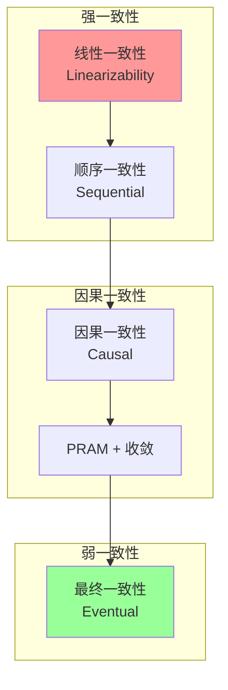
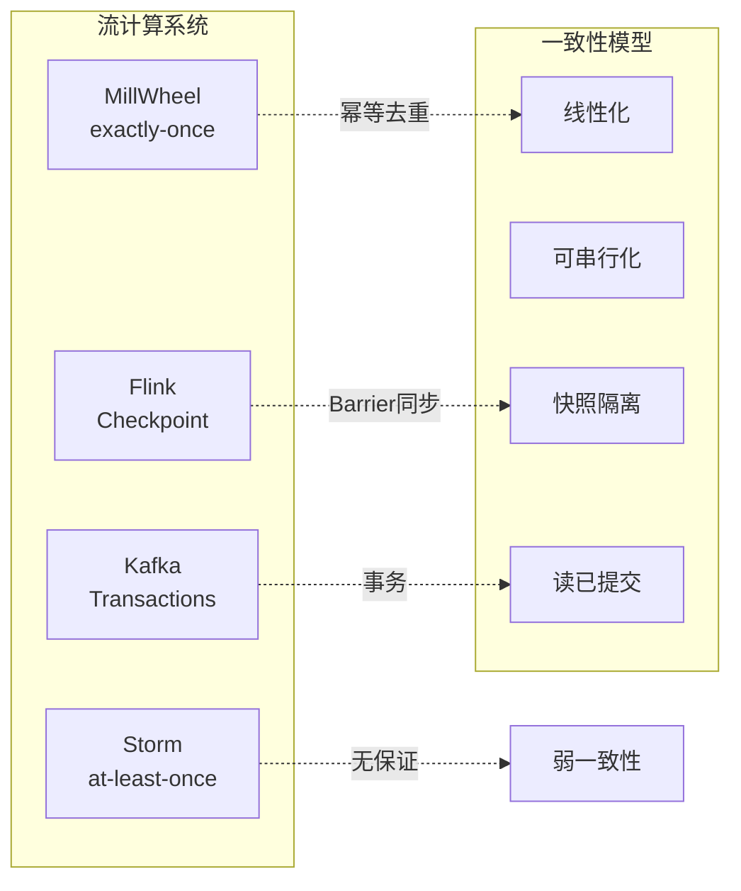

# 练习 04: 一致性模型对比

> 所属阶段: Knowledge | 前置依赖: [一致性层次](../../Struct/02-properties/02.02-consistency-hierarchy.md), [exercise-01](./exercise-01-process-calculus.md) | 形式化等级: L5

---

## 目录

- [练习 04: 一致性模型对比](#练习-04-一致性模型对比)
  - [目录](#目录)
  - [1. 学习目标](#1-学习目标)
  - [2. 预备知识](#2-预备知识)
    - [2.1 一致性层次结构](#21-一致性层次结构)
    - [2.2 形式化工具](#22-形式化工具)
  - [3. 练习题](#3-练习题)
    - [3.1 形式化定义与证明 (50分)](#31-形式化定义与证明-50分)
      - [题目 4.1: 线性一致性定义 (10分)](#题目-41-线性一致性定义-10分)
      - [题目 4.2: 流计算一致性分类 (15分)](#题目-42-流计算一致性分类-15分)
      - [题目 4.3: Happens-Before 关系分析 (10分)](#题目-43-happens-before-关系分析-10分)
      - [题目 4.4: 一致性协议对比 (15分)](#题目-44-一致性协议对比-15分)
    - [3.2 案例分析与设计 (50分)](#32-案例分析与设计-50分)
      - [题目 4.5: 电商订单系统一致性设计 (20分)](#题目-45-电商订单系统一致性设计-20分)
      - [题目 4.6: 跨数据中心复制一致性 (15分)](#题目-46-跨数据中心复制一致性-15分)
      - [题目 4.7: 一致性模型选择决策树 (15分)](#题目-47-一致性模型选择决策树-15分)
  - [4. 参考答案链接](#4-参考答案链接)
  - [5. 评分标准](#5-评分标准)
    - [总分分布](#总分分布)
    - [重点评分项](#重点评分项)
  - [6. 进阶挑战 (Bonus)](#6-进阶挑战-bonus)
  - [7. 参考资源](#7-参考资源)
  - [8. 可视化](#8-可视化)
    - [一致性层次结构](#一致性层次结构)
    - [流计算系统一致性定位](#流计算系统一致性定位)

## 1. 学习目标

完成本练习后，你将能够：

- **Def-K-04-01**: 形式化定义多种一致性模型（线性一致性、顺序一致性、因果一致性、最终一致性）
- **Def-K-04-02**: 分析流计算系统中的一致性保障机制
- **Def-K-04-03**: 使用形式化方法证明一致性性质
- **Def-K-04-04**: 在实际系统设计中权衡一致性与性能

---

## 2. 预备知识

### 2.1 一致性层次结构

```
线性一致性 (Linearizability)
    ↓ 严格弱于
顺序一致性 (Sequential Consistency)
    ↓ 严格弱于
因果一致性 (Causal Consistency)
    ↓ 等价
PRAM + 收敛
    ↓ 严格弱于
最终一致性 (Eventual Consistency)
```

### 2.2 形式化工具

| 符号 | 含义 |
|------|------|
| $op \xrightarrow{hb} op'$ | happens-before 关系 |
| $op \xrightarrow{vis} op'$ | visibility 关系 |
| $op \xrightarrow{so} op'$ | session order |
| $ret(op)$ | 操作 op 的返回值 |

---

## 3. 练习题

### 3.1 形式化定义与证明 (50分)

#### 题目 4.1: 线性一致性定义 (10分)

**难度**: L5

**任务**：

1. 给出线性一致性的完整形式化定义 (4分)
2. 使用 Execution Graph 表示以下操作历史，并判断是否线性一致 (6分)：

```
进程 P1: write(x, 1) ────────────────────> read(x) → 2
           │
           ↓ happens-before
进程 P2: write(x, 2) ────────────────────> read(x) → 1
           ↑
时间 ──────────────────────────────────────────────────>
```

**提示**：定义需要包含 real-time order 和 sequential specification。

---

#### 题目 4.2: 流计算一致性分类 (15分)

**难度**: L5

分析以下流计算场景中的一致性级别：

**场景 A**：Flink 的 Checkpoint Exactly-Once
**场景 B**：Kafka Streams 的 at-least-once
**场景 C**：Storm 的原语（at-least-once）
**场景 D**：Google MillWheel 的 exactly-once

**任务**：

1. 将每个场景映射到分布式一致性模型的分类（如：严格可串行化、可串行化、快照隔离等）(8分)
2. 解释为什么 Flink 的 Exactly-Once 不等价于分布式事务的 Strict Serializability (4分)
3. 讨论流计算 "Exactly-Once" 与传统数据库 "ACID" 的异同 (3分)

---

#### 题目 4.3: Happens-Before 关系分析 (10分)

**难度**: L5

给定 Flink 流处理拓扑：

```
Source → Map1 → KeyBy → Window → Sink
            ↘ Map2 ↗
```

**任务**：

1. 定义该拓扑中所有隐含的 happens-before 关系 (5分)
2. 如果 Window 算子使用 Processing Time 而非 Event Time，happens-before 关系有何变化？(3分)
3. 这些关系如何影响状态一致性？(2分)

---

#### 题目 4.4: 一致性协议对比 (15分)

**难度**: L5

对比以下协议在流计算中的应用：

| 协议/算法 | 核心思想 | 流计算应用 | 优缺点 |
|-----------|----------|------------|--------|
| Two-Phase Commit | | | |
| Paxos | | | |
| Raft | | | |
| Vector Clocks | | | |
| Version Vectors | | | |

<!-- **参考答案**：一致性协议对比完整表 -->
<!--
| 协议/算法 | 核心思想 | 流计算应用 | 优缺点 |
|-----------|----------|------------|--------|
| Two-Phase Commit | 准备阶段+提交阶段，协调者询问所有参与者，全部同意才提交 | Flink Kafka Sink的两阶段提交实现Exactly-Once | 优点：实现简单，保证原子性<br>缺点：阻塞协议，协调者单点故障 |
| Paxos | 多数派决议，Prepare+Accept两阶段，保证多节点对提案达成一致 | 用于流计算元数据管理（如JobManager高可用） | 优点：容错性强，可容忍少数节点故障<br>缺点：难以理解，工程实现复杂 |
| Raft | 领导者选举+日志复制，将一致性分解为子问题 | Kafka副本同步、Flink的HA配置存储 | 优点：易于理解和实现<br>缺点：领导者瓶颈，写入性能受领导者限制 |
| Vector Clocks | 每个节点维护向量时钟，通过比较向量确定事件因果关系 | 流计算中的乱序事件排序、事件时间对齐 | 优点：准确捕获因果关系<br>缺点：向量大小随节点数增长，开销大 |
| Version Vectors | 基于Vector Clocks，用于检测并发更新冲突 | 流计算状态版本管理、增量Checkpoint合并 | 优点：可检测并发冲突<br>缺点：冲突需要应用层解决 |
-->

**任务**：

1. 补充上表 (10分)
2. 分析为什么 Flink Checkpoint 使用 Barrier 而非 Vector Clock (5分)

---

### 3.2 案例分析与设计 (50分)

#### 题目 4.5: 电商订单系统一致性设计 (20分)

**难度**: L5

设计一个电商订单系统，需要处理：

- 订单创建（写订单表）
- 库存扣减（写库存表）
- 支付回调（更新订单状态）
- 物流通知（写物流表）

**任务**：

1. 识别系统中的因果依赖关系（至少3个）(6分)
2. 为不同数据选择合适的最终一致性或强一致性 (6分)
3. 使用 TLA+ 风格的形式化方法描述订单创建的状态转移 (8分)

**参考格式**：

```
# 伪代码示意，非完整可编译代码 Init ==
    ∧ orderStatus = [i ∈ OrderIDs ↦ "PENDING"]
    ∧ inventory = [i ∈ ProductIDs ↦ 100]
    ∧ ...

CreateOrder(o, p) ==
    ∧ orderStatus[o] = "PENDING"
    ∧ inventory[p] > 0
    ∧ orderStatus' = [orderStatus EXCEPT ![o] = "CREATED"]
    ∧ inventory' = [inventory EXCEPT ![p] = @ - 1]
    ∧ ...
```

---

#### 题目 4.6: 跨数据中心复制一致性 (15分)

**难度**: L5

**场景**：某流计算系统需要跨三个数据中心（北京、上海、广州）复制状态数据。

**任务**：

1. 设计满足以下不同级别的一致性方案：
   - 方案 A： strongest consistency (15分中的6分)
   - 方案 B： causal consistency (15分中的5分)
   - 方案 C： eventual consistency (15分中的4分)
2. 分析各方案的网络延迟开销
3. 推荐适合流计算 Checkpoint 复制的方案

---

#### 题目 4.7: 一致性模型选择决策树 (15分)

**难度**: L4

**任务**：

1. 创建一个一致性模型选择的决策树，考虑因素包括：
   - 数据新鲜度要求 (3分)
   - 系统可用性要求 (3分)
   - 网络分区容忍度 (3分)
   - 冲突解决复杂度 (3分)
   - 性能要求 (3分)

2. 使用 Mermaid 绘制决策树
3. 为决策树中的每个叶节点推荐一种具体的技术实现

---

## 4. 参考答案链接

| 题目 | 答案位置 | 补充说明 |
|------|----------|----------|
| 4.1 | **answers/04-consistency.md**（答案待添加） | 形式化定义 + 图示 |
| 4.2 | **answers/04-consistency.md**（答案待添加） | 一致性映射表 |
| 4.3 | **answers/04-consistency.md**（答案待添加） | happens-before 分析 |
| 4.4 | **answers/04-consistency.md**（答案待添加） | 协议对比完整表 |
| 4.5 | **answers/04-code/OrderSystem.tla**（代码示例待添加） | TLA+ 规范 |
| 4.6 | **answers/04-code/GeoReplication.md**（答案待添加） | 设计方案 |
| 4.7 | **answers/04-code/DecisionTree.md**（答案待添加） | 决策树 |

---

## 5. 评分标准

### 总分分布

| 等级 | 分数区间 | 要求 |
|------|----------|------|
| S | 95-100 | 形式化定义准确，证明完整，设计有深度 |
| A | 85-94 | 概念理解正确，分析到位 |
| B | 70-84 | 主要概念掌握，分析基本完成 |
| C | 60-69 | 基本概念理解 |
| F | <60 | 概念混淆，理解错误 |

### 重点评分项

| 题目 | 分值 | 关键评分点 |
|------|------|------------|
| 4.1 | 10 | 形式化定义完整，判断正确 |
| 4.2 | 15 | 一致性映射准确 |
| 4.5 | 20 | TLA+ 规范语法正确，设计合理 |
| 4.7 | 15 | 决策树覆盖全面 |

---

## 6. 进阶挑战 (Bonus)

完成以下任一任务可获得额外 10 分：

1. **形式化证明**：使用 Coq/Isabelle 证明某个简单算法的线性一致性
2. **一致性测试工具**：使用 Jepsen 测试一个流计算系统的一致性
3. **新一致性模型提案**：针对特定流计算场景，设计一种新的一致性模型并形式化定义

---

## 7. 参考资源


---

## 8. 可视化

### 一致性层次结构



### 流计算系统一致性定位



---

*最后更新: 2026-04-02*

---

*文档版本: v1.0 | 创建日期: 2026-04-18*
