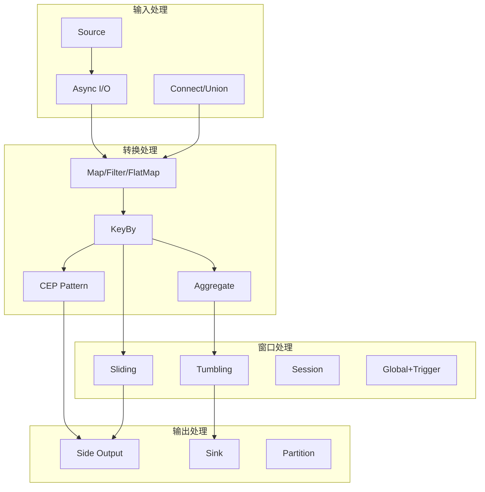

# 练习 05: 设计模式实现

> 所属阶段: Knowledge | 前置依赖: [exercise-02](./exercise-02-flink-basics.md), [exercise-03](./exercise-03-checkpoint-analysis.md) | 形式化等级: L4

---

## 目录

- [练习 05: 设计模式实现](#练习-05-设计模式实现)
  - [目录](#目录)
  - [1. 学习目标](#1-学习目标)
  - [2. 预备知识](#2-预备知识)
    - [2.1 流计算设计模式分类](#21-流计算设计模式分类)
    - [2.2 Flink CEP 基础](#22-flink-cep-基础)
  - [3. 练习题](#3-练习题)
    - [3.1 理论题 (30分)](#31-理论题-30分)
      - [题目 5.1: 窗口模式对比 (10分)](#题目-51-窗口模式对比-10分)
      - [题目 5.2: 流连接策略 (10分)](#题目-52-流连接策略-10分)
      - [题目 5.3: 反压机制分析 (10分)](#题目-53-反压机制分析-10分)
    - [3.2 编程题 (70分)](#32-编程题-70分)
      - [题目 5.4: 实时 Top-N 实现 (15分)](#题目-54-实时-top-n-实现-15分)
      - [题目 5.5: 订单超时检测 (20分)](#题目-55-订单超时检测-20分)
      - [题目 5.6: 双流 Interval Join (15分)](#题目-56-双流-interval-join-15分)
      - [题目 5.7: 异步外部数据查询 (10分)](#题目-57-异步外部数据查询-10分)
      - [题目 5.8: 自定义窗口与触发器 (10分)](#题目-58-自定义窗口与触发器-10分)
  - [4. 参考答案链接](#4-参考答案链接)
  - [5. 评分标准](#5-评分标准)
    - [总分分布](#总分分布)
    - [编程题评分细则](#编程题评分细则)
  - [6. 进阶挑战 (Bonus)](#6-进阶挑战-bonus)
  - [7. 参考资源](#7-参考资源)
  - [8. 可视化](#8-可视化)
    - [流计算设计模式图谱](#流计算设计模式图谱)

## 1. 学习目标

完成本练习后，你将能够：

- **Def-K-05-01**: 掌握流计算中的核心设计模式
- **Def-K-05-02**: 实现复杂的窗口计算模式
- **Def-K-05-03**: 使用 CEP 库处理复杂事件
- **Def-K-05-04**: 设计可复用的流处理组件

---

## 2. 预备知识

### 2.1 流计算设计模式分类

| 模式类别 | 代表模式 | 应用场景 |
|----------|----------|----------|
| 窗口模式 | 会话窗口、滑动窗口、滚动窗口 | 时间序列分析 |
| 分流模式 | 侧输出流、ProcessFunction | 异常处理、多路输出 |
| 连接模式 | Interval Join, Window Join | 流关联 |
| 异步模式 | AsyncFunction | 外部系统查询 |
| CEP 模式 | 序列、选择、循环 | 复杂事件检测 |

### 2.2 Flink CEP 基础

```java
// CEP 模式定义示例
Pattern<LoginEvent, ?> pattern = Pattern
    .<LoginEvent>begin("first")
    .where(evt -> evt.getStatus().equals("FAIL"))
    .next("second")
    .where(evt -> evt.getStatus().equals("FAIL"))
    .within(Time.seconds(10));
```

---

## 3. 练习题

### 3.1 理论题 (30分)

#### 题目 5.1: 窗口模式对比 (10分)

**难度**: L4

比较以下窗口模式的适用场景和实现要点：

1. **Tumbling Window vs Sliding Window** (3分)
2. **Session Window 的 gap 配置策略** (3分)
3. **Global Window 与 Trigger 的配合使用** (4分)

---

#### 题目 5.2: 流连接策略 (10分)

**难度**: L4

分析以下流连接场景的最佳方案：

| 场景 | 流A特征 | 流B特征 | 推荐连接方式 |
|------|---------|---------|--------------|
| 订单-支付关联 | 先产生，数据完整 | 后产生，可能延迟 | |
| 用户点击-购买 | 高频流 | 低频流 | |
| 传感器数据融合 | 同频，时间对齐 | 同频，时间对齐 | |
| 实时推荐 | 需要历史数据 | 实时事件 | |

---

#### 题目 5.3: 反压机制分析 (10分)

**难度**: L4

**任务**：

1. 解释 Flink 反压 (Backpressure) 的产生原因和传播机制 (4分)
2. 对比 Flink 1.5 前后的反压实现差异 (3分)
3. 列举至少3种反压监控指标和优化策略 (3分)

---

### 3.2 编程题 (70分)

#### 题目 5.4: 实时 Top-N 实现 (15分)

**难度**: L4

实现一个实时统计热门商品的 Top-N 程序。

**需求**：

- 输入：用户点击流（商品ID, 时间戳）
- 每1分钟计算一次点击量 Top 10 商品
- 使用滑动窗口平滑结果（滑动步长10秒）
- 输出：排名、商品ID、点击量

**挑战**：

- 考虑数据倾斜（某些商品点击特别多）
- 优化状态大小（不保存所有商品点击数）

---

#### 题目 5.5: 订单超时检测 (20分)

**难度**: L4

实现一个订单超时检测系统。

**需求**：

- 输入：订单创建事件、支付事件
- 检测创建后15分钟未支付的订单
- 超时订单输出到告警流
- 已支付订单取消超时检测

**实现方案**：

```java
// ==================== 方案1: ProcessFunction + Timer ====================

import org.apache.flink.api.common.state.ValueState;
import org.apache.flink.api.common.state.ValueStateDescriptor;
import org.apache.flink.configuration.Configuration;
import org.apache.flink.streaming.api.datastream.DataStream;
import org.apache.flink.streaming.api.environment.StreamExecutionEnvironment;
import org.apache.flink.streaming.api.functions.KeyedProcessFunction;
import org.apache.flink.util.Collector;

/**
 * 订单事件类
 */
public class OrderEvent {
    public String orderId;      // 订单ID
    public String eventType;    // 事件类型: "CREATE" 或 "PAY"
    public long timestamp;      // 事件时间戳（毫秒）

    public OrderEvent() {}

    public OrderEvent(String orderId, String eventType, long timestamp) {
        this.orderId = orderId;
        this.eventType = eventType;
        this.timestamp = timestamp;
    }
}

/**
 * 超时告警类
 */
public class OrderTimeoutAlert {
    public String orderId;      // 超时订单ID
    public long createTime;     // 订单创建时间
    public String reason;       // 超时原因

    public OrderTimeoutAlert() {}

    public OrderTimeoutAlert(String orderId, long createTime, String reason) {
        this.orderId = orderId;
        this.createTime = createTime;
        this.reason = reason;
    }

    @Override
    public String toString() {
        return String.format("OrderTimeoutAlert{orderId='%s', createTime=%d, reason='%s'}",
            orderId, createTime, reason);
    }
}

/**
 * 基于 ProcessFunction + Timer 的订单超时检测
 *
 * 原理：
 * 1. 为每个订单创建定时器，延迟15分钟触发
 * 2. 如果收到支付事件，取消对应的定时器
 * 3. 如果定时器触发，说明订单超时
 */
public class OrderTimeoutProcessFunction extends KeyedProcessFunction<String, OrderEvent, OrderTimeoutAlert> {

    // 状态：保存订单创建时间
    private ValueState<Long> createTimeState;
    // 状态：保存定时器时间戳（用于取消定时器）
    private ValueState<Long> timerState;

    @Override
    public void open(Configuration parameters) {
        // 初始化状态
        createTimeState = getRuntimeContext().getState(
            new ValueStateDescriptor<>("createTime", Long.class));
        timerState = getRuntimeContext().getState(
            new ValueStateDescriptor<>("timer", Long.class));
    }

    @Override
    public void processElement(OrderEvent event, Context ctx, Collector<OrderTimeoutAlert> out)
            throws Exception {

        if ("CREATE".equals(event.eventType)) {
            // 订单创建事件：注册15分钟后的超时定时器
            long timeoutTime = event.timestamp + 15 * 60 * 1000; // 15分钟（毫秒）
            ctx.timerService().registerProcessingTimeTimer(timeoutTime);

            // 保存状态
            createTimeState.update(event.timestamp);
            timerState.update(timeoutTime);

            System.out.println("[ProcessFunction] Order " + event.orderId +
                " created, timeout timer set at " + timeoutTime);

        } else if ("PAY".equals(event.eventType)) {
            // 订单支付事件：取消定时器
            Long timer = timerState.value();
            if (timer != null) {
                ctx.timerService().deleteProcessingTimeTimer(timer);
                createTimeState.clear();
                timerState.clear();
                System.out.println("[ProcessFunction] Order " + event.orderId +
                    " paid, timer cancelled");
            }
        }
    }

    @Override
    public void onTimer(long timestamp, OnTimerContext ctx, Collector<OrderTimeoutAlert> out)
            throws Exception {
        // 定时器触发，说明订单超时
        Long createTime = createTimeState.value();
        String orderId = ctx.getCurrentKey();

        out.collect(new OrderTimeoutAlert(orderId, createTime, "PAYMENT_TIMEOUT"));

        // 清理状态
        createTimeState.clear();
        timerState.clear();
    }
}

// ==================== 方案2: CEP (Complex Event Processing) ====================

import org.apache.flink.cep.CEP;
import org.apache.flink.cep.PatternStream;
import org.apache.flink.cep.pattern.Pattern;
import org.apache.flink.cep.pattern.conditions.SimpleCondition;
import org.apache.flink.cep.nfa.aftermatch.AfterMatchSkipStrategy;
import org.apache.flink.streaming.api.windowing.time.Time;
import org.apache.flink.cep.PatternSelectFunction;
import org.apache.flink.cep.PatternTimeoutFunction;
import org.apache.flink.streaming.api.datastream.SingleOutputStreamOperator;
import org.apache.flink.util.OutputTag;

/**
 * 基于 CEP 的订单超时检测
 *
 * 原理：
 * 1. 定义模式：创建事件后，在15分钟内应该有支付事件
 * 2. 如果模式匹配成功，说明订单正常支付
 * 3. 如果模式超时，说明订单未支付
 */
public class OrderTimeoutCEP {

    public static void detectTimeout(DataStream<OrderEvent> orderStream) {

        // 定义CEP模式：创建后15分钟内应该有支付
        // 使用 skipPastLastEvent 避免重复匹配
        Pattern<OrderEvent, ?> orderPayPattern = Pattern
            .<OrderEvent>begin("create", AfterMatchSkipStrategy.skipPastLastEvent())
            .where(new SimpleCondition<OrderEvent>() {
                @Override
                public boolean filter(OrderEvent event) {
                    return "CREATE".equals(event.eventType);
                }
            })
            .next("pay")  // 严格顺序：pay必须在create之后
            .where(new SimpleCondition<OrderEvent>() {
                @Override
                public boolean filter(OrderEvent event) {
                    return "PAY".equals(event.eventType);
                }
            })
            .within(Time.minutes(15));  // 时间窗口：15分钟

        // 应用模式到KeyedStream
        PatternStream<OrderEvent> patternStream = CEP.pattern(
            orderStream.keyBy(event -> event.orderId),
            orderPayPattern
        );

        // 侧输出流标签：用于接收超时事件
        OutputTag<OrderTimeoutAlert> timeoutTag = new OutputTag<OrderTimeoutAlert>("timeout"){};

        // 处理匹配结果
        SingleOutputStreamOperator<OrderEvent> result = patternStream
            .select(
                // 处理超时事件
                new PatternTimeoutFunction<OrderEvent, OrderTimeoutAlert>() {
                    @Override
                    public OrderTimeoutAlert timeout(Map<String, List<OrderEvent>> pattern,
                                                      long timeoutTimestamp) {
                        OrderEvent create = pattern.get("create").get(0);
                        return new OrderTimeoutAlert(
                            create.orderId,
                            create.timestamp,
                            "CEP_TIMEOUT"
                        );
                    }
                },
                // 处理正常匹配（可选）
                new PatternSelectFunction<OrderEvent, OrderEvent>() {
                    @Override
                    public OrderEvent select(Map<String, List<OrderEvent>> pattern) {
                        // 返回支付事件，表示订单正常完成
                        return pattern.get("pay").get(0);
                    }
                }
            );

        // 获取超时流
        DataStream<OrderTimeoutAlert> timeoutStream = result.getSideOutput(timeoutTag);

        // 输出结果
        timeoutStream.print("CEP-Timeout");
        result.print("CEP-Normal");
    }
}

// ==================== 完整示例：主程序 ====================

public class OrderTimeoutDetection {

    public static void main(String[] args) throws Exception {
        StreamExecutionEnvironment env = StreamExecutionEnvironment.getExecutionEnvironment();
        env.setParallelism(1);

        // 模拟订单事件流
        DataStream<OrderEvent> orderStream = env.fromElements(
            new OrderEvent("order1", "CREATE", System.currentTimeMillis()),
            new OrderEvent("order2", "CREATE", System.currentTimeMillis()),
            new OrderEvent("order1", "PAY", System.currentTimeMillis() + 1000),  // 正常支付
            // order2 不支付，将触发超时
            new OrderEvent("order3", "CREATE", System.currentTimeMillis())
        );

        System.out.println("=== 方案1: ProcessFunction + Timer ===");
        DataStream<OrderTimeoutAlert> timeoutAlerts1 = orderStream
            .keyBy(event -> event.orderId)
            .process(new OrderTimeoutProcessFunction());
        timeoutAlerts1.print("ProcessFunction");

        System.out.println("\n=== 方案2: CEP ===");
        OrderTimeoutCEP.detectTimeout(orderStream);

        env.execute("Order Timeout Detection");
    }
}

// ==================== 方案对比 ====================

/*
┌─────────────────┬─────────────────────────┬─────────────────────────┐
│   对比维度      │ ProcessFunction + Timer │          CEP            │
├─────────────────┼─────────────────────────┼─────────────────────────┤
│ 实现复杂度      │ 简单，代码直观          │ 中等，需要学习CEP API   │
│ 灵活性          │ 高，可自定义任意逻辑    │ 中等，受限于CEP表达能力 │
│ 复杂模式支持    │ 需要自行实现            │ 原生支持复杂事件序列    │
│ 性能            │ 高，开销小              │ 较高，有模式匹配开销    │
│ 状态管理        │ 手动管理                │ 自动管理                │
│ 时间语义        │ Processing/Event Time   │ 主要支持 Event Time     │
│ 代码可读性      │ 高                      │ 高（声明式）            │
│ 学习成本        │ 低                      │ 中等                    │
└─────────────────┴─────────────────────────┴─────────────────────────┘

选择建议：
┌─────────────────────────────────────────────────────────────────────┐
│ 1. 简单超时检测（如订单15分钟未支付）                              │
│    → 推荐: ProcessFunction + Timer                                  │
│    → 理由: 实现简单，性能好，无需引入CEP依赖                        │
├─────────────────────────────────────────────────────────────────────┤
│ 2. 复杂事件模式（如3次登录失败后在1分钟内成功登录）                  │
│    → 推荐: CEP                                                      │
│    → 理由: 声明式模式定义，代码更清晰，避免复杂的状态机实现          │
├─────────────────────────────────────────────────────────────────────┤
│ 3. 需要与其他状态交互（如查询外部数据库）                            │
│    → 推荐: ProcessFunction + Timer                                  │
│    → 理由: 可以在processElement中自由实现任意逻辑                    │
├─────────────────────────────────────────────────────────────────────┤
│ 4. 需要可视化规则配置（规则从配置文件加载）                          │
│    → 推荐: CEP                                                      │
│    → 理由: 模式可以外部化，便于动态配置                              │
└─────────────────────────────────────────────────────────────────────┘
*/

// **参考答案**：两种订单超时检测方案实现与对比

// ==================== 方案1: ProcessFunction + Timer ====================
/*
import org.apache.flink.api.common.state.ValueState;
import org.apache.flink.api.common.state.ValueStateDescriptor;
import org.apache.flink.configuration.Configuration;
import org.apache.flink.streaming.api.functions.KeyedProcessFunction;
import org.apache.flink.util.Collector;

// 订单事件
public class OrderEvent {
    public String orderId;
    public String eventType;  // "CREATE" or "PAY"
    public long timestamp;
}

// 超时告警
public class OrderTimeoutAlert {
    public String orderId;
    public long createTime;
    public String reason;
}

public class OrderTimeoutProcessFunction extends KeyedProcessFunction<String, OrderEvent, OrderTimeoutAlert> {

    // 状态：保存订单创建时间
    private ValueState<Long> createTimeState;
    // 状态：保存定时器时间戳
    private ValueState<Long> timerState;

    @Override
    public void open(Configuration parameters) {
        createTimeState = getRuntimeContext().getState(
            new ValueStateDescriptor<>("createTime", Long.class));
        timerState = getRuntimeContext().getState(
            new ValueStateDescriptor<>("timer", Long.class));
    }

    @Override
    public void processElement(OrderEvent event, Context ctx, Collector<OrderTimeoutAlert> out)
            throws Exception {

        if ("CREATE".equals(event.eventType)) {
            // 订单创建，注册15分钟后的定时器
            long timeoutTime = event.timestamp + 15 * 60 * 1000; // 15分钟
            ctx.timerService().registerProcessingTimeTimer(timeoutTime);

            createTimeState.update(event.timestamp);
            timerState.update(timeoutTime);

        } else if ("PAY".equals(event.eventType)) {
            // 订单已支付，删除定时器
            Long timer = timerState.value();
            if (timer != null) {
                ctx.timerService().deleteProcessingTimeTimer(timer);
                createTimeState.clear();
                timerState.clear();
            }
        }
    }

    @Override
    public void onTimer(long timestamp, OnTimerContext ctx, Collector<OrderTimeoutAlert> out)
            throws Exception {
        // 定时器触发，说明订单超时
        Long createTime = createTimeState.value();
        String orderId = ctx.getCurrentKey();

        out.collect(new OrderTimeoutAlert(orderId, createTime, "PAYMENT_TIMEOUT"));

        createTimeState.clear();
        timerState.clear();
    }
}

// 使用方式：
// stream.keyBy(event -> event.orderId)
//       .process(new OrderTimeoutProcessFunction())
//       .print("timeout-alert");
*/

// ==================== 方案2: CEP (Complex Event Processing) ====================
/*
import org.apache.flink.cep.CEP;
import org.apache.flink.cep.PatternStream;
import org.apache.flink.cep.pattern.Pattern;
import org.apache.flink.cep.pattern.conditions.SimpleCondition;
import org.apache.flink.cep.nfa.aftermatch.AfterMatchSkipStrategy;
import org.apache.flink.streaming.api.windowing.time.Time;

public class OrderTimeoutCEP {

    public static void detectTimeout(DataStream<OrderEvent> orderStream) {

        // 定义CEP模式：创建后15分钟内未支付
        Pattern<OrderEvent, ?> orderTimeoutPattern = Pattern
            .<OrderEvent>begin("create", AfterMatchSkipStrategy.skipPastLastEvent())
            .where(new SimpleCondition<OrderEvent>() {
                @Override
                public boolean filter(OrderEvent event) {
                    return "CREATE".equals(event.eventType);
                }
            })
            .next("pay")
            .where(new SimpleCondition<OrderEvent>() {
                @Override
                public boolean filter(OrderEvent event) {
                    return "PAY".equals(event.eventType);
                }
            })
            .within(Time.minutes(15));  // 时间窗口15分钟

        // 应用模式
        PatternStream<OrderEvent> patternStream = CEP.pattern(
            orderStream.keyBy(event -> event.orderId),
            orderTimeoutPattern
        );

        // 处理匹配事件（正常完成支付的订单）
        DataStream<OrderEvent> completedOrders = patternStream
            .process(new PatternProcessFunction<OrderEvent, OrderEvent>() {
                @Override
                public void processMatch(Map<String, List<OrderEvent>> match, Context ctx,
                                        Collector<OrderEvent> out) {
                    // 匹配成功，订单正常支付
                    out.collect(match.get("pay").get(0));
                }
            });

        // 处理超时事件（使用侧输出流）
        OutputTag<OrderTimeoutAlert> timeoutTag = new OutputTag<OrderTimeoutAlert>("timeout"){};

        SingleOutputStreamOperator<OrderEvent> result = patternStream
            .process(new PatternProcessFunction<OrderEvent, OrderEvent>() {
                @Override
                public void processMatch(Map<String, List<OrderEvent>> match, Context ctx,
                                        Collector<OrderEvent> out) {
                    out.collect(match.get("pay").get(0));
                }

                @Override
                public void processTimedOutMatch(Map<String, List<OrderEvent>> match, Context ctx) {
                    // 超时处理
                    OrderEvent create = match.get("create").get(0);
                    ctx.output(timeoutTag, new OrderTimeoutAlert(
                        create.orderId, create.timestamp, "CEP_TIMEOUT"
                    ));
                }
            });

        // 获取超时流
        DataStream<OrderTimeoutAlert> timeoutStream = result.getSideOutput(timeoutTag);
        timeoutStream.print("cep-timeout");
    }
}
*/

// ==================== 方案对比 ====================
/*
| 对比维度 | ProcessFunction + Timer | CEP |
|---------|------------------------|-----|
| 实现复杂度 | 简单，代码直观 | 中等，需要学习CEP API |
| 灵活性 | 高，可自定义任意逻辑 | 中等，受限于CEP表达能力 |
| 复杂模式支持 | 需要自行实现 | 原生支持复杂事件序列 |
| 性能 | 高，开销小 | 较高，有模式匹配开销 |
| 状态管理 | 手动管理 | 自动管理 |
| 时间语义 | 支持Processing/Event Time | 支持Event Time |
| 适用场景 | 简单超时检测 | 复杂事件序列检测 |

// 选择建议：
// 1. 简单超时检测（如订单15分钟未支付）→ 使用 ProcessFunction
// 2. 复杂事件模式（如3次登录失败后在1分钟内成功登录）→ 使用 CEP
// 3. 需要与其他状态交互 → 使用 ProcessFunction
// 4. 需要可视化规则配置 → 使用 CEP（规则可外部化）
*/
```

**任务**：

1. 实现基于 ProcessFunction 的方案 (8分)
2. 实现基于 CEP 的方案 (8分)
3. 对比两种方案的性能和适用场景 (4分)

---

#### 题目 5.6: 双流 Interval Join (15分)

**难度**: L4

实现订单流与物流流的关联。

**需求**：

- 订单流：订单ID, 用户ID, 创建时间
- 物流流：订单ID, 物流状态, 更新时间
- 关联条件：物流更新时间在订单创建后 5 分钟内
- 输出：订单详情 + 最新物流状态

**要求**：

- 使用 Interval Join
- 处理未匹配到的订单（输出到侧流）
- 使用 State TTL 管理过期数据

---

#### 题目 5.7: 异步外部数据查询 (10分)

**难度**: L4

优化用户画像补全程序。

**场景**：

- 输入：用户行为事件（用户ID, 行为类型）
- 需要查询外部 Redis 获取用户画像
- 原实现使用 MapFunction，同步查询导致吞吐量低

**任务**：

1. 使用 AsyncFunction 重构程序 (5分)
2. 配置合适的超时和容量参数 (3分)
3. 实现查询结果缓存机制 (2分)

---

#### 题目 5.8: 自定义窗口与触发器 (10分)

**难度**: L5

实现一个动态窗口：窗口大小根据数据量动态调整。

**需求**：

- 基础窗口大小：100条记录
- 如果记录到达速率 > 100条/秒，窗口扩大至200条
- 如果速率 < 10条/秒，窗口缩小至50条
- 同时设置最大窗口时间（30秒）

**提示**：

- 继承 `WindowAssigner`
- 自定义 `Trigger`
- 使用 `GlobalWindows` 作为基础

---

## 4. 参考答案链接

| 题目 | 答案位置 | 补充说明 |
|------|----------|----------|
| 5.1 | **answers/05-patterns.md**（答案待添加） | 窗口模式详解 |
| 5.2 | **answers/05-patterns.md**（答案待添加） | 连接策略对比表 |
| 5.3 | **answers/05-patterns.md**（答案待添加） | 反压机制分析 |
| 5.4 | **answers/05-code/TopN.java**（代码示例待添加） | Top-N实现 |
| 5.5 | **answers/05-code/OrderTimeout.java**（代码示例待添加） | 两种方案对比 |
| 5.6 | **answers/05-code/IntervalJoin.java**（代码示例待添加） | Interval Join |
| 5.7 | **answers/05-code/AsyncLookup.java**（代码示例待添加） | 异步查询 |
| 5.8 | **answers/05-code/DynamicWindow.java**（代码示例待添加） | 自定义窗口 |

---

## 5. 评分标准

### 总分分布

| 等级 | 分数区间 | 要求 |
|------|----------|------|
| S | 95-100 | 全部完成，代码优雅，有性能优化 |
| A | 85-94 | 功能完整，代码规范 |
| B | 70-84 | 主要功能实现，少量问题 |
| C | 60-69 | 基本功能实现 |
| F | <60 | 功能缺失或无法运行 |

### 编程题评分细则

| 题目 | 分值 | 评分标准 |
|------|------|----------|
| 5.4 | 15 | TopN计算正确 + 状态优化 |
| 5.5 | 20 | 两种方案完整 + 对比分析 |
| 5.6 | 15 | Interval Join正确 + 未匹配处理 |
| 5.7 | 10 | 异步重构正确 + 参数合理 |
| 5.8 | 10 | 动态窗口逻辑正确 |

---

## 6. 进阶挑战 (Bonus)

完成以下任一任务可获得额外 10 分：

1. **CEP 规则引擎**：实现一个可配置规则的 CEP 引擎（规则从配置文件加载）
2. **SQL 窗口优化**：对比 Table API / SQL 与 DataStream API 的性能差异
3. **模式库设计**：设计一个流处理模式的抽象库，支持组合和复用

---

## 7. 参考资源


---

## 8. 可视化

### 流计算设计模式图谱



---

*最后更新: 2026-04-02*
