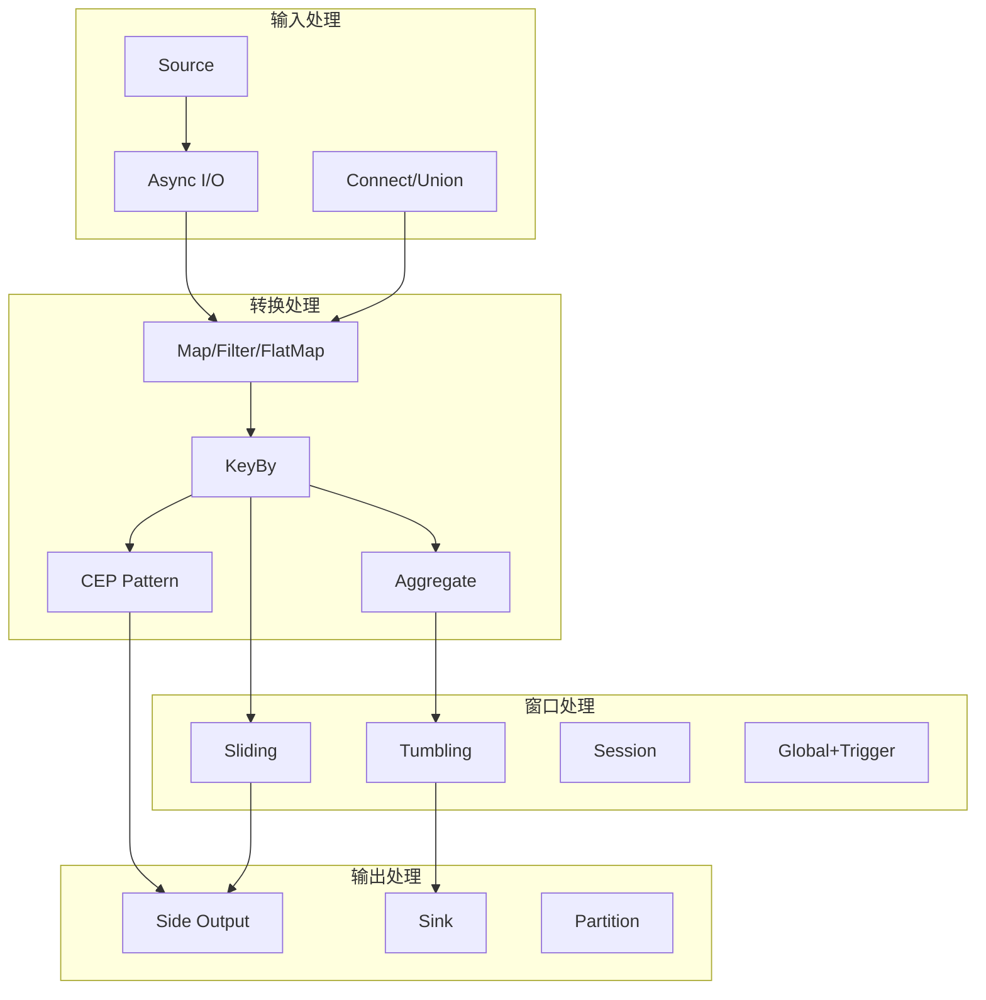

# 练习 05: 设计模式实现

> 所属阶段: Knowledge | 前置依赖: [exercise-02](./exercise-02-flink-basics.md), [exercise-03](./exercise-03-checkpoint-analysis.md) | 形式化等级: L4

---

## 1. 学习目标

完成本练习后，你将能够：

- **Def-K-05-01**: 掌握流计算中的核心设计模式
- **Def-K-05-02**: 实现复杂的窗口计算模式
- **Def-K-05-03**: 使用 CEP 库处理复杂事件
- **Def-K-05-04**: 设计可复用的流处理组件

---

## 2. 预备知识

### 2.1 流计算设计模式分类

| 模式类别 | 代表模式 | 应用场景 |
|----------|----------|----------|
| 窗口模式 | 会话窗口、滑动窗口、滚动窗口 | 时间序列分析 |
| 分流模式 | 侧输出流、ProcessFunction | 异常处理、多路输出 |
| 连接模式 | Interval Join, Window Join | 流关联 |
| 异步模式 | AsyncFunction | 外部系统查询 |
| CEP 模式 | 序列、选择、循环 | 复杂事件检测 |

### 2.2 Flink CEP 基础

```java
// CEP 模式定义示例
Pattern<LoginEvent, ?> pattern = Pattern
    .<LoginEvent>begin("first")
    .where(evt -> evt.getStatus().equals("FAIL"))
    .next("second")
    .where(evt -> evt.getStatus().equals("FAIL"))
    .within(Time.seconds(10));
```

---

## 3. 练习题

### 3.1 理论题 (30分)

#### 题目 5.1: 窗口模式对比 (10分)

**难度**: L4

比较以下窗口模式的适用场景和实现要点：

1. **Tumbling Window vs Sliding Window** (3分)
2. **Session Window 的 gap 配置策略** (3分)
3. **Global Window 与 Trigger 的配合使用** (4分)

---

#### 题目 5.2: 流连接策略 (10分)

**难度**: L4

分析以下流连接场景的最佳方案：

| 场景 | 流A特征 | 流B特征 | 推荐连接方式 |
|------|---------|---------|--------------|
| 订单-支付关联 | 先产生，数据完整 | 后产生，可能延迟 | |
| 用户点击-购买 | 高频流 | 低频流 | |
| 传感器数据融合 | 同频，时间对齐 | 同频，时间对齐 | |
| 实时推荐 | 需要历史数据 | 实时事件 | |

---

#### 题目 5.3: 反压机制分析 (10分)

**难度**: L4

**任务**：

1. 解释 Flink 反压 (Backpressure) 的产生原因和传播机制 (4分)
2. 对比 Flink 1.5 前后的反压实现差异 (3分)
3. 列举至少3种反压监控指标和优化策略 (3分)

---

### 3.2 编程题 (70分)

#### 题目 5.4: 实时 Top-N 实现 (15分)

**难度**: L4

实现一个实时统计热门商品的 Top-N 程序。

**需求**：

- 输入：用户点击流（商品ID, 时间戳）
- 每1分钟计算一次点击量 Top 10 商品
- 使用滑动窗口平滑结果（滑动步长10秒）
- 输出：排名、商品ID、点击量

**挑战**：

- 考虑数据倾斜（某些商品点击特别多）
- 优化状态大小（不保存所有商品点击数）

---

#### 题目 5.5: 订单超时检测 (20分)

**难度**: L4

实现一个订单超时检测系统。

**需求**：

- 输入：订单创建事件、支付事件
- 检测创建后15分钟未支付的订单
- 超时订单输出到告警流
- 已支付订单取消超时检测

**实现方案**：

```java
// 方案1: 使用 ProcessFunction + Timer
// 方案2: 使用 CEP
// TODO: 分别实现两种方案并对比
```

**任务**：

1. 实现基于 ProcessFunction 的方案 (8分)
2. 实现基于 CEP 的方案 (8分)
3. 对比两种方案的性能和适用场景 (4分)

---

#### 题目 5.6: 双流 Interval Join (15分)

**难度**: L4

实现订单流与物流流的关联。

**需求**：

- 订单流：订单ID, 用户ID, 创建时间
- 物流流：订单ID, 物流状态, 更新时间
- 关联条件：物流更新时间在订单创建后 5 分钟内
- 输出：订单详情 + 最新物流状态

**要求**：

- 使用 Interval Join
- 处理未匹配到的订单（输出到侧流）
- 使用 State TTL 管理过期数据

---

#### 题目 5.7: 异步外部数据查询 (10分)

**难度**: L4

优化用户画像补全程序。

**场景**：

- 输入：用户行为事件（用户ID, 行为类型）
- 需要查询外部 Redis 获取用户画像
- 原实现使用 MapFunction，同步查询导致吞吐量低

**任务**：

1. 使用 AsyncFunction 重构程序 (5分)
2. 配置合适的超时和容量参数 (3分)
3. 实现查询结果缓存机制 (2分)

---

#### 题目 5.8: 自定义窗口与触发器 (10分)

**难度**: L5

实现一个动态窗口：窗口大小根据数据量动态调整。

**需求**：

- 基础窗口大小：100条记录
- 如果记录到达速率 > 100条/秒，窗口扩大至200条
- 如果速率 < 10条/秒，窗口缩小至50条
- 同时设置最大窗口时间（30秒）

**提示**：

- 继承 `WindowAssigner`
- 自定义 `Trigger`
- 使用 `GlobalWindows` 作为基础

---

## 4. 参考答案链接

| 题目 | 答案位置 | 补充说明 |
|------|----------|----------|
| 5.1 | [answers/05-patterns.md](./answers/05-patterns.md#51) | 窗口模式详解 |
| 5.2 | [answers/05-patterns.md](./answers/05-patterns.md#52) | 连接策略对比表 |
| 5.3 | [answers/05-patterns.md](./answers/05-patterns.md#53) | 反压机制分析 |
| 5.4 | [answers/05-code/TopN.java](./answers/05-code/TopN.java) | Top-N实现 |
| 5.5 | [answers/05-code/OrderTimeout.java](./answers/05-code/OrderTimeout.java) | 两种方案对比 |
| 5.6 | [answers/05-code/IntervalJoin.java](./answers/05-code/IntervalJoin.java) | Interval Join |
| 5.7 | [answers/05-code/AsyncLookup.java](./answers/05-code/AsyncLookup.java) | 异步查询 |
| 5.8 | [answers/05-code/DynamicWindow.java](./answers/05-code/DynamicWindow.java) | 自定义窗口 |

---

## 5. 评分标准

### 总分分布

| 等级 | 分数区间 | 要求 |
|------|----------|------|
| S | 95-100 | 全部完成，代码优雅，有性能优化 |
| A | 85-94 | 功能完整，代码规范 |
| B | 70-84 | 主要功能实现，少量问题 |
| C | 60-69 | 基本功能实现 |
| F | <60 | 功能缺失或无法运行 |

### 编程题评分细则

| 题目 | 分值 | 评分标准 |
|------|------|----------|
| 5.4 | 15 | TopN计算正确 + 状态优化 |
| 5.5 | 20 | 两种方案完整 + 对比分析 |
| 5.6 | 15 | Interval Join正确 + 未匹配处理 |
| 5.7 | 10 | 异步重构正确 + 参数合理 |
| 5.8 | 10 | 动态窗口逻辑正确 |

---

## 6. 进阶挑战 (Bonus)

完成以下任一任务可获得额外 10 分：

1. **CEP 规则引擎**：实现一个可配置规则的 CEP 引擎（规则从配置文件加载）
2. **SQL 窗口优化**：对比 Table API / SQL 与 DataStream API 的性能差异
3. **模式库设计**：设计一个流处理模式的抽象库，支持组合和复用

---

## 7. 参考资源


---

## 8. 可视化

### 流计算设计模式图谱



---

*最后更新: 2026-04-02*
