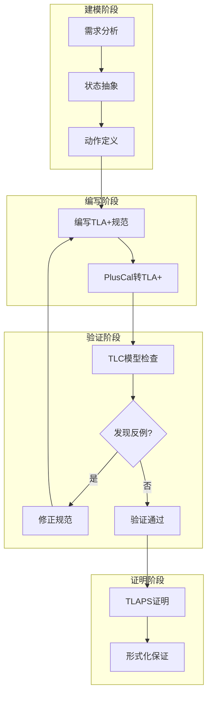

# 练习 06: TLA+ 实践

> 所属阶段: Knowledge | 前置依赖: [一致性层次](../../Struct/02-properties/02.02-consistency-hierarchy.md), [exercise-04](./exercise-04-consistency-models.md) | 形式化等级: L5

---

## 目录

- [练习 06: TLA+ 实践](#练习-06-tla-实践)
  - [目录](#目录)
  - [1. 学习目标](#1-学习目标)
  - [2. 预备知识](#2-预备知识)
    - [2.1 TLA+ 工具安装](#21-tla-工具安装)
    - [2.2 TLA+ 核心语法](#22-tla-核心语法)
    - [2.3 PlusCal 语法（推荐入门）](#23-pluscal-语法推荐入门)
  - [3. 练习题](#3-练习题)
    - [3.1 基础规范练习 (40分)](#31-基础规范练习-40分)
      - [题目 6.1: 简单状态机 (10分)](#题目-61-简单状态机-10分)
      - [题目 6.2: 分布式互斥 (15分)](#题目-62-分布式互斥-15分)
      - [题目 6.3: 两阶段提交 (15分)](#题目-63-两阶段提交-15分)
    - [3.2 流计算建模 (40分)](#32-流计算建模-40分)
      - [题目 6.4: Flink Checkpoint 建模 (20分)](#题目-64-flink-checkpoint-建模-20分)
      - [题目 6.5: Watermark 建模 (10分)](#题目-65-watermark-建模-10分)
      - [题目 6.6: Exactly-Once 语义验证 (10分)](#题目-66-exactly-once-语义验证-10分)
    - [3.3 验证与分析 (20分)](#33-验证与分析-20分)
      - [题目 6.7: 死锁检测 (10分)](#题目-67-死锁检测-10分)
      - [题目 6.8: 模型检查报告 (10分)](#题目-68-模型检查报告-10分)
  - [4. 参考答案链接](#4-参考答案链接)
  - [5. 评分标准](#5-评分标准)
    - [总分分布](#总分分布)
    - [各题评分细则](#各题评分细则)
  - [6. 进阶挑战 (Bonus)](#6-进阶挑战-bonus)
  - [7. 参考资源](#7-参考资源)
  - [8. 可视化](#8-可视化)
    - [TLA+ 开发流程](#tla-开发流程)
    - [TLA+ 语义层次](#tla-语义层次)

## 1. 学习目标

完成本练习后，你将能够：

- **Def-K-06-01**: 掌握 TLA+ 规范语言的基本语法
- **Def-K-06-02**: 使用 TLA+ 建模并发系统
- **Def-K-06-03**: 使用 TLC 模型检查器验证系统性质
- **Def-K-06-04**: 使用 TLAPS 进行形式化证明

---

## 2. 预备知识

### 2.1 TLA+ 工具安装

```bash
# 方式1: 官方 Toolbox download: https://lamport.azurewebsites.net/tla/toolbox.html

# 方式2: VS Code + TLA+ Extension
# 安装插件: TLA+ Nightly

# 方式3: 命令行 (Community Modules)
# Java 11+ 环境
```

### 2.2 TLA+ 核心语法

| 符号 | 含义 | 示例 |
|------|------|------|
| `==` | 定义 | `Foo == x + 1` |
| `/\` | 逻辑与 | `P /\ Q` |
| `\/` | 逻辑或 | `P \/ Q` |
| `~` | 逻辑非 | `~P` |
| `=>` | 蕴含 | `P => Q` |
| `<=>` | 等价 | `P <=> Q` |
| `\A` | 全称量词 | `\A x \in S : P(x)` |
| `\E` | 存在量词 | `\E x \in S : P(x)` |
| `CHOOSE` | 选择 | `CHOOSE x \in S : P(x)` |
| `'` | 下一状态 | `x' = x + 1` |
| `[]` | 总是 (Box) | `[]P` |
| `<>` | 最终 (Diamond) | `<>P` |
| `~>` | 导致 (Leads-to) | `P ~> Q` |

### 2.3 PlusCal 语法（推荐入门）

```pluscal
--algorithm MyAlgorithm
variables x = 0, y = 0;

begin
    A:
        x := x + 1;
    B:
        y := y + 1;
end algorithm
```

---

## 3. 练习题

### 3.1 基础规范练习 (40分)

#### 题目 6.1: 简单状态机 (10分)

**难度**: L4

用 TLA+ 建模一个简单的交通灯控制器。

**需求**：

- 三个状态：Red, Yellow, Green
- 转换：Red → Green → Yellow → Red
- 每个状态至少持续一个周期
- 验证：系统不会同时处于多个状态

**任务**：

1. 编写 TLA+ 规范 (6分)
2. 使用 TLC 验证 Safety 性质 (4分)

**参考模板**：

```tla
---- MODULE TrafficLight ----
EXTENDS Naturals

VARIABLES state

States == {"Red", "Yellow", "Green"}

Init == state = "Red"

Next ==
    \/ state = "Red" /\ state' = "Green"
    \/ state = "Green" /\ state' = "Yellow"
    \/ state = "Yellow" /\ state' = "Red"

Spec == Init /\ [][Next]_state
====
```

---

#### 题目 6.2: 分布式互斥 (15分)

**难度**: L5

使用 TLA+ 建模两个进程互斥访问临界区。

**需求**：

- 两个进程 P1, P2
- 每个进程有状态：NonCritical, Trying, Critical
- 使用共享变量实现互斥
- 验证：Safety（不会同时进入临界区）和 Liveness（请求最终会被满足）

**任务**：

1. 编写 TLA+ 规范（可使用 PlusCal）(8分)
2. 定义并验证 Safety 性质 (4分)
3. 定义并验证 Liveness 性质 (3分)

**参考模板**：

```pluscal
--algorithm MutualExclusion
variables flag = [i \in {1, 2} |-> FALSE];

process Proc \in {1, 2}
variable other;
begin
    Start:
        other := 3 - self;
    Try:
        flag[self] := TRUE;
    Check:
        await ~flag[other];
    Critical:
        skip;
    Exit:
        flag[self] := FALSE;
    goto Start;
end process;
end algorithm
```

---

#### 题目 6.3: 两阶段提交 (15分)

**难度**: L5

用 TLA+ 建模两阶段提交协议。

**系统组件**：

- 一个 Coordinator
- 多个 Participants

**协议流程**：

1. Coordinator 发送 Prepare 给所有 Participants
2. 每个 Participant 决定 Vote Yes/No
3. Coordinator 收集所有 Votes
4. 如果全部 Yes，发送 Commit；否则发送 Abort
5. Participants 执行提交或回滚

**任务**：

1. 编写完整 TLA+ 规范 (8分)
2. 验证：如果 Coordinator 决定 Commit，所有 Participants 最终提交 (4分)
3. 分析 Coordinator 崩溃场景 (3分)

---

### 3.2 流计算建模 (40分)

#### 题目 6.4: Flink Checkpoint 建模 (20分)

**难度**: L5

使用 TLA+ 建模 Flink Checkpoint 的核心机制。

**建模要点**：

- 一个 Source，一个 Sink，一个 Operator
- Checkpoint Coordinator 触发 Barrier
- Barrier 在流中传播
- 各算子快照状态
- 完成或超时处理

**任务**：

1. 定义系统状态变量 (5分)
2. 定义 Checkpoint 启动动作 (5分)
3. 定义 Barrier 传播和快照动作 (5分)
4. 验证：如果 Checkpoint 完成，所有算子状态一致 (5分)

**参考结构**：

```tla
---- MODULE FlinkCheckpoint ----
EXTENDS Naturals, Sequences, FiniteSets

CONSTANTS Operators, MaxAttempts

VARIABLES
    checkpointId,
    operatorStates,
    barriersInFlight,
    coordinatorState

Init ==
    /\ checkpointId = 0
    /\ operatorStates = [op \in Operators |-> "IDLE"]
    /\ barriersInFlight = << >>
    /\ coordinatorState = "IDLE"

TriggerCheckpoint ==
    /\ coordinatorState = "IDLE"
    /\ checkpointId' = checkpointId + 1
    /\ coordinatorState' = "IN_PROGRESS"
    /\ barriersInFlight' = Append(barriersInFlight, checkpointId')
    /\ UNCHANGED operatorStates

ReceiveBarrier(op) ==
    /\ operatorStates[op] = "IDLE"
    /\ Len(barriersInFlight) > 0
    /\ barriersInFlight[1] > 0
    /\ operatorStates' = [operatorStates EXCEPT ![op] = "SNAPSHOTTING"]
    /\ UNCHANGED <<checkpointId, barriersInFlight, coordinatorState>>

(* 其他动作定义... *)

CompleteCheckpoint ==
    /\ \A op \in Operators : operatorStates[op] = "SNAPSHOTTED"
    /\ coordinatorState' = "IDLE"
    /\ operatorStates' = [op \in Operators |-> "IDLE"]
    /\ UNCHANGED <<checkpointId, barriersInFlight>>

Next ==
    \/ TriggerCheckpoint
    \/ \E op \in Operators : ReceiveBarrier(op)
    \/ \E op \in Operators : CompleteSnapshot(op)
    \/ CompleteCheckpoint

Spec == Init /\ [][Next]_vars
====
```

---

#### 题目 6.5: Watermark 建模 (10分)

**难度**: L5

使用 TLA+ 建模 Flink Watermark 机制。

**需求**：

- 建模事件时间和 Watermark 的推进
- 处理乱序事件
- 验证：Watermark 单调不减

**任务**：

1. 定义事件流和 Watermark 变量 (3分)
2. 定义事件处理和 Watermark 生成动作 (4分)
3. 验证 Watermark 性质 (3分)

---

#### 题目 6.6: Exactly-Once 语义验证 (10分)

**难度**: L5

使用 TLA+ 建模并验证流计算的 Exactly-Once 语义。

**需求**：

- 建模 Source、Operator、Sink
- 包含故障和恢复
- 定义 Exactly-Once 性质

**任务**：

1. 定义系统状态（包括输入、输出、状态）(3分)
2. 定义故障和恢复动作 (3分)
3. 形式化定义 Exactly-Once 性质并验证 (4分)

---

### 3.3 验证与分析 (20分)

#### 题目 6.7: 死锁检测 (10分)

**难度**: L4

使用 TLA+ 检测哲学家就餐问题中的死锁。

**任务**：

1. 使用 PlusCal 建模 5 位哲学家问题 (4分)
2. 定义死锁检测条件 (3分)
3. 运行 TLC 验证，展示死锁状态 (3分)

---

#### 题目 6.8: 模型检查报告 (10分)

**难度**: L4

选择上述任一模型，完成以下分析：

1. 状态空间大小估计 (2分)
2. TLC 运行时间和内存使用 (2分)
3. 发现的反例（如果有）(3分)
4. 对称性约简的应用（如适用）(3分)

---

## 4. 参考答案链接

| 题目 | 答案位置 | 补充说明 |
|------|----------|----------|
| 6.1 | **answers/06-tla/TrafficLight.tla**（代码示例待添加） | 完整规范 |
| 6.2 | **answers/06-tla/MutualExclusion.tla**（代码示例待添加） | 含Liveness |
| 6.3 | **answers/06-tla/TwoPhaseCommit.tla**（代码示例待添加） | 2PC完整实现 |
| 6.4 | **answers/06-tla/FlinkCheckpoint.tla**（代码示例待添加） | Checkpoint建模 |
| 6.5 | **answers/06-tla/Watermark.tla**（代码示例待添加） | Watermark机制 |
| 6.6 | **answers/06-tla/ExactlyOnce.tla**（代码示例待添加） | EOS验证 |
| 6.7 | **answers/06-tla/DiningPhilosophers.tla**（代码示例待添加） | 死锁检测 |
| 6.8 | **answers/06-tla/ModelCheckingReport.md**（答案待添加） | 报告模板 |

---

## 5. 评分标准

### 总分分布

| 等级 | 分数区间 | 要求 |
|------|----------|------|
| S | 95-100 | 全部规范语法正确，验证通过，有创新 |
| A | 85-94 | 主要规范正确，验证基本通过 |
| B | 70-84 | 规范有少量错误，主要验证通过 |
| C | 60-69 | 规范基本可运行 |
| F | <60 | 规范语法错误较多 |

### 各题评分细则

| 题目 | 分值 | 关键评分点 |
|------|------|------------|
| 6.1 | 10 | 状态机正确，TLC验证通过 |
| 6.2 | 15 | 互斥正确，Liveness定义完整 |
| 6.3 | 15 | 2PC协议完整，崩溃场景分析 |
| 6.4 | 20 | Checkpoint机制建模准确 |
| 6.5 | 10 | Watermark性质正确 |
| 6.6 | 10 | Exactly-Once形式化准确 |
| 6.7 | 10 | 死锁检测正确 |
| 6.8 | 10 | 报告完整，数据分析到位 |

---

## 6. 进阶挑战 (Bonus)

完成以下任一任务可获得额外 10 分：

1. **TLAPS 证明**：使用 TLAPS 完成 MutualExclusion 的形式化证明
2. **refinements**：定义一个抽象规范和具体规范，证明精化关系
3. **分布式共识**：用 TLA+ 建模 Raft 或 Paxos 协议核心

---

## 7. 参考资源


---

## 8. 可视化

### TLA+ 开发流程



### TLA+ 语义层次

```mla
graph TB
    subgraph "时序逻辑"
        T1[行为性质]
        T2[Safety: []P]
        T3[Liveness: <>P]
        T4[Fairness]
    end

    subgraph "动作逻辑"
        A1[状态转移]
        A2[Next 关系]
        A3[UNCHANGED]
    end

    subgraph "数据逻辑"
        D1[集合论]
        D2[函数/序列]
        D3[模块系统]
    end

    D1 --> A1 --> T1
    D2 --> A2 --> T2
    D3 --> A3 --> T3
    T2 --> T4
```

---

*最后更新: 2026-04-02*
