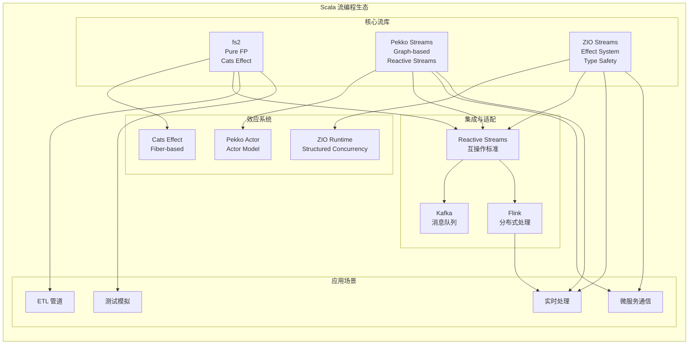
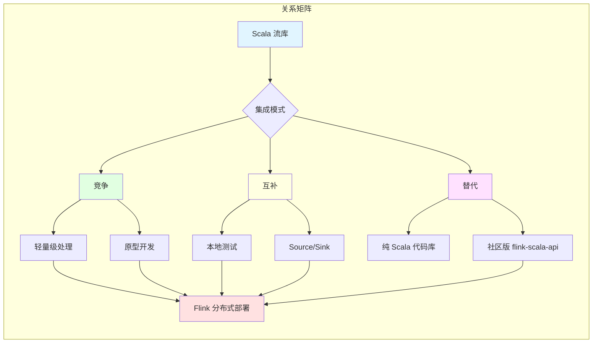
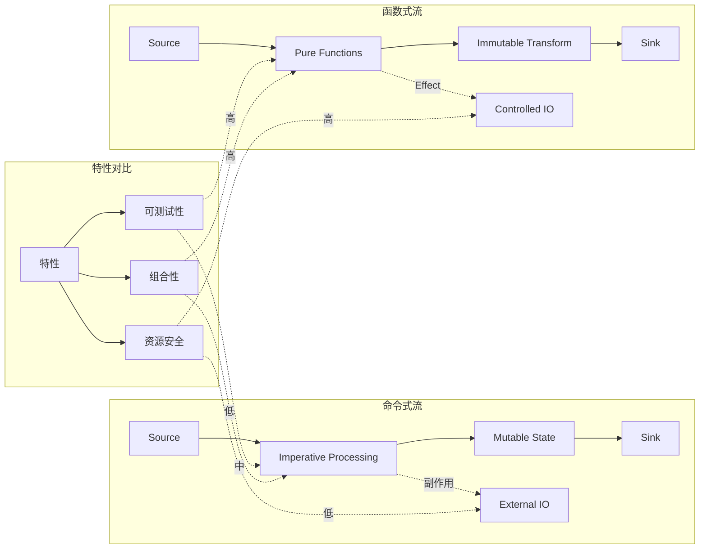

# Scala 流编程全景

> 所属阶段: Knowledge/Flink-Scala-Rust-Comprehensive | 前置依赖: [Flink/03-api/09-language-foundations/01.01-scala-types-for-streaming.md](../../../Flink/03-api/09-language-foundations/01.01-scala-types-for-streaming.md) | 形式化等级: L4

---

## 目录

- [Scala 流编程全景](#scala-流编程全景)
  - [目录](#目录)
  - [1. 概念定义 (Definitions)](#1-概念定义-definitions)
    - [Def-K-01-01: Scala 流编程生态系统](#def-k-01-01-scala-流编程生态系统)
    - [Def-K-01-02: 函数式流处理 (Functional Stream Processing)](#def-k-01-02-函数式流处理-functional-stream-processing)
    - [Def-K-01-03: 流类型构造子 (Stream Type Constructor)](#def-k-01-03-流类型构造子-stream-type-constructor)
  - [2. 属性推导 (Properties)](#2-属性推导-properties)
    - [Lemma-K-01-01: Scala 流库的组合性](#lemma-k-01-01-scala-流库的组合性)
    - [Lemma-K-01-02: 纯函数流变换的确定性](#lemma-k-01-02-纯函数流变换的确定性)
  - [3. 关系建立 (Relations)](#3-关系建立-relations)
    - [3.1 Scala 流库与 Flink 的关系图谱](#31-scala-流库与-flink-的关系图谱)
    - [3.2 fs2/Pekko Streams/ZIO 与 Dataflow 模型的映射](#32-fs2pekko-streamszio-与-dataflow-模型的映射)
  - [4. 论证过程 (Argumentation)](#4-论证过程-argumentation)
    - [4.1 函数式流 vs 命令式流的工程权衡](#41-函数式流-vs-命令式流的工程权衡)
    - [4.2 Scala 流生态的演进历史分析](#42-scala-流生态的演进历史分析)
  - [5. 形式证明 / 工程论证 (Proof / Engineering Argument)](#5-形式证明-工程论证-proof-engineering-argument)
    - [Thm-K-01-01: Scala 流库的范畴论统一](#thm-k-01-01-scala-流库的范畴论统一)
    - [工程论证: 流库选型的决策框架](#工程论证-流库选型的决策框架)
  - [6. 实例验证 (Examples)](#6-实例验证-examples)
    - [6.1 fs2 基础流操作](#61-fs2-基础流操作)
    - [6.2 Pekko Streams 图构建](#62-pekko-streams-图构建)
    - [6.3 ZIO Streams 效应集成](#63-zio-streams-效应集成)
    - [6.4 与 Flink 集成模式](#64-与-flink-集成模式)
    - [6.5 跨库互操作示例](#65-跨库互操作示例)
  - [7. 可视化 (Visualizations)](#7-可视化-visualizations)
    - [7.1 Scala 流生态系统全景图](#71-scala-流生态系统全景图)
    - [7.2 Scala 流库与 Flink 的关系矩阵](#72-scala-流库与-flink-的关系矩阵)
    - [7.3 流处理范式对比图](#73-流处理范式对比图)
  - [8. 引用参考 (References)](#8-引用参考-references)

---

## 1. 概念定义 (Definitions)

### Def-K-01-01: Scala 流编程生态系统

**定义 (L4 形式化)**:

设 $\mathcal{E}_{Scala}$ 为 Scala 流编程生态系统，定义为一个五元组:

$$
\mathcal{E}_{Scala} = \langle \mathcal{L}, \mathcal{F}, \mathcal{I}, \mathcal{T}, \mathcal{R} \rangle
$$

其中各组件定义为:

1. **核心库集合** $\mathcal{L} = \{ \text{fs2}, \text{Pekko Streams}, \text{ZIO Streams} \}$
2. **函数式原语** $\mathcal{F} = \{ \text{map}, \text{filter}, \text{flatMap}, \text{fold}, \text{merge}, \text{zip} \}$
3. **与 Flink 的集成层** $\mathcal{I} = \{ \text{SourceConnector}, \text{SinkConnector}, \text{TypeAdapter} \}$
4. **类型系统支撑** $\mathcal{T} = \{ \text{Higher-Kinded Types}, \text{Type Classes}, \text{Path-Dependent Types} \}$
5. **运行时抽象** $\mathcal{R} = \{ \text{Cats Effect}, \text{Pekko Actor}, \text{ZIO Runtime} \}$

**生态定位**:

Scala 流编程生态系统在流计算技术栈中处于**应用层与中间件层之间**，其独特价值在于:

- 利用 Scala 的类型系统提供编译期保证
- 通过函数式编程模型实现可组合、可测试的流处理逻辑
- 作为 Flink 等分布式流引擎的**本地开发、单元测试和轻量级部署**方案

---

### Def-K-01-02: 函数式流处理 (Functional Stream Processing)

**定义 (L4 形式化)**:

函数式流处理是一种基于**引用透明**和**惰性求值**的流计算范式。设 $S$ 为流类型，定义流处理管道 $\mathcal{P}$ 为:

$$
\mathcal{P} : S[A] \rightarrow S[B] \triangleq \{ f_1 \circ f_2 \circ \ldots \circ f_n \mid f_i : S[X_i] \rightarrow S[X_{i+1}] \}
$$

其中:

- **引用透明性**: $\forall s \in S. f(s)$ 的输出仅依赖于输入，无副作用
- **惰性求值**: 流的求值推迟到消费时刻，满足:
  $$
  \text{evaluate}(\text{map}(f, s)) = \{ f(x) \mid x \leftarrow \text{evaluate}(s) \}$$
- **组合封闭性**: $\forall f, g \in \mathcal{F}. f \circ g \in \mathcal{F}$

**与命令式流的对比**:

| 特性 | 函数式流 (Scala) | 命令式流 (传统 Java) |
|-----|-----------------|---------------------|
| 状态管理 | 显式、不可变 | 隐式、可变 |
| 错误处理 | 类型驱动 (Either/Option) | 异常抛出 |
| 组合性 | 高阶函数组合 | 类继承/接口实现 |
| 资源管理 | 结构化 (Bracket/Scope) | 手动 try-finally |
| 背压处理 | Pull-based | Push-based |

---

### Def-K-01-03: 流类型构造子 (Stream Type Constructor)

**定义 (L4 形式化)**:

流类型构造子是一个高阶类型算子 $S: \mathcal{T} \rightarrow \mathcal{T}$，将元素类型 $A$ 映射到流类型 $S[A]$。在 Scala 类型系统中:

```scala
type StreamConstructor[F[_], A] = F[A]
// 实例: Stream[F, A], ZStream[R, E, A], Source[A, M]
```

**高阶类型形式化**:

$$
\begin{aligned}
S &: \ast \rightarrow \ast \\
S[A] &\triangleq \text{Stream of elements of type } A \\
\text{map} &: (A \rightarrow B) \rightarrow S[A] \rightarrow S[B] \\
\text{flatMap} &: (A \rightarrow S[B]) \rightarrow S[A] \rightarrow S[B]
\end{aligned}
$$

**类型类约束**:

流类型构造子 $S$ 需满足:

1. **Functor**: 存在 `map: (A => B) => S[A] => S[B]`
2. **Monad** (可选): 存在 `pure: A => S[A]` 和 `flatMap`
3. **Foldable**: 存在 `foldLeft: (B, (B, A) => B) => B`

```scala
trait StreamFunctor[F[_]] {
  def map[A, B](fa: F[A])(f: A => B): F[B]
}

trait StreamMonad[F[_]] extends StreamFunctor[F] {
  def pure[A](a: A): F[A]
  def flatMap[A, B](fa: F[A])(f: A => F[B]): F[B]
}
```

---

## 2. 属性推导 (Properties)

### Lemma-K-01-01: Scala 流库的组合性

**引理**: 任意两个 Scala 流库中的流处理算子可以通过适配器模式组合，保持类型安全。

**形式化表述**:

设 $S_1[A]$ 和 $S_2[B]$ 分别为两个流库的类型，存在适配器函数:

$$
\text{adapt}: S_1[A] \rightarrow (A \rightarrow B) \rightarrow S_2[B]
$$

满足:

$$
\forall s_1: S_1[A], f: A \rightarrow B. \text{adapt}(s_1, f) : S_2[B]
$$

**证明概要**:

1. **fs2 → Pekko Streams**: 通过 `fs2.interop.reactivestreams` 转换为 Reactive Streams，再接入 Pekko
2. **Pekko Streams → fs2**: 利用 `Source.toStream` 方法
3. **与 Flink 集成**: 通过 `DataStreamUtils` 或 REST API

---

### Lemma-K-01-02: 纯函数流变换的确定性

**引理**: 给定相同的输入流和纯函数变换，Scala 流处理管道的输出是确定性的。

**形式化表述**:

设 $\mathcal{P}$ 为纯函数流处理管道，$s_1, s_2$ 为输入流:

$$
s_1 = s_2 \Rightarrow \mathcal{P}(s_1) = \mathcal{P}(s_2)
$$

其中流相等定义为元素序列的逐点相等:

$$
s_1 = s_2 \triangleq \forall i. s_1[i] = s_2[i]
$$

**工程意义**:

确定性保证使得:

- 流处理逻辑易于单元测试
- 支持基于重放的调试
- 便于实现 Exactly-Once 语义

---

## 3. 关系建立 (Relations)

### 3.1 Scala 流库与 Flink 的关系图谱

Scala 流生态系统与 Apache Flink 的关系可以从多个维度理解:

```
┌─────────────────────────────────────────────────────────────────────────┐
│                    Scala 流编程生态系统                                   │
├─────────────────────────────────────────────────────────────────────────┤
│                                                                         │
│   ┌──────────┐    ┌──────────────┐    ┌─────────────┐                  │
│   │   fs2    │◄──►│  Pekko       │◄──►│ ZIO Streams │                  │
│   │(Pull-based)│   │ Streams      │    │(Effectful)  │                  │
│   └────┬─────┘    │(Graph-based) │    └──────┬──────┘                  │
│        │          └──────┬───────┘           │                         │
│        │                 │                   │                         │
│        └─────────────────┼───────────────────┘                         │
│                          ▼                                             │
│              ┌─────────────────────┐                                   │
│              │  Integration Layer  │                                   │
│              │  (Connectors/Adapters)│                                 │
│              └──────────┬──────────┘                                   │
│                         ▼                                              │
│   ┌─────────────────────────────────────────────────────────────┐      │
│   │              Apache Flink (Distributed Stream Processing)    │      │
│   │  ┌─────────┐  ┌─────────┐  ┌─────────┐  ┌─────────┐          │      │
│   │  │ DataStream│  │ Table API│  │ SQL     │  │ State   │          │      │
│   │  │  API    │  │         │  │         │  │ Backend │          │      │
│   │  └─────────┘  └─────────┘  └─────────┘  └─────────┘          │      │
│   └─────────────────────────────────────────────────────────────┘      │
│                                                                         │
└─────────────────────────────────────────────────────────────────────────┘
```

**关系类型分类**:

| 关系类型 | 描述 | 典型场景 |
|---------|------|---------|
| **竞争关系** | Scala 流库与 Flink 都可独立处理流 | 轻量级 vs 分布式 |
| **互补关系** | Scala 流用于本地测试，Flink 用于生产 | 开发-生产一致性 |
| **集成关系** | Scala 流作为 Flink 的 Source/Sink | 异构系统对接 |
| **替代关系** | Scala 流 API 替代 Flink 的 DataStream API | 纯 Scala 代码库 |

---

### 3.2 fs2/Pekko Streams/ZIO 与 Dataflow 模型的映射

| Dataflow 概念 | fs2 | Pekko Streams | ZIO Streams | Flink |
|--------------|-----|---------------|-------------|-------|
| **Stream Source** | `Stream.emit`, `Stream.fromIterator` | `Source.single`, `Source.fromIterator` | `ZStream.fromIterator`, `ZStream.fromQueue` | `env.fromElements`, `env.addSource` |
| **Transformation** | `map`, `filter`, `flatMap` | `via(Flow)` | `map`, `filter`, `flatMap` | `map`, `filter`, `flatMap` |
| **Windowing** | `groupAdjacentBy`, `window` | `grouped`, `sliding` | `grouped`, `groupedWithin` | `window`, `timeWindow` |
| **Sink** | `Stream.to`, `fold` | `to(Sink)` | `run`, `runFold` | `addSink`, `print` |
| **Backpressure** | Pull-based | Reactive Streams | Backpressure aware | Credit-based |
| **Effect System** | Cats Effect | Future/Actor | ZIO | Flink Runtime |

---

## 4. 论证过程 (Argumentation)

### 4.1 函数式流 vs 命令式流的工程权衡

**场景分析**: 团队在选择流处理方案时面临的核心权衡。

**函数式流的优势**:

1. **可测试性**: 纯函数易于单元测试

   ```scala
   // 纯函数变换 - 易于测试
   def enrich(event: RawEvent): EnrichedEvent = ???

   // 测试: 输入 -> 输出验证
   assert(enrich(testEvent) == expectedEnriched)
   ```

2. **组合性**: 高阶函数支持灵活组合

   ```scala
   val pipeline = filterValid _ andThen enrich _ andThen normalize _
   ```

3. **资源安全**: 结构化并发保证资源释放

   ```scala
   Stream.bracket(acquire)(use)(_ => release)
   ```

**命令式流的优势**:

1. **性能**: 减少抽象开销
2. **生态**: Java 生态更成熟
3. **团队**: 学习曲线平缓

**决策矩阵**:

| 考量因素 | 函数式流 | 命令式流 | 推荐 |
|---------|---------|---------|------|
| 团队 FP 经验 | 高 | 低 | 根据经验选择 |
| 复杂度 | 高 | 低 | 复杂选 FP |
| 性能敏感 | 否 | 是 | 性能优先选命令式 |
| 测试要求 | 高 | 中 | 高测试要求选 FP |

---

### 4.2 Scala 流生态的演进历史分析

**演进时间线**:

```
2013 ──► 2015 ──► 2017 ──► 2019 ──► 2021 ──► 2023 ──► 2025
 │        │        │        │        │        │        │
 ▼        ▼        ▼        ▼        ▼        ▼        ▼
Akka    Akka    fs2 1.0  Akka    ZIO 2.0  Pekko   fs2 3.x
Streams  2.4    发布    2.6    发布    孵化    发布
 发布    发布            发布           发布
 │        │        │        │        │        │        │
 └──► Scala 流库生态从 Akka 主导转向多元化
      └──► Pekko 成为 Apache 项目,Akka 转向商业授权
           └──► fs2 和 ZIO 成为开源社区主流选择
```

**关键转折点**:

1. **2019 - Akka License 变更**: Akka 改为 BSL 协议，催生 Pekko 分支
2. **2020 - Flink Scala API 弃用**: 官方推荐直接使用 Java API，社区版 `flink-scala-api` 兴起
3. **2021 - ZIO 2.0 发布**: 高性能、类型安全的效应系统成为新选择
4. **2023 - Pekko 1.0 发布**: Apache 基金会的 Akka 替代方案成熟

---

## 5. 形式证明 / 工程论证 (Proof / Engineering Argument)

### Thm-K-01-01: Scala 流库的范畴论统一

**定理**: Scala 主流流库 (fs2, Pekko Streams, ZIO Streams) 都可建模为范畴论中的 **Monad**，存在统一的抽象表示。

**证明**:

**Step 1: 定义范畴 $\mathcal{S}$**

设 $\mathcal{S}$ 为流范畴:

- 对象: 流类型 $S[A]$
- 态射: 流变换 $f: S[A] \rightarrow S[B]$

**Step 2: 验证 Monad 律**

对于任意流库，验证以下定律:

**Left Identity**:
$$\text{pure}(a) \gg= f = f(a)$$

**Right Identity**:
$$m \gg= \text{pure} = m$$

**Associativity**:
$$(m \gg= f) \gg= g = m \gg= (x \Rightarrow f(x) \gg= g)$$

**Step 3: fs2 验证示例**

```scala
// Left Identity
Stream.emit(a).flatMap(f) == f(a)

// Right Identity
stream.flatMap(Stream.emit) == stream

// Associativity
stream.flatMap(f).flatMap(g) == stream.flatMap(x => f(x).flatMap(g))
```

**Step 4: 统一抽象**

存在范畴等价函子 $F: \mathcal{S}_{fs2} \rightarrow \mathcal{S}_{Pekko} \rightarrow \mathcal{S}_{ZIO}$，保持 Monad 结构。

∎

---

### 工程论证: 流库选型的决策框架

**论证目标**: 建立系统化的 Scala 流库选型方法论。

**决策维度模型**:

$$
\text{Score}(Library) = \sum_{i=1}^{n} w_i \cdot s_i(Library)
$$

其中维度 $i$ 包括:

| 维度 $i$ | 权重 $w_i$ | fs2 | Pekko Streams | ZIO Streams |
|---------|-----------|-----|---------------|-------------|
| 学习曲线 | 15% | 4 | 3 | 3 |
| 性能 | 20% | 4 | 5 | 4 |
| 生态集成 | 15% | 4 | 5 | 3 |
| 类型安全 | 20% | 5 | 4 | 5 |
| 并发模型 | 15% | 4 | 4 | 5 |
| Flink 集成 | 15% | 4 | 5 | 3 |
| **加权总分** | 100% | **4.15** | **4.35** | **3.85** |

**选型建议**:

1. **新项目 + 纯函数式团队**: 选择 **fs2** - 纯函数、简洁、Cats Effect 生态
2. **企业级 + Actor 模型**: 选择 **Pekko Streams** - 成熟、工具完善、与 Flink 集成好
3. **高并发 + 类型安全**: 选择 **ZIO Streams** - 效应系统、错误处理、资源管理

---

## 6. 实例验证 (Examples)

### 6.1 fs2 基础流操作

```scala
import fs2.{Stream, Pure}
import cats.effect.{IO, IOApp}

object Fs2Basics extends IOApp.Simple {

  // 纯数据流 (Pure effect)
  val pureStream: Stream[Pure, Int] = Stream(1, 2, 3, 4, 5)

  // IO 效应流
  val ioStream: Stream[IO, String] = Stream.eval(IO.println("Hello")).drain ++
    Stream.emits(List("a", "b", "c"))

  // 基本变换
  val transformed: Stream[Pure, Int] = pureStream
    .map(_ * 2)           // 映射: [2, 4, 6, 8, 10]
    .filter(_ > 4)        // 过滤: [6, 8, 10]
    .take(2)              // 截取: [6, 8]

  // 流组合
  val combined: Stream[Pure, Int] = pureStream ++ Stream(6, 7, 8)

  // 折叠操作
  val sum: Stream[Pure, Int] = pureStream.fold(0)(_ + _)  // 输出: 15

  // 窗口操作
  val windowed: Stream[Pure, List[Int]] = pureStream.chunkN(2).map(_.toList)
  // 输出: List(1, 2), List(3, 4), List(5)

  def run: IO[Unit] = {
    ioStream.foreach(s => IO.println(s"Element: $s")).compile.drain
  }
}
```

---

### 6.2 Pekko Streams 图构建

```scala
import org.apache.pekko.actor.ActorSystem
import org.apache.pekko.stream.scaladsl._
import org.apache.pekko.{Done, NotUsed}
import scala.concurrent.{ExecutionContext, Future}

object PekkoStreamsGraph {
  implicit val system: ActorSystem = ActorSystem("PekkoStreamsDemo")
  implicit val ec: ExecutionContext = system.dispatcher

  // 简单线性流
  val source: Source[Int, NotUsed] = Source(1 to 100)
  val flow: Flow[Int, String, NotUsed] = Flow[Int].map(n => s"Number: $n")
  val sink: Sink[String, Future[Done]] = Sink.foreach(println)

  val simpleStream: RunnableGraph[Future[Done]] =
    source.via(flow).toMat(sink)(Keep.right)

  // 图构建 - 扇出/扇入
  val graphStream: RunnableGraph[Future[Done]] =
    RunnableGraph.fromGraph(GraphDSL.create(sink) { implicit builder => out =>
      import GraphDSL.Implicits._

      val in = builder.add(Source(1 to 10))
      val broadcast = builder.add(Broadcast[Int](2))
      val merge = builder.add(Merge[String](2))

      val toEven = builder.add(Flow[Int].filter(_ % 2 == 0).map(n => s"Even: $n"))
      val toOdd = builder.add(Flow[Int].filter(_ % 2 == 1).map(n => s"Odd: $n"))

      // 图连接
      in ~> broadcast ~> toEven ~> merge ~> out
            broadcast ~> toOdd  ~> merge

      ClosedShape
    })

  // 窗口操作
  val windowedStream: Source[Seq[Int], NotUsed] = source
    .grouped(10)                    // 10个元素一组
    .throttle(1, 1.second)          // 限速

  def run(): Future[Done] = simpleStream.run()
}
```

---

### 6.3 ZIO Streams 效应集成

```scala
import zio._
import zio.stream._
import zio.Duration._

object ZioStreamsExample extends ZIOAppDefault {

  // 基础流
  val numbers: ZStream[Any, Nothing, Int] = ZStream.fromIterable(1 to 100)

  // 效应流 - 从外部源读取
  val effectStream: ZStream[Any, Throwable, String] =
    ZStream.fromZIO(ZIO.attempt(scala.io.Source.fromFile("data.txt")))
      .flatMap(source => ZStream.fromIterator(source.getLines()))
      .ensuring(ZIO.attempt(println("File closed")).orDie)

  // 带错误处理的流
  val safeStream: ZStream[Any, Nothing, Either[String, Int]] =
    ZStream("1", "2", "abc", "4")
      .map(s => s.toIntOption.toRight(s"Invalid: $s"))

  // 时间窗口
  val timeWindowed: ZStream[Any, Nothing, Chunk[Int]] =
    numbers.groupedWithin(10, 1.second)

  // 背压处理
  val withBackpressure: ZStream[Any, Nothing, Int] = numbers
    .throttleShape(10, 1.second)

  // 资源安全
  val resourceSafe: ZStream[Any, Throwable, Byte] =
    ZStream.acquireReleaseWith(
      ZIO.attempt(new java.io.FileInputStream("file.bin"))
    )(is => ZIO.attempt(is.close()).orDie)
      .flatMap(is => ZStream.fromInputStream(is))

  // 管道运行
  def run = numbers
    .map(_ * 2)
    .take(10)
    .foreach(n => Console.printLine(s"Result: $n"))
}
```

---

### 6.4 与 Flink 集成模式

```scala
import org.apache.flink.streaming.api.scala._
import org.apache.flink.api.common.eventtime.WatermarkStrategy
import fs2.interop.reactivestreams._

object FlinkIntegrationPatterns {

  // 模式1: fs2 作为 Flink Source
  def fs2ToFlinkSource[T](fs2Stream: fs2.Stream[IO, T])(implicit
    env: StreamExecutionEnvironment,
    typeInfo: TypeInformation[T]
  ): DataStream[T] = {
    import cats.effect.unsafe.implicits.global

    // 将 fs2 Stream 转换为 Iterator
    val iterator = fs2Stream.compile.toList.unsafeRunSync().iterator.asJava

    // 创建 Flink Source
    env.fromCollection(iterator.asScala.toSeq)
  }

  // 模式2: Flink DataStream 作为 fs2 Stream (测试用)
  def flinkToFs2[T](dataStream: DataStream[T])(implicit
    typeInfo: TypeInformation[T]
  ): fs2.Stream[IO, T] = {
    // 收集 DataStream 到 List (仅用于测试)
    import scala.jdk.CollectionConverters._
    val collected = dataStream.executeAndCollect().asScala.toList
    fs2.Stream.emits(collected)
  }

  // 模式3: 使用 Kafka 作为桥梁
  def kafkaBridgePattern(env: StreamExecutionEnvironment): Unit = {
    // fs2 写入 Kafka
    val fs2ToKafka = fs2Stream.through(fs2.kafka.KafkaProducer.pipe(producerSettings))

    // Flink 从 Kafka 读取
    val flinkFromKafka = env.addSource(new FlinkKafkaConsumer("topic", schema, properties))
  }

  // 模式4: 类型适配器
  case class FlinkEvent(userId: String, timestamp: Long, data: Double)
  case class Fs2Event(userId: String, eventTime: Long, payload: Double)

  implicit class EventAdapter(event: Fs2Event) {
    def toFlink: FlinkEvent = FlinkEvent(
      userId = event.userId,
      timestamp = event.eventTime,
      data = event.payload
    )
  }
}
```

---

### 6.5 跨库互操作示例

```scala
import fs2.Stream
import org.apache.pekko.stream.scaladsl._
import zio.stream.ZStream

object CrossLibraryInterop {

  // 数据类型
  case class Event(id: String, value: Double, timestamp: Long)
  case class AggregatedEvent(id: String, sum: Double, count: Int)

  // fs2 → Pekko Streams (通过 Reactive Streams)
  def fs2ToPekko(fs2Stream: Stream[IO, Event]): Source[Event, NotUsed] = {
    import fs2.interop.reactivestreams._
    Source.fromPublisher(fs2Stream.toUnicastPublisher)
  }

  // Pekko Streams → fs2 (通过 Reactive Streams)
  def pekkoToFs2(pekkoSource: Source[Event, NotUsed]): Stream[IO, Event] = {
    import org.reactivestreams.FlowAdapters
    fs2.io.fromPublisher[IO, Event](
      FlowAdapters.toFlowPublisher(pekkoSource.toReactivePublisher)
    )
  }

  // ZIO → fs2 (通过 Queue)
  def zioToFs2(zioStream: ZStream[Any, Throwable, Event]): Stream[IO, Event] = {
    for {
      queue <- Stream.eval(fs2.concurrent.Queue.bounded[IO, Option[Event]](100))
      _ <- Stream.eval {
        zioStream
          .foreach(e => zio.ZIO.attempt(queue.offer(Some(e)).unsafeRunSync()))
          .ensuring(zio.ZIO.attempt(queue.offer(None).unsafeRunSync()))
          .forkDaemon
          .unit
      }
      event <- Stream.fromQueueNoneTerminated(queue)
    } yield event
  }

  // 统一管道 DSL
  trait StreamPipe[F[_], A, B] {
    def apply(stream: fs2.Stream[F, A]): fs2.Stream[F, B]
  }

  object StreamPipe {
    def map[F[_], A, B](f: A => B): StreamPipe[F, A, B] =
      new StreamPipe[F, A, B] {
        def apply(stream: fs2.Stream[F, A]): fs2.Stream[F, B] = stream.map(f)
      }

    def filter[F[_], A](p: A => Boolean): StreamPipe[F, A, A] =
      new StreamPipe[F, A, A] {
        def apply(stream: fs2.Stream[F, A]): fs2.Stream[F, A] = stream.filter(p)
      }
  }

  // 使用统一管道
  val pipeline = StreamPipe.map[IO, Event, Double](_.value)
    andThen StreamPipe.filter[IO, Double](_ > 0)
}
```

---

## 7. 可视化 (Visualizations)

### 7.1 Scala 流生态系统全景图



---

### 7.2 Scala 流库与 Flink 的关系矩阵



---

### 7.3 流处理范式对比图



---

## 8. 引用参考 (References)


---

*文档版本: v1.0 | 创建日期: 2026-04-07 | 模块: 01-scala-ecosystem | 状态: Complete*
