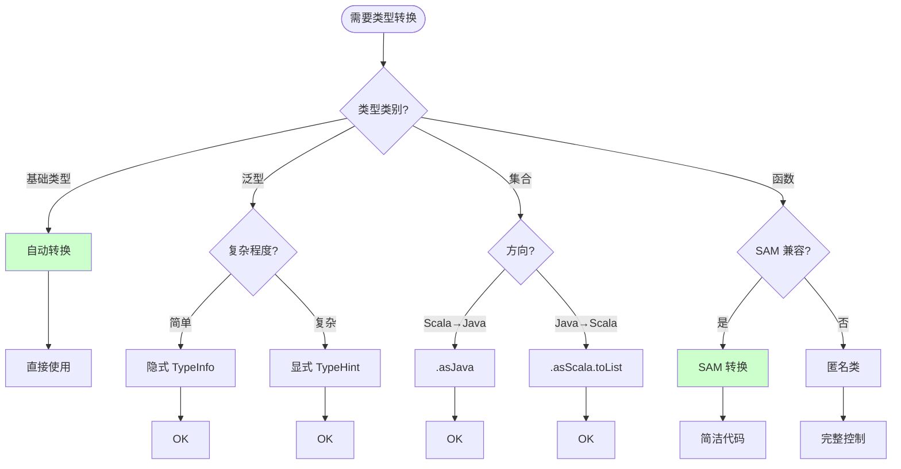
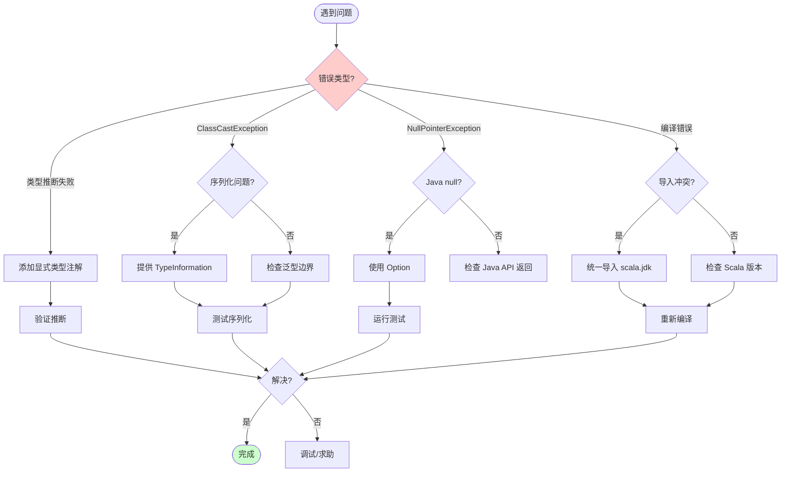

# Scala 调用 Flink Java API 指南

> 所属阶段: Knowledge/Flink-Scala-Rust-Comprehensive | 前置依赖: [01.02-flink-scala-api-analysis.md](./01.02-flink-scala-api-analysis.md), [Flink/03-api/09-language-foundations/02.01-java-api-from-scala.md](../../../Flink/03-api/09-language-foundations/02.01-java-api-from-scala.md) | 形式化等级: L4

---

## 目录

- [Scala 调用 Flink Java API 指南](#scala-调用-flink-java-api-指南)
  - [目录](#目录)
  - [1. 概念定义 (Definitions)](#1-概念定义-definitions)
    - [Def-K-03-01: Java/Scala 互操作类型映射](#def-k-03-01-javascala-互操作类型映射)
    - [Def-K-03-02: SAM 转换 (Single Abstract Method)](#def-k-03-02-sam-转换-single-abstract-method)
    - [Def-K-03-03: 类型擦除与类型标签](#def-k-03-03-类型擦除与类型标签)
  - [2. 属性推导 (Properties)](#2-属性推导-properties)
    - [Lemma-K-03-01: SAM 转换的完备性](#lemma-k-03-01-sam-转换的完备性)
    - [Lemma-K-03-02: 泛型边界兼容性](#lemma-k-03-02-泛型边界兼容性)
    - [Prop-K-03-01: 序列化透明性](#prop-k-03-01-序列化透明性)
  - [3. 关系建立 (Relations)](#3-关系建立-relations)
    - [3.1 Scala 与 Java 类型系统映射](#31-scala-与-java-类型系统映射)
    - [3.2 Flink TypeInformation 桥接](#32-flink-typeinformation-桥接)
    - [3.3 Lambda 表达式兼容性矩阵](#33-lambda-表达式兼容性矩阵)
  - [4. 论证过程 (Argumentation)](#4-论证过程-argumentation)
    - [4.1 类型推断失败场景分析](#41-类型推断失败场景分析)
    - [4.2 隐式转换冲突解决](#42-隐式转换冲突解决)
    - [4.3 Java 集合与 Scala 集合互操作](#43-java-集合与-scala-集合互操作)
  - [5. 形式证明 / 工程论证 (Proof / Engineering Argument)](#5-形式证明-工程论证-proof-engineering-argument)
    - [Thm-K-03-01: 类型安全的互操作性](#thm-k-03-01-类型安全的互操作性)
    - [工程论证: 互操作代码最佳实践](#工程论证-互操作代码最佳实践)
  - [6. 实例验证 (Examples)](#6-实例验证-examples)
    - [6.1 基础类型转换](#61-基础类型转换)
    - [6.2 完整 WordCount 示例](#62-完整-wordcount-示例)
    - [6.3 复杂泛型处理](#63-复杂泛型处理)
    - [6.4 状态管理互操作](#64-状态管理互操作)
    - [6.5 窗口与事件时间处理](#65-窗口与事件时间处理)
  - [7. 可视化 (Visualizations)](#7-可视化-visualizations)
    - [7.1 Scala-Java 互操作架构图](#71-scala-java-互操作架构图)
    - [7.2 类型转换决策树](#72-类型转换决策树)
    - [7.3 常见陷阱排查图](#73-常见陷阱排查图)
  - [8. 引用参考 (References)](#8-引用参考-references)

---

## 1. 概念定义 (Definitions)

### Def-K-03-01: Java/Scala 互操作类型映射

**定义 (L4 形式化)**:

设 $\mathcal{T}_{Java}$ 为 Java 类型系统，$\mathcal{T}_{Scala}$ 为 Scala 类型系统，定义类型映射函数 $\Phi$:

$$
\Phi: \mathcal{T}_{Java} \rightarrow \mathcal{T}_{Scala}
$$

**核心类型映射**:

| Java 类型 | Scala 表示 | 备注 |
|----------|-----------|------|
| `T` (泛型) | `[T]` | 方括号语法 |
| `List<T>` | `java.util.List[T]` | 需显式转换 |
| `Map<K, V>` | `java.util.Map[K, V]` | 需显式转换 |
| `Optional<T>` | `Option[T]` | 可隐式转换 |
| `CompletableFuture<T>` | `Future[T]` | 需要适配器 |
| `Stream<T>` (Java 8) | `scala.collection.immutable.LazyList[T]` | 语义相似 |
| `void` | `Unit` | 返回值映射 |
| `null` | `Option[T]` | 空安全转换 |

**Flink 特定映射**:

| Flink Java | Scala 使用方式 |
|-----------|---------------|
| `DataStream<T>` | `DataStream[T]` |
| `TypeInformation<T>` | `TypeInformation[T]` (需显式提供) |
| `KeySelector<T, K>` | `T => K` (SAM 转换) |
| `ProcessFunction<I, O>` | 继承类或匿名类 |
| `RichFunction` | 继承 Java 类 |

---

### Def-K-03-02: SAM 转换 (Single Abstract Method)

**定义 (L4 形式化)**:

SAM 转换是 Scala 编译器提供的机制，允许将 Scala 函数字面量自动转换为 Java 单抽象方法接口的实现。

**形式化定义**:

设 $J$ 为满足 SAM 条件的 Java 接口（只有一个抽象方法），$\lambda$ 为 Scala 函数，SAM 转换定义为:

$$
\text{SAM}_{\Phi}: \lambda_{Scala} \rightarrow J_{Java}
$$

**转换规则**:

$$
\frac{\lambda: A \rightarrow B \quad J.\text{abstractMethod}: A \rightarrow B}{\lambda \rightsquigarrow \text{new } J() \{ \text{override } \text{abstractMethod}(a: A): B = \lambda(a) \}}
$$

**Flink API 中的 SAM 接口**:

| Flink 接口 | 抽象方法 | Scala 等价 | 示例 |
|-----------|---------|-----------|------|
| `MapFunction<T, O>` | `O map(T value)` | `T => O` | `_.toUpperCase` |
| `FilterFunction<T>` | `boolean filter(T value)` | `T => Boolean` | `_.length > 0` |
| `FlatMapFunction<T, O>` | `void flatMap(T value, Collector<O> out)` | `(T, Collector[O]) => Unit` | `(v, out) => v.split(" ").foreach(out.collect)` |
| `KeySelector<T, K>` | `K getKey(T value)` | `T => K` | `_.userId` |
| `ReduceFunction<T>` | `T reduce(T v1, T v2)` | `(T, T) => T` | `(a, b) => a + b` |

---

### Def-K-03-03: 类型擦除与类型标签

**定义 (L4 形式化)**:

**类型擦除**: Java 泛型在运行时被擦除为原始类型或边界类型。

$$
\text{erasure}: \text{Type}[T] \rightarrow \text{Class}[\_]
$$

**类型标签**: Scala 使用 `TypeInformation` 在运行期保留完整类型信息。

$$
\text{TypeTag}: \text{Type}[T] \xrightarrow{compile} \text{TypeInformation}[T] \xrightarrow{runtime} \text{Class}[T] + \text{GenericSignature}
$$

**Flink 中的类型信息传递链**:

```
Scala 源代码: DataStream[(String, Int)]
     ↓
Scala 编译器: TypeTag[(String, Int)]
     ↓
显式/隐式 TypeInformation: TypeInformation[(String, Int)]
     ↓
Flink 运行时: CaseClassSerializer + TupleSerializer
```

---

## 2. 属性推导 (Properties)

### Lemma-K-03-01: SAM 转换的完备性

**引理**: 对于 Flink 中所有单抽象方法接口，Scala 编译器能够成功应用 SAM 转换。

**条件验证**:

设 $J$ 为 Flink 函数式接口，SAM 转换适用当且仅当:

1. $J$ 有且仅有一个抽象方法
2. $J$ 实现 `java.io.Serializable` (Flink 要求)
3. Scala 函数签名与抽象方法兼容

**证明概要**:

Flink DataStream API 的所有函数式接口都设计为 SAM 兼容:

```java
// MapFunction 定义
@FunctionalInterface
public interface MapFunction<T, O> extends Function, Serializable {
    O map(T value) throws Exception;  // 单一抽象方法
}
```

∎

---

### Lemma-K-03-02: 泛型边界兼容性

**引理**: Scala 泛型边界能够与 Java 泛型边界正确互操作。

**边界映射**:

| Java 边界 | Scala 等价 | 说明 |
|----------|-----------|------|
| `<T extends Number>` | `[T <: Number]` | 上界 |
| `<T super Integer>` | `[T >: Integer]` | 下界 |
| `<T extends Comparable<T>>` | `[T <: Comparable[T]]` | 递归边界 |
| `<T extends Number & Comparable<T>>` | `[T <: Number with Comparable[T]]` | 多重边界 |

---

### Prop-K-03-01: 序列化透明性

**命题**: Scala 调用 Java API 时，序列化行为对于调用者透明，无需关心底层实现。

**形式化表述**:

设 $S_{Java}$ 为 Java 序列化器，$S_{Scala}$ 为 Scala 序列化器:

$$
\forall x. S_{Java}(x) = S_{Scala}(x) \quad \text{(字节级等价)}
$$

**实现保证**:

- Scala 生成的 `TypeInformation` 与 Java API 生成的等价
- Kryo 序列化器统一处理 Java 和 Scala 对象
- Flink 的 POJO 序列化器支持 Scala case class

---

## 3. 关系建立 (Relations)

### 3.1 Scala 与 Java 类型系统映射

```
┌─────────────────────────────────────────────────────────────────────────┐
│                    Scala ↔ Java 类型系统映射                             │
├─────────────────────────────────────────────────────────────────────────┤
│                                                                         │
│   Scala 类型                      Java 类型                      转换   │
│   ───────────────────────────────────────────────────────────────────   │
│                                                                         │
│   Int                             int/int/Integer                自动   │
│   Long                            long/Long                      自动   │
│   Double                          double/Double                  自动   │
│   Boolean                         boolean/Boolean                自动   │
│   String                          String                         相同   │
│   Unit                            void/Void                      自动   │
│                                                                         │
│   Option[T]                       Optional<T>                    显式   │
│   List[T]                         java.util.List<T>              显式   │
│   Map[K, V]                       java.util.Map<K, V>            显式   │
│   Set[T]                          java.util.Set<T>               显式   │
│                                                                         │
│   Array[T]                        T[]                            自动   │
│   Tuple2[A, B]                    scala.Tuple2<A, B>             相同   │
│   case class Person(...)          Person POJO                   兼容   │
│                                                                         │
│   Function1[A, B]                 java.util.function.Function<A, B> SAM │
│   (A, B) => C                     BiFunction<A, B, C>            SAM   │
│                                                                         │
└─────────────────────────────────────────────────────────────────────────┘
```

---

### 3.2 Flink TypeInformation 桥接

**显式 TypeInformation 提供**:

```scala
// 方式1: 隐式值 (Scala 2 风格)
implicit val typeInfo: TypeInformation[Person] =
  TypeInformation.of(classOf[Person])

// 方式2: 使用 flink-scala-api 派生 (推荐)
import org.apache.flinkx.api.serializers._
implicit val typeInfo: TypeInformation[Person] =
  deriveTypeInformation[Person]

// 方式3: TypeHint (处理复杂泛型)
import org.apache.flink.api.common.typeinfo.TypeHint
val typeInfo = TypeInformation.of(new TypeHint[List[String]]() {})
```

**TypeInformation 生成规则**:

| 类型 | TypeInformation | 生成方式 |
|-----|----------------|---------|
| `Int` | `BasicTypeInfo.INT_TYPE_INFO` | 内置 |
| `String` | `BasicTypeInfo.STRING_TYPE_INFO` | 内置 |
| `List[T]` | `ListTypeInfo[T]` | 递归派生 |
| `Case Class` | `CaseClassTypeInfo` | 反射/派生 |
| `Java POJO` | `PojoTypeInfo` | 反射分析 |

---

### 3.3 Lambda 表达式兼容性矩阵

| Flink 操作 | Java 参数类型 | Scala Lambda | 兼容性 |
|-----------|--------------|-------------|--------|
| `map` | `MapFunction<T, R>` | `x => f(x)` | ✅ 完全 |
| `filter` | `FilterFunction<T>` | `x => p(x)` | ✅ 完全 |
| `flatMap` | `FlatMapFunction<T, R>` | `(x, out) => ...` | ✅ 完全 |
| `keyBy` | `KeySelector<T, K>` | `x => key(x)` | ✅ 完全 |
| `reduce` | `ReduceFunction<T>` | `(a, b) => combine(a, b)` | ✅ 完全 |
| `process` | `ProcessFunction` | 需继承类 | ⚠️ 部分 |
| `window` | `WindowFunction` | 需继承类 | ⚠️ 部分 |
| `aggregate` | `AggregateFunction` | 需继承类 | ⚠️ 部分 |

---

## 4. 论证过程 (Argumentation)

### 4.1 类型推断失败场景分析

**场景 1: 高阶泛型**:

```scala
// 问题: 类型推断失败
stream.flatMap(_.split(" ").toList)  // 推断为 List[Char] 而非 List[String]

// 解决: 显式类型注解
stream.flatMap((s: String) => s.split(" ").toList)
// 或
stream.flatMap[List[String]](_.split(" ").toList)
```

**场景 2: 重载方法歧义**:

```scala
// 问题: 多个 keyBy 重载导致歧义
stream.keyBy(_.userId)  // 可能无法确定使用哪个 keyBy

// 解决: 显式指定返回类型
stream.keyBy[User, String](_.userId)
// 或使用 Java 风格的显式 KeySelector
stream.keyBy(new KeySelector[User, String] {
  override def getKey(user: User): String = user.userId
})
```

**场景 3: 类型擦除边界**:

```scala
// 问题: 运行时类型信息丢失
val listStream: DataStream[List[String]] = ???
// 擦除后为 DataStream[List],元素类型丢失

// 解决: 使用 TypeHint
val typeInfo = TypeInformation.of(new TypeHint[List[String]]() {})
```

---

### 4.2 隐式转换冲突解决

**冲突场景**:

```scala
// 问题: 多个隐式转换定义冲突
import scala.collection.JavaConverters._  // Scala 2.12
import scala.jdk.CollectionConverters._    // Scala 2.13+
// 同时使用会导致冲突
```

**解决方案**:

```scala
// 方案1: 只使用正确的版本
// Scala 2.13+ 推荐
import scala.jdk.CollectionConverters._

// 方案2: 显式转换方法
val scalaList = javaList.asScala.toList
val javaList = scalaList.asJava

// 方案3: 创建自定义适配器
object CollectionConverters {
  implicit class JavaListOps[T](list: java.util.List[T]) {
    def asScalaList: List[T] = list.asScala.toList
  }
}
```

---

### 4.3 Java 集合与 Scala 集合互操作

**转换矩阵**:

| 操作 | Scala 2.12 | Scala 2.13+ | 推荐 |
|-----|-----------|-------------|------|
| Scala → Java | `.asJava` | `.asJava` | ✅ |
| Java → Scala | `.asScala` | `.asScala` | ✅ |
| Iterator 转换 | 显式循环 | `scala.jdk.IteratorConverters` | 2.13+ |
| Stream 转换 | 不支持 | `scala.jdk.StreamConverters` | 2.13+ |

**完整互操作示例**:

```scala
import scala.jdk.CollectionConverters._
import scala.jdk.StreamConverters._

object CollectionInterop {

  // Scala List -> Java List
  def scalaToJava[T](scalaList: List[T]): java.util.List[T] =
    scalaList.asJava

  // Java List -> Scala List
  def javaToScala[T](javaList: java.util.List[T]): List[T] =
    javaList.asScala.toList

  // Java Stream -> Scala Iterator
  def streamToScala[T](stream: java.util.stream.Stream[T]): Iterator[T] =
    stream.toScala(Iterator)

  // Scala Iterator -> Java Stream
  def iteratorToStream[T](iterator: Iterator[T]): java.util.stream.Stream[T] =
    iterator.toJava

  // 在 Flink 中使用
  def processWithJavaCollections(stream: DataStream[String]): Unit = {
    stream.flatMap { s =>
      // Scala 集合操作
      val words = s.split(" ").toList.filter(_.nonEmpty)
      // 转换为 Java 集合给 Flink
      words.asJava
    }
  }
}
```

---

## 5. 形式证明 / 工程论证 (Proof / Engineering Argument)

### Thm-K-03-01: 类型安全的互操作性

**定理**: 使用正确的类型映射和 SAM 转换，Scala 调用 Flink Java API 能够保持完整的类型安全性。

**证明**:

**Step 1: 类型映射保持**

对于任意 Flink Java 类型 $T_{Java}$，存在 Scala 类型 $T_{Scala}$ 使得:

$$
\Phi(T_{Java}) = T_{Scala} \wedge \text{erasure}(T_{Scala}) = \text{erasure}(T_{Java})
$$

**Step 2: SAM 转换保持函数类型**

设 $f: A \rightarrow B$ 为 Scala 函数，$J$ 为 Flink 函数式接口:

$$
\text{SAM}(f) = J_{impl} \Rightarrow \forall a: A. f(a) = J_{impl}.\text{apply}(a)
$$

**Step 3: 序列化一致性**

```
Scala 值 x: T ──► TypeInformation[T] ──► 序列化器
                      ↓                    ↓
Java 值   x: T ──► TypeInformation[T] ──► 相同序列化器
```

**结论**: 类型信息在 Scala/Java 边界无损传递，保持类型安全。

∎

---

### 工程论证: 互操作代码最佳实践

**代码组织原则**:

```
project/
├── src/main/scala/
│   ├── job/              # Flink 作业代码
│   │   └── WordCountJob.scala
│   ├── model/            # 数据模型
│   │   ├── Event.scala
│   │   └── User.scala
│   └── utils/            # 工具类
│       ├── FlinkImplicits.scala    # Flink 隐式扩展
│       ├── JavaConverters.scala    # 集合转换
│       └── TypeInformation.scala   # 类型信息派生
└── build.sbt
```

**最佳实践检查清单**:

- [x] 使用 `scala.jdk.CollectionConverters` (Scala 2.13+)
- [x] 显式提供复杂泛型的 TypeInformation
- [x] 优先使用 SAM 转换简化代码
- [x] 使用隐式类扩展 DataStream 功能
- [x] 统一处理 Java null 到 Scala Option
- [x] 测试边界情况下的类型转换

---

## 6. 实例验证 (Examples)

### 6.1 基础类型转换

```scala
import org.apache.flink.streaming.api.scala._
import scala.jdk.CollectionConverters._

object BasicTypeConversions {

  def main(args: Array[String]): Unit = {
    val env = StreamExecutionEnvironment.getExecutionEnvironment

    // ===== 基础类型自动转换 =====
    val intStream: DataStream[Int] = env.fromElements(1, 2, 3, 4, 5)
    val longStream: DataStream[Long] = intStream.map(_.toLong)
    val stringStream: DataStream[String] = intStream.map(_.toString)

    // ===== 集合类型转换 =====
    val listStream = env.fromElements(
      List("a", "b", "c"),
      List("d", "e"),
      List("f")
    )

    // Scala List 到 Java List 转换 (在 flatMap 中)
    val flattened = listStream.flatMap { scalaList =>
      // 自动转换为 Java Iterator 用于 Flink
      scalaList.iterator.asJava
    }

    // ===== Option 处理 =====
    case class User(name: String, email: Option[String])

    val users = env.fromElements(
      User("Alice", Some("alice@example.com")),
      User("Bob", None)
    )

    // Option 转换为 Java Optional
    val emails = users
      .map(_.email.orNull)  // Option[String] -> String (可能为 null)
      .filter(_ != null)    // 过滤 null

    // 更安全的处理
    val safeEmails = users.flatMap { user =>
      user.email match {
        case Some(email) => List(email)
        case None => List.empty
      }.asJava
    }

    // ===== Tuple 处理 =====
    val tupleStream: DataStream[(String, Int, Double)] = env.fromElements(
      ("Alice", 25, 50000.0),
      ("Bob", 30, 60000.0)
    )

    // Tuple 解构
    val processed = tupleStream.map { case (name, age, salary) =>
      s"$name is $age years old with salary $$salary"
    }

    processed.print()
    env.execute("Basic Type Conversions")
  }
}
```

---

### 6.2 完整 WordCount 示例

```scala
import org.apache.flink.streaming.api.scala._
import org.apache.flink.api.common.eventtime.WatermarkStrategy
import org.apache.flink.api.common.functions.{FlatMapFunction, ReduceFunction}
import org.apache.flink.api.java.tuple.Tuple2
import org.apache.flink.util.Collector
import scala.jdk.CollectionConverters._

/**
 * 完整的 WordCount 示例 - Scala 调用 Flink Java API
 * 展示 SAM 转换、集合互操作、TypeInformation 处理
 */
object CompleteWordCount {

  def main(args: Array[String]): Unit = {
    val env = StreamExecutionEnvironment.getExecutionEnvironment
    env.setParallelism(2)

    // 创建数据源
    val source = env.socketTextStream("localhost", 9999)

    // ===== 方式1: 使用 SAM 转换 (简洁) =====
    val wordCountsSAM = source
      // SAM 转换: String => FlatMapFunction
      .flatMap((line: String, out: Collector[String]) => {
        line.toLowerCase
          .split("\\W+")
          .filter(_.nonEmpty)
          .foreach(out.collect)
      })
      // SAM 转换: String => (String, Int)
      .map((word: String) => (word, 1))
      // SAM 转换: (String, Int) => String (key)
      .keyBy(_._1)
      // SAM 转换: ReduceFunction
      .reduce((a: (String, Int), b: (String, Int)) => (a._1, a._2 + b._2))

    // ===== 方式2: 使用显式类型注解解决推断问题 =====
    val wordCountsExplicit = source
      .flatMap[(String, Int)]((line: String, out: Collector[(String, Int)]) => {
        line.toLowerCase
          .split("\\W+")
          .filter(_.nonEmpty)
          .foreach(word => out.collect((word, 1)))
      })
      .keyBy(_._1)
      .sum(1)

    // ===== 方式3: 使用 Flink Tuple (Java 风格) =====
    val wordCountsJavaTuple: DataStream[Tuple2[String, Int]] = source
      .flatMap(new FlatMapFunction[String, Tuple2[String, Int]] {
        override def flatMap(line: String, out: Collector[Tuple2[String, Int]]): Unit = {
          line.toLowerCase
            .split("\\W+")
            .filter(_.nonEmpty)
            .foreach(word => out.collect(Tuple2.of(word, 1)))
        }
      })
      .keyBy(new KeySelector[Tuple2[String, Int], String] {
        override def getKey(value: Tuple2[String, Int]): String = value.f0
      })
      .reduce(new ReduceFunction[Tuple2[String, Int]] {
        override def reduce(v1: Tuple2[String, Int], v2: Tuple2[String, Int]): Tuple2[String, Int] = {
          Tuple2.of(v1.f0, v1.f1 + v2.f1)
        }
      })

    // ===== 方式4: 混合风格 (推荐) =====
    val wordCountsMixed = source
      .flatMap((line: String, out: Collector[String]) => {
        line.toLowerCase.split("\\s+").foreach(out.collect)
      })
      .filter(_.nonEmpty)
      .map(w => (w, 1))
      .keyBy(_._1)
      .window(TumblingProcessingTimeWindows.of(Time.seconds(5)))
      .aggregate(new WordCountAggregate())

    wordCountsMixed.print()
    env.execute("Scala WordCount with Java API")
  }
}

// 自定义聚合函数 - 继承 Java 类
class WordCountAggregate extends AggregateFunction[(String, Int), Int, (String, Int)] {
  override def createAccumulator(): Int = 0
  override def add(value: (String, Int), accumulator: Int): Int = accumulator + value._2
  override def getResult(accumulator: Int): (String, Int) = ("", accumulator)
  override def merge(a: Int, b: Int): Int = a + b
}
```

---

### 6.3 复杂泛型处理

```scala
import org.apache.flink.streaming.api.scala._
import org.apache.flink.api.common.typeinfo.{TypeHint, TypeInformation}

object ComplexGenericsHandling {

  // 复杂嵌套类型
  case class Container[T](items: List[T], metadata: Map[String, String])
  case class Nested[A, B](first: A, second: List[B], third: Option[A])

  def main(args: Array[String]): Unit = {
    val env = StreamExecutionEnvironment.getExecutionEnvironment

    // ===== 场景1: 嵌套泛型类型 =====
    // 问题: 类型擦除导致信息丢失
    val containerStream = env.fromElements(
      Container(List(1, 2, 3), Map("type" -> "int")),
      Container(List(4, 5), Map("type" -> "int"))
    )

    // 需要显式 TypeInformation
    implicit val containerIntTypeInfo: TypeInformation[Container[Int]] =
      TypeInformation.of(new TypeHint[Container[Int]]() {})

    // ===== 场景2: 多重类型参数 =====
    val nestedStream = env.fromElements(
      Nested("hello", List(1, 2, 3), Some("world")),
      Nested("foo", List(4, 5), None)
    )

    // 显式提供复杂泛型的 TypeInformation
    implicit val nestedTypeInfo: TypeInformation[Nested[String, Int]] =
      TypeInformation.of(new TypeHint[Nested[String, Int]]() {})

    val processedNested = nestedStream.map { n =>
      s"${n.first} has ${n.second.size} items"
    }

    // ===== 场景3: 类型类派生 (使用 flink-scala-api) =====
    import org.apache.flinkx.api.serializers._

    case class Event[T](payload: T, timestamp: Long) derives TypeInformation
    case class Click(url: String) derives TypeInformation
    case class Purchase(amount: Double) derives TypeInformation

    val clickEvents: DataStream[Event[Click]] = env.fromElements(
      Event(Click("/home"), System.currentTimeMillis()),
      Event(Click("/product"), System.currentTimeMillis())
    )

    val purchaseEvents: DataStream[Event[Purchase]] = env.fromElements(
      Event(Purchase(99.99), System.currentTimeMillis()),
      Event(Purchase(49.99), System.currentTimeMillis())
    )

    // 统一处理不同类型的事件
    def processEvent[T: TypeInformation](stream: DataStream[Event[T]]): DataStream[String] = {
      stream.map(e => s"Event at ${e.timestamp} with ${e.payload}")
    }

    processEvent(clickEvents).print()
    processEvent(purchaseEvents).print()

    // ===== 场景4: 协变/逆变边界 =====
    sealed trait Animal { def name: String }
    case class Dog(name: String, breed: String) extends Animal
    case class Cat(name: String, color: String) extends Animal

    val dogs: DataStream[Dog] = env.fromElements(
      Dog("Buddy", "Golden Retriever"),
      Dog("Max", "German Shepherd")
    )

    // 协变赋值
    val animals: DataStream[Animal] = dogs

    animals.map(_.name).print()

    env.execute("Complex Generics Handling")
  }
}
```

---

### 6.4 状态管理互操作

```scala
import org.apache.flink.streaming.api.scala._
import org.apache.flink.api.common.state.{ValueState, ValueStateDescriptor, ListState, ListStateDescriptor, MapState, MapStateDescriptor}
import org.apache.flink.configuration.Configuration
import scala.jdk.CollectionConverters._

// 状态管理示例 - Scala 调用 Java State API
case class UserAction(userId: String, action: String, timestamp: Long, value: Double)
case class UserProfile(
  userId: String,
  actions: List[String],
  totalValue: Double,
  lastActive: Long
)

class StatefulUserProcessor extends KeyedProcessFunction[String, UserAction, String] {

  // ValueState - 单个值状态
  @transient private var profileState: ValueState[UserProfile] = _

  // ListState - 列表状态
  @transient private var actionHistory: ListState[String] = _

  // MapState - Map 状态
  @transient private var actionCounts: MapState[String, Int] = _

  override def open(parameters: Configuration): Unit = {
    // ValueState 描述符
    val profileDescriptor = new ValueStateDescriptor[UserProfile](
      "user-profile",
      // 创建 TypeInformation - Scala 方式
      TypeInformation.of(classOf[UserProfile])
    )
    profileState = getRuntimeContext.getState(profileDescriptor)

    // ListState 描述符
    val historyDescriptor = new ListStateDescriptor[String](
      "action-history",
      TypeInformation.of(classOf[String])
    )
    actionHistory = getRuntimeContext.getListState(historyDescriptor)

    // MapState 描述符
    val countsDescriptor = new MapStateDescriptor[String, Int](
      "action-counts",
      TypeInformation.of(classOf[String]),
      TypeInformation.of(classOf[Int])
    )
    actionCounts = getRuntimeContext.getMapState(countsDescriptor)
  }

  override def processElement(
    action: UserAction,
    ctx: Context,
    out: Collector[String]
  ): Unit = {
    // 读取当前状态 (Java API 返回可能为 null)
    val currentProfile = Option(profileState.value()).getOrElse(
      UserProfile(action.userId, Nil, 0.0, 0L)
    )

    // 更新 ListState (Java API,需要显式转换)
    actionHistory.add(action.action)

    // 获取历史并转换为 Scala List
    val history = actionHistory.get().asScala.toList

    // 更新 MapState
    val currentCount = Option(actionCounts.get(action.action)).getOrElse(0)
    actionCounts.put(action.action, currentCount + 1)

    // 获取所有计数
    val counts = actionCounts.entries().asScala.map(e => e.getKey -> e.getValue).toMap

    // 更新 Profile
    val updatedProfile = currentProfile.copy(
      actions = history,
      totalValue = currentProfile.totalValue + action.value,
      lastActive = action.timestamp
    )

    profileState.update(updatedProfile)

    // 输出结果
    out.collect(
      s"User ${action.userId}: ${counts.size} action types, " +
      s"total value ${updatedProfile.totalValue}"
    )

    // 设置定时器 (清理过期状态)
    ctx.timerService().registerProcessingTimeTimer(ctx.timestamp() + 60000)
  }

  override def onTimer(
    timestamp: Long,
    ctx: OnTimerContext,
    out: Collector[String]
  ): Unit = {
    // 定时器触发 - 可以在这里清理旧状态
    val profile = profileState.value()
    if (profile != null && timestamp - profile.lastActive > 300000) {
      // 5 分钟无活动,清除状态
      profileState.clear()
      actionHistory.clear()
      actionCounts.clear()
    }
  }
}

// 使用示例
object StateManagementInterop {
  def main(args: Array[String]): Unit = {
    val env = StreamExecutionEnvironment.getExecutionEnvironment

    val actions = env.fromElements(
      UserAction("user1", "click", System.currentTimeMillis(), 0.0),
      UserAction("user1", "purchase", System.currentTimeMillis(), 99.99),
      UserAction("user2", "click", System.currentTimeMillis(), 0.0),
      UserAction("user1", "view", System.currentTimeMillis(), 0.0)
    )

    actions
      .keyBy(_.userId)
      .process(new StatefulUserProcessor())
      .print()

    env.execute("State Management Interop")
  }
}
```

---

### 6.5 窗口与事件时间处理

```scala
import org.apache.flink.streaming.api.scala._
import org.apache.flink.streaming.api.windowing.assigners._
import org.apache.flink.streaming.api.windowing.time.Time
import org.apache.flink.streaming.api.windowing.windows.TimeWindow
import org.apache.flink.streaming.api.windowing.triggers.{CountTrigger, PurgingTrigger, EventTimeTrigger}
import org.apache.flink.streaming.api.windowing.evictors.CountEvictor
import scala.jdk.CollectionConverters._

case class SensorReading(
  sensorId: String,
  timestamp: Long,
  temperature: Double,
  humidity: Double
)

object WindowAndEventTimeInterop {

  def main(args: Array[String]): Unit = {
    val env = StreamExecutionEnvironment.getExecutionEnvironment
    env.setStreamTimeCharacteristic(TimeCharacteristic.EventTime)

    val readings = env.fromElements(
      SensorReading("sensor1", 1000L, 25.0, 60.0),
      SensorReading("sensor1", 2000L, 25.5, 61.0),
      SensorReading("sensor2", 1500L, 22.0, 55.0),
      SensorReading("sensor1", 3000L, 26.0, 62.0),
      SensorReading("sensor2", 4000L, 23.0, 56.0)
    ).assignTimestampsAndWatermarks(
      WatermarkStrategy
        .forBoundedOutOfOrderness[SensorReading](Duration.ofSeconds(5))
        .withTimestampAssigner((event, _) => event.timestamp)
    )

    // ===== 滚动窗口 (Tumbling Window) =====
    val tumblingAvg = readings
      .keyBy(_.sensorId)
      .window(TumblingEventTimeWindows.of(Time.seconds(10)))
      .aggregate(new AvgAggregate())

    // ===== 滑动窗口 (Sliding Window) =====
    val slidingSum = readings
      .keyBy(_.sensorId)
      .window(SlidingEventTimeWindows.of(Time.minutes(1), Time.seconds(10)))
      .aggregate(new SumAggregate())

    // ===== 会话窗口 (Session Window) =====
    val sessionWindow = readings
      .keyBy(_.sensorId)
      .window(EventTimeSessionWindows.withGap(Time.minutes(5)))
      .aggregate(new SessionAggregate())

    // ===== 带触发器的窗口 =====
    val triggeredWindow = readings
      .keyBy(_.sensorId)
      .window(TumblingEventTimeWindows.of(Time.hours(1)))
      .trigger(PurgingTrigger.of(CountTrigger.of[TimeWindow](100)))
      .evictor(CountEvictor.of[TimeWindow](1000))
      .allowedLateness(Time.minutes(10))
      .sideOutputLateData(new OutputTag[SensorReading]("late") {})

    // ===== 全局窗口 + 触发器 =====
    val globalWindow = readings
      .keyBy(_.sensorId)
      .window(GlobalWindows.create())
      .trigger(CountTrigger.of[GlobalWindow](10))
      .apply((key, window, inputs, out) => {
        val avg = inputs.asScala.map(_.temperature).sum / inputs.asScala.size
        out.collect(s"$key: avg temp = $avg")
      })

    // ===== 窗口处理函数 (ProcessWindowFunction) =====
    val processedWindow = readings
      .keyBy(_.sensorId)
      .window(TumblingEventTimeWindows.of(Time.minutes(5)))
      .process(new SensorWindowProcessFunction())

    processedWindow.print()
    env.execute("Window and Event Time Interop")
  }
}

// 聚合函数
class AvgAggregate extends AggregateFunction[SensorReading, (Double, Int), (String, Double)] {
  override def createAccumulator(): (Double, Int) = (0.0, 0)
  override def add(value: SensorReading, accumulator: (Double, Int)): (Double, Int) =
    (accumulator._1 + value.temperature, accumulator._2 + 1)
  override def getResult(accumulator: (Double, Int)): (String, Double) =
    ("", accumulator._1 / accumulator._2)
  override def merge(a: (Double, Int), b: (Double, Int)): (Double, Int) =
    (a._1 + b._1, a._2 + b._2)
}

class SumAggregate extends AggregateFunction[SensorReading, Double, (String, Double)] {
  override def createAccumulator(): Double = 0.0
  override def add(value: SensorReading, accumulator: Double): Double = accumulator + value.temperature
  override def getResult(accumulator: Double): (String, Double) = ("", accumulator)
  override def merge(a: Double, b: Double): Double = a + b
}

class SessionAggregate extends AggregateFunction[SensorReading, List[SensorReading], (String, Int, Double)] {
  override def createAccumulator(): List[SensorReading] = Nil
  override def add(value: SensorReading, accumulator: List[SensorReading]): List[SensorReading] = value :: accumulator
  override def getResult(accumulator: List[SensorReading]): (String, Int, Double) =
    ("", accumulator.size, accumulator.map(_.temperature).sum / accumulator.size)
  override def merge(a: List[SensorReading], b: List[SensorReading]): List[SensorReading] = a ++ b
}

// 窗口处理函数 - 访问窗口元数据
class SensorWindowProcessFunction
  extends ProcessWindowFunction[SensorReading, String, String, TimeWindow] {

  override def process(
    key: String,
    context: Context,
    elements: Iterable[SensorReading],
    out: Collector[String]
  ): Unit = {
    val windowStart = context.window().getStart
    val windowEnd = context.window().getEnd
    val count = elements.size
    val avgTemp = elements.map(_.temperature).sum / count

    out.collect(s"Window [$windowStart - $windowEnd] for $key: $count readings, avg temp = $avgTemp")
  }
}
```

---

## 7. 可视化 (Visualizations)

### 7.1 Scala-Java 互操作架构图

```mermaid
graph TB
    subgraph "Scala Application Layer"
        S1[Scala Code<br/>Lambda Expressions]
        S2[Case Classes<br/>Scala Collections]
        S3[Type Inference<br/>SAM Conversion]
    end

    subgraph "Interoperability Layer"
        I1[TypeInformation<br/>Bridging]
        I2[Collection Converters<br/>scala.jdk.*]
        I3[Implicit Classes<br/>Extensions]
    end

    subgraph "Flink Java API"
        J1[DataStream API]
        J2[State API]
        J3[Window API]
        J4[TypeInformation]<->J5[TypeSerializer]
    end

    subgraph "JVM Runtime"
        V1[Bytecode]
        V2[Type Erasure]
        V3[Serialization]
    end

    S1 --> S3 --> I1
    S2 --> I2

    I1 --> J4
    I2 --> J1
    I3 --> J1

    J1 --> V1
    J4 --> V3
    J5 --> V3

    V2 -.-> |Type Loss| V3
```

---

### 7.2 类型转换决策树



---

### 7.3 常见陷阱排查图



---

## 8. 引用参考 (References)


---

*文档版本: v1.0 | 创建日期: 2026-04-07 | 模块: 01-scala-ecosystem | 状态: Complete*

---

*文档版本: v1.0 | 创建日期: 2026-04-18*
