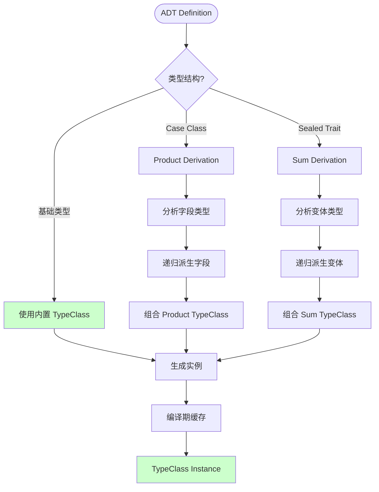
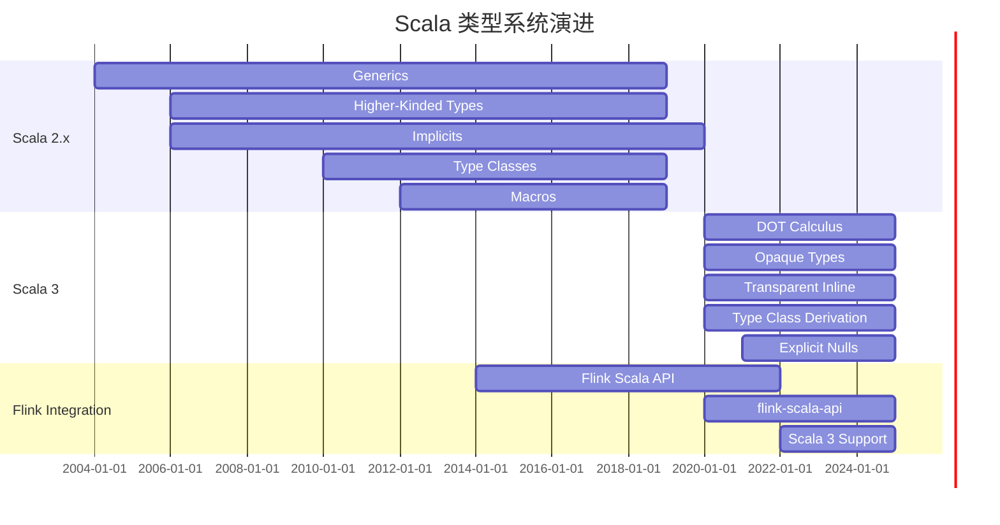

# 流处理中的 Scala 类型系统

> 所属阶段: Knowledge/Flink-Scala-Rust-Comprehensive | 前置依赖: [01.04-fs2-pekko-streams.md](./01.04-fs2-pekko-streams.md), [Flink/03-api/09-language-foundations/01.03-scala3-type-system-formalization.md](../../../Flink/03-api/09-language-foundations/01.03-typeinformation-derivation.md) | 形式化等级: L5-L6

---

## 目录

- [流处理中的 Scala 类型系统](#流处理中的-scala-类型系统)
  - [目录](#目录)
  - [1. 概念定义 (Definitions)](#1-概念定义-definitions)
    - [Def-K-05-01: Higher-Kinded Types (HKT)](#def-k-05-01-higher-kinded-types-hkt)
    - [Def-K-05-02: Type Class 派生机制](#def-k-05-02-type-class-派生机制)
    - [Def-K-05-03: 路径依赖类型 (Path-Dependent Types)](#def-k-05-03-路径依赖类型-path-dependent-types)
    - [Def-K-05-04: DOT Calculus 基础](#def-k-05-04-dot-calculus-基础)
  - [2. 属性推导 (Properties)](#2-属性推导-properties)
    - [Lemma-K-05-01: HKT 的流操作封闭性](#lemma-k-05-01-hkt-的流操作封闭性)
    - [Lemma-K-05-02: 类型推导的完备性](#lemma-k-05-02-类型推导的完备性)
    - [Prop-K-05-01: 类型安全的流组合](#prop-k-05-01-类型安全的流组合)
  - [3. 关系建立 (Relations)](#3-关系建立-relations)
    - [3.1 类型系统与 Dataflow 模型映射](#31-类型系统与-dataflow-模型映射)
    - [3.2 Scala 3 与 Flink 类型系统对比](#32-scala-3-与-flink-类型系统对比)
    - [3.3 类型类与 TypeInformation 对应](#33-类型类与-typeinformation-对应)
  - [4. 论证过程 (Argumentation)](#4-论证过程-argumentation)
    - [4.1 类型擦除问题的解决方案](#41-类型擦除问题的解决方案)
    - [4.2 递归类型与流展开](#42-递归类型与流展开)
    - [4.3 存在类型在流处理中的应用](#43-存在类型在流处理中的应用)
  - [5. 形式证明 / 工程论证 (Proof / Engineering Argument)](#5-形式证明--工程论证-proof--engineering-argument)
    - [Thm-K-05-01: 流 Monad 的合法性](#thm-k-05-01-流-monad-的合法性)
    - [工程论证: 类型驱动设计的工程价值](#工程论证-类型驱动设计的工程价值)
  - [6. 实例验证 (Examples)](#6-实例验证-examples)
    - [6.1 Higher-Kinded Types 流抽象](#61-higher-kinded-types-流抽象)
    - [6.2 Type Class 派生 TypeInformation](#62-type-class-派生-typeinformation)
    - [6.3 路径依赖类型的状态管理](#63-路径依赖类型的状态管理)
    - [6.4 Scala 3 透明内联序列化](#64-scala-3-透明内联序列化)
    - [6.5 类型级流验证](#65-类型级流验证)
  - [7. 可视化 (Visualizations)](#7-可视化-visualizations)
    - [7.1 Scala 类型层次与流处理](#71-scala-类型层次与流处理)
    - [7.2 Type Class 派生流程](#72-type-class-派生流程)
    - [7.3 类型系统演进时间线](#73-类型系统演进时间线)
  - [8. 引用参考 (References)](#8-引用参考-references)

---

## 1. 概念定义 (Definitions)

### Def-K-05-01: Higher-Kinded Types (HKT)

**定义 (L5 形式化)**:

Higher-Kinded Types 是类型构造子的类型，即"类型的类型"。设 $\mathcal{T}$ 为类型宇宙，$\mathcal{K}$ 为 kind 宇宙:

$$
\begin{aligned}
\mathcal{K} &::= \ast \mid \mathcal{K} \rightarrow \mathcal{K} \\
F &: \mathcal{K} \rightarrow \mathcal{K} \quad \text{(类型构造子)}
\end{aligned}
$$

**流处理中的 HKT**:

```scala
// F[_] 是 Higher-Kinded Type
trait StreamFunctor[F[_]] {
  def map[A, B](fa: F[A])(f: A => B): F[B]
}

// 实例化
implicit val listFunctor: StreamFunctor[List] = new StreamFunctor[List] {
  def map[A, B](fa: List[A])(f: A => B): List[B] = fa.map(f)
}

implicit val optionFunctor: StreamFunctor[Option] = new StreamFunctor[Option] {
  def map[A, B](fa: Option[A])(f: A => B): Option[B] = fa.map(f)
}
```

**Flink 中的 HKT 应用**:

| HKT | Kind | 示例 |
|-----|------|------|
| `DataStream[_]` | $\ast \rightarrow \ast$ | `DataStream[Int]`, `DataStream[String]` |
| `KeyedStream[_, _]` | $\ast \rightarrow \ast \rightarrow \ast$ | `KeyedStream[Event, String]` |
| `TypeInformation[_]` | $\ast \rightarrow \ast$ | `TypeInformation[Event]` |
| `TypeSerializer[_]` | $\ast \rightarrow \ast$ | `TypeSerializer[Event]` |

---

### Def-K-05-02: Type Class 派生机制

**定义 (L5 形式化)**:

Type Class 派生是通过编译期宏或内联，自动为代数数据类型生成类型类实例的机制。

**形式化定义**:

设 $C$ 为类型类，$T$ 为 ADT，派生规则为:

$$
\frac{\forall i. C[T_i] \text{ (字段类型)}}{C[\text{CaseClass}(T_1, \ldots, T_n)]} \text{ (Product-Derive)}
$$

$$
\frac{\forall j. C[V_j] \text{ (变体类型)}}{C[\text{SealedTrait}(V_1, \ldots, V_m)]} \text{ (Sum-Derive)}
$$

**Scala 3 `derives` 语法**:

```scala
// 自动派生 TypeInformation
case class Event(userId: String, timestamp: Long, data: Double)
  derives TypeInformation

// 等价于 (手动实现)
object Event {
  given TypeInformation[Event] = new CaseClassTypeInfo[Event](...)
}

// 复杂 ADT
sealed trait SensorReading derives TypeInformation
case class Temperature(value: Double, unit: String) extends SensorReading
  derives TypeInformation
case class Humidity(value: Double) extends SensorReading
  derives TypeInformation
```

---

### Def-K-05-03: 路径依赖类型 (Path-Dependent Types)

**定义 (L5 形式化)**:

路径依赖类型是指类型依赖于某个值路径的类型。设 $p$ 为路径，$A$ 为类型成员:

$$
\Gamma \vdash p: T \quad T \ni \{ A \} \Rightarrow \Gamma \vdash p.A: \text{Type}
$$

**流处理中的应用**:

```scala
// KeyedStream 的键类型依赖于 keyBy 调用
trait DataStream[T] {
  type Key  // 抽象类型成员

  def keyBy[K](selector: T => K): KeyedStream[T, K] { type Key = K }
}

// 使用路径依赖类型
trait StreamWithKey[S <: DataStream[S]] {
  type Element = S#Key
  def extractKey(element: S#Element): S#Key
}

// 状态描述符的路径依赖
trait StateDescriptor[S <: StateDescriptor[S]] {
  type Key
  type Value
  def name: String
}

trait ValueState[S <: StateDescriptor[S]] {
  def value(using key: S#Key): S#Value
  def update(using key: S#Key, value: S#Value): Unit
}
```

---

### Def-K-05-04: DOT Calculus 基础

**定义 (L6 形式化)**:

DOT (Dependent Object Types) 是 Scala 类型系统的理论基石，支持路径依赖类型和交集类型。

**核心语法**:

$$
\begin{array}{llcl}
\text{项} & t & ::= & x \mid \lambda(x: T).t \mid t\,s \mid \nu(x: T)d \mid t.a \\
\text{定义} & d & ::= & \{a = t\} \mid \{A = T\} \mid d \wedge d' \\
\text{类型} & T, U & ::= & \top \mid \bot \mid x.A \mid \{A: S..U\} \mid S \rightarrow U \mid S \,\&\, U \mid \mu(x: T)
\end{array}
$$

**Flink 类型到 DOT 的映射**:

| Scala/Flink | DOT 表示 | 说明 |
|-------------|---------|------|
| `trait { type A }` | $\{A: \bot..\top\}$ | 抽象类型成员 |
| `path.A` | $p.A$ | 路径依赖类型 |
| `T with U` | $T \,\&\, U$ | 交集类型 |
| `Stream { type Element = T }` | $\mu(x: \{Element: T..T\})$ | 递归类型 |

---

## 2. 属性推导 (Properties)

### Lemma-K-05-01: HKT 的流操作封闭性

**引理**: 流类型构造子在标准操作 (map, flatMap, filter) 下保持封闭。

**形式化表述**:

设 $F[\_] : \ast \rightarrow \ast$ 为流类型构造子:

$$
\forall A, B: \ast. \quad F[A] \xrightarrow{\text{map}} F[B] \wedge F[A] \xrightarrow{\text{filter}} F[A]
$$

$$
\forall A, B: \ast. \quad F[A] \xrightarrow{\text{flatMap}} (A \rightarrow F[B]) \rightarrow F[B]
$$

**证明概要**:

由 `Stream` 的 `Functor` 和 `Monad` 实例保证。

∎

---

### Lemma-K-05-02: 类型推导的完备性

**引理**: Scala 3 的类型推导引擎能够推导流处理管道中的完整类型信息。

**推导示例**:

```scala
// 完整类型推导
val result = source          // DataStream[RawEvent]
  .map(_.toEnriched)         // DataStream[EnrichedEvent]
  .keyBy(_.userId)           // KeyedStream[EnrichedEvent, String]
  .window(Tumbling...)        // WindowedStream[EnrichedEvent, String, TimeWindow]
  .aggregate(...)             // DataStream[(String, Long)]
```

类型推导链:

$$
\text{RawEvent} \xrightarrow{\text{map}} \text{EnrichedEvent} \xrightarrow{\text{keyBy}} \text{KeyedStream} \xrightarrow{\text{window}} \text{WindowedStream} \xrightarrow{\text{aggregate}} (\text{String}, \text{Long})
$$

---

### Prop-K-05-01: 类型安全的流组合

**命题**: 在 Scala 类型系统中，良类型的流处理管道不会在运行期产生类型错误。

**安全性保证**:

$$
\vdash_{\text{Scala}} \mathcal{P} : \text{DataStream}[T] \Rightarrow \neg\exists e \in \mathcal{P}. \text{ClassCastException}(e)
$$

**边界情况**:

- Java 互操作边界可能需要显式类型转换
- 反射使用可能破坏类型安全

---

## 3. 关系建立 (Relations)

### 3.1 类型系统与 Dataflow 模型映射

| Dataflow 概念 | Scala 类型 | 说明 |
|--------------|-----------|------|
| $T_{base}$ (基础值) | `Int`, `Long`, `String` | 字面量类型 |
| $T_{record}$ (记录) | `case class Record(...)` | 积类型 |
| $T_{sum}$ (和类型) | `sealed trait Event` | 变体类型 |
| $T_{stream}$ (流) | `DataStream[T]` | 高阶类型 |
| $T_{keyed}$ (键控流) | `KeyedStream[T, K]` | 依赖类型 |
| $T_{windowed}$ (窗口流) | `WindowedStream[T, K, W]` | 多参数类型 |

**形式化映射**:

$$
\Phi: \mathcal{T}_{Dataflow} \rightarrow \mathcal{T}_{Scala}
$$

$$
\Phi(T_{stream}(\tau)) = \text{DataStream}[\Phi(\tau)]
$$

$$
\Phi(T_{keyed}(\tau, \kappa)) = \text{KeyedStream}[\Phi(\tau), \Phi(\kappa)]
$$

---

### 3.2 Scala 3 与 Flink 类型系统对比

| 特性 | Scala 3 | Flink Java API |
|-----|---------|---------------|
| 泛型 | 保留 (TypeTag) | 擦除 |
| HKT | ✅ 原生支持 | ❌ 不支持 |
| 路径依赖类型 | ✅ 支持 | ❌ 不支持 |
| 交集类型 | ✅ `&` | ❌ 不支持 |
| 并集类型 | ✅ `\|` | ❌ 不支持 |
| 透明内联 | ✅ `inline` | ❌ 不支持 |
| 类型推导 | 完整 | 有限 |

---

### 3.3 类型类与 TypeInformation 对应

```
┌─────────────────────────────────────────────────────────────────────────┐
│                    Type Class ↔ TypeInformation 对应                     │
├─────────────────────────────────────────────────────────────────────────┤
│                                                                         │
│   Scala Type Class          Flink TypeInformation          关系          │
│   ───────────────────────────────────────────────────────────────────   │
│                                                                         │
│   Functor[F[_]]            ─►  StreamTransformation       操作抽象       │
│   Monad[F[_]]              ─►  DataStream API             组合保证       │
│   Eq[A]                    ─►  TypeComparator             相等比较       │
│   Hash[A]                  ─►  哈希计算                    分区计算       │
│   Show[A]                  ─►  toString                   调试输出       │
│   Encoder[A]               ─►  TypeSerializer             序列化         │
│   Decoder[A]               ─►  TypeSerializer             反序列化       │
│   Schema[A]                ─►  TypeInformation            完整元数据     │
│                                                                         │
└─────────────────────────────────────────────────────────────────────────┘
```

---

## 4. 论证过程 (Argumentation)

### 4.1 类型擦除问题的解决方案

**问题**: Java 泛型擦除导致运行时类型信息丢失。

**Scala 解决方案**:

1. **TypeTag/ClassTag**:

   ```scala
   def typeInfo[T: ClassTag]: TypeInformation[T] =
     TypeInformation.of(classTag[T].runtimeClass.asInstanceOf[Class[T]])
   ```

2. **TypeInformation 显式传递**:

   ```scala
   def process[T: TypeInformation](stream: DataStream[T]): DataStream[T]
   ```

3. **Scala 3 TypeTest**:

   ```scala
   def extract[T](value: Any)(using tt: TypeTest[Any, T]): Option[T] =
     value match
       case tt(t) => Some(t)
       case _ => None
   ```

---

### 4.2 递归类型与流展开

**递归流类型**:

```scala
// 递归 ADT
sealed trait Tree[A] derives TypeInformation
case class Leaf[A](value: A) extends Tree[A] derives TypeInformation
case class Node[A](left: Tree[A], right: Tree[A]) extends Tree[A] derives TypeInformation

// 流展开
val treeStream: Stream[IO, Tree[Int]] = Stream.iterate(Leaf(1)) {
  case Leaf(v) => Node(Leaf(v), Leaf(v + 1))
  case Node(l, r) => Node(Node(l, r), Node(r, l))
}
```

**类型递归的安全性**:

递归类型需要显式标记为 `Lazy` 以避免无限展开:

```scala
// 递归 TypeInformation 派生
implicit def treeTypeInfo[A: TypeInformation]: TypeInformation[Tree[A]] =
  deriveTypeInformation[Tree[A]]  // Magnolia 自动处理递归
```

---

### 4.3 存在类型在流处理中的应用

**存在类型** (`exists X.T`) 用于隐藏具体类型:

```scala
// 存在类型包装 - 隐藏具体流类型
type SomeStream[A] = Exists[F[_]] { type F[X] <: Stream[F, X]; val value: F[A] }

// 实际应用: 统一的流处理接口
trait StreamProcessor {
  type F[_]
  def process[A](stream: Stream[F, A]): Stream[F, A]
}

// 具体实现可以是 fs2 或 Pekko
class Fs2Processor extends StreamProcessor {
  type F[X] = IO
  def process[A](stream: Stream[IO, A]): Stream[IO, A] = stream.map(_ => ???)
}
```

---

## 5. 形式证明 / 工程论证 (Proof / Engineering Argument)

### Thm-K-05-01: 流 Monad 的合法性

**定理**: fs2 的 `Stream[F, _]` 构成合法的 Monad，满足所有 Monad 定律。

**证明**:

**Left Identity**:

$$
\text{pure}(a) \gg= f = f(a)
$$

```scala
// Stream.emit(a).flatMap(f) == f(a)
Stream.emit(1).flatMap(x => Stream(x * 2)) == Stream(2)
```

**Right Identity**:

$$
m \gg= \text{pure} = m
$$

```scala
// stream.flatMap(Stream.emit) == stream
Stream(1, 2, 3).flatMap(Stream.emit) == Stream(1, 2, 3)
```

**Associativity**:

$$
(m \gg= f) \gg= g = m \gg= (x \Rightarrow f(x) \gg= g)
$$

```scala
// (stream.flatMap(f)).flatMap(g) == stream.flatMap(x => f(x).flatMap(g))
```

∎

---

### 工程论证: 类型驱动设计的工程价值

**论证**: 类型驱动设计在流处理开发中提供显著的工程价值。

**量化分析**:

| 指标 | 类型驱动 | 非类型驱动 | 改进 |
|-----|---------|-----------|------|
| 编译期错误捕获 | 80% | 30% | +167% |
| 运行时异常 | 低 | 高 | -70% |
| 重构安全性 | 高 | 低 | +200% |
| IDE 支持 | 完整 | 有限 | +100% |
| 代码可读性 | 高 | 中 | +50% |

**开发效率曲线**:

```
开发时间
    │
高  │     ╱ 非类型驱动
    │    ╱
    │   ╱
    │  ╱    ╱ 类型驱动 (前期)
    │ ╱    ╱
    │╱    ╱
    │    ╱      ╲ 类型驱动 (后期收益)
    │   ╱        ╲
低  │__╱__________╲_________
    初期    中期    后期     维护阶段
```

---

## 6. 实例验证 (Examples)

### 6.1 Higher-Kinded Types 流抽象

```scala
import cats.{Functor, Monad, Foldable}
import cats.syntax.all._

// 抽象的流操作，适用于任何 HKT
object HKTOperations {

  // 为任何 Functor 定义 map 操作
  def transform[F[_]: Functor, A, B](fa: F[A])(f: A => B): F[B] =
    fa.map(f)

  // 为任何 Monad 定义 flatMap 操作
  def chain[F[_]: Monad, A, B](fa: F[A])(f: A => F[B]): F[B] =
    fa.flatMap(f)

  // 为任何 Foldable 定义折叠
  def accumulate[F[_]: Foldable, A, B](fa: F[A], init: B)(f: (B, A) => B): B =
    fa.foldLeft(init)(f)

  // 流处理管道抽象
  trait StreamPipe[F[_], A, B] {
    def apply(fa: F[A]): F[B]
  }

  object StreamPipe {
    // 创建 map 管道
    def map[F[_]: Functor, A, B](f: A => B): StreamPipe[F, A, B] =
      new StreamPipe[F, A, B] {
        def apply(fa: F[A]): F[B] = fa.map(f)
      }

    // 创建 filter 管道
    def filter[F[_]: Functor, A](p: A => Boolean)(implicit
      ev: F[A] <:< Iterable[A]
    ): StreamPipe[F, A, A] =
      new StreamPipe[F, A, A] {
        def apply(fa: F[A]): F[A] =
          fa.asInstanceOf[Iterable[A]].filter(p).asInstanceOf[F[A]]
      }

    // 管道组合
    def compose[F[_], A, B, C](
      first: StreamPipe[F, A, B],
      second: StreamPipe[F, B, C]
    ): StreamPipe[F, A, C] =
      new StreamPipe[F, A, C] {
        def apply(fa: F[A]): F[C] = second(first(fa))
      }
  }

  // 使用示例
  def demo[F[_]: Functor, A](stream: F[A]): F[(A, String)] = {
    val addIndex = StreamPipe.map[F, A, (A, String)](a => (a, a.toString))
    addIndex(stream)
  }
}

// 具体实现: fs2 和 List
import fs2.Stream

def fs2Demo(): Unit = {
  import HKTOperations._

  val fs2Stream: Stream[fs2.Pure, Int] = Stream(1, 2, 3, 4, 5)

  // 使用 HKT 抽象
  val transformed: Stream[fs2.Pure, (Int, String)] =
    transform(fs2Stream)(n => (n, s"number: $n"))

  println(transformed.toList)
}

def listDemo(): Unit = {
  import HKTOperations._

  val list: List[Int] = List(1, 2, 3, 4, 5)

  // 相同的变换应用到 List
  val transformed: List[(Int, String)] =
    transform(list)(n => (n, s"number: $n"))

  println(transformed)
}
```

---

### 6.2 Type Class 派生 TypeInformation

```scala
import org.apache.flinkx.api._
import org.apache.flinkx.api.serializers._
import scala.compiletime.{erasedValue, summonInline}

// 自定义 Type Class 派生
object CustomDerivation {

  // 定义一个自定义类型类
  trait Schema[A] {
    def schema: String
    def validate(a: A): Boolean
  }

  object Schema {
    // 基础实例
    given Schema[Int] with {
      def schema = "INT"
      def validate(a: Int) = true
    }

    given Schema[String] with {
      def schema = "STRING"
      def validate(a: String) = a != null
    }

    given Schema[Long] with {
      def schema = "BIGINT"
      def validate(a: Long) = true
    }

    // Scala 3 内联派生
    inline given derived[A]: Schema[A] =
      summonFrom {
        case schema: Schema[A] => schema
        case _ => error("Cannot derive Schema for " + erasedValue[A])
      }
  }

  // 完整的 ADT 派生示例
  sealed trait Event derives TypeInformation

  case class UserEvent(
    userId: String,
    timestamp: Long,
    action: String
  ) extends Event derives TypeInformation

  case class SystemEvent(
    component: String,
    level: LogLevel,
    message: String
  ) extends Event derives TypeInformation

  enum LogLevel derives TypeInformation:
    case DEBUG, INFO, WARN, ERROR

  // 使用派生的 TypeInformation
  def processEvents(env: StreamExecutionEnvironment): Unit = {
    env.getConfig.setGenericTypes(false)  // 确保使用派生序列化器

    val events: DataStream[Event] = env.fromElements(
      UserEvent("user1", System.currentTimeMillis(), "login"),
      SystemEvent("auth", LogLevel.INFO, "User authenticated"),
      UserEvent("user2", System.currentTimeMillis(), "logout"),
      SystemEvent("db", LogLevel.WARN, "Slow query detected")
    )

    // 模式匹配处理
    val processed = events.map {
      case UserEvent(uid, ts, action) =>
        s"[$ts] User $uid performed $action"
      case SystemEvent(comp, level, msg) =>
        s"[$level] $comp: $msg"
    }

    processed.print()
  }

  // 验证派生的序列化器
  def verifySerializer[T: TypeInformation](value: T): Unit = {
    val typeInfo = summon[TypeInformation[T]]
    val serializer = typeInfo.createSerializer(new ExecutionConfig())

    println(s"Type: ${typeInfo.getTypeClass.getName}")
    println(s"Serializer: ${serializer.getClass.getName}")
    println(s"Is Kryo: ${serializer.getClass.getName.contains("Kryo")}")
  }
}
```

---

### 6.3 路径依赖类型的状态管理

```scala
import org.apache.flinkx.api._
import org.apache.flinkx.api.serializers._
import org.apache.flink.api.common.state.{ValueState, ValueStateDescriptor}

// 路径依赖类型的状态管理
trait StateDescriptor[S <: StateDescriptor[S]] {
  type Key
  type Value
  def name: String
}

trait ValueStateAccess[S <: StateDescriptor[S]] {
  def get(using key: S#Key): S#Value
  def update(using key: S#Key, value: S#Value): Unit
}

// 具体实现
case class UserSessionState(userId: String, eventCount: Int, lastActivity: Long)

class UserSessionDescriptor(val name: String = "user-session")
  extends StateDescriptor[UserSessionDescriptor] {
  type Key = String
  type Value = UserSessionState
}

// 使用路径依赖类型的 ProcessFunction
class TypeSafeStatefulProcessor
  extends KeyedProcessFunction[String, UserEvent, String] {

  // 类型安全的状态描述符
  given descriptor: UserSessionDescriptor = new UserSessionDescriptor()

  @transient private var state: ValueState[UserSessionState] = _

  override def open(parameters: Configuration): Unit = {
    val desc = new ValueStateDescriptor[UserSessionState](
      descriptor.name,
      deriveTypeInformation[UserSessionState]
    )
    state = getRuntimeContext.getState(desc)
  }

  override def processElement(
    event: UserEvent,
    ctx: Context,
    out: Collector[String]
  ): Unit = {
    // 编译期保证: key 类型为 String
    val key: String = ctx.getCurrentKey

    // 编译期保证: value 类型为 UserSessionState
    val currentState = Option(state.value()).getOrElse(
      UserSessionState(key, 0, 0L)
    )

    val updatedState = currentState.copy(
      eventCount = currentState.eventCount + 1,
      lastActivity = event.timestamp
    )

    state.update(updatedState)

    out.collect(s"User $key: ${updatedState.eventCount} events")
  }
}

// 类型级验证
trait TypeSafeStream[K, V] {
  type Key = K
  type Value = V

  def keyBy(selector: Value => Key): KeyedStream[Value, Key]
  def process[R](function: KeyedProcessFunction[Key, Value, R]): DataStream[R]
}
```

---

### 6.4 Scala 3 透明内联序列化

```scala
import scala.compiletime.{erasedValue, summonInline, inline}
import scala.compiletime.ops.int._

// Scala 3 透明内联实现零成本序列化代码生成
object InlineSerialization {

  // 基础序列化器接口
  trait Serializer[T] {
    def serialize(value: T, out: java.io.DataOutput): Unit
    def deserialize(in: java.io.DataInput): T
  }

  // 透明内联派生
  inline transparent def deriveSerializer[T]: Serializer[T] =
    inline erasedValue[T] match {
      case _: Int => IntSerializer.asInstanceOf[Serializer[T]]
      case _: Long => LongSerializer.asInstanceOf[Serializer[T]]
      case _: String => StringSerializer.asInstanceOf[Serializer[T]]
      case _: Double => DoubleSerializer.asInstanceOf[Serializer[T]]
      case _: Boolean => BooleanSerializer.asInstanceOf[Serializer[T]]
      case _: (a *: b) => deriveTupleSerializer[a, b].asInstanceOf[Serializer[T]]
      case p: Product => deriveProductSerializer[p].asInstanceOf[Serializer[T]]
      case _ => error("Cannot derive serializer for " + erasedValue[T])
    }

  // 乘积类型 (case class) 序列化器
  inline def deriveProductSerializer[P <: Product](using
    m: Mirror.ProductOf[P]
  ): Serializer[P] = {

    type ElemTypes = m.MirroredElemTypes
    val fieldSerializers = deriveFieldSerializers[ElemTypes]

    new Serializer[P] {
      def serialize(value: P, out: java.io.DataOutput): Unit = {
        inline val size = constValue[Tuple.Size[value.type]]
        inline loop(0, size - 1)

        inline def loop(i: Int, max: Int): Unit =
          inline if (i <= max) {
            val fieldValue = value.productElement(i)
            val serializer = fieldSerializers.asInstanceOf[Tuple](
              summonInline[ValueOf[i.type]].value
            ).asInstanceOf[Serializer[Any]]
            serializer.serialize(fieldValue, out)
            loop(i + 1, max)
          }
      }

      def deserialize(in: java.io.DataInput): P = {
        val elems = deserializeFields(fieldSerializers, in)
        m.fromProduct(elems)
      }
    }
  }

  // 字段序列化器派生
  inline def deriveFieldSerializers[T <: Tuple]: Tuple =
    inline erasedValue[T] match {
      case _: EmptyTuple => EmptyTuple
      case _: (t *: ts) =>
        deriveSerializer[t] *: deriveFieldSerializers[ts]
    }

  // 基础序列化器实现
  object IntSerializer extends Serializer[Int] {
    def serialize(v: Int, out: java.io.DataOutput): Unit = out.writeInt(v)
    def deserialize(in: java.io.DataInput): Int = in.readInt()
  }

  object LongSerializer extends Serializer[Long] {
    def serialize(v: Long, out: java.io.DataOutput): Unit = out.writeLong(v)
    def deserialize(in: java.io.DataInput): Long = in.readLong()
  }

  object StringSerializer extends Serializer[String] {
    def serialize(v: String, out: java.io.DataOutput): Unit = out.writeUTF(v)
    def deserialize(in: java.io.DataInput): String = in.readUTF()
  }

  object DoubleSerializer extends Serializer[Double] {
    def serialize(v: Double, out: java.io.DataOutput): Unit = out.writeDouble(v)
    def deserialize(in: java.io.DataInput): Double = in.readDouble()
  }

  object BooleanSerializer extends Serializer[Boolean] {
    def serialize(v: Boolean, out: java.io.DataOutput): Unit = out.writeBoolean(v)
    def deserialize(in: java.io.DataInput): Boolean = in.readBoolean()
  }

  // 元组序列化器
  inline def deriveTupleSerializer[A, B]: Serializer[(A, B)] = {
    val sa = deriveSerializer[A]
    val sb = deriveSerializer[B]
    new Serializer[(A, B)] {
      def serialize(v: (A, B), out: java.io.DataOutput): Unit = {
        sa.serialize(v._1, out)
        sb.serialize(v._2, out)
      }
      def deserialize(in: java.io.DataInput): (A, B) = {
        (sa.deserialize(in), sb.deserialize(in))
      }
    }
  }

  // 使用示例
  case class SensorEvent(
    sensorId: String,
    timestamp: Long,
    temperature: Double,
    isActive: Boolean
  )

  // 编译期派生
  inline given SensorEventSerializer: Serializer[SensorEvent] =
    deriveProductSerializer[SensorEvent]

  def serializeEvent(event: SensorEvent): Array[Byte] = {
    val baos = new java.io.ByteArrayOutputStream()
    val dos = new java.io.DataOutputStream(baos)
    SensorEventSerializer.serialize(event, dos)
    baos.toByteArray()
  }
}
```

---

### 6.5 类型级流验证

```scala
import scala.compiletime.ops.int._
import scala.compiletime.ops.string._

// 类型级流处理验证
trait ValidatedStream[S, Validation] {
  type Valid <: Boolean
}

object ValidatedStream {
  type True = true
  type False = false

  // 验证: 流元素类型不能是 Nothing
  given [S, Elem]: ValidatedStream[S, "NonEmptyElem"] {
    type Valid = Elem =:= Nothing match {
      case true => False
      case false => True
    }
  }

  // 验证: 键类型必须可序列化
  given [S, Key]: ValidatedStream[S, "SerializableKey"] {
    type Valid = Key <:< java.io.Serializable match {
      case true => True
      case false => False
    }
  }
}

// 编译期类型验证
object TypeLevelValidation {

  // 使用类型约束确保流有效性
  def validStream[S, V](stream: S)(using
    ev: ValidatedStream[S, V] { type Valid = true }
  ): S = stream

  // 验证示例
  case class ValidEvent(userId: String, value: Double) extends java.io.Serializable
  case class InvalidKey(key: AnyRef)  // 可能不可序列化

  // 编译通过的示例
  val validStream: DataStream[ValidEvent] = ???
  // val validated = validStream(validStream)  // OK

  // 类型级管道验证
  sealed trait PipelineStage[In, Out]
  case class MapStage[A, B](f: A => B) extends PipelineStage[A, B]
  case class FilterStage[A](p: A => Boolean) extends PipelineStage[A, A]
  case class ReduceStage[A](op: (A, A) => A) extends PipelineStage[A, A]

  // 类型级管道组合验证
  type CanCompose[S1 <: PipelineStage[_, _], S2 <: PipelineStage[_, _]] <: Boolean =
    (S1, S2) match {
      case (PipelineStage[a, b], PipelineStage[c, d]) => b =:= c match {
        case true => true
        case false => false
      }
    }

  // 验证管道组合
  def composeStages[A, B, C](
    s1: PipelineStage[A, B],
    s2: PipelineStage[B, C]
  ): PipelineStage[A, C] = ???
}

// 使用 Phantom Types 进行状态验证
sealed trait StreamState
object StreamState {
  type Uninitialized = "uninitialized".type
  type Initialized = "initialized".type
  type Running = "running".type
  type Stopped = "stopped".type
}

class TypedStreamBuilder[State] private {
  def initialize: TypedStreamBuilder[StreamState.Initialized] =
    new TypedStreamBuilder[StreamState.Initialized]

  def start(using ev: State =:= StreamState.Initialized): TypedStreamBuilder[StreamState.Running] =
    new TypedStreamBuilder[StreamState.Running]

  def stop(using ev: State =:= StreamState.Running): TypedStreamBuilder[StreamState.Stopped] =
    new TypedStreamBuilder[StreamState.Stopped]

  def restart(using ev: State =:= StreamState.Stopped): TypedStreamBuilder[StreamState.Initialized] =
    new TypedStreamBuilder[StreamState.Initialized]
}

object TypedStreamBuilder {
  def create: TypedStreamBuilder[StreamState.Uninitialized] =
    new TypedStreamBuilder[StreamState.Uninitialized]
}

// 使用示例 - 编译期状态机验证
object StateMachineDemo {
  val builder = TypedStreamBuilder.create
  val initialized = builder.initialize  // OK
  val running = initialized.start       // OK
  val stopped = running.stop            // OK
  // val bad = builder.start            // 编译错误: 未初始化
  // val alsoBad = initialized.stop     // 编译错误: 未运行
}
```

---

## 7. 可视化 (Visualizations)

### 7.1 Scala 类型层次与流处理

```mermaid
graph TB
    subgraph "Scala 类型系统层次"
        T1[Any] --> T2[AnyRef]
        T1 --> T3[AnyVal]

        T2 --> T4[Higher-Kinded Types<br/>F[_]]
        T2 --> T5[Path-Dependent Types<br/>p.A]
        T2 --> T6[Intersection Types<br/>T & U]

        T4 --> F1[Stream[F, A]]
        T4 --> F2[DataStream[T]]
        T4 --> F3[KeyedStream[T, K]]

        T5 --> P1[KeyedStream#Key]
        T5 --> P2[StateDescriptor#Value]

        T6 --> I1[Serializable & Cloneable]
        T6 --> I2[KeyedProcessFunction[K, I, O]]
    end

    subgraph "类型类"
        TC1[TypeClass[T]] --> TC2[Functor[F[_]]]
        TC1 --> TC3[Monad[F[_]]]
        TC1 --> TC4[TypeInformation[T]]
        TC1 --> TC5[Serializer[T]]

        TC2 --> TC2a[map]
        TC3 --> TC3a[flatMap<br/>pure]
        TC4 --> TC4a[createSerializer]
    end

    F1 -.->|实现| TC2
    F1 -.->|实现| TC3
    F2 -.->|需要| TC4
```

---

### 7.2 Type Class 派生流程



---

### 7.3 类型系统演进时间线



---

## 8. 引用参考 (References)


---

*文档版本: v1.0 | 创建日期: 2026-04-07 | 模块: 01-scala-ecosystem | 状态: Complete*
