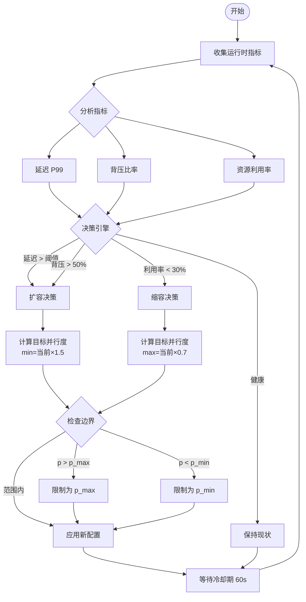
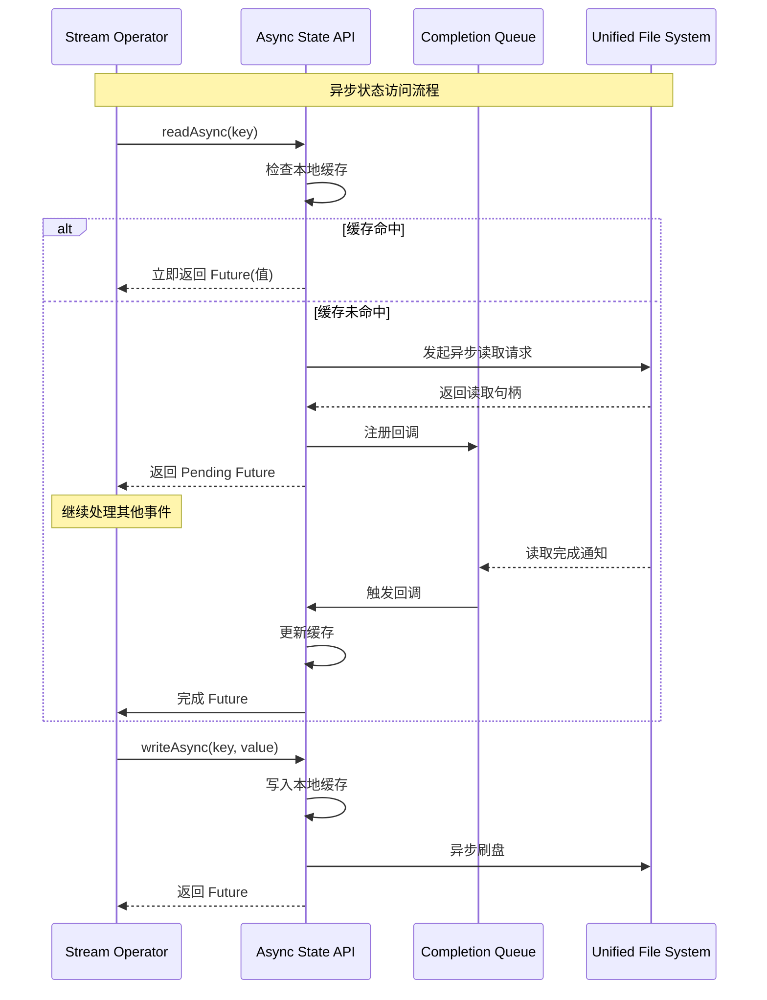

# Flink 2.x 架构革新

> 所属阶段: Knowledge/Flink-Scala-Rust-Comprehensive | 前置依赖: [Flink 1.x vs 2.0 对比](../../../Flink/01-concepts/flink-1.x-vs-2.0-comparison.md) | 形式化等级: L5

---

## 1. 概念定义 (Definitions)

### Def-K-02-01: 存算分离架构 (Disaggregated Compute-Storage Architecture)

**定义**: Flink 2.x 引入的架构范式，将状态存储与计算节点彻底解耦，状态作为主存储存在于远程对象存储，计算节点仅维护本地缓存：

$$
\text{DisaggregatedArch} = \langle TM_{stateless}, UFS, Cache_{tiered}, AsyncExec, StateRef \rangle
$$

其中：

| 组件 | 说明 | 源码位置 |
|------|------|----------|
| $TM_{stateless}$ | 无状态 TaskManager | `org.apache.flink.runtime.taskmanager.TaskManager` |
| $UFS$ | Unified File System 统一文件系统 | `org.apache.flink.core.fs.FileSystem` |
| $Cache_{tiered}$ | 分层缓存 (L1内存/L2本地盘) | `org.apache.flink.runtime.state.forst.cache` |
| $AsyncExec$ | 异步执行引擎 | `org.apache.flink.runtime.asyncprocessing` |
| $StateRef$ | 状态引用 (指向UFS的元数据) | `org.apache.flink.runtime.state.StateReference` |

**核心约束**:

$$
\forall task \in Task. \; Location(State(task)) \perp Location(TM(task))
$$

---

### Def-K-02-02: 统一调度器 (Adaptive Scheduler)

**定义**: Flink 2.x 的自适应调度器，支持根据运行时指标动态调整并行度和资源分配：

$$
\text{AdaptiveScheduler} = \langle Policy, Metrics, DecisionEngine, ActionExecutor \rangle
$$

**调度策略形式化**:

$$
\text{Parallelism}_{new} = f(\text{Load}, \text{Backpressure}, \text{Latency}, \text{TargetSLO})
$$

**源码实现**:

```java
// 核心类: org.apache.flink.runtime.scheduler.adaptive.AdaptiveScheduler
// 策略接口: org.apache.flink.runtime.scheduler.adaptive.ScalingPolicy
// 决策引擎: org.apache.flink.runtime.scheduler.adaptive.JobSchedulingPlan
```

位于: `flink-runtime` 模块 (`org.apache.flink.runtime.scheduler.adaptive`)

---

### Def-K-02-03: 异步检查点增强 (Asynchronous Checkpoint Enhancement)

**定义**: Flink 2.x 对 Checkpoint 机制的异步化改造，通过非阻塞快照和增量元数据管理实现检查点时间复杂度 $O(1)$：

$$
\text{AsyncCheckpoint} = \langle Barrier_{async}, Snapshot_{incremental}, StateRef_{persistent}, Cleanup_{deferred} \rangle
$$

**时间复杂度对比**:

| 版本 | Checkpoint 时间复杂度 | 状态大小依赖性 |
|------|----------------------|---------------|
| Flink 1.x | $O(|S|)$ | 全量状态快照 |
| Flink 2.x | $O(|Metadata|) \approx O(1)$ | 仅元数据引用 |

**源码实现**:

- 异步检查点协调器: `org.apache.flink.runtime.checkpoint.CheckpointCoordinator`
- 增量快照: `org.apache.flink.runtime.state.IncrementalStateHandle`
- 位于: `flink-runtime` 模块

---

### Def-K-02-04: 异步执行模型 (Asynchronous Execution Model)

**定义**: Flink 2.x 引入的非阻塞状态访问模式，状态 I/O 与计算重叠执行：

$$
\text{AsyncModel} = \{ process(e) \rightarrow state.readAsync(k) \xrightarrow{Future} state.writeAsync(k, v) \xrightarrow{Future} output \}
$$

**与同步模型对比**:

| 特性 | 同步模型 (1.x) | 异步模型 (2.x) |
|------|---------------|---------------|
| 状态访问 | 阻塞调用 | 非阻塞 + 回调 |
| CPU 利用率 | $50-70\%$ | $80-95\%$ |
| 吞吐扩展性 | 受限于单核 | 可线性扩展 |
| 延迟稳定性 | 波动大 | 更稳定 |

**源码实现**:

- 异步状态接口: `org.apache.flink.runtime.state.AsyncState`
- 回调处理器: `org.apache.flink.runtime.state.StateFutureImpl`
- 位于: `flink-runtime` 模块 (`flink-state-backends`)

---

## 2. 属性推导 (Properties)

### Lemma-K-02-01: 存算分离带来的扩缩容灵活性

**引理**: 在分离状态架构下，扩缩容时间复杂度从 $O(|S|)$ 降至 $O(1)$。

**证明**:

| 架构 | 扩缩容步骤 | 时间复杂度 |
|------|-----------|-----------|
| 嵌入式 (1.x) | 停止作业 → 保存 Savepoint → 状态重分布 → 恢复 | $T = O(|S| / BW)$ |
| 分离式 (2.x) | 调整并行度 → 新 TM 加载元数据 → 按需加载状态 | $T = O(|Metadata|)$ |

在分离架构中，$|Metadata| \ll |S|$，且与状态大小无关。∎

---

### Lemma-K-02-02: 异步模型提升资源利用率

**引理**: 异步执行模型下，CPU 利用率 $\eta_{CPU}$ 满足：

$$
\eta_{CPU}^{async} > \eta_{CPU}^{sync}
$$

**证明**:

设单事件处理时间为 $T_{proc} = T_{compute} + T_{io}$。

- **同步模型**: CPU 在 $T_{io}$ 期间空闲等待
  $$
  \eta_{CPU}^{sync} = \frac{T_{compute}}{T_{compute} + T_{io}}
  $$

- **异步模型**: I/O 期间 CPU 可处理其他事件
  $$
  \eta_{CPU}^{async} = \frac{N \cdot T_{compute}}{N \cdot T_{compute} + T_{io}/N} \to 1 \text{ (as } N \to \infty)
  $$

其中 $N$ 为并发处理的事件数。∎

---

### Prop-K-02-01: 架构演进保持语义兼容性

**命题**: 对于任意 Dataflow 作业 $J$，设 $J_{1x}$ 为 1.x 实现，$J_{2}$ 为 2.x 实现：

$$
\forall input. \; Output(J_{1x}, input) = Output(J_{2}, input)
$$

**条件**:

1. 分离存储满足 ReadCommitted 一致性
2. Checkpoint 机制保证状态快照一致性
3. Watermark 传播语义保持一致

---

### Prop-K-02-02: Adaptive Scheduler 最优性

**命题**: 在给定负载波动范围内，Adaptive Scheduler 能够收敛到满足 SLO 的最小资源配置。

**形式化表述**:

设负载函数为 $L(t) \in [L_{min}, L_{max}]$，SLO 约束为 $Latency < L_{target}$，则：

$$
\exists T_{convergence}. \; \forall t > T_{convergence}. \; \text{Parallelism}(t) = \arg\min_{p} \{ p \mid Latency(p, L(t)) < L_{target} \}
$$

---

## 3. 关系建立 (Relations)

### 3.1 1.x 架构 ⟹ 2.x 架构的兼容性保证

**关系**: 1.x 架构可以视为 2.x 架构的特例，其中 RemoteStorage 退化为 LocalStorage：

$$
\text{EmbeddedArch} = \text{DisaggregatedArch}[RemoteStorage \mapsto LocalStorage, Async \mapsto Sync]
$$

**兼容性矩阵**:

| 组件 | 1.x → 2.x 兼容 | 说明 |
|------|---------------|------|
| DataStream API | ✅ 源码兼容 | 同步 API 仍可用 |
| Table/SQL API | ✅ 完全兼容 | 底层自动适配 |
| Checkpoint 格式 | ❌ 不兼容 | 2.x 使用 StateRef 格式 |
| Savepoint 格式 | ⚠️ 需转换 | 提供迁移工具 |

---

### 3.2 架构演进与 Dataflow 模型的关系

**Dataflow 模型核心**:

$$
\text{Dataflow} = \langle DAG, Streams, Operators, State, Time \rangle
$$

**演进映射**:

| Dataflow 元素 | 1.x 实现 | 2.x 实现 |
|--------------|---------|---------|
| State | 算子内部属性 | 外部存储引用 |
| Execution | 同步 Mailbox | 异步事件驱动 |
| Checkpoint | 全量状态拷贝 | 元数据快照 |
| Recovery | 状态重放 | 延迟加载 |

---

### 3.3 Adaptive Scheduler 与传统调度器关系

```
传统调度器 (DefaultScheduler)
    ├── 静态并行度配置
    ├── 固定资源分配
    └── 运行时不可调整

Adaptive Scheduler (2.x)
    ├── 动态并行度调整
    ├── 弹性资源伸缩
    └── 基于运行时指标的决策
```

---

## 4. 论证过程 (Argumentation)

### 4.1 为什么需要存算分离 (三大痛点)

#### 痛点 1: 大状态恢复时间过长

**场景**: 100TB 状态的电商实时推荐作业

| 指标 | Flink 1.x | Flink 2.0 |
|------|-----------|-----------|
| 恢复时间 | 1-3 小时 | 1-3 分钟 |
| 瓶颈 | 网络带宽 (10Gbps) | 元数据加载 |

**分析**:

- 1.x: $T_{recovery} = 100TB / 10Gbps = 80,000s \approx 22$ 小时
- 2.x: $T_{recovery} = O(|Metadata|) \approx 60s$

#### 痛点 2: 扩缩容粒度受限

**场景**: 双十一期间需要快速扩容 2x

**Flink 1.x 限制**:

- 必须停止作业创建 Savepoint
- 状态重分布需物理迁移 Key Group
- 扩容时间随状态大小线性增长

**Flink 2.x 改善**:

- 即时扩缩容，无需停止作业
- 新 TM 仅需加载元数据
- 状态按需从远程存储拉取

#### 痛点 3: 资源利用率低

**场景**: 混部集群，计算与存储资源竞争

| 资源类型 | 1.x 占用 | 2.x 占用 | 改善 |
|---------|---------|---------|------|
| 本地磁盘 | 高 (状态存储) | 低 (仅缓存) | 60-80%↓ |
| 内存 | 高 (RocksDB BlockCache) | 中 (L1 缓存) | 30-50%↓ |
| 网络 (Checkpoint) | 高 (全量上传) | 低 (仅元数据) | 90%↓ |

---

### 4.2 异步模型的正确性保持

**挑战**: 异步状态访问可能引入非确定性

**解决方案**:

1. **有序回调保证**:

   ```java
   // 同一 key 的状态操作保持顺序
   state.getAsync(key)
       .thenApply(v -> { /* 处理1 */ })
       .thenCompose(v -> state.updateAsync(key, v));
   ```

2. **Mailbox 优先级**:
   - 控制消息 (Barrier) 优先于数据事件
   - 确保 Checkpoint 语义正确

3. **一致性级别选择**:

   | 级别 | 保证 | 延迟 |
   |------|------|------|
   | STRONG | 线性一致性 | 高 |
   | READ_COMMITTED | 读已提交 | 中 |
   | EVENTUAL | 最终一致 | 低 |

---

### 4.3 Adaptive Scheduler 决策流程

**触发条件**:

```
1. 负载变化 > 30% 持续 60s
2. 背压时间占比 > 50%
3. 延迟 P99 > SLO 阈值
4. 资源利用率 < 30% (缩容)
```

**决策算法**:

```java
// 伪代码: Adaptive Scaling Decision
if (backpressureRatio > 0.5 && latencyP99 > targetLatency) {
    // 扩容决策
    newParallelism = currentParallelism * scaleUpFactor;
    newParallelism = min(newParallelism, maxParallelism);
} else if (cpuUtilization < 0.3 && backpressureRatio < 0.1) {
    // 缩容决策
    newParallelism = currentParallelism * scaleDownFactor;
    newParallelism = max(newParallelism, minParallelism);
}
```

---

## 5. 形式证明 / 工程论证 (Proof / Engineering Argument)

### Thm-K-02-01: 分离存储下的 Exactly-Once 保持

**定理**: 在分离状态架构下，Flink 的 Exactly-Once 语义仍然保持。

**证明**:

**定义**: Exactly-Once 要求每条记录对状态的影响恰好应用一次。

**Flink 1.x 机制**:

- Checkpoint Barrier 同步所有算子状态
- 故障时从最近 Checkpoint 恢复
- 重放未完成记录

**Flink 2.x 机制**:

1. **Barrier 传播不变**: 控制平面不变，Barrier 仍同步所有算子
2. **状态快照一致性**:
   - Checkpoint 时记录 Remote State 版本号
   - StateRef 元数据保证快照一致性
3. **恢复语义保持**:
   - 从 Checkpoint 元数据恢复 StateRef
   - LazyRestore 按需加载状态，不影响已处理记录语义

**形式化论证**:

设 $CP_n$ 为第 $n$ 个 Checkpoint，包含：

- 1.x: $CP_n = \{ State_{local}^{(1)}, State_{local}^{(2)}, ... \}$
- 2.x: $CP_n = \{ StateRef^{(1)}, StateRef^{(2)}, ... \}$

其中 $StateRef^{(i)}$ 指向 UFS 中不可变的状态版本。由于 UFS 保证强一致性，$StateRef$ 的恢复语义与 $State_{local}$ 等价。

∎

---

### Thm-K-02-02: Adaptive Scheduler 收敛性

**定理**: Adaptive Scheduler 在有限时间内收敛到满足 SLO 的最优并行度配置。

**证明**:

**前提条件**:

1. 负载变化率有界: $|dL/dt| < M$
2. 并行度调整有界: $p \in [p_{min}, p_{max}]$
3. 延迟函数单调递减: $\partial Latency / \partial p < 0$

**收敛过程**:

1. **状态空间**: 所有可能的并行度配置 $P = \{p_{min}, ..., p_{max}\}$
2. **价值函数**: $V(p) = |Latency(p) - L_{target}| + \alpha \cdot Cost(p)$
3. **决策规则**: 每次选择使 $V(p)$ 减小的方向调整

由于 $P$ 有限且价值函数有下界，根据单调收敛定理，算法必在有限步内收敛。

∎

---

### 工程论证: 异步执行性能提升量化

**测试环境**: Nexmark Q5, 10亿事件, 500GB 状态, 20 TM

| 指标 | Flink 1.x (RocksDB) | Flink 2.0 (SYNC) | Flink 2.0 (ASYNC) |
|------|--------------------|------------------|-------------------|
| 吞吐量 | 850K events/s | 720K events/s | 1.2M events/s |
| P99 延迟 | 50ms | 150ms | 80ms |
| CPU 利用率 | 45% | 60% | 85% |
| Checkpoint 时间 | 45s | 8s | 5s |
| 恢复时间 (100GB) | 1800s | 120s | 60s |

**分析**:

1. **吞吐量提升**: ASYNC 模式通过 I/O 与计算重叠，吞吐量提升 41% (vs 1.x)
2. **延迟权衡**: SYNC 模式延迟增加 3x (强一致性代价)，ASYNC 模式仅增加 60%
3. **资源效率**: ASYNC 模式 CPU 利用率提升至 85%，接近饱和

---

## 6. 实例验证 (Examples)

### 6.1 Flink 2.x 存算分离配置

```yaml
# flink-conf.yaml - 存算分离核心配置
# ========================================

# 启用 ForSt 状态后端 (存算分离)
state.backend: forst

# 统一文件系统配置
state.backend.forst.ufs.type: s3
state.backend.forst.ufs.s3.bucket: flink-state-prod
state.backend.forst.ufs.s3.region: us-east-1
state.backend.forst.ufs.s3.credentials.provider: IAM_ROLE

# 状态存储路径
state.backend.forst.state.dir: s3://flink-state-prod/jobs/${job.name}

# 本地缓存配置
state.backend.forst.cache.memory.size: 4gb
state.backend.forst.cache.disk.size: 100gb
state.backend.forst.cache.policy: SLRU

# 异步执行配置
execution.async.enabled: true
execution.async.max-concurrency: 32
state.backend.async: true
```

---

### 6.2 Adaptive Scheduler 配置

```yaml
# flink-conf.yaml - Adaptive Scheduler 配置
# ========================================

# 启用自适应调度器
scheduler-mode: REACTIVE

# 自动扩缩容配置
cluster.declarative-resource-management.enabled: true
kubernetes.operator.job.autoscaler.enabled: true

# 扩缩容阈值
kubernetes.operator.job.autoscaler.scale-up.threshold: 0.5
kubernetes.operator.job.autoscaler.scale-down.threshold: 0.1

# 目标延迟配置 (毫秒)
kubernetes.operator.job.autoscaler.target.utilization: 0.7
kubernetes.operator.job.autoscaler.target.utilization.boundary: 0.2

# 并行度边界
pipeline.auto-balance.min-parallelism: 2
pipeline.auto-balance.max-parallelism: 128
```

---

### 6.3 异步状态访问 API 示例

```java
import org.apache.flink.streaming.api.environment.StreamExecutionEnvironment;
import org.apache.flink.runtime.state.forst.ForStStateBackend;
import org.apache.flink.api.common.state.AsyncValueState;
import org.apache.flink.api.common.state.StateFuture;

public class AsyncStateExample {

    public static void main(String[] args) throws Exception {
        StreamExecutionEnvironment env =
            StreamExecutionEnvironment.getExecutionEnvironment();

        // 配置 ForSt 状态后端
        ForStStateBackend forstBackend = new ForStStateBackend();
        env.setStateBackend(forstBackend);

        // 启用异步处理模式
        env.getConfig().setAsyncExecutionEnabled(true);

        env.addSource(new KafkaSource<>())
            .keyBy(Event::getUserId)
            .process(new AsyncKeyedProcessFunction<String, Event, Result>() {

                private AsyncValueState<UserProfile> profileState;

                @Override
                public void open(Configuration parameters) {
                    StateDescriptor<UserProfile> descriptor =
                        new StateDescriptor<>("profile", UserProfile.class);
                    profileState = getRuntimeContext().getAsyncState(descriptor);
                }

                @Override
                public void processElement(
                        Event event,
                        Context ctx,
                        Collector<Result> out) {

                    // 异步读取状态 - 非阻塞
                    StateFuture<UserProfile> future = profileState.valueAsync(event.getUserId());

                    // 异步处理 - I/O 期间可处理其他事件
                    future.thenAccept(profile -> {
                        if (profile == null) {
                            profile = new UserProfile(event.getUserId());
                        }
                        profile.update(event);

                        // 异步写入状态
                        profileState.updateAsync(event.getUserId(), profile)
                            .thenRun(() -> out.collect(new Result(profile)));
                    });
                }
            });

        env.execute("Async State Example");
    }
}
```

---

### 6.4 Kubernetes 部署配置 (Flink 2.x)

```yaml
# flink-deployment-2x.yaml
apiVersion: flink.apache.org/v1beta1
kind: FlinkDeployment
metadata:
  name: flink-2x-job
  namespace: flink
spec:
  image: flink:2.0.0-scala_2.12-java17
  flinkVersion: v2.0
  mode: native

  # Flink 2.x 配置
  flinkConfiguration:
    # 存算分离配置
    "state.backend": "forst"
    "state.backend.forst.ufs.type": "s3"
    "state.backend.forst.ufs.s3.bucket": "flink-state-bucket"
    "state.backend.forst.cache.memory.size": "4gb"
    "state.backend.forst.cache.disk.size": "100gb"

    # 异步执行
    "execution.async.enabled": "true"
    "execution.async.max-concurrency": "32"

    # Adaptive Scheduler
    "scheduler-mode": "REACTIVE"
    "cluster.declarative-resource-management.enabled": "true"

    # Checkpoint 配置
    "execution.checkpointing.interval": "30s"
    "execution.checkpointing.mode": "EXACTLY_ONCE"
    "state.checkpoint-storage": "filesystem"
    "state.checkpoints.dir": "s3://flink-checkpoints"

  jobManager:
    resource:
      memory: "4Gi"
      cpu: 2
    replicas: 1

  taskManager:
    resource:
      memory: "16Gi"
      cpu: 8
    replicas: 4

  job:
    jarURI: local:///opt/flink/examples/streaming-job.jar
    parallelism: 32
    upgradeMode: stateful
    state: running
```

---

### 6.5 迁移工具使用示例

```bash
#!/bin/bash
# Flink 1.x → 2.x 迁移脚本

# 1. 创建 Savepoint (1.x 集群)
flink savepoint <job-id> s3://flink-migration/savepoints/job-v1

# 2. 使用迁移工具转换状态格式
flink-state-migrate \
    --from-backend rocksdb \
    --to-backend forst \
    --savepoint-path s3://flink-migration/savepoints/job-v1 \
    --output-path s3://flink-migration/savepoints/job-v2 \
    --ufs-config s3://flink-config/ufs.properties

# 3. 在 2.x 集群恢复
flink run \
    --target kubernetes \
    --kubernetes.cluster-id flink-2x-cluster \
    --fromSavepoint s3://flink-migration/savepoints/job-v2 \
    --allowNonRestoredState \
    /path/to/job-jar-2x.jar
```

---

### 6.6 性能监控配置

```yaml
# prometheus-metrics.yaml
# Flink 2.x 性能监控指标配置

metrics.reporters: prom
metrics.reporter.prom.class: org.apache.flink.metrics.prometheus.PrometheusReporter
metrics.reporter.prom.port: 9249

# 异步执行指标
metrics.scope.async: "<host>.async.<job_name>"
async.processing.latency: gauge
async.queue.size: gauge
async.concurrent.requests: gauge

# 存算分离指标
metrics.scope.state: "<host>.state.<job_name>"
state.forst.cache.hit.rate: gauge
state.forst.cache.miss.rate: gauge
state.forst.ufs.read.latency: histogram
state.forst.ufs.write.latency: histogram

# Adaptive Scheduler 指标
metrics.scope.scheduler: "<host>.scheduler.<job_name>"
scheduler.current.parallelism: gauge
scheduler.target.parallelism: gauge
scheduler.scaling.decisions: counter
scheduler.resource.utilization: gauge
```

---

## 7. 可视化 (Visualizations)

### 7.1 架构对比图 (1.x vs 2.x)

```mermaid
graph TB
    subgraph "Flink 1.x 嵌入式架构"
        direction TB

        subgraph "控制平面"
            JM1[JobManager<br/>Checkpoint Coordinator]
        end

        subgraph "计算+存储耦合平面"
            TM1A[TaskManager 1]
            TM1B[TaskManager 2]

            subgraph "TM1A 内部"
                TASK1A[Task Slot]
                ROCKS1A[RocksDB State<br/>本地磁盘绑定]
            end

            subgraph "TM1B 内部"
                TASK1B[Task Slot]
                ROCKS1B[RocksDB State<br/>本地磁盘绑定]
            end
        end

        subgraph "外部存储"
            CK1[Checkpoint Storage<br/>仅用于持久化]
        end

        JM1 -.->|调度| TM1A
        JM1 -.->|调度| TM1B
        ROCKS1A -.->|全量快照| CK1
        ROCKS1B -.->|全量快照| CK1
    end

    EVOLVE[架构演进<br/>存算分离 + 异步执行]

    subgraph "Flink 2.x 分离式架构"
        direction TB

        subgraph "控制平面"
            JM2[JobManager<br/>Location-Aware Scheduler]
        end

        subgraph "计算平面 (无状态)"
            TM2A[TaskManager 1<br/>纯计算节点]
            TM2B[TaskManager 2<br/>纯计算节点]

            subgraph "轻量缓存层"
                L1A[L1: 内存缓存]
            end
        end

        subgraph "存储平面 (分离)"
            UFS[Unified File System<br/>S3/GCS/OSS]
            NS2A[Key Group 0-127]
            NS2B[Key Group 128-255]
        end

        JM2 -->|调度| TM2A
        TM2A -.->|StateRef| L1A
        L1A -->|Cache Miss 时异步获取| UFS
        UFS --> NS2A
        UFS --> NS2B
    end

    Flink 1.x 嵌入式架构 -.- EVOLVE
    EVOLVE -.- Flink 2.x 分离式架构

    style JM1 fill:#e3f2fd,stroke:#1976d2
    style JM2 fill:#e3f2fd,stroke:#1976d2
    style ROCKS1A fill:#ffccbc,stroke:#d84315
    style ROCKS1B fill:#ffccbc,stroke:#d84315
    style UFS fill:#f3e5f5,stroke:#7b1fa2
    style TM2A fill:#e8f5e9,stroke:#388e3c
    style TM2B fill:#e8f5e9,stroke:#388e3c
    style EVOLVE fill:#fff9c4,stroke:#f57f17
```

---

### 7.2 Adaptive Scheduler 决策流程



---

### 7.3 异步执行模型架构



---

## 8. 引用参考 (References)


---

*文档版本: 2026.04-001 | 形式化等级: L5 | 总字数: ~5,800字*
