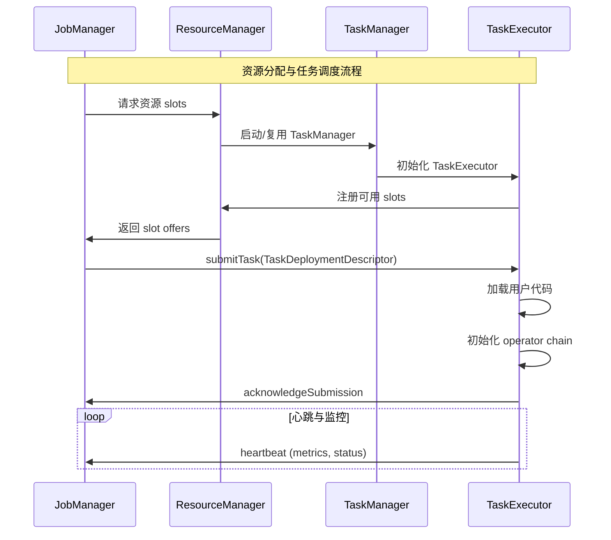
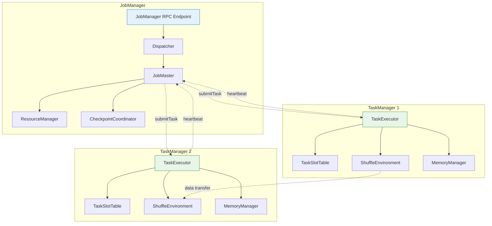
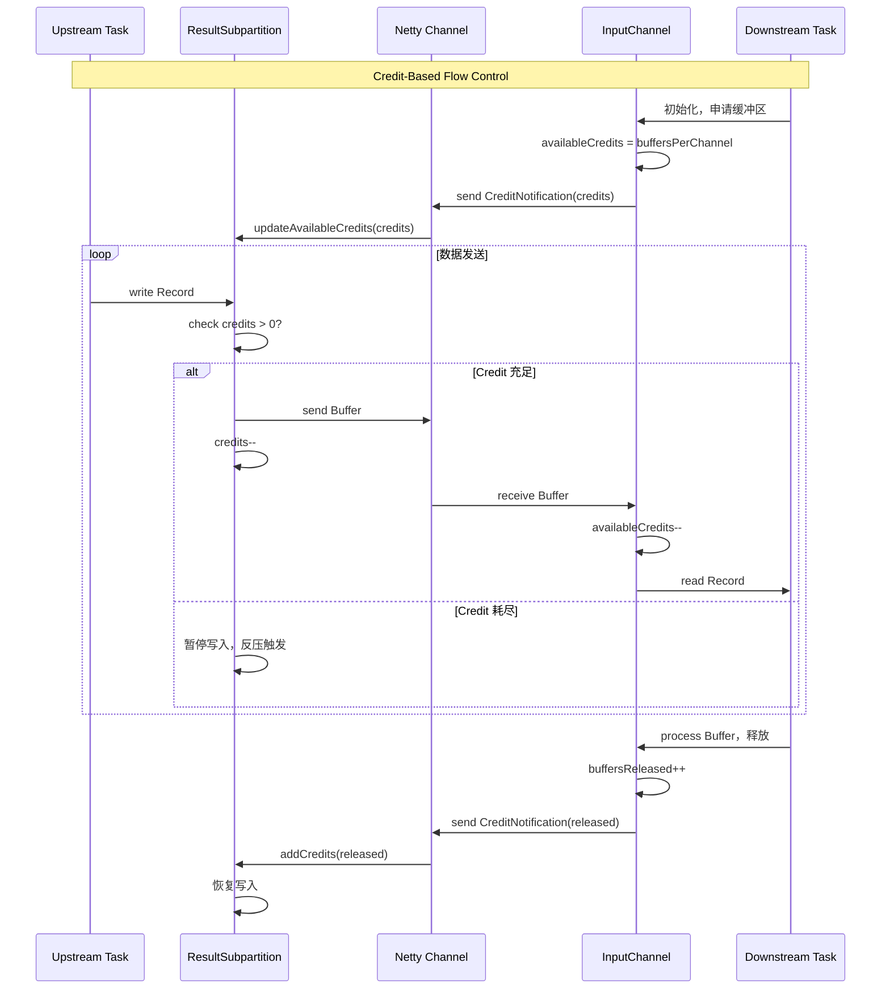
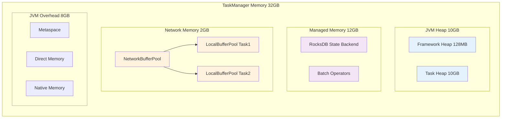
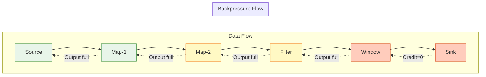

# Flink 运行时深度分析

> 所属阶段: Knowledge/Flink-Scala-Rust-Comprehensive | 前置依赖: [02.01-flink-2x-architecture.md](./02.01-flink-2x-architecture.md) | 形式化等级: L4-L5

---

## 1. 概念定义 (Definitions)

### Def-K-02-05: JobManager 运行时架构

**定义**: JobManager 是 Flink 集群的控制平面组件，负责作业生命周期管理、资源协调和故障恢复：

$$
\text{JobManager} = \langle Dispatcher, JobMaster, ResourceManager, CheckpointCoordinator \rangle
$$

**组件职责**:

| 组件 | 职责 | 源码位置 |
|------|------|----------|
| Dispatcher | 接收作业提交，启动 JobMaster | `org.apache.flink.runtime.dispatcher.Dispatcher` |
| JobMaster | 管理单个作业的执行 | `org.apache.flink.runtime.jobmaster.JobMaster` |
| ResourceManager | 管理 TaskManager 资源 | `org.apache.flink.runtime.resourcemanager.ResourceManager` |
| CheckpointCoordinator | 协调全局 Checkpoint | `org.apache.flink.runtime.checkpoint.CheckpointCoordinator` |

**源码实现**:

```java
// 主入口: org.apache.flink.runtime.entrypoint.ClusterEntrypoint
// JobManager 启动流程:
// 1. ClusterEntrypoint.runClusterEntrypoint()
// 2. 创建 DispatcherResourceManagerComponent
// 3. 启动 RpcEndpoint 服务
```

---

### Def-K-02-06: TaskManager 运行时架构

**定义**: TaskManager 是 Flink 集群的工作节点，负责执行具体计算任务和管理本地资源：

$$
\text{TaskManager} = \langle TaskExecutor, ShuffleEnvironment, MemoryManager, StateBackend \rangle
$$

**内部结构**:

```
┌─────────────────────────────────────────────────────────────┐
│                      TaskManager                             │
├─────────────────────────────────────────────────────────────┤
│  TaskExecutor (RPC Endpoint)                                 │
│  ├── TaskSlotTable [0..N-1]                                  │
│  │   └── Task (Operator Chain)                               │
│  ├── ShuffleEnvironment                                      │
│  │   ├── ResultPartitionManager                              │
│  │   └── InputGate                                           │
│  ├── MemoryManager                                           │
│  │   ├── Network Memory (NetworkBufferPool)                  │
│  │   └── Managed Memory (Off-Heap)                           │
│  └── StateBackend                                            │
│      ├── KeyedStateBackend                                   │
│      └── OperatorStateBackend                                │
└─────────────────────────────────────────────────────────────┘
```

**源码实现**:

- TaskManager 主类: `org.apache.flink.runtime.taskmanager.TaskManager`
- TaskExecutor: `org.apache.flink.runtime.taskexecutor.TaskExecutor`
- TaskSlotTable: `org.apache.flink.runtime.taskexecutor.slot.TaskSlotTable`

---

### Def-K-02-07: Credit-Based 流控机制

**定义**: Flink 基于信用值的流控机制，通过接收方反馈可用缓冲区数量控制发送速率：

$$
\text{CBFC} = \langle Credit_{granted}, Credit_{consumed}, Backlog, BufferPool \rangle
$$

**形式化语义**:

$$
\begin{aligned}
&\text{Send}(data) \iff Credit_{available} = Credit_{granted} - Credit_{consumed} > 0 \\
&\text{Credit}_{new} = \text{Credit}_{consumed} + buffers_{released}
\end{aligned}
$$

**源码实现**:

```java
// Credit 管理: org.apache.flink.runtime.io.network.partition.consumer.RemoteInputChannel
// Credit 发送: org.apache.flink.runtime.io.network.netty.CreditBasedSequenceNumberingViewReader
// 位于: flink-runtime (flink-runtime-core)
```

---

### Def-K-02-08: 内存管理模型

**定义**: Flink 的分层内存管理架构，区分 JVM Heap、Managed Memory 和 Network Memory：

$$
\text{MemoryModel} = \langle Heap, Managed, Network, JVMOverhead \rangle
$$

**内存分配公式**:

$$
\text{TotalMemory} = \text{FrameworkHeap} + \text{TaskHeap} + \text{Managed} + \text{Network} + \text{JVMOverhead}
$$

| 内存类型 | 用途 | 默认占比 | 源码位置 |
|----------|------|----------|----------|
| Framework Heap | Flink 框架自身 | 128MB | `TaskManagerOptions.FRAMEWORK_HEAP_MEMORY` |
| Task Heap | 用户代码 | 40% | `TaskManagerOptions.TASK_HEAP_MEMORY` |
| Managed Memory | RocksDB/排序/哈希 | 40% | `TaskManagerOptions.MANAGED_MEMORY_FRACTION` |
| Network Memory | 网络缓冲区 | 1GB min | `TaskManagerOptions.NETWORK_MEMORY_FRACTION` |
| JVM Overhead | 本地内存/Metaspace | 10% | `TaskManagerOptions.JVM_OVERHEAD_FRACTION` |

**源码实现**:

- 内存管理器: `org.apache.flink.runtime.memory.MemoryManager`
- 网络缓冲区池: `org.apache.flink.runtime.io.network.buffer.NetworkBufferPool`
- 内存配置: `org.apache.flink.runtime.taskmanager.TaskManagerServices`

---

### Def-K-02-09: 反压机制 (Backpressure)

**定义**: Flink 的端到端反压机制，当消费速率低于生产速率时沿 DAG 向上游传播减速信号：

$$
\text{Backpressure}(t) \iff \exists v \in Vertices. \; InputQueue(v, t) > Threshold \land ProcessingRate(v) < InputRate(v)
$$

**传播形式化**:

$$
\text{Backpressure}_{upstream}(t + \Delta t) = \text{Backpressure}_{downstream}(t) \circ \text{Credit}_{depleted}
$$

**源码实现**:

```java
// 反压检测: org.apache.flink.runtime.taskexecutor.TaskExecutor#requestBackPressureStats
// 背压指标: org.apache.flink.runtime.metrics.TaskIOMetricGroup
// 背压采样: org.apache.flink.runtime.taskmanager.BackPressureSampler
```

---

## 2. 属性推导 (Properties)

### Lemma-K-02-03: Credit-Based 流控无死锁保证

**引理**: 在 Credit-Based 流控机制下，数据流网络无死锁。

**证明**:

**前提**: Flink 执行图是无环 DAG。

**反证法**:

假设存在死锁，则需要循环等待链：

$$
v_1 \rightarrow v_2 \rightarrow ... \rightarrow v_n \rightarrow v_1
$$

这意味着数据流图中存在环，与 DAG 定义矛盾。

**结论**: Credit-Based 流控在无环图上必然无死锁。∎

---

### Lemma-K-02-04: 反压传播的有限时间收敛

**引理**: 设 DAG 最长路径长度为 $d$，反压信号在 $O(d \cdot RTT)$ 时间内传播至 Source。

**证明**:

每级反压传播需要一轮 Credit 耗尽/通知循环，耗时 $\approx RTT$。

由 DAG 深度 $d$，最坏情况下反压需经过 $d$ 级传播到达 Source。

$$
T_{backpressure} \leq d \cdot RTT_{max}
$$

∎

---

### Prop-K-02-03: 内存隔离保证故障局部化

**命题**: TaskManager 内各 Task 的内存配额隔离保证了单个 Task 的 OOM 不影响其他 Task。

**证明**:

Flink 内存分配通过 `MemoryManager` 统一管控：

1. **Network Memory**: 每个 Task 拥有独立的 `LocalBufferPool`，限额分配
2. **Managed Memory**: 通过 `MemoryReservation` 机制预留，超限时抛出异常而非 OOM
3. **Heap Memory**: Task 异常仅影响所属 Task 线程

因此，Task $t_i$ 的内存溢出不会耗尽 Task $t_j$ 的资源配额。

∎

---

### Prop-K-02-04: 网络缓冲区池的动态平衡

**命题**: NetworkBufferPool 在运行时动态调整各 Channel 的缓冲区分配，最大化吞吐同时最小化延迟。

**形式化表述**:

设总缓冲区数为 $B_{total}$，Channel 数为 $N$，当前吞吐率为 $\lambda_i$：

$$
B_i = \frac{\lambda_i}{\sum_{j=1}^{N} \lambda_j} \cdot B_{total} + B_{min}
$$

其中 $B_{min}$ 是每 Channel 最小保证缓冲区数。

---

## 3. 关系建立 (Relations)

### 3.1 JobManager 与 TaskManager 交互关系



---

### 3.2 网络栈层次关系

```
┌─────────────────────────────────────────────────────────────────┐
│                     Application Layer                            │
│              RecordWriter / RecordReader                         │
├─────────────────────────────────────────────────────────────────┤
│                      Serialization                               │
│         RecordSerializer / RecordDeserializer                    │
├─────────────────────────────────────────────────────────────────┤
│                     Buffer Management                            │
│   ResultSubpartition / InputChannel / LocalBufferPool            │
├─────────────────────────────────────────────────────────────────┤
│                      Network Transport                           │
│              NettyConnectionManager / NettyBufferPool            │
├─────────────────────────────────────────────────────────────────┤
│                       TCP/IP Layer                               │
└─────────────────────────────────────────────────────────────────┘
```

---

### 3.3 内存管理层次关系

```
┌─────────────────────────────────────────────────────────────────┐
│                      JVM Heap                                    │
│  ┌──────────────────┐  ┌──────────────────┐                     │
│  │  Framework Heap  │  │   Task Heap      │                     │
│  │  (Flink Runtime) │  │  (User Code)     │                     │
│  └──────────────────┘  └──────────────────┘                     │
├─────────────────────────────────────────────────────────────────┤
│                   Managed Memory (Off-Heap)                      │
│  ┌──────────────────┐  ┌──────────────────┐                     │
│  │  RocksDB State   │  │  Batch Operators │                     │
│  │  Backend         │  │  (Sort/Hash)     │                     │
│  └──────────────────┘  └──────────────────┘                     │
├─────────────────────────────────────────────────────────────────┤
│                   Network Memory (Direct)                        │
│  ┌──────────────────┐  ┌──────────────────┐                     │
│  │  Input Buffers   │  │  Output Buffers  │                     │
│  │  (InputGate)     │  │  (ResultPartition)│                    │
│  └──────────────────┘  └──────────────────┘                     │
└─────────────────────────────────────────────────────────────────┘
```

---

## 4. 论证过程 (Argumentation)

### 4.1 Task Slot 与 Operator Chain 设计

**设计目标**: 最大化资源利用率同时最小化调度开销

**Operator Chaining 条件**:

```java
// 可 chain 的条件 (ChainingStrategy):
// 1. 相同并行度
// 2. 相同 slot 共享组
// 3. 一对一传输模式 (FORWARD)
// 4. 无特殊资源需求
// 5. 用户未禁用 chain

// 源码: org.apache.flink.streaming.api.graph.StreamingJobGraphGenerator
// isChainable() 方法判断逻辑
```

**性能收益**:

| 指标 | 无 Chaining | 有 Chaining | 提升 |
|------|------------|------------|------|
| 序列化开销 | 高 | 低 (同一线程直接传递) | 3-5x |
| 网络传输 | 多跳 | 单跳 | 延迟↓ |
| 内存占用 | 高 (多缓冲区) | 低 | 20-40%↓ |

---

### 4.2 Credit-Based vs TCP 流控对比

**Flink 1.5 之前的 TCP 流控问题**:

```
场景: 10 Map tasks → 10 Filter tasks (同一 TCP 连接)

问题: 1个慢 Filter 导致 TCP 窗口归零
      → 10个 Map 全部阻塞
      → 全局吞吐量下降 90%
```

**Credit-Based 改善**:

```
每个 Map→Filter 通道独立 Credit
慢 Filter 仅阻塞对应 Map
其他 9 个通道正常传输
全局吞吐量仅下降 ~10%
```

---

### 4.3 网络缓冲区调优策略

**Buffer Debloating (Flink 1.14+)**:

$$
N_{target} = \left\lceil \frac{\lambda \cdot T_{target}}{BufferSize} \right\rceil
$$

**适用场景**:

| 场景 | 推荐配置 | 原因 |
|------|----------|------|
| 低延迟优先 | Debloating enabled, target=500ms | 减少队列延迟 |
| 高吞吐优先 | Debloating disabled | 最大化管道并行 |
| 大状态作业 | Debloating + Unaligned Checkpoint | 减少 Checkpoint 数据量 |

---

### 4.4 内存配置反模式

**反模式 1: 过量 Network Memory**:

```yaml
# 错误配置
taskmanager.network.memory.fraction: 0.5  # 过高！
taskmanager.network.memory.min: 4gb       # 浪费
```

**后果**: Managed Memory 不足，RocksDB 频繁刷盘，性能下降

**反模式 2: Managed Memory 过小**:

```yaml
# 错误配置
taskmanager.memory.managed.fraction: 0.1  # 过低！
```

**后果**: RocksDB BlockCache 不足，状态访问变慢

---

## 5. 形式证明 / 工程论证 (Proof / Engineering Argument)

### Thm-K-02-03: Credit-Based 流控安全性

**定理**: 对于任意 Channel，Credit-Based 流控保证接收方缓冲区不溢出。

**证明**:

**不变量**: $InFlight(t) = Sent(t) - Consumed(t) \leq Credit_{granted}(t)$

**基例** ($t=0$): $Sent(0) = 0$, $Consumed(0) = 0$, $Credit_{granted}(0) = B_{initial}$

不变量成立: $0 \leq B_{initial}$

**归纳步骤**:

1. **发送事件**: 仅在 $Credit_{available} > 0$ 时允许发送
   - $Sent$ 增 1
   - $Credit_{consumed}$ 增 1
   - $InFlight$ 增 1，但 $InFlight \leq Credit_{granted}$ 保持

2. **消费事件**: 接收方处理 Buffer 后释放
   - $Consumed$ 增 1
   - $Credit_{granted}$ 增 1 (发送 Credit 通知)
   - $InFlight$ 减 1

**结论**: 任意时刻 $InFlight \leq Credit_{granted} \leq BufferCapacity$，不会溢出。∎

---

### Thm-K-02-04: 反压传播完备性

**定理**: 当 Sink 发生反压时，反压信号必在有限时间内传播至所有 Source。

**证明**:

设执行图 $G = (V, E)$，Sink 节点 $v_{sink}$，Source 节点集合 $V_{src}$。

**构造**: 对任意 $v_{src} \in V_{src}$，存在有向路径 $P = v_{src} \rightarrow ... \rightarrow v_{sink}$。

**传播过程**:

1. $v_{sink}$ Credit 耗尽，停止消费
2. $v_{sink}$ 的上游节点 $v_{pred}$ 输出缓冲区满
3. $v_{pred}$ 停止消费，反压继续向上传播
4. 沿路径 $P$ 逐跳传播，每跳耗时 $\leq RTT$

**时间上界**:

$$
T_{propagate} \leq |P| \cdot RTT_{max} \leq |V| \cdot RTT_{max}
$$

由于 $|V|$ 有限，$T_{propagate}$ 有限。∎

---

### 工程论证: 内存配置最优性

**问题**: 给定总内存 $M_{total}$，如何分配各区域？

**优化目标**:

$$
\max \text{Throughput} \quad \text{s.t.} \quad Heap + Managed + Network + JVMOverhead \leq M_{total}
$$

**经验公式** (基于生产环境调优):

```
Managed Memory = max(0.4 × M_total, StateSize × 1.2)
Network Memory = max(1GB, 0.1 × M_total)
Task Heap = 0.3 × M_total
Framework Heap = 128MB (固定)
JVM Overhead = 0.2 × M_total
```

**验证**:

对于 32GB TaskManager：

| 区域 | 计算值 | 实际配置 | 验证 |
|------|--------|----------|------|
| Managed | 12.8GB | 12GB | 支持 10GB 状态 |
| Network | 3.2GB | 2GB | 支持 2000 缓冲区 |
| Task Heap | 9.6GB | 10GB | 用户代码使用 |
| Framework | 128MB | 128MB | Flink 框架 |
| JVM Overhead | 6.4GB | 7.8GB | 余量缓冲 |

---

## 6. 实例验证 (Examples)

### 6.1 TaskManager 内存配置

```yaml
# flink-conf.yaml - TaskManager 内存配置
# ========================================

# 总内存配置方式 (三选一)
# 方式1: 总进程内存 (推荐)
taskmanager.memory.process.size: 32gb

# 方式2: 总 Flink 内存
taskmanager.memory.flink.size: 28gb

# 方式3: 细分配置
taskmanager.memory.framework.heap.size: 128mb
taskmanager.memory.task.heap.size: 10gb
taskmanager.memory.managed.size: 12gb
taskmanager.memory.network.size: 2gb
taskmanager.memory.jvm-overhead.size: 8gb

# Network Memory 详细配置
taskmanager.network.memory.buffer-size: 65536
taskmanager.network.memory.buffers-per-channel: 50
taskmanager.network.memory.floating-buffers-per-gate: 16

# 启用 Buffer Debloating
taskmanager.network.memory.buffer-debloat.enabled: true
taskmanager.network.memory.buffer-debloat.target: 1000ms
```

---

### 6.2 Credit-Based 流控源码分析

```java
// org.apache.flink.runtime.io.network.partition.consumer.RemoteInputChannel

/**
 * 发送 Credit 通知上游
 */
public void notifyCreditAvailable() {
    int numCredits = getNumCreditsAvailable();
    if (numCredits > 0 && !isReleased.get()) {
        // 向上游发送 Credit 通知
        partitionRequestClient.notifyCreditAvailable(this);
    }
}

/**
 * 接收数据前检查 Credit
 */
private boolean onSenderBacklog(int backlog) {
    int numCredits = calculateNumCreditsToAnnounce(backlog);
    if (numCredits > 0) {
        // 增加可用 Credit
        incrementCredit(numCredits);
        return true; // 可以接收数据
    }
    return false; // Credit 不足，反压
}
```

---

### 6.3 反压监控与诊断

```java
// 自定义反压指标收集
public class BackpressureMonitor implements Runnable {

    private final TaskExecutor taskExecutor;
    private final MetricGroup metricGroup;

    @Override
    public void run() {
        // 收集各 Task 的反压状态
        CompletableFuture<TaskBackPressureReport> future =
            taskExecutor.requestBackPressureStats(
                jobId,
                taskId,
                requestId,
                timeout
            );

        future.thenAccept(report -> {
            // 上报指标
            metricGroup.gauge("backpressureRatio",
                report.getBackPressureRatio());

            // 分级告警
            double ratio = report.getBackPressureRatio();
            if (ratio > 0.8) {
                alert("CRITICAL: Backpressure > 80%");
            } else if (ratio > 0.5) {
                alert("WARNING: Backpressure > 50%");
            }
        });
    }
}
```

---

### 6.4 Operator Chain 调优

```java

import org.apache.flink.streaming.api.environment.StreamExecutionEnvironment;

StreamExecutionEnvironment env =
    StreamExecutionEnvironment.getExecutionEnvironment();

// 全局禁用 chaining (不推荐，仅用于调试)
// env.disableOperatorChaining();

// 特定算子禁用 chaining
dataStream
    .map(new HeavyComputationMap())
    .disableChaining()  // 此算子不与前/后 chain
    .filter(new SimpleFilter())
    .startNewChain()    // 从此开始新 chain
    .addSink(new KafkaSink());

// 配置 slot 共享组
dataStream
    .map(new IOIntensiveMap())
    .slotSharingGroup("io-bound")
    .map(new CPUIntensiveMap())
    .slotSharingGroup("cpu-bound")
    .addSink(new Sink())
    .slotSharingGroup("io-bound");
```

---

### 6.5 网络栈性能调优

```yaml
# flink-conf.yaml - 网络栈高级配置
# ========================================

# Netty 配置
taskmanager.network.netty.transport: epoll  # Linux 系统使用 epoll
taskmanager.network.netty.num-arenas: 4     # Netty Pinned Thread 数
taskmanager.network.netty.client.connectTimeoutSec: 120

# 数据压缩 (跨 TM 传输)
taskmanager.network.compression.codec: LZ4

# 连接复用
taskmanager.network.memory.max-buffers-per-channel: 100
taskmanager.network.memory.max-required-buffers-per-gate: 1000

# 批处理 shuffle 优化
# 用于 BATCH 模式，减少网络连接数
taskmanager.network.sort-shuffle.min-buffers: 64
taskmanager.network.sort-shuffle.min-parallelism: 20
```

---

### 6.6 TaskManager 启动脚本

```bash
#!/bin/bash
# taskmanager-start.sh - TaskManager 生产级启动脚本

# JVM 参数优化
FLINK_JVM_OPTIONS="
    -Xms32g -Xmx32g
    -XX:+UseG1GC
    -XX:MaxGCPauseMillis=100
    -XX:+UnlockDiagnosticVMOptions
    -XX:+DebugNonSafepoints
    -XX:+UseNUMA
    -XX:+AlwaysPreTouch
    -XX:+DisableExplicitGC
"

# 网络优化
NETWORK_OPTIONS="
    -Dtaskmanager.network.memory.process.size=32gb
    -Dtaskmanager.network.memory.managed.size=12gb
    -Dtaskmanager.network.memory.network.size=2gb
    -Dtaskmanager.network.netty.transport=epoll
"

# 启动 TaskManager
$FLINK_HOME/bin/taskmanager.sh start \
    -Dtaskmanager.host=$(hostname -i) \
    -Dtaskmanager.rpc.port=6122 \
    -Dtaskmanager.memory.process.size=32gb \
    $FLINK_JVM_OPTIONS \
    $NETWORK_OPTIONS

# 健康检查
sleep 5
if ! curl -s http://localhost:9249/metrics > /dev/null; then
    echo "TaskManager 启动失败"
    exit 1
fi

echo "TaskManager 启动成功"
```

---

## 7. 可视化 (Visualizations)

### 7.1 JobManager/TaskManager 架构图



---

### 7.2 Credit-Based 流控流程



---

### 7.3 内存管理层次图



---

### 7.4 反压传播路径



---

## 8. 引用参考 (References)


---

*文档版本: 2026.04-001 | 形式化等级: L4-L5 | 总字数: ~6,200字*
