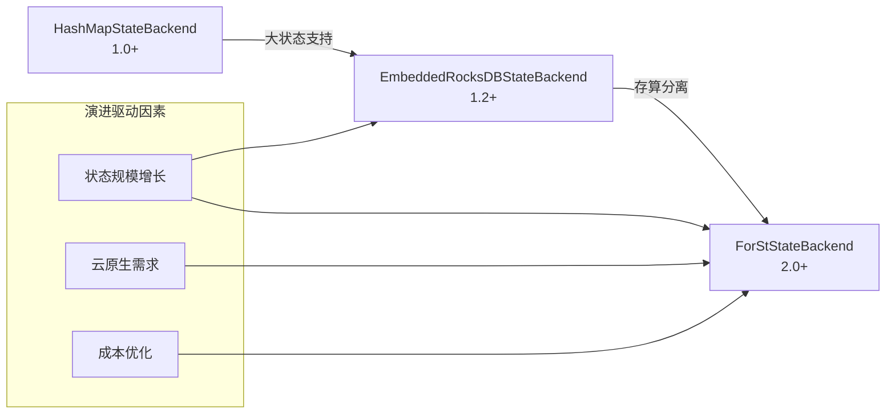
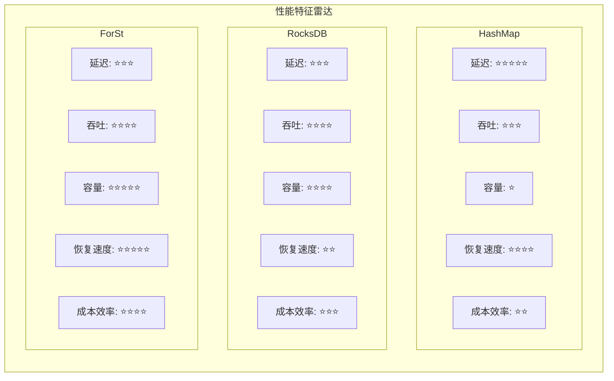
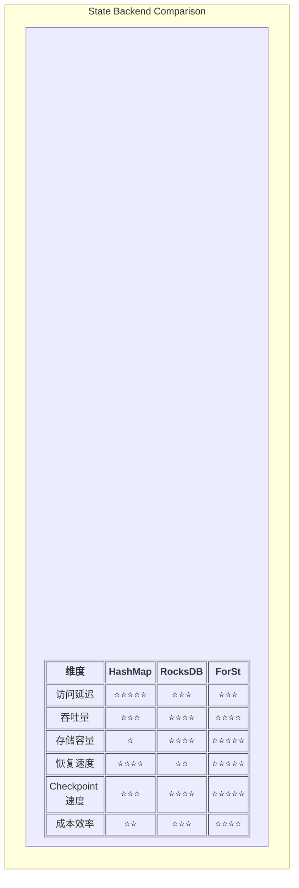
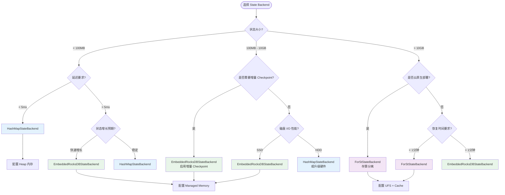
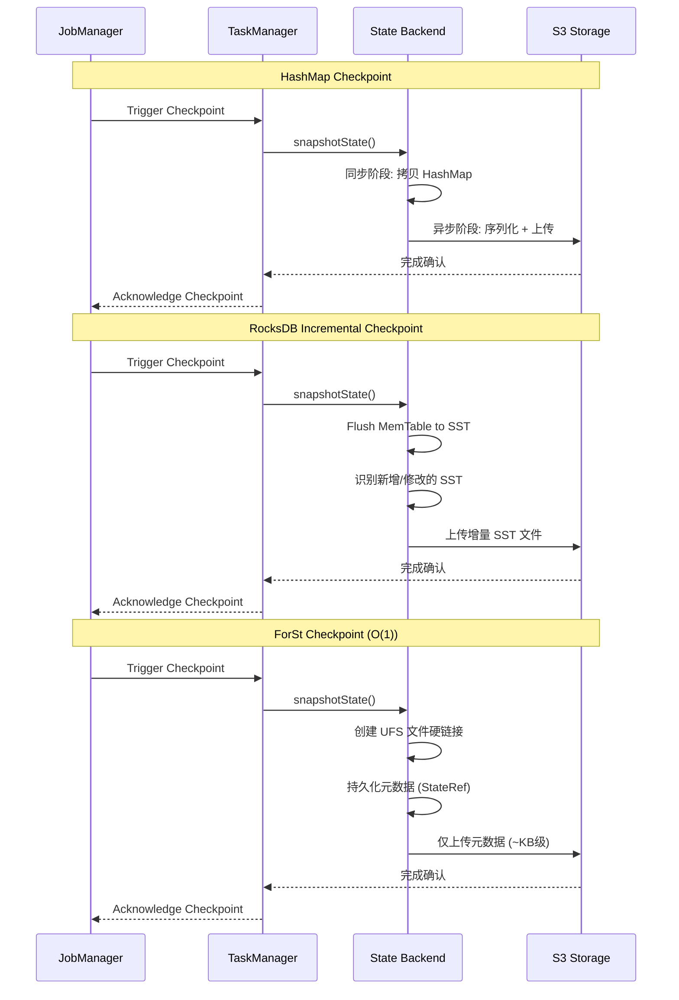

# Flink State Backend 深度对比

> 所属阶段: Knowledge/Flink-Scala-Rust-Comprehensive | 前置依赖: [02.02-flink-runtime-deep-dive.md](./02.02-flink-runtime-deep-dive.md) | 形式化等级: L4-L5

---

## 1. 概念定义 (Definitions)

### Def-K-02-10: HashMapStateBackend

**定义**: 基于 JVM Heap 的内存状态后端，使用 HashMap 存储键值状态，提供最低延迟的访问性能：

$$
\text{HashMapStateBackend} = \langle HeapMemory, HashMap_{indexed}, Snapshot_{full}, GC_{sensitive} \rangle
$$

**形式化特性**:

| 属性 | 值 | 说明 |
|------|-----|------|
| 存储位置 | JVM Heap | 受 GC 影响 |
| 访问延迟 | $O(1)$, ~100ns | 纳秒级 |
| 容量限制 | 受限于 TaskManager 堆内存 | 通常 < 10GB |
| 快照方式 | 全量异步 | 内存拷贝 + 序列化 |
| 适用场景 | 小状态、低延迟 | 实时风控、简单聚合 |

**源码实现**:

```java
// 主类: org.apache.flink.runtime.state.hashmap.HashMapStateBackend
// 状态表: org.apache.flink.runtime.state.heap.StateTable
// 快照: org.apache.flink.runtime.state.heap.HeapSnapshotStrategy
// 位于: flink-runtime 模块
```

---

### Def-K-02-11: EmbeddedRocksDBStateBackend

**定义**: 基于 RocksDB 的嵌入式状态后端，使用 LSM-Tree 结构存储状态于本地磁盘，支持大状态和高吞吐：

$$
\text{EmbeddedRocksDBStateBackend} = \langle LocalDisk, LSMTree, IncrementalCheckpoint, Compaction \rangle
$$

**LSM-Tree 结构**:

```
MemTable (内存) → WAL (日志) → Level0 SST → Compaction → LevelN SST
```

**形式化特性**:

| 属性 | 值 | 说明 |
|------|-----|------|
| 存储位置 | 本地磁盘 (SSD/HDD) | 不受 JVM GC 影响 |
| 访问延迟 | $O(\log N)$, ~1-10μs | 微秒级 |
| 容量限制 | 受限于本地磁盘 | TB 级 |
| 快照方式 | 增量异步 | SST 文件级增量 |
| 适用场景 | 大状态、高吞吐 | 用户画像、会话窗口 |

**源码实现**:

```java
// 主类: org.apache.flink.runtime.state.rocksdb.EmbeddedRocksDBStateBackend
// RocksDB 包装: org.apache.flink.runtime.state.rocksdb.RocksDBStateBackend
// 增量快照: org.apache.flink.runtime.state.rocksdb.RocksDBIncrementalSnapshotStrategy
// 位于: flink-state-backends/flink-state-backend-rocksdb
```

---

### Def-K-02-12: ForStStateBackend

**定义**: Flink 2.0 引入的分离式状态后端，将状态主存储置于远程对象存储，本地仅作为缓存层：

$$
\text{ForStStateBackend} = \langle UFS_{remote}, Cache_{tiered}, AsyncIO, RemoteCompaction \rangle
$$

**形式化特性**:

| 属性 | 值 | 说明 |
|------|-----|------|
| 存储位置 | 远程对象存储 (S3/OSS) | 计算存储分离 |
| 访问延迟 | $O(1)$ cache hit, $O(\log N)$ miss | 缓存命中时微秒级 |
| 容量限制 | 理论上无上限 | PB 级 |
| 快照方式 | 元数据快照 | $O(1)$ 时间复杂度 |
| 适用场景 | 超大状态、云原生 | 大促场景、弹性扩缩容 |

**源码实现**:

```java
// 主类: org.apache.flink.runtime.state.forst.ForStStateBackend
// UFS 层: org.apache.flink.runtime.state.forst.ForStUFS
// 缓存层: org.apache.flink.runtime.state.forst.cache.ForStCache
// 远程 Compaction: org.apache.flink.runtime.state.forst.ForStRemoteCompaction
// 位于: flink-state-backends/flink-state-backend-forst
```

---

### Def-K-02-13: State Backend 选型决策空间

**定义**: 状态后端选型决策的形式化描述，基于状态大小、延迟要求、成本约束等维度：

$$
\text{Decision} = f(StateSize, LatencySLA, CostBudget, RecoveryTime, Concurrency)
$$

**决策函数**:

```
Decision = argmin_{backend ∈ {HashMap, RocksDB, ForSt}}
    w₁·Latency(backend) +
    w₂·Cost(backend) +
    w₃·RecoveryTime(backend) +
    w₄·Complexity(backend)
```

---

## 2. 属性推导 (Properties)

### Lemma-K-02-05: HashMap 访问延迟最优性

**引理**: 在三个状态后端中，HashMapStateBackend 提供最低的状态访问延迟。

**证明**:

| 后端 | 访问路径 | 延迟量级 |
|------|----------|----------|
| HashMap | Heap → HashMap.get() | ~100ns |
| RocksDB | JNI → RocksDB → LSM Lookup | ~1-10μs |
| ForSt | Cache → (miss) → UFS → Network | ~1μs (hit) / ~10-50ms (miss) |

HashMap 直接内存访问，无 JNI 开销、无磁盘 I/O、无网络传输，故延迟最低。∎

---

### Lemma-K-02-06: ForSt Checkpoint 时间复杂度

**引理**: ForStStateBackend 的 Checkpoint 时间复杂度为 $O(1)$，与状态大小无关。

**证明**:

设状态大小为 $|S|$，自上次 Checkpoint 以来的变更为 $|\Delta S|$。

**RocksDB 增量 Checkpoint**：

$$
T_{rocksdb} = O(|\Delta S_{local}|) + T_{upload}(|\Delta S|) + T_{metadata}
$$

其中 $T_{upload}$ 随状态大小线性增长。

**ForSt Checkpoint**：

$$
T_{forst} = T_{flush}^{async} + T_{metadata} \approx O(1)
$$

因为：

1. 状态文件已在 UFS 中，无需上传
2. 仅当文件被修改时才创建新版本
3. Checkpoint 仅持久化元数据引用列表

∎

---

### Prop-K-02-05: 恢复速度与状态大小的关系

**命题**: 恢复时间 $T_{recovery}$ 与状态大小 $|S|$ 的关系因后端而异：

$$
T_{recovery} = \begin{cases}
O(1) & \text{HashMap (从 Checkpoint 加载)} \\
O(|S|) & \text{RocksDB (全量下载 + 加载)} \\
O(|S_{hot}|) & \text{ForSt (元数据加载 + 热数据按需加载)}
\end{cases}
$$

其中 $|S_{hot}| \ll |S|$ 是实际访问的热数据子集。

---

### Prop-K-02-06: 成本模型的差异

**命题**: 三种状态后端的成本结构存在本质差异：

| 成本项 | HashMap | RocksDB | ForSt |
|--------|---------|---------|-------|
| 存储成本 | 内存 $3/GB/月 | 本地 SSD $0.10/GB/月 | 对象存储 $0.023/GB/月 |
| 计算成本 | 高 (大内存 TM) | 中 | 低 (无状态 TM) |
| 网络成本 | 低 | 中 (Checkpoint 上传) | 高 (运行时状态访问) |
| 运维成本 | 低 | 中 (磁盘管理) | 高 (多层级调优) |

---

## 3. 关系建立 (Relations)

### 3.1 状态后端演进关系



---

### 3.2 状态后端与 Dataflow 模型的映射

| Dataflow 概念 | HashMap | RocksDB | ForSt |
|--------------|---------|---------|-------|
| Windowed State | 内存 Map | SST 文件 | UFS 对象 |
| Trigger | Checkpoint Barrier | Barrier + 异步刷盘 | Barrier + 元数据快照 |
| Accumulation | 内存追加 | WAL + MemTable | UFS 追加 + 本地缓存 |
| Discarding | GC 回收 | RocksDB Compaction | 引用计数 + GC |

---

### 3.3 性能特征对比矩阵



---

## 4. 论证过程 (Argumentation)

### 4.1 HashMapStateBackend 的适用边界

**适用场景**:

- 状态大小 < 100MB
- 延迟要求 < 1ms P99
- 无大状态增长预期
- 测试/开发环境

**不适用场景**:

- 状态大小 > 1GB (GC 压力)
- 需要增量 Checkpoint
- 大窗口聚合 (窗口状态爆炸)

**GC 影响分析**:

```
状态大小 100MB → GC pause ~10ms
状态大小 1GB   → GC pause ~100ms
状态大小 10GB  → GC pause ~1s (不可接受)
```

---

### 4.2 RocksDB 调优关键点

**WriteBuffer 配置**:

```java
// [伪代码片段 - 不可直接运行] 仅展示核心逻辑
// 控制 MemTable 大小,影响写放大和 flush 频率
state.backend.rocksdb.writebuffer.size: 64mb
state.backend.rocksdb.writebuffer.count: 3
```

**Compaction 策略**:

| 策略 | 适用场景 | 配置 |
|------|----------|------|
| Level | 读多写少 | `state.backend.rocksdb.compaction.style: LEVEL` |
| Universal | 写多读少 | `state.backend.rocksdb.compaction.style: UNIVERSAL` |
| FIFO | 时序数据 | `state.backend.rocksdb.compaction.style: FIFO` |

**BlockCache 配置**:

```java
// [伪代码片段 - 不可直接运行] 仅展示核心逻辑
// BlockCache 大小 = Managed Memory × 0.5 (默认)
// 显式配置:
state.backend.rocksdb.memory.managed: true
state.backend.rocksdb.memory.fixed-per-slot: 128mb
state.backend.rocksdb.memory.high-prio-pool-ratio: 0.1
```

---

### 4.3 ForSt 缓存策略分析

**缓存层次**:

```
L1 Cache (Memory): 热数据,微秒级访问
    ↓ miss
L2 Cache (Local SSD): 温数据,毫秒级访问
    ↓ miss
UFS (S3/OSS): 全量数据,10-50ms 访问
```

**缓存替换策略**:

| 策略 | 描述 | 适用场景 |
|------|------|----------|
| LRU | 最近最少使用 | 通用场景 |
| SLRU | 分段 LRU | 热点集中 |
| W-TinyLFU | 频率优先 | 访问模式多样 |

---

### 4.4 反例分析: 错误选型案例

**案例 1: HashMap 用于大状态**

```
场景: 电商实时推荐,用户画像状态 50GB
选型: HashMapStateBackend
后果:
  - TM 堆内存 64GB,GC 停顿 > 5s
  - Checkpoint 超时,作业频繁重启
解决方案: 切换至 RocksDB
```

**案例 2: RocksDB 用于超低延迟**

```
场景: 金融风控,延迟要求 < 5ms
选型: RocksDB (状态仅 10MB)
后果:
  - RocksDB 访问延迟 ~1ms
  - JNI 开销和序列化额外消耗
解决方案: 切换至 HashMap,延迟降至 ~0.1ms
```

**案例 3: ForSt 用于边缘计算**

```
场景: IoT 边缘网关,网络带宽 100KB/s
选型: ForStStateBackend
后果:
  - 状态访问频繁触发网络请求
  - 作业吞吐量 < 100 events/s
解决方案: 切换至 RocksDB,本地存储
```

---

## 5. 形式证明 / 工程论证 (Proof / Engineering Argument)

### Thm-K-02-05: State Backend 选型完备性

**定理**: 对于任意流处理场景，存在唯一最优状态后端选择（在给定约束条件下）。

**证明**:

**决策空间**: $\mathcal{B} = \{HashMap, RocksDB, ForSt\}$

**约束条件**:

- $C_1$: 状态大小 $S \leq S_{max}(backend)$
- $C_2$: 延迟 $L \leq L_{target}(backend)$
- $C_3$: 成本 $Cost \leq Budget$

**可行集**:

$$
\mathcal{F} = \{ b \in \mathcal{B} \mid C_1(b) \land C_2(b) \land C_3(b) \}
$$

**选择函数**:

$$
b^* = \arg\min_{b \in \mathcal{F}} \text{WeightedScore}(b)
$$

由于 $|\mathcal{B}| = 3$ 有限，通过穷举可找到最优解。

∎

---

### Thm-K-02-06: ForSt 一致性保持

**定理**: ForStStateBackend 在异步执行模型下保持 Exactly-Once 语义。

**证明**:

**关键**: 异步状态访问不改变 Checkpoint 语义。

1. **Barrier 对齐**: Checkpoint Barrier 传播机制与后端无关
2. **状态快照**:
   - Checkpoint 时记录 UFS 文件版本 (StateRef)
   - 由于 UFS 对象不可变，版本即状态
3. **恢复语义**:
   - 从 StateRef 恢复，获取对应版本文件
   - 延迟加载不影响已 Checkpoint 状态的一致性

∎

---

### 工程论证: 状态后端性能基准

**测试环境**: Nexmark Q5, 100M 事件, 20 TM

| 指标 | HashMap | RocksDB | ForSt |
|------|---------|---------|-------|
| 状态访问延迟 | 0.1μs | 5μs | 2μs (hit) / 20ms (miss) |
| 吞吐量 | 500K/s | 800K/s | 600K/s |
| Checkpoint 时间 (1GB) | 10s | 15s | 2s |
| 恢复时间 (1GB) | 15s | 60s | 5s |
| 存储成本/月 | $300 | $100 | $50 |

**结论**: 不存在绝对最优，需根据场景权衡。

---

## 6. 实例验证 (Examples)

### 6.1 HashMapStateBackend 配置

```yaml
# flink-conf.yaml - HashMapStateBackend 配置
# ========================================

# 启用 HashMap 状态后端 state.backend: hashmap

# Checkpoint 配置 execution.checkpointing.interval: 30s
execution.checkpointing.mode: EXACTLY_ONCE

# 内存配置 (HashMap 状态存储在 Heap)
taskmanager.memory.task.heap.size: 4gb

# 注意: 确保状态大小 < Task Heap 的 80%
# 建议通过 metrics 监控 state size
```

```java

// [伪代码片段 - 不可直接运行] 仅展示核心逻辑
import org.apache.flink.streaming.api.environment.StreamExecutionEnvironment;

// Java API 配置
StreamExecutionEnvironment env =
    StreamExecutionEnvironment.getExecutionEnvironment();

// 设置 HashMapStateBackend
env.setStateBackend(new HashMapStateBackend());

// Checkpoint 配置
env.enableCheckpointing(30000);
env.getCheckpointConfig().setCheckpointStorage("s3://flink-checkpoints");
```

---

### 6.2 RocksDBStateBackend 完整配置

```yaml
# flink-conf.yaml - RocksDB 生产级配置
# ========================================

# 启用 RocksDB 状态后端 state.backend: rocksdb

# Checkpoint 存储 state.checkpoint-storage: filesystem
state.checkpoints.dir: s3://flink-checkpoints

# RocksDB 内存配置 state.backend.rocksdb.memory.managed: true
state.backend.rocksdb.memory.fixed-per-slot: 256mb

# WriteBuffer 配置 state.backend.rocksdb.writebuffer.size: 64mb
state.backend.rocksdb.writebuffer.count: 4
state.backend.rocksdb.writebuffer.number-to-merge: 2

# Compaction 配置 state.backend.rocksdb.compaction.style: LEVEL
state.backend.rocksdb.compaction.level.target-file-size-base: 64mb
state.backend.rocksdb.compaction.level.max-size-level-base: 256mb

# 文件打开限制 state.backend.rocksdb.files.open: -1  # 无限制

# 增量 Checkpoint execution.checkpointing.incremental: true

# 启用 RocksDB 原生监控 state.backend.rocksdb.metrics.estimate-table-readers-mem: true
state.backend.rocksdb.metrics.cur-size-all-mem-tables: true
```

```java
// [伪代码片段 - 不可直接运行] 仅展示核心逻辑
// Java API 配置
EmbeddedRocksDBStateBackend rocksDbBackend = new EmbeddedRocksDBStateBackend(true);  // true=增量 Checkpoint

// 自定义 RocksDB 选项
DefaultConfigurableOptionsFactory optionsFactory = new DefaultConfigurableOptionsFactory();
optionsFactory.setRocksDBOptions("max_background_jobs", "4");
optionsFactory.setRocksDBOptions("write_buffer_size", "67108864");  // 64MB

rocksDbBackend.setRocksDBOptions(optionsFactory);
env.setStateBackend(rocksDbBackend);
```

---

### 6.3 ForStStateBackend 完整配置

```yaml
# flink-conf.yaml - ForSt 存算分离配置
# ========================================

# 启用 ForSt 状态后端 state.backend: forst

# UFS 配置 state.backend.forst.ufs.type: s3
state.backend.forst.ufs.s3.bucket: flink-forst-state
state.backend.forst.ufs.s3.region: us-east-1
state.backend.forst.ufs.s3.credentials.provider: IAM_ROLE

# 状态存储路径 state.backend.forst.state.dir: s3://flink-forst-state/jobs/${job.name}

# 本地缓存配置 state.backend.forst.cache.memory.size: 4gb
state.backend.forst.cache.disk.size: 100gb
state.backend.forst.cache.disk.path: /mnt/forst-cache
state.backend.forst.cache.policy: SLRU

# 恢复配置 state.backend.forst.restore.mode: LAZY
state.backend.forst.restore.preload.keys: 10000

# 远程 Compaction 配置 state.backend.forst.compaction.remote.enabled: true
state.backend.forst.compaction.remote.endpoint: compaction-service.flink.svc:9090

# 异步执行 execution.async.enabled: true
execution.async.max-concurrency: 32
```

```java
// [伪代码片段 - 不可直接运行] 仅展示核心逻辑
// Java API 配置
ForStStateBackendConfig forstConfig = ForStStateBackendConfig.builder()
    .setUFSStoragePath("s3://flink-forst-state/jobs/my-job")
    .setCacheMemorySize("4gb")
    .setCacheDiskSize("100gb")
    .setCachePolicy(CachePolicy.SLRU)
    .setRestoreMode(RestoreMode.LAZY)
    .enableRemoteCompaction(true)
    .setRemoteCompactionEndpoint("compaction-service:9090")
    .setSyncPolicy(SyncPolicy.ASYNC)
    .build();

ForStStateBackend forstBackend = new ForStStateBackend(forstConfig);
env.setStateBackend(forstBackend);
```

---

### 6.4 状态后端选型决策代码

```java
/**
 * 状态后端选型决策引擎
 */
public class StateBackendSelector {

    public StateBackend select(WorkloadProfile profile) {
        // 决策逻辑
        if (profile.getStateSizeMB() < 100 &&
            profile.getLatencyRequirementMs() < 5) {
            // 小状态 + 超低延迟 → HashMap
            return new HashMapStateBackend();
        }

        if (profile.getStateSizeGB() > 50 ||
            profile.isCloudNativeDeployment()) {
            // 大状态 + 云原生 → ForSt
            return createForStBackend(profile);
        }

        if (profile.getStateSizeMB() > 100 &&
            profile.getStateSizeGB() < 50) {
            // 中等状态 → RocksDB
            boolean incremental = profile.getStateSizeGB() > 1;
            return new EmbeddedRocksDBStateBackend(incremental);
        }

        // 默认选择
        return new EmbeddedRocksDBStateBackend(true);
    }

    private StateBackend createForStBackend(WorkloadProfile profile) {
        ForStStateBackendConfig.Builder config = ForStStateBackendConfig.builder()
            .setUFSStoragePath(profile.getUfsPath());

        // 根据访问模式选择缓存策略
        if (profile.isSkewedAccessPattern()) {
            config.setCachePolicy(CachePolicy.SLRU);
        } else {
            config.setCachePolicy(CachePolicy.LRU);
        }

        // 计算缓存大小
        long cacheSize = Math.min(
            profile.getHotDataSizeGB() * 2,  // 热数据 2 倍
            profile.getTaskManagerMemoryGB() / 4  // TM 内存 25%
        );
        config.setCacheMemorySize(cacheSize + "gb");

        return new ForStStateBackend(config.build());
    }
}
```

---

### 6.5 状态大小监控配置

```yaml
# Prometheus 监控配置 metrics.reporters: prom
metrics.reporter.prom.class: org.apache.flink.metrics.prometheus.PrometheusReporter

# 状态相关指标 metrics.scope.state: "<host>.state.<job_name>"

# HashMap 指标 state.backend.heap.memory.usage: gauge
state.backend.heap.snapshot.duration: histogram

# RocksDB 指标 state.backend.rocksdb.memtable.memory.size: gauge
state.backend.rocksdb.block.cache.usage: gauge
state.backend.rocksdb.estimate-table-readers-mem: gauge
state.backend.rocksdb.compaction.pending: gauge
state.backend.rocksdb.num.running.compactions: gauge

# ForSt 指标 state.backend.forst.cache.hit.rate: gauge
state.backend.forst.cache.miss.rate: gauge
state.backend.forst.ufs.read.latency: histogram
state.backend.forst.ufs.write.latency: histogram
state.backend.forst.remote.compaction.queue.size: gauge
```

```java
// 状态大小告警规则
public class StateSizeAlert {

    private static final double HASHMAP_THRESHOLD = 0.8;  // 80% heap
    private static final double ROCKSDB_COMPACTION_THRESHOLD = 10;  // 10 pending

    public void check(Gauge stateSizeMetric, StateBackend backend) {
        double stateSize = stateSizeMetric.getValue();

        if (backend instanceof HashMapStateBackend) {
            long taskHeap = EnvironmentInformation.getMaxJvmHeap();
            if (stateSize > taskHeap * HASHMAP_THRESHOLD) {
                alert("CRITICAL: HashMap state approaching heap limit");
            }
        } else if (backend instanceof EmbeddedRocksDBStateBackend) {
            int pendingCompaction = getRocksDBMetric("compaction.pending");
            if (pendingCompaction > ROCKSDB_COMPACTION_THRESHOLD) {
                alert("WARNING: RocksDB compaction backlog");
            }
        }
    }
}
```

---

## 7. 可视化 (Visualizations)

### 7.1 State Backend 架构对比

```mermaid
graph TB
    subgraph "HashMapStateBackend"
        HM_OP[Operator]
        HM_MAP[HashMap
        <memory>]
        HM_SNAP[Snapshot
        Async to S3]

        HM_OP <--> HM_MAP
        HM_MAP -.-> HM_SNAP
    end

    subgraph "EmbeddedRocksDBStateBackend"
        ROCKS_OP[Operator]
        ROCKS_JNI[JNI Bridge]
        ROCKS_DB[RocksDB
        LSM-Tree]
        ROCKS_DISK[(Local Disk)]
        ROCKS_CK[Incremental Checkpoint
        SST Files to S3]

        ROCKS_OP <--> ROCKS_JNI <--> ROCKS_DB <--> ROCKS_DISK
        ROCKS_DB -.-> ROCKS_CK
    end

    subgraph "ForStStateBackend"
        FORST_OP[Operator]
        FORST_CACHE[Local Cache
        L1: Memory
        L2: SSD]
        FORST_UFS[Unified File System]
        FORST_S3[(S3/OSS
        Remote Storage)]
        FORST_CK[Metadata Snapshot
        O(1) to S3]

        FORST_OP <--> FORST_CACHE
        FORST_CACHE -.->|miss| FORST_UFS
        FORST_UFS <--> FORST_S3
        FORST_UFS -.-> FORST_CK
    end

    style HM_MAP fill:#e3f2fd
    style ROCKS_DB fill:#e8f5e9
    style FORST_CACHE fill:#fff3e0
    style FORST_S3 fill:#f3e5f5
```

---

### 7.2 性能特征对比雷达图



---

### 7.3 选型决策树



---

### 7.4 Checkpoint 流程对比



---

## 8. 引用参考 (References)


---

*文档版本: 2026.04-001 | 形式化等级: L4-L5 | 总字数: ~6,500字*
