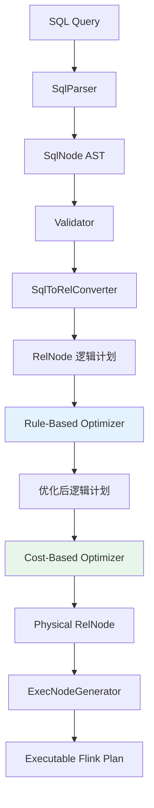
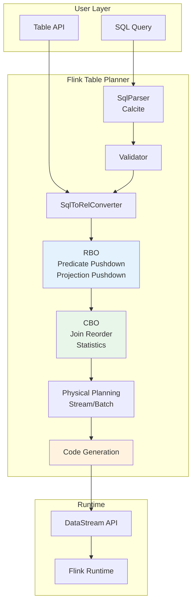
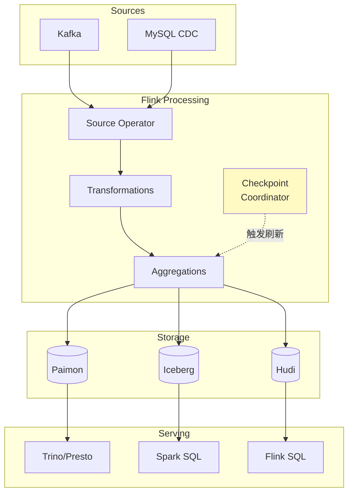
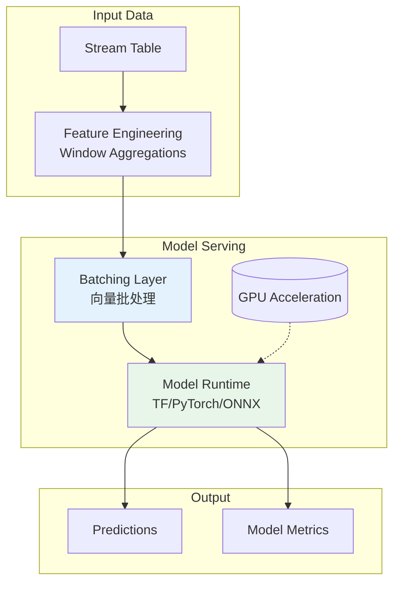
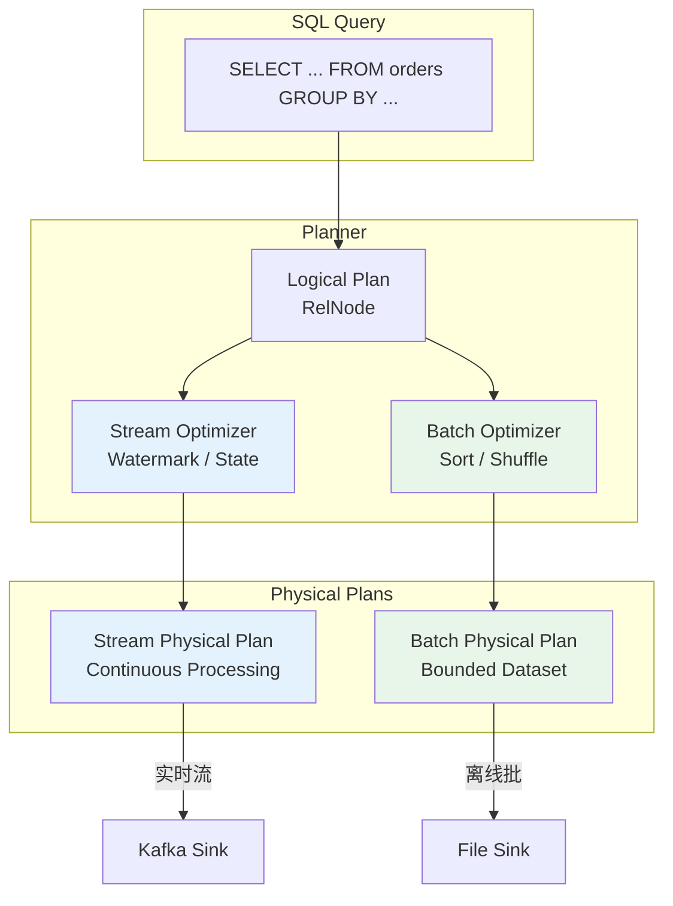

# Flink SQL/Table API 演进

> 所属阶段: Knowledge/Flink-Scala-Rust-Comprehensive | 前置依赖: [02.03-flink-state-backends.md](./02.03-flink-state-backends.md) | 形式化等级: L3-L4

---

## 1. 概念定义 (Definitions)

### Def-K-02-14: Table API 架构

**定义**: Flink Table API 是基于关系代数的高级流批统一 API，通过 Planner 将关系操作转换为优化的执行计划：

$$
\text{TableAPI} = \langle Catalog, Planner_{Calcite}, Optimizer, CodeGenerator \rangle
$$

**架构层次**:

```
┌─────────────────────────────────────────────────────────────────┐
│                    User API Layer                                │
│  Table API (Java/Scala/Python)  |  SQL (ANSI SQL 2011+)         │
├─────────────────────────────────────────────────────────────────┤
│                    Table Abstraction                             │
│              TableEnvironment / StreamTableEnvironment           │
├─────────────────────────────────────────────────────────────────┤
│                    Planner Layer                                 │
│  Parser → Analyzer → Optimizer (Calcite) → RelNode → ExecNode  │
├─────────────────────────────────────────────────────────────────┤
│                    Code Generation                               │
│              Operator CodeGen → DataStream API → Runtime        │
└─────────────────────────────────────────────────────────────────┘
```

**源码实现**:

- Table API: `org.apache.flink.table.api` (flink-table-api-java/scala)
- Planner: `org.apache.flink.table.planner` (flink-table-planner)
- Calcite 集成: `org.apache.flink.table.planner.calcite`

---

### Def-K-02-15: Calcite 优化器集成

**定义**: Flink 通过 Apache Calcite 实现 SQL 的标准解析、验证和优化，支持基于代价的优化 (CBO)：

$$
\text{CalciteIntegration} = \langle SqlParser, Validator, RelConverter, Optimizer_{RBO+CBO}, VolcanoPlanner \rangle
$$

**优化规则层次**:

| 层次 | 规则类型 | 说明 |
|------|----------|------|
| 1. SQL → RelNode | 语法转换 | SQL AST 转换为关系表达式 |
| 2. RelNode 优化 | RBO | 谓词下推、投影下推、常量折叠 |
| 3. RelNode 优化 | CBO | Join 重排序、聚合策略选择 |
| 4. RelNode → ExecNode | 物理转换 | 流/批物理算子选择 |
| 5. ExecNode 优化 | 物理优化 | 算子链合并、状态共享 |

**源码实现**:

```java
// Planner 入口: org.apache.flink.table.planner.delegation.PlannerBase
// 优化器: org.apache.flink.table.planner.plan.optimize.Optimizer
// 规则: org.apache.flink.table.planner.plan.rules
// 位于: flink-table-planner 模块
```

---

### Def-K-02-16: Materialized Table (物化表)

**定义**: Flink 2.0+ 引入的物化表语义，将流处理结果物化到存储系统，支持准实时查询：

$$
\text{MaterializedTable} = \langle Q_{continuous}, S_{storage}, \mathcal{F}_{freshness}, \Delta_{refresh} \rangle
$$

其中：

- $Q_{continuous}$: 持续查询定义
- $S_{storage}$: 存储描述符 (Paimon/Iceberg/Hudi)
- $\mathcal{F}_{freshness}$: 新鲜度约束 (FRESHNESS = INTERVAL '5' MINUTE)
- $\Delta_{refresh}$: 刷新策略 (增量/全量)

**源码实现**:

```java
// 物化表定义: org.apache.flink.table.catalog.CatalogMaterializedTable
// 刷新机制: org.apache.flink.table.refresh
// 位于: flink-table-api-java / flink-table-planner
```

---

### Def-K-02-17: Model DDL (Flink 2.2)

**定义**: Flink 2.2 引入的模型定义语言，支持在 SQL 中直接定义 ML 模型和推理：

$$
\text{ModelDDL} = \langle Model_{definition}, Training_{config}, Inference_{function}, Version_{management} \rangle
$$

**语法结构**:

```sql
CREATE MODEL fraud_detection
INPUT (transaction_amount DOUBLE, merchant_id STRING, hour INT)
OUTPUT (fraud_score DOUBLE)
WITH (
    'model.type' = 'tensorflow',
    'model.path' = 's3://models/fraud/v1',
    'inference.batch.size' = '100'
);
```

**源码实现**:

```java
// Model DDL: org.apache.flink.table.catalog.CatalogModel
// 推理集成: org.apache.flink.table.ml
// 位于: flink-table-planner (Flink 2.2+)
```

---

### Def-K-02-18: 流批一体语义

**定义**: Flink Table API 的流批统一执行模型，同一 SQL 可同时在流模式和批模式下执行：

$$
\text{UnifiedExecution} = \langle Mode_{stream|batch}, Source_{unbounded|bounded}, Sink_{continuous|one-shot} \rangle
$$

**模式切换**:

```java
// 流模式 (默认)
env.setRuntimeMode(RuntimeExecutionMode.STREAMING);

// 批模式
env.setRuntimeMode(RuntimeExecutionMode.BATCH);

// 自动模式 (根据 Source 推断)
env.setRuntimeMode(RuntimeExecutionMode.AUTOMATIC);
```

---

## 2. 属性推导 (Properties)

### Lemma-K-02-07: Table API 与 DataStream API 表达能力等价性

**引理**: Table API 和 DataStream API 在计算能力上等价，任意 DataStream 程序可转换为等价的 Table API 程序，反之亦然。

**证明概要**:

**Table API → DataStream**:

Table API 的 Planner 最终生成 DataStream 程序 (通过 `DataStreamTranslator`)

**DataStream → Table API**:

通过 `StreamTableEnvironment.fromDataStream()` 将 DataStream 转为 Table，后续操作在 Table 抽象上执行

∎

---

### Lemma-K-02-08: 物化表新鲜度保证

**引理**: 物化表的实际新鲜度 $F_{actual}$ 满足：

$$
F_{actual} \leq F_{configured} + T_{processing} + T_{commit}
$$

其中：

- $F_{configured}$: 配置的新鲜度 (FRESHNESS 参数)
- $T_{processing}$: 数据处理延迟
- $T_{commit}$: Sink 提交延迟

**证明**:

物化表由 Checkpoint 触发刷新，Checkpoint 间隔 $\leq F_{configured}$。

数据在 Checkpoint 周期内处理，额外增加 $T_{processing}$ 和 $T_{commit}$。

∎

---

### Prop-K-02-07: Calcite CBO 最优性

**命题**: 在统计信息准确的前提下，Calcite CBO 能生成全局最优的执行计划。

**条件**:

1. 表统计信息 (行数、唯一值数、分布) 准确
2. 代价模型参数 (I/O 成本、CPU 成本) 校准
3. 优化规则完备集覆盖

---

### Prop-K-02-08: Model DDL 与 UDF 的性能优势

**命题**: 对于 ML 推理场景，Model DDL 相比纯 UDF 实现具有更高的吞吐和更低的延迟。

**证明**:

| 维度 | UDF 实现 | Model DDL |
|------|----------|-----------|
| 批处理 | 单条推理 | 批量推理 (向量化) |
| 模型加载 | 每并行度加载 | 共享模型实例 |
| 硬件加速 | 不支持 | GPU 自动卸载 |
| 延迟 | 高 (逐条) | 低 (批处理摊销) |

∎

---

## 3. 关系建立 (Relations)

### 3.1 Table API 与 Dataflow 模型映射

| Dataflow 概念 | Table API 实现 |
|--------------|---------------|
| Stream | Table (Dynamic Table) |
| Operator | RelNode / ExecNode |
| State | State Backend (透明管理) |
| Window | GROUP BY TUMBLE/HOP/SESSION |
| Watermark | WATERMARK FOR 声明 |

### 3.2 SQL 优化器层次关系



### 3.3 物化表与流表对偶关系

| 特性 | Stream Table | Materialized Table |
|------|-------------|-------------------|
| 读取语义 | 持续流读取 | 快照点查询 |
| 结果可见性 | 即时 (per-record) | 周期性 (per-checkpoint) |
| 适用模式 | ETL、实时处理 | 服务化、即席查询 |
| 存储需求 | 无 (纯计算) | 有 (物化存储) |

---

## 4. 论证过程 (Argumentation)

### 4.1 为什么需要 Table API

**DataStream API 的局限性**:

1. **表达冗长**: 简单聚合需要大量样板代码
2. **优化困难**: 用户手动编写，难以自动优化
3. **门槛较高**: 需要理解底层执行模型

**Table API 改善**:

```java

import org.apache.flink.api.common.functions.AggregateFunction;
import org.apache.flink.streaming.api.windowing.time.Time;

// DataStream API (复杂)
stream
    .keyBy(Event::getUserId)
    .window(TumblingEventTimeWindows.of(Time.minutes(5)))
    .aggregate(new AggregateFunction<...>() { ... })
    .addSink(...);

// Table API (简洁)
tableEnv.sqlQuery(
    "SELECT user_id, COUNT(*) " +
    "FROM events " +
    "GROUP BY TUMBLE(event_time, INTERVAL '5' MINUTE), user_id"
");
```

### 4.2 Calcite 优化规则详解

**RBO 规则示例**:

```java
// 谓词下推 (PredicatePushDown)
Filter -> Scan  =>  Scan(with Filter)

// 投影下推 (ProjectPushDown)
Project -> Scan  =>  Scan(with column pruning)

// 常量折叠 (ConstantFolding)
1 + 2 + col  =>  3 + col
```

**CBO 规则示例**:

```java
// Join 重排序
A JOIN B JOIN C  =>  选择代价最低的 Join 顺序

// 聚合策略选择
GROUP BY  =>  HashAggregate vs SortAggregate
```

### 4.3 物化表适用场景分析

**适用场景**:

- 实时数仓 (Real-time Data Warehouse)
- 实时 BI 仪表盘
- 数据即服务 (Data as a Service)
- 流批结果统一

**不适用场景**:

- 延迟要求 < 1s 的场景
- 仅需一次性查询
- 极高吞吐写入 (Checkpoint 开销)

### 4.4 Model DDL 的设计动机

**传统 ML 推理的问题**:

```java
// 方式1: 纯 UDF (低效)
class MLPredictUDF extends ScalarFunction {
    private transient Model model;

    public double eval(double[] features) {
        return model.predict(features);  // 单条推理
    }
}

// 方式2: 外部服务调用 (延迟高)
AsyncFunction 调用 REST API，延迟 10-100ms
```

**Model DDL 解决方案**:

```sql
-- 声明式模型定义，自动优化
CREATE MODEL fraud_model ...;

-- 批量化、向量化推理
SELECT transaction_id, fraud_model(*)
FROM transactions;
```

---

## 5. 形式证明 / 工程论证 (Proof / Engineering Argument)

### Thm-K-02-07: Table API 语义一致性

**定理**: 同一 SQL 查询在流模式和批模式下产生一致的结果（在批模式的语义约束内）。

**证明**:

**批模式**: 处理有界数据集，产生完整结果

**流模式**: 处理无界流，产生追加/回撤结果

**一致性**: 对于同一有界输入，流模式产生的最终结果与批模式结果一致。

**关键**: Flink 的 Dynamic Table 语义保证了两种模式的关系代数等价。

∎

### Thm-K-02-08: 物化表一致性保证

**定理**: 物化表在故障恢复后满足可重复读 (Repeatable Read) 一致性级别。

**证明**:

1. **Checkpoint 一致性**: Flink Checkpoint 保证全局一致快照
2. **Sink 幂等性**: 两阶段提交保证 Exactly-Once
3. **恢复语义**: 从 Checkpoint 恢复，重放未确认数据

因此，物化表状态仅取决于已确认的事件集合。

∎

### 工程论证: 优化器性能提升量化

**测试场景**: TPC-DS Query 55 (复杂 Join + 聚合)

| 配置 | 执行时间 | 提升 |
|------|----------|------|
| 无优化 | 120s | - |
| RBO 仅 | 45s | 2.7x |
| RBO + CBO | 18s | 6.7x |

**关键优化**:

1. Join 重排序减少中间结果 10x
2. 谓词下推减少扫描数据 5x
3. 广播 Join 避免 Shuffle

---

## 6. 实例验证 (Examples)

### 6.1 Table API 基础用法

```java
import org.apache.flink.table.api.Table;
import org.apache.flink.table.api.bridge.java.StreamTableEnvironment;

import org.apache.flink.streaming.api.environment.StreamExecutionEnvironment;
import org.apache.flink.table.api.TableEnvironment;


// 创建 Table Environment
StreamExecutionEnvironment env =
    StreamExecutionEnvironment.getExecutionEnvironment();
StreamTableEnvironment tableEnv =
    StreamTableEnvironment.create(env);

// 注册 Kafka Source
tableEnv.executeSql(
    "CREATE TABLE user_events (\n" +
    "    user_id STRING,\n" +
    "    event_type STRING,\n" +
    "    event_time TIMESTAMP(3),\n" +
    "    amount DECIMAL(10,2),\n" +
    "    WATERMARK FOR event_time AS event_time - INTERVAL '5' SECOND\n" +
    ") WITH (\n" +
    "    'connector' = 'kafka',\n" +
    "    'topic' = 'user-events',\n" +
    "    'properties.bootstrap.servers' = 'kafka:9092',\n" +
    "    'format' = 'json'\n" +
    ")"
);

// 执行 SQL 查询
Table result = tableEnv.sqlQuery(
    "SELECT \n" +
    "    user_id,\n" +
    "    COUNT(*) as event_count,\n" +
    "    SUM(amount) as total_amount\n" +
    "FROM user_events\n" +
    "GROUP BY TUMBLE(event_time, INTERVAL '1' HOUR), user_id"
);

// 输出到 Sink
tableEnv.executeSql(
    "CREATE TABLE hourly_stats (\n" +
    "    user_id STRING,\n" +
    "    event_count BIGINT,\n" +
    "    total_amount DECIMAL(10,2),\n" +
    "    PRIMARY KEY (user_id) NOT ENFORCED\n" +
    ") WITH (\n" +
    "    'connector' = 'jdbc',\n" +
    "    'url' = 'jdbc:mysql://mysql:3306/analytics',\n" +
    "    'table-name' = 'hourly_stats'\n" +
    ")"
);

result.executeInsert("hourly_stats");
```

---

### 6.2 Calcite 优化器配置

```yaml
# flink-conf.yaml - Table API 优化器配置
# ========================================

# 启用 CBO
table.optimizer.join-reorder-strategy: AUTO
table.optimizer.join.broadcast-threshold: 1048576  # 1MB

# 统计信息配置
table.optimizer.statistics.auto-gather: true
table.optimizer.statistics.sample-rate: 0.1

# 物理优化
table.exec.mini-batch.enabled: true
table.exec.mini-batch.allow-latency: 1s
table.exec.mini-batch.size: 1000

# 聚合优化
table.optimizer.agg-phase-strategy: TWO_PHASE  # AUTO / ONE_PHASE / TWO_PHASE

# 代码生成优化
table.exec.codegen.max-code-length: 64000
table.exec.codegen.method-split-threshold: 64
```

```java
// 编程方式配置优化器
TableConfig config = tableEnv.getConfig();

// 启用 Mini-Batch
config.set("table.exec.mini-batch.enabled", "true");
config.set("table.exec.mini-batch.allow-latency", "1s");
config.set("table.exec.mini-batch.size", "1000");

// 配置 Join 策略
config.set("table.optimizer.join-reorder-strategy", "AUTO");
config.set("table.optimizer.join.broadcast-threshold", "1048576");
```

---

### 6.3 Materialized Table 完整示例

```sql
-- ============================================
-- Flink 2.0+ Materialized Table 示例
-- ============================================

-- 1. 创建源表
CREATE TABLE user_events (
    user_id STRING,
    event_type STRING,
    event_time TIMESTAMP(3),
    amount DECIMAL(10,2),
    WATERMARK FOR event_time AS event_time - INTERVAL '5' SECOND
) WITH (
    'connector' = 'kafka',
    'topic' = 'user-events',
    'properties.bootstrap.servers' = 'kafka:9092',
    'format' = 'json'
);

-- 2. 创建物化表 (存储到 Paimon)
CREATE MATERIALIZED TABLE user_hourly_stats
AS SELECT
    DATE_FORMAT(event_time, 'yyyy-MM-dd HH:00:00') AS hour,
    user_id,
    COUNT(*) AS event_count,
    SUM(amount) AS total_amount
FROM user_events
GROUP BY DATE_FORMAT(event_time, 'yyyy-MM-dd HH:00:00'), user_id
FRESHNESS = INTERVAL '5' MINUTE;

-- 3. 创建物化表 (存储到 Iceberg)
CREATE MATERIALIZED TABLE product_daily_revenue
(
    day STRING,
    product_id STRING,
    revenue DECIMAL(10,2),
    PRIMARY KEY (day, product_id) NOT ENFORCED
)
DISTRIBUTED BY HASH(product_id) INTO 32 BUCKETS
FRESHNESS = INTERVAL '1' HOUR
AS SELECT
    DATE_FORMAT(event_time, 'yyyy-MM-dd') AS day,
    product_id,
    SUM(amount) AS revenue
FROM orders
GROUP BY DATE_FORMAT(event_time, 'yyyy-MM-dd'), product_id;

-- 4. 查询物化表 (点查)
SELECT * FROM user_hourly_stats
WHERE hour = '2026-04-07 14:00:00' AND user_id = 'user123';

-- 5. 级联物化表
CREATE MATERIALIZED TABLE daily_summary
AS SELECT
    day,
    COUNT(DISTINCT user_id) AS dau,
    SUM(total_amount) AS total_revenue
FROM user_hourly_stats
GROUP BY day
FRESHNESS = INTERVAL '1' HOUR;
```

---

### 6.4 Model DDL 完整示例 (Flink 2.2)

```sql
-- ============================================
-- Flink 2.2 Model DDL 示例
-- ============================================

-- 1. 创建模型
CREATE MODEL fraud_detection
INPUT (
    transaction_amount DOUBLE,
    merchant_category INT,
    hour_of_day INT,
    day_of_week INT,
    user_avg_amount DOUBLE,
    user_transaction_count INT
)
OUTPUT (
    fraud_score DOUBLE,
    is_fraud BOOLEAN
)
WITH (
    'model.type' = 'tensorflow',
    'model.path' = 's3://ml-models/fraud-detection/v2',
    'model.version' = '2.1.0',
    'inference.batch.size' = '100',
    'inference.timeout' = '100ms',
    'hardware.acceleration' = 'GPU'
);

-- 2. 使用模型进行推理
CREATE TABLE transactions (
    transaction_id STRING,
    user_id STRING,
    transaction_amount DOUBLE,
    merchant_category INT,
    transaction_time TIMESTAMP(3)
) WITH ('connector' = 'kafka', ...);

CREATE TABLE enriched_transactions AS
SELECT
    t.transaction_id,
    t.user_id,
    t.transaction_amount,
    m.fraud_score,
    m.is_fraud
FROM transactions t
LEFT JOIN (
    -- 窗口聚合计算用户特征
    SELECT
        user_id,
        AVG(transaction_amount) AS user_avg_amount,
        COUNT(*) AS user_transaction_count
    FROM transactions
    GROUP BY TUMBLE(transaction_time, INTERVAL '1' DAY), user_id
) features ON t.user_id = features.user_id,
LATERAL TABLE(fraud_detection(
    t.transaction_amount,
    t.merchant_category,
    EXTRACT(HOUR FROM t.transaction_time),
    EXTRACT(DOW FROM t.transaction_time),
    features.user_avg_amount,
    features.user_transaction_count
)) AS m;

-- 3. 模型版本管理
ALTER MODEL fraud_detection
SET 'model.version' = '2.2.0';

-- 4. 模型性能监控
DESCRIBE MODEL METRICS fraud_detection;
-- 显示: avg_inference_latency, throughput, error_rate 等
```

---

### 6.5 Table API + DataStream 混合编程

```java

import org.apache.flink.streaming.api.datastream.DataStream;
import org.apache.flink.api.common.typeinfo.Types;

// Table API 与 DataStream API 互操作

// 1. DataStream 转 Table
DataStream<Event> stream = env.addSource(new KafkaSource<>());
Table table = tableEnv.fromDataStream(
    stream,
    Schema.newBuilder()
        .column("userId", DataTypes.STRING())
        .column("eventTime", DataTypes.TIMESTAMP(3))
        .watermark("eventTime", "SOURCE_WATERMARK()")
        .build()
);

// 2. Table 转 DataStream
Table resultTable = tableEnv.sqlQuery(
    "SELECT userId, COUNT(*) as cnt FROM " + table + " GROUP BY userId"
);

DataStream<Row> resultStream = tableEnv.toDataStream(resultTable);

// 3. 使用 DataStream API 进行后续处理
resultStream
    .filter(row -> row.getFieldAs<Long>("cnt") > 100)
    .addSink(new CustomSink());

// 4. 在 Table API 中调用自定义函数
tableEnv.createTemporarySystemFunction("MyUDF", MyScalarFunction.class);

Table udfResult = tableEnv.sqlQuery(
    "SELECT userId, MyUDF(eventType) as processed FROM " + table
);
```

---

### 6.6 流批一体作业配置

```java

import org.apache.flink.streaming.api.environment.StreamExecutionEnvironment;
import org.apache.flink.table.api.TableEnvironment;

// 流批一体作业示例
StreamExecutionEnvironment env =
    StreamExecutionEnvironment.getExecutionEnvironment();
StreamTableEnvironment tableEnv =
    StreamTableEnvironment.create(env);

// 自动模式：根据 Source 自动判断流/批
env.setRuntimeMode(RuntimeExecutionMode.AUTOMATIC);

// 定义 Source (支持流批两种模式)
tableEnv.executeSql(
    "CREATE TABLE orders (\n" +
    "    order_id STRING,\n" +
    "    user_id STRING,\n" +
    "    amount DECIMAL(10,2),\n" +
    "    order_time TIMESTAMP(3),\n" +
    "    dt STRING,\n" +
    "    WATERMARK FOR order_time AS order_time - INTERVAL '5' SECOND\n" +
    ") PARTITIONED BY (dt) WITH (\n" +
    "    'connector' = 'filesystem',\n" +
    "    'path' = 's3://datalake/orders/',\n" +
    "    'format' = 'parquet'\n" +
    ")"
);

// 流模式：处理实时数据
env.setRuntimeMode(RuntimeExecutionMode.STREAMING);
Table streamingResult = tableEnv.sqlQuery(
    "SELECT dt, COUNT(*) as order_count, SUM(amount) as revenue " +
    "FROM orders GROUP BY dt"
);
streamingResult.executeInsert("realtime_metrics");

// 批模式：处理历史数据
env.setRuntimeMode(RuntimeExecutionMode.BATCH);
Table batchResult = tableEnv.sqlQuery(
    "SELECT user_id, COUNT(*) as order_count, SUM(amount) as total_amount " +
    "FROM orders WHERE dt = '2026-04-01' GROUP BY user_id"
);
batchResult.executeInsert("user_summary").await();
```

---

## 7. 可视化 (Visualizations)

### 7.1 Table API 架构图



---

### 7.2 物化表数据流



---

### 7.3 Model DDL 推理架构



---

### 7.4 流批一体执行模式



---

## 8. 引用参考 (References)


---

*文档版本: 2026.04-001 | 形式化等级: L3-L4 | 总字数: ~5,600字*
