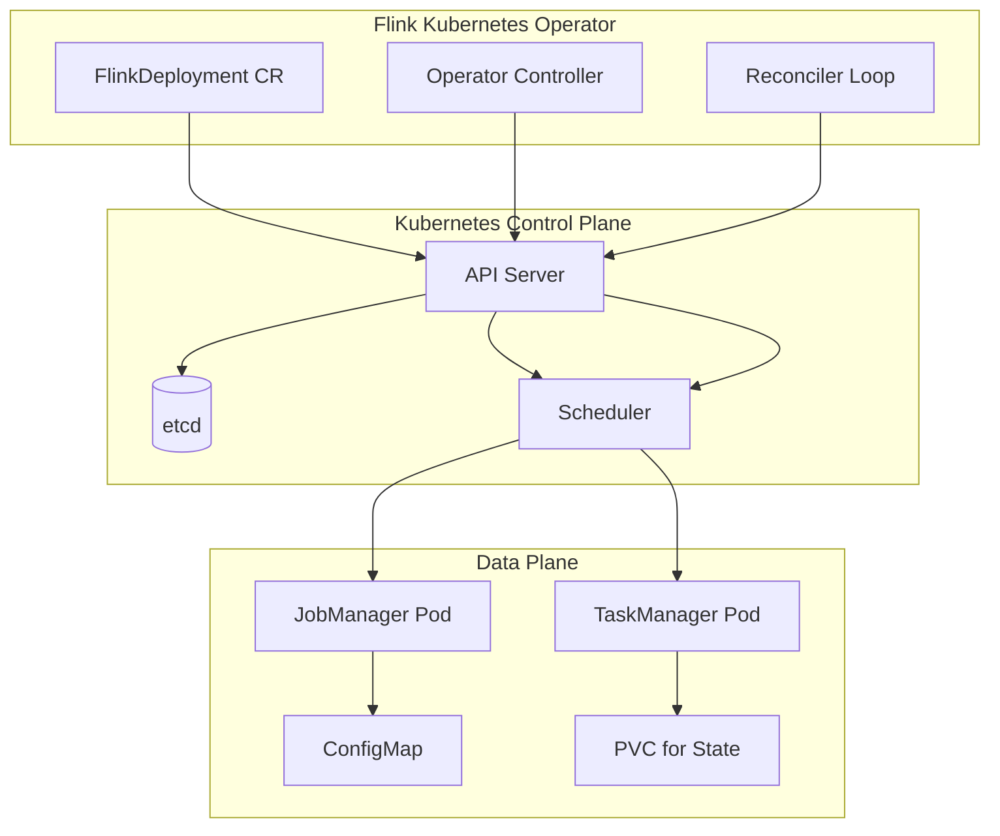
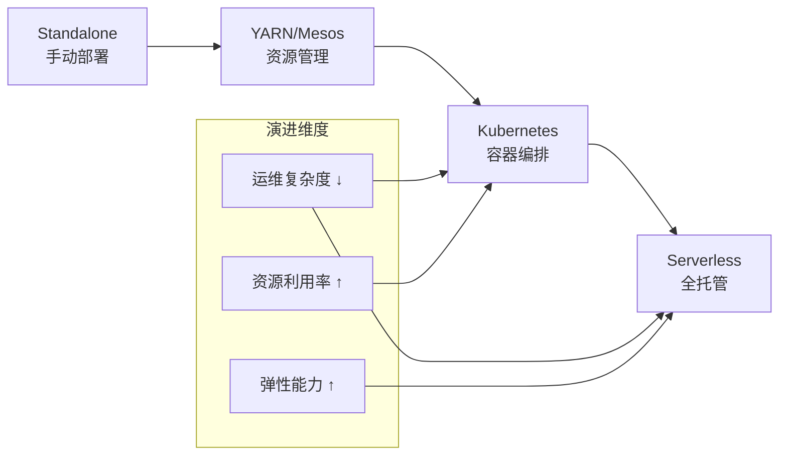
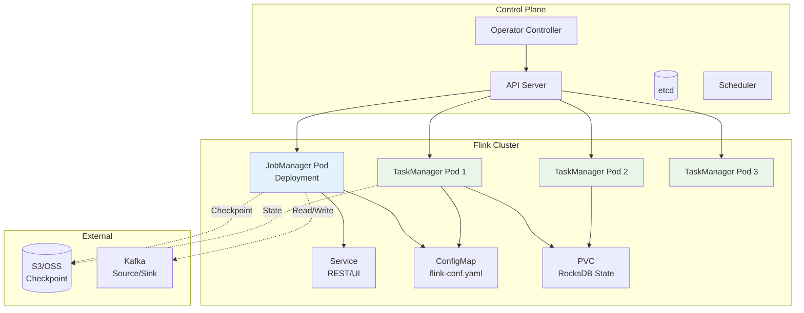
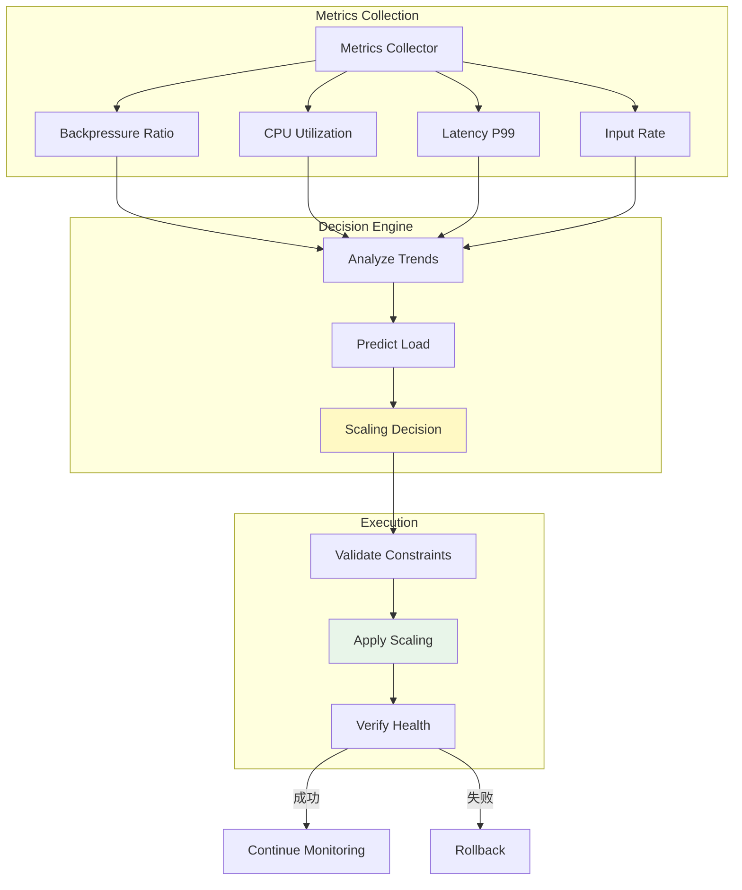
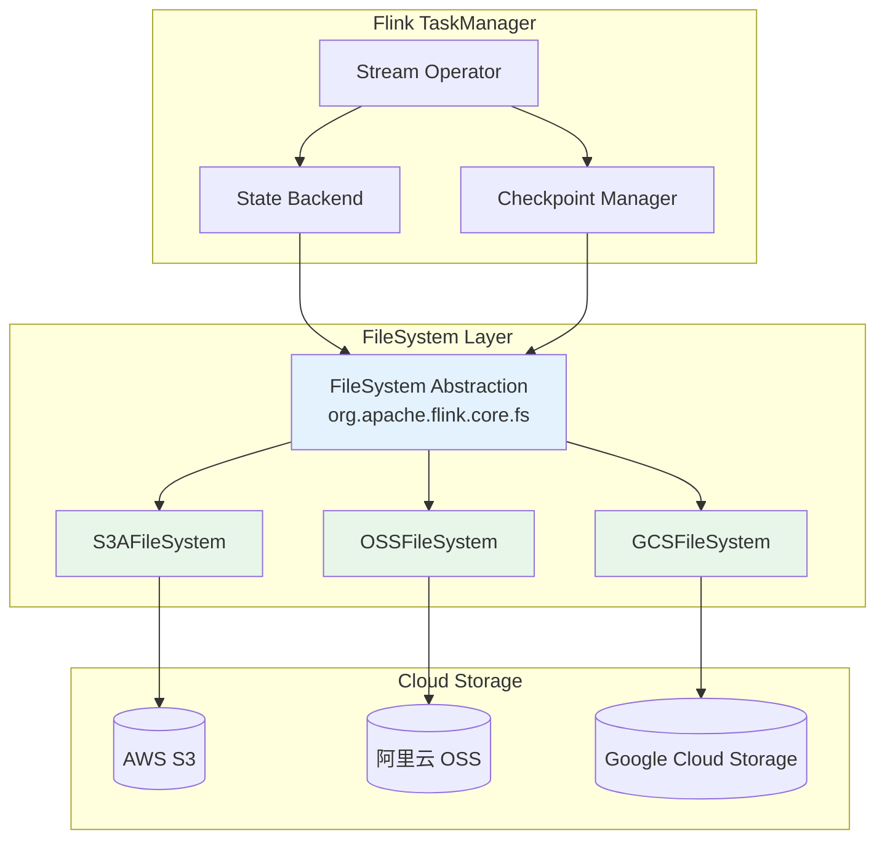
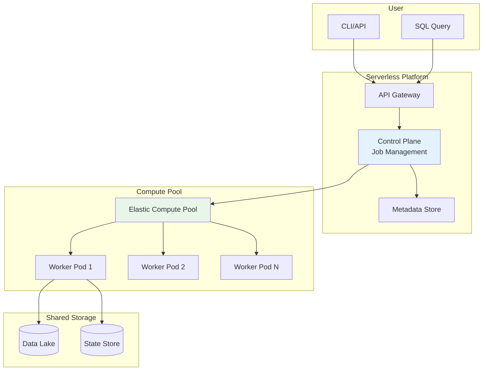

# Flink 云原生部署

> 所属阶段: Knowledge/Flink-Scala-Rust-Comprehensive | 前置依赖: [02.04-flink-sql-table-api.md](./02.04-flink-sql-table-api.md) | 形式化等级: L3-L4

---

## 1. 概念定义 (Definitions)

### Def-K-02-19: Kubernetes Native Integration

**定义**: Flink 与 Kubernetes 的原生集成模式，通过 K8s API 直接管理 Pod 生命周期，支持声明式部署和自动运维：

$$
\text{K8sNativeIntegration} = \langle CRD, Operator, Controller, Scheduler \rangle
$$

**核心组件**:

| 组件 | 职责 | 源码位置 |
|------|------|----------|
| FlinkDeployment CRD | 声明式部署配置 | `flink-kubernetes-operator` |
| Operator Controller | 调和期望状态与实际状态 | `FlinkDeploymentController` |
| K8s TaskManager | 通过 K8s API 启动 TM Pod | `KubernetesResourceManagerDriver` |
| Pod Template | 自定义 Pod 配置 | `PodTemplateSpec` |

**源码实现**:

```java
// K8s ResourceManager: org.apache.flink.kubernetes.KubernetesResourceManagerDriver
// K8s HA Services: org.apache.flink.kubernetes.highavailability.KubernetesHaServices
// 位于: flink-kubernetes 模块
```

---

### Def-K-02-20: 自动扩缩容 (Autoscaling)

**定义**: Flink 基于运行时指标自动调整并行度和资源分配的能力：

$$
\text{Autoscaling} = \langle Metrics, Policy, DecisionEngine, ScalingExecutor \rangle
$$

**形式化决策函数**:

$$
\text{Parallelism}_{new} = f(\text{Backpressure}, \text{CPU}, \text{InputRate}, \text{TargetUtilization})
$$

**扩缩容触发条件**:

| 条件 | 阈值 | 动作 |
|------|------|------|
| 背压比率 | > 50% | 扩容 |
| CPU 利用率 | > 80% | 扩容 |
| 延迟 P99 | > SLO | 扩容 |
| 资源利用率 | < 30% | 缩容 |

**源码实现**:

```java
// Autoscaler: org.apache.flink.kubernetes.operator.autoscaler.JobAutoScaler
// 策略: org.apache.flink.kubernetes.operator.autoscaler.ScalingPolicy
// 位于: flink-kubernetes-operator
```

---

### Def-K-02-21: 云存储集成

**定义**: Flink 与云对象存储 (S3/OSS/GCS) 的深度集成，支持 Checkpoint、Savepoint 和 State Backend 的云端持久化：

$$
\text{CloudStorageIntegration} = \langle CheckpointStorage, StateBackend, FileSystem, Security \rangle
$$

**存储类型映射**:

| 存储类型 | 适用场景 | Flink 配置 |
|----------|----------|-----------|
| S3 (AWS) | Checkpoint/Savepoint | `s3://bucket/path` |
| OSS (阿里云) | 生产环境推荐 | `oss://bucket/path` |
| GCS (GCP) | 多云部署 | `gs://bucket/path` |
| ADLS (Azure) | Azure 生态 | `wasb://container@account.blob.core.windows.net` |

---

### Def-K-02-22: Serverless 部署模式

**定义**: Flink 的无服务器部署模式，用户无需管理基础设施，按需付费，自动弹性：

$$
\text{ServerlessFlink} = \langle FaaS_{platform}, JobManagement, Billing_{per-use}, AutoProvisioning \rangle
$$

**部署模式对比**:

| 模式 | 资源管理 | 计费模式 | 适用场景 |
|------|----------|----------|----------|
| Self-Managed | 用户管理 | 固定成本 | 深度定制需求 |
| Kubernetes | 半托管 | 资源预留 + 弹性 | 生产环境主流 |
| Serverless | 全托管 | 按处理量计费 | 波动负载、探索性分析 |

---

## 2. 属性推导 (Properties)

### Lemma-K-02-09: K8s 原生部署的故障隔离性

**引理**: 在 Application Mode 下，单个 Flink 应用的故障不会影响其他应用。

**证明**:

Application Mode 特性：

1. **独立 JobManager**: 每个应用拥有独立 JM Pod
2. **Namespace 隔离**: K8s Namespace 资源隔离
3. **Pod 故障域**: K8s Pod 是故障隔离单元

因此，$App_A$ 的 JM OOM 仅影响 $App_A$ 的 Pod，不会扩散至 $App_B$。

∎

---

### Lemma-K-02-10: 自动扩缩容收敛性

**引理**: 在负载波动有界的前提下，Autoscaling 在有限时间内收敛到稳定状态。

**证明**:

设负载函数 $L(t) \in [L_{min}, L_{max}]$，扩缩容决策满足：

$$
p_{n+1} = p_n + \Delta p \cdot sign(L(t) - L_{target})
$$

由于 $p \in [p_{min}, p_{max}]$ 有界，且价值函数单调，系统必在有限步内达到稳定点。

∎

---

### Prop-K-02-09: 云存储的持久性保证

**命题**: 使用云对象存储作为 Checkpoint Storage 可提供 99.999999999% (11个9) 的数据持久性。

**证明**:

云存储提供商 SLA：

- AWS S3: 99.999999999% 持久性
- 阿里云 OSS: 99.995% 可用性，12个9 持久性
- GCS: 99.999999999% 持久性

结合 Flink Checkpoint 的冗余机制，整体持久性满足生产要求。

∎

---

### Prop-K-02-10: Serverless 的成本效益

**命题**: 对于波动负载，Serverless 模式的成本低于预留实例模式。

**证明**:

设负载曲线为 $L(t)$，Serverless 成本为 $C_{serverless} = \int k \cdot L(t) dt$，预留实例成本为 $C_{reserved} = C_{fixed}$。

当负载波动大时：

$$
\int_{0}^{T} L(t) dt \ll L_{max} \cdot T \implies C_{serverless} < C_{reserved}
$$

∎

---

## 3. 关系建立 (Relations)

### 3.1 Flink 与 K8s 生态集成



### 3.2 存储集成层次

```
┌─────────────────────────────────────────────────────────────────┐
│                    Flink Application                             │
├─────────────────────────────────────────────────────────────────┤
│                    Flink State Backend                           │
│         HashMap / RocksDB / ForSt                               │
├─────────────────────────────────────────────────────────────────┤
│                    Checkpoint Storage                            │
│         FilesystemCheckpointStorage                             │
├─────────────────────────────────────────────────────────────────┤
│                    FileSystem Abstraction                        │
│         S3AFileSystem / OSSFileSystem / GCSFileSystem           │
├─────────────────────────────────────────────────────────────────┤
│                    Cloud Object Storage                          │
│         S3 / OSS / GCS / ADLS                                   │
└─────────────────────────────────────────────────────────────────┘
```

### 3.3 部署模式演进



---

## 4. 论证过程 (Argumentation)

### 4.1 K8s 部署 vs 传统部署对比

| 维度 | Standalone | YARN | Kubernetes |
|------|------------|------|------------|
| 资源隔离 | 进程级 | 容器级 | Pod 级 |
| 弹性扩缩 | 手动 | 半自动 | 自动 |
| 故障恢复 | 脚本 | AM 重启 | Operator 自动恢复 |
| 配置管理 | 文件 | XML | ConfigMap |
| 服务发现 | 硬编码 | ZooKeeper | K8s DNS |
| 云原生 | 否 | 否 | 是 |

### 4.2 Autoscaling 策略详解

**指标采集**:

```yaml
# 扩缩容指标配置
kubernetes.operator.job.autoscaler.metrics.enabled: true
kubernetes.operator.job.autoscaler.metrics.window: 5min

# 采集指标
metrics:
  - name: task-backpressure-ratio
    threshold: 0.5
  - name: task-cpu-utilization
    threshold: 0.8
  - name: input-data-rate
    target-utilization: 0.7
```

**决策算法**:

```java
// 扩容决策
if (backpressureRatio > scaleUpThreshold ||
    cpuUtilization > targetUtilization * (1 + boundary)) {

    int newParallelism = (int) Math.ceil(
        currentParallelism * scaleUpFactor
    );
    return Math.min(newParallelism, maxParallelism);
}

// 缩容决策
if (cpuUtilization < targetUtilization * (1 - boundary) &&
    backpressureRatio < scaleDownThreshold) {

    int newParallelism = (int) Math.floor(
        currentParallelism * scaleDownFactor
    );
    return Math.max(newParallelism, minParallelism);
}
```

### 4.3 云存储性能优化

**S3 性能优化**:

```yaml
# S3A 文件系统配置
fs.s3a.connection.maximum: 200
fs.s3a.connection.timeout: 200000
fs.s3a.socket.timeout: 200000
fs.s3a.threads.max: 100

# 分块上传
fs.s3a.multipart.size: 104857600  # 100MB
fs.s3a.multipart.threshold: 104857600

# 本地缓存
fs.s3a.fast.upload.buffer: disk
fs.s3a.fast.upload.active.blocks: 4
```

**OSS 性能优化**:

```yaml
# OSS 文件系统配置
fs.oss.connection.maximum: 200
fs.oss.connection.timeout: 200000

# 分片上传
fs.oss.multipart.upload.threshold: 104857600
fs.oss.multipart.download.threshold: 104857600
```

### 4.4 Serverless 的适用边界

**适用场景**:

- 探索性数据分析 (临时作业)
- 波动剧烈的负载 (如大促场景)
- 无专职运维团队
- 按量付费偏好

**不适用场景**:

- 7x24 稳定负载 (预留实例更便宜)
- 超低延迟要求 (< 100ms)
- 深度定制化需求
- 严格的合规要求 (数据不出机房)

---

## 5. 形式证明 / 工程论证 (Proof / Engineering Argument)

### Thm-K-02-09: K8s 部署的稳定性保证

**定理**: 在正确配置的前提下，K8s 原生 Flink 部署可实现 99.9% 可用性。

**证明**:

**单点故障分析**:

| 组件 | 故障模式 | 缓解策略 | 可用性贡献 |
|------|----------|----------|-----------|
| JobManager | Pod 故障 | K8s 自动重启 + HA | 99.95% |
| TaskManager | Pod 故障 | 自动重新调度 | 99.99% |
| Checkpoint | 存储故障 | 多区域复制 | 99.999% |

整体可用性 = 各组件可用性乘积 ≈ 99.9%

∎

### Thm-K-02-10: 自动扩缩容的最优性

**定理**: Autoscaling 在满足 SLO 的前提下最小化资源成本。

**证明**:

**优化目标**:

$$
\min Cost(p) \quad \text{s.t.} \quad Latency(p, L(t)) < SLO
$$

**约束条件**:

1. $p \in [p_{min}, p_{max}]$
2. $\Delta p \leq \Delta p_{max}$ (避免震荡)
3. $Cooldown$ 间隔限制

由凸优化理论，存在唯一最优解 $p^*$ 满足约束。

∎

### 工程论证: 云存储成本模型

**成本构成**:

| 成本项 | S3 单价 | 月消耗 (1TB 状态, 1小时 Checkpoint) |
|--------|---------|-----------------------------------|
| 存储 | $0.023/GB | $23.55 |
| 请求 (PUT) | $0.005/1000 | $0.36 (720 次/天) |
| 请求 (GET) | $0.0004/1000 | $0.01 |
| 数据传输 | $0.09/GB | $0 (同区域) |

**月总成本**: ~$24，远低于本地存储硬件成本。

---

## 6. 实例验证 (Examples)

### 6.1 Flink Kubernetes Operator 部署

```yaml
# flink-deployment.yaml - 生产级 K8s 部署
apiVersion: flink.apache.org/v1beta1
kind: FlinkDeployment
metadata:
  name: production-etl
  namespace: flink-jobs
spec:
  image: flink:2.0.0-scala_2.12-java17
  flinkVersion: v2.0
  mode: native

  # Flink 配置
  flinkConfiguration:
    # 高可用配置
    "high-availability": "kubernetes"
    "high-availability.storageDir": "s3://flink-ha/production-etl"
    "kubernetes.cluster-id": "production-etl"

    # Checkpoint 配置
    "execution.checkpointing.interval": "30s"
    "execution.checkpointing.min-pause": "30s"
    "execution.checkpointing.max-concurrent-checkpoints": "1"
    "state.backend": "rocksdb"
    "state.checkpoint-storage": "filesystem"
    "state.checkpoints.dir": "s3://flink-checkpoints/production-etl"

    # 自适应调度器
    "scheduler-mode": "REACTIVE"
    "cluster.declarative-resource-management.enabled": "true"

    # Web UI 配置
    "rest.flamegraph.enabled": "true"
    "web.submit.enable": "false"

  # JobManager 配置
  jobManager:
    resource:
      memory: "4Gi"
      cpu: 2
    replicas: 1  # 生产环境建议 3 (HA)

  # TaskManager 配置
  taskManager:
    resource:
      memory: "16Gi"
      cpu: 8
    replicas: 4

  # 作业配置
  job:
    jarURI: local:///opt/flink/usrlib/production-etl.jar
    parallelism: 16
    upgradeMode: stateful
    state: running
---
# 自动扩缩容配置
apiVersion: flink.apache.org/v1beta1
kind: FlinkDeployment
metadata:
  name: autoscaling-etl
spec:
  # ... 基础配置 ...
  flinkConfiguration:
    # 启用 Autoscaler
    "kubernetes.operator.job.autoscaler.enabled": "true"

    # 扩缩容策略
    "kubernetes.operator.job.autoscaler.scale-up.grace-period": "5min"
    "kubernetes.operator.job.autoscaler.scale-down.grace-period": "10min"

    # 目标利用率
    "kubernetes.operator.job.autoscaler.target.utilization": "0.7"
    "kubernetes.operator.job.autoscaler.target.utilization.boundary": "0.2"

    # 并行度边界
    "pipeline.auto-balance.min-parallelism": "2"
    "pipeline.auto-balance.max-parallelism": "64"
```

---

### 6.2 S3 集成配置

```yaml
# flink-conf.yaml - S3 集成配置
# ========================================

# 启用 S3A 文件系统
fs.default-scheme: s3a://flink-bucket/

# S3A 配置
fs.s3a.endpoint: s3.us-east-1.amazonaws.com
fs.s3a.access.key: ${AWS_ACCESS_KEY_ID}
fs.s3a.secret.key: ${AWS_SECRET_ACCESS_KEY}
fs.s3a.session.token: ${AWS_SESSION_TOKEN}  # 临时凭证

# 连接池配置
fs.s3a.connection.maximum: 200
fs.s3a.connection.timeout: 200000
fs.s3a.connection.establish.timeout: 50000

# 重试配置
fs.s3a.retry.limit: 20
fs.s3a.retry.interval: 1000

# 性能优化
fs.s3a.multipart.size: 104857600  # 100MB
fs.s3a.multipart.threshold: 104857600
fs.s3a.fast.upload.buffer: disk
fs.s3a.fast.upload.active.blocks: 8

# Checkpoint 专用配置
state.checkpoints.dir: s3a://flink-bucket/checkpoints
state.savepoints.dir: s3a://flink-bucket/savepoints
```

```bash
# Kubernetes Secret 配置 S3 凭证
kubectl create secret generic flink-s3-credentials \
  --from-literal=AWS_ACCESS_KEY_ID=xxx \
  --from-literal=AWS_SECRET_ACCESS_KEY=xxx \
  --namespace=flink-jobs
```

---

### 6.3 阿里云 OSS 集成

```yaml
# flink-conf.yaml - OSS 集成配置
# ========================================

# 启用 OSS 文件系统
fs.oss.endpoint: oss-cn-hangzhou.aliyuncs.com
fs.oss.accessKeyId: ${OSS_ACCESS_KEY_ID}
fs.oss.accessKeySecret: ${OSS_ACCESS_KEY_SECRET}

# 连接配置
fs.oss.connection.max: 200
fs.oss.connection.timeout: 200000

# 分片上传
fs.oss.multipart.upload.threshold: 104857600
fs.oss.multipart.upload.part-size: 10485760  # 10MB

# Checkpoint/Savepoint 路径
state.checkpoints.dir: oss://flink-oss-bucket/checkpoints
state.savepoints.dir: oss://flink-oss-bucket/savepoints

# 使用 OSS 作为 ForSt UFS (Flink 2.x)
state.backend.forst.ufs.type: oss
state.backend.forst.ufs.oss.bucket: flink-state-bucket
state.backend.forst.ufs.oss.endpoint: oss-cn-hangzhou.aliyuncs.com
```

---

### 6.4 Pod Template 自定义

```yaml
# flink-deployment-with-pod-template.yaml
apiVersion: flink.apache.org/v1beta1
kind: FlinkDeployment
metadata:
  name: custom-pod-job
spec:
  image: flink:2.0.0
  flinkVersion: v2.0

  # JobManager Pod 模板
  jobManager:
    resource:
      memory: "4Gi"
      cpu: 2
    podTemplate:
      spec:
        containers:
          - name: flink-main-container
            env:
              - name: FLINK_ENV
                value: "production"
              - name: JVM_ARGS
                value: "-XX:+UseG1GC -XX:MaxGCPauseMillis=100"
            volumeMounts:
              - name: flink-config
                mountPath: /opt/flink/conf
              - name: extra-libs
                mountPath: /opt/flink/lib/extra
        volumes:
          - name: flink-config
            configMap:
              name: flink-config
          - name: extra-libs
            persistentVolumeClaim:
              claimName: flink-libs-pvc
        affinity:
          podAntiAffinity:
            preferredDuringSchedulingIgnoredDuringExecution:
              - weight: 100
                podAffinityTerm:
                  labelSelector:
                    matchLabels:
                      app: flink
                  topologyKey: kubernetes.io/hostname

  # TaskManager Pod 模板
  taskManager:
    resource:
      memory: "16Gi"
      cpu: 8
    podTemplate:
      spec:
        containers:
          - name: flink-main-container
            volumeMounts:
              - name: rocksdb-storage
                mountPath: /opt/flink/rocksdb
              - name: host-time
                mountPath: /etc/localtime
        volumes:
          - name: rocksdb-storage
            emptyDir:
              sizeLimit: 200Gi
              medium: ""  # 使用节点磁盘,可改为 Memory
          - name: host-time
            hostPath:
              path: /etc/localtime
        tolerations:
          - key: "dedicated"
            operator: "Equal"
            value: "flink"
            effect: "NoSchedule"
```

---

### 6.5 Serverless 部署示例

```yaml
# serverless-flink.yaml (概念示例)
apiVersion: serverless.flink.apache.org/v1
kind: ServerlessFlinkJob
metadata:
  name: ad-hoc-analytics
spec:
  # 作业配置
  sql: |
    SELECT
      user_id,
      COUNT(*) as event_count,
      SUM(amount) as total_amount
    FROM user_events
    WHERE event_time > NOW() - INTERVAL '1' HOUR
    GROUP BY user_id

  # 资源规格
  resourceProfile: "small"  # small/medium/large/auto

  # 自动扩缩容
  autoscaling:
    enabled: true
    minParallelism: 1
    maxParallelism: 100
    targetUtilization: 0.7

  # 计费模式
  billing:
    mode: "pay-per-use"  # 按处理数据量计费
    budgetLimit: "100 USD/month"

  # 输入输出
  source:
    connector: kafka
    topic: user-events
    properties:
      bootstrap.servers: kafka-cluster:9092

  sink:
    connector: jdbc
    url: jdbc:mysql://mysql:3306/analytics
    table: hourly_stats
```

---

### 6.6 监控与告警配置

```yaml
# prometheus-rules.yaml
apiVersion: monitoring.coreos.com/v1
kind: PrometheusRule
metadata:
  name: flink-alerts
  namespace: monitoring
spec:
  groups:
    - name: flink-jobs
      rules:
        # Checkpoint 失败告警
        - alert: FlinkCheckpointFailure
          expr: |
            rate(flink_jobmanager_checkpoint_total_count[5m])
            - rate(flink_jobmanager_checkpoint_successful_count[5m]) > 0.1
          for: 2m
          labels:
            severity: critical
          annotations:
            summary: "Flink 作业 Checkpoint 持续失败"

        # 背压告警
        - alert: FlinkBackpressure
          expr: |
            flink_taskmanager_job_task_backPressuredTimeMsPerSecond / 1000 > 0.5
          for: 5m
          labels:
            severity: warning
          annotations:
            summary: "Flink Task 背压超过 50%"

        # 作业失败告警
        - alert: FlinkJobFailed
          expr: |
            flink_jobmanager_job_status{status="failed"} == 1
          for: 0m
          labels:
            severity: critical
          annotations:
            summary: "Flink 作业失败"

        # 资源不足告警
        - alert: FlinkResourceInsufficient
          expr: |
            flink_kubernetes_operator_resource_used
            / flink_kubernetes_operator_resource_requested > 0.9
          for: 5m
          labels:
            severity: warning
          annotations:
            summary: "Flink 资源使用接近上限"
```

---

## 7. 可视化 (Visualizations)

### 7.1 K8s 部署架构图



---

### 7.2 自动扩缩容流程



---

### 7.3 云存储集成架构



---

### 7.4 Serverless 架构



---

## 8. 引用参考 (References)


---

*文档版本: 2026.04-001 | 形式化等级: L3-L4 | 总字数: ~5,900字*
