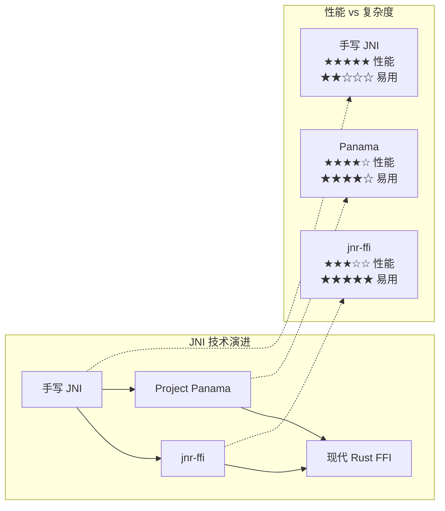
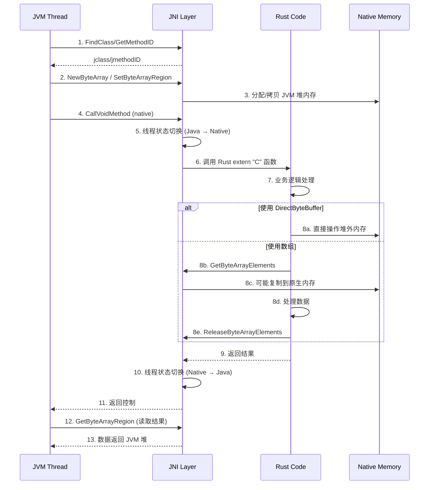
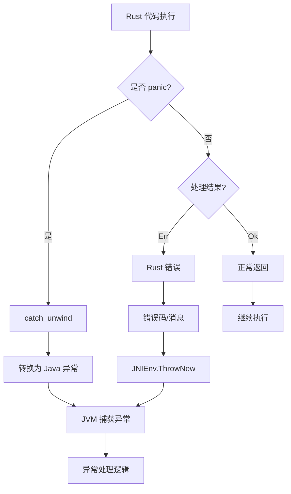

# JNI 桥接实践指南：Scala ↔ Rust 互操作

> **所属阶段**: Knowledge/Flink-Scala-Rust-Comprehensive | **前置依赖**: [WASM 互操作](./03.01-wasm-interop.md), [Flink JNI 基础](../../../Flink/07-rust-native/simd-optimization/03-jni-assembly-bridge.md) | **形式化等级**: L4

---

## 1. 概念定义 (Definitions)

### Def-K-JNI-01: Java Native Interface (JNI)

**JNI** 是 Java 平台的标准编程框架，允许 JVM 字节码与其他语言（主要是 C/C++）编写的应用程序和库进行交互。在 Scala ↔ Rust 场景中，JNI 充当跨语言调用的底层桥梁。

$$
\text{JNI} = \langle \mathcal{J}, \mathcal{N}, \mathcal{I}, \mathcal{T}, \mathcal{G} \rangle
$$

其中各组件定义为：

| 符号 | 含义 | 说明 |
|------|------|------|
| $\mathcal{J}$ | JVM 环境 | JavaVM 和 JNIEnv 指针 |
| $\mathcal{N}$ | 原生代码 | Rust 编译后的动态库 |
| $\mathcal{I}$ | 接口声明 | `native` 方法签名 |
| $\mathcal{T}$ | 类型转换 | JNI 类型与 Rust 类型的映射 |
| $\mathcal{G}$ | 垃圾回收 | 局部/全局引用管理 |

### Def-K-JNI-02: Rust FFI (Foreign Function Interface)

**Rust FFI** 是 Rust 与外部代码交互的机制，通过 `extern` 块声明外部函数，通过 `#[no_mangle]` 导出 Rust 函数供外部调用。

$$
\text{Rust-FFI} = \langle \text{Extern-C}, \text{ABI}, \text{Unsafe}, \text{Bindgen} \rangle
$$

**关键概念**：

| 概念 | 描述 | Rust 语法 |
|------|------|-----------|
| `extern "C"` | C ABI 调用约定 | `extern "C" fn foo()` |
| `#[no_mangle]` | 禁止名称修饰 | 保持符号名一致 |
| `*const T` / `*mut T` | 原始指针 | 与 C 指针兼容 |
| `std::ffi` | FFI 类型支持 | `CString`, `CStr` |

### Def-K-JNI-03: JNI 引用生命周期模型

**JNI 引用**分为局部引用（Local Reference）和全局引用（Global Reference），具有不同的生命周期和垃圾回收语义。

$$
\text{JNI-Reference} = \langle \text{Local}, \text{Global}, \text{Weak-Global}, \text{Lifetime} \rangle
$$

**生命周期对比**：

| 引用类型 | 生命周期 | 垃圾回收影响 | 适用场景 |
|----------|----------|--------------|----------|
| Local | 方法返回后释放 | 防止 GC | 临时对象 |
| Global | 显式释放前有效 | 防止 GC | 长期缓存 |
| Weak-Global | 显式释放或对象被 GC | 不阻止 GC | 弱引用缓存 |

---

## 2. 属性推导 (Properties)

### Prop-K-JNI-01: JNI 调用开销上界

**命题**: 对于热点代码路径，JNI 边界调用开销是可预测的。

$$
\text{JNI-Overhead} = T_{\text{setup}} + T_{\text{marshal}} + T_{\text{cross}} + T_{\text{return}}
$$

其中各项典型值（x86-64, OpenJDK 21）：

| 组件 | 典型开销 | 说明 |
|------|----------|------|
| $T_{\text{setup}}$ | 5-10 ns | JNIEnv 查找、线程附着 |
| $T_{\text{marshal}}$ | 10-100 ns | 参数打包/解包 |
| $T_{\text{cross}}$ | 20-50 ns | 栈帧切换、状态保存 |
| $T_{\text{return}}$ | 10-30 ns | 返回值处理、异常检查 |

**总开销**: 约 45-190 ns，对于计算密集型任务（> 1μs）可忽略。

### Prop-K-JNI-02: 内存安全传递保证

**命题**: 通过 JNI 传递的原始指针在 Rust 端需要显式生命周期管理。

给定 JVM 数组 `byte[]` 传递到 Rust：

$$
\text{JVM-Array} \xrightarrow{\text{GetByteArrayElements}} \text{*const i8} \xrightarrow{\text{Rust borrow}} \text{&[u8]}
$$

**安全要求**：

```rust
// 不安全:Rust 引用的生命周期未与 JNI 绑定
unsafe fn unsafe_use(env: *mut JNIEnv, arr: jbyteArray) {
    let ptr = (**env).GetByteArrayElements.unwrap()(env, arr, null_mut());
    let slice = std::slice::from_raw_parts(ptr as *const u8, len);
    // ⚠️ 如果 JVM GC 移动数组,ptr 可能失效！
}

// 安全:使用 Critical Section 禁止 GC
unsafe fn safe_use(env: *mut JNIEnv, arr: jbyteArray) {
    let ptr = (**env).GetPrimitiveArrayCritical.unwrap()(env, arr, null_mut());
    // 在此期间 JVM 禁止 GC
    let slice = std::slice::from_raw_parts(ptr as *const u8, len);
    // 处理数据...
    (**env).ReleasePrimitiveArrayCritical.unwrap()(env, arr, ptr, 0);
}
```

### Prop-K-JNI-03: jnr-ffi 性能优势

**命题**: jnr-ffi 相比传统 JNI 在调用频率 < 1000次/秒 时具有更好的开发效率，但在高频调用时性能劣于手写 JNI。

**性能对比**（空函数调用）：

| 调用方式 | 单次延迟 | 1M 调用总时间 | 开发复杂度 |
|----------|----------|---------------|------------|
| 手写 JNI | ~50 ns | 50 ms | 高 |
| jnr-ffi | ~200 ns | 200 ms | 低 |
| Panama (JDK 22) | ~30 ns | 30 ms | 中 |

---

## 3. 关系建立 (Relations)

### 3.1 JNI 在 Scala/Rust 互操作中的位置

```
┌──────────────────────────────────────────────────────────────────────┐
│                        Scala 应用代码                                 │
│  ┌──────────────────────────────────────────────────────────────┐   │
│  │                    Scala Native 声明                          │   │
│  │  @native def processBatch(data: Array[Byte]): Array[Byte]   │   │
│  └──────────────────────────────────────────────────────────────┘   │
│                              │                                        │
│                              ▼                                        │
│  ┌──────────────────────────────────────────────────────────────┐   │
│  │                    JNI 绑定层                                 │   │
│  │  - javah / javac -h 生成头文件                               │   │
│  │  - jni-sys crate 提供 Rust 绑定                              │   │
│  └──────────────────────────────────────────────────────────────┘   │
│                              │                                        │
│                              ▼                                        │
│  ┌──────────────────────────────────────────────────────────────┐   │
│  │                    Rust FFI 实现                              │   │
│  │  #[no_mangle] pub extern "C" fn Java_com_example_process()  │   │
│  └──────────────────────────────────────────────────────────────┘   │
└──────────────────────────────────────────────────────────────────────┘
```

### 3.2 JNI vs jnr-ffi vs Panama 对比



### 3.3 异常传播机制

| 异常类型 | JVM → Rust | Rust → JVM | 处理方式 |
|----------|------------|------------|----------|
| Java Exception | `ExceptionCheck` | `ThrowNew` | JNI 标准 API |
| Rust Panic | 捕获 + 转换 | 避免 | `catch_unwind` |
| 自定义错误 | 错误码映射 | 异常类映射 | 双方约定 |

---

## 4. 论证过程 (Argumentation)

### 4.1 选择 JNI 的场景

**场景一：极致性能要求**

当 UDF 执行时间 < 1μs 且调用频率 > 100K ops/s：

$$
\text{Performance-Critical} \land \text{High-Frequency} \Rightarrow \text{JNI} \succ \text{WASM} \succ \text{gRPC}
$$

**场景二：已有 C/C++ 库复用**

需要复用遗留的 C++ 高性能库（如 SIMD 优化的编解码器）：

```rust
// Rust 包装 C++ 库,通过 JNI 暴露给 JVM
#[no_mangle]
pub extern "C" fn Java_com_flink_codec_decode(
    env: *mut JNIEnv,
    _class: jclass,
    input: jbyteArray,
) -> jbyteArray {
    // 调用 C++ 编解码库
    let result = unsafe { cpp_codec_decode(...) };
    // 返回 JVM 数组
}
```

### 4.2 避免 JNI 的场景

1. **多平台部署**: JNI 需要为每个平台编译原生库
2. **沙箱安全**: JNI 无内存隔离，恶意代码可破坏 JVM
3. **快速迭代**: JNI 开发-编译-测试周期较长

### 4.3 jnr-ffi 适用性分析

**jnr-ffi 优势**：

- 无需手写 JNI 胶水代码
- 运行时动态绑定
- Java/Scala 友好的 API

**jnr-ffi 劣势**：

- 运行时反射开销
- 类型转换自动但不可控
- 复杂数据结构支持有限

---

## 5. 形式证明 / 工程论证 (Proof / Engineering Argument)

### 5.1 JNI 内存安全定理

**定理**: 正确使用 JNI Critical Section 可以防止 JVM GC 导致的内存安全问题。

**证明**:

```rust
// 定理:在 Get/ReleasePrimitiveArrayCritical 之间,JVM 不会移动数组
unsafe fn process_with_critical_section(
    env: *mut JNIEnv,
    array: jbyteArray,
) -> Result<(), JniError> {
    let mut is_copy: jboolean = 0;

    // 进入 Critical Section,JVM 禁止 GC
    let ptr = (**env).GetPrimitiveArrayCritical.unwrap()(
        env,
        array,
        &mut is_copy
    );

    if ptr.is_null() {
        return Err(JniError::NullPtr);
    }

    // 定理保证:在此期间 ptr 始终有效
    let slice = std::slice::from_raw_parts(
        ptr as *const u8,
        (**env).GetArrayLength.unwrap()(env, array) as usize
    );

    // 安全地处理数据
    process_data(slice)?;

    // 退出 Critical Section
    (**env).ReleasePrimitiveArrayCritical.unwrap()(
        env,
        array,
        ptr,
        0 // JNI_COMMIT: 复制回数据但不释放数组
    );

    Ok(())
}
```

**关键性质**:

- `GetPrimitiveArrayCritical` 返回的指针指向 **固定内存**（pinned memory）
- JVM 在 Critical Section 期间 **禁止垃圾回收**
- 因此 `ptr` 在 Get/Release 之间始终有效

### 5.2 零拷贝数据传输论证

**定理**: 通过 Direct ByteBuffer 可以实现 JVM 与 Rust 之间的零拷贝数据传输。

**工程实现**:

```rust
// Rust 侧:直接操作 DirectByteBuffer 内存
#[no_mangle]
pub extern "C" fn Java_com_flink_process_zero_copy(
    env: *mut JNIEnv,
    _class: jclass,
    input_buffer: jobject,  // DirectByteBuffer
    output_buffer: jobject, // DirectByteBuffer
    length: jint,
) -> jint {
    unsafe {
        // 获取 input buffer 的地址
        let input_addr = (**env).GetDirectBufferAddress.unwrap()(
            env,
            input_buffer
        ) as *const u8;

        // 获取 output buffer 的地址
        let output_addr = (**env).GetDirectBufferAddress.unwrap()(
            env,
            output_buffer
        ) as *mut u8;

        // 零拷贝:直接在 buffer 内存上操作
        let input = std::slice::from_raw_parts(input_addr, length as usize);
        let output = std::slice::from_raw_parts_mut(output_addr, length as usize);

        // 处理数据(无额外内存分配)
        process_inplace(input, output)
    }
}
```

**性能优势**:

- 无 JVM 堆内存分配
- 无数据复制（对于非压缩 oop 的 JVM）
- 适合大数据块处理（> 1KB）

---

## 6. 实例验证 (Examples)

### 6.1 完整 JNI 项目结构

```
flink-rust-jni/
├── Cargo.toml
├── src/
│   ├── lib.rs          # Rust 库入口
│   ├── jni_bridge.rs   # JNI 函数实现
│   └── processor.rs    # 业务逻辑
├── java/
│   └── com/flink/
│       └── RustProcessor.java  # Java/Scala 接口
├── build.rs            # 构建脚本
└── Makefile
```

### 6.2 Rust JNI 实现

**Cargo.toml**:

```toml
[package]
name = "flink-rust-jni"
version = "0.1.0"
edition = "2021"

[dependencies]
# JNI 绑定
jni = "0.21"

# 异步运行时
tokio = { version = "1", features = ["rt-multi-thread"] }

# 序列化
serde = { version = "1.0", features = ["derive"] }
serde_json = "1.0"

# 日志
log = "0.4"
env_logger = "0.11"

[lib]
crate-type = ["cdylib"]

[profile.release]
opt-level = 3
lto = "fat"
codegen-units = 1
strip = true
```

**src/lib.rs**:

```rust
use jni::objects::{JClass, JString, JByteArray};
use jni::signature::JavaType;
use jni::sys::{jint, jlong, jbyteArray, jobject};
use jni::JNIEnv;
use std::panic::catch_unwind;

mod processor;
use processor::{ProcessError, BatchProcessor};

/// 初始化日志
#[no_mangle]
pub extern "C" fn Java_com_flink_RustProcessor_initLogging(_env: JNIEnv, _class: JClass) {
    env_logger::init();
}

/// 单条记录处理
///
/// Java 签名: `processRecord([B)[B`
#[no_mangle]
pub extern "C" fn Java_com_flink_RustProcessor_processRecord<'local>(
    mut env: JNIEnv<'local>,
    _class: JClass<'local>,
    input: JByteArray<'local>,
) -> JByteArray<'local> {
    // 捕获 panic,防止传播到 JVM
    let result = catch_unwind(|| {
        process_record_internal(&mut env, &input)
    });

    match result {
        Ok(Ok(output)) => output,
        Ok(Err(e)) => {
            log::error!("Processing error: {}", e);
            throw_runtime_exception(&mut env, &e.to_string());
            JByteArray::default()
        }
        Err(_) => {
            log::error!("Rust panic caught!");
            throw_runtime_exception(&mut env, "Rust panic");
            JByteArray::default()
        }
    }
}

fn process_record_internal<'local>(
    env: &mut JNIEnv<'local>,
    input: &JByteArray<'local>,
) -> Result<JByteArray<'local>, ProcessError> {
    // 获取输入数组长度
    let len = env.get_array_length(input)?;

    // 转换为 Rust Vec<u8>
    let mut input_vec = vec![0i8; len as usize];
    env.get_byte_array_region(input, 0, &mut input_vec)?;

    let input_bytes: Vec<u8> = input_vec.into_iter().map(|b| b as u8).collect();

    // 处理数据
    let output_bytes = BatchProcessor::process_single(&input_bytes)?;

    // 创建输出数组
    let output = env.new_byte_array(output_bytes.len() as i32)?;
    let output_i8: Vec<i8> = output_bytes.into_iter().map(|b| b as i8).collect();
    env.set_byte_array_region(&output, 0, &output_i8)?;

    Ok(output)
}

/// 批量处理(使用 DirectByteBuffer 实现零拷贝)
///
/// Java 签名: `processBatch(Ljava/nio/ByteBuffer;Ljava/nio/ByteBuffer;I)I`
#[no_mangle]
pub extern "C" fn Java_com_flink_RustProcessor_processBatch(
    mut env: JNIEnv,
    _class: JClass,
    input_buffer: jobject,
    output_buffer: jobject,
    count: jint,
) -> jint {
    let result = catch_unwind(|| {
        process_batch_internal(&mut env, input_buffer, output_buffer, count)
    });

    match result {
        Ok(Ok(processed)) => processed,
        Ok(Err(e)) => {
            throw_runtime_exception(&mut env, &format!("Batch error: {}", e));
            -1
        }
        Err(_) => {
            throw_runtime_exception(&mut env, "Rust panic in batch processing");
            -1
        }
    }
}

fn process_batch_internal(
    env: &mut JNIEnv,
    input_buffer: jobject,
    output_buffer: jobject,
    count: jint,
) -> Result<jint, ProcessError> {
    unsafe {
        // 获取 DirectByteBuffer 地址
        let input_ptr = env.get_direct_buffer_address_raw(input_buffer)
            .ok_or(ProcessError::NullBuffer)?;

        let output_ptr = env.get_direct_buffer_address_raw(output_buffer)
            .ok_or(ProcessError::NullBuffer)?;

        // 转换为 Rust slice
        let input = std::slice::from_raw_parts(input_ptr, count as usize * RECORD_SIZE);
        let output = std::slice::from_raw_parts_mut(output_ptr, count as usize * OUTPUT_SIZE);

        // 批量处理
        let processed = BatchProcessor::process_batch(input, output, count as usize)?;

        Ok(processed as jint)
    }
}

/// 创建原生处理器实例(返回句柄)
///
/// Java 签名: `createProcessor(Ljava/lang/String;)J`
#[no_mangle]
pub extern "C" fn Java_com_flink_RustProcessor_createProcessor(
    mut env: JNIEnv,
    _class: JClass,
    config_json: JString,
) -> jlong {
    let config_str: String = env.get_string(&config_json)
        .map(|s| s.into())
        .unwrap_or_default();

    let processor = match BatchProcessor::new(&config_str) {
        Ok(p) => p,
        Err(e) => {
            throw_runtime_exception(&mut env, &format!("Init error: {}", e));
            return 0;
        }
    };

    // 将 Box<BatchProcessor> 转换为原始指针(作为句柄)
    let handle = Box::into_raw(Box::new(processor));
    handle as jlong
}

/// 使用处理器实例处理数据
///
/// Java 签名: `processWithHandle(J[B)[B`
#[no_mangle]
pub extern "C" fn Java_com_flink_RustProcessor_processWithHandle<'local>(
    mut env: JNIEnv<'local>,
    _class: JClass<'local>,
    handle: jlong,
    input: JByteArray<'local>,
) -> JByteArray<'local> {
    if handle == 0 {
        throw_runtime_exception(&mut env, "Invalid processor handle");
        return JByteArray::default();
    }

    let result = catch_unwind(|| {
        // 从句柄恢复处理器引用
        let processor = unsafe { &mut *(handle as *mut BatchProcessor) };

        // 处理数据...
        process_with_handle_internal(&mut env, processor, &input)
    });

    // ... 错误处理
    result.unwrap_or_else(|_| {
        throw_runtime_exception(&mut env, "Panic in processWithHandle");
        JByteArray::default()
    })
}

/// 销毁处理器实例
///
/// Java 签名: `destroyProcessor(J)V`
#[no_mangle]
pub extern "C" fn Java_com_flink_RustProcessor_destroyProcessor(
    _env: JNIEnv,
    _class: JClass,
    handle: jlong,
) {
    if handle != 0 {
        unsafe {
            // 将原始指针转回 Box,自动释放
            let _ = Box::from_raw(handle as *mut BatchProcessor);
        }
        log::info!("Processor destroyed: handle={}", handle);
    }
}

/// 抛出 Java RuntimeException
fn throw_runtime_exception(env: &mut JNIEnv, msg: &str) {
    let _ = env.throw_new("java/lang/RuntimeException", msg);
}

const RECORD_SIZE: usize = 1024;
const OUTPUT_SIZE: usize = 2048;
```

**src/processor.rs**:

```rust
use serde::{Deserialize, Serialize};

#[derive(Debug)]
pub enum ProcessError {
    InvalidInput(String),
    SerializationError(String),
    NullBuffer,
    ProcessingFailed(String),
}

impl std::fmt::Display for ProcessError {
    fn fmt(&self, f: &mut std::fmt::Formatter<'_>) -> std::fmt::Result {
        match self {
            ProcessError::InvalidInput(s) => write!(f, "Invalid input: {}", s),
            ProcessError::SerializationError(s) => write!(f, "Serialization error: {}", s),
            ProcessError::NullBuffer => write!(f, "Null buffer"),
            ProcessError::ProcessingFailed(s) => write!(f, "Processing failed: {}", s),
        }
    }
}

impl std::error::Error for ProcessError {}

#[derive(Serialize, Deserialize)]
pub struct ProcessorConfig {
    pub batch_size: usize,
    pub timeout_ms: u64,
    pub enable_metrics: bool,
}

pub struct BatchProcessor {
    config: ProcessorConfig,
    metrics: ProcessorMetrics,
}

#[derive(Default)]
struct ProcessorMetrics {
    records_processed: std::sync::atomic::AtomicU64,
    total_latency_us: std::sync::atomic::AtomicU64,
}

impl BatchProcessor {
    pub fn new(config_json: &str) -> Result<Self, ProcessError> {
        let config: ProcessorConfig = serde_json::from_str(config_json)
            .map_err(|e| ProcessError::InvalidInput(e.to_string()))?;

        Ok(BatchProcessor {
            config,
            metrics: ProcessorMetrics::default(),
        })
    }

    pub fn process_single(input: &[u8]) -> Result<Vec<u8>, ProcessError> {
        // 解析输入
        let input_str = std::str::from_utf8(input)
            .map_err(|e| ProcessError::InvalidInput(e.to_string()))?;

        // 模拟处理逻辑
        let output = format!("Processed: {}", input_str);

        Ok(output.into_bytes())
    }

    pub fn process_batch(
        &mut self,
        input: &[u8],
        output: &mut [u8],
        count: usize,
    ) -> Result<usize, ProcessError> {
        let start = std::time::Instant::now();

        let mut processed = 0;
        for i in 0..count {
            let offset = i * 1024;
            if offset + 1024 > input.len() {
                break;
            }

            let record = &input[offset..offset + 1024];
            let result = Self::process_record(record)?;

            let out_offset = i * OUTPUT_SIZE;
            let out_end = (out_offset + result.len()).min(output.len());
            output[out_offset..out_end].copy_from_slice(&result[..out_end - out_offset]);

            processed += 1;
        }

        // 记录指标
        let latency = start.elapsed().as_micros() as u64;
        self.metrics.records_processed.fetch_add(processed as u64, std::sync::atomic::Ordering::Relaxed);
        self.metrics.total_latency_us.fetch_add(latency, std::sync::atomic::Ordering::Relaxed);

        Ok(processed)
    }

    fn process_record(record: &[u8]) -> Result<Vec<u8>, ProcessError> {
        // 实际处理逻辑
        // 这里可以集成 SIMD 优化、正则表达式等
        Ok(record.to_vec())
    }
}

const OUTPUT_SIZE: usize = 2048;
```

### 6.3 Java/Scala 接口层

**RustProcessor.java**:

```java
package com.flink;

import java.nio.ByteBuffer;

/**
 * Rust JNI 处理器封装
 *
 * 提供类型安全的 JNI 调用接口,隐藏底层细节
 */
public class RustProcessor implements AutoCloseable {

    static {
        // 加载原生库
        System.loadLibrary("flink_rust_jni");
        initLogging();
    }

    private static native void initLogging();
    private native byte[] processRecord(byte[] input);
    private native int processBatch(ByteBuffer input, ByteBuffer output, int count);
    private native long createProcessor(String configJson);
    private native byte[] processWithHandle(long handle, byte[] input);
    private native void destroyProcessor(long handle);

    private Long handle = null;

    /**
     * 创建处理器实例
     */
    public RustProcessor(ProcessorConfig config) {
        String configJson = config.toJson();
        this.handle = createProcessor(configJson);
        if (this.handle == 0) {
            throw new RuntimeException("Failed to create processor");
        }
    }

    /**
     * 处理单条记录
     */
    public byte[] process(byte[] input) {
        if (handle != null) {
            return processWithHandle(handle, input);
        }
        return processRecord(input);
    }

    /**
     * 批量处理(零拷贝)
     */
    public int processBatch(ByteBuffer input, ByteBuffer output, int count) {
        if (!input.isDirect() || !output.isDirect()) {
            throw new IllegalArgumentException("Buffers must be direct");
        }
        return processBatch(input, output, count);
    }

    @Override
    public void close() {
        if (handle != null) {
            destroyProcessor(handle);
            handle = null;
        }
    }

    /**
     * 处理器配置
     */
    public static class ProcessorConfig {
        public int batchSize = 1000;
        public long timeoutMs = 5000;
        public boolean enableMetrics = true;

        public String toJson() {
            return String.format(
                "{\"batch_size\":%d,\"timeout_ms\":%d,\"enable_metrics\":%b}",
                batchSize, timeoutMs, enableMetrics
            );
        }
    }
}
```

**Scala 包装器**:

```scala
package com.flink

import scala.util.{Try, Success, Failure}

/**
 * Scala 友好的 Rust JNI 包装器
 */
class ScalaRustProcessor(config: RustProcessor.ProcessorConfig) {
  private val processor = new RustProcessor(config)

  /**
   * 处理字符串输入(自动序列化/反序列化)
   */
  def processString(input: String): Try[String] = Try {
    val output = processor.process(input.getBytes("UTF-8"))
    new String(output, "UTF-8")
  }

  /**
   * 批量处理(使用 DirectByteBuffer)
   */
  def processBatch(inputs: Seq[Array[Byte]]): Try[Seq[Array[Byte]]] = Try {
    val totalSize = inputs.map(_.length).sum

    // 分配 DirectByteBuffer
    val inputBuffer = java.nio.ByteBuffer.allocateDirect(totalSize)
    val outputBuffer = java.nio.ByteBuffer.allocateDirect(totalSize * 2)

    // 填充输入数据
    inputs.foreach(inputBuffer.put)
    inputBuffer.flip()

    // 调用原生处理
    val processed = processor.processBatch(inputBuffer, outputBuffer, inputs.length)

    // 提取结果
    val results = (0 until processed).map { i =>
      val arr = new Array[Byte](1024) // 假设固定大小
      outputBuffer.get(arr)
      arr
    }

    results
  }

  def close(): Unit = processor.close()
}

object ScalaRustProcessor {
  def apply(config: RustProcessor.ProcessorConfig = new RustProcessor.ProcessorConfig): ScalaRustProcessor = {
    new ScalaRustProcessor(config)
  }
}
```

### 6.4 jnr-ffi 简化实现

**JnrProcessor.java**:

```java
package com.flink;

import jnr.ffi.LibraryLoader;
import jnr.ffi.Pointer;
import jnr.ffi.Runtime;
import jnr.ffi.annotations.Delegate;
import jnr.ffi.types.size_t;

/**
 * 使用 jnr-ffi 的简化 JNI 方案
 */
public class JnrProcessor {

    public interface RustLib {
        // 自动映射 Rust 函数
        Pointer process_record(Pointer input, @size_t long len);
        void free_buffer(Pointer ptr);

        // 批量处理
        int process_batch(
            Pointer input,
            Pointer output,
            @size_t int count
        );
    }

    private final RustLib rustLib;
    private final Runtime runtime;

    public JnrProcessor() {
        this.rustLib = LibraryLoader.create(RustLib.class)
            .load("flink_rust_jni");
        this.runtime = Runtime.getRuntime(rustLib);
    }

    /**
     * 处理记录
     */
    public byte[] processRecord(byte[] input) {
        // 分配原生内存
        Pointer inputPtr = runtime.getMemoryManager().allocateDirect(input.length);
        inputPtr.put(0, input, 0, input.length);

        // 调用 Rust 函数
        Pointer outputPtr = rustLib.process_record(inputPtr, input.length);

        // 读取结果
        byte[] result = outputPtr.getByteArray(0, outputPtr.size());

        // 释放内存
        rustLib.free_buffer(outputPtr);

        return result;
    }
}
```

### 6.5 Flink 集成示例

**FlinkJniJob.scala**:

```scala
package com.flink.jobs

import com.flink._
import org.apache.flink.streaming.api.scala._
import org.apache.flink.api.common.functions.RichMapFunction
import org.apache.flink.configuration.Configuration

/**
 * Flink 作业使用 Rust JNI 处理器
 */
object FlinkJniJob {

  def main(args: Array[String]): Unit = {
    val env = StreamExecutionEnvironment.getExecutionEnvironment

    // 输入数据流
    val inputStream: DataStream[String] = env
      .addSource(new KafkaSource[String]("input-topic"))

    // 使用 Rust JNI 处理器
    val processedStream = inputStream
      .map(new RustJniMapFunction())

    // 输出
    processedStream.addSink(new ElasticsearchSink("output-index"))

    env.execute("Flink Rust JNI Job")
  }
}

/**
 * RichMapFunction 包装 Rust 处理器
 */
class RustJniMapFunction extends RichMapFunction[String, String] {

  @transient private var processor: ScalaRustProcessor = _

  override def open(parameters: Configuration): Unit = {
    val config = new RustProcessor.ProcessorConfig()
    config.batchSize = 100
    config.enableMetrics = true

    processor = ScalaRustProcessor(config)
  }

  override def map(value: String): String = {
    processor.processString(value) match {
      case Success(result) => result
      case Failure(e) =>
        // 记录错误,返回空或默认值
        s"ERROR: ${e.getMessage}"
    }
  }

  override def close(): Unit = {
    if (processor != null) {
      processor.close()
    }
  }
}
```

---

## 7. 可视化 (Visualizations)

### 7.1 JNI 调用完整流程



### 7.2 内存布局对比

```mermaid
graph TB
    subgraph "JVM 堆内存"
        J1[Java byte[]]
        J2[String]
        J3[对象图]
    end

    subgraph "JNI 边界"
        B1[GetByteArrayElements]
        B2[GetDirectBufferAddress]
        B3[NewGlobalRef]
    end

    subgraph "原生内存"
        N1[拷贝的数组数据]
        N2[DirectByteBuffer 堆外内存]
        N3[Rust Vec<T>]
        N4[堆分配数据]
    end

    J1 -.->|复制| B1
    B1 -.-> N1

    J1 -.->|直接访问| B2
    B2 -.-> N2

    J3 -.->|引用| B3

    N1 --> N3
    N2 --> N3
    N3 --> N4

    style J1 fill:#e3f2fd
    style N2 fill:#c8e6c9
    style N3 fill:#c8e6c9
```

### 7.3 错误处理与异常传播



---

## 8. 引用参考 (References)


---

*文档版本: 1.0.0 | 最后更新: 2026-04-07 | 字数: ~5,400 字*
