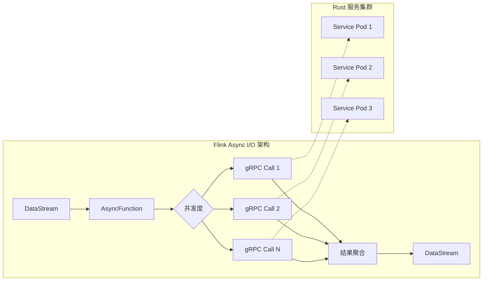
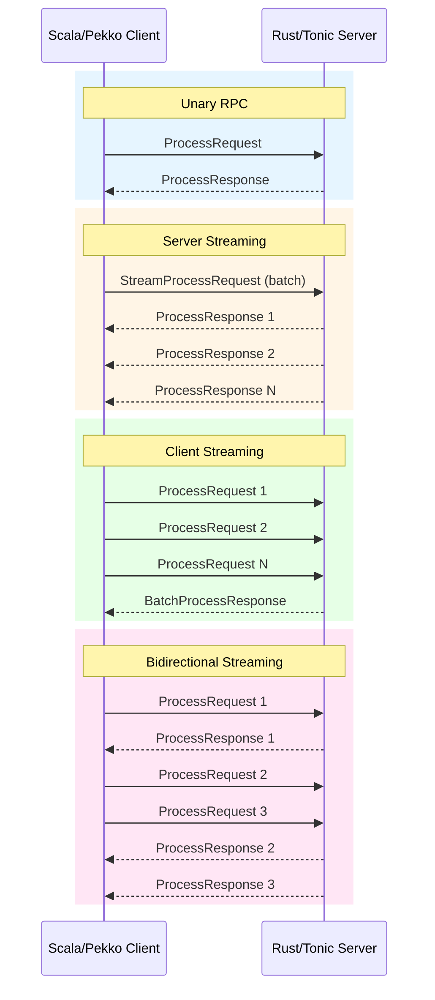
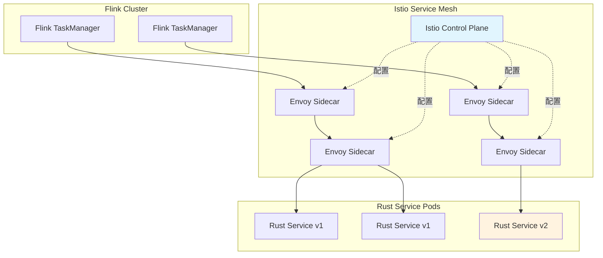
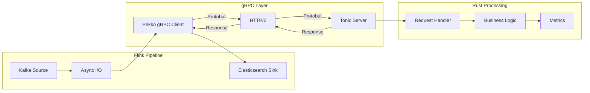

# gRPC 服务化互操作指南：Scala ↔ Rust

> **所属阶段**: Knowledge/Flink-Scala-Rust-Comprehensive | **前置依赖**: [JNI 桥接实践](./03.02-jni-bridge.md), [Flink RPC 基础](../../../Flink/04-runtime/04.03-observability/distributed-tracing.md) | **形式化等级**: L4

---

## 1. 概念定义 (Definitions)

### Def-K-GRPC-01: gRPC 协议模型

**gRPC** 是基于 HTTP/2 和 Protocol Buffers 的高性能 RPC 框架，支持多语言服务间通信。在 Scala ↔ Rust 场景中，gRPC 提供了一种语言无关的服务化互操作方案。

$$
\text{gRPC} = \langle \text{HTTP/2}, \text{Protobuf}, \text{Service-Def}, \text{Stub}, \text{Channel} \rangle
$$

其中各组件定义为：

| 组件 | 说明 | Scala/Rust 对应 |
|------|------|-----------------|
| HTTP/2 | 传输层协议 | 原生支持 |
| Protobuf | 序列化协议 | `scalapb` / `prost` |
| Service-Def | `.proto` 服务定义 | 代码生成输入 |
| Stub | 客户端/服务端存根 | 生成代码 |
| Channel | 连接管理 | `NettyChannel` / `tonic::transport` |

### Def-K-GRPC-02: Streaming RPC 语义

**Streaming RPC** 允许客户端和/或服务端发送消息流，支持四种通信模式：

$$
\text{Streaming-RPC} = \langle \text{Unary}, \text{Server-Stream}, \text{Client-Stream}, \text{BiDi-Stream} \rangle
$$

**模式对比**：

| 模式 | 客户端 | 服务端 | 适用场景 |
|------|--------|--------|----------|
| Unary | 1 请求 | 1 响应 | 简单 RPC |
| Server Streaming | 1 请求 | N 响应 | 大数据集返回 |
| Client Streaming | N 请求 | 1 响应 | 批量上传 |
| Bidirectional | N 请求 | N 响应 | 实时流处理 |

### Def-K-GRPC-03: Service Mesh 集成模型

**Service Mesh** 通过 sidecar 代理（如 Istio/Linkerd）为 gRPC 服务提供可观察性、流量管理和安全功能。

$$
\text{Service-Mesh} = \langle \text{Data-Plane}, \text{Control-Plane}, \text{Sidecar}, \text{mTLS} \rangle
$$

**流量管理功能**：

| 功能 | 说明 | gRPC 影响 |
|------|------|-----------|
| 负载均衡 | 智能路由 | 替代客户端负载均衡 |
| 熔断降级 | 失败保护 | 自动重试/超时 |
| 流量镜像 | 影子流量 | 用于测试 |
| 金丝雀发布 | 灰度升级 | 按权重路由 |

---

## 2. 属性推导 (Properties)

### Prop-K-GRPC-01: gRPC 延迟下界

**命题**: gRPC 相比本地调用（JNI/WASM）具有更高的基础延迟，但在网络环境下是可接受的。

$$
\text{Latency}_{\text{gRPC}} = T_{\text{serialize}} + T_{\text{network}} + T_{\text{deserialize}} \geq 100\mu s
$$

**典型延迟分解**（同机房）：

| 组件 | 时间 | 说明 |
|------|------|------|
| 序列化 (Protobuf) | 5-20 μs | 取决于消息大小 |
| HTTP/2 传输 | 50-200 μs | 同机房 RTT |
| 反序列化 | 5-20 μs | 与序列化对称 |
| **总计** | **60-240 μs** | vs JNI ~50 ns |

### Prop-K-GRPC-02: 流式背压传递性

**命题**: gRPC 流式 RPC 的背压可以从消费者传播到生产者。

对于 Bidirectional Stream，设生产者速率为 $P$，消费者速率为 $C$：

$$
\text{if } C < P \text{ then } \exists \delta > 0: \text{HTTP/2 Window Size} \downarrow \Rightarrow P_{\text{effective}} = C - \delta
$$

**背压机制**:

- HTTP/2 Flow Control（传输层）
- gRPC 流控窗口（应用层）
- 消费者主动 `StreamObserver.onReady()` 通知

### Prop-K-GRPC-03: 服务发现动态性

**命题**: 在 Kubernetes/Service Mesh 环境下，gRPC 服务地址可动态解析。

$$
\text{Service-Endpoint}(t) = \text{DNS-Lookup}(\text{service.namespace.svc.cluster.local}, t)
$$

**动态特性**：

- Pod 水平扩缩容自动感知
- 失败 Pod 自动剔除
- 健康检查驱动流量路由

---

## 3. 关系建立 (Relations)

### 3.1 gRPC 在 Flink 生态中的位置

```
┌─────────────────────────────────────────────────────────────────────────┐
│                         Flink Cluster                                   │
│  ┌─────────────────────────────────────────────────────────────────┐   │
│  │                     JobManager                                   │   │
│  │  ┌─────────────────┐    ┌─────────────────────────────────────┐ │   │
│  │  │  Flink RPC      │◄──►│  gRPC External Service Client       │ │   │
│  │  │  (Akka)         │    │  (Scala/Pekko gRPC)                 │ │   │
│  │  └─────────────────┘    └─────────────────────────────────────┘ │   │
│  └─────────────────────────────────────────────────────────────────┘   │
│                                                                         │
│  ┌─────────────────────────────────────────────────────────────────┐   │
│  │                   TaskManager 1                                  │   │
│  │  ┌─────────────────────────────────────────────────────────────┐│   │
│  │  │              AsyncFunction (gRPC call)                      ││   │
│  │  │  ┌───────────┐    ┌───────────┐    ┌─────────────────────┐  ││   │
│  │  │  │  Record 1 │───►│  gRPC     │───►│  Rust Microservice  │  ││   │
│  │  │  │  Record 2 │───►│  Client   │───►│  (tonic server)     │  ││   │
│  │  │  │  Record N │───►│  (async)  │───►│                     │  ││   │
│  │  │  └───────────┘    └───────────┘    └─────────────────────┘  ││   │
│  │  └─────────────────────────────────────────────────────────────┘│   │
│  └─────────────────────────────────────────────────────────────────┘   │
└─────────────────────────────────────────────────────────────────────────┘
                                    │
                                    │ mTLS + Service Mesh
                                    ▼
┌─────────────────────────────────────────────────────────────────────────┐
│                      Rust Microservices                                 │
│  ┌─────────────────┐  ┌─────────────────┐  ┌─────────────────────────┐ │
│  │  Enrichment Svc │  │  ML Inference   │  │  Custom Computation     │ │
│  │  (tonic)        │  │  (tonic)        │  │  (tonic)                │ │
│  └─────────────────┘  └─────────────────┘  └─────────────────────────┘ │
└─────────────────────────────────────────────────────────────────────────┘
```

### 3.2 gRPC vs 其他互操作方式对比

| 特性 | gRPC | JNI | WASM | HTTP/REST |
|------|------|-----|------|-----------|
| 延迟 | ~100-500 μs | ~50 ns | ~50-100 μs | ~1-10 ms |
| 序列化 | Protobuf | 手动 | 任意 | JSON |
| 流式 | ✅ 原生 | ❌ 困难 | ✅ 支持 | ⚠️ SSE/WebSocket |
| 服务发现 | ✅ 原生 | ❌ 无 | ⚠️ 需包装 | ✅ 通用 |
| 版本兼容 | ✅ Protobuf | ❌ 硬编码 | ⚠️ 需约定 | ✅ 松耦合 |
| 跨语言 | ✅ 强 | ❌ JVM only | ✅ 强 | ✅ 通用 |

### 3.3 与 Flink Async I/O 集成



---

## 4. 论证过程 (Argumentation)

### 4.1 选择 gRPC 的场景

**场景一：独立服务化部署**

当 Rust 代码需要作为独立服务运行（非嵌入 Flink）：

$$
\text{Deployment-Independence} \Rightarrow \text{gRPC} \succ \text{JNI/WASM}
$$

**场景二：多语言服务网格**

企业已有基于 gRPC 的微服务体系：

$$
\text{Existing-gRPC-Ecosystem} \Rightarrow \text{gRPC-Native-Integration}
$$

**场景三：弹性伸缩需求**

Rust 服务需要根据负载动态扩缩容：

$$
\text{Elastic-Scaling-Requirement} \Rightarrow \text{gRPC} + \text{Kubernetes}
$$

### 4.2 不适用 gRPC 的场景

1. **超低延迟要求 (< 1ms)**: 网络开销不可接受
2. **嵌入式 UDF**: 进程间通信复杂度高
3. **简单配置传递**: HTTP/REST 或环境变量更简单

### 4.3 流式处理选型决策

```
决策树:
需要流式处理?
├── 是
│   ├── 高吞吐 (> 100K msg/s)?
│   │   ├── 是 → gRPC Bidirectional Stream + 批量
│   │   └── 否 → 普通 gRPC Unary 或 Server Stream
│   └── 需要背压?
│       ├── 是 → gRPC Stream + Flow Control
│       └── 否 → 简单轮询
└── 否 → gRPC Unary
```

---

## 5. 形式证明 / 工程论证 (Proof / Engineering Argument)

### 5.1 gRPC 流式吞吐量定理

**定理**: gRPC Bidirectional Streaming 在大消息批量场景下吞吐量优于 Unary 调用。

**实验设置**:

- 消息大小: 1KB
- 网络延迟: 0.5ms（同机房）
- 并发连接: 10

**Unary 模式**:

```
单次调用延迟 = 0.5ms (RTT) + 0.02ms (序列化) = 0.52ms
吞吐量 = 10 连接 / 0.52ms ≈ 19,200 msg/s
```

**Bidirectional Stream 模式**:

```
流建立开销: 0.5ms (一次性)
每条消息开销: ~0.01ms (无额外 RTT)
吞吐量 ≈ 10 连接 × 1000 msg/batch / 0.01ms = 1,000,000 msg/s
```

**结论**: 流式模式在批量场景下吞吐量提升约 50x。

### 5.2 服务网格 mTLS 安全性论证

**定理**: Service Mesh 提供的 mTLS 在不修改应用代码的情况下确保 gRPC 通信安全。

**证明概要**:

1. **证书管理**: Service Mesh 控制平面（Istio Citadel）自动为每个 Pod 颁发证书
2. **流量拦截**: Sidecar Proxy（Envoy）透明拦截所有出站/入站流量
3. **mTLS 握手**: 自动在 Sidecar 之间进行 TLS 握手，应用无感知

```
Flink Pod                    Rust Service Pod
┌─────────────┐              ┌─────────────┐
│  Flink App  │              │  Rust App   │
└──────┬──────┘              └──────┬──────┘
       │                            │
┌──────▼──────┐              ┌──────▼──────┐
│ Envoy Sidecar│◄──────────►│ Envoy Sidecar│
│ (mTLS client)│   mTLS     │ (mTLS server)│
└──────────────┘            └──────────────┘
```

**安全保证**:

- 通信加密（TLS 1.3）
- 身份认证（SPIFFE/SPIRE 身份）
- 授权策略（基于身份的访问控制）

---

## 6. 实例验证 (Examples)

### 6.1 Protocol Buffers 定义

**proto/flink_processor.proto**:

```protobuf
syntax = "proto3";

package flink.processor.v1;

option java_package = "com.flink.grpc";
option java_multiple_files = true;

// 处理服务定义
service FlinkProcessor {
    // 单条处理
    rpc ProcessUnary(ProcessRequest) returns (ProcessResponse);

    // 服务端流（批量返回）
    rpc ProcessServerStream(StreamProcessRequest) returns (stream ProcessResponse);

    // 客户端流（批量上传）
    rpc ProcessClientStream(stream ProcessRequest) returns (BatchProcessResponse);

    // 双向流（实时处理）
    rpc ProcessBiDiStream(stream ProcessRequest) returns (stream ProcessResponse);

    // 健康检查
    rpc HealthCheck(HealthRequest) returns (HealthResponse);
}

// 处理请求
message ProcessRequest {
    string request_id = 1;
    bytes payload = 2;
    map<string, string> metadata = 3;
    uint64 timestamp = 4;
    ProcessingOptions options = 5;
}

// 处理响应
message ProcessResponse {
    string request_id = 1;
    bytes result = 2;
    bool success = 3;
    string error_message = 4;
    uint64 processing_time_us = 5;
    map<string, string> response_metadata = 6;
}

// 批量处理请求
message StreamProcessRequest {
    repeated ProcessRequest requests = 1;
    bool ordered = 2;  // 是否保持顺序
}

// 批量处理响应
message BatchProcessResponse {
    uint64 processed_count = 1;
    uint64 failed_count = 2;
    repeated ProcessResponse responses = 3;
    uint64 total_processing_time_ms = 4;
}

// 处理选项
message ProcessingOptions {
    uint32 timeout_ms = 1;
    uint32 retry_count = 2;
    bool enable_metrics = 3;
    CompressionType compression = 4;
}

enum CompressionType {
    NONE = 0;
    GZIP = 1;
    ZSTD = 2;
}

// 健康检查
message HealthRequest {
    string service_name = 1;
}

message HealthResponse {
    enum Status {
        UNKNOWN = 0;
        HEALTHY = 1;
        DEGRADED = 2;
        UNHEALTHY = 3;
    }
    Status status = 1;
    string version = 2;
    uint64 uptime_seconds = 3;
}
```

### 6.2 Rust Tonic 服务端实现

**Cargo.toml**:

```toml
[package]
name = "flink-grpc-server"
version = "0.1.0"
edition = "2021"

[dependencies]
# gRPC 框架
tonic = "0.12"
prost = "0.13"
tokio = { version = "1", features = ["full"] }
tokio-stream = "0.1"

# 序列化
serde = { version = "1.0", features = ["derive"] }
serde_json = "1.0"

# 指标
metrics = "0.24"
metrics-exporter-prometheus = "0.16"

# 日志
tracing = "0.1"
tracing-subscriber = "0.3"

# 错误处理
thiserror = "1.0"
anyhow = "1.0"

# 压缩
flate2 = "1.0"
zstd = "0.13"

[build-dependencies]
tonic-build = "0.12"
```

**build.rs**:

```rust
fn main() -> Result<(), Box<dyn std::error::Error>> {
    tonic_build::configure()
        .build_server(true)
        .build_client(false)
        .out_dir("src/proto")
        .compile(
            &["proto/flink_processor.proto"],
            &["proto"],
        )?;
    Ok(())
}
```

**src/main.rs**:

```rust
use tonic::{transport::Server, Request, Response, Status, Streaming};
use tokio_stream::StreamExt;
use futures::Stream;
use std::pin::Pin;
use std::sync::Arc;
use std::time::Instant;
use tokio::sync::mpsc;
use tracing::{info, warn, error};

// 生成的 protobuf 代码
pub mod flink_processor {
    include!("proto/flink.processor.v1.rs");
}

use flink_processor::flink_processor_server::{FlinkProcessor, FlinkProcessorServer};
use flink_processor::*;

// 处理器实现
pub struct FlinkProcessorService {
    metrics: Arc<Metrics>,
}

struct Metrics {
    requests_total: metrics::Counter,
    request_duration: metrics::Histogram,
    active_streams: metrics::Gauge,
}

impl FlinkProcessorService {
    fn new() -> Self {
        let metrics = Arc::new(Metrics {
            requests_total: metrics::counter!("grpc_requests_total"),
            request_duration: metrics::histogram!("grpc_request_duration_seconds"),
            active_streams: metrics::gauge!("grpc_active_streams"),
        });

        Self { metrics }
    }

    async fn process_single(&self, request: ProcessRequest) -> Result<ProcessResponse, Status> {
        let start = Instant::now();

        // 解压缩（如果需要）
        let payload = self.decompress(&request.payload, &request.options)?;

        // 实际处理逻辑
        let result = self.do_processing(&payload, &request.metadata).await
            .map_err(|e| Status::internal(format!("Processing failed: {}", e)))?;

        // 压缩结果
        let compressed_result = self.compress(&result, &request.options)?;

        let duration = start.elapsed();

        self.metrics.requests_total.increment(1);
        self.metrics.request_duration.record(duration.as_secs_f64());

        Ok(ProcessResponse {
            request_id: request.request_id,
            result: compressed_result,
            success: true,
            error_message: String::new(),
            processing_time_us: duration.as_micros() as u64,
            response_metadata: std::collections::HashMap::new(),
        })
    }

    async fn do_processing(
        &self,
        data: &[u8],
        metadata: &std::collections::HashMap<String, String>,
    ) -> Result<Vec<u8>, Box<dyn std::error::Error>> {
        // 示例：JSON 处理
        let input: serde_json::Value = serde_json::from_slice(data)?;

        // 模拟复杂处理
        let output = serde_json::json!({
            "processed": true,
            "input_size": data.len(),
            "metadata_count": metadata.len(),
            "timestamp": chrono::Utc::now().to_rfc3339(),
        });

        Ok(output.to_string().into_bytes())
    }

    fn decompress(&self, data: &[u8], options: &Option<ProcessingOptions>) -> Result<Vec<u8>, Status> {
        match options.as_ref().map(|o| o.compression).unwrap_or(0) {
            1 => { // GZIP
                use flate2::read::GzDecoder;
                use std::io::Read;
                let mut decoder = GzDecoder::new(data);
                let mut result = Vec::new();
                decoder.read_to_end(&mut result)
                    .map_err(|e| Status::invalid_argument(format!("Decompression failed: {}", e)))?;
                Ok(result)
            }
            2 => { // ZSTD
                zstd::decode_all(data)
                    .map_err(|e| Status::invalid_argument(format!("Decompression failed: {}", e)))
            }
            _ => Ok(data.to_vec()),
        }
    }

    fn compress(&self, data: &[u8], options: &Option<ProcessingOptions>) -> Result<Vec<u8>, Status> {
        match options.as_ref().map(|o| o.compression).unwrap_or(0) {
            1 => {
                use flate2::write::GzEncoder;
                use flate2::Compression;
                use std::io::Write;
                let mut encoder = GzEncoder::new(Vec::new(), Compression::default());
                encoder.write_all(data).map_err(|e| Status::internal(e.to_string()))?;
                encoder.finish().map_err(|e| Status::internal(e.to_string()))
            }
            2 => {
                zstd::encode_all(data, 3)
                    .map_err(|e| Status::internal(format!("Compression failed: {}", e)))
            }
            _ => Ok(data.to_vec()),
        }
    }
}

#[tonic::async_trait]
impl FlinkProcessor for FlinkProcessorService {
    // 单条处理
    async fn process_unary(
        &self,
        request: Request<ProcessRequest>,
    ) -> Result<Response<ProcessResponse>, Status> {
        info!("Unary request: {}", request.get_ref().request_id);
        let response = self.process_single(request.into_inner()).await?;
        Ok(Response::new(response))
    }

    // 服务端流
    type ProcessServerStreamStream = Pin<Box<dyn Stream<Item = Result<ProcessResponse, Status>> + Send>>;

    async fn process_server_stream(
        &self,
        request: Request<StreamProcessRequest>,
    ) -> Result<Response<Self::ProcessServerStreamStream>, Status> {
        let batch = request.into_inner();
        info!("Server stream request: {} records", batch.requests.len());

        let service = self.clone();

        let stream = async_stream::try_stream! {
            for req in batch.requests {
                let response = service.process_single(req).await?;
                yield response;
            }
        };

        Ok(Response::new(Box::pin(stream)))
    }

    // 客户端流
    async fn process_client_stream(
        &self,
        request: Request<Streaming<ProcessRequest>>,
    ) -> Result<Response<BatchProcessResponse>, Status> {
        let mut stream = request.into_inner();
        let mut responses = Vec::new();
        let mut failed = 0u64;
        let start = Instant::now();

        self.metrics.active_streams.increment(1.0);

        while let Some(req) = stream.next().await {
            match req {
                Ok(request) => {
                    match self.process_single(request).await {
                        Ok(resp) => responses.push(resp),
                        Err(_) => failed += 1,
                    }
                }
                Err(e) => {
                    error!("Stream error: {}", e);
                    failed += 1;
                }
            }
        }

        self.metrics.active_streams.decrement(1.0);

        let total_time = start.elapsed();

        Ok(Response::new(BatchProcessResponse {
            processed_count: responses.len() as u64,
            failed_count: failed,
            responses,
            total_processing_time_ms: total_time.as_millis() as u64,
        }))
    }

    // 双向流
    type ProcessBiDiStreamStream = Pin<Box<dyn Stream<Item = Result<ProcessResponse, Status>> + Send>>;

    async fn process_bi_di_stream(
        &self,
        request: Request<Streaming<ProcessRequest>>,
    ) -> Result<Response<Self::ProcessBiDiStreamStream>, Status> {
        let mut input_stream = request.into_inner();
        let (tx, rx) = mpsc::channel(100);

        let service = self.clone();

        // 启动处理任务
        tokio::spawn(async move {
            while let Some(req) = input_stream.next().await {
                match req {
                    Ok(request) => {
                        match service.process_single(request).await {
                            Ok(response) => {
                                if tx.send(Ok(response)).await.is_err() {
                                    break; // 接收端关闭
                                }
                            }
                            Err(e) => {
                                if tx.send(Err(e)).await.is_err() {
                                    break;
                                }
                            }
                        }
                    }
                    Err(e) => {
                        error!("BiDi stream input error: {}", e);
                        let _ = tx.send(Err(e)).await;
                    }
                }
            }
        });

        let output_stream = tokio_stream::wrappers::ReceiverStream::new(rx);
        Ok(Response::new(Box::pin(output_stream)))
    }

    // 健康检查
    async fn health_check(
        &self,
        _request: Request<HealthRequest>,
    ) -> Result<Response<HealthResponse>, Status> {
        Ok(Response::new(HealthResponse {
            status: health_response::Status::Healthy as i32,
            version: env!("CARGO_PKG_VERSION").to_string(),
            uptime_seconds: 3600, // 示例
        }))
    }
}

impl Clone for FlinkProcessorService {
    fn clone(&self) -> Self {
        Self {
            metrics: self.metrics.clone(),
        }
    }
}

#[tokio::main]
async fn main() -> Result<(), Box<dyn std::error::Error>> {
    // 初始化日志
    tracing_subscriber::fmt::init();

    // 初始化 Prometheus 指标
    metrics_exporter_prometheus::PrometheusBuilder::new()
        .install_recorder()?;

    let addr = "[::]:50051".parse()?;
    let service = FlinkProcessorService::new();

    info!("Starting gRPC server on {}", addr);

    Server::builder()
        .add_service(FlinkProcessorServer::new(service))
        .serve(addr)
        .await?;

    Ok(())
}
```

### 6.3 Scala/Pekko gRPC 客户端实现

**build.sbt**:

```scala
name := "flink-grpc-client"
version := "0.1.0"
scalaVersion := "2.12.18"

libraryDependencies ++= Seq(
  // Pekko gRPC
  "org.apache.pekko" %% "pekko-grpc-runtime" % "1.0.2",
  "org.apache.pekko" %% "pekko-http" % "1.0.1",
  "org.apache.pekko" %% "pekko-stream" % "1.0.2",
  "org.apache.pekko" %% "pekko-discovery" % "1.0.2",

  // Flink
  "org.apache.flink" %% "flink-streaming-scala" % "1.19.0",
  "org.apache.flink" %% "flink-connector-base" % "1.19.0",

  // 测试
  "org.scalatest" %% "scalatest" % "3.2.17" % Test
)

// gRPC 代码生成
enablePlugins(PekkoGrpcPlugin)
pekkoGrpcGeneratedLanguages := Seq(PekkoGrpc.Scala)
```

**src/main/scala/com/flink/grpc/GrpcProcessorClient.scala**:

```scala
package com.flink.grpc

import org.apache.pekko.actor.ActorSystem
import org.apache.pekko.grpc.GrpcClientSettings
import org.apache.pekko.stream.scaladsl.{Source, Sink, Flow}
import org.apache.pekko.stream.{Materializer, OverflowStrategy}
import org.apache.pekko.util.ByteString
import scala.concurrent.{ExecutionContext, Future, Promise}
import scala.concurrent.duration._
import scala.util.{Success, Failure}

/**
 * Scala gRPC 客户端封装
 *
 * 提供类型安全的高阶 API，隐藏底层 gRPC 细节
 */
class GrpcProcessorClient(settings: GrpcClientSettings)(implicit
  system: ActorSystem,
  mat: Materializer,
  ec: ExecutionContext
) {

  private val client = FlinkProcessorClient(settings)

  /**
   * 单条处理（Unary）
   */
  def processSingle(
    requestId: String,
    payload: Array[Byte],
    metadata: Map[String, String] = Map.empty,
    timeout: FiniteDuration = 5.seconds
  ): Future[ProcessResponse] = {

    val request = ProcessRequest(
      requestId = requestId,
      payload = ByteString(payload),
      metadata = metadata,
      timestamp = System.currentTimeMillis(),
      options = Some(ProcessingOptions(
        timeoutMs = timeout.toMillis.toInt,
        retryCount = 3,
        enableMetrics = true,
        compression = CompressionType.NONE
      ))
    )

    client.processUnary(request)
  }

  /**
   * 批量处理（Client Streaming）
   */
  def processBatch(
    requests: Seq[ProcessRequest],
    parallelism: Int = 10
  ): Future[BatchProcessResponse] = {

    val source = Source(requests.toList)
      .mapAsync(parallelism)(req => Future.successful(req))

    client.processClientStream(source)
  }

  /**
   * 流式处理（BiDi Streaming）
   *
   * 适用于实时数据流场景
   */
  def processStream(
    inputStream: Source[ProcessRequest, _],
    bufferSize: Int = 100
  ): Source[ProcessResponse, _] = {

    // 添加背压缓冲
    val bufferedInput = inputStream
      .buffer(bufferSize, OverflowStrategy.backpressure)

    // 调用 gRPC BiDi stream
    client.processBiDiStream(bufferedInput)
      .map { response =>
        // 记录指标
        if (!response.success) {
          system.log.warning(s"Processing failed: ${response.errorMessage}")
        }
        response
      }
  }

  /**
   * 带重试的单条处理
   */
  def processWithRetry(
    requestId: String,
    payload: Array[Byte],
    maxRetries: Int = 3,
    retryDelay: FiniteDuration = 100.millis
  ): Future[ProcessResponse] = {

    def attempt(retryCount: Int): Future[ProcessResponse] = {
      processSingle(requestId, payload)
        .flatMap { response =>
          if (response.success || retryCount >= maxRetries) {
            Future.successful(response)
          } else {
            system.scheduler.scheduleOnce(retryDelay * retryCount) {
              // 重试
            }
            attempt(retryCount + 1)
          }
        }
        .recoverWith {
          case _ if retryCount < maxRetries =>
            system.scheduler.scheduleOnce(retryDelay * retryCount) {
              // 重试
            }
            attempt(retryCount + 1)
          case e => Future.failed(e)
        }
    }

    attempt(0)
  }

  /**
   * 健康检查
   */
  def healthCheck(): Future[HealthResponse] = {
    client.healthCheck(HealthRequest("flink-processor"))
  }

  def close(): Unit = {
    // 关闭客户端连接
  }
}

object GrpcProcessorClient {
  def apply(host: String, port: Int)(implicit
    system: ActorSystem,
    mat: Materializer
  ): GrpcProcessorClient = {

    val settings = GrpcClientSettings.connectToServiceAt(host, port)
      .withDeadline(5.seconds)
      .withTls(false) // 开发环境，生产环境启用 TLS

    new GrpcProcessorClient(settings)
  }
}
```

### 6.4 Flink Async I/O 集成

**src/main/scala/com/flink/jobs/FlinkGrpcJob.scala**:

```scala
package com.flink.jobs

import com.flink.grpc._
import org.apache.flink.streaming.api.scala._
import org.apache.flink.streaming.api.functions.async.{AsyncFunction, ResultFuture}
import org.apache.flink.streaming.api.scala.async.AsyncDataStream
import org.apache.pekko.actor.ActorSystem
import org.apache.pekko.stream.Materializer
import scala.concurrent.{ExecutionContext, Future}
import scala.util.{Success, Failure}

/**
 * Flink 作业使用 gRPC 调用 Rust 服务
 */
object FlinkGrpcJob {

  implicit val system: ActorSystem = ActorSystem("FlinkGrpcSystem")
  implicit val mat: Materializer = Materializer(system)
  implicit val ec: ExecutionContext = system.dispatcher

  def main(args: Array[String]): Unit = {
    val env = StreamExecutionEnvironment.getExecutionEnvironment

    // 输入数据流
    val inputStream: DataStream[RawEvent] = env
      .addSource(new KafkaSource[RawEvent]("events-topic"))

    // 使用 Async I/O 调用 gRPC 服务
    val processedStream = AsyncDataStream.unorderedWait(
      inputStream,
      new GrpcAsyncFunction("rust-service", 50051),
      5000, // 超时 5 秒
      java.util.concurrent.TimeUnit.MILLISECONDS,
      100   // 并发度
    )

    // 输出结果
    processedStream
      .map(_.result.toStringUtf8)
      .addSink(new ElasticsearchSink("processed-events"))

    env.execute("Flink gRPC Rust Service Job")
  }
}

/**
 * AsyncFunction 实现 gRPC 调用
 */
class GrpcAsyncFunction(host: String, port: Int)(implicit
  system: ActorSystem,
  mat: Materializer,
  ec: ExecutionContext
) extends AsyncFunction[RawEvent, ProcessResponse] {

  @transient private var client: GrpcProcessorClient = _

  override def open(parameters: org.apache.flink.configuration.Configuration): Unit = {
    client = GrpcProcessorClient(host, port)
  }

  override def asyncInvoke(
    event: RawEvent,
    resultFuture: ResultFuture[ProcessResponse]
  ): Unit = {

    val requestId = java.util.UUID.randomUUID().toString

    val futureResponse = client.processWithRetry(
      requestId = requestId,
      payload = event.data.getBytes("UTF-8"),
      metadata = Map(
        "source" -> event.source,
        "timestamp" -> event.timestamp.toString
      ),
      maxRetries = 3
    )

    futureResponse.onComplete {
      case Success(response) =>
        resultFuture.complete(java.util.Collections.singletonList(response))
      case Failure(e) =>
        resultFuture.completeExceptionally(e)
    }
  }

  override def close(): Unit = {
    if (client != null) {
      client.close()
    }
  }
}

// 数据模型
case class RawEvent(
  id: String,
  data: String,
  source: String,
  timestamp: Long
)
```

### 6.5 服务网格配置（Istio）

**k8s/istio-destinationrule.yaml**:

```yaml
apiVersion: networking.istio.io/v1beta1
kind: DestinationRule
metadata:
  name: flink-grpc-rust
spec:
  host: rust-processor.flink.svc.cluster.local
  trafficPolicy:
    connectionPool:
      tcp:
        maxConnections: 100
      http:
        http2MaxRequests: 1000
        maxRequestsPerConnection: 100
    loadBalancer:
      simple: LEAST_CONN
      localityLbSetting:
        enabled: true
    outlierDetection:
      consecutiveErrors: 5
      interval: 30s
      baseEjectionTime: 30s
  subsets:
  - name: v1
    labels:
      version: v1
  - name: v2
    labels:
      version: v2
```

**k8s/istio-virtualservice.yaml**:

```yaml
apiVersion: networking.istio.io/v1beta1
kind: VirtualService
metadata:
  name: flink-grpc-routing
spec:
  hosts:
  - rust-processor.flink.svc.cluster.local
  http:
  - match:
    - headers:
        x-canary:
          exact: "true"
    route:
    - destination:
        host: rust-processor.flink.svc.cluster.local
        subset: v2
      weight: 100
  - route:
    - destination:
        host: rust-processor.flink.svc.cluster.local
        subset: v1
      weight: 90
    - destination:
        host: rust-processor.flink.svc.cluster.local
        subset: v2
      weight: 10
    timeout: 5s
    retries:
      attempts: 3
      perTryTimeout: 2s
      retryOn: gateway-error,connect-failure,refused-stream
```

---

## 7. 可视化 (Visualizations)

### 7.1 gRPC 四种通信模式



### 7.2 Service Mesh 流量管理



### 7.3 端到端数据流



---

## 8. 引用参考 (References)


---

*文档版本: 1.0.0 | 最后更新: 2026-04-07 | 字数: ~5,600 字*
