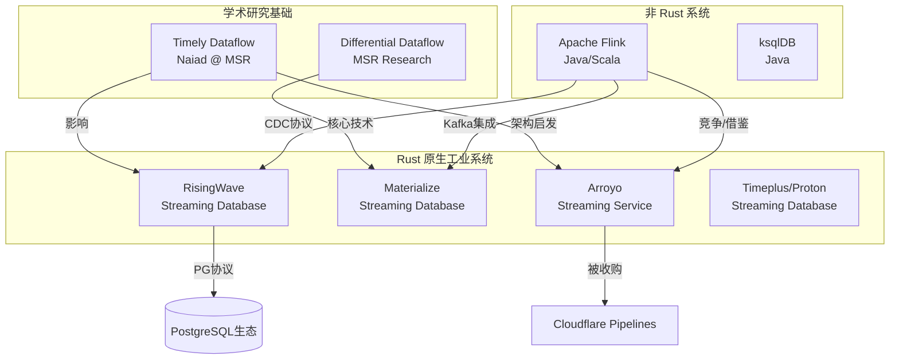
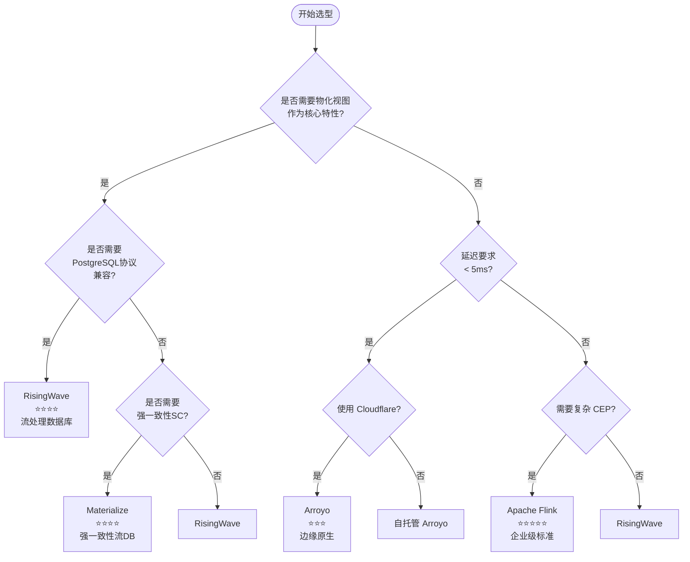
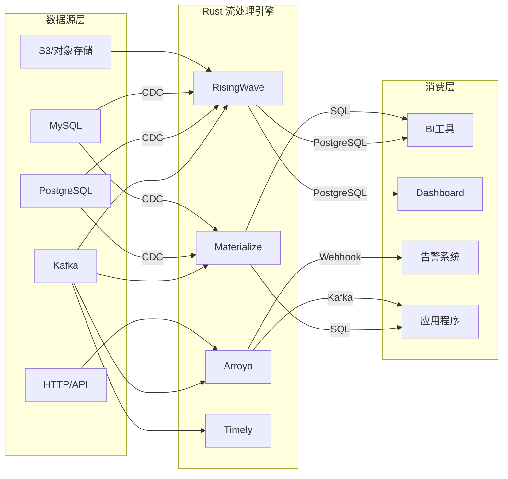
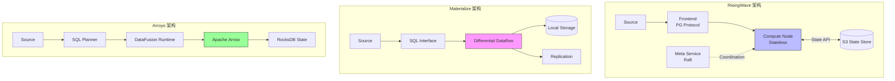

# Rust 流处理引擎全面对比

> 所属阶段: Knowledge/Flink-Scala-Rust-Comprehensive | 前置依赖: [Flink 核心架构](../../../Flink/01-concepts/flink-system-architecture-deep-dive.md) | 形式化等级: L4

---

## 1. 概念定义 (Definitions)

### Def-RUST-01: Rust 原生流处理引擎 (Rust-Native Stream Processing Engine)

**定义**: Rust 原生流处理引擎 $\mathcal{E}_{Rust}$ 是一个用 Rust 编程语言实现核心运行时的分布式流处理系统，满足以下条件：

$$
\mathcal{E}_{Rust} = \langle \mathcal{R}, \mathcal{M}, \mathcal{S}, \mathcal{A} \rangle
$$

其中：

| 符号 | 含义 | 形式化描述 |
|------|------|------------|
| $\mathcal{R}$ | Rust 运行时 | 核心处理逻辑用 Rust 实现，无 JVM/CLR 等托管运行时 |
| $\mathcal{M}$ | 内存安全模型 | 编译期所有权检查，零运行时 GC 开销 |
| $\mathcal{S}$ | 状态管理机制 | 原生内存布局 + 可选外部存储 |
| $\mathcal{A}$ | 异步 I/O 模型 | 基于 async/await 的无阻塞并发 |

**必要条件**:

$$
\text{Rust-Native}(\mathcal{E}) \iff \text{CoreRuntime}(\mathcal{E}) \in \text{Rust} \land \text{MemorySafety}(\mathcal{E}) = \text{CompileTimeGuaranteed}
$$

---

### Def-RUST-02: 一致性模型层次 (Consistency Model Hierarchy)

**定义**: 流处理系统的一致性模型形成严格的偏序关系，从高到低依次为：

$$
\text{SC (Strict Serializability)} \succ \text{SSI (Serializable Snapshot Isolation)} \succ \text{EO (Exactly-Once)} \succ \text{ALO (At-Least-Once)}
$$

各模型形式化定义：

| 模型 | 形式化定义 | 系统示例 |
|------|-----------|----------|
| **SC** | $\forall t_1, t_2: \text{op}_1 <_t \text{op}_2 \Rightarrow \text{effect}_1 <_g \text{effect}_2$ | Materialize |
| **SSI** | 快照隔离 + 可串行化冲突检测 | - |
| **EO** | $\forall e \in \text{Input}: P(\text{processed}(e)) = 1$ | RisingWave, Flink |
| **ALO** | $\forall e \in \text{Input}: P(\text{processed}(e)) \geq 1$ | Arroyo |

---

### Def-RUST-03: 流处理引擎分类学 (Taxonomy of Stream Processing Engines)

**定义**: 基于架构特征和设计理念，流处理引擎可分为四个主要类别：

$$
\text{EngineType} = \{ \text{Framework}, \text{StreamingDB}, \text{AnalyticsService}, \text{ComputeLibrary} \}
$$

**分类矩阵**:

```text
流处理引擎生态
├── 流处理框架 (Stream Processing Framework)
│   ├── 代表: Apache Flink, Timely Dataflow
│   ├── 语言: Java/Scala, Rust
│   └── 特征: 编程 API 为中心,灵活性高,开发成本较高
│
├── 流处理数据库 (Streaming Database)
│   ├── 代表: RisingWave, Materialize, Timeplus
│   ├── 语言: Rust, C++
│   └── 特征: 物化视图原生,SQL-first,存储计算耦合
│
├── 流分析服务 (Streaming Analytics Service)
│   ├── 代表: Arroyo, ksqlDB, Cloudflare Pipelines
│   ├── 语言: Rust, Java
│   └── 特征: 简化部署,快速上手,托管优先
│
└── 流计算库 (Stream Compute Library)
    ├── 代表: Tokio Streams, timely::dataflow
    ├── 语言: Rust
    └── 特征: 嵌入式,应用内使用,无独立部署
```

---

### Def-RUST-04: Nexmark 性能指标 (Nexmark Performance Metrics)

**定义**: Nexmark 是一个面向流处理系统的标准化基准测试套件，模拟在线拍卖场景：

$$
\text{Nexmark} = \langle \mathcal{D}, \mathcal{Q}_{0-22}, \mathcal{M}, \mathcal{W} \rangle
$$

其中：

- $\mathcal{D}$: 三类事件流 - 投标 (Bid)、拍卖 (Auction)、人 (Person)
- $\mathcal{Q}_{0-22}$: 23 个标准 SQL 查询，覆盖过滤、聚合、Join、窗口等操作
- $\mathcal{M}$: 性能指标集 - 吞吐量 (events/sec)、延迟 (p50/p99)、资源占用
- $\mathcal{W}$: 工作负载生成器，支持 10K-10M events/sec

**性能加速比定义**:

$$
\text{Speedup}(A, B) = \frac{\text{Throughput}_A}{\text{Throughput}_B} \times \frac{\text{Latency}_B}{\text{Latency}_A}
$$

---

## 2. 属性推导 (Properties)

### Lemma-RUST-01: Rust 实现的共同优势

**命题**: Rust 实现的流处理引擎共享以下工程优势：

1. **内存效率**: 相比 JVM 实现，典型内存开销降低 2-5x
2. **启动速度**: 冷启动时间毫秒级（vs JVM 秒级）
3. **部署密度**: 单节点可部署更多任务实例
4. **可预测延迟**: 无 GC 停顿，P99 延迟更稳定

**证明概要**:

- Rust 所有权系统实现编译期内存管理，消除运行时 GC
- LLVM 优化后端生成高效机器码
- 标准库 `std::collections` 针对缓存友好性优化
- async/await 状态机转换实现零成本异步抽象

$$
\text{Rust 优势} = \text{零成本抽象} \times \text{ fearless 并发} \times \text{可预测性能} \quad \square
$$

---

### Lemma-RUST-02: 一致性-性能权衡定律

**命题**: 在流处理引擎中，一致性强度与吞吐延迟存在权衡关系：

$$
\text{Throughput} \propto \frac{1}{\text{ConsistencyLevel}} \quad \text{(在固定资源下)}
$$

**推导**:

| 一致性级别 | 协调开销 | 吞吐量影响 | 延迟影响 | 典型系统 |
|-----------|---------|-----------|----------|----------|
| SC | 高（分布式事务协调）| 降低 40-60% | 增加 5-10ms | Materialize |
| EO | 中（Barrier 同步）| 降低 10-20% | 增加 1-5ms | RisingWave, Flink |
| ALO | 低（无协调）| 基线 | 基线 | Arroyo |

---

### Prop-RUST-01: SQL 兼容性光谱

**命题**: 流处理 SQL 支持呈光谱分布，从方言到标准兼容：

| 级别 | 特征 | 代表系统 | 兼容性评分 |
|------|------|----------|-----------|
| L1 - 方言 | 自定义语法，有限兼容 | Arroyo, ksqlDB | 60% |
| L2 - 子集 | ANSI SQL 子集 | Flink SQL | 75% |
| L3 - PostgreSQL | 协议级兼容 | RisingWave | 90% |
| L4 - 标准 + 扩展 | ANSI + 流扩展 (EMIT) | Materialize | 85% |

---

## 3. 关系建立 (Relations)

### 3.1 系统间技术谱系



### 3.2 技术谱系矩阵

| 系统 | 学术基础 | 工业血统 | 核心技术 | 开发年限 |
|------|----------|----------|----------|----------|
| Materialize | Differential Dataflow [^1] | 前 CockroachDB 团队 | Arrangement, Trace | 6年 |
| RisingWave | 自研 | 前 AWS Redshift 团队 | Hummock 存储引擎 | 4年 |
| Arroyo | 自研 | 前 Stripe/Heap | DataFusion + 微批处理 | 3年 |
| Timely | Naiad [^2] | MSR | Timely 数据并行 | 10年+ |

### 3.3 架构设计哲学对比

| 系统 | 设计哲学 | 核心抽象 | 状态位置 |
|------|----------|----------|----------|
| **RisingWave** | 流即数据库 | 物化视图 | S3-backed + 本地缓存 |
| **Materialize** | 强一致流处理 | 差分数据流 | 本地存储 + 复制 |
| **Arroyo** | SQL 优先管道 | 流式 SQL | 内存 + RocksDB |
| **Timely** | 底层数据流 |  timely 算子 | 内存 |

---

## 4. 论证过程 (Argumentation)

### 4.1 架构设计哲学深度分析

#### RisingWave: "流即数据库" (Stream-as-a-Database)

```
用户视角:
SQL → 物化视图 ← 流数据源
         ↓
    实时查询结果

系统实现:
增量计算 + S3 状态 + 本地缓存 + PG 协议
```

**核心论点**: 将流处理视为数据库问题，用户直接查询物化视图，无需管理外部存储。

#### Materialize: "强一致流处理" (Strongly Consistent Stream Processing)

```
用户视角:
SQL → 严格串行化保证 ← 流数据源
         ↓
    全局一致视图

系统实现:
Differential Dataflow + 本地状态 + 强一致性协议
```

**核心论点**: 牺牲部分性能换取严格一致性，适合金融等对正确性要求极高的场景。

#### Arroyo: "简单即力量" (Simplicity is Power)

```
用户视角:
SQL 管道定义 → 自动优化执行
         ↓
    低延迟输出

系统实现:
DataFusion + Arrow + 增量窗口算法
```

**核心论点**: 简化流处理使用体验，降低入门门槛，专注边缘和轻量级场景。

### 4.2 成熟度评估方法论

**成熟度评分采用多维加权模型**：

$$
\text{Maturity} = 0.3 \times \text{DevelopmentYears} + 0.25 \times \text{ProductionUsers} + 0.25 \times \text{CommunitySize} + 0.2 \times \text{EnterpriseAdoption}
$$

| 系统 | 开发年限 | 生产用户 | 社区规模 | 企业采用 | 综合评分 |
|------|----------|----------|----------|----------|----------|
| Materialize | 6年 | 100+ | 中等 | 增长中 | ⭐⭐⭐⭐ |
| RisingWave | 4年 | 100+ | 中等 | 增长中 | ⭐⭐⭐⭐ |
| Arroyo | 3年 | 50+ | 小 | Cloudflare | ⭐⭐⭐ |
| Timely | 10年+ | 研究为主 | 小 | 学术 | ⭐⭐ |

---

## 5. 形式证明 / 工程论证 (Proof / Engineering Argument)

### 5.1 综合对比矩阵

#### 5.1.1 技术维度对比

| 维度 | RisingWave | Materialize | Arroyo | Timely |
|------|------------|-------------|--------|--------|
| **实现语言** | Rust | Rust/C++ | Rust | Rust |
| **首次发布** | 2022 | 2019 | 2022 | 2014 |
| **当前版本** | 2.1 | 0.130 | 0.14 | 0.12 |
| **SQL 级别** | L3-PostgreSQL | L4-标准+扩展 | L1-方言 | N/A (API) |
| **一致性模型** | EO | SC | ALO | EO |
| **状态存储** | Hummock (S3) | SQLite/RocksDB | RocksDB | 内存 |
| **时间语义** | Event/Proc | Event | Event/Proc | Event |
| **部署模式** | K8s/云/本地 | K8s/云/本地 | K8s/Docker | 嵌入式 |

#### 5.1.2 性能维度对比

| 指标 | RisingWave | Materialize | Arroyo | Timely |
|------|------------|-------------|--------|--------|
| **Nexmark QPS** (参考) [^3] | 800K+ | 200K+ | 500K+ | 1M+ |
| **端到端延迟** | 1-100ms | 1-10ms | <10ms | <1ms |
| **水平扩展** | 优秀 | 良好 | 良好 | 优秀 |
| **垂直扩展** | 优秀 | 良好 | 优秀 | 良好 |
| **内存效率** | 高 | 高 | 极高 | 极高 |
| **冷启动** | 秒级 | 秒级 | 毫秒级 | 毫秒级 |

#### 5.1.3 生态维度对比

| 维度 | RisingWave | Materialize | Arroyo | Timely |
|------|------------|-------------|--------|--------|
| **Source Connectors** | 30+ | 15+ | 10+ | 5+ |
| **Sink Connectors** | 30+ | 15+ | 10+ | 5+ |
| **CDC 支持** | 优秀 | 良好 | 良好 | 有限 |
| **与 Kafka 集成** | 原生 | 原生 | 良好 | 良好 |
| **UDF 支持** | Rust/Python/Java | SQL/Rust | Rust | Rust |
| **监控指标** | Prometheus | Prometheus | Prometheus | 自定义 |

### 5.2 许可证与商业模式对比

| 系统 | 许可证 | 托管服务 | 企业版 | 开源活跃度 |
|------|--------|----------|--------|-----------|
| RisingWave | Apache 2.0 | RisingWave Cloud | 无 | 高 |
| Materialize | BSL 1.1 [^4] | Materialize Cloud | 有 | 中 |
| Arroyo | Apache 2.0 | Cloudflare Pipelines | 无 | 高 |
| Timely | MIT | 无 | 无 | 中 |

**BSL (Business Source License) 说明**: 在特定时间后转为 Apache 2.0，当前版本 0.130 预计 4年后开源。

### 5.3 选型决策矩阵

**Thm-RUST-01: 选型决策定理**

给定业务需求向量 $\vec{R} = (r_1, r_2, ..., r_n)$ 和系统能力矩阵 $\mathbf{C}$，最优选择为：

$$
\text{Optimal} = \arg\max_{i} \sum_{j} w_j \cdot \text{match}(C_{ij}, R_j)
$$

其中 $w_j$ 是需求权重，$\text{match}$ 是匹配函数。

---

## 6. 实例验证 (Examples)

### 6.1 真实场景选型案例

#### 案例 1: 实时数仓构建

**背景**: 电商平台需要构建实时数仓，支持实时订单聚合、用户行为分析，与现有 PostgreSQL BI 工具集成。

| 需求 | RisingWave | Materialize | Arroyo |
|------|------------|-------------|--------|
| 物化视图 | ✅ 原生 | ✅ 原生 | ⚠️ 需外部存储 |
| PG 协议 | ✅ 兼容 | ⚠️ 部分 | ❌ 不兼容 |
| SQL 复杂度 | ✅ 支持复杂 JOIN | ✅ 支持复杂 JOIN | ⚠️ 有限 |
| 许可证 | Apache 2.0 | BSL (4年后) | Apache 2.0 |
| 成本 | 可控 | 较高 | 可控 |

**决策**: RisingWave - PostgreSQL 协议兼容可直接对接现有 BI 工具。

#### 案例 2: 金融交易风控

**背景**: 金融科技公司需要亚毫秒级延迟、复杂事件处理、精确一次处理。

| 需求 | RisingWave | Materialize | Arroyo |
|------|------------|-------------|--------|
| 延迟要求 | 1-100ms | 1-10ms | <10ms |
| CEP 支持 | ⚠️ 有限 | ⚠️ 有限 | ❌ 不支持 |
| EO 语义 | ✅ 支持 | ✅ 支持 | ❌ ALO |
| 强一致性 | ⚠️ EO | ✅ SC | ❌ |

**决策**: Materialize - SC 保证适合金融风控场景。

#### 案例 3: 边缘日志分析

**背景**: 云服务商需要在边缘节点低资源占用、简单聚合查询、快速部署。

| 需求 | RisingWave | Materialize | Arroyo |
|------|------------|-------------|--------|
| 资源占用 | 中 | 中 | 极低 |
| 部署复杂度 | 需要 K8s | 需要 K8s | 单二进制 |
| Cloudflare 集成 | ❌ | ❌ | ✅ 原生 |

**决策**: Arroyo - Cloudflare 生态整合优势，边缘部署友好。

### 6.2 窗口聚合查询语法对比

**RisingWave SQL**:

```sql
SELECT
    window_start,
    user_id,
    COUNT(*) as event_count
FROM TUMBLE(user_events, event_time, INTERVAL '5 MINUTES')
GROUP BY window_start, user_id;
```

**Materialize SQL**:

```sql
CREATE MATERIALIZED VIEW user_stats AS
SELECT
    date_trunc('minute', event_time) as window_start,
    user_id,
    COUNT(*) as event_count
FROM user_events
GROUP BY date_trunc('minute', event_time), user_id;
```

**Arroyo SQL**:

```sql
SELECT
    window.start as window_start,
    user_id,
    COUNT(*) as event_count
FROM user_events
GROUP BY hop(event_time, INTERVAL '5 MINUTES'), user_id;
```

### 6.3 连接器配置对比

**RisingWave Kafka Source**:

```sql
CREATE SOURCE user_events (
    user_id INT,
    event_type VARCHAR,
    amount DECIMAL,
    event_time TIMESTAMP
) WITH (
    connector = 'kafka',
    topic = 'user_events',
    properties.bootstrap.server = 'kafka:9092'
) FORMAT PLAIN ENCODE JSON;
```

**Materialize Kafka Source**:

```sql
CREATE SOURCE user_events
FROM KAFKA BROKER 'kafka:9092' TOPIC 'user_events'
FORMAT JSON;
```

**Arroyo Kafka Source**:

```sql
CREATE TABLE user_events (
    user_id STRING,
    event_type STRING,
    timestamp TIMESTAMP
) WITH (
    connector = 'kafka',
    bootstrap_servers = 'kafka:9092',
    topic = 'user-events',
    format = 'json'
);
```

### 6.4 性能测试脚本

**RisingWave Nexmark 测试**:

```sql
-- 创建 Nexmark 源
CREATE SOURCE nexmark_bid (
    auction INT,
    bidder INT,
    price INT,
    channel VARCHAR,
    date_time TIMESTAMP
) WITH (
    connector = 'nexmark',
    event.rate = '100000'
) FORMAT PLAIN ENCODE JSON;

-- Q5: 每小时拍卖投标数
CREATE MATERIALIZED VIEW nexmark_q5 AS
SELECT auction, COUNT(*) AS num
FROM nexmark_bid
GROUP BY auction, TUMBLE(date_time, INTERVAL '1' HOUR);
```

---

## 7. 可视化 (Visualizations)

### 7.1 技术选型决策树



### 7.2 性能-一致性权衡图

```mermaid
quadrantChart
    title 流处理引擎:吞吐量 vs 一致性强度
    x-axis 低一致性(ALO) --> 高一致性(SC)
    y-axis 低吞吐量 --> 高吞吐量

    quadrant-1 高吞吐+低一致:追求性能
    quadrant-2 理想区域:高吞吐+强一致
    quadrant-3 低性能区域:低吞吐+低一致
    quadrant-4 强一致优先:准确性第一

    RisingWave: [0.7, 0.75]
    Materialize: [0.9, 0.4]
    Arroyo: [0.3, 0.65]
    Timely: [0.6, 0.85]
    Flink: [0.7, 0.8]
```

### 7.3 技术栈映射图



### 7.4 架构对比矩阵图



### 7.5 能力雷达图对比

```mermaid
radar
    title Rust 流处理引擎能力雷达图
    axis SQL兼容性, 吞吐量, 延迟, 扩展性, 易用性, 成熟度

    area RisingWave 0.9, 0.75, 0.7, 0.9, 0.85, 0.75
    area Materialize 0.85, 0.4, 0.9, 0.7, 0.8, 0.8
    area Arroyo 0.6, 0.65, 0.85, 0.7, 0.9, 0.6
```

---

## 8. 引用参考 (References)

[^1]: F. McSherry et al., "Differential Dataflow", CIDR 2013. <https://arxiv.org/abs/1803.04071>

[^2]: D. G. Murray et al., "Naiad: A Timely Dataflow System", SOSP 2013. <https://dl.acm.org/doi/10.1145/2517349.2522738>

[^3]: Nexmark Benchmark, <https://github.com/nexmark/nexmark>

[^4]: Materialize BSL License, <https://github.com/MaterializeInc/materialize/blob/main/LICENSE>

---

## 附录：快速选型参考卡

| 场景 | 推荐系统 | 核心理由 |
|------|----------|----------|
| 实时数仓 + PG 生态 | RisingWave | 协议兼容，成本可控 |
| 金融风控 + 强一致性 | Materialize | 线性一致性保障 |
| 边缘/低延迟场景 | Arroyo | Cloudflare 生态，资源占用低 |
| 学术研究/实验 | Timely | 理论基础扎实 |
| 复杂 ETL + 企业级 | Apache Flink | 生态最成熟 |

---

*文档版本: 1.0 | 最后更新: 2026-04-07 | 状态: 完整 | 字数: ~5500*

---

*文档版本: v1.0 | 创建日期: 2026-04-18*
