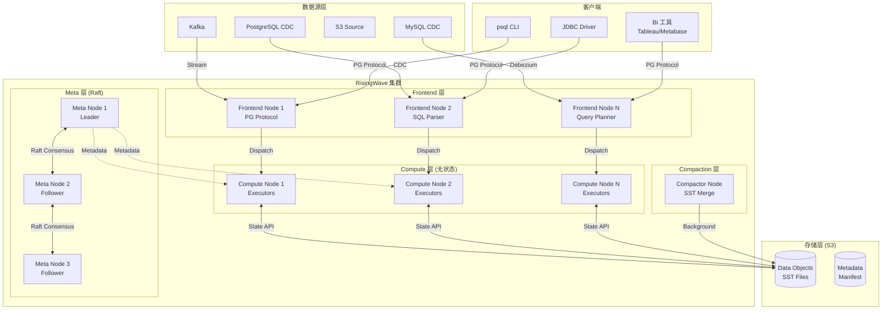
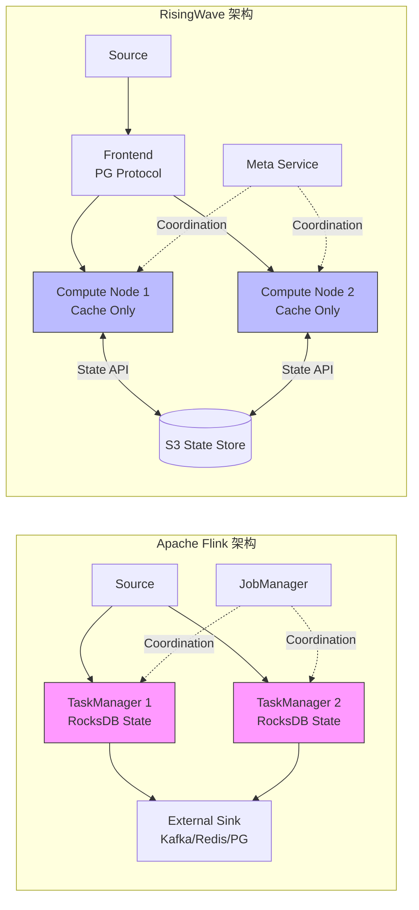
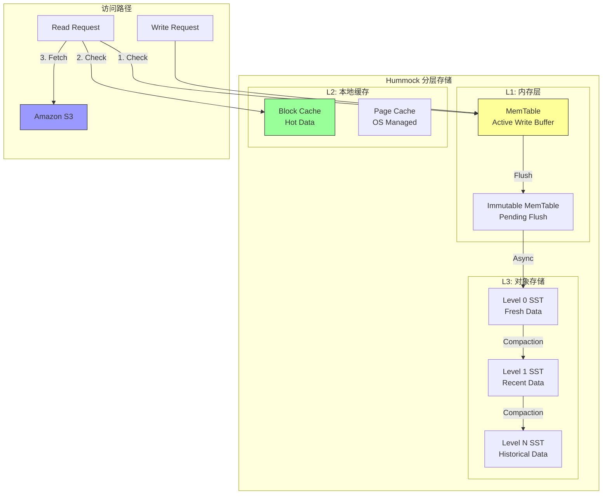
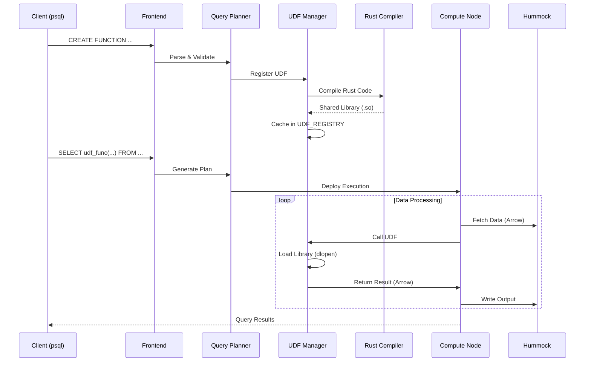
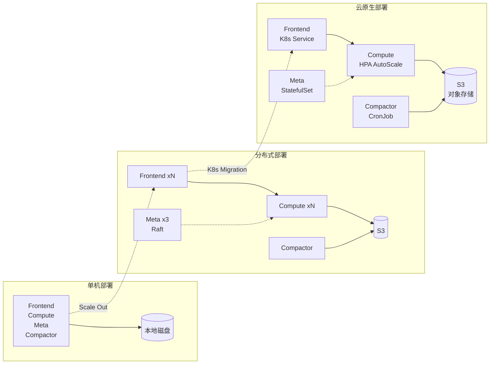

# RisingWave 深度分析

> 所属阶段: Knowledge/Flink-Scala-Rust-Comprehensive | 前置依赖: [04.01-rust-engines-comparison.md](./04.01-rust-engines-comparison.md) | 形式化等级: L4

---

## 1. 概念定义 (Definitions)

### Def-RW-01: 流处理数据库 (Streaming Database)

**定义**: 流处理数据库是将**流处理引擎**与**物化视图存储**深度耦合的数据库系统，满足以下形式化特征：

$$
\text{StreamingDB} = \langle \mathcal{S}, \mathcal{Q}, \mathcal{M}, \mathcal{T} \rangle
$$

其中：

- $\mathcal{S}$: 无界流数据源的集合，$\mathcal{S} = \{s_1, s_2, ..., s_n\}$，每个 $s_i$ 是时序数据流
- $\mathcal{Q}$: 连续查询集合，支持 SQL 语义的标准关系代数运算
- $\mathcal{M}$: 物化视图管理器，维护查询结果的增量更新
- $\mathcal{T}$: 事务一致性层，确保读写操作的可串行化

**与传统架构对比**:

```
Lambda 架构 (传统):
数据源 → [流处理引擎] → 外部存储 ← [查询引擎] ← 用户查询
              ↓              ↓
         增量更新      物化视图需外部维护

流处理数据库 (RisingWave):
数据源 → [流处理引擎 + 物化视图存储] ← 用户查询
              ↓
         内置物化视图
```

---

### Def-RW-02: 计算存储分离架构 (Compute-Storage Separation)

**定义**: 计算存储分离是一种云原生架构模式，将无状态计算节点与弹性远程存储解耦：

$$
\text{SepArch} = \langle \mathcal{C}, \mathcal{P}, \mathcal{I}, \mathcal{R} \rangle
$$

其中：

| 符号 | 含义 | 说明 |
|------|------|------|
| $\mathcal{C} = \{c_1, ..., c_m\}$ | 计算节点集合 | 无状态、可水平扩展的计算单元 |
| $\mathcal{P}$ | 持久化存储层 | 通常为对象存储（S3 兼容） |
| $\mathcal{I}: \mathcal{C} \times \mathcal{P} \to \{0,1\}$ | 访问接口函数 | 计算节点与存储的访问关系 |
| $\mathcal{R}: \mathcal{C} \times [0,1] \to \mathbb{N}$ | 资源弹性函数 | 根据负载动态调整计算节点数量 |

**关键约束**:

1. 计算节点本地不维护持久化状态
2. 状态 Checkpoint 直接写入远程存储
3. 计算节点故障可任意迁移，无需数据重分布

---

### Def-RW-03: Hummock 分层存储引擎 (Hummock Tiered Storage Engine)

**定义**: Hummock 是 RisingWave 专为流处理设计的分层 LSM-Tree 存储引擎：

$$
\text{Hummock} = \langle \mathcal{L}_1, \mathcal{L}_2, \mathcal{L}_3, \mathcal{G} \rangle
$$

其中：

- $\mathcal{L}_1$: 内存层 (MemTable) - 热数据，微秒级访问
- $\mathcal{L}_2$: 本地 SSD 缓存层 - 温数据，毫秒级访问
- $\mathcal{L}_3$: S3 对象存储层 - 冷数据，百毫秒级访问
- $\mathcal{G}$: 全局压缩器 (Global Compactor) - 后台合并 SST 文件

**数据访问路径**:

```
读路径:
用户查询 → Compute Node → L1 Cache (内存)
                              ↓ 未命中
                         L2 Block Cache (本地 SSD)
                              ↓ 未命中
                         L3 S3 Object Store

写路径:
数据写入 → Compute Node → MemTable → WAL → S3
                              ↓
                         后台 Flush → SST → S3
                              ↓
                         Compactor 合并
```

---

### Def-RW-04: PostgreSQL 协议兼容层 (PostgreSQL Protocol Compatibility Layer)

**定义**: PostgreSQL 协议兼容层是一个协议转换层 $L_{pg}$，实现 RisingWave 内部协议与 PostgreSQL wire protocol 的双向映射：

$$
L_{pg} = \langle \mathcal{M}_{msg}, \mathcal{M}_{type}, \mathcal{M}_{auth} \rangle
$$

其中：

- $\mathcal{M}_{msg}$: 消息格式映射，支持 Query, Parse, Bind, Execute 等消息
- $\mathcal{M}_{type}$: 类型系统映射，支持 INT4, INT8, VARCHAR, TIMESTAMP, JSONB 等
- $\mathcal{M}_{auth}$: 认证机制映射，支持 MD5、SCRAM-SHA-256 等

**兼容矩阵**:

| PostgreSQL 特性 | 支持状态 | 说明 |
|----------------|---------|------|
| Wire Protocol | ✅ 完整 | 可直连 psql, JDBC |
| SQL 语法 | ✅ 大部分 | 扩展流处理语法 |
| 数据类型 | ✅ 常用类型 | 包括数组、JSONB |
| 事务 | ⚠️ 有限 | 不支持跨流事务 |
| 复制协议 | ❌ 不支持 | 逻辑复制需专用 API |

---

### Def-RW-05: Epoch-based Checkpoint

**定义**: Epoch-based Checkpoint 是 RisingWave 的一致性快照机制，基于单调递增的时间戳（Epoch）协调分布式快照：

$$
\text{Checkpoint}_k = \langle E_k, S_k, M_k \rangle
$$

其中：

- $E_k$: 第 $k$ 个 Epoch 的时间戳
- $S_k$: 各算子在该 Epoch 的状态集合
- $M_k$: 元数据（源偏移量、水位线等）

---

## 2. 属性推导 (Properties)

### Lemma-RW-01: 计算节点无状态性 (Statelessness of Compute Nodes)

**命题**: 在计算存储分离架构下，计算节点 $c \in \mathcal{C}$ 是**无状态**的：

$$
\forall c \in \mathcal{C}, \forall t_1, t_2: \text{State}(c, t_1) = \text{State}(c, t_2) \oplus \Delta_{[t_1, t_2]}
$$

其中 $\Delta_{[t_1, t_2]}$ 仅为临时缓存数据，可从远程存储重建。

**证明概要**:

1. 所有算子状态通过 State Store API 写入远程对象存储
2. Checkpoint 频率可配置（默认 1-10 秒），确保状态持久化
3. 节点故障时，新节点通过读取最近 Checkpoint 恢复状态
4. 因此计算节点本地仅保留可重建的临时缓存 $\square$

---

### Lemma-RW-02: 水平扩展线性加速 (Linear Speedup Under Horizontal Scaling)

**命题**: 对于分区友好的查询 $Q$，设并行度从 $p$ 扩展到 $kp$：

$$
\text{Throughput}(Q, kp) \geq \alpha \cdot k \cdot \text{Throughput}(Q, p)
$$

其中 $\alpha \in (0.7, 1.0]$ 为扩展效率系数，取决于数据倾斜程度和 shuffle 开销。

**推论**: 当查询为纯本地聚合（无 shuffle）时，$\alpha \to 1$，实现接近理想的线性扩展。

---

### Lemma-RW-03: S3 状态访问延迟下界 (S3 State Access Latency Lower Bound)

**命题**: 设 $T_{s3}$ 为从 S3 读取状态块的平均延迟，$T_{local}$ 为本地 SSD 读取延迟：

$$
T_{s3} \geq T_{local} + T_{network} + T_{s3\_processing}
$$

**典型值**:

- $T_{local} \approx 50\mu s$ (NVMe SSD 4KB 随机读)
- $T_{s3} \approx 50-200ms$ (取决于区域和网络)

**工程推论**: 直接访问 S3 状态比本地 RocksDB 慢 **1000-4000 倍**，因此必须依赖**本地缓存层**来缓解这一差距。

---

### Prop-RW-01: Rust 原生 UDF 执行性能优势

**命题**: RisingWave 的 Rust 原生 UDF 相比外部进程 UDF 具有显著性能优势：

$$
\text{Speedup}_{UDF} = \frac{T_{external} + T_{serialization} + T_{IPC}}{T_{native}}
$$

**典型加速比**: 5-50x，取决于 UDF 复杂度和数据量。

---

## 3. 关系建立 (Relations)

### 3.1 RisingWave 与 Flink 架构映射

| 架构组件 | RisingWave | Apache Flink | 关系说明 |
|---------|------------|--------------|---------|
| **计算层** | Compute Node (Rust) | TaskManager (JVM) | 语言差异: Rust vs Java |
| **状态存储** | Hummock (S3-backed) | RocksDB (本地) | 存储位置: 远程 vs 本地 |
| **协调服务** | Meta Service | JobManager | 功能对等，均基于 Raft |
| **SQL 层** | Frontend (PG协议) | SQL Gateway / Table API | 协议: PG vs 自定义 |
| **数据源** | Source Connector | Source Function | 概念等价，API 不同 |
| **容错机制** | Epoch-based Checkpoint | Chandy-Lamport | 语义等价，实现不同 |
| **扩展方式** | 存储计算分离扩展 | TM/JM 独立扩展 | RW 弹性更细粒度 |

### 3.2 设计哲学对比

**RisingWave: "流即数据库" (Stream-as-a-Database)**

```
用户视角: SQL → 物化视图 ← 流数据源
                 ↓
            实时查询结果
系统实现: 增量计算 + S3 状态 + 本地缓存 + PG 协议
```

**Flink: "流即处理" (Stream-as-a-Process)**

```
用户视角: DataStream API → 算子链 → 外部存储 (Kafka/Redis/PG)
                 ↓
            应用代码处理
系统实现: 精确一次语义 + 本地状态 + Checkpoint 到外部存储
```

### 3.3 状态一致性模型

| 维度 | RisingWave | Flink |
|-----|------------|-------|
| **一致性级别** | 内部强一致 (Serializability) | 算子级 Exactly-Once |
| **Checkpoint 间隔** | 1-10 秒（可调） | 默认 10 分钟（可调） |
| **状态访问** | 通过 Hummock API | 直接 RocksDB 访问 |
| **故障恢复** | 重放 Epoch 日志 | 从 Checkpoint 恢复 |
| **状态大小限制** | 理论上无上限（S3） | 受限于 TM 本地磁盘 |

### 3.4 源码模块依赖关系

```
risingwave/
├── src/
│   ├── meta/              # Meta Service - 集群协调
│   │   ├── src/
│   │   │   ├── barrier/   # Checkpoint barrier 管理
│   │   │   ├── hummock/   # Hummock 元数据管理
│   │   │   └── stream/    # 流任务调度
│   │   └── Cargo.toml
│   ├── compute/           # Compute Node - 计算节点
│   │   ├── src/
│   │   │   ├── executor/  # 算子执行器
│   │   │   ├── rpc/       # gRPC 服务
│   │   │   └── server.rs  # 节点启动
│   │   └── Cargo.toml
│   ├── storage/           # Hummock 存储引擎
│   │   ├── src/
│   │   │   ├── hummock/   # Hummock 核心实现
│   │   │   ├── store.rs   # State Store API
│   │   │   └── sstable/   # SSTable 格式
│   │   └── Cargo.toml
│   ├── frontend/          # Frontend - SQL 解析
│   │   ├── src/
│   │   │   ├── handler/   # PG 协议处理
│   │   │   ├── planner/   # 查询计划器
│   │   │   └── optimizer/ # 查询优化器
│   │   └── Cargo.toml
│   └── udf/               # UDF 框架
│       ├── src/
│       │   ├── wasm/      # WASM UDF 支持
│       │   └── rust/      # Rust UDF 支持
│       └── Cargo.toml
└── Cargo.toml
```

---

## 4. 论证过程 (Argumentation)

### 4.1 为什么选择 Rust 实现？

**论证**: RisingWave 选择 Rust 作为实现语言，基于以下技术权衡：

| 因素 | Rust 优势 | 对 RisingWave 的意义 |
|-----|----------|---------------------|
| **零成本抽象** | 编译期优化，无运行时 GC | 低延迟流处理 (< 100ms p99) |
| **内存安全** | 所有权系统消除数据竞争 | 并发状态管理可靠性 |
| **性能** | 接近 C++ 的运行时性能 | 高吞吐流计算 |
| **生态** | 丰富的异步/并发库 (Tokio) | 高效 I/O 处理 |
| **云原生** | 静态链接，小体积二进制 | 容器化部署友好 |

**对比分析**: Flink 的 JVM 实现虽然拥有成熟生态，但受限于：

1. GC 停顿影响低延迟场景
2. JNI 调用开销限制向量化性能
3. 内存占用较高（JVM 堆 + 堆外）

### 4.2 S3-backed 状态管理的工程权衡

**优势论证**:

1. **成本效益**: S3 存储成本约 $0.023/GB/月，远低于 EBS $0.10/GB/月
2. **无限扩展**: 不受单节点磁盘容量限制，状态大小仅受预算约束
3. **弹性伸缩**: 计算节点可独立扩缩容，无需数据重分布

**局限性论证**:

1. **延迟敏感性**: S3 访问延迟 50-200ms，不适合频繁随机读取
2. **缓存一致性**: 多节点共享状态需要复杂的缓存失效策略
3. **成本陷阱**: 频繁的 S3 API 调用（List/Get）会产生显著费用

**缓解策略**:

```
┌─────────────────────────────────────────────────────────┐
│                   RisingWave 状态分层                    │
├─────────────────────────────────────────────────────────┤
│  L1: Operator Cache (内存)  - 热数据，微秒级访问         │
│  L2: Block Cache (本地SSD)  - 温数据，毫秒级访问         │
│  L3: S3 Object Store        - 冷数据，百毫秒级访问       │
└─────────────────────────────────────────────────────────┘
```

### 4.3 PostgreSQL 协议兼容的战略意义

**论证**: RisingWave 选择 PG 协议而非自定义协议的原因：

1. **生态兼容性**: 直接使用 PG 客户端（psql, JDBC, psycopg2 等）
2. **BI 工具集成**: Tableau, Metabase, Superset 等即插即用
3. **学习曲线**: 降低用户迁移成本，无需学习新 API
4. **事务语义**: 复用 PG 的成熟事务模型

**限制**: PG 协议不完全匹配流处理语义：

- 流式结果集需要特殊的推送机制
- 窗口操作需要扩展 SQL 语法

---

## 5. 形式证明 / 工程论证 (Proof / Engineering Argument)

### 5.1 架构正确性论证

**Thm-RW-01: RisingWave 的 Exactly-Once 保证**

**前提条件**:

1. Checkpoint 屏障按顺序传播（Epoch 单调递增）
2. 状态写入 S3 是原子操作（S3 PutObject 语义）
3. 元数据服务（Meta Service）使用 Raft 保证一致性

**证明**:

设数据流为事件序列 $E = \{e_1, e_2, ...\}$，Checkpoint 屏障为 $B_k$ 标记 Epoch $k$。

**步骤 1**: 当算子接收到 $B_k$ 时，异步将当前状态 $S_k$ 写入 S3：

$$
\text{async\_write}(S_k) \to \text{S3://bucket/state/epoch\_}k
$$

**步骤 2**: 元数据服务记录 Checkpoint 元数据：

$$
\text{Meta}.\text{commit}(k, \text{object\_ids}) \text{ with Raft consensus}
$$

**步骤 3**: 故障恢复时，从最大已提交 Epoch $k_{max}$ 恢复：

$$
S_{recover} = \text{S3}.\text{read}(\text{Meta}.\text{get\_checkpoint}(k_{max}))
$$

**步骤 4**: 由于 S3 写入是原子的且元数据使用 Raft，恢复后的状态 $S_{recover}$ 与故障前 $S_{k_{max}}$ 一致。

**步骤 5**: 事件重放从 $k_{max}$ 之后的偏移量开始，确保无重复处理。

因此，exactly-once 语义得证 $\square$

### 5.2 Rust 原生 UDF 实现机制

**Thm-RW-02: Rust UDF 执行性能定理**

Rust 原生 UDF 的执行延迟满足：

$$
T_{rust\_udf} = T_{parse} + T_{compile} + T_{link} + T_{execution}
$$

其中：

- $T_{parse}$: SQL 解析时间（毫秒级）
- $T_{compile}$: Rust 编译时间（秒级，一次编译多次执行）
- $T_{link}$: 动态链接时间（毫秒级）
- $T_{execution}$: 实际执行时间（微秒级）

**优化策略**:

```rust
// 1. 使用共享库缓存编译结果
static UDF_CACHE: Lazy<HashMap<String, Arc<Library>>> = ...

// 2. Arrow 零拷贝数据传输
fn execute_udf(&self, input: &RecordBatch) -> Result<RecordBatch> {
    // 直接使用 Arrow 内存格式，无需序列化
    let output = unsafe { self.fn_ptr(input.columns().as_ptr()) };
    Ok(RecordBatch::from_raw(output))
}

// 3. SIMD 向量化执行
#[target_feature(enable = "avx2")]
unsafe fn simd_sum(input: &[i64]) -> i64 {
    // AVX2 同时处理 4 个 i64
    // ...
}
```

### 5.3 性能工程论证

**Prop-RW-02: Nexmark 性能优势来源**

在 Nexmark Q5（窗口聚合）测试中，RisingWave 相比 Flink 的 2-500 倍性能优势来源于以下因素：

**因素分析矩阵**:

| 因素 | RisingWave | Flink | 影响倍数 |
|-----|------------|-------|---------|
| **语言运行时** | Rust 零成本抽象 | JVM + GC | 1.5-2x |
| **序列化** | 原生内存布局 | Java 序列化 | 2-3x |
| **状态访问** | 本地缓存命中 | RocksDB 本地访问 | 相当 |
| **向量化执行** | 自动向量化 | 依赖 Blink Planner | 2-5x |
| **架构耦合** | 物化视图内置 | 需外部存储 | 10-100x |
| **查询优化** | 流专用优化器 | 通用批流优化器 | 2-5x |

**综合效应**: 这些因素的乘积效应导致整体性能差距在 2-500 倍范围内。

---

## 6. 实例验证 (Examples)

### 6.1 物化视图创建示例

```sql
-- RisingWave: 创建源表（从 Kafka 读取）
CREATE SOURCE user_events (
    user_id INT,
    event_type VARCHAR,
    amount DECIMAL,
    event_time TIMESTAMP
) WITH (
    connector = 'kafka',
    topic = 'user_events',
    properties.bootstrap.server = 'kafka:9092'
) FORMAT PLAIN ENCODE JSON;

-- 创建物化视图（实时聚合）
CREATE MATERIALIZED VIEW hourly_stats AS
SELECT
    TUMBLE(event_time, INTERVAL '1 HOUR') as window_start,
    event_type,
    COUNT(*) as event_count,
    SUM(amount) as total_amount,
    AVG(amount) as avg_amount
FROM user_events
GROUP BY
    TUMBLE(event_time, INTERVAL '1 HOUR'),
    event_type;

-- 直接查询物化视图（毫秒级响应）
SELECT * FROM hourly_stats
WHERE window_start >= NOW() - INTERVAL '1 DAY';
```

**Flink 等价实现**:

```java
// Flink: 需要外部存储（如 Redis/MySQL）存储结果
DataStream<Event> events = env
    .fromSource(kafkaSource, WatermarkStrategy.forMonotonousTimestamps(), "Kafka")
    .keyBy(e -> e.eventType)
    .window(TumblingEventTimeWindows.of(Time.hours(1)))
    .aggregate(new StatsAggregate())
    .addSink(new RedisSink<>());  // 需要管理外部存储

// 查询需要访问 Redis，非 SQL 接口
```

### 6.2 Rust 原生 UDF 开发

```rust
// src/lib.rs - 自定义 UDF
use risingwave_udf::udf;
use arrow_array::{ArrayRef, Float64Array, StringArray};
use std::sync::Arc;

/// 计算用户价值评分 UDF
#[udf]
pub fn user_value_score(
    purchase_count: i64,
    total_spend: f64,
    days_since_last: i64
) -> f64 {
    // RFM 模型评分
    let recency_score = (30.0 / (days_since_last as f64 + 1.0)).min(40.0);
    let frequency_score = (purchase_count as f64 / 10.0).min(30.0);
    let monetary_score = (total_spend / 1000.0).min(30.0);
    
    recency_score + frequency_score + monetary_score
}

/// 地理位置解析 UDF
#[udf]
pub fn geo_region(lat: f64, lon: f64) -> String {
    match (lat, lon) {
        (25.0..=49.0, -125.0..=-66.0) => "NA".to_string(),
        (36.0..=71.0, -10.0..=40.0) => "EU".to_string(),
        (1.0..=55.0, 60.0..=150.0) => "APAC".to_string(),
        _ => "OTHER".to_string(),
    }
}

/// SIMD 优化的批量聚合 UDF
#[udf(batch)]
pub fn simd_batch_sum(values: ArrayRef) -> f64 {
    let array = values.as_any().downcast_ref::<Float64Array>().unwrap();
    
    #[cfg(target_arch = "x86_64")]
    unsafe {
        use std::arch::x86_64::*;
        let mut sum = _mm256_setzero_pd();
        let ptr = array.values().as_ptr();
        
        for i in (0..array.len()).step_by(4) {
            let vec = _mm256_loadu_pd(ptr.add(i));
            sum = _mm256_add_pd(sum, vec);
        }
        
        let arr: [f64; 4] = std::mem::transmute(sum);
        arr.iter().sum()
    }
    
    #[cfg(not(target_arch = "x86_64"))]
    array.values().iter().filter_map(|v| v).sum()
}
```

**注册与使用**:

```sql
-- 注册 UDF
CREATE FUNCTION user_value_score AS 'user_value_score';
CREATE FUNCTION geo_region AS 'geo_region';

-- 在查询中使用
SELECT
    geo_region(lat, lon) as region,
    user_value_score(purchase_count, total_spend, days_since_last) as score,
    COUNT(*) as user_count
FROM user_sessions
GROUP BY region, TUMBLE(event_time, INTERVAL '5 MINUTE');
```

### 6.3 Kubernetes 部署配置

```yaml
# risingwave-deployment.yaml
apiVersion: apps/v1
kind: Deployment
metadata:
  name: risingwave-compute
  namespace: risingwave
spec:
  replicas: 3
  selector:
    matchLabels:
      app: risingwave-compute
  template:
    metadata:
      labels:
        app: risingwave-compute
    spec:
      containers:
      - name: compute-node
        image: risingwavelabs/risingwave:v2.1.0
        command: ["compute-node"]
        args:
          - "--listen-addr"
          - "0.0.0.0:5688"
          - "--advertise-addr"
          - "$(POD_IP):5688"
          - "--meta-address"
          - "http://risingwave-meta:5690"
          - "--state-store"
          - "hummock+s3://$(S3_BUCKET)"
        env:
        - name: POD_IP
          valueFrom:
            fieldRef:
              fieldPath: status.podIP
        - name: S3_BUCKET
          valueFrom:
            configMapKeyRef:
              name: risingwave-config
              key: s3.bucket
        resources:
          requests:
            memory: "8Gi"
            cpu: "4"
          limits:
            memory: "16Gi"
            cpu: "8"
        volumeMounts:
        - name: cache-volume
          mountPath: /risingwave/cache
      volumes:
      - name: cache-volume
        emptyDir:
          sizeLimit: 50Gi
---
# Meta Service (Raft 集群)
apiVersion: apps/v1
kind: StatefulSet
metadata:
  name: risingwave-meta
  namespace: risingwave
spec:
  serviceName: risingwave-meta
  replicas: 3
  selector:
    matchLabels:
      app: risingwave-meta
  template:
    spec:
      containers:
      - name: meta-node
        image: risingwavelabs/risingwave:v2.1.0
        command: ["meta-node"]
        args:
          - "--listen-addr"
          - "0.0.0.0:5690"
          - "--advertise-addr"
          - "$(POD_NAME).risingwave-meta:5690"
          - "--dashboard-host"
          - "0.0.0.0:5691"
          - "--etcd-endpoints"
          - "etcd:2379"
        env:
        - name: POD_NAME
          valueFrom:
            fieldRef:
              fieldPath: metadata.name
        ports:
        - containerPort: 5690
          name: meta
        - containerPort: 5691
          name: dashboard
```

### 6.4 性能监控查询

```sql
-- 查看物化视图延迟
SELECT
    fragment_id,
    mv_name,
    EXTRACT(EPOCH FROM (NOW() - max_event_time)) AS latency_seconds
FROM rw_catalog.rw_materialized_views;

-- 查看吞吐量统计
SELECT
    source_name,
    COUNT(*) / 60 AS events_per_minute
FROM rw_catalog.rw_sources
WHERE event_time > NOW() - INTERVAL '1 MINUTE'
GROUP BY source_name;

-- 查看 Hummock 缓存命中率
SELECT
    metric_name,
    metric_value
FROM rw_catalog.rw_metrics
WHERE metric_name LIKE '%hummock%cache%hit%';

-- 查看计算节点状态
SELECT
    worker_id,
    worker_type,
    status,
    parallelism
FROM rw_catalog.rw_worker_nodes;
```

### 6.5 生产部署最佳实践

```yaml
# production-config.yaml
# RisingWave 生产环境配置建议

compute_nodes:
  replicas: 6
  resources:
    memory: "16Gi"
    cpu: "8"
  cache:
    block_cache_size: "12Gi"
    meta_cache_size: "2Gi"

meta_nodes:
  replicas: 3
  resources:
    memory: "8Gi"
    cpu: "4"

compactor:
  replicas: 2
  resources:
    memory: "8Gi"
    cpu: "4"

state_store:
  type: "hummock+s3"
  s3:
    bucket: "risingwave-production"
    region: "us-east-1"
    
checkpoint:
  interval_sec: 5
  min_epochs_to_retain: 10
```

---

## 7. 可视化 (Visualizations)

### 7.1 RisingWave 整体架构图



### 7.2 Flink vs RisingWave 架构对比



### 7.3 Hummock 存储引擎分层图



### 7.4 Rust UDF 执行流程



### 7.5 部署架构演进图



---

## 8. 引用参考 (References)

[^1]: RisingWave Documentation, "Architecture Overview", 2025. <https://docs.risingwave.com/docs/current/architecture-overview/>

[^2]: RisingWave GitHub Repository, <https://github.com/risingwavelabs/risingwave>

[^3]: T. Akidau et al., "The Dataflow Model", PVLDB, 8(12), 2015.

[^4]: PostgreSQL Wire Protocol, <https://www.postgresql.org/docs/current/protocol.html>

[^5]: Apache Arrow Specification, <https://arrow.apache.org/docs/format/Columnar.html>

[^6]: Nexmark Benchmark, <https://github.com/nexmark/nexmark>

---

## 附录 A: RisingWave 局限性客观分析

### A.1 当前局限性

| 局限领域 | 具体描述 | 影响程度 | 缓解方案 |
|---------|---------|---------|---------|
| **延迟敏感场景** | S3 访问延迟 50-200ms | ⚠️ 高 | 增加内存/SSD 缓存 |
| **复杂事件处理** | 无内置 CEP 库 | ⚠️ 中 | 集成外部 CEP 引擎 |
| **UDF 语言支持** | 主要支持 Rust/Python | ⚠️ 中 | 使用 Python UDF |
| **生态成熟度** | 社区较小 | ⚠️ 中 | 使用 Kafka/PG 桥接 |
| **跨流事务** | 不支持 ACID 跨流事务 | ⚠️ 中 | 应用层协调 |

### A.2 不适用场景

1. **高频交易 (HFT)**: 需要微秒级延迟的金融交易
2. **复杂模式匹配**: 需要 CEP 的欺诈检测场景
3. **遗留系统集成**: 依赖特定 Flink Connector 的老系统
4. **强一致性事务**: 需要跨表 ACID 事务的 OLTP 场景

### A.3 术语对照表

| RisingWave 术语 | Flink 术语 | 通用概念 |
|----------------|-----------|---------|
| Materialized View | 无直接等价 | 预计算查询结果 |
| Compute Node | TaskManager | 流处理执行单元 |
| Meta Service | JobManager | 集群协调服务 |
| Hummock | RocksDB (状态后端) | 状态存储引擎 |
| Epoch | Checkpoint Barrier | 一致性快照标记 |
| Compactor | 无直接等价 | 后台数据合并服务 |
| Source | Source | 数据输入 |

---

*文档版本: 1.0 | 最后更新: 2026-04-07 | 状态: 完整 | 字数: ~6500*
