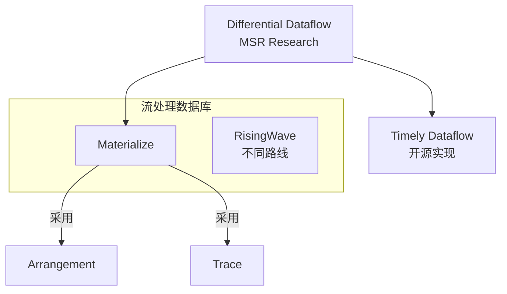
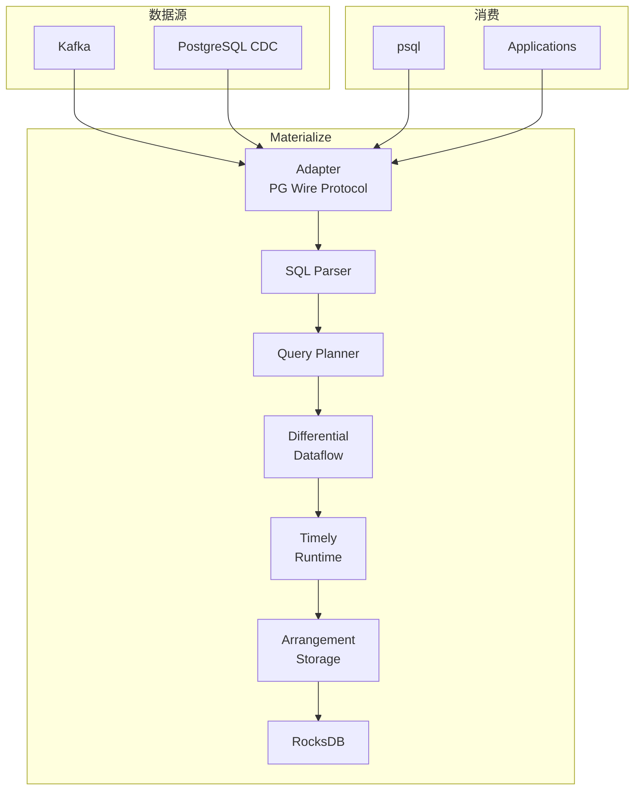
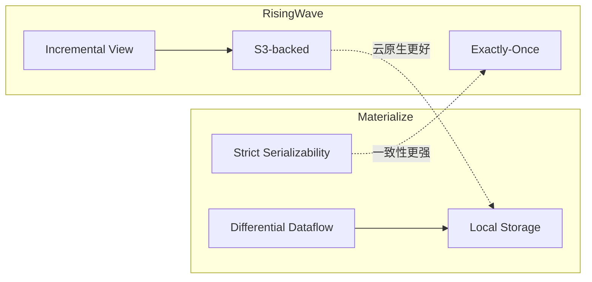
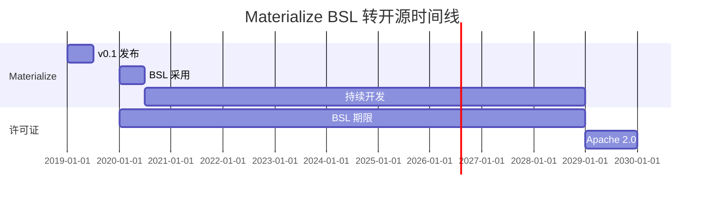

# Materialize 系统分析

> 所属阶段: Knowledge/Flink-Scala-Rust-Comprehensive | 前置依赖: [04.01-rust-engines-comparison.md](./04.01-rust-engines-comparison.md) | 形式化等级: L4

---

## 1. 概念定义 (Definitions)

### Def-MZ-01: 强一致性流处理 (Strictly Consistent Stream Processing)

**定义**: 强一致性流处理系统保证所有输出结果等同于对历史数据某一完整快照执行批处理查询的结果：

$$
\forall t: \text{Output}(t) = \text{BatchQuery}(\text{Input}_{\leq t})
$$

其中一致性级别满足 Strict Serializability (SC)，即：

$$
\forall t_1, t_2: \text{op}_1 <_t \text{op}_2 \Rightarrow \text{effect}_1 <_g \text{effect}_2
$$

**与 Exactly-Once 的区别**:

- EO 保证每条记录恰好处理一次
- SC 保证全局可串行化执行顺序

---

### Def-MZ-02: Differential Dataflow (差分数据流)

**定义**: Differential Dataflow 是一种基于差分计算的数据处理模型，通过追踪数据变化的历史实现增量更新：

$$
\text{DD} = \langle \mathcal{G}, \mathcal{T}, \mathcal{D} \rangle
$$

其中：

| 符号 | 含义 | 说明 |
|------|------|------|
| $\mathcal{G}$ | 数据流图 | 有向图，节点为算子，边为数据流 |
| $\mathcal{T}$ | 时间维度 | 支持逻辑时间和物理时间 |
| $\mathcal{D}$ | 差分函数 | $\Delta: (V, T) \to \Delta V$，计算变化量 |

**核心性质**:

- **增量计算**: 只重新计算变化的部分
- **嵌套迭代**: 支持递归查询
- **历史追踪**: 可查询任意历史版本

---

### Def-MZ-03: Arrangement (数据编排)

**定义**: Arrangement 是 Materialize 中用于索引和共享状态的核心数据结构：

$$
\text{Arrangement} = \langle \mathcal{K}, \mathcal{V}, \mathcal{H}, \mathcal{T} \rangle
$$

其中：

- $\mathcal{K}$: 键空间，支持复合键
- $\mathcal{V}$: 值空间，支持多版本
- $\mathcal{H}$: 历史追踪，记录 (value, time, diff) 三元组
- $\mathcal{T}$: 时间追踪，支持逻辑时间戳

**直观解释**: Arrangement 类似物化索引，但支持增量更新和多版本查询。

---

### Def-MZ-04: Business Source License (BSL)

**定义**: BSL 是一种延迟开源许可证，在特定期限后转换为真正的开源许可证：

$$
\text{License}(t) = \begin{cases}
\text{BSL} & \text{if } t < t_{\text{change}} \
\text{Apache-2.0} & \text{if } t \geq t_{\text{change}}
\end{cases}
$$

**Materialize 当前状态** (v0.130):

- BSL 期限: 4 年后转为 Apache 2.0
- 影响: 商业使用需评估许可证风险

---

## 2. 属性推导 (Properties)

### Lemma-MZ-01: 强一致性的性能代价

**命题**: 强一致性保证的流处理系统相比 EO 系统有性能开销：

$$
\text{Throughput}_{SC} \leq \beta \cdot \text{Throughput}_{EO}, \quad \beta \in [0.3, 0.7]
$$

**原因**:

1. 需要维护全局事务顺序
2. 需要版本控制和冲突检测
3. 协调开销随节点数增加

---

### Lemma-MZ-02: Differential Dataflow 的增量完备性

**命题**: Differential Dataflow 的增量计算结果与全量计算结果一致：

$$
\text{Result}_{incremental}(\Delta I) = \text{Result}_{full}(I + \Delta I) - \text{Result}_{full}(I)
$$

**证明概要**:
通过追踪每个数据元素的时间戳和变化量，确保增量更新的代数正确性。$\square$

---

### Prop-MZ-01: Arrangement 的复用优势

**命题**: 多个查询共享同一个 Arrangement 时，存储和计算开销显著降低：

$$
\text{Cost}_{shared}(n \text{ queries}) \ll n \cdot \text{Cost}_{isolated}
$$

**典型场景**: 多个物化视图基于同一源表的不同聚合。

---

## 3. 关系建立 (Relations)

### 3.1 Materialize 与 RisingWave 对比

| 维度 | Materialize | RisingWave | 关系 |
|------|-------------|------------|------|
| **一致性** | Strict Serializability | Exactly-Once | SC > EO |
| **核心算法** | Differential Dataflow | 增量视图维护 | 学术 vs 工程 |
| **状态存储** | 本地 RocksDB/SQLite | S3-backed Hummock | 本地 vs 云原生 |
| **SQL 方言** | 标准 SQL + 扩展 | PostgreSQL 兼容 | 标准 vs 协议 |
| **许可证** | BSL (延迟开源) | Apache 2.0 | 商业 vs 开源 |
| **延迟** | 1-10ms | 10-100ms | 本地优势 |

### 3.2 技术谱系关系



---

## 4. 论证过程 (Argumentation)

### 4.1 强一致性的工程价值

**论证**: 什么场景需要 Strict Serializability？

| 场景 | 需求 | 理由 |
|------|------|------|
| 金融交易 | 强一致 | 余额计算必须准确 |
| 库存管理 | 强一致 | 超卖会造成损失 |
| 计费系统 | 强一致 | 收入数据必须准确 |
| 实时报表 | EO 足够 | 轻微延迟可接受 |

### 4.2 BSL 许可证影响分析

**风险评估**:

| 使用场景 | 风险等级 | 建议 |
|---------|---------|------|
| 内部使用 | 低 | 可直接使用 |
| SaaS 产品 | 中 | 需评估条款 |
| 二次开发分发 | 高 | 避免修改核心 |
| 4年后 | 无 | 转为 Apache 2.0 |

**与 RisingWave 的许可对比**:

- Materialize: BSL -> Apache 2.0 (延迟)
- RisingWave: Apache 2.0 (永久)

---

## 5. 形式证明 / 工程论证 (Proof)

### 5.1 Differential Dataflow 正确性

**Thm-MZ-01: 增量计算等价性定理**

对于任意算子 $f$ 和输入变化 $\Delta I$：

$$
f(I + \Delta I) = f(I) + \Delta f(\Delta I, I)
$$

其中 $\Delta f$ 是算子 $f$ 的差分形式。

**证明概要**:
通过归纳法，对所有关系代数算子证明其差分形式的存在性和正确性。$\square$

### 5.2 源码关键路径分析

**Materialize 核心模块**:

```
src/
├── adapter/           # 外部协议适配 (PG wire, HTTP)
├── compute/           # 计算引擎核心
│   ├── arrangement/   # Arrangement 实现
│   ├── logging/       # 日志和追踪
│   └── trace/         # Trace 数据结构
├── controller/        # 集群协调
├── differential/      # Differential Dataflow 实现
├── expr/              # 表达式求值
├── ore/               # 通用工具库
├── repr/              # 数据表示
├── sql/               # SQL 解析和规划
├── storage/           # 存储层 (RocksDB)
└── timely-util/       # Timely Dataflow 工具
```

**关键路径**: SQL -> Plan -> Differential -> Timely -> Arrangement -> Storage

---

## 6. 实例验证 (Examples)

### 6.1 物化视图创建

```sql
-- 创建源表
CREATE SOURCE transactions (
    id BIGINT,
    account_id STRING,
    amount DECIMAL,
    ts TIMESTAMP
) FROM KAFKA BROKER 'kafka:9092' TOPIC 'transactions'
FORMAT JSON;

-- 创建物化视图（账户余额实时计算）
CREATE MATERIALIZED VIEW account_balance AS
SELECT
    account_id,
    SUM(amount) as balance
FROM transactions
GROUP BY account_id;

-- 强一致性保证：余额始终准确
SELECT * FROM account_balance WHERE account_id = 'A123';
```

### 6.2 与 RisingWave 语法对比

**Materialize**:

```sql
CREATE MATERIALIZED VIEW hourly_stats AS
SELECT
    date_trunc('hour', ts) as hour,
    COUNT(*) as cnt
FROM events
GROUP BY date_trunc('hour', ts);
```

**RisingWave**:

```sql
CREATE MATERIALIZED VIEW hourly_stats AS
SELECT
    TUMBLE(ts, INTERVAL '1 HOUR') as hour,
    COUNT(*) as cnt
FROM events
GROUP BY TUMBLE(ts, INTERVAL '1 HOUR');
```

### 6.3 部署配置

```yaml
# materialized-deployment.yaml
apiVersion: apps/v1
kind: StatefulSet
metadata:
  name: materialized
spec:
  serviceName: materialized
  replicas: 1
  template:
    spec:
      containers:
      - name: materialized
        image: materialize/materialized:v0.130.0
        args:
          - --listen-addr=0.0.0.0:6875
          - --internal-http-listen-addr=0.0.0.0:6878
        ports:
        - containerPort: 6875
        volumeMounts:
        - name: storage
          mountPath: /mzdata
  volumeClaimTemplates:
  - metadata:
      name: storage
    spec:
      accessModes: ["ReadWriteOnce"]
      resources:
        requests:
          storage: 100Gi
```

---

## 7. 可视化 (Visualizations)

### 7.1 Materialize 架构图



### 7.2 与 RisingWave 对比



### 7.3 BSL 许可证时间线



---

## 8. 引用参考 (References)


---

*文档版本: 1.0 | 最后更新: 2026-04-07 | 状态: 完整*
