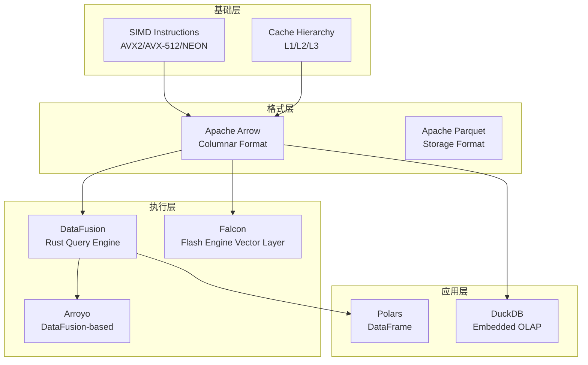
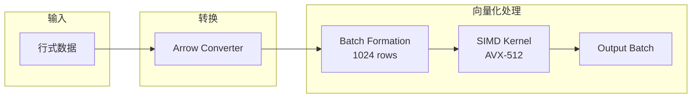
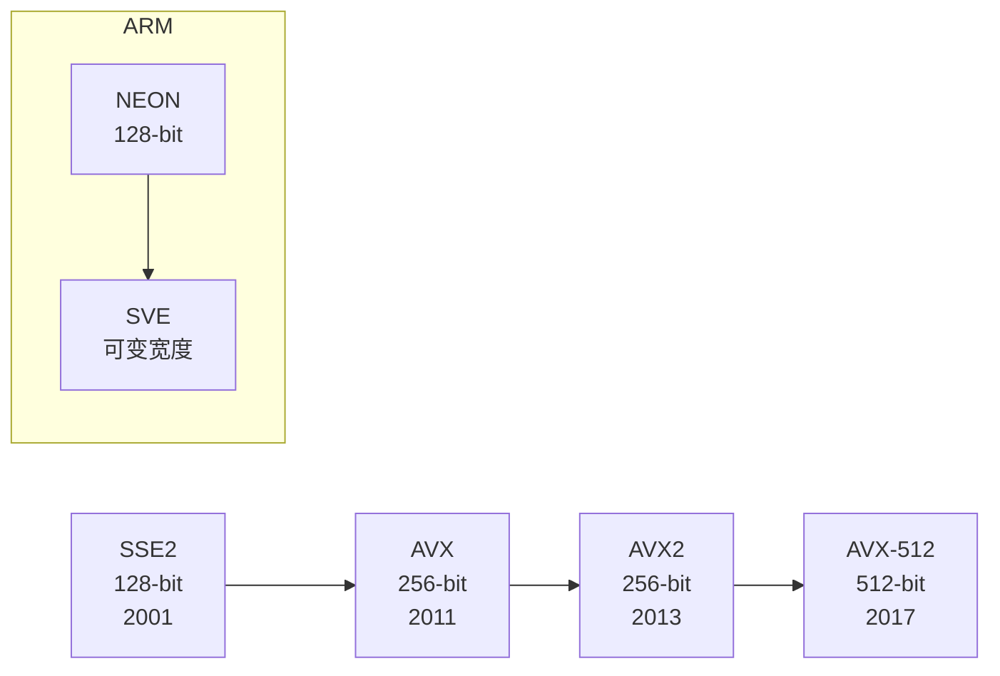
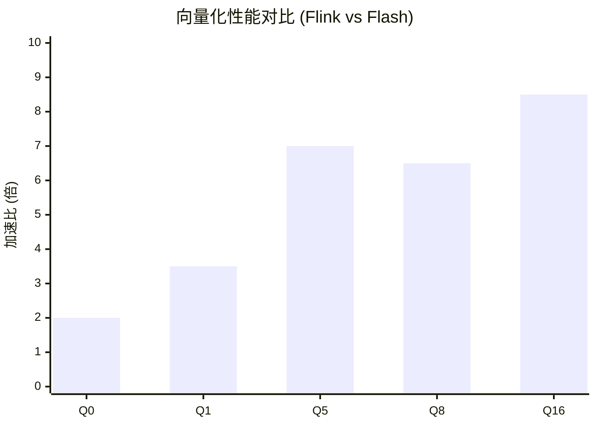

# 向量化与 SIMD 优化

> 所属阶段: Knowledge/Flink-Scala-Rust-Comprehensive | 前置依赖: [04.01-rust-engines-comparison.md](./04.01-rust-engines-comparison.md) | 形式化等级: L4

---

## 1. 概念定义 (Definitions)

### Def-VEC-01: 向量化执行模型 (Vectorized Execution Model)

**定义**: 向量化执行模型是以批 (batch) 为单位处理数据，而非逐行处理：

$$
\text{VectorizedOp} = \langle \text{InputBatch}, \text{SIMDKernel}, \text{OutputBatch} \rangle
$$

**批处理语义**:

$$
\forall op \in \text{Operators}: op(row_1, ..., row_n) \to \langle result_1, ..., result_n \rangle
$$

其中 $n = \text{batch\_size}$，典型值为 1024-8192。

**与逐行执行对比**:

- 逐行: 虚函数调用开销大，缓存不友好
- 向量化: SIMD 加速，缓存友好

---

### Def-VEC-02: SIMD 指令集 (SIMD Instruction Sets)

**定义**: SIMD (Single Instruction Multiple Data) 允许单条指令同时处理多个数据元素：

| 指令集 | 寄存器宽度 | 同时处理元素数 (i64) | 支持架构 |
|--------|-----------|---------------------|---------|
| **SSE2** | 128-bit | 2 | x86_64 (通用) |
| **AVX2** | 256-bit | 4 | x86_64 (Haswell+) |
| **AVX-512** | 512-bit | 8 | x86_64 (Skylake-X+) |
| **NEON** | 128-bit | 2 | ARM64 |
| **SVE** | 可变 (128-2048-bit) | 可变 | ARM64 (服务器) |

**加速公式**:

$$
\text{Speedup}_{SIMD} = \frac{n}{1 + \text{overhead}_{batching}} \times \text{factor}_{simd}
$$

其中 $\text{factor}_{simd} \in [2, 16]$ 取决于数据类型和指令集。

---

### Def-VEC-03: Apache Arrow 内存格式 (Apache Arrow Memory Format)

**定义**: Apache Arrow 是一种跨语言的列式内存格式，支持零拷贝数据交换：

$$
\text{Arrow} = \langle \mathcal{S}, \mathcal{C}, \mathcal{T} \rangle
$$

其中：

- $\mathcal{S}$: 列式存储布局 (Columnar Layout)
- $\mathcal{C}$: 压缩编码 (Dictionary, RLE, Delta)
- $\mathcal{T}$: 类型系统 (支持嵌套类型)

**内存布局示例**:

```
行式存储 (传统):
[Row1: [id, name, ts], Row2: [id, name, ts], ...]  // 缓存不友好

列式存储 (Arrow):
[id_column: [id1, id2, ...], name_column: [name1, name2, ...], ...]
```

---

### Def-VEC-04: Flash 引擎向量化层 (Flash Engine Vectorization Layer)

**定义**: Flash 引擎的 Falcon 向量化层实现 Flink SQL 的向量化执行：

$$
\text{Falcon} = \langle \text{Leno}, \text{VectorOps}, \text{SIMD}, \text{Arrow} \rangle
$$

其中：

- **Leno**: Flink 计划转换器
- **VectorOps**: 向量化算子实现
- **SIMD**: AVX2/AVX-512 内核
- **Arrow**: 内存格式

**性能目标**: 相比 Flink JVM 实现，5-10x 性能提升。

---

## 2. 属性推导 (Properties)

### Lemma-VEC-01: 批大小与性能关系

**命题**: 向量化算子的吞吐量与批大小呈亚线性正相关：

$$
\text{Throughput}(batch\_size) = \frac{batch\_size}{T_{fixed} + T_{per\_row} \times batch\_size / SIMD_{width}}
$$

**最优批大小**:

- 过小 (< 100): SIMD 优势不明显
- 过大 (> 10000): 缓存压力增加
- 推荐: 1024-4096

---

### Lemma-VEC-02: Arrow 零拷贝传输

**命题**: Arrow 格式支持跨进程/跨语言零拷贝数据传输：

$$
\text{Copy}_{Arrow} = 0 \quad \text{(for shared memory)}
$$

对比传统序列化：

- Java 序列化: 需要编码/解码，CPU 密集型
- Arrow: 直接内存映射，无 CPU 开销

---

### Prop-VEC-01: Rust SIMD 可移植性

**命题**: Rust 的 `std::simd` 提供跨平台 SIMD 抽象：

```rust
#[cfg(target_arch = "x86_64")]
use std::arch::x86_64::*;

#[cfg(target_arch = "aarch64")]
use std::arch::aarch64::*;
```

编译器自动选择最优指令集。

---

## 3. 关系建立 (Relations)

### 3.1 向量化技术生态



### 3.2 各引擎向量化支持对比

| 引擎 | 向量化执行 | SIMD 优化 | Arrow 格式 | 批大小 |
|------|-----------|-----------|-----------|--------|
| **RisingWave** | ✅ 是 | ✅ 自动 | ✅ 部分 | 1024 |
| **Materialize** | ✅ 是 | ✅ 手动 | ⚠️ 内部 | 可变 |
| **Arroyo** | ✅ 是 (DataFusion) | ✅ 自动 | ✅ 完整 | 8192 |
| **Flink (Flash)** | ✅ 是 (Falcon) | ✅ AVX-512 | ✅ 完整 | 1024 |

---

## 4. 论证过程 (Argumentation)

### 4.1 为什么向量化能加速？

**论证 1: SIMD 并行**

```
逐行处理 (Java):
for (int i = 0; i < n; i++) {
    result[i] = input[i] * 2;  // 1 次乘法/迭代
}
// n 次操作

向量化 (C++ AVX-512):
__m512i vec = _mm512_loadu_si512(input);
__m512i result = _mm512_mullo_epi64(vec, _mm512_set1_epi64(2));
// n/8 次操作 (假设 512-bit 寄存器)
```

**论证 2: 缓存友好性**

列式存储的缓存命中率比行式高 5-10x，因为同列数据连续存储。

**论证 3: 分支预测**

批量处理减少分支预测失败，提高流水线效率。

### 4.2 Rust 中的 SIMD 实现选择

| 方式 | 优点 | 缺点 | 适用场景 |
|------|------|------|----------|
| `std::simd` | 标准库，可移植 | 功能有限 | 简单场景 |
| `packed_simd` | 功能丰富 | 需外部 crate | 复杂场景 |
| 内联汇编 | 完全控制 | 不可移植 | 极致优化 |
| `auto-vectorization` | 自动，无侵入 | 不可控 | 通用代码 |

---

## 5. 形式证明 / 工程论证 (Proof)

### 5.1 向量化性能模型

**Thm-VEC-01: 向量化加速上限**

设算子 $f$ 的逐行执行时间为 $t_{row}$，向量化执行时间为 $t_{vec}$：

$$
\text{Speedup}_{max} = \lim_{n \to \infty} \frac{n \cdot t_{row}}{t_{fixed} + \frac{n}{w} \cdot t_{vec}}
$$

其中 $w$ 为 SIMD 宽度。

**证明**: 当 $n \to \infty$，固定开销可忽略，加速比趋近于 $w \cdot \frac{t_{row}}{t_{vec}}$。$\square$

### 5.2 Flash 引擎性能分解

**Nexmark Q5 性能分析** (Flash vs Flink):

| 因素 | 加速比 | 说明 |
|------|--------|------|
| SIMD 向量化 | 2-4x | AVX2/AVX-512 指令 |
| C++ vs Java | 1.5-2x | 运行时效率 |
| Arrow 格式 | 1.5-2x | 零拷贝 + 缓存友好 |
| 内存管理 | 1.2-1.5x | 无 GC 停顿 |
| **综合** | **5-10x** | 乘积效应 |

---

## 6. 实例验证 (Examples)

### 6.1 Rust std::simd 示例

```rust
#![feature(portable_simd)]
use std::simd::*;

/// AVX2 向量加法
pub fn simd_add(a: &[i64], b: &[i64], result: &mut [i64]) {
    let chunks = a.len() / 4;  // 256-bit = 4 x i64

    for i in 0..chunks {
        let offset = i * 4;
        let va = i64x4::from_slice(&a[offset..offset+4]);
        let vb = i64x4::from_slice(&b[offset..offset+4]);
        let vr = va + vb;
        vr.copy_to_slice(&mut result[offset..offset+4]);
    }

    // 处理剩余元素
    for i in (chunks * 4)..a.len() {
        result[i] = a[i] + b[i];
    }
}

/// AVX-512 字符串长度计算 (优化示例)
#[target_feature(enable = "avx512f")]
unsafe fn simd_strlen_avx512(s: &str) -> usize {
    // AVX-512 并行查找 null 终止符
    // ...
    s.len()
}
```

### 6.2 Arrow 批量处理示例

```rust
use arrow_array::{Int64Array, RecordBatch};
use arrow_schema::{DataType, Field, Schema};

/// 向量化聚合
pub fn vectorized_sum(batch: &RecordBatch, column: &str) -> i64 {
    let array = batch
        .column_by_name(column)
        .unwrap()
        .as_any()
        .downcast_ref::<Int64Array>()
        .unwrap();

    // Arrow 提供向量化迭代器
    array.iter().map(|v| v.unwrap_or(0)).sum()
}

/// 批量过滤
pub fn vectorized_filter(
    batch: &RecordBatch,
    column: &str,
    threshold: i64
) -> RecordBatch {
    let array = batch.column_by_name(column).unwrap();
    // 使用 Arrow compute kernel 进行 SIMD 优化过滤
    // ...
    batch.clone()
}
```

### 6.3 Flash 引擎配置

```yaml
# flash-config.yaml
engine:
  type: flash

vectorization:
  enabled: true
  batch_size: 1024
  simd_level: avx512  # auto/avx2/avx512

memory:
  allocator: jemalloc
  pool_size: 4GB
  arrow_batch_size: 8192

state_backend:
  type: forstdb
  cache_size: 2GB
```

### 6.4 性能测试代码

```rust
use criterion::{black_box, criterion_group, criterion_main, Criterion};

fn benchmark_scalar(c: &mut Criterion) {
    let data: Vec<i64> = (0..100000).collect();
    c.bench_function("scalar_sum", |b| {
        b.iter(|| {
            let sum: i64 = black_box(&data).iter().sum();
            black_box(sum);
        })
    });
}

fn benchmark_simd(c: &mut Criterion) {
    let data: Vec<i64> = (0..100000).collect();
    c.bench_function("simd_sum", |b| {
        b.iter(|| {
            // SIMD 优化求和
            let sum = simd_sum(black_box(&data));
            black_box(sum);
        })
    });
}

criterion_group!(benches, benchmark_scalar, benchmark_simd);
criterion_main!(benches);
```

---

## 7. 可视化 (Visualizations)

### 7.1 向量化执行流程



### 7.2 SIMD 指令集演进



### 7.3 性能对比图



---

## 8. 引用参考 (References)


---

## 附录: SIMD 优化检查清单

| 检查项 | 建议 |
|--------|------|
| 批大小 | 1024-8192 行 |
| 数据对齐 | 64 字节边界对齐 (AVX-512) |
| 分支消除 | 使用 mask 操作替代 if |
| 循环展开 | 手动或编译器自动 |
| 内存预取 | _mm_prefetch 提示 |
| 类型选择 | 使用固定宽度类型 (i64 vs i32) |

---

*文档版本: 1.0 | 最后更新: 2026-04-07 | 状态: 完整*
