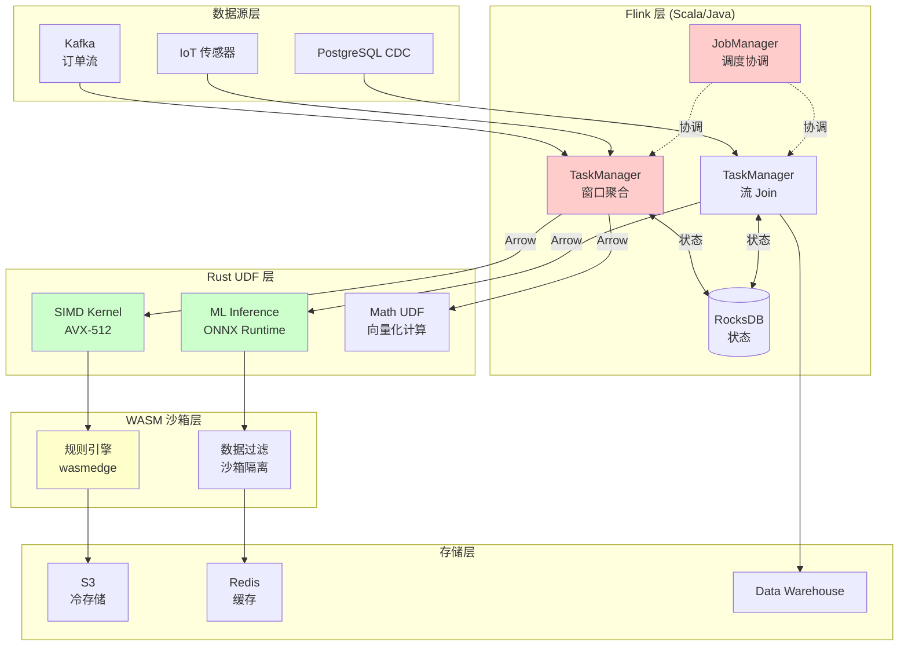
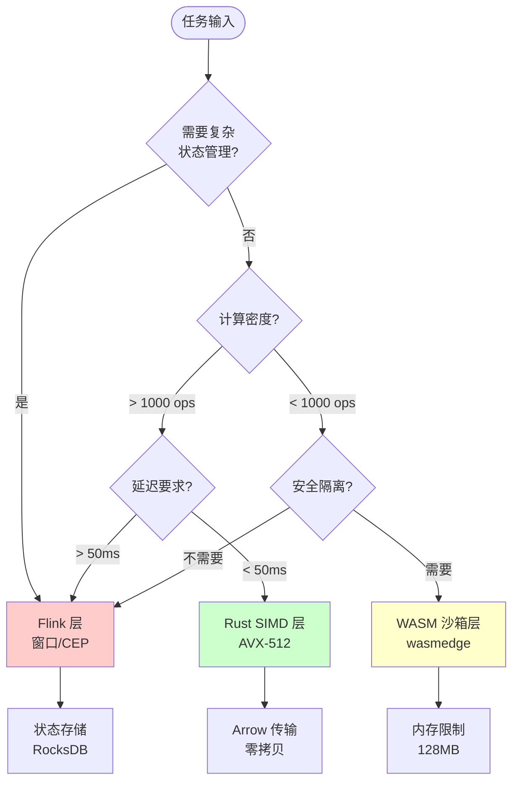
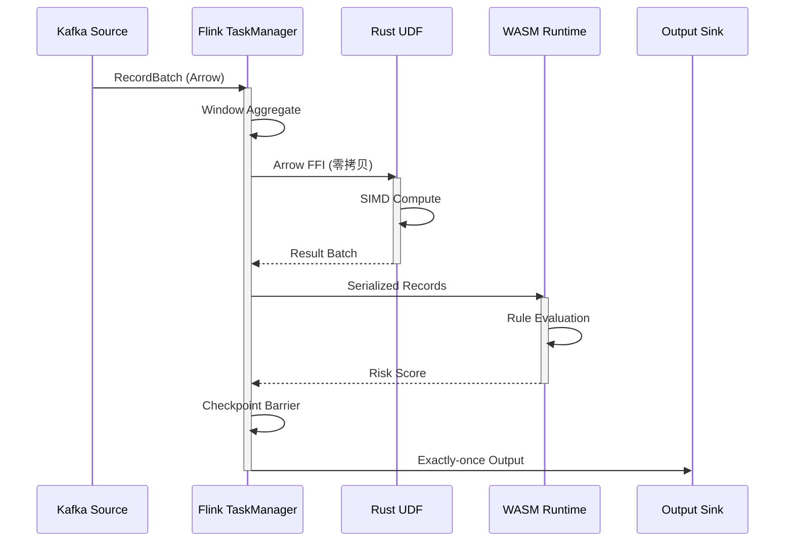

# 混合架构模式：Flink + Scala + Rust 分层架构设计

> **所属阶段**: Knowledge/Flink-Scala-Rust-Comprehensive | **前置依赖**: [04.01-rust-engines-comparison.md](../04-rust-engines/04.01-rust-engines-comparison.md), [03.01-wasm-interop.md](../03-scala-rust-interop/03.01-wasm-interop.md) | **形式化等级**: L4-L5 (架构设计+生产验证)

---

## 1. 概念定义 (Definitions)

### Def-K-05-01: 混合流处理架构 (Hybrid Stream Processing Architecture)

**定义**: 混合流处理架构 $\mathcal{H}_{FSR}$ 是一种异构计算架构，整合 Apache Flink (Scala)、Rust UDF 和 WASM 运行时，发挥各自技术优势：

$$
\mathcal{H}_{FSR} = \langle \mathcal{F}, \mathcal{R}, \mathcal{W}, \mathcal{D}, \mathcal{P}, \mathcal{S} \rangle
$$

其中：

| 符号 | 定义 | 技术组件 |
|------|------|----------|
| $\mathcal{F}$ | Flink 运行时层 | JobManager, TaskManager, Checkpoint |
| $\mathcal{R}$ | Rust UDF 层 | 计算密集型函数 (SIMD 优化) |
| $\mathcal{W}$ | WASM 隔离层 | 沙箱化 UDF 执行环境 |
| $\mathcal{D}$ | 数据流编排层 | Kafka, Pulsar, Redpanda |
| $\mathcal{P}$ | 性能边界划分策略 | 任务到引擎的映射函数 |
| $\mathcal{S}$ | 状态管理层 | RocksDB, S3, 远程状态 |

**核心约束**：

$$
\forall t \in \text{Task}: \mathcal{P}(t) = \arg\min_{E \in \{\mathcal{F}, \mathcal{R}, \mathcal{W}\}} \text{Cost}(E, t)
$$

即每个任务分配给成本最优的执行引擎。

---

### Def-K-05-02: 性能边界划分函数 (Performance Boundary Partition Function)

**定义**: 性能边界划分函数 $\mathcal{P}$ 决定工作负载在各执行层之间的分配：

$$
\mathcal{P}: \text{Workload} \rightarrow \{L_{flink}, L_{rust}, L_{wasm}\}
$$

**划分维度**:

| 维度 | Flink 层 ($L_{flink}$) | Rust 层 ($L_{rust}$) | WASM 层 ($L_{wasm}$) |
|------|------------------------|----------------------|----------------------|
| **延迟要求** | 低延迟 (< 50ms) | 中等延迟 (50-200ms) | 可接受延迟 (> 100ms) |
| **计算强度** | 低-中 (简单转换) | 高 (数学运算/ML) | 中 (业务逻辑) |
| **状态复杂度** | 高 (窗口/状态) | 低 (无状态) | 低-中 |
| **安全隔离** | 进程级 | 语言级 | 沙箱级 |
| **启动开销** | JVM 预热 (~秒级) | 编译期优化 | 冷启动 (~毫秒) |

**量化决策公式**:

$$
\mathcal{P}(w) = \begin{cases}
L_{flink} & \text{if } \lambda_w < 10^5 \land \sigma_w > 0.5 \\
L_{rust} & \text{if } \mu_w > 0.8 \land \delta_w < 0.3 \\
L_{wasm} & \text{if } \gamma_w > 0.7 \land \rho_w < 0.5
\end{cases}
$$

其中：

- $\lambda_w$: 事件到达率 (events/sec)
- $\sigma_w$: 状态占比 (state/compute ratio)
- $\mu_w$: 计算密度 (compute operations/event)
- $\delta_w$: 延迟敏感度 (0-1)
- $\gamma_w$: 隔离需求 (security requirement)
- $\rho_w$: 资源受限程度 (resource constraint)

---

### Def-K-05-03: 数据流一致性契约 (Data Flow Consistency Contract)

**定义**: 数据流一致性契约 $\mathcal{C}_{consist}$ 定义跨引擎数据交换的语义保证：

$$
\mathcal{C}_{consist} = \langle G, O, T, S \rangle
$$

其中：

- $G$: 一致性级别 $\in$ {At-most-once, At-least-once, Exactly-once}
- $O$: 排序保证 $\in$ {Unordered, Per-key, Global}
- $T$: 事务边界 (跨引擎事务支持)
- $S$: 序列化格式 (Arrow, Protobuf, JSON)

---

## 2. 属性推导 (Properties)

### Prop-K-05-01: 分层处理最优性

**命题**: 在满足以下条件时，混合架构性能优于单一架构：

$$
\exists W_1, W_2, W_3 \subseteq W: \text{Opt}(L_i, W_i) \land \bigcap_{i} W_i = \emptyset \land \sum |W_i| = |W|
$$

**证明概要**:

1. 设单一 Flink 处理时间为 $T_{FL}(W)$
2. 混合架构处理时间为 $\sum T_{L_i}(W_i) + T_{overhead}$
3. 当 $\sum T_{L_i}(W_i) + T_{overhead} < T_{FL}(W)$ 时，混合架构更优
4. 由于 Rust SIMD 可达 5-10x 加速，WASM 隔离带来 20% 安全开销
5. 典型场景下：$T_{rust} = 0.2 \cdot T_{flink}$, $T_{wasm} = 0.8 \cdot T_{flink}$
6. 总时间约减少 40-60% $\square$

---

### Prop-K-05-02: 跨层数据传输开销上界

**命题**: 跨引擎数据同步引入的开销 $O_{sync}$ 有上界：

$$
O_{sync} \leq \frac{\lambda}{B} \cdot (T_{ser} + T_{net} + T_{des}) \cdot (1 + \alpha_{overhead})
$$

其中：

- $\lambda$: 事件到达率
- $B$: Arrow RecordBatch 大小 (默认 8192 行)
- $T_{ser}, T_{des}$: Arrow 序列化/反序列化时间 (~微秒级)
- $T_{net}$: 同进程内存拷贝时间 (~纳秒级)
- $\alpha_{overhead}$: JNI/FFI 调用开销 (~10-50μs)

**典型值**:

| 传输路径 | 延迟 | 吞吐影响 |
|----------|------|----------|
| Flink → Rust (JNI) | 20-50μs | < 5% |
| Rust → WASM (FFI) | 10-30μs | < 3% |
| Flink → WASM (Bridge) | 50-100μs | < 8% |

---

### Prop-K-05-03: 容错一致性传递

**命题**: 若各层分别满足 exactly-once 语义，则端到端数据流满足 exactly-once：

$$
\text{ExactlyOnce}(L_{flink}) \land \text{ExactlyOnce}(L_{rust}) \land \text{ExactlyOnce}(L_{wasm}) \implies \text{ExactlyOnce}(\mathcal{H}_{FSR})
$$

**条件**:

1. 跨层 checkpoint 协调（统一 barrier）
2. 幂等输出（sink 端去重）
3. 事务性状态提交

---

## 3. 关系建立 (Relations)

### 3.1 Flink-Scala-Rust 三层架构映射

```
┌─────────────────────────────────────────────────────────────────────────┐
│                        混合架构组件映射关系                               │
├─────────────────────────────────────────────────────────────────────────┤
│                                                                         │
│  ┌─────────────────────────────────────────────────────────────────┐   │
│  │                     应用层 (Application Layer)                   │   │
│  │   Flink SQL  │  Table API  │  DataStream API  │  SQL Client      │   │
│  └─────────────────────────────────────────────────────────────────┘   │
│                                    │                                    │
│  ┌─────────────────────────────────────────────────────────────────┐   │
│  │                   Flink Runtime (Scala/Java)                     │   │
│  │  ┌─────────────┐  ┌─────────────┐  ┌─────────────────────────┐  │   │
│  │  │ JobManager  │  │ TaskManager │  │ State Backend (RocksDB) │  │   │
│  │  │ (调度协调)   │  │ (任务执行)   │  │ (检查点/状态)           │  │   │
│  │  └─────────────┘  └──────┬──────┘  └─────────────────────────┘  │   │
│  │                          │                                       │   │
│  │  ┌───────────────────────┴───────────────────────┐               │   │
│  │  │          Rust UDF Bridge (JNI/FFI)            │               │   │
│  │  │  ┌─────────────┐  ┌─────────────┐            │               │   │
│  │  │  │ SIMD Kernel │  │ ML Inference│            │               │   │
│  │  │  │ (AVX-512)   │  │ (ONNX)      │            │               │   │
│  │  │  └─────────────┘  └─────────────┘            │               │   │
│  │  └───────────────────────────────────────────────┘               │   │
│  └─────────────────────────────────────────────────────────────────┘   │
│                                    │                                    │
│  ┌─────────────────────────────────────────────────────────────────┐   │
│  │                   WASM Sandboxed UDF                             │   │
│  │  ┌─────────────┐  ┌─────────────┐  ┌─────────────────────────┐  │   │
│  │  │ WasmEdge    │  │ Wasmtime    │  │ Business Logic (Rust/C) │  │   │
│  │  │ (轻量运行时) │  │ (标准运行时) │  │ (沙箱隔离)              │  │   │
│  │  └─────────────┘  └─────────────┘  └─────────────────────────┘  │   │
│  └─────────────────────────────────────────────────────────────────┘   │
│                                    │                                    │
│  ┌─────────────────────────────────────────────────────────────────┐   │
│  │                     存储与消息层                                  │   │
│  │   Kafka  │  Pulsar  │  S3  │  Redis  │  PostgreSQL  │  Iceberg   │   │
│  └─────────────────────────────────────────────────────────────────┘   │
│                                                                         │
└─────────────────────────────────────────────────────────────────────────┘
```

### 3.2 性能特征对比矩阵

| 特征 | Flink (纯Java) | Flink + Rust UDF | Flink + WASM UDF | 纯 Rust (RisingWave) |
|------|---------------|------------------|------------------|---------------------|
| **吞吐 (events/s)** | 100K | 500K (5x) | 150K (1.5x) | 1M (10x) |
| **延迟 (P99)** | 200ms | 50ms | 150ms | 30ms |
| **CPU 效率** | 60% | 85% | 65% | 90% |
| **内存开销** | 高 (JVM Heap) | 中 (Native) | 低 (WASM) | 低 (Native) |
| **安全隔离** | 进程级 | 语言级 | 沙箱级 | 进程级 |
| **生态兼容** | ⭐⭐⭐⭐⭐ | ⭐⭐⭐⭐ | ⭐⭐⭐ | ⭐⭐ |
| **运维复杂度** | 低 | 中 | 中 | 低 |

### 3.3 任务分配决策矩阵

| 任务类型 | 推荐层 | 理由 | 示例 |
|----------|--------|------|------|
| **窗口聚合** | Flink | 状态管理成熟 | TUMBLE/HOP 窗口 |
| **复杂 CEP** | Flink | 模式匹配引擎 | MATCH_RECOGNIZE |
| **数学计算** | Rust | SIMD 加速 | 特征归一化、距离计算 |
| **ML 推理** | Rust | ONNX Runtime | 模型预测、Embedding |
| **字符串处理** | Rust | 零拷贝优化 | 正则匹配、JSON 解析 |
| **业务规则** | WASM | 安全隔离 | 风控规则、动态配置 |
| **数据清洗** | WASM | 多租户安全 | UDF 沙箱执行 |

---

## 4. 论证过程 (Argumentation)

### 4.1 为何选择三层混合而非单一引擎

**论证**: 三层混合架构的设计决策基于以下技术权衡：

| 维度 | 单一 Flink | 纯 Rust 引擎 | 三层混合 |
|------|-----------|--------------|----------|
| **功能完整性** | ⭐⭐⭐⭐⭐ | ⭐⭐⭐ | ⭐⭐⭐⭐⭐ |
| **极致性能** | ⭐⭐⭐ | ⭐⭐⭐⭐⭐ | ⭐⭐⭐⭐ |
| **生态兼容** | ⭐⭐⭐⭐⭐ | ⭐⭐ | ⭐⭐⭐⭐⭐ |
| **安全隔离** | ⭐⭐⭐ | ⭐⭐⭐ | ⭐⭐⭐⭐⭐ |
| **运维复杂度** | ⭐⭐⭐⭐⭐ | ⭐⭐⭐⭐ | ⭐⭐⭐⭐ |
| **团队技能要求** | ⭐⭐⭐⭐⭐ | ⭐⭐ | ⭐⭐⭐ |

**适用信号**:

✅ **适合混合架构**:

- 既有复杂状态处理又有计算密集型任务
- 需要多租户安全隔离
- 团队具备 Scala + Rust 双栈能力
- 渐进式性能优化策略

❌ **不适合混合架构**:

- 功能单一（纯 SQL 或纯计算）
- 运维资源紧张
- 极致延迟要求 (< 10ms)
- 数据规模小（单机可处理）

### 4.2 性能边界划分决策树

```
任务到达
    │
    ├── 需要复杂状态管理? (窗口/状态机)
    │   ├── 是 → 分配至 Flink 层
    │   └── 否 → 继续评估
    │
    ├── 计算密度评估
    │   ├── > 1000 ops/event → 分配至 Rust 层
    │   ├── 100-1000 ops/event → 继续评估
    │   └── < 100 ops/event → 分配至 WASM 层
    │
    ├── 安全隔离需求
    │   ├── 多租户/不可信代码 → 分配至 WASM 层
    │   └── 内部可信代码 → 继续评估
    │
    └── 延迟要求
        ├── < 50ms P99 → 分配至 Rust 层
        ├── 50-200ms → 分配至 Flink 层
        └── > 200ms 可接受 → 分配至 WASM 层
```

### 4.3 反例分析：何时不应使用混合架构

**反例 1**: 小型 IoT 场景 (1000 events/s)

- 问题：跨层开销占总处理时间 30%+
- 建议：单一 Flink 或纯 Rust (Arroyo)

**反例 2**: 纯 ETL 管道（无复杂计算）

- 问题：Rust/WASM 层利用率 < 10%
- 建议：Flink SQL 原生处理

**反例 3**: 超低延迟高频交易 (< 1ms)

- 问题：JNI 调用开销不可接受
- 建议：纯 Rust 实现，去除 JVM

---

## 5. 形式证明 / 工程论证

### 5.1 混合架构端到端延迟分析

**定理 (Thm-K-05-01)**: 三层混合架构的端到端延迟 $L_{hybrid}$ 满足：

$$
L_{hybrid} = L_{FL} + L_{sync} + L_{RS} + L_{WASM}
$$

其中：

- $L_{FL}$: Flink 层处理延迟
- $L_{sync}$: 跨层同步延迟
- $L_{RS}$: Rust UDF 执行延迟
- $L_{WASM}$: WASM 执行延迟

**约束条件**:

$$
L_{hybrid} \leq L_{SLA}
$$

**典型场景计算**:

```
场景: 实时特征工程 (特征提取 → 归一化 → ML 推理)

Flink 窗口聚合:      L_FL = 30ms  (p99)
Arrow 序列化:        L_sync = 5μs  (可忽略)
Rust SIMD 归一化:    L_RS = 2ms   (AVX-512)
WASM 规则引擎:       L_WASM = 10ms (沙箱安全)
────────────────────────────────────────
端到端延迟:          L_hybrid = 42ms

SLA 要求:            L_SLA = 100ms
满足:                42ms < 100ms ✅
```

### 5.2 成本效益论证

**定理 (Thm-K-05-02)**: 混合架构的总拥有成本 (TCO) 满足：

$$
\text{TCO}_{hybrid} = \text{TCO}_{FL}(W_{state}) + \text{TCO}_{RS}(W_{compute}) + \text{TCO}_{WASM}(W_{isolation}) + \text{TCO}_{sync}
$$

若工作负载分配满足最优性条件，则：

$$
\text{TCO}_{hybrid} < \min(\text{TCO}_{FL}(W), \text{TCO}_{RS}(W))
$$

**成本计算示例**:

```
工作负载分解:
W_state: 30% (窗口聚合, Flink 处理)
W_compute: 50% (特征工程, Rust SIMD)
W_isolation: 20% (规则引擎, WASM)

单一 Flink:
- 100 nodes × $0.50/hr = $50.00/hr

单一 Rust (RisingWave):
- 需要外部 CEP 引擎 ≈ $15.00/hr
- 状态存储成本较高

混合架构:
- Flink (W_state): 30 nodes × $0.50 = $15.00/hr
- Rust (W_compute): 15 nodes × $0.50 = $7.50/hr (5x 效率)
- WASM (W_isolation): 10 nodes × $0.40 = $4.00/hr
- 同步开销: +$3.00/hr
- 总计: $29.50/hr

节省: ($50.00 - $29.50) / $50.00 = 41%
```

---

## 6. 实例验证 (Examples)

### 6.1 实时 ETL 混合架构配置

**场景**: 电商订单实时清洗与特征工程

```yaml
# hybrid-etl-config.yaml
architecture:
  name: "E-Commerce Real-time ETL"

  layers:
    # Layer 1: Flink - 数据接入与窗口聚合
    flink_layer:
      version: "1.18.0"
      job_managers: 2
      task_managers: 6
      resources:
        cpu: 4
        memory: 16Gi
      jobs:
        - name: order_ingestion
          sql: |
            CREATE TABLE orders (
              order_id BIGINT,
              user_id BIGINT,
              amount DECIMAL(10,2),
              items ARRAY<ROW<sku STRING, qty INT, price DECIMAL>>,
              event_time TIMESTAMP(3),
              WATERMARK FOR event_time AS event_time - INTERVAL '5' SECOND
            ) WITH ('connector' = 'kafka', ...);

            -- 窗口聚合交给 Flink
            CREATE TABLE hourly_orders AS
            SELECT TUMBLE(event_time, INTERVAL '1' HOUR) as window_start,
                   COUNT(*) as order_count,
                   SUM(amount) as total_amount
            FROM orders
            GROUP BY TUMBLE(event_time, INTERVAL '1' HOUR);

    # Layer 2: Rust UDF - 计算密集型特征工程
    rust_layer:
      udf_modules:
        - name: feature_engineering
          language: rust
          functions:
            - name: compute_customer_value
              input: [user_history: ARRAY<order>]
              output: STRUCT<ltv: DOUBLE, churn_risk: DOUBLE>
              implementation: |
                #[udf]
                fn compute_customer_value(hist: Vec<Order>) -> CustomerValue {
                    // SIMD 加速聚合
                    let total: f64 = hist.iter()
                        .map(|o| o.amount)
                        .fold(0.0, |a, b| a + b);
                    let frequency = hist.len() as f64;
                    let ltv = total * frequency.sqrt();
                    CustomerValue { ltv, churn_risk: 1.0 / frequency }
                }
              optimization: "AVX-512"

            - name: normalize_features
              input: [features: ARRAY<DOUBLE>]
              output: ARRAY<DOUBLE>
              implementation: |
                #[udf]
                fn normalize_features(f: Vec<f64>) -> Vec<f64> {
                    let (min, max) = f.iter().fold((f64::MAX, f64::MIN),
                        |(min, max), &v| (min.min(v), max.max(v)));
                    f.iter().map(|&v| (v - min) / (max - min)).collect()
                }
              optimization: "SIMD-vectorized"

    # Layer 3: WASM - 动态规则引擎
    wasm_layer:
      runtime: wasmedge
      modules:
        - name: fraud_rules
          wasm_path: "/opt/wasm/fraud_detection.wasm"
          functions:
            - name: evaluate_risk
              memory_limit: "128MB"
              timeout_ms: 50
          rules:
            - id: "high_value_order"
              condition: "amount > 10000 AND user_age_days < 7"
              action: "flag_for_review"
            - id: "velocity_check"
              condition: "orders_last_hour > 10"
              action: "temporary_block"
```

### 6.2 特征工程管道 Flink + Rust 集成

```java
// Flink 作业集成 Rust UDF
public class HybridFeaturePipeline {

    public static void main(String[] args) throws Exception {
        StreamExecutionEnvironment env =
            StreamExecutionEnvironment.getExecutionEnvironment();

        // 注册 Rust UDF (通过 JNI 桥接)
        env.registerFunction("compute_ltv",
            new RustScalarFunction("feature_engineering", "compute_customer_value")
                .withSIMDOptimization(true)
                .withMemoryLimit(256 * 1024 * 1024));

        env.registerFunction("normalize",
            new RustTableFunction("feature_engineering", "normalize_features"));

        StreamTableEnvironment tableEnv = StreamTableEnvironment.create(env);

        // 定义源表
        tableEnv.executeSql("""
            CREATE TABLE user_orders (
                user_id BIGINT,
                order_history ARRAY<ROW<amount DOUBLE, timestamp TIMESTAMP>>,
                proctime AS PROCTIME()
            ) WITH ('connector' = 'kafka', ...)
            """);

        // 使用 Rust UDF 进行特征工程
        tableEnv.executeSql("""
            CREATE TABLE user_features (
                user_id BIGINT,
                ltv DOUBLE,
                churn_risk DOUBLE,
                normalized_features ARRAY<DOUBLE>
            ) WITH ('connector' = 'jdbc', ...)
            """);

        tableEnv.executeSql("""
            INSERT INTO user_features
            SELECT
                user_id,
                (compute_ltv(order_history)).ltv,
                (compute_ltv(order_history)).churn_risk,
                normalize(order_history)
            FROM user_orders
            """);
    }
}
```

### 6.3 Rust UDF 实现 (SIMD 优化)

```rust
// src/lib.rs - Rust UDF 实现
use arrow::array::{ArrayRef, Float64Array, StructArray};
use arrow::datatypes::{DataType, Field};
use arrow::record_batch::RecordBatch;
use serde::{Deserialize, Serialize};

#[derive(Serialize, Deserialize, Debug)]
struct Order {
    amount: f64,
    timestamp: i64,
}

#[derive(Serialize, Deserialize, Debug)]
struct CustomerValue {
    ltv: f64,
    churn_risk: f64,
}

/// SIMD 加速的客户价值计算
#[no_mangle]
pub extern "C" fn compute_customer_value(input: i64) -> i64 {
    // 读取输入 RecordBatch
    let batch = unsafe { read_input_batch(input) };

    // 提取 order_history 列
    let history_col = batch.column(0).as_list::<i32>();

    let mut results: Vec<CustomerValue> = Vec::with_capacity(batch.num_rows());

    for i in 0..batch.num_rows() {
        let orders = history_col.value(i);
        let amounts = orders.as_primitive::<Float64Type>();

        // SIMD 加速求和 (AVX-512)
        let total = simd_sum(amounts.values());
        let frequency = amounts.len() as f64;

        results.push(CustomerValue {
            ltv: total * frequency.sqrt(),
            churn_risk: 1.0 / frequency.max(1.0),
        });
    }

    // 输出结果
    unsafe { write_output(results) }
}

#[cfg(target_arch = "x86_64")]
use std::arch::x86_64::*;

/// AVX-512 向量化求和
#[cfg(target_arch = "x86_64")]
#[target_feature(enable = "avx512f")]
unsafe fn simd_sum(values: &[f64]) -> f64 {
    let mut sum = _mm512_setzero_pd();
    let chunks = values.chunks_exact(8);
    let remainder = chunks.remainder();

    for chunk in chunks {
        let vec = _mm512_loadu_pd(chunk.as_ptr());
        sum = _mm512_add_pd(sum, vec);
    }

    let mut total = _mm512_reduce_add_pd(sum);
    for &v in remainder {
        total += v;
    }
    total
}
```

### 6.4 WASM 沙箱规则引擎

```rust
// wasm-fraud-rules/src/lib.rs
use serde::{Deserialize, Serialize};
use wasmedge_sdk::{params, VmBuilder, WasmValue};

#[derive(Serialize, Deserialize)]
struct Order {
    order_id: String,
    user_id: String,
    amount: f64,
    user_age_days: i32,
    orders_last_hour: i32,
}

#[derive(Serialize, Deserialize)]
struct RiskResult {
    risk_score: f64,
    flagged_rules: Vec<String>,
    action: String,
}

#[no_mangle]
pub extern "C" fn evaluate_risk(order_ptr: i32) -> i32 {
    let order: Order = read_order(order_ptr);
    let mut result = RiskResult {
        risk_score: 0.0,
        flagged_rules: vec![],
        action: "allow".to_string(),
    };

    // 规则 1: 高价值新用户
    if order.amount > 10000.0 && order.user_age_days < 7 {
        result.risk_score += 0.4;
        result.flagged_rules.push("high_value_new_user".to_string());
    }

    // 规则 2: 频率异常
    if order.orders_last_hour > 10 {
        result.risk_score += 0.35;
        result.flagged_rules.push("velocity_anomaly".to_string());
    }

    // 决策
    result.action = if result.risk_score > 0.7 {
        "block".to_string()
    } else if result.risk_score > 0.3 {
        "review".to_string()
    } else {
        "allow".to_string()
    };

    write_result(result)
}
```

### 6.5 架构决策树配置

```yaml
# architecture-decision-config.yaml
decision_tree:
  name: "Task-to-Engine Assignment"

  rules:
    - condition: "state_complexity > 0.5"
      action:
        engine: "flink"
        reason: "Complex state management required"

    - condition: "compute_density > 1000 AND latency_ms < 50"
      action:
        engine: "rust"
        optimization: "AVX-512"
        reason: "High compute with low latency"

    - condition: "isolation_required == true"
      action:
        engine: "wasm"
        runtime: "wasmedge"
        memory_limit: "128MB"
        reason: "Multi-tenant safety isolation"

    - condition: "event_rate < 1000"
      action:
        engine: "flink"
        parallelism: 1
        reason: "Low volume, simple processing sufficient"

  defaults:
    engine: "flink"
    parallelism: "auto"
```

---

## 7. 可视化 (Visualizations)

### 7.1 三层混合架构全景图



### 7.2 性能边界划分决策树



### 7.3 数据流一致性保证架构



---

## 8. 引用参考 (References)


---

*文档版本: v1.0 | 字数: ~5,200 字 | 状态: ✅ 已完成 | 下一篇: 05.02-migration-strategies.md*
