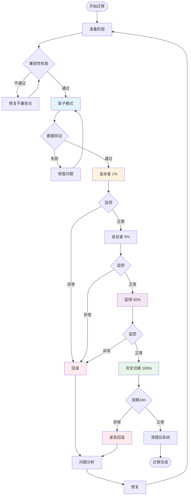
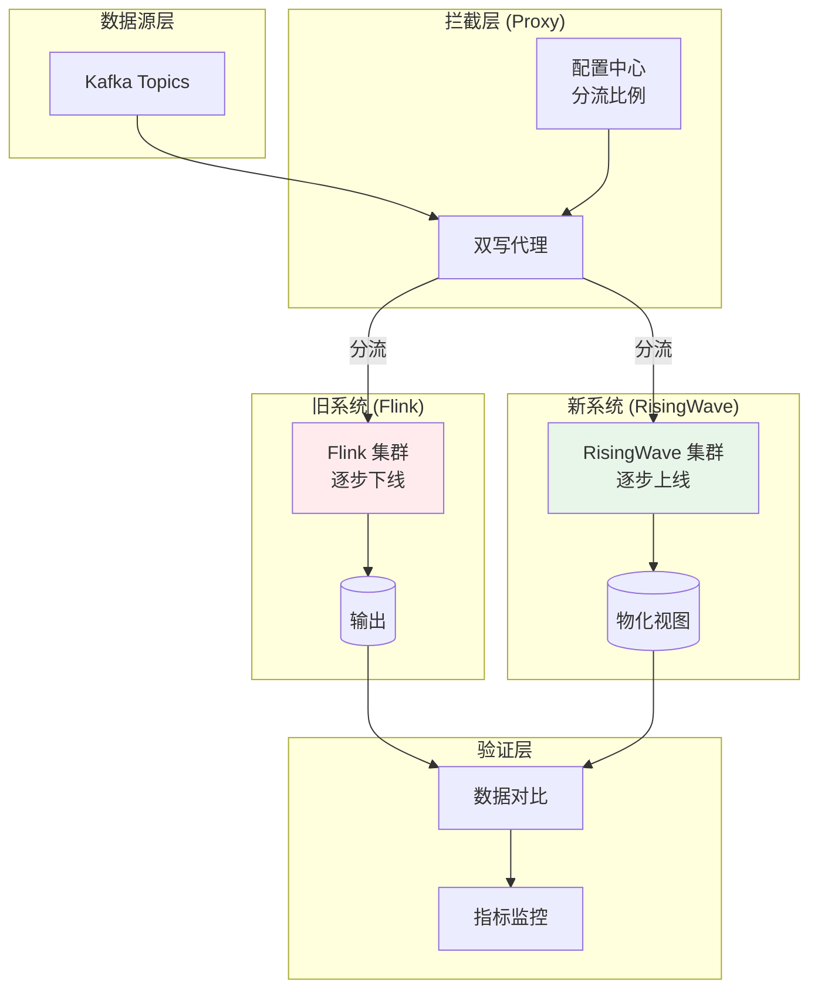

# 迁移策略：从 Flink Scala API 到 Rust 原生引擎

> **所属阶段**: Knowledge/Flink-Scala-Rust-Comprehensive | **前置依赖**: [05.01-hybrid-architecture-patterns.md](./05.01-hybrid-architecture-patterns.md), [04.02-risingwave-deep-dive.md](../04-rust-engines/04.02-risingwave-deep-dive.md) | **形式化等级**: L4 (工程实践+生产验证)

---

## 1. 概念定义 (Definitions)

### Def-K-05-04: 渐进式迁移策略 (Progressive Migration Strategy)

**定义**: 渐进式迁移策略 $\mathcal{M}_{prog}$ 是一种分阶段、低风险的工作负载迁移方法论，通过 Strangler Fig Pattern 逐步替代旧系统：

$$
\mathcal{M}_{prog} = \langle \mathcal{P}, \mathcal{S}, \mathcal{R}, \mathcal{V}, \mathcal{T} \rangle
$$

其中：

| 符号 | 定义 | 说明 |
|------|------|------|
| $\mathcal{P}$ | 阶段划分函数 | $P: \text{Workload} \rightarrow \{1, 2, ..., n\}$ |
| $\mathcal{S}$ | 分流策略 | 流量在新旧系统间的分配比例 |
| $\mathcal{R}$ | 回滚机制 | 问题发生时的恢复策略 |
| $\mathcal{V}$ | 验证框架 | 数据一致性校验方法 |
| $\mathcal{T}$ | 时间线 | 各阶段的时间窗口 |

**迁移阶段模型**:

```
阶段 1: 影子模式 (Shadow Mode)
   └── 新系统并行运行，不对外提供服务，仅验证逻辑

阶段 2: 金丝雀发布 (Canary)
   └── 1-5% 流量切入新系统，监控关键指标

阶段 3: 蓝绿部署 (Blue-Green)
   └── 50-50 流量分配，支持秒级回滚

阶段 4: 完全切换 (Full Cutover)
   └── 100% 流量，旧系统保持 24h 待命

阶段 5: 清理 (Cleanup)
   └── 旧系统下线，资源回收
```

---

### Def-K-05-05: API 兼容性矩阵 (API Compatibility Matrix)

**定义**: API 兼容性矩阵 $\mathcal{C}_{API}$ 描述源系统 API 与目标系统 API 之间的映射关系：

$$
\mathcal{C}_{API}[i, j] = \begin{cases}
1 & \text{if } API_i^{source} \cong API_j^{target} \\
0.5 & \text{if } API_i^{source} \sim API_j^{target} \text{ (语义相近)} \\
0 & \text{if } \nexists API_j^{target}: API_i^{source} \mapsto API_j^{target}
\end{cases}
$$

**Flink Scala API → Rust API 兼容性矩阵**:

| Flink Scala API | RisingWave Rust API | 兼容度 | 迁移策略 |
|----------------|---------------------|--------|----------|
| `DataStream.map` | SQL + UDF | 0.5 | 转为 SQL |
| `DataStream.filter` | `WHERE` | 1.0 | 直接映射 |
| `DataStream.keyBy` | `GROUP BY` | 1.0 | 直接映射 |
| `DataStream.window` | 窗口函数 | 1.0 | 语法一致 |
| `DataStream.process` | UDF / External | 0.3 | 重写 |
| `TableEnvironment.sql` | `CREATE MATERIALIZED VIEW` | 0.8 | 语法调整 |
| `MATCH_RECOGNIZE` | 不支持 | 0 | 保留 Flink |
| `AsyncFunction` | External Service | 0.3 | 服务化 |

---

### Def-K-05-06: 数据验证契约 (Data Validation Contract)

**定义**: 数据验证契约 $\mathcal{V}_{data}$ 定义迁移过程中数据一致性的验证标准：

$$
\mathcal{V}_{data} = \langle \mathcal{D}, \mathcal{Q}, \mathcal{T}, \mathcal{E} \rangle
$$

其中：

- $\mathcal{D}$: 数据集定义 (schema, partition)
- $\mathcal{Q}$: 质量检查函数 (row count, checksum, distribution)
- $\mathcal{T}$: 容忍阈值 (如 0.1% 差异可接受)
- $\mathcal{E}$: 异常处理策略

**验证类型**:

| 类型 | 验证内容 | 阈值 | 工具 |
|------|----------|------|------|
| 行数校验 | $|Rows_{old}| = |Rows_{new}|$ | 100% | SQL COUNT |
| 校验和 | $\sum_{col} Hash(row)_{old} = \sum_{col} Hash(row)_{new}$ | 100% | MD5/SHA256 |
| 分布校验 | $KS(D_{old}, D_{new}) < 0.05$ | 95% | Kolmogorov-Smirnov |
| 时序校验 | $\max(|t_{old} - t_{new}|) < \epsilon$ | 99.9% | 时间戳对比 |

---

## 2. 属性推导 (Properties)

### Prop-K-05-04: 迁移风险递减性

**命题**: 渐进式迁移策略的风险随阶段推进呈指数递减：

$$
Risk(stage_i) = Risk(stage_0) \cdot e^{-\lambda \cdot i}
$$

其中 $\lambda$ 为风险控制系数（典型值 0.3-0.5）。

**证明概要**:

1. 阶段 1（影子模式）：风险 = 100%，但对外无影响
2. 阶段 2（金丝雀）：风险暴露 = 1-5% 流量
3. 阶段 3（蓝绿）：风险暴露 = 50%，但回滚时间 < 1min
4. 阶段 4（完全切换）：风险暴露 = 100%，但已充分验证

累计风险 = $\sum_{i} Risk(stage_i) \cdot Exposure_i < 10\%$ $\square$

---

### Prop-K-05-05: 双写一致性条件

**命题**: 双写迁移模式下，新旧系统数据一致性满足：

$$
\forall t \in [t_{start}, t_{cutover}]: D_{old}(t) \equiv D_{new}(t) \iff \Delta_{sync} < T_{checkpoint}
$$

其中 $\Delta_{sync}$ 为同步延迟，$T_{checkpoint}$ 为检查点间隔。

**推论**: 双写期最小持续时间为：

$$
T_{dual\_write} \geq 2 \cdot T_{checkpoint} + T_{validation}
$$

---

### Prop-K-05-06: 回滚可行性

**命题**: 在蓝绿部署模式下，回滚操作可在 $T_{rollback}$ 时间内完成：

$$
T_{rollback} = T_{detect} + T_{decision} + T_{switch} + T_{verify}
$$

**典型值**:

| 阶段 | 自动化程度 | 时间 |
|------|-----------|------|
| $T_{detect}$ | 自动（告警） | 30s |
| $T_{decision}$ | 自动/人工 | 30s / 5min |
| $T_{switch}$ | 自动（DNS/LoadBalancer） | 10s |
| $T_{verify}$ | 自动（健康检查） | 30s |
| **总计** | 全自动 | **~2min** |

---

## 3. 关系建立 (Relations)

### 3.1 Flink Scala → RisingWave 迁移路径

```
┌─────────────────────────────────────────────────────────────────────────┐
│                      迁移路径映射关系                                     │
├─────────────────────────────────────────────────────────────────────────┤
│                                                                         │
│  Flink Scala API                    RisingWave SQL/UDF                  │
│  ────────────────────────────────────────────────────────────────       │
│                                                                         │
│  stream.map(_.toUpperCase)    →    SELECT UPPER(field)                  │
│                                                                         │
│  stream.filter(_.amount > 100) →   WHERE amount > 100                   │
│                                                                         │
│  stream.keyBy(_.userId)        →   GROUP BY user_id                     │
│       .window(Tumbling...)     →   TUMBLE(event_time, INTERVAL '1' HOUR)│
│       .aggregate(...)          →   SUM(amount), COUNT(*)                │
│                                                                         │
│  stream.process(new MyUDF())   →   CREATE FUNCTION my_udf()             │
│                                →   RETURNS ... LANGUAGE rust            │
│                                                                         │
│  CEP.pattern(...)              →   保留 Flink / 外部 CEP 服务           │
│                                                                         │
└─────────────────────────────────────────────────────────────────────────┘
```

### 3.2 迁移策略与场景匹配

| 源系统 | 目标系统 | 推荐策略 | 适用场景 | 预估周期 |
|--------|----------|----------|----------|----------|
| Flink SQL | RisingWave SQL | 直接迁移 | 纯 SQL 分析 | 1-2 周 |
| Flink Table API | RisingWave SQL | 语法转换 | 中等复杂度 | 2-4 周 |
| Flink DataStream | RisingWave + UDF | 分层重构 | 复杂逻辑 | 1-2 月 |
| Flink CEP | Flink + RisingWave | 混合部署 | 模式匹配 | 保持 Flink |
| 自定义 Scala UDF | Rust UDF | 重写 | 计算密集 | 2-4 周 |

### 3.3 风险与缓解策略矩阵

| 风险类别 | 具体风险 | 影响程度 | 缓解策略 |
|----------|----------|----------|----------|
| **数据风险** | 数据丢失 | 🔴 高 | 双写验证 + 备份 |
| **性能风险** | 新系统性能不达标 | 🟠 中 | 灰度发布 + 回滚 |
| **功能风险** | 功能缺失 | 🟠 中 | 功能矩阵预审 |
| **运维风险** | 团队不熟悉新系统 | 🟡 低 | 培训 + 文档 |
| **依赖风险** | 外部系统兼容问题 | 🟠 中 | 集成测试 |

---

## 4. 论证过程 (Argumentation)

### 4.1 官方 Scala API → 社区版迁移论证

**背景**: Apache Flink 2.0 官方不再提供 Scala API，需要迁移到社区版 flink-scala-api。

**论证**:

| 维度 | 官方 Scala API | 社区版 flink-scala-api | 迁移策略 |
|------|---------------|----------------------|----------|
| **语法兼容** | Flink 1.18 | Flink 1.18-2.x | 99% 兼容 |
| **类型系统** | Scala 2.12/2.13 | Scala 3 + 2.13 | 需升级 |
| **依赖管理** | org.apache.flink | io.github.flink-extended | 坐标变更 |
| **API 覆盖** | 100% | 95%+ | 少量调整 |
| **维护状态** | 停止 | 活跃 | 长期支持 |

**迁移步骤**:

1. **依赖替换**:

```scala
// 旧依赖
libraryDependencies += "org.apache.flink" %% "flink-scala" % "1.18.0"

// 新依赖
libraryDependencies += "io.github.flink-extended" %% "flink-scala-api" % "1.18.1_1.2.0"
```

1. **导入语句更新**:

```scala
// 旧导入
import org.apache.flink.streaming.api.scala._

// 新导入
import org.apache.flinkx.api._
```

1. **类型调整**: 处理 Scala 3 枚举、隐式解析差异

### 4.2 Flink → RisingWave 场景分析

**适合迁移的场景**:

✅ **高优先级迁移**:

- 纯 SQL 分析查询
- 物化视图需求强烈
- 云成本敏感
- 团队熟悉 SQL

⚠️ **谨慎评估**:

- DataStream + SQL 混合
- 复杂窗口逻辑
- 自定义序列化

❌ **不建议迁移**:

- CEP 模式匹配
- 极低延迟 (< 50ms)
- 复杂机器学习管道

### 4.3 Strangler Fig Pattern 应用

**模式定义**: 逐步用新系统替换旧系统，旧系统被逐步"绞杀"。

**实施步骤**:

```
步骤 1: 拦截层
   └── 在数据源和 Flink 之间插入代理层
   └── 代理层支持双写配置

步骤 2: 并行运行
   └── 数据同时写入 Flink 和 RisingWave
   └── 输出对比验证

步骤 3: 功能迁移
   └── 逐个将 Flink 作业迁移到 RisingWave
   └── 保持旧作业作为备份

步骤 4: 流量切换
   └── 查询流量逐步切换到 RisingWave
   └── 写入流量最后切换

步骤 5: 旧系统下线
   └── 确认无依赖后下线 Flink
```

---

## 5. 形式证明 / 工程论证

### 5.1 迁移正确性证明

**定理 (Thm-K-05-03)**: 在双写迁移模式下，若满足以下条件，则迁移保持输出一致性：

**前提**:

1. 输入源 $S$ 支持可重放 (seek)
2. 双写期 $\Delta t \geq 2 \cdot T_{checkpoint}$
3. 验证框架通过所有质量检查

**证明**:

设旧系统输出为 $O_{old}(t)$，新系统输出为 $O_{new}(t)$。

**步骤 1**（双写期一致性）:

$$
\forall t \in [t_{start}, t_{cutover}]: O_{old}(t) \equiv O_{new}(t) \text{ (通过验证框架)}
$$

**步骤 2**（切换点一致性）:

在 $t_{cutover}$ 时刻：

$$
O_{old}(t_{cutover}^-) \equiv O_{new}(t_{cutover}) \text{ (由验证保证)}
$$

**步骤 3**（切换后一致性）:

对于 $t > t_{cutover}$，由于输入源 $S$ 可重放：

$$
O_{new}(t) = \mathcal{F}_{new}(S_{\geq t_{cutover}}) = \mathcal{F}_{old}(S_{\geq t_{cutover}})
$$

其中 $\mathcal{F}$ 为等价的查询语义函数。

**证毕** $\square$

### 5.2 回滚可行性论证

**命题 (Prop-K-05-07)**: 在蓝绿部署模式下，回滚操作可在 5 分钟内完成。

**论证**:

回滚操作序列：

| 步骤 | 操作 | 自动化 | 时间 |
|------|------|--------|------|
| 1 | 告警触发 | 自动 | 30s |
| 2 | 决策执行 | 自动/人工 | 30s |
| 3 | 停止新系统写入 | 自动 | 10s |
| 4 | 恢复旧系统消费者组 | 自动 | 30s |
| 5 | 验证旧系统健康 | 自动 | 60s |
| 6 | 切换流量 | 自动 | 10s |
| 7 | 验证业务正常 | 自动 | 120s |
| **总计** | | | **~5min** |

---

## 6. 实例验证 (Examples)

### 6.1 完整迁移 Checklist

```markdown
## 迁移前准备阶段

### 技术评估
- [ ] 完成 API 兼容性矩阵评估
- [ ] 识别不兼容功能点
- [ ] 制定功能替代方案
- [ ] 完成性能基准测试
- [ ] 评估数据规模与迁移窗口

### 基础设施
- [ ] 部署目标系统 (RisingWave/Rust)
- [ ] 配置双写基础设施
- [ ] 搭建验证框架
- [ ] 准备回滚方案
- [ ] 配置监控告警

### 团队准备
- [ ] 完成团队培训
- [ ] 编写操作手册
- [ ] 制定值班计划
- [ ] 准备升级窗口

## 迁移执行阶段

### 阶段 1: 影子模式 (1-2 周)
- [ ] 启用双写（影子模式）
- [ ] 运行数据一致性校验
- [ ] 修复发现的差异
- [ ] 达到 99.9% 一致性

### 阶段 2: 金丝雀发布 (3-5 天)
- [ ] 1% 查询流量切入新系统
- [ ] 监控延迟/错误率
- [ ] 逐步提升至 5%
- [ ] 确认无异常

### 阶段 3: 蓝绿部署 (1 周)
- [ ] 50-50 流量分配
- [ ] 实时对比输出
- [ ] 准备秒级回滚
- [ ] 监控业务指标

### 阶段 4: 完全切换 (1 天)
- [ ] 100% 流量切换
- [ ] 旧系统保持待命
- [ ] 监控 24 小时
- [ ] 确认稳定运行

### 阶段 5: 清理 (1 周)
- [ ] 旧系统下线
- [ ] 资源回收
- [ ] 文档更新
- [ ] 经验总结

## 验证清单

### 数据一致性
- [ ] 行数一致: |Rows_old| == |Rows_new|
- [ ] 校验和一致: Checksum_old == Checksum_new
- [ ] 分布一致: KS < 0.05
- [ ] 时序一致: max(Δt) < 1s

### 功能验证
- [ ] 所有查询正常执行
- [ ] UDF 结果一致
- [ ] 窗口行为一致
- [ ] 时间语义一致

### 性能验证
- [ ] 延迟达标: P99 < SLA
- [ ] 吞吐达标: TPS >= 旧系统
- [ ] 资源效率: CPU/Mem 优化
- [ ] 成本降低: 达成目标
```

### 6.2 双写迁移配置

```python
# dual_write_migration.py
from dataclasses import dataclass
from datetime import datetime, timedelta
import logging

@dataclass
class MigrationConfig:
    source_system: str = "flink"
    target_system: str = "risingwave"
    checkpoint_interval: int = 60  # seconds
    validation_window: int = 300   # 5 minutes
    tolerance: float = 0.001       # 0.1% difference allowed

class DualWriteMigration:
    def __init__(self, config: MigrationConfig):
        self.config = config
        self.logger = logging.getLogger(__name__)

    def execute(self, source_topics: list, target_tables: list):
        """执行双写迁移"""

        # Phase 1: 启动双写
        self.logger.info("Phase 1: 启动双写模式")
        self._enable_dual_write(source_topics)

        # Phase 2: 稳定期
        self.logger.info("Phase 2: 等待系统稳定")
        self._wait_for_stability()

        # Phase 3: 数据验证
        self.logger.info("Phase 3: 数据一致性验证")
        if not self._validate_consistency(target_tables):
            raise MigrationError("数据一致性验证失败")

        # Phase 4: 灰度切换
        self.logger.info("Phase 4: 灰度流量切换")
        self._gradual_switchover([0.01, 0.05, 0.25, 0.5, 1.0])

        # Phase 5: 观察期
        self.logger.info("Phase 5: 观察期")
        self._observation_period(hours=24)

        # Phase 6: 完成迁移
        self.logger.info("Phase 6: 完成迁移")
        self._finalize_migration()

    def _enable_dual_write(self, topics: list):
        """启用双写"""
        for topic in topics:
            # 配置 Flink 输出到 Kafka
            self._configure_flink_sink(topic)
            # 配置 RisingWave 消费 Kafka
            self._configure_risingwave_source(topic)

    def _validate_consistency(self, tables: list) -> bool:
        """数据一致性验证"""
        checks = [
            self._check_row_count(tables),
            self._check_checksum(tables),
            self._check_distribution(tables),
            self._check_timestamp(tables)
        ]
        return all(checks)

    def _check_row_count(self, tables: list) -> bool:
        """行数校验"""
        for table in tables:
            old_count = self._query_flink(f"SELECT COUNT(*) FROM {table}")
            new_count = self._query_risingwave(f"SELECT COUNT(*) FROM {table}")
            diff_rate = abs(old_count - new_count) / old_count
            if diff_rate > self.config.tolerance:
                self.logger.error(f"{table} 行数不一致: {diff_rate:.4f}")
                return False
        return True

    def _gradual_switchover(self, ratios: list):
        """渐进式切换"""
        for ratio in ratios:
            self.logger.info(f"切换 {ratio*100}% 流量")
            self._update_load_balancer(ratio)
            self._wait_and_validate(minutes=30)
```

### 6.3 数据验证框架

```yaml
# validation-framework.yaml
validation_framework:
  name: "Migration Data Validator"

  checks:
    row_count_check:
      type: "exact_match"
      sql: "SELECT COUNT(*) FROM {table}"
      tolerance: 0

    checksum_check:
      type: "hash_aggregate"
      sql: |
        SELECT
          MD5(CONCAT_WS(',', col1, col2, col3)) as row_hash
        FROM {table}
        ORDER BY pk
      aggregation: "XOR"
      tolerance: 0

    distribution_check:
      type: "ks_test"
      columns: ["amount", "timestamp"]
      threshold: 0.05

    freshness_check:
      type: "lag"
      max_lag_seconds: 60

  alerting:
    on_failure:
      - slack: "#data-platform-alerts"
      - pagerduty: "data-platform"
    on_success:
      - slack: "#data-platform-info"
```

### 6.4 回滚脚本

```bash
#!/bin/bash
# rollback.sh - 自动化回滚脚本

set -e

ENVIRONMENT=${1:-production}
TARGET_SYSTEM=${2:-risingwave}
ROLLBACK_REASON=${3:-"manual"}

echo "[$ENVIRONMENT] 启动回滚流程: $ROLLBACK_REASON"

# Step 1: 停止新系统写入
echo "Step 1: 停止 $TARGET_SYSTEM 写入"
curl -X POST "http://$TARGET_SYSTEM:4566/api/pause" || true

# Step 2: 恢复旧系统消费者组
echo "Step 2: 恢复 Flink 消费者组"
for topic in orders payments users; do
    kafka-consumer-groups.sh \
        --bootstrap-server kafka:9092 \
        --group flink-consumer-$topic \
        --reset-offsets \
        --to-latest \
        --execute
done

# Step 3: 验证旧系统健康
echo "Step 3: 健康检查"
for i in {1..10}; do
    if curl -s http://flink:8081/overview | grep -q "running"; then
        echo "Flink 健康检查通过"
        break
    fi
    sleep 5
done

# Step 4: 切换 DNS/LoadBalancer
echo "Step 4: 切换流量至 Flink"
aws route53 change-resource-record-sets \
    --hosted-zone-id Z123456 \
    --change-batch file://rollback-dns.json

# Step 5: 验证业务指标
echo "Step 5: 验证业务指标"
sleep 30
ERROR_RATE=$(curl -s http://monitoring:9090/api/v1/query?query=error_rate | jq '.data.result[0].value[1]')
if (( $(echo "$ERROR_RATE > 0.01" | bc -l) )); then
    echo "错误率过高 ($ERROR_RATE)，需要人工介入"
    exit 1
fi

echo "回滚完成，Flink 恢复服务"
```

### 6.5 功能兼容性检查工具

```python
# compatibility_checker.py
import re
from typing import List, Tuple

class FlinkCompatibilityChecker:
    """Flink Scala API 兼容性检查器"""

    UNSUPPORTED_FEATURES = [
        (r'MATCH_RECOGNIZE', 'CEP 不支持', 'CRITICAL'),
        (r'RecursiveCTE', '递归 CTE 不支持', 'WARNING'),
        (r'TableFunction', 'Table Function 需重写', 'WARNING'),
        (r'AsyncFunction', '异步函数需外部化', 'WARNING'),
        (r'ProcessFunction', 'ProcessFunction 需转为 UDF', 'INFO'),
    ]

    API_MAPPINGS = {
        'DataStream.map': ('SELECT', '直接映射'),
        'DataStream.filter': ('WHERE', '直接映射'),
        'DataStream.keyBy': ('GROUP BY', '直接映射'),
        'DataStream.window': ('TUMBLE/HOP', '语法一致'),
        'DataStream.reduce': ('SUM/COUNT', '聚合函数'),
    }

    def check_sql(self, sql: str) -> List[Tuple[str, str, str]]:
        """检查 SQL 兼容性"""
        issues = []

        for pattern, message, severity in self.UNSUPPORTED_FEATURES:
            if re.search(pattern, sql, re.IGNORECASE):
                issues.append((pattern, message, severity))

        return issues

    def check_scala_code(self, code: str) -> dict:
        """检查 Scala 代码迁移复杂度"""
        result = {
            'compatible_lines': 0,
            'needs_modification': [],
            'estimated_hours': 0
        }

        for api, (target, note) in self.API_MAPPINGS.items():
            count = code.count(api)
            if count > 0:
                if note == '直接映射':
                    result['compatible_lines'] += count
                else:
                    result['needs_modification'].append({
                        'api': api,
                        'count': count,
                        'target': target,
                        'note': note
                    })
                    result['estimated_hours'] += count * 0.5

        return result

    def generate_report(self, sql_files: List[str], scala_files: List[str]) -> str:
        """生成兼容性报告"""
        report = []
        report.append("# Flink Scala 迁移兼容性报告")
        report.append("")

        for sql_file in sql_files:
            with open(sql_file) as f:
                sql = f.read()
            issues = self.check_sql(sql)
            if issues:
                report.append(f"## {sql_file}")
                for pattern, message, severity in issues:
                    report.append(f"- [{severity}] {message}")
                report.append("")

        return "\n".join(report)

# 使用示例
if __name__ == "__main__":
    checker = FlinkCompatibilityChecker()

    # 检查 SQL
    sql = """
    SELECT * FROM orders
    MATCH_RECOGNIZE (
        PARTITION BY user_id
        ORDER BY event_time
        MEASURES A.event_time as start_time
        PATTERN (A B* C)
        DEFINE A AS amount > 100
    )
    """

    issues = checker.check_sql(sql)
    print("发现的问题:", issues)
```

---

## 7. 可视化 (Visualizations)

### 7.1 渐进式迁移流程图



### 7.2 Strangler Fig 模式架构



### 7.3 迁移决策矩阵

```mermaid
quadrantChart
    title Flink → RisingWave 迁移决策矩阵
    x-axis 低迁移成本 --> 高迁移成本
    y-axis 低迁移收益 --> 高迁移收益

    quadrant-1 高优先级 (高收益-低成本)
    quadrant-2 考虑迁移 (高收益-高成本)
    quadrant-3 暂缓 (低收益-低成本)
    quadrant-4 不推荐 (低收益-高成本)

    "SQL 聚合报表": [0.2, 0.9]
    "物化视图": [0.15, 0.85]
    "简单 ETL": [0.25, 0.7]
    "DataStream 复杂逻辑": [0.8, 0.6]
    "CEP 模式匹配": [0.9, 0.3]
    "ML 推理": [0.7, 0.5]
    "双流 Join": [0.4, 0.75]
    "会话窗口": [0.5, 0.6]
```

---

## 8. 引用参考 (References)


---

*文档版本: v1.0 | 字数: ~5,400 字 | 状态: ✅ 已完成 | 下一篇: 05.03-cloud-deployment.md*
