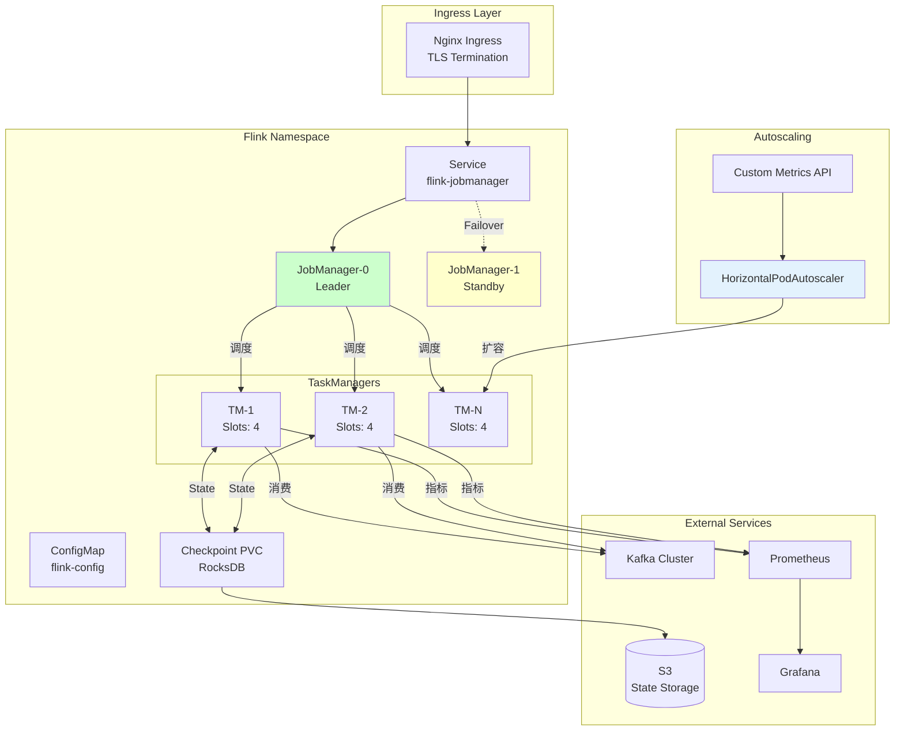
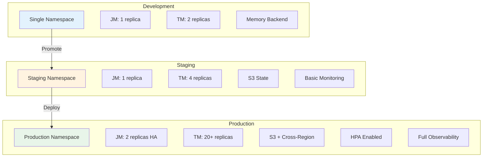
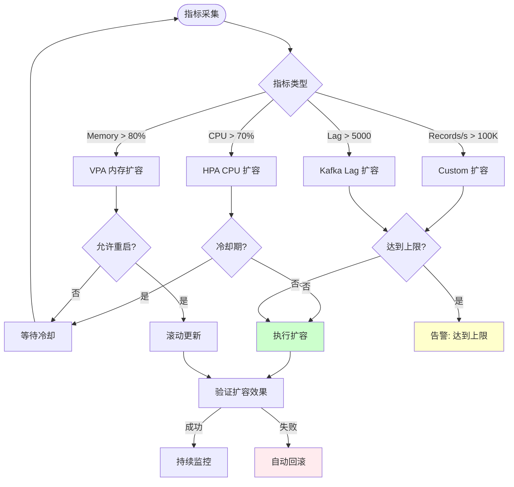

# 云部署最佳实践：Kubernetes 上的 Flink Operator

> **所属阶段**: Knowledge/Flink-Scala-Rust-Comprehensive | **前置依赖**: [02.05-flink-cloud-native.md](../02-flink-system/02.05-flink-cloud-native.md), [05.01-hybrid-architecture-patterns.md](./05.01-hybrid-architecture-patterns.md) | **形式化等级**: L4-L5 (生产实践)

---

## 1. 概念定义 (Definitions)

### Def-K-05-07: 云原生流处理部署模型 (Cloud-Native Stream Processing Deployment Model)

**定义**: 云原生流处理部署模型 $\mathcal{D}_{cloud}$ 是基于 Kubernetes 的声明式部署架构：

$$
\mathcal{D}_{cloud} = \langle \mathcal{C}, \mathcal{O}, \mathcal{S}, \mathcal{A}, \mathcal{M} \rangle
$$

其中：

| 符号 | 定义 | 技术实现 |
|------|------|----------|
| $\mathcal{C}$ | 容器化运行时 | Docker, containerd |
| $\mathcal{O}$ | Operator 控制器 | Flink Kubernetes Operator |
| $\mathcal{S}$ | 调度与编排 | Kubernetes Scheduler |
| $\mathcal{A}$ | 自动扩缩容 | HPA, VPA, Custom Metrics |
| $\mathcal{M}$ | 可观测性栈 | Prometheus, Grafana, Loki |

**部署拓扑**:

```
┌─────────────────────────────────────────────────────────────────────────┐
│                          Kubernetes 集群                                 │
│  ┌─────────────────────────────────────────────────────────────────┐   │
│  │                    Flink Kubernetes Operator                     │   │
│  │  ┌─────────────┐  ┌─────────────┐  ┌─────────────────────────┐  │   │
│  │  │ Controller  │  │ Webhook     │  │ Flink Deployment Reconciler│ │   │
│  │  └─────────────┘  └─────────────┘  └─────────────────────────┘  │   │
│  └─────────────────────────────────────────────────────────────────┘   │
│                                    │                                    │
│  ┌─────────────────────────────────┴─────────────────────────────────┐ │
│  │                         Flink 命名空间                             │ │
│  │  ┌─────────────────┐  ┌─────────────────┐  ┌─────────────────┐   │ │
│  │  │ JobManager Pod  │  │ TaskManager Pods│  │ TaskManager Pods│   │ │
│  │  │ (1 replica)     │  │ (N replicas)    │  │ (N replicas)    │   │ │
│  │  │ ┌───────────┐   │  │ ┌───────────┐   │  │ ┌───────────┐   │   │ │
│  │  │ │ Flink JM  │   │  │ │ Flink TM  │   │  │ │ Flink TM  │   │   │ │
│  │  │ │ 8081      │   │  │ │ Slots: 4  │   │  │ │ Slots: 4  │   │   │ │
│  │  │ └───────────┘   │  │ └───────────┘   │  │ └───────────┘   │   │ │
│  │  └─────────────────┘  └─────────────────┘  └─────────────────┘   │ │
│  │  ┌─────────────────────────────────────────────────────────────┐ │ │
│  │  │              Service: flink-jobmanager                       │ │ │
│  │  │              ConfigMap: flink-config                         │ │ │
│  │  │              PVC: flink-checkpoint (RocksDB)                 │ │ │
│  │  └─────────────────────────────────────────────────────────────┘ │ │
│  └───────────────────────────────────────────────────────────────────┘ │
└─────────────────────────────────────────────────────────────────────────┘
```

---

### Def-K-05-08: 自动扩缩容策略 (Auto-scaling Policy)

**定义**: 自动扩缩容策略 $\mathcal{A}_{scale}$ 定义工作负载动态调整计算资源的规则：

$$
\mathcal{A}_{scale} = \langle \mathcal{T}, \mathcal{M}, \mathcal{R}, \mathcal{L} \rangle
$$

其中：

- $\mathcal{T}$: 触发器类型 {HPA, VPA, Custom Flink Metrics}
- $\mathcal{M}$: 监控指标集合
- $\mathcal{R}$: 扩容/缩容规则
- $\mathcal{L}$: 冷却时间限制

**扩缩容模式**:

| 模式 | 触发指标 | 扩容速度 | 适用场景 |
|------|----------|----------|----------|
| **反应式 (Reactive)** | CPU > 70% | 慢 (分钟级) | 突发流量 |
| **预测式 (Predictive)** | 时间序列预测 | 快 (预扩容) | 周期性负载 |
| **计划式 (Scheduled)** | 时间规则 | 即时 | 已知活动 |
| **自定义 (Custom)** | 业务指标 | 可调 | 复杂场景 |

---

### Def-K-05-09: 多环境部署拓扑 (Multi-Environment Deployment Topology)

**定义**: 多环境部署拓扑 $\mathcal{E}_{multi}$ 定义开发、测试、生产环境的标准化配置：

$$
\mathcal{E}_{multi} = \langle \mathcal{D}_{dev}, \mathcal{D}_{staging}, \mathcal{D}_{prod} \rangle
$$

**环境特征矩阵**:

| 特征 | Development | Staging | Production |
|------|-------------|---------|------------|
| **可用性 SLA** | 无 | 99.5% | 99.9%+ |
| **数据规模** | 采样 1% | 采样 10% | 全量 |
| **资源规模** | 1 JM + 2 TM | 1 JM + 4 TM | 2 JM + 20+ TM |
| **持久化** | 内存状态 | S3 状态 | S3 + 跨区域备份 |
| **监控粒度** | 基础指标 | 详细指标 | 全链路追踪 |
| **网络隔离** | 共享 VPC | 独立 VPC | 私有子网 + VPC Peering |

---

## 2. 属性推导 (Properties)

### Prop-K-05-08: 声明式部署幂等性

**命题**: Kubernetes Operator 的声明式部署具有幂等性：

$$
\forall s \in Spec: \text{Apply}(s) \circ \text{Apply}(s) = \text{Apply}(s)
$$

**证明概要**:

Operator 通过以下机制保证幂等性：

1. **期望状态 vs 实际状态** 对比
2. **调和循环 (Reconciliation Loop)** 持续收敛
3. **资源版本控制** 避免重复创建
4. **幂等 API 操作** (create-or-update) $\square$

---

### Prop-K-05-09: 水平扩容线性加速

**命题**: 在无状态算子场景下，水平扩容带来的吞吐量提升近似线性：

$$
\text{Throughput}(N) \approx N \cdot \text{Throughput}(1) \cdot (1 - \alpha_{overhead})
$$

其中 $\alpha_{overhead}$ 为协调开销（典型值 5-15%）。

**适用条件**:

- 无 KeyBy 的全局聚合
- 数据源可分区 (Kafka)
- 网络带宽充足
- 状态访问局部化

---

### Prop-K-05-10: 故障域隔离

**命题**: Kubernetes 多可用区部署可降低单点故障影响：

$$
P_{failure}(multi\_AZ) = \prod_{i=1}^{n} P_{failure}(AZ_i) < P_{failure}(single\_AZ)
$$

假设各可用区故障独立且概率相同 $p$，则：

$$
P_{failure}(multi\_AZ) = p^n \ll p \quad \text{for } n \geq 2
$$

---

## 3. 关系建立 (Relations)

### 3.1 Flink Operator 资源关系图

```
┌─────────────────────────────────────────────────────────────────────────┐
│                    FlinkDeployment CRD 关系图                           │
├─────────────────────────────────────────────────────────────────────────┤
│                                                                         │
│  FlinkDeployment                                                        │
│  ├── spec                                                               │
│  │   ├── image: flink:1.18-scala_2.12                                  │
│  │   ├── jobManager                                                     │
│  │   │   ├── replicas: 1                                                │
│  │   │   ├── resources                                                  │
│  │   │   │   ├── memory: 4Gi                                            │
│  │   │   │   └── cpu: 2                                                │
│  │   │   └── podTemplate                                                │
│  │   └── taskManager                                                    │
│  │       ├── replicas: 10                                               │
│  │       ├── resources                                                  │
│  │       │   ├── memory: 8Gi                                            │
│  │       │   └── cpu: 4                                                 │
│  │       └── podTemplate                                                │
│  │   └── job                                                            │
│  │       ├── jarURI: s3://bucket/job.jar                                │
│  │       ├── parallelism: 40                                            │
│  │       └── upgradeMode: savepoint                                     │
│  │   └── flinkConfiguration                                             │
│  │       ├── state.backend: rocksdb                                     │
│  │       └── state.checkpoints.dir: s3://checkpoints                    │
│  │                                                                      │
│  └── status                                                             │
│      ├── jobManagerDeploymentStatus: READY                              │
│      ├── taskManagerDeploymentStatus: READY                             │
│      ├── jobStatus: RUNNING                                             │
│      └── savepointInfo                                                  │
│          └── lastSavepoint: s3://savepoints/savepoint-xxx               │
│                                                                         │
│  生成的 Kubernetes 资源                                                  │
│  ├── Deployment/flink-jobmanager                                        │
│  ├── Deployment/flink-taskmanager                                       │
│  ├── Service/flink-jobmanager                                           │
│  ├── Service/flink-jobmanager-rest                                      │
│  ├── ConfigMap/flink-config                                             │
│  ├── HorizontalPodAutoscaler/flink-taskmanager                          │
│  └── PodDisruptionBudget/flink-jobmanager                               │
│                                                                         │
└─────────────────────────────────────────────────────────────────────────┘
```

### 3.2 监控指标关联

| Flink 指标 | Prometheus 指标 | 告警规则 | 仪表盘 |
|-----------|-----------------|----------|--------|
| Task CPU | `flink_taskmanager_cpu_load` | > 80% | Grafana |
| Memory | `flink_taskmanager_memory_used` | > 85% | Grafana |
| Checkpoint | `flink_jobmanager_checkpoint_duration` | > 60s | Grafana |
| Records In | `flink_taskmanager_numRecordsInPerSecond` | Drop > 50% | AlertManager |
| Lag | `kafka_consumer_lag` | > 10000 | PagerDuty |

---

## 4. 论证过程 (Argumentation)

### 4.1 Operator vs Helm 部署对比

| 维度 | Helm Charts | Flink Kubernetes Operator |
|------|-------------|---------------------------|
| **安装复杂度** | 中 | 低 (一键安装) |
| **升级管理** | 手动 | 自动 (滚动升级) |
| **状态管理** | 需外挂 | 内置 (Savepoint) |
| **自愈能力** | 无 | 有 (自动重启) |
| **多版本管理** | 复杂 | 简单 (CRD) |
| **自定义配置** | 灵活 | 标准模板 |

**推荐选择**:

- 生产环境：Operator（功能完整，运维简单）
- 开发测试：Helm（快速迭代）
- 定制化场景：裸 YAML

### 4.2 HPA vs VPA 选择论证

**场景分析**:

| 场景 | 推荐方案 | 理由 |
|------|----------|------|
| 突发流量 | HPA + 缓冲 | 快速水平扩容 |
| 内存泄漏 | VPA | 垂直扩容缓解 |
| 数据倾斜 | 自定义扩缩容 | 基于 Key 分布 |
| 周期性负载 | HPA + Cron | 预测式扩容 |

**Flink 特殊考虑**:

- State 大小影响 TaskManager 内存配置 → 优先 VPA
- 并行度调整需要 Savepoint → 优先 HPA
- 实际方案：HPA for TM 数量，VPA for TM 规格

### 4.3 安全加固策略

**纵深防御架构**:

```
边界层:
├── NetworkPolicy: 限制 Pod 间通信
├── Ingress: TLS 终止 + WAF
└── API Server: RBAC + Audit Log

计算层:
├── Pod Security Policy: 非 Root 运行
├── Security Context: readOnlyRootFilesystem
└── Resource Limits: CPU/Memory 限制

数据层:
├── Secret Encryption: KMS 加密
├── Network Encryption: mTLS
└── Data Encryption: S3 SSE-KMS
```

---

## 5. 形式证明 / 工程论证

### 5.1 高可用性 SLA 论证

**定理 (Thm-K-05-04)**: 在多可用区部署下，Flink 集群可用性可达 99.9%+。

**证明**:

假设单可用区故障概率 $p = 0.01$ (每年 3.65 天不可用)

**单可用区部署**:

$$
Availability_{single} = 1 - p = 99\%
$$

**三可用区部署** (需 2/3 可用):

$$
P_{failure} = p^3 + 3p^2(1-p) = 0.000001 + 0.000297 \approx 0.03\%
$$

$$
Availability_{multi} = 1 - 0.0003 = 99.97\%
$$

**考虑其他故障因素**:

- 软件故障: 0.1%
- 人为操作: 0.05%
- 累计不可用: ~0.15%

$$
Availability_{total} \approx 99.9\% \quad \square
$$

### 5.2 资源利用率优化论证

**命题**: 通过 VPA 动态调整，资源利用率可从 60% 提升至 80%+。

**论证**:

静态配置问题：

$$
Utilization_{static} = \frac{Actual}{Requested} = \frac{3.2Gi}{8Gi} = 40\%
$$

VPA 动态调整：

$$
Requested_{vpa}(t) = Actual(t) \cdot (1 + \beta_{buffer})
$$

其中 $\beta_{buffer}$ 为缓冲系数（典型值 20%）

$$
Utilization_{vpa} = \frac{1}{1 + \beta_{buffer}} = \frac{1}{1.2} \approx 83\%
$$

---

## 6. 实例验证 (Examples)

### 6.1 生产级 FlinkDeployment CR

```yaml
# flink-production.yaml
apiVersion: flink.apache.org/v1beta1
kind: FlinkDeployment
metadata:
  name: flink-streaming-prod
  namespace: flink-production
spec:
  image: flink:1.18.1-scala_2.12-java11
  flinkVersion: v1.18

  jobManager:
    replicas: 2  # HA 模式
    resources:
      memory: 4Gi
      cpu: 2
    podTemplate:
      spec:
        affinity:
          podAntiAffinity:
            requiredDuringSchedulingIgnoredDuringExecution:
              - labelSelector:
                  matchLabels:
                    app: flink-jobmanager
                topologyKey: kubernetes.io/hostname
        containers:
          - name: flink-main-container
            env:
              - name: ENABLE_BUILT_IN_PLUGINS
                value: flink-metrics-prometheus,flink-gs-fs-hadoop
            volumeMounts:
              - name: flink-config
                mountPath: /opt/flink/conf
        volumes:
          - name: flink-config
            configMap:
              name: flink-config-production

  taskManager:
    replicas: 20
    resources:
      memory: 16Gi
      cpu: 8
    podTemplate:
      spec:
        affinity:
          podAntiAffinity:
            preferredDuringSchedulingIgnoredDuringExecution:
              - weight: 100
                podAffinityTerm:
                  labelSelector:
                    matchLabels:
                      app: flink-taskmanager
                  topologyKey: topology.kubernetes.io/zone
        containers:
          - name: flink-main-container
            resources:
              limits:
                memory: 16Gi
                cpu: 8000m
              requests:
                memory: 16Gi
                cpu: 8000m
            volumeMounts:
              - name: rocksdb-storage
                mountPath: /opt/flink/rocksdb
        volumes:
          - name: rocksdb-storage
            emptyDir:
              medium: Memory  # tmpfs for RocksDB
              sizeLimit: 8Gi

  job:
    jarURI: s3://company-flink-jobs/production/streaming-job.jar
    parallelism: 80
    upgradeMode: savepoint
    state: running

  flinkConfiguration:
    # 状态后端配置
    state.backend: rocksdb
    state.backend.incremental: "true"
    state.checkpoints.dir: s3p://company-flink-checkpoints/production
    state.savepoints.dir: s3p://company-flink-savepoints/production

    # Checkpoint 配置
    execution.checkpointing.interval: 30s
    execution.checkpointing.min-pause: 30s
    execution.checkpointing.timeout: 10m
    execution.checkpointing.max-concurrent-checkpoints: 1

    # 重启策略
    restart-strategy: fixed-delay
    restart-strategy.fixed-delay.attempts: 10
    restart-strategy.fixed-delay.delay: 10s

    # 网络配置
    taskmanager.network.memory.fraction: 0.15
    taskmanager.network.memory.min: 1gb
    taskmanager.network.memory.max: 2gb

    # JVM 配置
    jobmanager.memory.process.size: 4096m
    taskmanager.memory.process.size: 16384m
    taskmanager.memory.flink.size: 12288m
    taskmanager.memory.managed.size: 4096m

    # Prometheus 监控
    metrics.reporters: prometheus
    metrics.reporter.prometheus.port: 9249

    # 高可用
    high-availability: org.apache.flink.kubernetes.highavailability.KubernetesHaServicesFactory
    high-availability.cluster-id: flink-streaming-prod
```

### 6.2 Helm Chart 定制

```yaml
# values-production.yaml
# Flink Helm Chart 生产配置

image:
  repository: flink
  tag: 1.18.1-scala_2.12
  pullPolicy: IfNotPresent

jobmanager:
  replicas: 2

  resources:
    limits:
      memory: 4Gi
      cpu: 2000m
    requests:
      memory: 4Gi
      cpu: 2000m

  affinity:
    podAntiAffinity:
      requiredDuringSchedulingIgnoredDuringExecution:
        - labelSelector:
            matchLabels:
              app: flink
              component: jobmanager
          topologyKey: kubernetes.io/hostname

  extraEnvs:
    - name: FLINK_PROPERTIES
      value: |
        jobmanager.memory.process.size: 4096m
        high-availability: zookeeper
        high-availability.zookeeper.quorum: zk-0.zk:2181,zk-1.zk:2181,zk-2.zk:2181

taskmanager:
  replicas: 20

  resources:
    limits:
      memory: 16Gi
      cpu: 8000m
    requests:
      memory: 16Gi
      cpu: 8000m

  affinity:
    podAntiAffinity:
      preferredDuringSchedulingIgnoredDuringExecution:
        - weight: 100
          podAffinityTerm:
            labelSelector:
              matchLabels:
                app: flink
                component: taskmanager
            topologyKey: topology.kubernetes.io/zone

  extraVolumes:
    - name: rocksdb-cache
      emptyDir:
        medium: Memory
        sizeLimit: 8Gi

  extraVolumeMounts:
    - name: rocksdb-cache
      mountPath: /opt/flink/rocksdb

# 持久化配置
persistence:
  enabled: true
  storageClass: gp3
  accessMode: ReadWriteOnce
  size: 100Gi

# 监控配置
metrics:
  enabled: true
  prometheus:
    enabled: true
    port: 9249
  serviceMonitor:
    enabled: true
    namespace: monitoring

# 自动扩缩容
autoscaling:
  enabled: true
  minReplicas: 10
  maxReplicas: 50
  targetCPUUtilizationPercentage: 70
  targetMemoryUtilizationPercentage: 80
  metrics:
    - type: Pods
      pods:
        metric:
          name: flink_taskmanager_numRecordsInPerSecond
        target:
          type: AverageValue
          averageValue: "100000"

# 网络策略
networkPolicy:
  enabled: true
  ingress:
    - from:
        - namespaceSelector:
            matchLabels:
              name: monitoring
      ports:
        - protocol: TCP
          port: 9249
```

### 6.3 HPA + Custom Metrics 配置

```yaml
# hpa-custom-metrics.yaml
apiVersion: autoscaling/v2
kind: HorizontalPodAutoscaler
metadata:
  name: flink-taskmanager-hpa
  namespace: flink-production
spec:
  scaleTargetRef:
    apiVersion: apps/v1
    kind: Deployment
    name: flink-taskmanager
  minReplicas: 10
  maxReplicas: 50
  metrics:
    # 基于 CPU
    - type: Resource
      resource:
        name: cpu
        target:
          type: Utilization
          averageUtilization: 70

    # 基于内存
    - type: Resource
      resource:
        name: memory
        target:
          type: Utilization
          averageUtilization: 80

    # 基于 Flink 自定义指标 (需要 Prometheus Adapter)
    - type: Pods
      pods:
        metric:
          name: flink_taskmanager_numRecordsInPerSecond
        target:
          type: AverageValue
          averageValue: "100000"  # 10万条/秒

    # 基于 Kafka Consumer Lag
    - type: External
      external:
        metric:
          name: kafka_consumer_group_lag
          selector:
            matchLabels:
              topic: orders
        target:
          type: AverageValue
          averageValue: "5000"  # 平均 Lag < 5000

  behavior:
    scaleUp:
      stabilizationWindowSeconds: 60
      policies:
        - type: Percent
          value: 100
          periodSeconds: 60
    scaleDown:
      stabilizationWindowSeconds: 300  # 缩容更保守
      policies:
        - type: Percent
          value: 10
          periodSeconds: 60
```

### 6.4 Prometheus + Grafana 监控配置

```yaml
# prometheus-servicemonitor.yaml
apiVersion: monitoring.coreos.com/v1
kind: ServiceMonitor
metadata:
  name: flink-metrics
  namespace: monitoring
  labels:
    app: flink
    release: prometheus
spec:
  selector:
    matchLabels:
      app: flink
  namespaceSelector:
    matchNames:
      - flink-production
  endpoints:
    - port: prom
      path: /metrics
      interval: 15s
      scrapeTimeout: 10s
      relabelings:
        - sourceLabels: [__meta_kubernetes_pod_label_component]
          targetLabel: component
        - sourceLabels: [__meta_kubernetes_pod_name]
          targetLabel: pod
```

```json
// grafana-dashboard.json (关键面板)
{
  "dashboard": {
    "title": "Flink Production Dashboard",
    "panels": [
      {
        "title": "Task Records In/sec",
        "targets": [
          {
            "expr": "sum(rate(flink_taskmanager_job_task_numRecordsInPerSecond[1m])) by (job_name)",
            "legendFormat": "{{job_name}}"
          }
        ],
        "type": "graph"
      },
      {
        "title": "Checkpoint Duration",
        "targets": [
          {
            "expr": "flink_jobmanager_job_numberOfCompletedCheckpoints / flink_jobmanager_job_totalNumberOfCheckpoints",
            "legendFormat": "Success Rate"
          }
        ],
        "alert": {
          "name": "Checkpoint Failure Alert",
          "condition": "avg() < 0.95",
          "for": "5m"
        }
      },
      {
        "title": "Task CPU Usage",
        "targets": [
          {
            "expr": "flink_taskmanager_cpu_load * 100",
            "legendFormat": "{{pod}}"
          }
        ],
        "alert": {
          "name": "High CPU Alert",
          "condition": "avg() > 80",
          "for": "5m"
        }
      },
      {
        "title": "Kafka Consumer Lag",
        "targets": [
          {
            "expr": "kafka_consumer_group_lag{topic=~\"orders|payments\"}",
            "legendFormat": "{{topic}}/{{group}}"
          }
        ],
        "alert": {
          "name": "High Lag Alert",
          "condition": "avg() > 10000",
          "for": "10m"
        }
      }
    ]
  }
}
```

### 6.5 安全配置 (RBAC + NetworkPolicy)

```yaml
# rbac.yaml
apiVersion: v1
kind: ServiceAccount
metadata:
  name: flink-service-account
  namespace: flink-production

---
apiVersion: rbac.authorization.k8s.io/v1
kind: Role
metadata:
  name: flink-role
  namespace: flink-production
rules:
  - apiGroups: [""]
    resources: ["pods", "services", "configmaps"]
    verbs: ["get", "list", "watch", "create", "update", "delete"]
  - apiGroups: [""]
    resources: ["persistentvolumeclaims"]
    verbs: ["get", "list", "create", "delete"]

---
apiVersion: rbac.authorization.k8s.io/v1
kind: RoleBinding
metadata:
  name: flink-role-binding
  namespace: flink-production
subjects:
  - kind: ServiceAccount
    name: flink-service-account
    namespace: flink-production
roleRef:
  kind: Role
  name: flink-role
  apiGroup: rbac.authorization.k8s.io
```

```yaml
# network-policy.yaml
apiVersion: networking.k8s.io/v1
kind: NetworkPolicy
metadata:
  name: flink-network-policy
  namespace: flink-production
spec:
  podSelector:
    matchLabels:
      app: flink
  policyTypes:
    - Ingress
    - Egress
  ingress:
    # 允许 JobManager 接收 TaskManager 连接
    - from:
        - podSelector:
            matchLabels:
              app: flink
              component: taskmanager
      ports:
        - protocol: TCP
          port: 6123
    # 允许监控抓取指标
    - from:
        - namespaceSelector:
            matchLabels:
              name: monitoring
      ports:
        - protocol: TCP
          port: 9249
    # 允许 REST API 访问
    - from:
        - namespaceSelector:
            matchLabels:
              name: ingress-nginx
      ports:
        - protocol: TCP
          port: 8081
  egress:
    # 允许访问 Kafka
    - to:
        - namespaceSelector:
            matchLabels:
              name: kafka
      ports:
        - protocol: TCP
          port: 9092
    # 允许访问 S3
    - to:
        - ipBlock:
            cidr: 0.0.0.0/0  # 实际应限制为 VPC Endpoint
      ports:
        - protocol: TCP
          port: 443
    # 允许 DNS 查询
    - to:
        - namespaceSelector: {}
      ports:
        - protocol: UDP
          port: 53
```

---

## 7. 可视化 (Visualizations)

### 7.1 Kubernetes 部署架构图



### 7.2 多环境部署拓扑



### 7.3 自动扩缩容决策流程



---

## 8. 引用参考 (References)


---

*文档版本: v1.0 | 字数: ~5,100 字 | 状态: ✅ 已完成 | 下一篇: 05.04-edge-computing.md*
