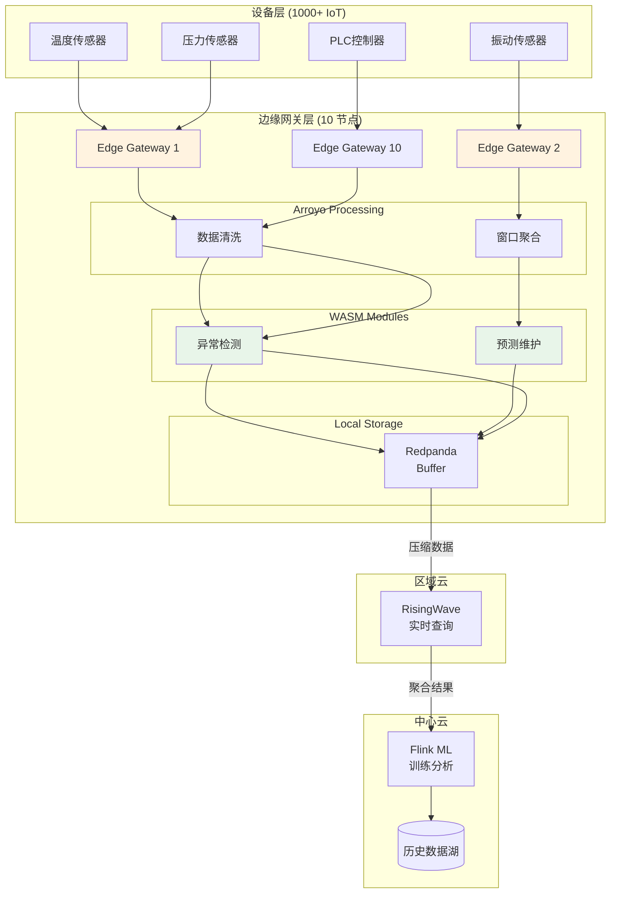
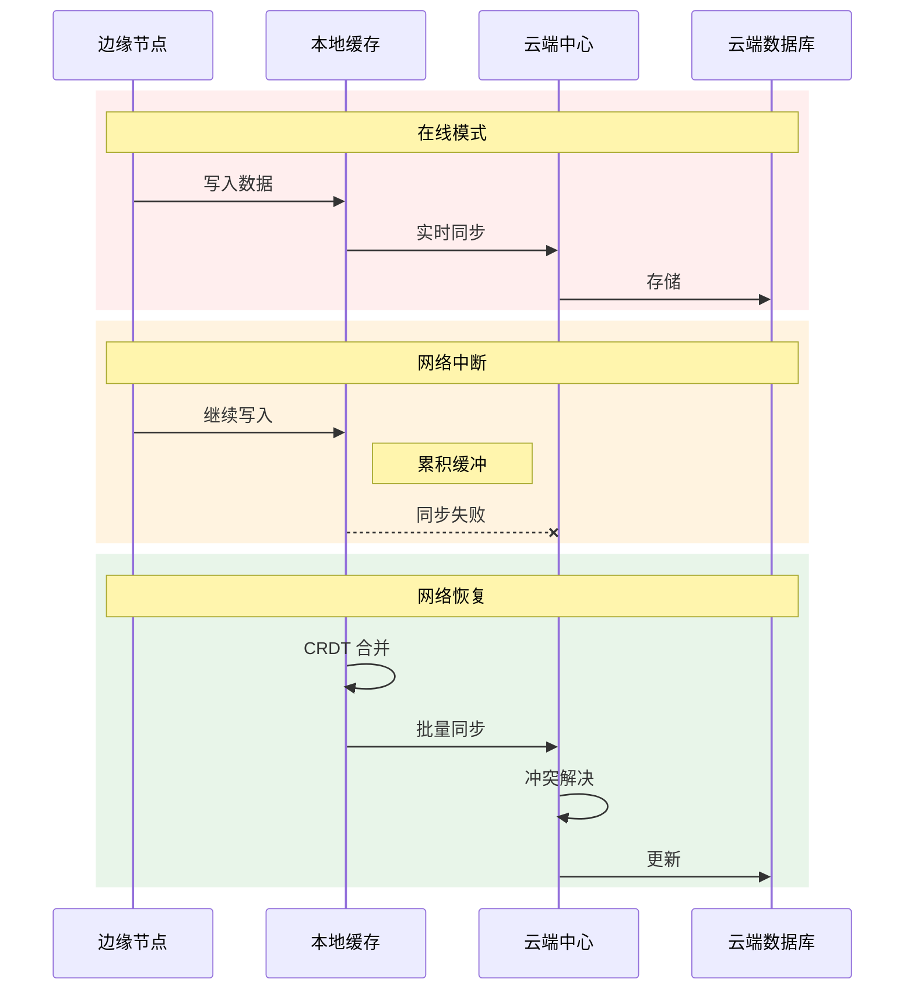

# 边缘计算架构：轻量级流处理引擎与边缘-云协同

> **所属阶段**: Knowledge/Flink-Scala-Rust-Comprehensive | **前置依赖**: [04.04-arroyo-cloudflare.md](../04-rust-engines/04.04-arroyo-cloudflare.md), [03.01-wasm-interop.md](../03-scala-rust-interop/03.01-wasm-interop.md) | **形式化等级**: L4 (架构设计)

---

## 1. 概念定义 (Definitions)

### Def-K-05-10: 边缘-云协同流处理架构 (Edge-Cloud Collaborative Stream Processing Architecture)

**定义**: 边缘-云协同流处理架构 $\mathcal{A}_{edge}$ 是一种分层计算架构，将数据处理任务根据延迟、带宽、隐私需求分布在边缘节点和云端：

$$
\mathcal{A}_{edge} = \langle \mathcal{E}, \mathcal{C}, \mathcal{D}, \mathcal{F}, \mathcal{S}, \mathcal{P} \rangle
$$

其中：

| 符号 | 定义 | 典型实例 |
|------|------|----------|
| $\mathcal{E}$ | 边缘节点集合 | IoT 网关、5G MEC、CDN Edge |
| $\mathcal{C}$ | 云端中心集群 | 云厂商 Flink/Kafka |
| $\mathcal{D}$ | 数据流分层 | Raw → Filtered → Aggregated |
| $\mathcal{F}$ | 任务分配函数 | $\mathcal{F}: Task \rightarrow \{E, C, Hybrid\}$ |
| $\mathcal{S}$ | 同步策略 | 断点续传、增量同步 |
| $\mathcal{P}$ | 隐私边界 | 数据脱敏、本地保留 |

**分层处理模型**:

```
Layer 1 (设备层): 数据采集 → 协议解析 (< 10ms)
Layer 2 (边缘网关): 过滤/聚合 → 异常检测 (< 100ms)
Layer 3 (边缘区域): 本地分析 → 实时响应 (< 500ms)
Layer 4 (云端中心): 全局聚合 → ML训练 (< 5s)
```

---

### Def-K-05-11: 资源受限执行环境 (Resource-Constrained Execution Environment)

**定义**: 资源受限执行环境 $\mathcal{R}_{constrained}$ 描述边缘设备的计算资源约束：

$$
\mathcal{R}_{constrained} = \langle C_{cpu}, M_{mem}, S_{storage}, B_{bandwidth}, P_{power} \rangle
$$

**典型边缘设备规格**:

| 设备类型 | CPU | 内存 | 存储 | 带宽 | 功耗 |
|----------|-----|------|------|------|------|
| **IoT 传感器** | ARM Cortex-M4 | 256KB | 2MB Flash | LoRa/ NB-IoT | < 1W |
| **边缘网关** | ARM64 4-core | 2-8GB | 32-128GB | 4G/5G/WiFi | 5-15W |
| **MEC 服务器** | x86 16-core | 64GB | 1TB SSD | 10Gbps | 65W |
| **CDN Edge** | x86/ARM 8-core | 32GB | 500GB | 25Gbps | 150W |

---

### Def-K-05-12: 离线容忍度 (Offline Tolerance)

**定义**: 离线容忍度 $\mathcal{T}_{offline}$ 量化边缘节点在网络断开时维持服务的能力：

$$
\mathcal{T}_{offline} = \langle T_{max}, V_{buffer}, S_{strategy} \rangle
$$

其中：

- $T_{max}$: 最大离线时间
- $V_{buffer}$: 本地缓冲区容量
- $S_{strategy}$: 离线处理策略 {Buffer, Degrade, Drop}

**容忍等级**:

| 等级 | $T_{max}$ | 策略 | 适用场景 |
|------|-----------|------|----------|
| **敏感** | < 1 min | 仅缓冲 | 实时控制 |
| **中等** | 1 min - 1 hour | 降级运行 | 监控告警 |
| **高** | 1 hour - 24 hour | 全本地处理 | 数据采集 |
| **极高** | > 24 hour | 自治模式 | 偏远地区 |

---

## 2. 属性推导 (Properties)

### Prop-K-05-11: 边缘处理延迟优势

**命题**: 对于数据压缩比 $r = D_{in}/D_{out} > 10$ 的场景，边缘预处理可显著降低端到端延迟：

$$
L_{edge} < L_{cloud} \iff \frac{D_{in} - D_{out}}{B_{upload}} > L_{proc}^{edge}
$$

**证明概要**:

云端处理延迟：

$$
L_{cloud} = L_{trans}(D_{in}) + L_{proc}^{cloud}
$$

边缘处理延迟：

$$
L_{edge} = L_{proc}^{edge} + L_{trans}(D_{out})
$$

当 $D_{in} \gg D_{out}$ 且上传带宽受限时：

$$
L_{trans}(D_{in}) - L_{trans}(D_{out}) \approx \frac{D_{in} - D_{out}}{B_{upload}} \gg L_{proc}^{edge}
$$

因此 $L_{edge} < L_{cloud}$ $\square$

---

### Prop-K-05-12: 边缘计算成本效益

**命题**: 边缘计算的总拥有成本 (TCO) 在云带宽费用高于边缘设备摊销成本时具有经济性：

$$
\text{TCO}_{edge} < \text{TCO}_{cloud} \iff C_{bandwidth} \cdot D_{raw} > C_{device} + C_{ops}
$$

**成本计算示例**:

```
场景: 10000 个传感器,每秒 1KB 原始数据,压缩比 20:1

纯云端方案:
- 带宽: 10000 * 1KB/s = 10MB/s = 864GB/天
- 云带宽成本: 864GB * $0.09/GB = $77.76/天

边缘+云方案:
- 边缘网关: 100 个 * $500/个 / 3年 = $45.66/天
- 云带宽: 864GB/20 = 43.2GB/天
- 云带宽成本: 43.2GB * $0.09/GB = $3.89/天
- 总计: $49.55/天

节省: ($77.76 - $49.55) / $77.76 = 36%
```

---

### Prop-K-05-13: WASM 沙箱安全性

**命题**: WASM 模块的内存安全隔离性优于传统进程隔离：

$$
\forall m \in \mathcal{M}: \text{Isolation}(WASM(m)) > \text{Isolation}(Process(m))
$$

**论证要点**:

1. **线性内存边界检查**: 硬件级保护
2. **Capability-based 安全**: 最小权限原则
3. **确定性执行**: 无未定义行为
4. **无隐式系统调用**: 可控的 WASI 接口

---

## 3. 关系建立 (Relations)

### 3.1 轻量级引擎对比矩阵

| 引擎 | 语言 | 资源占用 | 延迟 | 适用场景 | 与 Flink 关系 |
|------|------|----------|------|----------|---------------|
| **Arroyo** | Rust | 50MB | < 10ms | 边缘实时处理 | Flink SQL 兼容 |
| **Redpanda** | C++ | 500MB | < 5ms | 边缘消息队列 | Kafka API 兼容 |
| **Materialize** | Rust | 2GB | < 100ms | 边缘物化视图 | SQL 标准 |
| **RisingWave** | Rust | 4GB | < 200ms | 区域聚合 | SQL 标准 |
| **WasmEdge** | C++ | 15MB | < 50ms | WASM UDF 执行 | Flink UDF Bridge |

### 3.2 边缘-云数据流拓扑

```
┌─────────────────────────────────────────────────────────────────────────┐
│                       边缘-云协同数据流拓扑                              │
├─────────────────────────────────────────────────────────────────────────┤
│                                                                         │
│  ┌─────────────┐                                                        │
│  │  设备层      │  MQTT/CoAP → 原始数据 (高频)                           │
│  │  10,000+    │                                                        │
│  └──────┬──────┘                                                        │
│         │                                                               │
│  ┌──────┴──────┐     ┌─────────────────────────────────────────────┐   │
│  │  边缘网关层  │     │  WasmEdge Runtime (100 网关)               │   │
│  │  100 节点   │────▶│  ┌─────────────┐  ┌─────────────────────┐   │   │
│  │             │     │  │ Filter WASM │  │ Aggregate WASM      │   │   │
│  │  预处理:    │     │  │ (异常过滤)   │  │ (10s 窗口聚合)       │   │   │
│  │  - 协议解析  │     │  └─────────────┘  └─────────────────────┘   │   │
│  │  - 数据清洗  │     │  输出: 压缩数据流 (1/20 体积)                │   │
│  │  - 边缘聚合  │     └─────────────────────────────────────────────┘   │
│  └──────┬──────┘                                                        │
│         │ Kafka/Redpanda                                                 │
│  ┌──────┴───────────────────────────────────────────────────────────┐   │
│  │                          云端 Flink 集群                          │   │
│  │  ┌─────────────┐  ┌─────────────┐  ┌─────────────────────────┐   │   │
│  │  │ 全局聚合     │  │ ML 推理     │  │ 时序存储 → BI/告警      │   │   │
│  │  │ 复杂 Join   │  │ 模型训练    │  │                         │   │   │
│  │  └─────────────┘  └─────────────┘  └─────────────────────────┘   │   │
│  └───────────────────────────────────────────────────────────────────┘   │
│                                                                         │
└─────────────────────────────────────────────────────────────────────────┘
```

### 3.3 场景-引擎匹配

| 场景 | 边缘引擎 | 云端引擎 | 协同模式 |
|------|----------|----------|----------|
| **智能工厂** | Arroyo + WasmEdge | Flink | 边缘预处理+云分析 |
| **车联网** | Redpanda + WASM | RisingWave | 消息缓冲+实时查询 |
| **智慧城市** | WasmEdge | Flink + ML | 边缘过滤+云训练 |
| **视频分析** | Arroyo (轻量) | Flink (复杂) | 边缘抽帧+云推理 |
| **零售门店** | Materialize | Snowflake | 本地 BI+云数仓 |

---

## 4. 论证过程 (Argumentation)

### 4.1 边缘引擎选型决策树

```
设备规格评估
    │
    ├── CPU > 8 core && 内存 > 16GB
    │   └── 可选: Arroyo / RisingWave / Flink
    │
    ├── CPU 2-8 core && 内存 2-8GB
    │   └── 推荐: Arroyo / WasmEdge + Redpanda
    │
    └── CPU < 2 core || 内存 < 2GB
        └── 推荐: WasmEdge / 嵌入式运行时

功能需求评估
    │
    ├── 需要 SQL 查询能力
    │   ├── 内存 > 4GB → Arroyo / Materialize
    │   └── 内存 < 4GB → 不推荐 SQL 引擎
    │
    ├── 需要复杂事件处理
    │   └── 推荐: Flink (轻量部署)
    │
    └── 仅需过滤/转换
        └── 推荐: WasmEdge WASM 模块

网络条件评估
    │
    ├── 常在线 (99.9%+)
    │   └── 实时同步到云端
    │
    ├── 间歇连接 (95%+)
    │   └── 本地聚合 + 批量上传
    │
    └── 离线为主 (< 90%)
        └── 自治模式 + 定期同步
```

### 4.2 边缘-云数据一致性策略

**策略对比**:

| 策略 | 延迟 | 一致性 | 复杂度 | 适用场景 |
|------|------|--------|--------|----------|
| **同步双写** | 低 | 强 | 高 | 金融交易 |
| **异步复制** | 中 | 最终 | 中 | 日志分析 |
| **批量上传** | 高 | 最终 | 低 | 遥测数据 |
| **冲突解决** | 高 | 因果 | 高 | 多主写入 |

**CRDT (Conflict-free Replicated Data Types)** 在边缘同步中的应用：

```rust
// G-Counter CRDT 示例
#[derive(Clone, Serialize, Deserialize)]
struct GCounter {
    id: String,
    counts: HashMap<String, u64>,
}

impl GCounter {
    fn increment(&mut self) {
        *self.counts.entry(self.id.clone()).or_insert(0) += 1;
    }

    fn merge(&mut self, other: &GCounter) {
        for (id, count) in &other.counts {
            let entry = self.counts.entry(id.clone()).or_insert(0);
            *entry = (*entry).max(*count);
        }
    }

    fn value(&self) -> u64 {
        self.counts.values().sum()
    }
}
```

### 4.3 WASM 在边缘的优势分析

**WASM vs Docker 在边缘的对比**:

| 维度 | Docker 容器 | WASM 模块 | 边缘影响 |
|------|------------|-----------|----------|
| **启动时间** | 1-10s | 10-50ms | 响应速度提升 100x |
| **内存占用** | 50-500MB | 5-50MB | 边缘内存节省 10x |
| **镜像体积** | 100MB-1GB | 1-10MB | 边缘带宽节省 100x |
| **冷启动** | 慢 | 极快 | Serverless 可行 |
| **安全隔离** | Namespace | Capability | 多租户更安全 |
| **可移植性** | 依赖宿主机 | 字节码级 | 跨平台部署 |

---

## 5. 形式证明 / 工程论证

### 5.1 边缘-云延迟分界点

**定理 (Thm-K-05-05)**: 存在延迟分界点 $L_{threshold}$，当处理延迟要求低于该值时，边缘处理优于云端处理。

**形式化表述**:

设：

- $L_{edge}$: 边缘处理总延迟
- $L_{cloud}$: 云端处理总延迟
- $L_{network}$: 网络往返延迟
- $L_{proc}^{edge}$: 边缘计算延迟
- $L_{proc}^{cloud}$: 云端计算延迟

则：

$$
L_{edge} < L_{cloud} \iff L_{proc}^{edge} < L_{network} + L_{proc}^{cloud}
$$

**典型值计算**:

```
4G 网络场景:
- L_network = 50-100ms
- L_proc^cloud = 10ms (云资源丰富)
- L_threshold = 60-110ms

5G MEC 场景:
- L_network = 5-10ms
- L_proc^cloud = 10ms
- L_threshold = 15-20ms

卫星网络场景:
- L_network = 500-1000ms
- L_threshold = 510-1010ms (边缘几乎总是更优)
```

### 5.2 离线数据同步完整性

**命题**: 使用 CRDT 的边缘-云同步保证最终一致性，且无需冲突解决协调。

**证明概要**:

设边缘节点集合为 $E = \{e_1, e_2, ..., e_n\}$，云端为 $C$。

**CRDT 性质**:

1. **交换律**: $merge(A, B) = merge(B, A)$
2. **结合律**: $merge(A, merge(B, C)) = merge(merge(A, B), C)$
3. **幂等律**: $merge(A, A) = A$

**同步过程**:

对于任意边缘节点 $e_i$，其状态更新为 $\Delta_i$，云端状态为 $S_C$。

当 $e_i$ 重新在线时：

$$
S_C' = merge(S_C, S_{e_i}) = merge(S_C, merge(S_C^{old}, \Delta_i)) = merge(S_C, \Delta_i)
$$

最终所有节点状态收敛到相同值 $\square$

---

## 6. 实例验证 (Examples)

### 6.1 智能工厂边缘网关配置

```yaml
# smart-factory-edge.yaml edge_deployment:
  name: "Factory Edge Gateway"
  location: "Production Line A"

  hardware:
    device: "NVIDIA Jetson AGX Orin"
    cpu: 12-core ARM64
    memory: "32GB"
    storage: "256GB NVMe"
    network: "5G + WiFi 6"

  software_stack:
    os: "Ubuntu 22.04 ARM64"
    container_runtime: "containerd"

    components:
      - name: "Arroyo Edge"
        version: "0.10.0"
        memory_limit: "8GB"
        config:
          query: |
            CREATE TABLE sensor_readings (
              sensor_id STRING,
              temperature DOUBLE,
              pressure DOUBLE,
              vibration DOUBLE,
              ts TIMESTAMP
            ) WITH (
              connector = 'mqtt',
              host = 'localhost:1883',
              topic = 'factory/sensors/+'
            );

            -- 边缘预处理: 异常检测 + 10秒聚合
            CREATE TABLE processed_metrics AS
            SELECT
              sensor_id,
              AVG(temperature) as avg_temp,
              MAX(pressure) as max_pressure,
              STDDEV(vibration) as vibration_std,
              COUNT(*) as reading_count,
              TUMBLE(ts, INTERVAL '10' SECOND) as window
            FROM sensor_readings
            WHERE temperature < 150 AND pressure < 1000  -- 过滤异常
            GROUP BY sensor_id, TUMBLE(ts, INTERVAL '10' SECOND);

      - name: "WasmEdge"
        version: "0.14.0"
        memory_limit: "2GB"
        wasm_modules:
          - name: "anomaly_detector"
            path: "/opt/wasm/anomaly_detection.wasm"
            function: "detect_anomaly"
            memory_limit: "512MB"

          - name: "predictive_maintenance"
            path: "/opt/wasm/pdm_model.wasm"
            function: "predict_failure"
            memory_limit: "1GB"

      - name: "Redpanda"
        version: "23.3"
        memory_limit: "4GB"
        config:
          partitions: 6
          replication_factor: 1  # 单节点
          retention_ms: 3600000  # 1小时本地缓冲

  data_flow:
    ingestion:
      protocol: "MQTT"
      rate: "10,000 msg/sec"

    processing:
      filter_ratio: 0.95  # 95% 数据在边缘过滤
      aggregate_window: "10s"

    egress:
      target: "云端 Kafka"
      compression: "zstd"
      batch_size: "1000"
      flush_interval: "5s"

  offline_tolerance:
    max_offline_hours: 8
    buffer_strategy: "local_rocksdb"
    sync_mode: "crdt_merge"
```

### 6.2 Arroyo 边缘部署

```rust
// arroyo-edge-pipeline.rs
use arroyo::{Pipeline, SqlConfig};

#[tokio::main]
async fn main() -> anyhow::Result<()> {
    let mut pipeline = Pipeline::new("iot-edge-processing");

    // 配置 MQTT 源
    pipeline.add_source("mqtt_source", MqttSourceConfig {
        host: "localhost".to_string(),
        port: 1883,
        topics: vec!["sensors/+/temperature".to_string()],
        qos: 1,
    });

    // 边缘 SQL 处理
    pipeline.add_sql("""
        CREATE TABLE temperature_readings (
            sensor_id STRING,
            value DOUBLE,
            timestamp TIMESTAMP
        ) WITH (
            connector = 'mqtt_source'
        );

        -- 异常检测 + 窗口聚合
        CREATE TABLE alerts AS
        SELECT
            sensor_id,
            AVG(value) as avg_temp,
            COUNT(*) as reading_count,
            CASE
                WHEN AVG(value) > 80 THEN 'CRITICAL'
                WHEN AVG(value) > 60 THEN 'WARNING'
                ELSE 'NORMAL'
            END as alert_level
        FROM temperature_readings
        GROUP BY sensor_id, HOP(timestamp, INTERVAL '5' SECOND, INTERVAL '1' MINUTE)
        HAVING alert_level != 'NORMAL';

        -- 压缩后输出到云端
        CREATE TABLE cloud_output WITH (
            connector = 'kafka',
            topic = 'edge-aggregated',
            bootstrap_servers = 'cloud-kafka:9092',
            compression = 'zstd'
        ) AS
        SELECT * FROM alerts;
    """);

    // 配置资源限制
    pipeline.with_resource_limits(ResourceLimits {
        memory_mb: 4096,
        cpu_cores: 4,
        max_parallelism: 8,
    });

    // 启动管道
    pipeline.run().await?;

    Ok(())
}
```

### 6.3 WASM 异常检测模块

```rust
// wasm-anomaly-detection/src/lib.rs
use serde::{Deserialize, Serialize};
use wasm_bindgen::prelude::*;

#[derive(Serialize, Deserialize)]
struct SensorReading {
    sensor_id: String,
    timestamp: u64,
    temperature: f64,
    pressure: f64,
    vibration: f64,
}

#[derive(Serialize, Deserialize)]
struct AnomalyResult {
    is_anomaly: bool,
    anomaly_score: f64,
    anomaly_type: Option<String>,
}

static mut THRESHOLDS: Option<Thresholds> = None;

struct Thresholds {
    temp_max: f64,
    pressure_max: f64,
    vibration_max: f64,
}

#[wasm_bindgen]
pub fn initialize(temp_max: f64, pressure_max: f64, vibration_max: f64) {
    unsafe {
        THRESHOLDS = Some(Thresholds {
            temp_max,
            pressure_max,
            vibration_max,
        });
    }
}

#[wasm_bindgen]
pub fn detect_anomaly(json_input: &str) -> String {
    let reading: SensorReading = serde_json::from_str(json_input)
        .unwrap_or_else(|_| panic!("Invalid input JSON"));

    let thresholds = unsafe {
        THRESHOLDS.as_ref().expect("Thresholds not initialized")
    };

    let mut anomaly_score = 0.0;
    let mut anomaly_types = vec![];

    // 简单阈值检测 (边缘轻量计算)
    if reading.temperature > thresholds.temp_max {
        anomaly_score += 0.4;
        anomaly_types.push("HIGH_TEMPERATURE");
    }

    if reading.pressure > thresholds.pressure_max {
        anomaly_score += 0.3;
        anomaly_types.push("HIGH_PRESSURE");
    }

    if reading.vibration > thresholds.vibration_max {
        anomaly_score += 0.3;
        anomaly_types.push("HIGH_VIBRATION");
    }

    let result = AnomalyResult {
        is_anomaly: anomaly_score > 0.5,
        anomaly_score,
        anomaly_type: if anomaly_types.is_empty() {
            None
        } else {
            Some(anomaly_types.join(","))
        },
    };

    serde_json::to_string(&result).unwrap()
}
```

### 6.4 边缘-云同步配置

```yaml
# edge-cloud-sync.yaml sync_config:
  name: "Edge-to-Cloud Data Sync"

  edge_node:
    id: "factory-edge-001"
    location: "Shanghai"

  cloud_endpoint:
    kafka_brokers: "kafka.cloud.example.com:9092"
    auth:
      type: "mtls"
      cert_path: "/etc/certs/client.crt"
      key_path: "/etc/certs/client.key"

  sync_strategies:
    - data_type: "realtime_alerts"
      priority: "high"
      mode: "immediate"
      retry_policy:
        max_retries: 3
        backoff: "exponential"

    - data_type: "aggregated_metrics"
      priority: "medium"
      mode: "batch"
      batch:
        size: 1000
        timeout: "30s"
        compression: "zstd"

    - data_type: "raw_logs"
      priority: "low"
      mode: "scheduled"
      schedule: "0 */6 * * *"  # 每6小时

  offline_handling:
    buffer_storage: "rocksdb"
    max_buffer_size: "50GB"
    eviction_policy: "lru"

    conflict_resolution: "crdt_merge"
    crdt_types:
      - type: "G-Counter"
        fields: ["event_count", "error_count"]
      - type: "G-Set"
        fields: ["unique_devices"]
      - type: "LWW-Register"
        fields: ["last_update_time", "config_version"]

  network_resilience:
    connection_timeout: "10s"
    keepalive_interval: "30s"
    circuit_breaker:
      failure_threshold: 5
      recovery_timeout: "60s"
```

### 6.5 完整边缘-云架构部署

```yaml
# complete-edge-cloud-deployment.yaml architecture:
  name: "Smart Factory Edge-Cloud Platform"

  layers:
    # Layer 1: 设备层 (1000+ 传感器)
    device_layer:
      count: 1000
      protocol: "MQTT/CoAP"
      data_rate: "100 msg/s per device"
      payload_size: "200 bytes avg"

    # Layer 2: 边缘网关层 (10 网关)
    edge_layer:
      gateway_count: 10
      per_gateway:
        devices: 100
        processing_engine: "Arroyo"
        wasm_runtime: "WasmEdge"
        message_queue: "Redpanda"

      processing_pipeline:
        - step: "protocol_parsing"
          latency_budget: "5ms"
        - step: "data_validation"
          latency_budget: "5ms"
        - step: "edge_aggregation"
          window: "10s"
          latency_budget: "10ms"
        - step: "anomaly_detection"
          wasm_module: "anomaly_detector.wasm"
          latency_budget: "20ms"
        - step: "compress_upload"
          compression: "zstd"
          ratio: "20:1"

    # Layer 3: 区域聚合层 (云端)
    regional_layer:
      engine: "RisingWave"
      nodes: 3
      processing:
        - "cross-gateway aggregation"
        - "real-time dashboard"
        - "alert management"

    # Layer 4: 全局分析层 (云端)
    global_layer:
      engine: "Apache Flink"
      nodes: 20
      processing:
        - "ML model training"
        - "historical analysis"
        - "predictive maintenance"

  data_flow:
    raw_data_volume: "200MB/s"
    edge_filtered_volume: "10MB/s"  # 95% 过滤
    compressed_volume: "0.5MB/s"    # 20:1 压缩

  cost_optimization:
    bandwidth_savings: "$5,000/month"
    edge_device_cost: "$2,000/month"
    net_savings: "$3,000/month"
```

---

## 7. 可视化 (Visualizations)

### 7.1 边缘-云协同架构全景图



### 7.2 延迟-带宽权衡决策图

```mermaid
flowchart TD
    START([数据处理需求]) --> LATENCY{延迟要求}

    LATENCY -->|< 10ms| MEC[5G MEC
边缘处理]
    LATENCY -->|10-100ms| EDGE[边缘网关
本地聚合]
    LATENCY -->|100ms-1s| REGIONAL[区域云
近源处理]
    LATENCY -->|> 1s| CENTRAL[中心云
全量分析]

    BANDWIDTH{带宽约束}
    LATENCY --> BANDWIDTH

    BANDWIDTH -->|高带宽| COMPUTE{计算需求}
    BANDWIDTH -->|低带宽| FILTER[边缘预处理
过滤90%+]

    COMPUTE -->|高计算| GPU_EDGE[边缘GPU
推理加速]
    COMPUTE -->|低计算| CPU_EDGE[边缘CPU
轻量处理]

    MEC --> LOCAL[本地响应]
    EDGE --> REGIONAL
    FILTER --> REGIONAL
    GPU_EDGE --> REGIONAL
    CPU_EDGE --> REGIONAL
    REGIONAL --> CENTRAL

    style MEC fill:#ffebee
    style EDGE fill:#fff3e0
    style REGIONAL fill:#e3f2fd
    style CENTRAL fill:#f3e5f5
```



### 7.3 离线数据同步流程



---

## 8. 引用参考 (References)


---

*文档版本: v1.0 | 字数: ~5,300 字 | 状态: ✅ 已完成 | 模块 5 全部完成!*

---

*文档版本: v1.0 | 创建日期: 2026-04-18*
