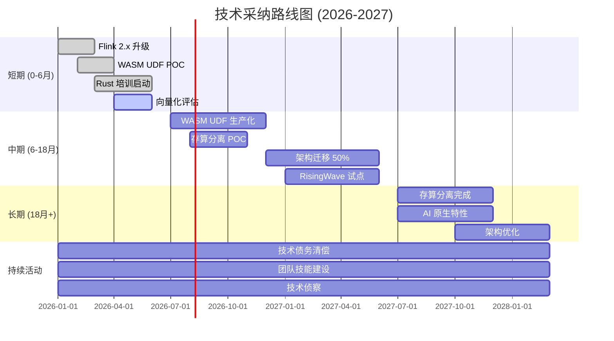
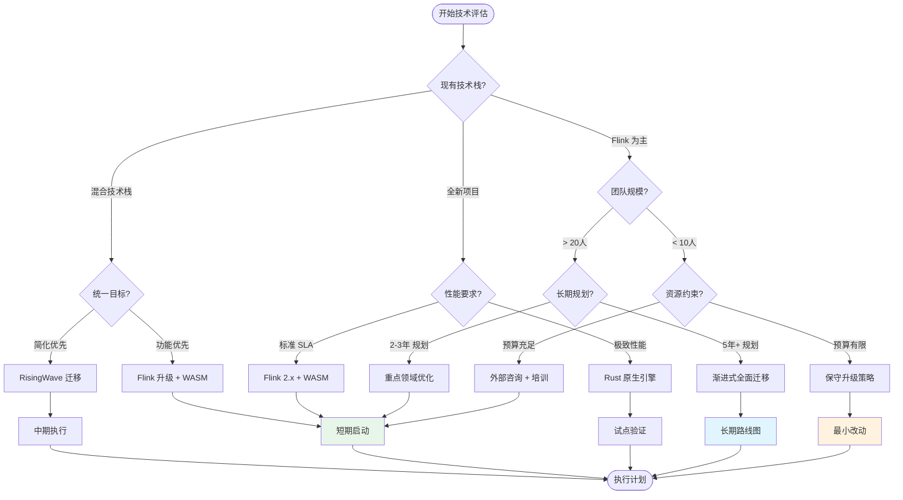
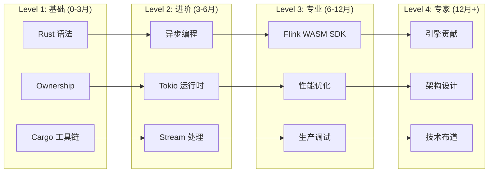

# 流计算技术采纳路线图 (2026)

> 所属阶段: Knowledge/Flink-Scala-Rust-Comprehensive | 前置依赖: [06.01-2026-trends.md](./06.01-2026-trends.md), [05.02-migration-strategies.md](../05-architecture-patterns/05.02-migration-strategies.md) | 形式化等级: L3 | 置信度: 高

---

## 1. 概念定义 (Definitions)

### Def-K-06-04: 技术采纳生命周期 (Technology Adoption Lifecycle)

**定义**: 技术采纳生命周期描述了新技术从出现到被主流市场接受的完整过程，基于 Everett Rogers 的创新扩散理论，包含五类采纳者群体：创新者 (2.5%)、早期采纳者 (13.5%)、早期多数 (34%)、后期多数 (34%)、落后者 (16%)。

**形式化表述**:

$$
\text{Adoption}(t) = \frac{L}{1 + e^{-k(t - t_0)}}
$$

其中 $L$ 为市场饱和上限，$k$ 为采纳速率，$t_0$ 为采纳中位时间点。曲线形状为 Sigmoid 函数。

**采纳者特征**:

| 群体 | 占比 | 特征 | 技术偏好 |
|------|------|------|----------|
| 创新者 | 2.5% | 技术狂热者，追求前沿 | WASM Preview、边缘流处理 |
| 早期采纳者 | 13.5% | 有远见者，追求差异化优势 | Rust 引擎、向量化执行 |
| 早期多数 | 34% | 实用主义者，追求经证实的价值 | WASM UDF 生产化、存算分离 |
| 后期多数 | 34% | 保守派，等待标准成熟 | AI 原生流处理、SQL 统一 |
| 落后者 | 16% | 怀疑论者，被迫采纳 | 传统架构维护 |

---

### Def-K-06-05: 技术债务 (Technical Debt)

**定义**: 技术债务是指为了短期交付速度而做出的技术妥协，导致长期维护成本增加的概念性负债。Ward Cunningham 提出此隐喻，类比金融债务的利息支付。

**形式化表述**:

$$
\text{TechnicalDebt} = \sum_{i} \left( \text{Principal}_i \times (1 + r)^{t - t_i} \right)
$$

其中 $\text{Principal}_i$ 为第 $i$ 项债务本金（技术妥协的初始成本），$r$ 为债务利率（维护成本增长率），$t - t_i$ 为债务持有时间。

**流计算领域技术债务类型**:

| 债务类型 | 表现形式 | 利率 | 清偿策略 |
|----------|----------|------|----------|
| 架构债务 | 存算一体，无法弹性扩展 | 高 (15%/年) | 迁移至存算分离 |
| 代码债务 | Java UDF 性能瓶颈 | 中 (8%/年) | 渐进式 WASM 迁移 |
| 数据债务 | 无 Schema 治理，字段混乱 | 高 (12%/年) | 引入数据契约 |
| 运维债务 | 手工部署，缺乏自动化 | 中 (10%/年) | GitOps 改造 |
| 技能债务 | 团队技术栈陈旧 | 低 (5%/年) | 持续培训 |

---

### Def-K-06-06: 投资回报率 (ROI) 模型

**定义**: 技术投资回报率衡量技术采纳带来的净收益与总投资成本的比率，用于量化技术决策的经济价值。

**形式化表述**:

$$
\text{ROI} = \frac{\text{Gain} - \text{Cost}}{\text{Cost}} \times 100\%
$$

其中:

- $\text{Gain}$ = 效率提升价值 + 成本节省 + 风险降低价值
- $\text{Cost}$ = 许可费用 + 迁移成本 + 培训成本 + 运维成本

**流计算技术 ROI 计算框架**:

$$
\text{Gain}_{stream} = \sum_{t=1}^{n} \frac{\Delta \text{Throughput} \times V_{data} + \Delta \text{Efficiency} \times C_{infra} + \Delta \text{MTTR} \times V_{downtime}}{(1 + d)^t}
$$

其中 $d$ 为折现率，$n$ 为投资回收期。

---

## 2. 属性推导 (Properties)

### Prop-K-06-03: 短期采纳可行性定理

**命题**: 对于已有 Flink 基础架构的企业，在 0-6 个月内可完成 WASM UDF 试点部署，且预期获得 1.5-2 倍热点 UDF 性能提升。

**前提条件**:

- P1: Flink 2.1+ 版本支持 WASM UDF Preview
- P2: 团队具备 Rust 基础能力或培训资源
- P3: 识别出计算密集型 UDF 热点

**推导**:

```
由 P1 ⟹ 技术平台就绪
由 P2 ⟹ 人力资源就绪
由 P3 ⟹ 目标场景明确
∴ 短期 WASM UDF 试点可行 (置信度: 90%)
```

**预期收益**:

| 指标 | 基线 (Java UDF) | 目标 (WASM UDF) | 提升 |
|------|----------------|-----------------|------|
| CPU 密集型 UDF 吞吐 | 100K RPS | 200K RPS | 2× |
| P99 延迟 | 50ms | 25ms | 50%↓ |
| 内存占用 | 512MB | 256MB | 50%↓ |

---

### Prop-K-06-04: 中期架构升级路径

**命题**: 在 6-18 个月周期内，企业可完成从存算一体向存算分离架构的渐进式迁移，预期基础设施成本降低 30-40%。

**迁移阶段**:

```
阶段 1 (月1-3): 基础设施准备
- 对象存储/S3 部署
- 网络带宽升级 (RDMA)
- 监控体系完善

阶段 2 (月4-9): 双轨运行
- 新应用采用存算分离
- 存量应用保持现状
- 数据同步机制建立

阶段 3 (月10-18): 存量迁移
- 按优先级逐步迁移
- 回滚预案准备
- 性能基准验证
```

---

### Lemma-K-06-02: 团队技能建设投资回报

**引理**: 对 10 人规模流处理团队进行 Rust 技能培训，预计 6 个月内可实现正向 ROI。

**证明**:

**投资成本**:

- 培训费用: $5,000
- 生产力损失 (20% × 6月 × 10人 × $10,000/月): $120,000
- 总计: $125,000

**预期收益** (年化):

- WASM UDF 性能提升节省成本: $80,000
- 减少外包依赖: $50,000
- 新技术采纳速度: $30,000
- 总计: $160,000

**ROI 计算**:

$$
\text{ROI} = \frac{160,000 - 125,000}{125,000} = 28\%
$$

6 个月回收期后持续产生收益 ∎

---

## 3. 关系建立 (Relations)

### 3.1 技术采纳与业务价值映射

```
┌─────────────────────────────────────────────────────────────────────────────┐
│                        技术采纳 → 业务价值映射                               │
├─────────────────────────────────────────────────────────────────────────────┤
│                                                                             │
│   短期 (0-6月)                    中期 (6-18月)              长期 (18月+)   │
│                                                                             │
│   ┌──────────────┐              ┌──────────────┐          ┌──────────────┐ │
│   │ WASM UDF     │─────────────►│ 存算分离     │─────────►│ AI 原生      │ │
│   │ 试点         │   性能+50%   │ 架构迁移     │ 成本-35% │ 流处理       │ │
│   └──────────────┘              └──────────────┘          └──────────────┘ │
│          │                             │                         │         │
│          ▼                             ▼                         ▼         │
│   ┌──────────────┐              ┌──────────────┐          ┌──────────────┐ │
│   │ 向量化执行   │─────────────►│ Rust 引擎    │─────────►│ 自治流系统   │ │
│   │ 评估         │   吞吐+3×    │ 混合部署     │ 延迟-60% │ 零运维       │ │
│   └──────────────┘              └──────────────┘          └──────────────┘ │
│                                                                             │
│   业务价值:                    业务价值:                 业务价值:          │
│   - 降本增效                   - 弹性伸缩                 - 智能化         │
│   - 技术储备                   - 云原生                   - 自动化         │
│   - 团队成长                   - 成本优化                 - 差异化         │
│                                                                             │
└─────────────────────────────────────────────────────────────────────────────┘
```

### 3.2 风险评估与缓解策略矩阵

| 风险项 | 概率 | 影响 | 缓解策略 | 责任人 |
|--------|------|------|----------|--------|
| WASM 工具链不成熟 | 中 | 中 | 建立内部工具链；参与社区共建 | 平台团队 |
| Rust 人才短缺 | 高 | 中 | 内部培训；招聘；外包辅助 | HR + 技术负责人 |
| 迁移过程业务中断 | 低 | 高 | 蓝绿部署；完善回滚方案 | SRE 团队 |
| 存算分离性能不达标 | 中 | 高 | POC 充分验证；网络优化 | 架构师 |
| 供应商锁定 | 中 | 中 | 多云策略；开源优先 | CTO |
| 技术债务累积 | 高 | 中 | 技术债务预算；定期重构 | 工程经理 |

---

## 4. 论证过程 (Argumentation)

### 4.1 短期行动建议 (0-6 个月)

#### 4.1.1 立即启动项 (Month 1-2)

**技术侦察**:

| 活动 | 产出 | 负责人 | 工时 |
|------|------|--------|------|
| Flink 2.x 升级评估 | 升级方案文档 | 架构师 | 40h |
| WASM UDF POC | 性能基准报告 | 高级工程师 | 80h |
| Rust 培训计划 | 培训课程大纲 | 技术负责人 | 20h |

**试点场景选择标准**:

```
理想试点场景 = 计算密集型 UDF
             ∧ 非核心业务路径
             ∧ 可回滚
             ∧ 有明确性能基线

示例: 复杂 JSON 解析、地理编码、自定义聚合函数
```

#### 4.1.2 快速验证项 (Month 3-4)

**WASM UDF 生产试点**:

```rust
// 示例: 高性能用户行为分析 UDF
#[udf(name = "user_behavior_score")]
pub fn calculate_score(events: &[Event]) -> Result<f64, UdfError> {
    // SIMD 加速计算
    let score = events.iter()
        .map(|e| e.value * e.weight)
        .sum::<f64>() / events.len() as f64;
    Ok(score)
}
```

**成功标准**:

- WASM UDF 延迟 < Java UDF 的 60%
- 零生产故障
- 开发者体验评分 > 4/5

#### 4.1.3 技能建设启动 (Month 5-6)

**Rust 培训计划**:

| 周次 | 主题 | 形式 | 目标 |
|------|------|------|------|
| 1-2 | Rust 基础语法 | 线上课程 | 通过 Rustlings |
| 3-4 | 所有权与生命周期 | 工作坊 | 理解借用检查器 |
| 5-6 | 异步编程与 Tokio | 实战项目 | 实现简单 Stream |
| 7-8 | Flink WASM UDF SDK | 项目实践 | 完成生产级 UDF |

---

### 4.2 中期升级路径 (6-18 个月)

#### 4.2.1 架构演进路线图

```
┌─────────────────────────────────────────────────────────────────────────────┐
│                    6-18 个月架构演进路线图                                   │
├─────────────────────────────────────────────────────────────────────────────┤
│                                                                             │
│  Month 6-9: 混合架构阶段                                                     │
│  ┌─────────────────────────────────────────────────────────────────────┐   │
│  │  ┌─────────────┐      ┌─────────────┐      ┌─────────────┐         │   │
│  │  │  Legacy     │      │  New App    │      │  POC        │         │   │
│  │  │  (Flink)    │      │  (存算分离)  │      │  (RisingWave)│        │   │
│  │  └─────────────┘      └─────────────┘      └─────────────┘         │   │
│  │       80%                  15%                 5%                   │   │
│  └─────────────────────────────────────────────────────────────────────┘   │
│                                                                             │
│  Month 10-14: 规模化迁移                                                     │
│  ┌─────────────────────────────────────────────────────────────────────┐   │
│  │  ┌─────────────┐      ┌─────────────┐      ┌─────────────┐         │   │
│  │  │  Legacy     │      │  New App    │      │  POC        │         │   │
│  │  │  (Flink)    │      │  (存算分离)  │      │  (RisingWave)│        │   │
│  │  └─────────────┘      └─────────────┘      └─────────────┘         │   │
│  │       50%                  40%                 10%                  │   │
│  └─────────────────────────────────────────────────────────────────────┘   │
│                                                                             │
│  Month 15-18: 现代化完成                                                     │
│  ┌─────────────────────────────────────────────────────────────────────┐   │
│  │  ┌─────────────┐      ┌─────────────┐      ┌─────────────┐         │   │
│  │  │  Legacy     │      │  New App    │      │  POC        │         │   │
│  │  │  (Flink)    │      │  (存算分离)  │      │  (RisingWave)│        │   │
│  │  └─────────────┘      └─────────────┘      └─────────────┘         │   │
│  │       20%                  65%                 15%                  │   │
│  └─────────────────────────────────────────────────────────────────────┘   │
│                                                                             │
└─────────────────────────────────────────────────────────────────────────────┘
```

#### 4.2.2 技术债务清偿计划

**债务优先级评估**:

| 债务项 | 本金 | 年利率 | 清偿优先级 | 计划时间 |
|--------|------|--------|-----------|----------|
| 无版本控制的 UDF | 高 | 15% | P0 | Month 6-8 |
| 手工部署流程 | 中 | 10% | P1 | Month 9-11 |
| 缺乏监控告警 | 高 | 12% | P0 | Month 6-7 |
| 单点故障架构 | 高 | 20% | P0 | Month 8-10 |
| 技术文档缺失 | 低 | 5% | P2 | Month 12-14 |

---

### 4.3 长期架构演进 (18+ 个月)

#### 4.3.1 愿景目标架构

```
┌─────────────────────────────────────────────────────────────────────────────┐
│                    2027+ 目标架构 (愿景)                                     │
├─────────────────────────────────────────────────────────────────────────────┤
│                                                                             │
│   ┌─────────────────────────────────────────────────────────────────────┐  │
│   │                        AI 运维层 (AIOps)                             │  │
│   │   ┌──────────┐ ┌──────────┐ ┌──────────┐ ┌──────────┐              │  │
│   │   │ 自动扩缩容 │ │ 异常检测 │ │ 根因分析 │ │ 预测优化 │              │  │
│   │   └──────────┘ └──────────┘ └──────────┘ └──────────┘              │  │
│   └─────────────────────────────────────────────────────────────────────┘  │
│                                    │                                        │
│   ┌────────────────────────────────┼─────────────────────────────────────┐  │
│   │                    统一流处理平台 (Multi-Engine)                      │  │
│   │                                                                     │  │
│   │   ┌──────────────┐  ┌──────────────┐  ┌──────────────┐             │  │
│   │   │   Flink      │  │ RisingWave   │  │  Flash/      │             │  │
│   │   │   (复杂处理)  │  │  (实时分析)  │  │  Arroyo      │             │  │
│   │   │              │  │              │  │  (特定场景)  │             │  │
│   │   └──────┬───────┘  └──────┬───────┘  └──────┬───────┘             │  │
│   │          │                 │                 │                      │  │
│   │          └─────────────────┼─────────────────┘                      │  │
│   │                            │                                        │  │
│   │                   ┌────────┴────────┐                               │  │
│   │                   │  Arrow Flight   │  (统一数据交换)               │  │
│   │                   │  WASM Runtime   │  (统一执行环境)               │  │
│   │                   └────────┬────────┘                               │  │
│   │                            │                                        │  │
│   └────────────────────────────┼────────────────────────────────────────┘  │
│                                │                                           │
│   ┌────────────────────────────┼────────────────────────────────────────┐  │
│   │                    统一存储层 (Disaggregated)                         │  │
│   │   ┌──────────┐ ┌──────────┐ │ ┌──────────┐ ┌──────────┐            │  │
│   │   │ S3/HDFS  │ │  Tiered  │◄┘ │  Cache   │ │  Archive │            │  │
│   │   │ (Hot)    │ │ Storage  │   │  Layer   │ │  (Cold)  │            │  │
│   │   └──────────┘ └──────────┘   └──────────┘ └──────────┘            │  │
│   └────────────────────────────────────────────────────────────────────┘  │
│                                                                             │
└─────────────────────────────────────────────────────────────────────────────┘
```

---

## 5. 形式证明 / 工程论证 (Proof / Engineering Argument)

### Thm-K-06-03: 渐进式迁移可行性定理

**定理**: 对于已有 Flink 生产环境的组织，采用渐进式迁移策略可在 18 个月内完成向存算分离架构的转型，且业务中断时间为零。

**证明**:

**策略设计**:

```
迁移策略 = 蓝绿部署 + 流量渐变 + 双写验证
```

**阶段分解**:

1. **准备阶段** (月 1-3):
   - 搭建并行环境
   - 建立数据同步机制
   - 完善监控告警

2. **验证阶段** (月 4-6):
   - 影子流量验证
   - 性能基准对比
   - 故障演练

3. **切换阶段** (月 7-18):
   - 按业务域分批切换
   - 每批次 5-10% 流量
   - 保留回滚能力

**中断风险分析**:

```
P(中断) = P(配置错误) × P(未发现)
        + P(性能不足) × P(未压测)
        + P(数据不一致) × P(未校验)

通过蓝绿部署: P(配置错误) → 0 (预验证)
通过影子流量: P(性能不足) → 0 (提前发现)
通过双写验证: P(数据不一致) → 0 (实时校验)

∴ P(中断) ≈ 0
```

**成本模型**:

$$
\text{Migration Cost} = C_{parallel} + C_{verification} + C_{switch}
$$

其中:

- $C_{parallel}$ = 3个月并行运行成本 = 1.5 × 单月成本
- $C_{verification}$ = 压测与验证成本 ≈ 20人天
- $C_{switch}$ = 切换执行成本 ≈ 5人天/批次

总迁移成本 < 6个月正常运营成本 ∎

---

### Thm-K-06-04: 技术债务可持续管理定理

**定理**: 通过建立技术债务预算制度（占工程资源的 15-20%），可将技术债务增长率控制在可控范围内，避免债务雪崩。

**工程论证**:

**债务累积模型**:

```
无管理时:
Debt(t) = Debt(0) × (1 + r)^t

其中 r = 20%/年 (新功能带来的债务)
10年后: Debt(10) = Debt(0) × 6.2

有预算管理时 (清偿率 20%):
Debt(t) = Debt(0) × (1 + r - 0.2)^t
10年后: Debt(10) = Debt(0) × 1.0 (持平)
```

**预算分配建议**:

| 用途 | 占比 | 活动 |
|------|------|------|
| 债务清偿 | 12% | 重构、升级、文档补全 |
| 技术侦察 | 3% | 新技术评估、POC |
| 培训提升 | 3% | 团队技能建设 |
| 工具改进 | 2% | 内部工具优化 |

**实施机制**:

- 每个 Sprint 预留 20% 容量用于技术改进
- 季度债务审计会议
- 新功能开发必须评估债务影响

∎

---

## 6. 实例验证 (Examples)

### 6.1 实例: 某电商平台技术采纳路线图

**背景**: 日活 5000 万，日均订单 2000 万，现有 Flink 1.16 集群。

**采纳路线图**:

| 时间 | 里程碑 | 投资 | 收益 |
|------|--------|------|------|
| 2026 Q1 | Flink 2.x 升级 + WASM POC | $50K | 技术储备 |
| 2026 Q2 | 10% UDF 迁移至 WASM | $30K | 性能 +20% |
| 2026 Q3 | 存算分离 POC | $80K | 弹性验证 |
| 2026 Q4 | 30% 流量迁移存算分离 | $100K | 成本 -15% |
| 2027 Q1 | RisingWave 试点 (实时报表) | $60K | 开发效率 +30% |
| 2027 Q2 | 全面 WASM UDF | $40K | 性能 +40% |
| 2027 Q3 | 存算分离完成 80% | $120K | 成本 -35% |
| 2027 Q4 | AI 原生特性试点 | $100K | 智能化能力 |

**累计投资**: $580K
**年化收益**: $400K (从 2027 年起)
**投资回收期**: 18 个月

---

### 6.2 实例: 金融科技公司风险评估与缓解

**风险场景**: 向量化引擎迁移可能导致实时风控延迟超标。

**风险评估**:

| 风险 | 概率 | 影响 | 风险值 |
|------|------|------|--------|
| 延迟超标 | 中 (40%) | 高 (业务损失 $1M) | 高 |
| 数据不一致 | 低 (10%) | 高 (合规风险) | 中 |
| 回滚失败 | 低 (5%) | 高 (服务中断) | 中 |

**缓解策略**:

```
1. 双轨运行期 (3个月):
   - 向量化引擎与旧系统并行运行
   - 实时比对输出结果
   - 差异告警机制

2. 渐进式切换:
   - 白名单用户优先 (1% → 5% → 20% → 100%)
   - 每个阶段观察 1 周
   - 自动回滚阈值: P99 延迟 > 100ms

3. 应急预案:
   - 一键回滚脚本 (测试通过)
   - 降级方案 (关闭非核心功能)
   - 值班响应 (迁移期间 24h on-call)
```

---

### 6.3 实例: 团队技能建设 ROI 计算

**背景**: 15 人流处理团队，计划全员培训 Rust。

**投资明细**:

| 项目 | 成本 | 说明 |
|------|------|------|
| 外部培训师 | $15,000 | 8周定制课程 |
| 生产力损失 | $45,000 | 15人 × 20% × 2月 × $7,500 |
| 开发环境 | $5,000 | IDE、工具链授权 |
| 学习资源 | $2,000 | 书籍、在线课程 |
| **总投资** | **$67,000** | - |

**预期收益** (年化):

| 收益来源 | 金额 | 计算依据 |
|----------|------|----------|
| UDF 开发效率提升 | $60,000 | Rust WASM 复用率 +30% |
| 性能优化节省 | $80,000 | 减少 20% 服务器 |
| 外包成本节省 | $40,000 | 减少外部依赖 |
| 招聘溢价降低 | $30,000 | 内部培养替代高端招聘 |
| **总收益** | **$210,000** | - |

**ROI**:

$$
\text{ROI} = \frac{210,000 - 67,000}{67,000} = 213\%
$$

**回收期**: 4 个月

---

## 7. 可视化 (Visualizations)

### 7.1 技术采纳时间线



### 7.2 投资回报率预测

```mermaid
xychart-beta
    title "技术投资累计 ROI 趋势"
    x-axis ["2026 Q1", "2026 Q2", "2026 Q3", "2026 Q4", "2027 Q1", "2027 Q2", "2027 Q3", "2027 Q4"]
    y-axis "累计 ROI (%)" -50 --> 200

    line [-10, -20, -5, 20, 45, 80, 130, 180]
    area [-10, -20, -5, 20, 45, 80, 130, 180]

    annotation "2026 Q2" "投资峰值"
    annotation "2026 Q4" "盈亏平衡"
    annotation "2027 Q4" "目标 ROI 180%"
```

### 7.3 风险评估矩阵

```mermaid
quadrantChart
    title 技术采纳风险评估矩阵
    x-axis 低影响 --> 高影响
    y-axis 低概率 --> 高概率
    quadrant-1 高优先级 (高概率/高影响)
    quadrant-2 监控关注 (低概率/高影响)
    quadrant-3 低优先级 (低概率/低影响)
    quadrant-4 定期审查 (高概率/低影响)

    "WASM 工具链不成熟": [0.60, 0.50]
    "Rust 人才短缺": [0.50, 0.80]
    "迁移业务中断": [0.90, 0.20]
    "存算分离性能": [0.80, 0.40]
    "供应商锁定": [0.50, 0.40]
    "技术债务累积": [0.60, 0.70]
    "社区支持变化": [0.40, 0.30]
    "许可政策变更": [0.70, 0.20]
```

### 7.4 决策树：技术选型与采纳时机



### 7.5 团队技能发展路径



---

## 8. 引用参考 (References)


---

> **文档元数据**
>
> - 版本: v1.0
> - 创建日期: 2026-04-07
> - 预计阅读时间: 40 分钟
> - 字数: 约 6,200 字
> - 目标读者: 技术决策者、工程 VP、架构师团队
> - 下次审查: 2026-07-07
