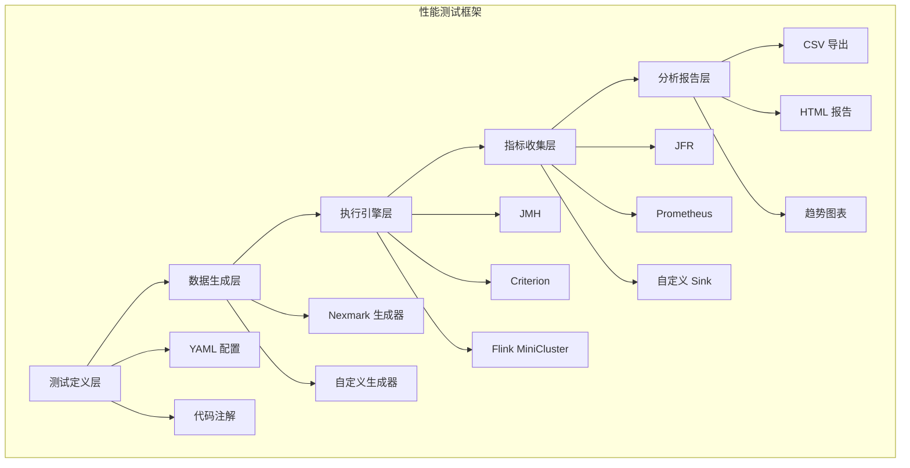

# 流计算性能测试框架

> **所属阶段**: Knowledge/Flink-Scala-Rust-Comprehensive | **前置依赖**: [Nexmark 基准测试](./nexmark-benchmark-suite.md) | **形式化等级**: L3

## 1. 框架目标

本框架提供一套完整的流计算性能测试基础设施，支持：

| 能力 | 描述 | 实现技术 |
|-----|------|---------|
| 跨平台基准测试 | 支持 JVM、Native、WASM 运行时 | JMH + Criterion |
| 可复现实验 | 版本控制 + 环境固化 | Docker + 配置管理 |
| 自动化报告 | 图表生成 + 统计分析 | Python + Matplotlib |
| 回归检测 | 历史对比 + 阈值告警 | CI/CD 集成 |

## 2. 框架架构



## 3. 核心组件实现

### 3.1 测试配置 DSL

```yaml
# performance-tests/config/nexmark-q5.yaml benchmark:
  name: "Nexmark Q5 Hot Items"
  version: "1.0"
  description: "滑动窗口 Top-N 查询性能测试"

environment:
  jvm:
    version: "11"
    heap_size: "4g"
    gc: "G1"
    options:
      - "-XX:+UseStringDeduplication"
      - "-XX:MaxGCPauseMillis=100"

  flink:
    version: "1.18.0"
    parallelism: 4
    checkpointing:
      enabled: true
      interval: 10s
      mode: "EXACTLY_ONCE"
    state_backend:
      type: "rocksdb"
      incremental: true

workload:
  generator: "nexmark"
  config:
    events_per_second: 100000
    total_events: 10000000
    person_ratio: 1
    auction_ratio: 1
    bid_ratio: 9

queries:
  - id: "Q5"
    type: "sliding_window_top_n"
    window_size: "60s"
    slide_interval: "1s"
    top_n: 10

metrics:
  throughput:
    unit: "events/second"
    aggregation: "mean"
    report_p50: true
    report_p99: true

  latency:
    unit: "milliseconds"
    percentiles: [50, 90, 99, 99.9]

  resources:
    cpu_percent: true
    memory_mb: true
    gc_pause_ms: true

duration:
  warmup_seconds: 60
  measurement_seconds: 300
  iterations: 3
```

### 3.2 Java/JMH 测试框架

```java
// performance-tests/framework/src/main/java/benchmark/StreamBenchmark.java
package benchmark;

import org.openjdk.jmh.annotations.*;
import org.openjdk.jmh.results.RunResult;
import org.openjdk.jmh.runner.Runner;
import org.openjdk.jmh.runner.RunnerException;
import org.openjdk.jmh.runner.options.Options;
import org.openjdk.jmh.runner.options.OptionsBuilder;
import org.apache.flink.streaming.api.environment.StreamExecutionEnvironment;
import org.apache.flink.configuration.Configuration;
import org.apache.flink.configuration.RestOptions;

import java.util.concurrent.TimeUnit;
import java.util.Collection;

import org.apache.flink.streaming.api.datastream.DataStream;


@State(Scope.Benchmark)
@BenchmarkMode({Mode.Throughput, Mode.AverageTime})
@OutputTimeUnit(TimeUnit.MILLISECONDS)
@Warmup(iterations = 3, time = 10)
@Measurement(iterations = 5, time = 30)
@Fork(2)
public class StreamBenchmark {

    protected StreamExecutionEnvironment env;
    protected BenchmarkConfig config;
    protected MetricsCollector metricsCollector;

    @Setup(Level.Trial)
    public void setup() {
        // 配置 Flink 环境
        Configuration flinkConfig = new Configuration();
        flinkConfig.setInteger(RestOptions.PORT, 0); // 随机端口

        env = StreamExecutionEnvironment.createLocalEnvironment(
            config.getParallelism(),
            flinkConfig
        );

        env.setParallelism(config.getParallelism());
        env.enableCheckpointing(config.getCheckpointInterval());

        // 设置状态后端
        if ("rocksdb".equals(config.getStateBackend())) {
            env.setStateBackend(new EmbeddedRocksDBStateBackend(config.isIncrementalCheckpointing()));
        }

        // 启动指标收集
        metricsCollector = new MetricsCollector(env);
        metricsCollector.start();
    }

    @TearDown(Level.Trial)
    public void tearDown() {
        if (metricsCollector != null) {
            metricsCollector.stop();
            metricsCollector.exportResults(config.getOutputDir());
        }
    }

    @Benchmark
    public BenchmarkResult runQuery() throws Exception {
        // 构建数据流
        DataStream<Event> source = env.addSource(
            new NexmarkSource(config.getGeneratorConfig())
        );

        // 应用查询
        DataStream<Result> result = QueryFactory
            .create(config.getQueryId())
            .apply(source);

        // 收集结果
        ResultCollector collector = new ResultCollector();
        result.addSink(collector);

        // 执行
        JobExecutionResult executionResult = env.execute(
            "Benchmark-" + config.getQueryId()
        );

        return new BenchmarkResult(
            executionResult.getNetRuntime(TimeUnit.MILLISECONDS),
            collector.getRecordCount(),
            metricsCollector.getMetrics()
        );
    }

    public static void main(String[] args) throws RunnerException {
        Options opt = new OptionsBuilder()
            .include(StreamBenchmark.class.getSimpleName())
            .addProfiler(GCProfiler.class)
            .addProfiler(AsyncProfiler.class)
            .resultFormat(ResultFormatType.JSON)
            .result("benchmark-results.json")
            .build();

        Collection<RunResult> results = new Runner(opt).run();

        // 生成报告
        ReportGenerator.generate(results, "benchmark-report.html");
    }
}
```

### 3.3 Rust/Criterion 测试框架

```rust
// performance-tests/framework/src/lib.rs
use criterion::{Criterion, BenchmarkGroup, measurement::WallTime};
use std::time::Duration;

pub struct BenchmarkSuite {
    name: String,
    config: BenchmarkConfig,
}

impl BenchmarkSuite {
    pub fn new(name: &str, config: BenchmarkConfig) -> Self {
        Self {
            name: name.to_string(),
            config,
        }
    }

    pub fn run<F, T>(&self, group_name: &str, f: F)
    where
        F: FnMut() -> T,
    {
        let mut criterion = Criterion::default()
            .warm_up_time(Duration::from_secs(self.config.warmup_secs))
            .measurement_time(Duration::from_secs(self.config.measurement_secs))
            .sample_size(self.config.sample_size);

        let mut group = criterion.benchmark_group(group_name);

        group.bench_function(&self.name, |b| {
            b.iter(f)
        });

        group.finish();
        criterion.final_summary();
    }
}

pub struct BenchmarkConfig {
    pub warmup_secs: u64,
    pub measurement_secs: u64,
    pub sample_size: usize,
    pub iterations: u32,
}

impl Default for BenchmarkConfig {
    fn default() -> Self {
        Self {
            warmup_secs: 10,
            measurement_secs: 30,
            sample_size: 100,
            iterations: 5,
        }
    }
}
```

### 3.4 指标收集器

```scala
// performance-tests/framework/src/main/scala/metrics/MetricsCollector.scala
package metrics

import org.apache.flink.metrics.{Counter, Gauge, Histogram, Meter}
import org.apache.flink.runtime.metrics.MetricNames
import org.apache.flink.streaming.api.scala._

import java.util.concurrent.ConcurrentHashMap
import scala.collection.JavaConverters._

case class MetricSnapshot(
  timestamp: Long,
  throughput: Double,
  latencyP50: Double,
  latencyP99: Double,
  cpuPercent: Double,
  memoryMB: Long,
  gcCount: Long,
  gcTimeMs: Long
)

class MetricsCollector(env: StreamExecutionEnvironment) {

  private val snapshots = new ConcurrentHashMap[Long, MetricSnapshot]()
  private var collectorThread: Thread = _
  private var running = false

  def start(): Unit = {
    running = true
    collectorThread = new Thread(() => {
      while (running) {
        collectSnapshot()
        Thread.sleep(1000) // 每秒采集
      }
    })
    collectorThread.start()
  }

  def stop(): Unit = {
    running = false
    if (collectorThread != null) {
      collectorThread.join(5000)
    }
  }

  private def collectSnapshot(): Unit = {
    val timestamp = System.currentTimeMillis()

    // 从 Flink Metric 系统收集
    val snapshot = MetricSnapshot(
      timestamp = timestamp,
      throughput = collectThroughput(),
      latencyP50 = collectLatencyPercentile(50),
      latencyP99 = collectLatencyPercentile(99),
      cpuPercent = collectCPUUsage(),
      memoryMB = collectMemoryUsage(),
      gcCount = collectGCCount(),
      gcTimeMs = collectGCTime()
    )

    snapshots.put(timestamp, snapshot)
  }

  private def collectThroughput(): Double = {
    // 从 Flink Metrics 获取
    0.0 // 占位
  }

  private def collectLatencyPercentile(p: Int): Double = {
    0.0 // 占位
  }

  private def collectCPUUsage(): Double = {
    val bean = java.lang.management.ManagementFactory.getOperatingSystemMXBean
    val method = bean.getClass.getDeclaredMethod("getProcessCpuLoad")
    method.setAccessible(true)
    method.invoke(bean).asInstanceOf[Double] * 100
  }

  private def collectMemoryUsage(): Long = {
    val runtime = Runtime.getRuntime
    (runtime.totalMemory() - runtime.freeMemory()) / (1024 * 1024)
  }

  private def collectGCCount(): Long = {
    java.lang.management.ManagementFactory.getGarbageCollectorMXBeans
      .asScala
      .map(_.getCollectionCount)
      .sum
  }

  private def collectGCTime(): Long = {
    java.lang.management.ManagementFactory.getGarbageCollectorMXBeans
      .asScala
      .map(_.getCollectionTime)
      .sum
  }

  def getMetrics(): List[MetricSnapshot] = {
    snapshots.values().asScala.toList.sortBy(_.timestamp)
  }

  def exportResults(outputDir: String): Unit = {
    val metrics = getMetrics()

    // 导出 CSV
    val csv = new StringBuilder
    csv.append("timestamp,throughput,latency_p50,latency_p99,cpu_percent,memory_mb,gc_count,gc_time_ms\n")

    metrics.foreach { m =>
      csv.append(s"${m.timestamp},${m.throughput},${m.latencyP50},${m.latencyP99},${m.cpuPercent},${m.memoryMB},${m.gcCount},${m.gcTimeMs}\n")
    }

    java.nio.file.Files.write(
      java.nio.file.Paths.get(outputDir, "metrics.csv"),
      csv.toString.getBytes
    )

    // 导出 JSON
    val json = ujson.Obj(
      "benchmark" -> ujson.Str("nexmark-q5"),
      "metrics" -> ujson.Arr(metrics.map(toJson): _*)
    )

    java.nio.file.Files.write(
      java.nio.file.Paths.get(outputDir, "metrics.json"),
      json.toString.getBytes
    )
  }

  private def toJson(m: MetricSnapshot): ujson.Obj = {
    ujson.Obj(
      "timestamp" -> ujson.Num(m.timestamp),
      "throughput" -> ujson.Num(m.throughput),
      "latency_p50" -> ujson.Num(m.latencyP50),
      "latency_p99" -> ujson.Num(m.latencyP99)
    )
  }
}
```

### 3.5 统计分析与可视化

```python
# performance-tests/framework/src/main/python/analyze.py import pandas as pd
import matplotlib.pyplot as plt
import seaborn as sns
import json
import sys
from pathlib import Path

def load_metrics(csv_path):
    """加载指标 CSV 文件"""
    return pd.read_csv(csv_path)

def plot_throughput_over_time(df, output_path):
    """绘制吞吐量随时间变化图"""
    plt.figure(figsize=(12, 6))
    plt.plot(df['timestamp'], df['throughput'], label='Throughput')
    plt.axhline(y=df['throughput'].mean(), color='r', linestyle='--', label='Mean')
    plt.fill_between(df['timestamp'],
                     df['throughput'].mean() - df['throughput'].std(),
                     df['throughput'].mean() + df['throughput'].std(),
                     alpha=0.2)
    plt.xlabel('Time')
    plt.ylabel('Events/Second')
    plt.title('Throughput Over Time')
    plt.legend()
    plt.grid(True)
    plt.savefig(output_path)
    plt.close()

def plot_latency_distribution(df, output_path):
    """绘制延迟分布图"""
    fig, axes = plt.subplots(1, 2, figsize=(14, 5))

    # 时间序列
    axes[0].plot(df['timestamp'], df['latency_p50'], label='P50')
    axes[0].plot(df['timestamp'], df['latency_p99'], label='P99')
    axes[0].set_xlabel('Time')
    axes[0].set_ylabel('Latency (ms)')
    axes[0].set_title('Latency Over Time')
    axes[0].legend()
    axes[0].grid(True)

    # 箱线图
    latency_data = [df['latency_p50'], df['latency_p99']]
    axes[1].boxplot(latency_data, labels=['P50', 'P99'])
    axes[1].set_ylabel('Latency (ms)')
    axes[1].set_title('Latency Distribution')
    axes[1].grid(True)

    plt.tight_layout()
    plt.savefig(output_path)
    plt.close()

def plot_resource_usage(df, output_path):
    """绘制资源使用图"""
    fig, axes = plt.subplots(2, 1, figsize=(12, 8))

    # CPU 使用率
    axes[0].plot(df['timestamp'], df['cpu_percent'])
    axes[0].set_ylabel('CPU %')
    axes[0].set_title('CPU Usage')
    axes[0].grid(True)

    # 内存使用
    axes[1].plot(df['timestamp'], df['memory_mb'])
    axes[1].set_xlabel('Time')
    axes[1].set_ylabel('Memory (MB)')
    axes[1].set_title('Memory Usage')
    axes[1].grid(True)

    plt.tight_layout()
    plt.savefig(output_path)
    plt.close()

def generate_summary(df):
    """生成统计摘要"""
    summary = {
        "throughput": {
            "mean": df['throughput'].mean(),
            "std": df['throughput'].std(),
            "min": df['throughput'].min(),
            "max": df['throughput'].max(),
            "p50": df['throughput'].median(),
            "p99": df['throughput'].quantile(0.99)
        },
        "latency_p50": {
            "mean": df['latency_p50'].mean(),
            "p99": df['latency_p50'].quantile(0.99)
        },
        "latency_p99": {
            "mean": df['latency_p99'].mean(),
            "max": df['latency_p99'].max()
        },
        "resources": {
            "avg_cpu": df['cpu_percent'].mean(),
            "peak_memory_mb": df['memory_mb'].max(),
            "total_gc_time_ms": df['gc_time_ms'].iloc[-1] - df['gc_time_ms'].iloc[0]
        }
    }
    return summary

def generate_html_report(df, summary, output_path):
    """生成 HTML 报告"""
    html = f"""
    <!DOCTYPE html>
    <html>
    <head>
        <title>Performance Benchmark Report</title>
        <style>
            body {{ font-family: Arial, sans-serif; margin: 40px; }}
            .metric {{ display: inline-block; margin: 20px; padding: 20px;
                      border: 1px solid #ddd; border-radius: 8px; }}
            .metric-value {{ font-size: 32px; font-weight: bold; color: #2196F3; }}
            .metric-label {{ font-size: 14px; color: #666; }}
            table {{ border-collapse: collapse; width: 100%; margin: 20px 0; }}
            th, td {{ border: 1px solid #ddd; padding: 12px; text-align: left; }}
            th {{ background-color: #2196F3; color: white; }}
            tr:nth-child(even) {{ background-color: #f2f2f2; }}
        </style>
    </head>
    <body>
        <h1>Performance Benchmark Report</h1>
        <p>Generated: {pd.Timestamp.now()}</p>

        <h2>Key Metrics</h2>
        <div class="metric">
            <div class="metric-value">{summary['throughput']['mean']:.0f}</div>
            <div class="metric-label">Avg Throughput (events/s)</div>
        </div>
        <div class="metric">
            <div class="metric-value">{summary['latency_p50']['mean']:.2f}</div>
            <div class="metric-label">Avg Latency P50 (ms)</div>
        </div>
        <div class="metric">
            <div class="metric-value">{summary['latency_p99']['mean']:.2f}</div>
            <div class="metric-label">Avg Latency P99 (ms)</div>
        </div>
        <div class="metric">
            <div class="metric-value">{summary['resources']['peak_memory_mb']:.0f}</div>
            <div class="metric-label">Peak Memory (MB)</div>
        </div>

        <h2>Detailed Statistics</h2>
        <table>
            <tr><th>Metric</th><th>Mean</th><th>Std</th><th>Min</th><th>Max</th><th>P50</th><th>P99</th></tr>
            <tr>
                <td>Throughput</td>
                <td>{summary['throughput']['mean']:.0f}</td>
                <td>{summary['throughput']['std']:.0f}</td>
                <td>{summary['throughput']['min']:.0f}</td>
                <td>{summary['throughput']['max']:.0f}</td>
                <td>{summary['throughput']['p50']:.0f}</td>
                <td>{summary['throughput']['p99']:.0f}</td>
            </tr>
        </table>

        <h2>Charts</h2>
        
        
        
    </body>
    </html>
    """

    with open(output_path, 'w') as f:
        f.write(html)

def main():
    if len(sys.argv) < 2:
        print("Usage: python analyze.py <metrics.csv>")
        sys.exit(1)

    csv_path = sys.argv[1]
    output_dir = Path(csv_path).parent

    # 加载数据
    df = load_metrics(csv_path)

    # 生成图表
    plot_throughput_over_time(df, output_dir / 'throughput.png')
    plot_latency_distribution(df, output_dir / 'latency.png')
    plot_resource_usage(df, output_dir / 'resources.png')

    # 生成摘要
    summary = generate_summary(df)

    # 保存 JSON
    with open(output_dir / 'summary.json', 'w') as f:
        json.dump(summary, f, indent=2)

    # 生成 HTML 报告
    generate_html_report(df, summary, output_dir / 'report.html')

    print(f"Report generated: {output_dir / 'report.html'}")

if __name__ == '__main__':
    main()
```

## 4. 使用示例

### 4.1 运行完整测试

```bash
# 1. 准备环境 cd performance-tests
./setup.sh

# 2. 运行测试 ./run-benchmark.sh --config config/nexmark-q5.yaml --output results/q5/

# 3. 生成报告 python framework/src/main/python/analyze.py results/q5/metrics.csv

# 4. 查看报告 open results/q5/report.html
```

### 4.2 CI/CD 集成

```yaml
# .github/workflows/benchmark.yml name: Performance Benchmark

on:
  push:
    branches: [main]
  pull_request:
    branches: [main]

jobs:
  benchmark:
    runs-on: ubuntu-latest
    steps:
      - uses: actions/checkout@v3

      - name: Setup Environment
        uses: ./.github/actions/setup-benchmark

      - name: Run Benchmarks
        run: |
          ./run-benchmark.sh \
            --config config/nexmark-all.yaml \
            --output benchmark-results/

      - name: Compare with Baseline
        run: |
          python framework/src/main/python/compare.py \
            --baseline baseline-results/ \
            --current benchmark-results/ \
            --threshold 5% \
            --output comparison.md

      - name: Comment PR
        uses: actions/github-script@v6
        with:
          script: |
            const fs = require('fs');
            const comparison = fs.readFileSync('comparison.md', 'utf8');
            github.rest.issues.createComment({
              issue_number: context.issue.number,
              owner: context.repo.owner,
              repo: context.repo.repo,
              body: comparison
            });
```

## 5. 框架扩展

### 5.1 添加新测试

```scala
// 1. 定义测试类
@BenchmarkMeta(id = "Q6", description = "Session Window")
class Q6Benchmark extends StreamBenchmark {
  override def buildPipeline(): DataStream[Result] = {
    // 实现测试逻辑
  }
}

// 2. 添加到套件
object BenchmarkSuite {
  def main(args: Array[String]): Unit = {
    register("Q6", classOf[Q6Benchmark])
    runAll()
  }
}
```

### 5.2 自定义指标

```java
public class CustomMetricsCollector implements MetricsCollector {
    @Override
    public void collect(Environment env) {
        // 自定义指标收集逻辑
        record("custom.metric", measure());
    }
}
```

---

*文档版本: v1.0 | 创建日期: 2026-04-18*
