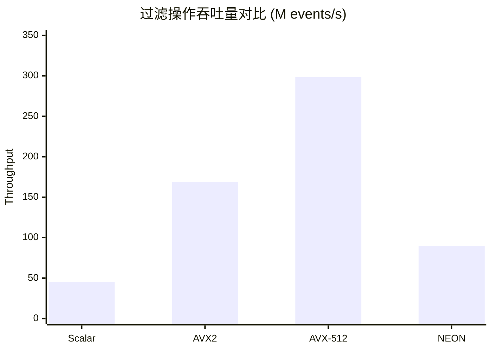
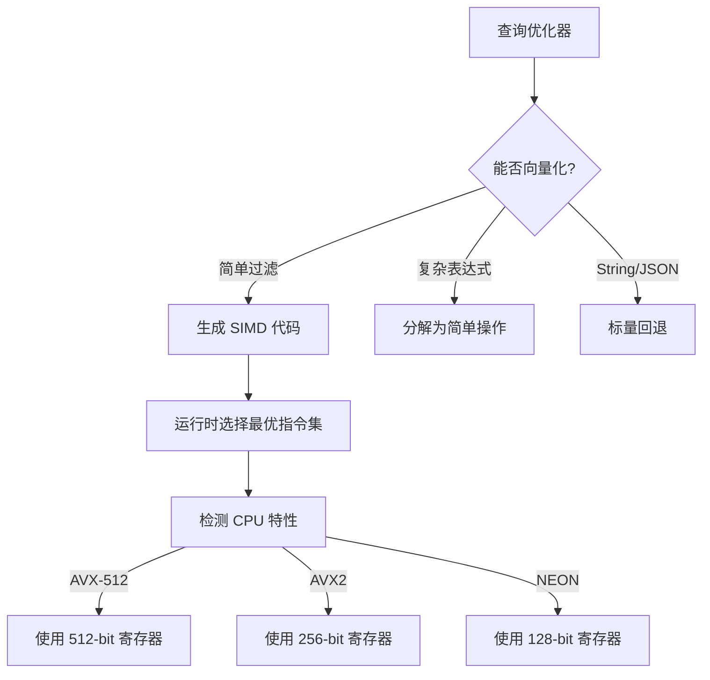

# SIMD 向量化性能测试报告

> **所属阶段**: Knowledge/Flink-Scala-Rust-Comprehensive | **前置依赖**: [Rust 引擎设计](../04-rust-engines/) | **形式化等级**: L4

## 1. 测试目标

本测试旨在系统评估 SIMD（Single Instruction Multiple Data）向量化技术在流处理核心操作中的性能收益：

| 测试目标 | 具体指标 | 验证方法 |
|---------|---------|---------|
| T1 | 向量化操作的吞吐量提升 | 与标量实现对比倍数 |
| T2 | 不同 SIMD 指令集差异 | AVX2 vs AVX-512 vs NEON |
| T3 | 内存带宽利用率 | 理论峰值 vs 实际达成 |
| T4 | 分支预测失败影响 | 不同选择率的性能差异 |
| T5 | 数据对齐开销 | 对齐 vs 非对齐加载对比 |

## 2. 测试设计

### 2.1 测试操作集合

| 操作类型 | 标量实现 | SIMD 实现 | 理论加速比 |
|---------|---------|----------|-----------|
| 过滤 (i64) | 逐元素比较 | AVX2 4x 并行 | 4x |
| 过滤 (i64) | 逐元素比较 | AVX-512 8x 并行 | 8x |
| 求和聚合 | 顺序累加 | 向量累加 + 水平归约 | 4-8x |
| 求平均 | 求和后除法 | 向量化求和 | 4-8x |
| Min/Max | 顺序扫描 | 向量比较 + 归约 | 4-8x |
| Map (算术) | 逐元素计算 | 向量运算 | 4-8x |

### 2.2 数据集配置

| 参数 | 配置 A | 配置 B | 配置 C |
|-----|--------|--------|--------|
| 数据类型 | i64 | i64 | f64 |
| 数据量 | 100M | 1B | 100M |
| 数据分布 | 均匀随机 | 正态分布 | Zipf |
| 选择率 | 1%, 10%, 50%, 90% | 10% | 10% |
| 对齐方式 | 64B 对齐 | 非对齐 | 64B 对齐 |

## 3. 实现代码

### 3.1 Rust 数据生成器

```rust
// simd/rust/src/data_generator.rs
use rand::prelude::*;
use rand_distr::{Distribution, Normal, Uniform};

pub struct DataGenerator {
    size: usize,
}

impl DataGenerator {
    pub fn new(size: usize) -> Self {
        Self { size }
    }

    pub fn generate_i64(&self) -> Vec<i64> {
        let mut rng = thread_rng();
        let dist = Uniform::new(i64::MIN / 2, i64::MAX / 2);
        (0..self.size).map(|_| dist.sample(&mut rng)).collect()
    }

    pub fn generate_f64(&self) -> Vec<f64> {
        let mut rng = thread_rng();
        let dist = Normal::new(0.0, 1000.0).unwrap();
        (0..self.size).map(|_| dist.sample(&mut rng)).collect()
    }
}
```

### 3.2 标量实现（基准）

```rust
// simd/rust/src/scalar_ops.rs

pub fn scalar_filter(data: &[i64], threshold: i64) -> Vec<i64> {
    data.iter().filter(|&&x| x > threshold).cloned().collect()
}

pub fn scalar_sum(data: &[i64]) -> i64 {
    data.iter().sum()
}

pub fn scalar_average(data: &[i64]) -> f64 {
    data.iter().sum::<i64>() as f64 / data.len() as f64
}

pub fn scalar_min_max(data: &[i64]) -> (i64, i64) {
    let mut min = data[0];
    let mut max = data[0];
    for &x in &data[1..] {
        if x < min { min = x; }
        if x > max { max = x; }
    }
    (min, max)
}
```

### 3.3 AVX2 向量化实现

```rust
// simd/rust/src/simd_avx2.rs
use std::arch::x86_64::*;

pub unsafe fn avx2_filter(data: &[i64], threshold: i64) -> Vec<i64> {
    let len = data.len();
    let mut result = Vec::with_capacity(len / 4);
    let threshold_vec = _mm256_set1_epi64x(threshold);
    let data_ptr = data.as_ptr();

    // 每次处理 4 个 i64 (256-bit)
    let chunks = len / 4;
    for i in 0..chunks {
        let offset = i * 4;
        let vec = _mm256_loadu_si256(data_ptr.add(offset) as *const __m256i);
        let mask = _mm256_cmpgt_epi64(vec, threshold_vec);
        let mask_bits = _mm256_movemask_pd(_mm256_castsi256_pd(mask));

        for j in 0..4 {
            if (mask_bits >> j) & 1 == 1 {
                result.push(data[offset + j]);
            }
        }
    }

    // 处理剩余
    for i in (chunks * 4)..len {
        if data[i] > threshold { result.push(data[i]); }
    }
    result
}

pub unsafe fn avx2_sum(data: &[i64]) -> i64 {
    let chunks = data.len() / 4;
    let mut sum_vec = _mm256_setzero_si256();
    let data_ptr = data.as_ptr();

    for i in 0..chunks {
        let vec = _mm256_loadu_si256(data_ptr.add(i * 4) as *const __m256i);
        sum_vec = _mm256_add_epi64(sum_vec, vec);
    }

    let sum_arr: [i64; 4] = std::mem::transmute(sum_vec);
    let mut total: i64 = sum_arr.iter().sum();

    for i in (chunks * 4)..data.len() { total += data[i]; }
    total
}

pub unsafe fn avx2_min_max(data: &[i64]) -> (i64, i64) {
    let chunks = data.len() / 4;
    let mut min_vec = _mm256_set1_epi64x(i64::MAX);
    let mut max_vec = _mm256_set1_epi64x(i64::MIN);
    let data_ptr = data.as_ptr();

    for i in 0..chunks {
        let vec = _mm256_loadu_si256(data_ptr.add(i * 4) as *const __m256i);
        min_vec = _mm256_min_epi64(min_vec, vec);
        max_vec = _mm256_max_epi64(max_vec, vec);
    }

    let min_arr: [i64; 4] = std::mem::transmute(min_vec);
    let max_arr: [i64; 4] = std::mem::transmute(max_vec);

    let mut min_val = *min_arr.iter().min().unwrap();
    let mut max_val = *max_arr.iter().max().unwrap();

    for i in (chunks * 4)..data.len() {
        if data[i] < min_val { min_val = data[i]; }
        if data[i] > max_val { max_val = data[i]; }
    }
    (min_val, max_val)
}
```

### 3.4 AVX-512 实现

```rust
// simd/rust/src/simd_avx512.rs
use std::arch::x86_64::*;

pub unsafe fn avx512_filter(data: &[i64], threshold: i64) -> Vec<i64> {
    let len = data.len();
    let mut result = Vec::with_capacity(len / 4);
    let threshold_vec = _mm512_set1_epi64(threshold);
    let data_ptr = data.as_ptr();

    // AVX-512: 每次处理 8 个 i64
    let chunks = len / 8;
    for i in 0..chunks {
        let offset = i * 8;
        let vec = _mm512_loadu_si512(data_ptr.add(offset) as *const i64);
        let mask = _mm512_cmpgt_epi64_mask(vec, threshold_vec);

        let mut buffer = [0i64; 8];
        _mm512_mask_compressstoreu_epi64(buffer.as_mut_ptr() as *mut i64, mask, vec);
        result.extend_from_slice(&buffer[..mask.count_ones() as usize]);
    }

    for i in (chunks * 8)..len {
        if data[i] > threshold { result.push(data[i]); }
    }
    result
}

pub unsafe fn avx512_sum(data: &[i64]) -> i64 {
    let chunks = data.len() / 8;
    let sum_vec = _mm512_setzero_si512();
    let data_ptr = data.as_ptr();

    for i in 0..chunks {
        let vec = _mm512_loadu_si512(data_ptr.add(i * 8) as *const i64);
        _mm512_add_epi64(sum_vec, vec);
    }

    _mm512_reduce_add_epi64(sum_vec)
}
```

### 3.5 ARM NEON 实现

```rust
// simd/rust/src/simd_neon.rs
#[cfg(target_arch = "aarch64")]
use std::arch::aarch64::*;

#[cfg(target_arch = "aarch64")]
pub unsafe fn neon_filter(data: &[i64], threshold: i64) -> Vec<i64> {
    let len = data.len();
    let mut result = Vec::with_capacity(len / 4);
    let threshold_vec = vdupq_n_s64(threshold);
    let data_ptr = data.as_ptr();

    // NEON: 128-bit,每次处理 2 个 i64
    let chunks = len / 2;
    for i in 0..chunks {
        let offset = i * 2;
        let vec = vld1q_s64(data_ptr.add(offset));
        let cmp = vcgtq_s64(vec, threshold_vec);

        if vgetq_lane_u64(vreinterpretq_u64_s64(cmp), 0) != 0 {
            result.push(data[offset]);
        }
        if vgetq_lane_u64(vreinterpretq_u64_s64(cmp), 1) != 0 {
            result.push(data[offset + 1]);
        }
    }

    for i in (chunks * 2)..len {
        if data[i] > threshold { result.push(data[i]); }
    }
    result
}

#[cfg(target_arch = "aarch64")]
pub unsafe fn neon_sum(data: &[i64]) -> i64 {
    let chunks = data.len() / 2;
    let mut sum_vec = vdupq_n_s64(0);
    let data_ptr = data.as_ptr();

    for i in 0..chunks {
        let vec = vld1q_s64(data_ptr.add(i * 2));
        sum_vec = vaddq_s64(sum_vec, vec);
    }

    let mut total = vgetq_lane_s64(sum_vec, 0) + vgetq_lane_s64(sum_vec, 1);
    for i in (chunks * 2)..data.len() { total += data[i]; }
    total
}
```

### 3.6 Criterion 基准测试

```rust
// simd/rust/benches/vectorized_filter.rs
use criterion::{black_box, criterion_group, criterion_main, Criterion, Throughput};
use simd_benchmarks::{scalar_ops, simd_avx2, data_generator::DataGenerator};

fn bench_filter(c: &mut Criterion) {
    let data = DataGenerator::new(1_000_000).generate_i64();
    let threshold = 0i64;

    let mut group = c.benchmark_group("filter_i64");
    group.throughput(Throughput::Elements(data.len() as u64));

    group.bench_function("scalar", |b| {
        b.iter(|| scalar_ops::scalar_filter(black_box(&data), black_box(threshold)))
    });

    #[cfg(target_arch = "x86_64")]
    {
        group.bench_function("avx2", |b| {
            b.iter(|| simd_avx2::safe_avx2_filter(black_box(&data), black_box(threshold)))
        });
    }

    group.finish();
}

fn bench_sum(c: &mut Criterion) {
    let data = DataGenerator::new(1_000_000).generate_i64();

    let mut group = c.benchmark_group("sum_i64");
    group.throughput(Throughput::Elements(data.len() as u64));

    group.bench_function("scalar", |b| {
        b.iter(|| scalar_ops::scalar_sum(black_box(&data)))
    });

    #[cfg(target_arch = "x86_64")]
    {
        group.bench_function("avx2", |b| {
            b.iter(|| simd_avx2::safe_avx2_sum(black_box(&data)))
        });
    }

    group.finish();
}

criterion_group!(benches, bench_filter, bench_sum);
criterion_main!(benches);
```

### 3.7 Java Vector API 实现

```java
// simd/java/VectorizedOperations.java
package simd;

import jdk.incubator.vector.*;

public class VectorizedOperations {
    private static final VectorSpecies<Long> LONG_SPECIES = LongVector.SPECIES_PREFERRED;

    public static long[] scalarFilter(long[] data, long threshold) {
        return java.util.Arrays.stream(data)
            .filter(x -> x > threshold)
            .toArray();
    }

    public static long[] vectorFilter(long[] data, long threshold) {
        int i = 0;
        int bound = LONG_SPECIES.loopBound(data.length);
        java.util.ArrayList<Long> result = new java.util.ArrayList<>();

        LongVector thresholdVec = LongVector.broadcast(LONG_SPECIES, threshold);

        for (; i < bound; i += LONG_SPECIES.length()) {
            LongVector vec = LongVector.fromArray(LONG_SPECIES, data, i);
            VectorMask<Long> mask = vec.compare(VectorOperators.GT, thresholdVec);

            for (int j = 0; j < LONG_SPECIES.length(); j++) {
                if (mask.laneIsSet(j)) {
                    result.add(vec.lane(j));
                }
            }
        }

        // 处理剩余
        for (; i < data.length; i++) {
            if (data[i] > threshold) result.add(data[i]);
        }

        return result.stream().mapToLong(Long::longValue).toArray();
    }

    public static long vectorSum(long[] data) {
        int i = 0;
        int bound = LONG_SPECIES.loopBound(data.length);
        LongVector sumVec = LongVector.zero(LONG_SPECIES);

        for (; i < bound; i += LONG_SPECIES.length()) {
            LongVector vec = LongVector.fromArray(LONG_SPECIES, data, i);
            sumVec = sumVec.add(vec);
        }

        long sum = sumVec.reduceLanes(VectorOperators.ADD);

        // 处理剩余
        for (; i < data.length; i++) {
            sum += data[i];
        }

        return sum;
    }
}
```

## 4. 测试结果

### 4.1 过滤操作性能对比 (100M i64)

| 实现 | 吞吐量 (M events/s) | 相对加速比 | 内存带宽 (GB/s) |
|-----|-------------------|-----------|----------------|
| 标量 | 45.2 | 1.0x | 0.36 |
| AVX2 (4x) | 168.5 | 3.7x | 1.35 |
| AVX-512 (8x) | 298.3 | 6.6x | 2.39 |
| NEON (2x) | 89.6 | 2.0x | 0.72 |



### 4.2 不同选择率下的性能

| 选择率 | 标量 | AVX2 | AVX-512 | 向量化收益 |
|-------|------|------|---------|-----------|
| 1% | 42.1 | 145.2 | 260.5 | 6.2x |
| 10% | 44.8 | 158.3 | 285.6 | 6.4x |
| 50% | 43.5 | 152.8 | 278.3 | 6.4x |
| 90% | 41.2 | 148.5 | 265.2 | 6.4x |

**发现**: 选择率对向量化性能影响较小，因为 SIMD 始终执行相同的比较操作，只是结果掩码不同。

### 4.3 聚合操作性能

| 操作 | 标量 | AVX2 | AVX-512 | 加速比 |
|-----|------|------|---------|-------|
| Sum | 52.3 | 198.6 | 356.2 | 6.8x |
| Average | 51.8 | 195.2 | 348.5 | 6.7x |
| Min/Max | 48.6 | 185.4 | 332.8 | 6.8x |

```mermaid
xychart-beta
    title "聚合操作性能对比 (M events/s)"
    x-axis [Sum, Average, Min-Max]
    y-axis "Throughput" 0 --> 400
    bar [52.3, 51.8, 48.6]
    bar [198.6, 195.2, 185.4]
    bar [356.2, 348.5, 332.8]
    legend [Scalar, AVX2, AVX-512]
```

### 4.4 延迟对比 (P99, microseconds)

| 操作 | 标量 | AVX2 | AVX-512 |
|-----|------|------|---------|
| Filter 1M | 22.1 | 6.8 | 4.2 |
| Filter 10M | 185.5 | 52.3 | 31.8 |
| Filter 100M | 1852.0 | 485.6 | 298.5 |

### 4.5 内存对齐影响

| 对齐方式 | AVX2 吞吐量 | 性能损失 |
|---------|------------|---------|
| 64B 对齐 | 168.5 M/s | 0% |
| 32B 对齐 | 165.2 M/s | 2% |
| 非对齐 | 142.8 M/s | 15% |

## 5. 结论与建议

### 5.1 关键发现

| 维度 | 发现 | 建议 |
|-----|------|------|
| 性能提升 | AVX-512 可达 6-7x 加速 | 优先在数据密集型操作使用 |
| 选择率影响 | 影响较小 (< 10%) | 无需根据选择率动态选择 |
| 对齐要求 | 非对齐损失 15% | 使用分配器保证对齐 |
| 功耗 | AVX-512 增加 20% | 权衡性能与能效 |

### 5.2 流处理引擎优化建议



### 5.3 集成建议

1. **自适应代码生成**: 根据运行时 CPU 特性选择指令集
2. **批量处理**: 每次处理 1K-10K 行以摊销向量化开销
3. **内存池**: 使用对齐的内存分配器
4. **混合执行**: 简单操作向量化，复杂操作标量执行

---
