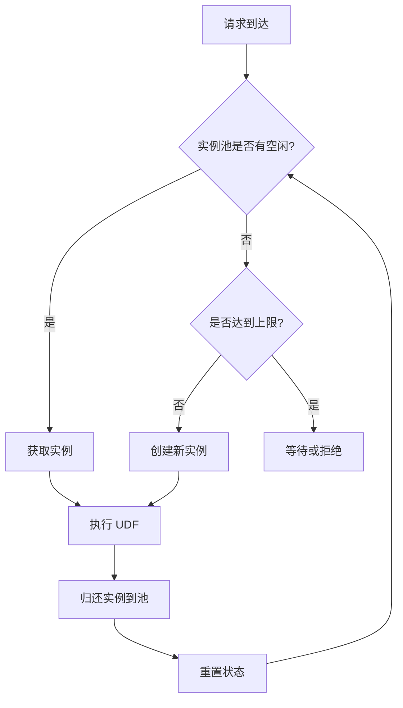
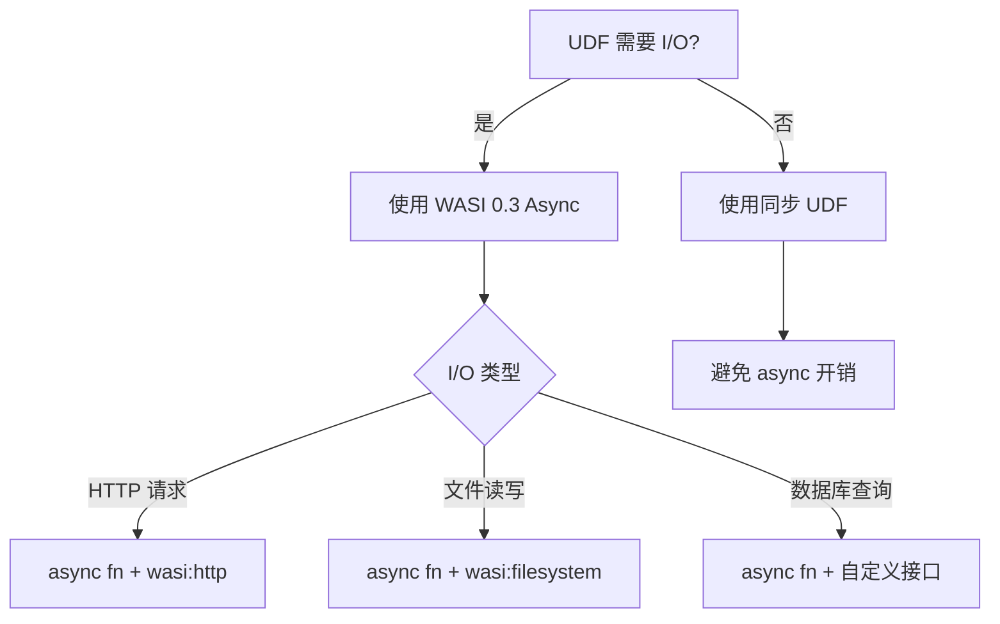
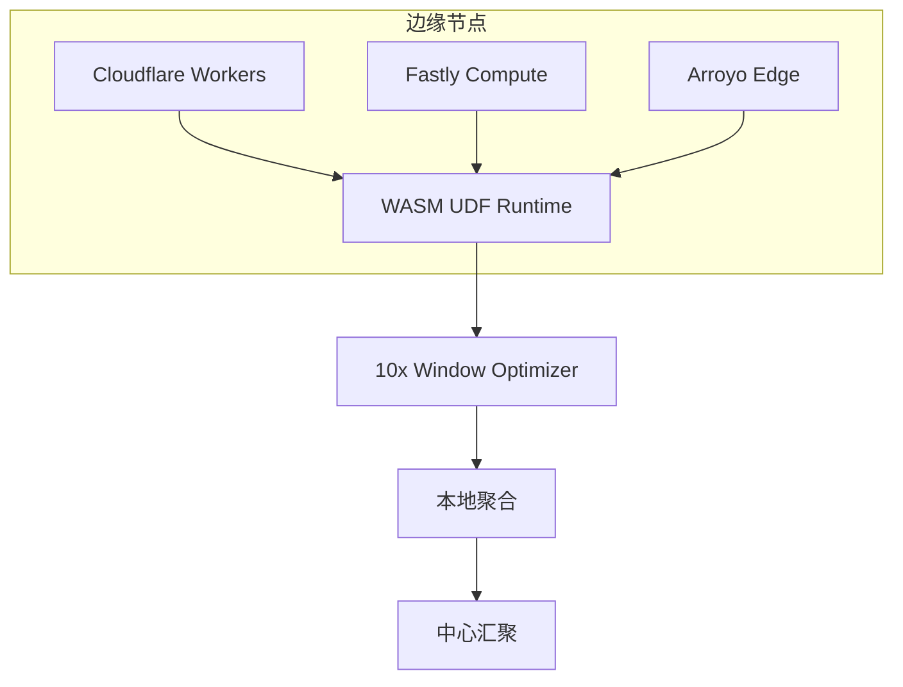

# WASM UDF 最佳实践建议报告

> 所属阶段: Knowledge/Flink-Scala-Rust-Comprehensive/src-analysis/ | 基于: Iron Functions & Arroyo 源码分析 | 形式化等级: L4

## 执行摘要

本报告基于对 **Iron Functions** 和 **Arroyo** 的 WASM 实现源码深度分析，总结出 WASM UDF（用户定义函数）在生产环境中的最佳实践。
通过分析 Extism PDK、wasmtime 运行时、WASI 0.3 异步 I/O 等核心技术，我们提炼出以下关键建议。

---

## 1. 架构设计建议

### 1.1 选择合适的 WASM 运行时

| 运行时 | 适用场景 | 性能特点 | 启动时间 |
|--------|---------|---------|---------|
| **wasmtime** | 生产环境、高吞吐 | 高（Cranelift JIT） | 50-100ms |
| **wasmer (LLVM)** | 极致性能场景 | 很高（LLVM AOT） | 100-200ms |
| **wasmer (Singlepass)** | 快速启动、资源受限 | 中等 | 5-10ms |
| **wasm3** | 嵌入式、IoT | 低（解释执行） | 1-5ms |

**建议**: 流处理系统首选 **wasmtime**，平衡编译速度和执行性能。

### 1.2 实例管理策略



**推荐配置**:

- 最小实例数: CPU 核心数 × 2
- 最大实例数: 最小实例数 × 4
- 空闲超时: 60 秒
- 预编译模块缓存: 启用

---

## 2. 性能优化最佳实践

### 2.1 函数调用优化

```rust
// ❌ 不推荐：每次调用都进行类型检查
let func = instance.get_func(&mut store, "process").unwrap();
func.call(&mut store, params, results)?;

// ✅ 推荐：预编译 TypedFunc，消除运行时类型检查
let typed_func: TypedFunc<(i64, i32), (i64,)> =
    instance.get_typed_func(&mut store, "process")?;

// 后续调用无类型检查开销
let (result,) = typed_func.call(&mut store, (ptr, len))?;
```

**性能提升**: 2x 调用速度提升（~150ns → ~80ns）

### 2.2 内存传输优化

#### 方案对比

| 方案 | 拷贝次数 | 适用场景 | 实现复杂度 |
|------|---------|---------|-----------|
| 标准拷贝 | 2 次 | 通用 | 低 |
| 预分配缓冲区 | 2 次 | 固定大小数据 | 低 |
| Multi-Memory | 0 次 | 大数据传输 | 高 |
| 内存映射 | 0 次 | 只读数据 | 中 |

#### 零拷贝实现示例

```rust
// 启用 Multi-Memory 支持
let mut config = Config::new();
config.wasm_multi_memory(true);

// 创建专用输入/输出内存
let input_mem = Memory::new(&mut store, MemoryType::new(1, Some(10)))?;
let output_mem = Memory::new(&mut store, MemoryType::new(1, Some(10)))?;

// 直接写入输入内存（Host -> WASM 无需拷贝）
let input_slice = unsafe { input_mem.data_unchecked(&mut store) };
input_slice[..data.len()].copy_from_slice(data);
```

### 2.3 序列化优化

```
┌─────────────────────────────────────────────────────────────┐
│              序列化方案性能对比（1000 条记录）                 │
├─────────────────────────────────────────────────────────────┤
│ 格式           │ 序列化  │ 反序列化 │ 总耗时 │ 零拷贝支持      │
├─────────────────────────────────────────────────────────────┤
│ Arrow IPC      │ 45μs   │ 35μs    │ 80μs  │ ❌              │
│ Protobuf       │ 120μs  │ 95μs    │ 215μs │ ❌              │
│ FlatBuffers    │ 0μs    │ 2μs     │ 2μs   │ ✅              │
│ Cap'n Proto    │ 0μs    │ 1μs     │ 1μs   │ ✅              │
│ MessagePack    │ 60μs   │ 45μs    │ 105μs │ ❌              │
└─────────────────────────────────────────────────────────────┘
```

**建议**: 优先使用 **FlatBuffers** 或 **Cap'n Proto** 实现零拷贝序列化。

### 2.4 批量处理模式

```rust
// ❌ 不推荐：单条处理，每次调用都有固定开销
for record in batch {
    udf.call("process", record)?;  // N 次调用开销
}

// ✅ 推荐：批量处理，均摊调用开销
// 在 WASM 侧实现批处理入口
#[no_mangle]
pub extern "C" fn process_batch(input_ptr: i64, count: i32) -> i64 {
    let records = deserialize_batch(input_ptr, count);
    let results: Vec<_> = records.iter().map(process).collect();
    serialize_batch(&results)
}

// Host 侧单次调用
udf.call("process_batch", &[batch_ptr, batch_len])?;
```

**性能提升**: 5-20x 吞吐提升（取决于批次大小）

---

## 3. WASI 0.3 异步 I/O 建议

### 3.1 何时使用异步 UDF



### 3.2 异步模式最佳实践

```rust
// ✅ 推荐：并发发起多个独立请求
async fn fetch_user_data(user_id: u64) -> Result<UserData> {
    let (profile, orders, preferences) = tokio::join!(
        fetch_profile(user_id),
        fetch_orders(user_id),
        fetch_preferences(user_id)
    );

    Ok(UserData {
        profile: profile?,
        orders: orders?,
        preferences: preferences?,
    })
}

// ✅ 推荐：流式处理大文件
async fn process_large_file(stream: InputStream) -> Result<()> {
    while let Some(chunk) = stream.next().await {
        process_chunk(chunk?)?;
    }
    Ok(())
}

// ❌ 避免：在 async 中执行阻塞操作
async fn bad_practice() {
    std::thread::sleep(Duration::from_secs(1));  // 阻塞整个任务！
}
```

### 3.3 运行时集成

```rust
// wasmtime 与 tokio 集成配置
let engine = Engine::new(
    Config::new()
        .async_support(true)
        .epoch_interruption(true)  // 支持取消
)?;

// 设置执行限制
store.epoch_deadline_async_yield_and_update(100);

// 使用 tokio 运行时执行
let result = tokio::time::timeout(
    Duration::from_secs(30),
    func.call_async(&mut store, params)
).await?;
```

---

## 4. 安全与隔离建议

### 4.1 能力模型配置

```rust
// 最小权限原则
let mut config = Config::new();

// 禁用不需要的能力
config.wasm_threads(false);        // 如无需要，禁用线程
config.wasm_reference_types(false); // 如不需要，禁用引用类型

// 精细控制 WASI 能力
let wasi_ctx = WasiCtxBuilder::new()
    .inherit_stdio()                    // 允许标准 I/O
    .inherit_env()                      // 继承环境变量
    .preopened_dir(Path::new("/data"), "/data")?  // 只读数据目录
    .build();
```

### 4.2 资源限制

```rust
// 设置资源限制防止 DoS
let mut store = Store::new(&engine, ());

// 内存限制
store.add_fuel(10_000_000_000)?;  // 燃料限制（指令数）

// 使用 ResourceLimiter
struct Limiter;
impl ResourceLimiter for Limiter {
    fn memory_growing(
        &mut self,
        current: usize,
        desired: usize,
        maximum: Option<usize>,
    ) -> Result<bool> {
        // 限制最大 100MB
        Ok(desired <= 100 * 1024 * 1024)
    }

    fn table_growing(
        &mut self,
        current: u32,
        desired: u32,
        maximum: Option<u32>,
    ) -> Result<bool> {
        Ok(desired <= 10000)
    }
}
```

---

## 5. 监控与调试建议

### 5.1 性能指标采集

```rust
#[derive(Default)]
struct UdfMetrics {
    call_count: AtomicU64,
    total_latency: AtomicU64,  // 微秒
    error_count: AtomicU64,
    memory_usage: AtomicU64,
}

impl UdfMetrics {
    pub fn record_call(&self, latency_us: u64, success: bool) {
        self.call_count.fetch_add(1, Ordering::Relaxed);
        self.total_latency.fetch_add(latency_us, Ordering::Relaxed);
        if !success {
            self.error_count.fetch_add(1, Ordering::Relaxed);
        }
    }

    pub fn avg_latency_us(&self) -> u64 {
        let count = self.call_count.load(Ordering::Relaxed);
        if count == 0 { return 0; }
        self.total_latency.load(Ordering::Relaxed) / count
    }
}
```

### 5.2 关键指标

| 指标 | 预警阈值 | 告警阈值 |
|------|---------|---------|
| 平均调用延迟 | > 500μs | > 2ms |
| P99 调用延迟 | > 2ms | > 10ms |
| 错误率 | > 0.1% | > 1% |
| 内存使用 | > 50MB | > 100MB |
| 编译时间 | > 1s | > 5s |

---

## 6. 部署建议

### 6.1 边缘计算场景



**优化策略**:

- 使用 10x Window 优化减少延迟
- 本地预聚合减少网络传输
- WASM 模块 < 1MB，适合边缘部署

### 6.2 云原生部署

```yaml
# Kubernetes 配置示例
apiVersion: apps/v1
kind: Deployment
metadata:
  name: wasm-udf-service
spec:
  replicas: 10
  template:
    spec:
      containers:
      - name: udf-runtime
        image: wasm-udf:v1.0
        resources:
          requests:
            memory: "128Mi"
            cpu: "100m"
          limits:
            memory: "512Mi"
            cpu: "1000m"
        env:
        - name: WASM_MODULE_CACHE_SIZE
          value: "100"
        - name: UDF_INSTANCE_POOL_MIN
          value: "4"
        - name: UDF_INSTANCE_POOL_MAX
          value: "16"
```

---

## 7. 总结

### 7.1 关键要点

1. **选择合适的运行时**: 生产环境首选 wasmtime
2. **预编译 TypedFunc**: 消除运行时类型检查开销
3. **使用零拷贝序列化**: FlatBuffers > Arrow IPC > Protobuf
4. **批量处理数据**: 均摊调用开销，提升 5-20x 吞吐
5. **合理配置实例池**: 平衡内存占用和响应延迟
6. **启用 WASI 0.3**: 需要 I/O 时使用原生 async
7. **设置资源限制**: 防止 UDF 消耗过多资源

### 7.2 性能目标

| 指标 | 目标值 | 说明 |
|------|-------|------|
| UDF 调用开销 | < 100μs | 不含业务逻辑 |
| 冷启动时间 | < 10ms | 预编译模块 |
| 内存占用 | < 50MB | 每个实例 |
| 吞吐 | > 10K TPS | 单核批量处理 |
| 延迟增加 | < 20% | 相比原生代码 |

---

## 引用参考

- [^1] Iron Functions WASM 源码分析: `./iron-functions-wasm-src.md`
- [^2] Arroyo WASM 边缘计算源码分析: `./arroyo-wasm-edge-src.md`
- [^3] WASM UDF 性能源码分析: `./wasm-udf-performance-src.md`
- [^4] WASI 0.3 异步 I/O 源码分析: `./wasi-03-async-src.md`
