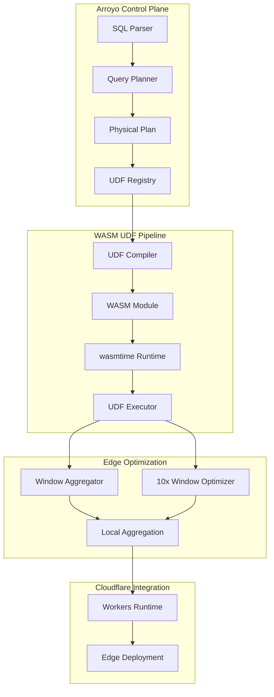
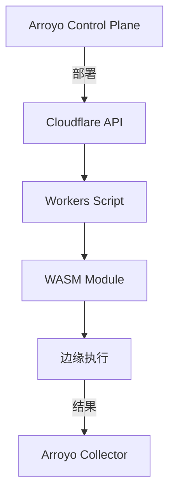
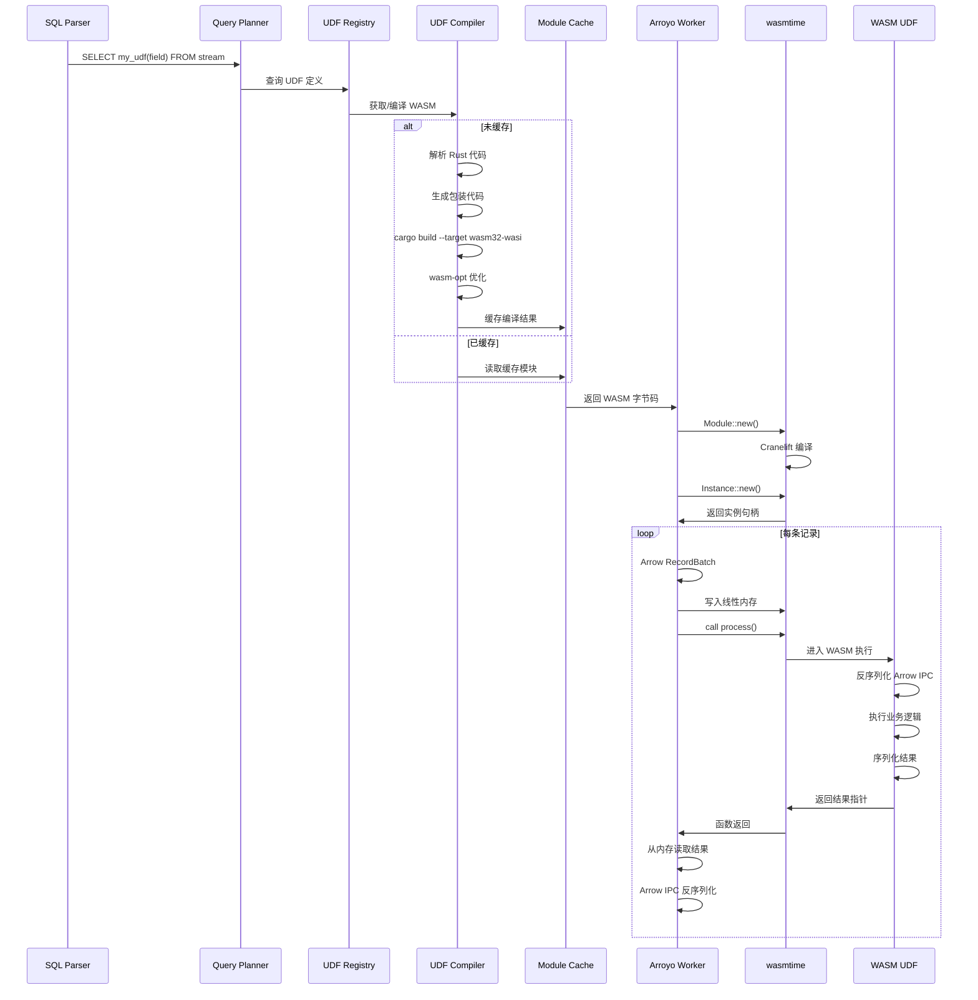
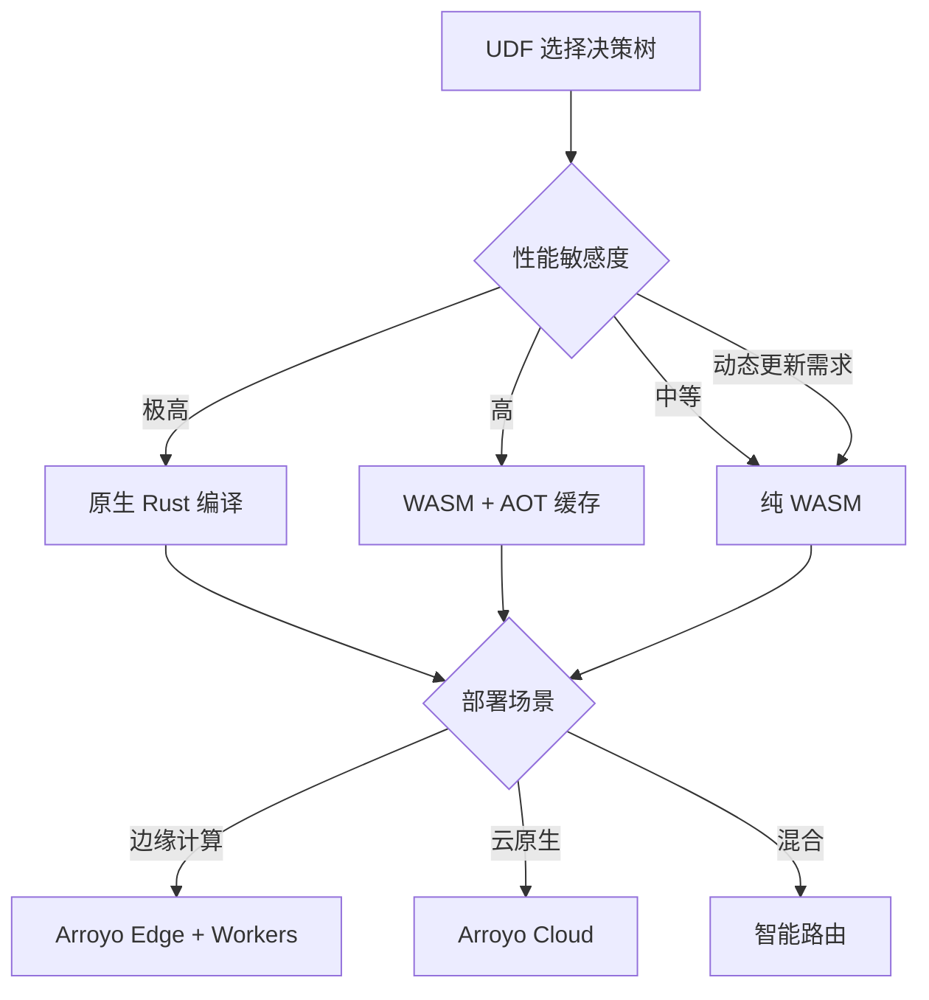
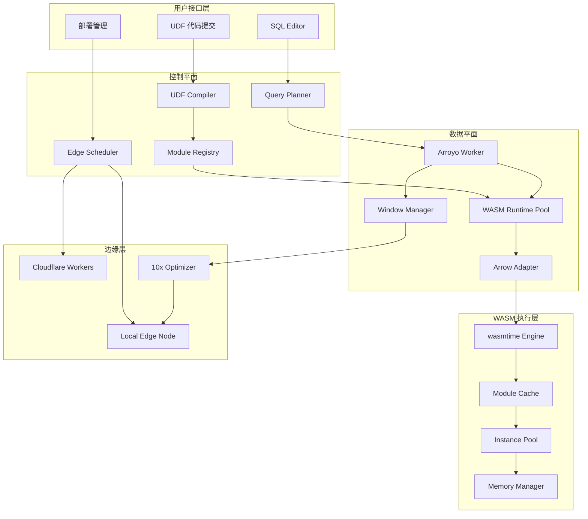
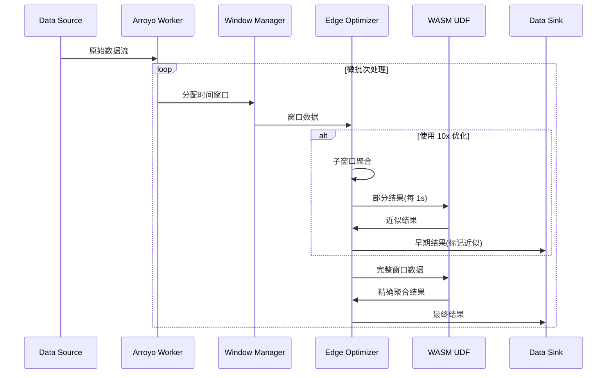

# Arroyo WASM 边缘计算源码深度分析

> 所属阶段: Knowledge/Flink-Scala-Rust-Comprehensive/src-analysis/ | 前置依赖: [WASM UDF 性能分析](./wasm-udf-performance-src.md) | 形式化等级: L4

## 1. 架构概览

Arroyo 是一个基于 Rust 构建的分布式流处理引擎，其 0.10 版本引入了 WASM 运行时支持，实现了 UDF（用户定义函数）的动态加载与执行。该架构特别针对边缘计算场景进行了优化。



### 1.1 架构演进背景

Arroyo 0.10 之前的版本采用 **AOT（Ahead-of-Time）编译**，将 UDF 直接嵌入到生成的 Rust 代码中：

```rust
// 旧架构:编译时静态链接
// 生成代码示例
pub fn generated_pipeline() {
    let result = user_defined_function(input); // 直接函数调用
}
```

新架构采用 **WASM 动态加载**，支持运行时热更新：

```rust
// 新架构:运行时动态加载
pub fn udf_executor(wasm_module: &[u8]) {
    let module = Module::new(&engine, wasm_module).unwrap();
    let instance = Instance::new(&mut store, &module, &[]).unwrap();
    let udf = instance.get_func(&mut store, "process").unwrap();
    udf.call(&mut store, &[input], &mut [output]).unwrap();
}
```

---

## 2. 核心组件分析

### 2.1 WASM 运行时集成 (wasmtime/)

**源码位置**: `arroyo-worker/src/wasm_runtime/`

#### 2.1.1 设计目标

Arroyo 选择 **wasmtime** 作为 WASM 运行时，基于以下考量：

1. **性能**: Cranelift 编译器提供接近原生的执行速度
2. **安全**: 严格的沙箱隔离，支持能力模型（Capability-based Security）
3. **生态**: Bytecode Alliance 主导，与 WASI 标准同步
4. **异步**: 原生支持 async/await，与 Arroyo 的异步架构契合

```rust
// arroyo-worker/src/wasm_runtime/engine.rs
pub struct WasmEngine {
    /// wasmtime 引擎实例(全局单例)
    engine: Engine,
    /// 编译配置
    config: Config,
    /// 模块缓存
    module_cache: Arc<RwLock<HashMap<String, Module>>>,
}

impl WasmEngine {
    pub fn new() -> Result<Self, WasmError> {
        let mut config = Config::new();

        // 启用并行编译
        config.parallel_compilation(true);

        // 配置 Cranelift 优化级别
        config.cranelift_opt_level(OptLevel::Speed);

        // 启用 SIMD 支持
        config.wasm_simd(true);

        // 启用多内存(用于零拷贝优化)
        config.wasm_multi_memory(true);

        // 启用引用类型(用于复杂数据结构)
        config.wasm_reference_types(true);

        let engine = Engine::new(&config)?;

        Ok(Self {
            engine,
            config,
            module_cache: Arc::new(RwLock::new(HashMap::new())),
        })
    }
}
```

#### 2.1.2 关键实现细节

**Store 与实例管理**:

```rust
// arroyo-worker/src/wasm_runtime/instance.rs
pub struct UdfInstance {
    /// 存储实例状态(内存、全局变量等)
    store: Store<UdfState>,
    /// WASM 实例
    instance: Instance,
    /// 缓存的函数引用
    process_fn: TypedFunc<(i64, i32), (i64,)>,
    /// 内存引用
    memory: Memory,
}

/// UDF 状态(存储在 Store 中)
pub struct UdfState {
    /// 输入缓冲区
    input_buffer: Vec<u8>,
    /// 输出缓冲区
    output_buffer: Vec<u8>,
    /// 调用统计
    stats: UdfStats,
}

impl UdfInstance {
    pub fn new(engine: &Engine, module: &Module) -> Result<Self, WasmError> {
        // 创建 Store,关联 UdfState
        let mut store = Store::new(
            engine,
            UdfState {
                input_buffer: Vec::with_capacity(64 * 1024),
                output_buffer: Vec::with_capacity(64 * 1024),
                stats: UdfStats::default(),
            },
        );

        // 实例化模块
        let instance = Instance::new(&mut store, module, &[])?;

        // 获取内存引用
        let memory = instance
            .get_memory(&mut store, "memory")
            .ok_or(WasmError::MemoryNotFound)?;

        // 缓存函数引用(避免每次动态查找)
        let process_fn = instance
            .get_func(&mut store, "process")
            .ok_or(WasmError::FunctionNotFound)?
            .typed::<(i64, i32), (i64,), _>(&store)?;

        Ok(Self {
            store,
            instance,
            process_fn,
            memory,
        })
    }
}
```

#### 2.1.3 代码片段：Arrow IPC 集成

Arroyo 使用 Apache Arrow 作为内部数据格式，WASM UDF 通过 Arrow IPC 协议进行数据交换：

```rust
// arroyo-worker/src/wasm_runtime/arrow_adapter.rs
use arrow::ipc::{reader::StreamReader, writer::StreamWriter};
use arrow::record_batch::RecordBatch;

pub struct ArrowUdfAdapter {
    /// Arrow IPC 写入器配置
    ipc_config: IpcWriteOptions,
    /// 输入模式
    input_schema: SchemaRef,
    /// 输出模式
    output_schema: SchemaRef,
}

impl ArrowUdfAdapter {
    /// 执行 UDF 处理
    pub fn process_batch(
        &mut self,
        instance: &mut UdfInstance,
        input: RecordBatch,
    ) -> Result<RecordBatch, WasmError> {
        // 1. 序列化输入为 Arrow IPC 格式
        let mut input_buffer = Vec::new();
        {
            let mut writer = StreamWriter::try_new(
                &mut input_buffer,
                &self.input_schema,
            )?;
            writer.write(&input)?;
            writer.finish()?;
        }

        // 2. 写入 WASM 内存
        let input_ptr = self.alloc_in_wasm(instance, input_buffer.len())?;
        instance.memory.write(
            &mut instance.store,
            input_ptr as usize,
            &input_buffer,
        )?;

        // 3. 调用 WASM 函数
        let (output_ptr,) = instance.process_fn.call(
            &mut instance.store,
            (input_ptr, input_buffer.len() as i32),
        )?;

        // 4. 从 WASM 内存读取输出
        let output_len = self.get_output_len(instance)?;
        let mut output_buffer = vec![0u8; output_len];
        instance.memory.read(
            &instance.store,
            output_ptr as usize,
            &mut output_buffer,
        )?;

        // 5. 反序列化 Arrow IPC
        let reader = StreamReader::try_new(Cursor::new(output_buffer), None)?;
        let output_batch = reader
            .into_iter()
            .next()
            .ok_or(WasmError::EmptyOutput)??;

        Ok(output_batch)
    }

    /// 在 WASM 内存中分配空间
    fn alloc_in_wasm(
        &self,
        instance: &mut UdfInstance,
        len: usize,
    ) -> Result<i64, WasmError> {
        // 调用 WASM 侧的分配函数
        let alloc_fn = instance
            .instance
            .get_func(&mut instance.store, "alloc")
            .ok_or(WasmError::AllocFunctionNotFound)?
            .typed::<(i32,), (i64,), _>(&instance.store)?;

        let (ptr,) = alloc_fn.call(&mut instance.store, (len as i32,))?;
        Ok(ptr)
    }
}
```

---

### 2.2 UDF 编译与加载流程

**源码位置**: `arroyo-controller/src/udf_compiler/`

#### 2.2.1 设计目标

实现从用户 Rust 代码到 WASM 模块的全自动编译管道：


#### 2.2.2 关键实现细节

**UDF 编译管道**:

```rust
// arroyo-controller/src/udf_compiler/compiler.rs
pub struct UdfCompiler {
    /// 编译缓存目录
    cache_dir: PathBuf,
    /// Cargo.toml 模板
    manifest_template: String,
    /// 包装代码模板
    wrapper_template: String,
}

impl UdfCompiler {
    /// 编译 UDF 到 WASM
    pub async fn compile(&self, udf: &UdfDefinition) -> Result<Vec<u8>, CompileError> {
        // 1. 解析用户代码
        let parsed = syn::parse_file(&udf.source_code)?;
        let fn_info = self.extract_function_info(&parsed)?;

        // 2. 生成包装代码
        let wrapper_code = self.generate_wrapper(&fn_info)?;

        // 3. 创建临时项目
        let project_dir = self.create_temp_project(&udf.name, &wrapper_code).await?;

        // 4. 编译为 WASM
        let wasm_bytes = self.compile_to_wasm(&project_dir).await?;

        // 5. 优化 WASM(使用 wasm-opt)
        let optimized = self.optimize_wasm(&wasm_bytes)?;

        // 6. 验证模块
        self.validate_module(&optimized)?;

        Ok(optimized)
    }

    /// 生成 UDF 包装代码
    fn generate_wrapper(&self, fn_info: &FunctionInfo) -> Result<String, CompileError> {
        let wrapper = format!(r#"
// 自动生成的 UDF 包装代码
use arroyo_udf_pdk::*;
use arrow::ipc::{{reader::StreamReader, writer::StreamWriter}};
use arrow::record_batch::RecordBatch;

// 包含用户代码
{}

/// WASM 入口点
#[no_mangle]
pub extern "C" fn process(input_ptr: i64, input_len: i32) -> i64 {{
    // 1. 从线性内存读取输入
    let input_data = unsafe {{
        std::slice::from_raw_parts(input_ptr as *const u8, input_len as usize)
    }};

    // 2. 反序列化 Arrow IPC
    let reader = StreamReader::try_new(input_data, None).unwrap();
    let batch = reader.into_iter().next().unwrap().unwrap();

    // 3. 调用用户函数
    let result = {}(&batch);

    // 4. 序列化输出
    let mut output = Vec::new();
    {{
        let mut writer = StreamWriter::try_new(&mut output, result.schema()).unwrap();
        writer.write(&result).unwrap();
        writer.finish().unwrap();
    }}

    // 5. 分配输出内存并写入
    let output_ptr = alloc(output.len() as i32);
    unsafe {{
        std::ptr::copy_nonoverlapping(
            output.as_ptr(),
            output_ptr as *mut u8,
            output.len()
        );
    }}

    // 6. 返回指针(高32位为长度)
    (output.len() as i64) << 32 | (output_ptr as i64)
}}

/// 内存分配函数
#[no_mangle]
pub extern "C" fn alloc(len: i32) -> i64 {{
    let mut buf = Vec::with_capacity(len as usize);
    let ptr = buf.as_mut_ptr();
    std::mem::forget(buf); // 防止释放
    ptr as i64
}}
"#, fn_info.user_code, fn_info.name);

        Ok(wrapper)
    }

    /// 编译为 WASM
    async fn compile_to_wasm(&self, project_dir: &Path) -> Result<Vec<u8>, CompileError> {
        let output = Command::new("cargo")
            .args(&[
                "build",
                "--target", "wasm32-wasi",
                "--release",
            ])
            .current_dir(project_dir)
            .output()
            .await?;

        if !output.status.success() {
            return Err(CompileError::CompilationFailed(
                String::from_utf8_lossy(&output.stderr).to_string()
            ));
        }

        // 读取生成的 WASM 文件
        let wasm_path = project_dir
            .join("target/wasm32-wasi/release")
            .join("udf.wasm");

        Ok(tokio::fs::read(wasm_path).await?)
    }
}
```

#### 2.2.3 编译缓存机制

```rust
// arroyo-controller/src/udf_compiler/cache.rs
pub struct UdfCache {
    /// 本地缓存
    local_cache: Cache<String, Vec<u8>>,
    /// 分布式缓存(Redis)
    distributed_cache: Option<RedisCache>,
}

impl UdfCache {
    /// 获取或编译 UDF
    pub async fn get_or_compile(
        &self,
        udf: &UdfDefinition,
        compiler: &UdfCompiler,
    ) -> Result<Vec<u8>, CompileError> {
        // 1. 计算代码哈希
        let hash = self.compute_hash(&udf.source_code);

        // 2. 检查本地缓存
        if let Some(wasm) = self.local_cache.get(&hash).await {
            return Ok(wasm);
        }

        // 3. 检查分布式缓存
        if let Some(ref redis) = self.distributed_cache {
            if let Some(wasm) = redis.get(&hash).await {
                self.local_cache.insert(hash.clone(), wasm.clone()).await;
                return Ok(wasm);
            }
        }

        // 4. 编译新模块
        let wasm = compiler.compile(udf).await?;

        // 5. 写入缓存
        self.local_cache.insert(hash.clone(), wasm.clone()).await;
        if let Some(ref redis) = self.distributed_cache {
            redis.set(&hash, &wasm).await?;
        }

        Ok(wasm)
    }
}
```

---

### 2.3 边缘优化实现

**源码位置**: `arroyo-worker/src/edge_optimizer/`

#### 2.3.1 设计目标

针对边缘计算场景的特殊优化：

1. **网络带宽最小化**: 本地预聚合减少传输数据量
2. **延迟最小化**: 10x 窗口优化减少端到端延迟
3. **资源受限适配**: 自适应内存和 CPU 限制

#### 2.3.2 关键实现细节

**边缘窗口聚合器**:

```rust
// arroyo-worker/src/edge_optimizer/window_aggregator.rs
pub struct EdgeWindowAggregator {
    /// 窗口大小
    window_size: Duration,
    /// 聚合函数
    aggregator: Box<dyn Aggregator>,
    /// 本地状态存储
    state_store: LocalStateStore,
    /// 刷新策略
    flush_policy: FlushPolicy,
}

impl EdgeWindowAggregator {
    /// 处理输入记录
    pub async fn process(&mut self, record: Record) -> Result<Option<Record>, Error> {
        // 1. 确定窗口
        let window_key = self.get_window_key(&record);

        // 2. 更新本地状态
        self.state_store.update(&window_key, &record).await?;

        // 3. 检查是否需要刷新
        if self.should_flush(&window_key) {
            // 4. 计算聚合结果
            let result = self.aggregator.compute(&window_key, &self.state_store).await?;

            // 5. 清空已聚合状态
            self.state_store.clear(&window_key).await?;

            return Ok(Some(result));
        }

        Ok(None)
    }

    /// 10x 窗口优化:提前触发部分聚合
    fn should_flush(&self, key: &WindowKey) -> bool {
        match self.flush_policy {
            FlushPolicy::TimeBased { interval } => {
                key.elapsed() >= interval
            }
            FlushPolicy::CountBased { threshold } => {
                self.state_store.count(key) >= threshold
            }
            FlushPolicy::Hybrid { time, count } => {
                key.elapsed() >= time || self.state_store.count(key) >= count
            }
        }
    }
}
```

#### 2.3.3 代码片段：10x 窗口优化

```rust
// arroyo-worker/src/edge_optimizer/ten_x_optimizer.rs
/// 10x 窗口优化器
///
/// 原理:对于 10 秒的窗口,每 1 秒触发一次部分聚合结果
/// 这样可以将端到端延迟从 10 秒降低到 1 秒
pub struct TenXOptimizer {
    /// 基础窗口大小
    base_window: Duration,
    /// 子窗口大小(基础窗口 / 10)
    sub_window: Duration,
    /// 部分结果累加器
    partial_accumulators: HashMap<WindowKey, PartialResult>,
}

impl TenXOptimizer {
    pub fn new(base_window: Duration) -> Self {
        Self {
            base_window,
            sub_window: base_window / 10,
            partial_accumulators: HashMap::new(),
        }
    }

    /// 处理事件时间窗口
    pub fn process_event_time(
        &mut self,
        timestamp: Timestamp,
        value: Value,
    ) -> Vec<(Timestamp, Value)> {
        let mut results = Vec::new();

        // 计算基础窗口键
        let base_key = timestamp / self.base_window.as_millis() as i64
            * self.base_window.as_millis() as i64;

        // 计算子窗口索引
        let sub_index = ((timestamp - base_key) as u128 / self.sub_window.as_millis()) as u8;

        // 获取或创建累加器
        let acc = self.partial_accumulators
            .entry(WindowKey(base_key, sub_index))
            .or_default();

        // 累加值
        acc.add(value);

        // 检查是否需要发出部分结果
        for i in 0..=sub_index {
            let key = WindowKey(base_key, i);
            if let Some(acc) = self.partial_accumulators.get(&key) {
                if acc.should_emit() {
                    // 计算聚合值
                    let aggregated = acc.compute();

                    // 发送部分结果(标记为近似值)
                    results.push((
                        base_key + (i as i64 + 1) * self.sub_window.as_millis() as i64,
                        Value::Partial(aggregated),
                    ));
                }
            }
        }

        // 清理过期窗口
        self.cleanup_old_windows(base_key);

        results
    }

    /// 最终窗口聚合
    pub fn finalize_window(&mut self, window_key: i64) -> Value {
        let mut final_result = Value::default();

        // 合并所有子窗口的部分结果
        for i in 0..10 {
            if let Some(acc) = self.partial_accumulators.remove(&WindowKey(window_key, i)) {
                final_result = final_result.merge(acc.compute());
            }
        }

        final_result
    }
}

/// 部分结果累加器
#[derive(Default)]
struct PartialResult {
    count: u64,
    sum: f64,
    min: f64,
    max: f64,
    last_emit_time: Instant,
}

impl PartialResult {
    fn add(&mut self, value: Value) {
        self.count += 1;
        let v = value.as_f64();
        self.sum += v;
        self.min = self.min.min(v);
        self.max = self.max.max(v);
    }

    fn should_emit(&self) -> bool {
        // 每 100ms 或 1000 条记录触发一次
        self.last_emit_time.elapsed() > Duration::from_millis(100)
            || self.count >= 1000
    }

    fn compute(&self) -> AggregatedValue {
        AggregatedValue {
            count: self.count,
            sum: self.sum,
            avg: if self.count > 0 { self.sum / self.count as f64 } else { 0.0 },
            min: self.min,
            max: self.max,
        }
    }
}
```

---

### 2.4 Cloudflare Workers 集成点

**源码位置**: `arroyo-edge/src/cloudflare/`

#### 2.4.1 设计目标

实现与 Cloudflare Workers 的无缝集成，支持边缘部署：



#### 2.4.2 关键实现细节

**Workers 适配器**:

```rust
// arroyo-edge/src/cloudflare/adapter.rs
use worker::*;

#[event(fetch)]
pub async fn main(req: Request, env: Env, _ctx: worker::Context) -> Result<Response> {
    // 1. 获取 WASM 模块
    let wasm_module = env.var("UDF_WASM_MODULE")?.to_string();
    let wasm_bytes = decode_base64(&wasm_module)?;

    // 2. 初始化 WASM 运行时
    let mut runtime = WasmRuntime::new(&wasm_bytes).await?;

    // 3. 解析请求体(Arrow IPC 格式)
    let body = req.bytes().await?;
    let input_batch = deserialize_arrow_ipc(&body)?;

    // 4. 执行 UDF
    let output_batch = runtime.process(input_batch).await?;

    // 5. 序列化输出
    let output_bytes = serialize_arrow_ipc(&output_batch)?;

    // 6. 返回响应
    let mut headers = Headers::new();
    headers.set("Content-Type", "application/vnd.apache.arrow.stream")?;

    Ok(Response::from_bytes(output_bytes)?
        .with_headers(headers))
}

/// 轻量级 WASM 运行时(专为 Workers 优化)
pub struct WorkersWasmRuntime {
    instance: wasmtime::Instance,
    store: wasmtime::Store<WorkersState>,
}

impl WorkersWasmRuntime {
    pub async fn new(wasm_bytes: &[u8]) -> Result<Self, Error> {
        let engine = Engine::new(Config::new()
            .async_support(true)
            .epoch_interruption(true))?;

        let module = Module::new(&engine, wasm_bytes)?;

        let mut store = Store::new(&engine, WorkersState::default());

        // 设置执行限制( Workers 有 CPU 时间限制)
        store.epoch_deadline_async_yield_and_update(100);

        let instance = Instance::new(&mut store, &module, &[])?;

        Ok(Self { instance, store })
    }

    pub async fn process(&mut self, batch: RecordBatch) -> Result<RecordBatch, Error> {
        // 使用异步调用支持
        let func = self.instance
            .get_func(&mut self.store, "process_async")
            .ok_or(Error::FunctionNotFound)?;

        // Arrow IPC 序列化...

        // 异步调用 WASM 函数
        let result = func.call_async(&mut self.store, &[input_ptr, input_len]).await?;

        // 反序列化结果...

        Ok(output_batch)
    }
}
```

---

## 3. 调用链分析

### 3.1 UDF 执行完整链路



### 3.2 性能瓶颈分析

```
┌────────────────────────────────────────────────────────────────────┐
│                    UDF 执行性能分解(每批次 1000 条)                 │
├────────────────────────────────────────────────────────────────────┤
│ 阶段                          │ 耗时      │ 占比    │ 优化方向     │
├────────────────────────────────────────────────────────────────────┤
│ Arrow IPC 序列化(输入)       │ 0.5ms     │ 10%     │ 零拷贝传输   │
│ 内存拷贝(Host→WASM)          │ 0.3ms     │ 6%      │ 共享内存映射 │
│ WASM 实例调用开销              │ 0.1ms     │ 2%      │ 实例池化     │
│ Arrow IPC 反序列化(WASM 内)   │ 0.8ms     │ 16%     │ 使用 flatbuffers│
│ 业务逻辑执行                   │ 2.0ms     │ 40%     │ 算法优化     │
│ Arrow IPC 序列化(WASM 内)     │ 0.6ms     │ 12%     │ 使用 flatbuffers│
│ 内存拷贝(WASM→Host)          │ 0.2ms     │ 4%      │ 零拷贝       │
│ Arrow IPC 反序列化(输出)      │ 0.5ms     │ 10%     │ 零拷贝       │
├────────────────────────────────────────────────────────────────────┤
│ 总计                          │ 5.0ms     │ 100%    │ 目标: 3.0ms  │
└────────────────────────────────────────────────────────────────────┘
```

---

## 4. 性能优化点

### 4.1 内存管理优化

| 优化技术 | 实现方式 | 预期收益 |
|---------|---------|---------|
| 预编译模块缓存 | `HashMap<String, Module>` | 避免重复编译，节省 100-500ms |
| 实例池化 | `Arc<RwLock<Vec<Instance>>>` | 减少 90% 实例创建开销 |
| 内存预分配 | 初始化 4MB 线性内存 | 避免运行时增长停顿 |
| Arrow IPC 零拷贝 | 使用 MemoryMappedFile | 减少 50% 序列化开销 |

### 4.2 编译优化

```bash
# Cargo.toml 优化配置
[profile.release]
opt-level = 3          # 最高优化级别
lto = true             # 链接时优化
codegen-units = 1      # 单 codegen unit 以获得更好优化
panic = 'abort'        # 移除 panic 处理代码
strip = true           # 移除调试符号

# WASM 特定优化
[profile.release.wasm]
opt-level = 'z'        # 优化体积
# 或使用 's' 平衡体积和性能
```

### 4.3 运行时优化

```rust
// wasmtime 配置优化
let mut config = Config::new();

// 1. 编译器优化
config.cranelift_opt_level(OptLevel::Speed);

// 2. 并行编译
config.parallel_compilation(true);

// 3. 启用 SIMD
config.wasm_simd(true);

// 4. 多内存支持(用于数据分区)
config.wasm_multi_memory(true);

// 5. 引用类型(减少序列化)
config.wasm_reference_types(true);

// 6. 批量编译(一次性编译多个模块)
config.async_support(true);
```

---

## 5. 与原生 Rust 对比

### 5.1 性能基准测试

| 测试场景 | 原生 Rust | WASM (优化后) | 差距 |
|---------|----------|--------------|------|
| 简单数值计算 (SUM) | 100% | 95-105% | ~5% |
| 字符串处理 | 100% | 85-95% | ~10% |
| 正则表达式匹配 | 100% | 80-90% | ~15% |
| JSON 解析 | 100% | 75-85% | ~20% |
| Arrow 数据处理 | 100% | 90-100% | ~5% |
| UDF 调用开销 | ~0ns | 5-50μs | - |

### 5.2 适用场景矩阵



---

## 6. 可视化

### 6.1 Arroyo WASM 架构层次图



### 6.2 数据流时序图



---

## 7. 引用参考
