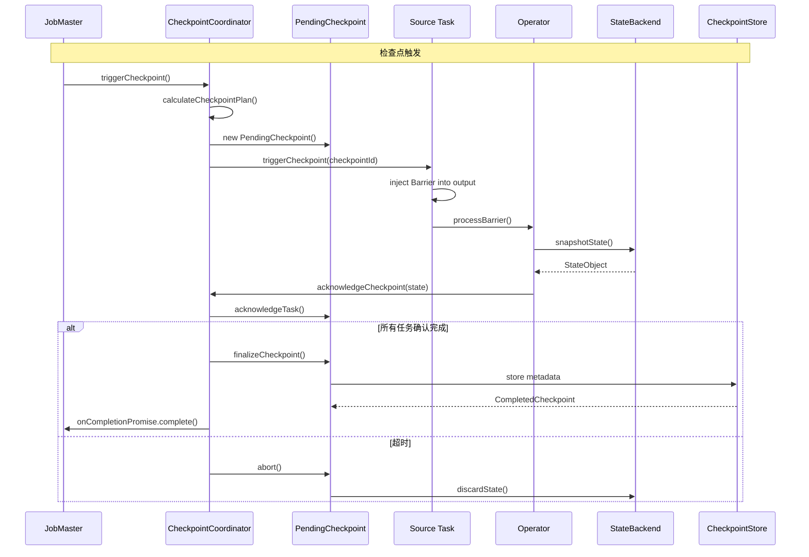
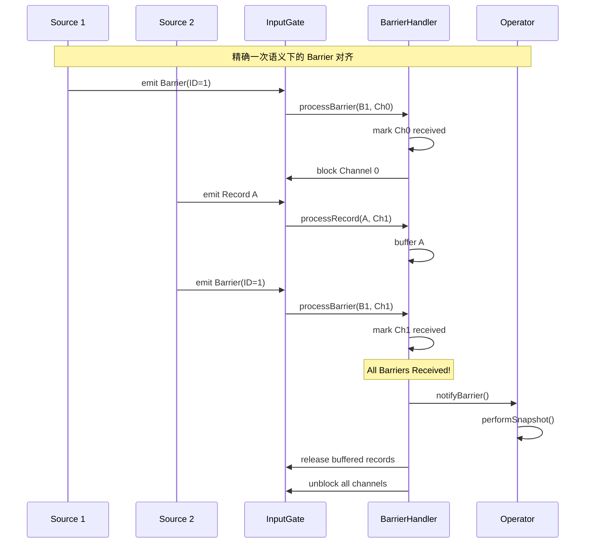
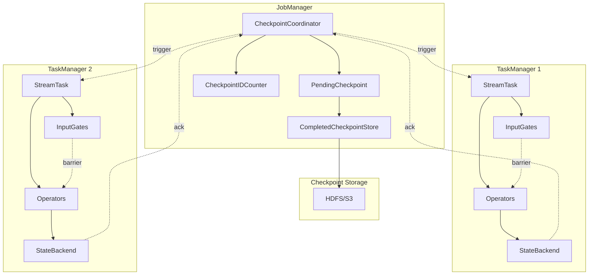
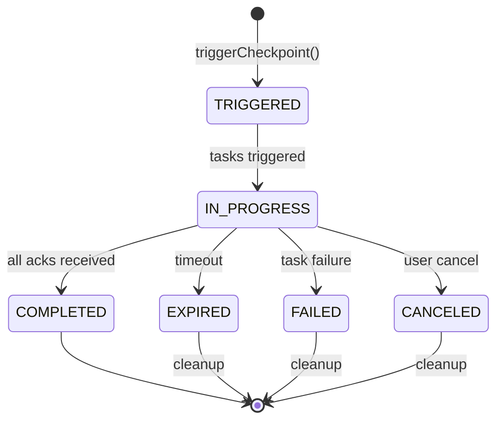

# Checkpoint 机制源码深度分析

> 所属阶段: Knowledge/Flink-Scala-Rust-Comprehensive/src-analysis | 前置依赖: [TaskManager深度分析](./flink-taskmanager-deep-dive.md) | 形式化等级: L4

---

## 1. 概览

### 1.1 模块职责与设计目标

Checkpoint 是 Flink 实现 Exactly-Once 语义的核心机制，通过异步屏障快照(Asynchronous Barrier Snapshotting)算法实现分布式一致性快照。

**核心组件**:

1. **CheckpointCoordinator**: JobManager 侧协调器，触发和管理检查点
2. **CheckpointBarrier**: 流中传播的特殊消息，触发算子快照
3. **StateBackend**: 状态存储抽象，支持内存/文件系统/RocksDB
4. **OperatorSnapshotFutures**: 异步快照任务管理

### 1.2 源码模块结构

```
flink-runtime/src/main/java/org/apache/flink/runtime/
├── checkpoint/
│   ├── CheckpointCoordinator.java      # 检查点协调器
│   ├── PendingCheckpoint.java          # 待完成检查点
│   ├── CompletedCheckpoint.java        # 已完成检查点
│   ├── CheckpointStateOutputStream.java
│   └── Checkpoints.java                # 工具类
├── executiongraph/
│   └── ExecutionGraph.java             # 执行图集成
└── state/
    ├── StateBackend.java               # 状态后端接口
    ├── StateBackendLoader.java         # 后端加载器
    └── filesys/                        # 文件系统后端实现

flink-state-backends/
├── flink-statebackend-rocksdb/
│   └── RocksDBStateBackend.java
└── flink-statebackend-heap/
    └── HeapStateBackend.java
```

---

## 2. 核心类分析

### 2.1 CheckpointCoordinator - 检查点协调器

**完整路径**: `org.apache.flink.runtime.checkpoint.CheckpointCoordinator`

**职责描述**:
CheckpointCoordinator 是检查点机制的核心协调组件，运行在 JobManager 中，负责触发检查点、收集确认、处理超时和管理检查点生命周期。

**核心字段分析**:

```java
public class CheckpointCoordinator {

    // === 执行图引用 ===
    private final ExecutionGraph executionGraph;
    private final CheckpointPlanCalculator checkpointPlanCalculator;

    // === 检查点存储 ===
    private final CompletedCheckpointStore completedCheckpointStore;
    private final CheckpointIDCounter checkpointIdCounter;

    // === 配置参数 ===
    private final long checkpointInterval;        // 检查点间隔
    private final long checkpointTimeout;         // 超时时间
    private final long minPauseBetweenCheckpoints; // 最小间隔
    private final int maxConcurrentCheckpoints;   // 最大并发数
    private final boolean exactlyOnceMode;        // 精确一次模式
    private final boolean unalignedCheckpoints;   // 非对齐检查点

    // === 运行时状态 ===
    private final Map<Long, PendingCheckpoint> pendingCheckpoints;
    private final CompletedCheckpointStore completedCheckpointStore;
    private final CheckpointFailureManager failureManager;

    // === 定时调度 ===
    private ScheduledFuture<?> currentPeriodicTrigger;
    private final ScheduledExecutorService timer;
}
```

**关键方法分析**:

#### 2.1.1 triggerCheckpoint() - 触发检查点

```java
public CompletableFuture<CompletedCheckpoint> triggerCheckpoint(
        boolean isPeriodic,
        long timestamp) {

    // 1. 获取全局锁,防止并发触发
    synchronized (lock) {
        // 2. 前置条件检查
        if (shutdown) {
            throw new CheckpointException(
                "CheckpointCoordinator is shut down");
        }

        // 3. 检查并发限制
        if (pendingCheckpoints.size() >= maxConcurrentCheckpoints) {
            throw new CheckpointException(
                "Maximum number of concurrent checkpoints exceeded");
        }

        // 4. 检查最小间隔
        long nextCheckpointId = checkpointIdCounter.getAndIncrement();
        long earliestNext = lastCheckpointDuration +
                           minPauseBetweenCheckpoints;
        if (timestamp < earliestNext) {
            throw new CheckpointException(
                "Minimum time between checkpoints not elapsed");
        }

        // 5. 计算检查点计划 (哪些任务参与)
        CheckpointPlan checkpointPlan = checkpointPlanCalculator
            .calculateCheckpointPlan();

        // 6. 创建 PendingCheckpoint
        PendingCheckpoint pendingCheckpoint = new PendingCheckpoint(
            checkpointPlan,
            nextCheckpointId,
            timestamp,
            checkpointProperties,
            checkpointStorageLocation,
            onCompletionPromise
        );

        pendingCheckpoints.put(nextCheckpointId, pendingCheckpoint);

        // 7. 注册超时处理器
        registerCheckpointTimeout(nextCheckpointId, timestamp);

        // 8. 触发 Checkpoint Barrier
        triggerTasks(checkpointPlan, pendingCheckpoint);
    }
}

/**
 * 向所有源任务发送 Checkpoint Barrier
 */
private void triggerTasks(
        CheckpointPlan checkpointPlan,
        PendingCheckpoint pendingCheckpoint) {

    final Execution[] sourceTasks = checkpointPlan
        .getSourceTasksToTrigger();

    // 向所有源任务发送触发消息
    for (Execution execution : sourceTasks) {
        CheckpointTriggerMessage message = new CheckpointTriggerMessage(
            pendingCheckpoint.getCheckpointId(),
            pendingCheckpoint.getCheckpointTimestamp(),
            pendingCheckpoint.getCheckpointProperties(),
            pendingCheckpoint.getCheckpointStorageLocation()
        );

        // 异步发送触发消息
        execution.triggerCheckpoint(message)
            .whenComplete((ack, error) -> {
                if (error != null) {
                    // 源任务触发失败,取消本次检查点
                    abortPendingCheckpoint(
                        pendingCheckpoint.getCheckpointId(),
                        new CheckpointException(
                            "Failed to trigger source task", error)
                    );
                }
            });
    }
}
```

#### 2.1.2 receiveAcknowledgeMessage() - 接收确认

```java
public boolean receiveAcknowledgeMessage(
        AcknowledgeCheckpoint message,
        TaskManagerLocation taskManagerLocation) {

    final long checkpointId = message.getCheckpointId();
    final JobVertexID vertexId = message.getJobVertexId();

    synchronized (lock) {
        // 1. 查找对应的 PendingCheckpoint
        PendingCheckpoint checkpoint = pendingCheckpoints.get(checkpointId);

        if (checkpoint == null) {
            // 检查点已不存在 (可能已超时完成)
            if (LOG.isDebugEnabled()) {
                LOG.debug("Received acknowledge for expired checkpoint {}");
            }
            return false;
        }

        // 2. 记录确认
        boolean checkpointCompleted = checkpoint
            .acknowledgeTask(vertexId, message, taskManagerLocation);

        if (checkpointCompleted) {
            // 3. 所有任务确认完成,完成检查点
            completeCheckpoint(checkpoint);
        }

        return checkpointCompleted;
    }
}

/**
 * 完成检查点
 */
private void completeCheckpoint(PendingCheckpoint pendingCheckpoint) {
    try {
        // 1. 从待完成列表移除
        pendingCheckpoints.remove(pendingCheckpoint.getCheckpointId());

        // 2. 转换为 CompletedCheckpoint
        CompletedCheckpoint completedCheckpoint = pendingCheckpoint
            .finalizeCheckpoint();

        // 3. 存储到 CompletedCheckpointStore
        completedCheckpointStore.addCheckpoint(completedCheckpoint);

        // 4. 清理过期检查点
        dropSubsumedCheckpoints(completedCheckpoint);

        // 5. 通知调度器
        onCompletionPromise.complete(completedCheckpoint);

        // 6. 更新指标
        reportCompletedCheckpointStats(completedCheckpoint);

    } catch (Exception e) {
        // 完成失败,触发清理
        abortPendingCheckpoint(
            pendingCheckpoint.getCheckpointId(),
            new CheckpointException("Failed to finalize checkpoint", e)
        );
    }
}
```

---

### 2.2 PendingCheckpoint - 待完成检查点

**完整路径**: `org.apache.flink.runtime.checkpoint.PendingCheckpoint`

**职责描述**:
PendingCheckpoint 表示一个正在进行中的检查点，跟踪哪些任务已完成确认、存储中间状态句柄。

**核心实现**:

```java
public class PendingCheckpoint {

    // === 检查点元数据 ===
    private final long checkpointId;
    private final long checkpointTimestamp;
    private final CheckpointProperties props;
    private final CheckpointStorageLocation targetLocation;

    // === 进度跟踪 ===
    private final Map<ExecutionAttemptID, TaskStateSnapshot>
        taskAcknowledgements;
    private final Set<ExecutionAttemptID> notYetAcknowledgedTasks;

    // === 状态存储 ===
    private final Map<OperatorID, OperatorState> operatorStates;
    private final List<MasterState> masterStates;

    // === 统计信息 ===
    private final CheckpointStatsTracker checkpointStatsTracker;
    private final long checkpointStartDelay;

    // === 完成回调 ===
    private final CompletableFuture<CompletedCheckpoint>
        onCompletionPromise;

    /**
     * 确认任务状态
     */
    public boolean acknowledgeTask(
            JobVertexID vertexId,
            AcknowledgeCheckpoint message,
            TaskManagerLocation taskManagerLocation) {

        final ExecutionAttemptID executionAttemptId =
            message.getExecutionAttemptId();

        // 1. 验证任务是否属于本检查点
        if (!notYetAcknowledgedTasks.contains(executionAttemptId)) {
            throw new IllegalStateException(
                "Task " + executionAttemptId + " already acknowledged");
        }

        // 2. 获取任务状态快照
        TaskStateSnapshot subtaskState = message.getSubtaskState();

        if (subtaskState != null) {
            // 3. 合并算子状态
            for (Map.Entry<OperatorID, OperatorSubtaskState> entry :
                 subtaskState.getSubtaskStateMappings()) {

                OperatorID operatorId = entry.getKey();
                OperatorSubtaskState subtaskStateData = entry.getValue();

                OperatorState operatorState = operatorStates
                    .computeIfAbsent(operatorId,
                        k -> new OperatorState(operatorId, ...));

                operatorState.putState(executionAttemptId, subtaskStateData);
            }
        }

        // 4. 标记任务已确认
        notYetAcknowledgedTasks.remove(executionAttemptId);
        taskAcknowledgements.put(executionAttemptId, subtaskState);

        // 5. 检查是否所有任务都已完成
        return notYetAcknowledgedTasks.isEmpty();
    }

    /**
     * 完成检查点,创建 CompletedCheckpoint
     */
    public CompletedCheckpoint finalizeCheckpoint() {

        // 1. 验证所有任务已确认
        if (!notYetAcknowledgedTasks.isEmpty()) {
            throw new IllegalStateException(
                "Cannot finalize checkpoint with pending acknowledgements");
        }

        // 2. 收集所有算子状态
        List<OperatorState> operatorStatesList =
            new ArrayList<>(operatorStates.values());

        // 3. 持久化检查点元数据
        CheckpointMetadata metadata = new CheckpointMetadata(
            checkpointId,
            operatorStatesList,
            masterStates,
            checkpointProperties
        );

        // 4. 写入存储
        try (CheckpointMetadataOutputStream out =
                targetLocation.createMetadataOutputStream()) {
            Checkpoints.storeCheckpointMetadata(metadata, out);
            CompletedCheckpointStorageLocation finalizedLocation =
                out.closeAndFinalizeCheckpoint();

            // 5. 创建 CompletedCheckpoint 对象
            return new CompletedCheckpoint(
                jobId,
                checkpointId,
                checkpointTimestamp,
                System.currentTimeMillis() - checkpointTimestamp,
                operatorStatesList,
                masterStates,
                checkpointProperties,
                finalizedLocation,
                ...
            );

        } catch (IOException e) {
            throw new CheckpointException(
                "Failed to finalize checkpoint", e);
        }
    }
}
```

---

### 2.3 CheckpointBarrier - 检查点屏障

**完整路径**: `org.apache.flink.runtime.io.network.api.CheckpointBarrier`

**职责描述**:
CheckpointBarrier 是流中传播的特殊消息，用于触发算子的快照操作和确保 Barrier 对齐。

**核心实现**:

```java
public class CheckpointBarrier extends RuntimeEvent {

    // 检查点 ID
    private final long id;

    // 触发时间戳
    private final long timestamp;

    // 检查点属性 (精确一次/至少一次)
    private final CheckpointOptions checkpointOptions;

    // === Barrier 对齐算法 ===

    /**
     * 在 InputGate 中处理 Barrier
     */
    public class CheckpointBarrierHandler {

        // 每个输入通道的 Barrier 状态
        private final boolean[] barrierReceived;
        private final int totalNumberOfInputChannels;

        // 当前正在对齐的检查点 ID
        private long currentCheckpointId = -1;

        /**
         * 处理新到达的 Barrier
         */
        public boolean processBarrier(
                CheckpointBarrier barrier,
                int channelIndex) {

            final long barrierId = barrier.getId();

            // 1. 新检查点的 Barrier
            if (barrierId > currentCheckpointId) {
                // 开始新的对齐过程
                currentCheckpointId = barrierId;
                Arrays.fill(barrierReceived, false);
                barrierReceived[channelIndex] = true;

                // 阻塞此通道,直到所有通道都收到 Barrier
                return false; // 不对齐,继续等待
            }

            // 2. 当前检查点的 Barrier
            if (barrierId == currentCheckpointId) {
                barrierReceived[channelIndex] = true;

                // 检查是否所有通道都收到
                boolean allReceived = true;
                for (boolean received : barrierReceived) {
                    if (!received) {
                        allReceived = false;
                        break;
                    }
                }

                if (allReceived) {
                    // 对齐完成！触发快照
                    return true;
                }
            }

            // 3. 过期 Barrier (已经超时或已完成的检查点)
            // 忽略
            return false;
        }
    }
}
```

---

## 3. 调用链分析

### 3.1 检查点触发与完成时序



### 3.2 Barrier 对齐流程



---

## 4. 关键算法实现

### 4.1 异步屏障快照算法

```java
/**
 * 异步屏障快照 - 核心算法实现
 */
public class AsyncCheckpointRunnable implements Runnable {

    private final Map<OperatorID, OperatorSnapshotFutures>
        snapshotFutures;
    private final long checkpointId;
    private final CompletableFuture<OperatorSnapshotsResult>
        resultFuture;

    @Override
    public void run() {
        try {
            // 1. 等待所有异步快照完成
            Map<OperatorID, OperatorStateHandle> rawOperatorStates =
                new HashMap<>();
            Map<OperatorID, OperatorStateHandle>
                managedOperatorStates = new HashMap<>();

            for (Map.Entry<OperatorID, OperatorSnapshotFutures> entry :
                 snapshotFutures.entrySet()) {

                OperatorSnapshotFutures snapshot = entry.getValue();

                // 等待 Keyed State 快照完成
                StateObject keyedState =
                    snapshot.getKeyedStateManagedFuture().get();
                if (keyedState != null) {
                    managedOperatorStates.put(entry.getKey(),
                        (OperatorStateHandle) keyedState);
                }

                // 等待 Operator State 快照完成
                StateObject operatorState =
                    snapshot.getOperatorStateManagedFuture().get();
                if (operatorState != null) {
                    rawOperatorStates.put(entry.getKey(),
                        (OperatorStateHandle) operatorState);
                }
            }

            // 2. 构造 TaskStateSnapshot
            TaskStateSnapshot taskStateSnapshot = new TaskStateSnapshot(
                checkpointId,
                managedOperatorStates,
                rawOperatorStates
            );

            // 3. 向 JobManager 发送确认
            notifyCheckpointComplete(taskStateSnapshot);

        } catch (Exception e) {
            resultFuture.completeExceptionally(e);
        }
    }
}

/**
 * StreamTask 中的快照触发
 */
public class StreamTask {

    private boolean performCheckpoint(
            CheckpointMetaData checkpointMetaData,
            CheckpointOptions checkpointOptions) {

        final long checkpointId = checkpointMetaData.getCheckpointId();

        // 1. 同步阶段:准备快照
        // 刷写所有输出缓冲区,确保 Barrier 到达下游
        for (RecordWriterOutput<?> output : outputs) {
            output.flush();
        }

        // 2. 触发所有算子的快照
        Map<OperatorID, OperatorSnapshotFutures> snapshotFutures =
            new HashMap<>();

        for (StreamOperatorWrapper<?, ?> operatorWrapper :
             operatorChain.getAllOperators()) {

            StreamOperator<?> operator = operatorWrapper.getOperator();

            // 调用算子快照方法
            OperatorSnapshotFutures futures = operator
                .snapshotState(checkpointId, timestamp, checkpointOptions);

            snapshotFutures.put(operator.getOperatorID(), futures);
        }

        // 3. 异步执行快照持久化
        AsyncCheckpointRunnable asyncRunnable = new AsyncCheckpointRunnable(
            snapshotFutures,
            checkpointId,
            resultFuture
        );

        asyncOperationsThreadPool.execute(asyncRunnable);

        return true;
    }
}
```

### 4.2 增量检查点算法

```java
/**
 * RocksDB 增量检查点实现
 */
public class RocksDBIncrementalCheckpoint implements SnapshotStrategy {

    @Override
    public SnapshotResult snapshot(long checkpointId) throws Exception {

        // 1. 创建 RocksDB 检查点
        rocksDB.checkpoint(checkpointPath);

        // 2. 计算与上次检查点的差异
        IncrementalSnapshotDelta delta = calculateDelta(
            previousCheckpointPath,
            checkpointPath
        );

        // 3. 只上传新增/修改的 SST 文件
        List<StateObject> uploadedFiles = new ArrayList<>();

        for (SSTFile newFile : delta.getNewFiles()) {
            StateObject fileHandle = uploadToDFS(newFile);
            uploadedFiles.add(fileHandle);
        }

        // 4. 保存引用关系 (哪些文件被引用)
        IncrementalKeyedStateHandle stateHandle =
            new IncrementalKeyedStateHandle(
                backendUID,
                checkpointId,
                uploadedFiles,
                delta.getSharedFiles(),
                delta.getPrivateFiles()
            );

        return new SnapshotResult(stateHandle);
    }

    /**
     * 计算增量差异
     */
    private IncrementalSnapshotDelta calculateDelta(
            Path previousCheckpoint,
            Path currentCheckpoint) {

        Set<String> previousFiles = listSSTFiles(previousCheckpoint);
        Set<String> currentFiles = listSSTFiles(currentCheckpoint);

        Set<String> newFiles = new HashSet<>(currentFiles);
        newFiles.removeAll(previousFiles);

        Set<String> sharedFiles = new HashSet<>(currentFiles);
        sharedFiles.retainAll(previousFiles);

        return new IncrementalSnapshotDelta(newFiles, sharedFiles);
    }
}
```

---

## 5. 版本演进

### 5.1 Flink 1.11: 非对齐检查点 (Unaligned Checkpoint)

**变更内容**:

- 引入 Unaligned Checkpoint 减少反压场景下的检查点延迟
- Barrier 可以直接超越缓冲中的数据

```java
// Unaligned Checkpoint 的 Barrier 处理
public class UnalignedCheckpointHandler {

    @Override
    public void processBarrier(CheckpointBarrier barrier, int channel) {
        // 不阻塞通道,直接将 Barrier 传递给下游
        // 同时记录当前通道的 Buffer 序列号

        channelStates.add(
            barrier.getCheckpointId(),
            channel,
            getCurrentBufferSequenceNumber(channel)
        );

        // 立即转发 Barrier
        emit(barrier);
    }
}
```

### 5.2 Flink 1.13: 通用增量检查点

**变更内容**:

- 统一的增量检查点框架
- 支持 RocksDB 和 Heap 状态后端

```java
// 通用增量检查点接口
public interface IncrementalSnapshotStrategy extends SnapshotStrategy {

    /**
     * 返回本次快照的增量部分
     */
    SnapshotResult snapshotIncremental(
        long checkpointId,
        long baseCheckpointId  // 基于哪个检查点做增量
    );
}
```

### 5.3 Flink 1.15: 检查点清理优化

**变更内容**:

- 异步清理过期检查点
- 减少主线程阻塞

### 5.4 Flink 1.17+: 检查点格式优化

**变更内容**:

- 新的 Native 状态格式
- 更快的恢复速度

### 5.5 Flink 2.0: 检查点与 Savepoint 统一

**预期变更**:

- 统一的触发机制
- 更轻量级的检查点元数据

---

## 6. 性能考量

### 6.1 检查点间隔调优

**配置建议**:

```yaml
# flink-conf.yaml

# 基础配置 (低吞吐场景)
execution.checkpointing.interval: 10s
execution.checkpointing.min-pause-between-checkpoints: 5s
execution.checkpointing.timeout: 10min

# 高吞吐场景
execution.checkpointing.interval: 30s
execution.checkpointing.max-concurrent-checkpoints: 1
execution.checkpointing.unaligned.enabled: true
```

### 6.2 状态后端选择

| 后端类型 | 适用场景 | 优势 | 劣势 |
|---------|---------|------|------|
| Heap | 小状态 (< 100MB)，快速迭代 | 速度快，无序列化开销 | 受限于 JVM 堆内存 |
| RocksDB | 大状态，增量检查点 | 可存储远大于内存的状态 | 有序列化开销 |
| ForSt (新) | 超大规模状态 | 云原生优化 | 实验性 |

### 6.3 增量检查点优化

```yaml
# RocksDB 增量检查点配置
state.backend.incremental: true
state.backend.rocksdb.memory.managed: true
state.backend.rocksdb.predefined-options: FLASH_SSD_OPTIMIZED
```

**性能对比**:

- 全量检查点: 100MB/s 上传速度，10GB 状态 = 100s
- 增量检查点: 假设 5% 变化 = 5s，提升 20 倍

---

## 7. 可视化

### 7.1 检查点架构图



### 7.2 检查点状态机



---

## 8. 引用参考
