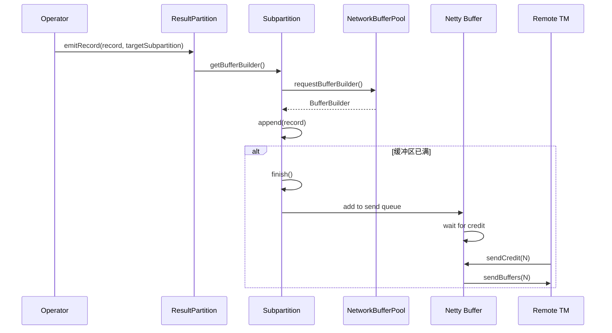
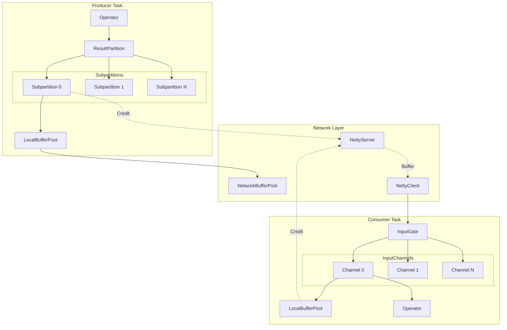
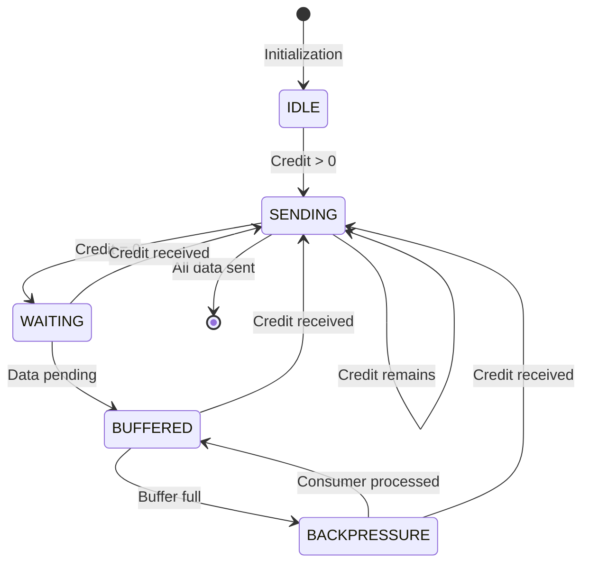

# Flink 网络栈源码深度分析

> 所属阶段: Knowledge/Flink-Scala-Rust-Comprehensive/src-analysis | 前置依赖: [TaskManager深度分析](./flink-taskmanager-deep-dive.md) | 形式化等级: L4

---

## 1. 概览

### 1.1 模块职责与设计目标

Flink 网络栈负责 TaskManager 之间的数据传输，采用基于 Credit 的流控机制实现反压(Backpressure)。其核心设计目标：

1. **高吞吐**: 批量传输，减少系统调用
2. **低延迟**: 零拷贝传输，减少序列化开销
3. **自然反压**: Credit-Based 流控自动传播反压
4. **流批统一**: 相同的网络栈支持有界和无界数据

### 1.2 源码模块结构

```
flink-runtime/src/main/java/org/apache/flink/runtime/io/
├── network/
│   ├── NetworkEnvironment.java         # 网络环境入口
│   ├── NetworkBufferPool.java          # 全局网络缓冲区池
│   ├── TaskEventDispatcher.java        # 任务事件分发
│   ├── api/
│   │   ├── CheckpointBarrier.java      # 检查点屏障
│   │   ├── EndOfPartitionEvent.java    # 分区结束事件
│   │   └── CancellationBarrier.java    # 取消屏障
│   ├── netty/
│   │   ├── NettyServer.java            # Netty 服务器
│   │   ├── NettyClient.java            # Netty 客户端
│   │   ├── PartitionRequestClient.java # 分区请求客户端
│   │   ├── PartitionRequestServerHandler.java
│   │   ├── CreditBasedPartitionRequestClientHandler.java
│   │   └── CreditBasedSequenceNumberingViewReader.java
│   ├── partition/
│   │   ├── ResultPartition.java        # 结果分区
│   │   ├── ResultPartitionManager.java # 分区管理器
│   │   ├── ResultSubpartition.java     # 子分区
│   │   ├── PipelinedSubpartition.java  # 流水线子分区
│   │   └── consumer/
│   │       ├── InputGate.java          # 输入门
│   │       ├── SingleInputGate.java    # 单输入门
│   │       └── RemoteInputChannel.java # 远程输入通道
│   └── buffer/
│       ├── Buffer.java                 # 缓冲区接口
│       ├── NetworkBuffer.java          # 网络缓冲区实现
│       └── BufferPool.java             # 本地缓冲区池
```

---

## 2. 核心类分析

### 2.1 ResultPartition - 结果分区

**完整路径**: `org.apache.flink.runtime.io.network.partition.ResultPartition`

**职责描述**:
ResultPartition 是算子输出数据的容器，每个 Task 可以产生多个 ResultPartition，每个 Partition 可进一步划分为多个 Subpartition (对应下游并行度)。

**核心实现**:

```java
public class ResultPartition implements ResultPartitionWriter {

    // === 分区元数据 ===
    private final ResultPartitionID partitionId;
    private final ResultPartitionType partitionType;
    private final int numberOfSubpartitions;

    // === 子分区数组 ===
    private final ResultSubpartition[] subpartitions;

    // === 缓冲区池 ===
    private BufferPool bufferPool;

    // === 状态管理 ===
    private final AtomicBoolean isReleased = new AtomicBoolean(false);

    // === 背压相关 ===
    private final boolean sendScheduleBasedOnCredit;
    private final int numRequiredBuffers;

    /**
     * 写入记录到指定子分区
     */
    @Override
    public void emitRecord(
            ByteBuffer record,
            int targetSubpartition) throws IOException {

        // 获取或创建缓冲区构建器
        BufferBuilder bufferBuilder =
            subpartitions[targetSubpartition].getBufferBuilder();

        // 尝试写入记录
        boolean written = bufferBuilder.append(record);

        if (!written) {
            // 缓冲区已满，触发刷新
            bufferBuilder.finish();
            bufferBuilder = requestNewBufferBuilder(targetSubpartition);

            // 重试写入
            written = bufferBuilder.append(record);
            if (!written) {
                throw new IOException("Record too large for buffer");
            }
        }
    }

    /**
     * 请求新的缓冲区构建器
     */
    private BufferBuilder requestNewBufferBuilder(int targetSubpartition)
            throws IOException {

        // 从本地缓冲区池请求缓冲区
        BufferBuilder bufferBuilder =
            subpartitions[targetSubpartition].requestBufferBuilder();

        if (bufferBuilder == null) {
            // 缓冲区不足，触发反压
            throw new InsufficientNumberOfBuffersException();
        }

        return bufferBuilder;
    }

    /**
     * 添加 Credit (来自下游的消费能力通知)
     */
    public void addCredit(int credit, int targetSubpartition) {
        if (sendScheduleBasedOnCredit) {
            // 基于 Credit 的发送调度
            PipelinedSubpartition subpartition =
                (PipelinedSubpartition) subpartitions[targetSubpartition];
            subpartition.addCredit(credit);
        }
    }

    /**
     * 完成分区生产
     */
    @Override
    public void finish() throws IOException {
        for (ResultSubpartition subpartition : subpartitions) {
            subpartition.finish();
        }

        // 通知分区管理器
        partitionManager.onPartitionFinished(this);
    }
}
```

---

### 2.2 PipelinedSubpartition - 流水线子分区

**完整路径**: `org.apache.flink.runtime.io.network.partition.PipelinedSubpartition`

**职责描述**:
PipelinedSubpartition 是流处理场景下的子分区实现，支持流水线传输，下游无需等待全部数据生产完成即可开始消费。

**核心实现**:

```java
public class PipelinedSubpartition extends ResultSubpartition {

    // === 数据队列 ===
    private final ArrayDeque<BufferConsumer> buffers = new ArrayDeque<>();

    // === 读视图 ===
    private PipelinedSubpartitionView readView;

    // === Credit-Based 流控 ===
    private int credits = 0;  // 可用 Credit 数
    private int sequenceNumber = 0;  // 序列号

    // === 状态 ===
    private boolean isFinished = false;
    private boolean isReleased = false;

    /**
     * 添加缓冲区消费者到队列
     */
    @Override
    public boolean add(BufferConsumer bufferConsumer, int partialRecordLength) {
        synchronized (buffers) {
            if (isFinished || isReleased) {
                bufferConsumer.close();
                return false;
            }

            // 添加到队列
            buffers.add(bufferConsumer);

            // 增加积压计数
            totalNumberOfBuffers++;
            totalNumberOfBytes += bufferConsumer.getWritableBytes();

            // 如果有读视图，通知有数据可读
            if (readView != null) {
                readView.notifyDataAvailable();
            }

            return true;
        }
    }

    /**
     * 基于 Credit 的数据轮询
     */
    BufferAndBacklog pollBuffer() {
        synchronized (buffers) {
            // 检查 Credit
            if (credits <= 0 && !isFinished) {
                // 无可用 Credit，返回空
                return null;
            }

            // 获取下一个缓冲区
            BufferConsumer bufferConsumer = buffers.poll();
            if (bufferConsumer == null) {
                return null;
            }

            // 构建 Buffer 并增加序列号
            Buffer buffer = bufferConsumer.build();
            sequenceNumber++;
            credits--;

            // 计算积压信息
            int backlog = buffers.size();
            boolean moreAvailable = !buffers.isEmpty() &&
                                    (credits > 0 || isFinished);

            return new BufferAndBacklog(
                buffer,
                backlog,
                moreAvailable ? sequenceNumber : -sequenceNumber,
                isFinished && buffers.isEmpty()
            );
        }
    }

    /**
     * 添加 Credit (来自下游)
     */
    void addCredit(int credit) {
        synchronized (buffers) {
            credits += credit;

            // 通知读视图有新 Credit
            if (readView != null && !buffers.isEmpty()) {
                readView.notifyDataAvailable();
            }
        }
    }

    /**
     * 获取积压的缓冲区数量
     */
    int getNumberOfQueuedBuffers() {
        synchronized (buffers) {
            return buffers.size();
        }
    }
}
```

---

### 2.3 SingleInputGate - 输入门

**完整路径**: `org.apache.flink.runtime.io.network.partition.consumer.SingleInputGate`

**职责描述**:
InputGate 是 Task 消费上游数据的入口，封装了多个 InputChannel (每个上游子任务一个通道)。

**核心实现**:

```java
public class SingleInputGate extends InputGate {

    // === 通道数组 ===
    private final InputChannel[] inputChannels;

    // === 缓冲区池 ===
    private BufferPool bufferPool;

    // === Credit-Based 流控 ===
    private final int numCreditsInitial;
    private int numCreditsAvailable;

    // === 事件处理 ===
    private final BitSet channelsWithEndOfPartitionEvents;
    private final BitSet releasedInputChannelsWithEndOfPartitionEvents;

    // === 队列管理 ===
    private final PrioritizedDeque<InputChannel> inputChannelsWithData;
    private final CompletableFuture<Void> closeFuture;

    /**
     * 请求缓冲区并发送 Credit
     */
    @Override
    public void setup() throws IOException {
        // 创建本地缓冲区池
        BufferPool bufferPool = networkBufferPool.createBufferPool(
            numberOfInputChannels * numCreditsPerChannel,
            Integer.MAX_VALUE
        );
        assignExclusiveBuffers(bufferPool);

        // 向每个远程通道发送初始 Credit
        for (InputChannel channel : inputChannels) {
            if (channel instanceof RemoteInputChannel) {
                ((RemoteInputChannel) channel).sendCreditAnnouncement();
            }
        }
    }

    /**
     * 获取下一个可用缓冲区
     */
    @Override
    public Optional<InputChannel> getNextInputChannel() throws IOException {
        while (true) {
            // 优先处理有可用数据的通道
            InputChannel channel = inputChannelsWithData.poll();

            if (channel == null) {
                return Optional.empty();
            }

            // 尝试获取缓冲区
            if (channel.getNextBuffer().isPresent()) {
                return Optional.of(channel);
            }

            // 通道可能已关闭或暂时没有数据
            if (channel.isReleased()) {
                continue;
            }
        }
    }

    /**
     * 处理通道事件
     */
    void onChannelEvent(
            InputChannel channel,
            TaskEvent event) throws IOException {

        if (event instanceof CheckpointBarrier) {
            // 检查点屏障处理
            processCheckpointBarrier((CheckpointBarrier) event, channel);
        } else if (event instanceof EndOfPartitionEvent) {
            // 分区结束事件
            channelsWithEndOfPartitionEvents.set(channel.getChannelIndex());

            // 检查是否所有通道都结束
            if (channelsWithEndOfPartitionEvents.cardinality() ==
                inputChannels.length) {
                markFinished();
            }
        } else if (event instanceof CancelCheckpointMarker) {
            // 取消检查点
            processCancelCheckpointMarker(
                (CancelCheckpointMarker) event, channel);
        }
    }
}
```

---

### 2.4 RemoteInputChannel - 远程输入通道

**完整路径**: `org.apache.flink.runtime.io.network.partition.consumer.RemoteInputChannel`

**职责描述**:
RemoteInputChannel 负责与远程 TaskManager 的网络通信，通过 Netty 客户端请求和接收数据。

**核心实现**:

```java
public class RemoteInputChannel extends InputChannel {

    // === 网络连接 ===
    private volatile PartitionRequestClient partitionRequestClient;

    // === 缓冲区管理 ===
    private final BufferManager bufferManager;
    private final ArrayDeque<SequenceNumberBuffer> receivedBuffers;

    // === Credit 管理 ===
    private final AtomicInteger availableCredit = new AtomicInteger(0);
    private final int initialCredit;
    private final int creditLimit;

    // === 序列号追踪 ===
    private int expectedSequenceNumber = 0;
    private int lastBarrierSequenceNumber = -1;

    /**
     * 请求子分区数据
     */
    void requestSubpartition(int subpartitionIndex) throws IOException {
        // 获取或创建连接
        if (partitionRequestClient == null) {
            partitionRequestClient = connectionManager.createPartitionRequestClient(
                connectionId);
        }

        // 发送分区请求
        partitionRequestClient.requestSubpartition(
            partitionId,
            subpartitionIndex,
            this,
            0  // 初始 Credit
        );
    }

    /**
     * 接收缓冲区数据
     */
    void onBuffer(Buffer buffer, int sequenceNumber) {
        synchronized (receivedBuffers) {
            // 验证序列号
            if (sequenceNumber != expectedSequenceNumber) {
                // 序列号不匹配，可能需要重排序
                handleSequenceNumberMismatch(sequenceNumber);
            }

            expectedSequenceNumber++;

            // 添加到接收队列
            receivedBuffers.add(new SequenceNumberBuffer(buffer, sequenceNumber));

            // 通知 InputGate 有数据可读
            inputGate.notifyChannelNonEmpty(this);
        }
    }

    /**
     * 发送 Credit 通知
     */
    void sendCreditAnnouncement() {
        int credit = availableCredit.getAndSet(0);
        if (credit > 0) {
            partitionRequestClient.addCredit(
                partitionId.getPartitionId(),
                credit
            );
        }
    }

    /**
     * Credit 消耗与补充
     */
    @Override
    public Optional<BufferAndAvailability> getNextBuffer() {
        synchronized (receivedBuffers) {
            SequenceNumberBuffer next = receivedBuffers.poll();
            if (next == null) {
                return Optional.empty();
            }

            // 回收 Credit
            bufferManager.recycle(next.buffer);

            // 检查是否需要补充 Credit
            int creditToAnnounce = bufferManager.requestAnnounceCredit();
            if (creditToAnnounce > 0) {
                partitionRequestClient.addCredit(
                    partitionId.getPartitionId(),
                    creditToAnnounce
                );
            }

            return Optional.of(new BufferAndAvailability(
                next.buffer,
                receivedBuffers.isEmpty(),
                next.sequenceNumber
            ));
        }
    }

    /**
     * 增加可用 Credit
     */
    void addCredit(int credit) {
        availableCredit.addAndGet(credit);

        // 如果有挂起的数据请求，立即发送 Credit
        if (partitionRequestClient != null) {
            sendCreditAnnouncement();
        }
    }
}
```

---

## 3. 调用链分析

### 3.1 数据发送流程



### 3.2 Credit-Based 流控完整流程

```mermaid
sequenceDiagram
    participant Consumer as InputChannel
    participant BufferMgr as BufferManager
    participant NettyC as Netty Client
    participant NettyS as Netty Server
    partition Subpartition {
        Producer as Producer
    }

    Note over Consumer,Producer: 初始化阶段
    Consumer->>BufferMgr: 分配初始缓冲区
    Consumer->>NettyC: sendCredit(initialCredit)
    NettyC->>NettyS: CreditAnnouncement
    NettyS->>Producer: addCredit(initialCredit)

    Note over Consumer,Producer: 数据传输阶段

    loop Credit > 0
        Producer->>NettyS: sendBuffer(data)
        NettyS->>NettyC: Buffer
        NettyC->>Consumer: onBuffer(buffer)
        Consumer->>BufferMgr: store(buffer)
    end

    Note over Consumer,Producer: Credit 耗尽，暂停发送

    Consumer->>Consumer: processBuffer()
    Consumer->>BufferMgr: recycle(buffer)
    BufferMgr-->>Consumer: creditAvailable
    Consumer->>NettyC: sendCredit(1)
    NettyC->>NettyS: CreditAnnouncement
    NettyS->>Producer: addCredit(1)

    Note over Consumer,Producer: 恢复传输
    Producer->>NettyS: sendBuffer(data)
```

---

## 4. 关键算法实现

### 4.1 Credit-Based 流控算法

```java
import java.util.Map;

/**
 * Credit-Based 流控核心实现
 */
public class CreditBasedFlowControl {

    // === 发送端 ===
    public class CreditBasedPartitionRequestServerHandler {

        // 通道到 Credit 的映射
        private final Map<InputChannelID, Integer> credits;

        /**
         * 处理 Credit 添加请求
         */
        void addCredit(InputChannelID receiverId, int credit) {
            credits.merge(receiverId, credit, Integer::sum);

            // 尝试发送缓冲的数据
            trySendBufferedData(receiverId);
        }

        /**
         * 发送缓冲区数据
         */
        void trySendBufferedData(InputChannelID receiverId) {
            int availableCredit = credits.getOrDefault(receiverId, 0);

            while (availableCredit > 0) {
                Buffer buffer = pollBuffer(receiverId);
                if (buffer == null) {
                    break;
                }

                sendBuffer(receiverId, buffer);
                availableCredit--;
            }

            credits.put(receiverId, availableCredit);
        }
    }

    // === 接收端 ===
    public class CreditBasedPartitionRequestClientHandler {

        // 初始 Credit 数量
        private static final int INITIAL_CREDIT = 2;

        // 信用度阈值，低于此值时申请更多
        private static final int CREDIT_THRESHOLD = 1;

        /**
         * 处理接收到的缓冲区
         */
        void onBuffer(Buffer buffer, InputChannelID receiverId) {
            RemoteInputChannel channel = inputChannels.get(receiverId);

            // 存储缓冲区
            channel.onBuffer(buffer);

            // 减少可用 Credit
            channel.decrementCredit();

            // 检查是否需要补充 Credit
            int currentCredit = channel.getCredit();
            int backlog = channel.getBacklog();

            // 计算需要的 Credit 数
            int creditsToAnnounce = calculateCreditsToAnnounce(
                currentCredit, backlog);

            if (creditsToAnnounce > 0) {
                channel.addCredit(creditsToAnnounce);
                sendCreditAnnouncement(receiverId, creditsToAnnounce);
            }
        }

        /**
         * 计算需要申请的 Credit 数量
         */
        private int calculateCreditsToAnnounce(
                int currentCredit,
                int backlog) {

            // 如果积压大于 Credit，申请更多
            if (backlog > currentCredit) {
                return Math.min(backlog - currentCredit, MAX_CREDIT_PER_REQUEST);
            }

            // 如果 Credit 低于阈值，补充到初始值
            if (currentCredit < CREDIT_THRESHOLD) {
                return INITIAL_CREDIT - currentCredit;
            }

            return 0;
        }
    }
}
```

### 4.2 序列化与反序列化优化

```java
/**
 * 基于 MemorySegment 的高效序列化
 */
public class RecordSerializer {

    private final DataOutputSerializer serializer;
    private BufferBuilder bufferBuilder;

    /**
     * 序列化记录到缓冲区
     */
    public SerializationResult serializeRecord(
            IOReadableSerializable record) throws IOException {

        // 1. 序列化到临时缓冲区
        serializer.clear();
        record.write(serializer);

        // 2. 获取序列化后的数据
        ByteBuffer serialized = serializer.getByteBuffer();
        int remaining = serialized.remaining();

        // 3. 尝试写入当前缓冲区构建器
        boolean written = bufferBuilder.append(serialized);

        if (!written) {
            // 当前缓冲区已满，完成并请求新的
            bufferBuilder.finish();
            bufferBuilder = requestNewBufferBuilder();

            // 重试写入
            written = bufferBuilder.append(serialized);
            if (!written) {
                // 记录太大，需要跨缓冲区
                return handleLargeRecord(serialized);
            }

            return SerializationResult.FULL_RECORD;
        }

        if (!serialized.hasRemaining()) {
            return SerializationResult.FULL_RECORD;
        } else {
            // 部分写入，需要更多缓冲区
            return SerializationResult.PARTIAL_RECORD;
        }
    }
}

/**
 * 基于 MemorySegment 的反序列化
 */
public class RecordDeserializer {

    private final DataInputDeserializer deserializer;
    private final NonSpanningWrapper nonSpanningWrapper;
    private final SpanningWrapper spanningWrapper;

    /**
     * 从缓冲区反序列化记录
     */
    public DeserializationResult deserializeRecord(
            Buffer buffer,
            IOReadableSerializable target) throws IOException {

        // 获取缓冲区的 MemorySegment
        MemorySegment segment = buffer.getMemorySegment();
        int offset = buffer.getOffset();
        int length = buffer.getLength();

        // 检查是否有跨缓冲区的未完成记录
        if (spanningWrapper.hasUnfinishedData()) {
            // 将新数据追加到跨缓冲区包装器
            spanningWrapper.append(segment, offset, length);

            // 尝试完成反序列化
            if (spanningWrapper.isComplete()) {
                deserializer.setBuffer(spanningWrapper.getData());
                target.read(deserializer);
                spanningWrapper.clear();
                return DeserializationResult.INTERMEDIATE_RECORD;
            }

            return DeserializationResult.PARTIAL_RECORD;
        }

        // 非跨缓冲区情况
        deserializer.setBuffer(segment, offset, length);

        // 尝试读取记录长度
        int recordLength = deserializer.readInt();

        // 检查记录是否在当前缓冲区内
        if (recordLength <= length - Integer.BYTES) {
            // 完整记录在缓冲区内
            target.read(deserializer);
            return DeserializationResult.FULL_RECORD;
        } else {
            // 记录跨缓冲区，启动跨缓冲区模式
            spanningWrapper.start(recordLength, segment, offset + Integer.BYTES);
            return DeserializationResult.PARTIAL_RECORD;
        }
    }
}
```

---

## 5. 版本演进

### 5.1 Flink 1.5: Credit-Based 流控

**变更内容**:

- 引入基于 Credit 的流控机制，替代基于阻塞的流控
- 解决了反压传播延迟问题

```java
// 1.5 之前的阻塞式反压
public class BlockingBackPressure {
    // 阻塞发送直到有可用缓冲区
    public void emitRecord(...) {
        while (bufferPool.isEmpty()) {
            Thread.sleep(1);  // 忙等待
        }
        // 发送数据
    }
}

// 1.5+ Credit-Based 流控
public class CreditBasedBackPressure {
    // 仅在收到 Credit 时才发送
    public void emitRecord(...) {
        if (credit > 0) {
            sendBuffer();
            credit--;
        } else {
            // 缓冲数据，等待 Credit
            bufferData();
        }
    }
}
```

### 5.2 Flink 1.8: 缓冲区膨胀优化

**变更内容**:

- 动态调整缓冲区数量
- 更好的突发流量处理

### 5.3 Flink 1.13: 非对齐检查点与网络栈集成

**变更内容**:

- 支持在 Barrier 中携带 Buffer 序列号
- 实现非对齐检查点的数据传输

```java
// 非对齐检查点的缓冲区追踪
public class UnalignedCheckpointSupport {

    private final Map<InputChannelID, Integer> channelSequenceNumbers;

    /**
     * 处理带序列号的缓冲区
     */
    void onBufferWithSequenceNumber(
            Buffer buffer,
            int sequenceNumber,
            InputChannelID channelId) {

        if (barrierReceived.contains(channelId)) {
            // Barrier 之后的缓冲区需要特殊处理
            storeForUnalignedCheckpoint(channelId, buffer, sequenceNumber);
        } else {
            // 正常处理
            processNormally(buffer);
        }
    }
}
```

### 5.4 Flink 1.15+: 零拷贝优化

**变更内容**:

- 减少缓冲区复制次数
- 直接操作 MemorySegment

### 5.5 Flink 2.0: 统一网络栈

**预期变更**:

- 批流统一网络栈实现
- 更好的云原生支持

---

## 6. 性能考量

### 6.1 网络缓冲区配置

**配置建议**:

```yaml
# flink-conf.yaml

# 网络缓冲区数量计算
# 公式: max(numSlots^2 * 4, 2048)
taskmanager.memory.network.number-of-buffers: 4096

# 每个子分区的缓冲区数 (流处理)
taskmanager.memory.network.memory-per-input-gate: 32mb
taskmanager.memory.network.memory-per-output-gate: 64mb

# 缓冲区大小 (大数据块场景可增大)
taskmanager.memory.segment-size: 32768
```

**计算公式**:

```
所需缓冲区数 = (上游并行度 × 下游并行度) × 4
例如: 100 × 100 × 4 = 40,000 个缓冲区
      40,000 × 32KB = 1.28GB 网络内存
```

### 6.2 反压调优

**监控指标**:

```java
// 背压监控
public class BackPressureMonitor {

    public BackPressureRatio calculateBackPressure(Task task) {
        double inputQueueFillRatio = getInputQueueFillRatio(task);
        double outputQueueFillRatio = getOutputQueueFillRatio(task);

        if (inputQueueFillRatio > 0.9) {
            return BackPressureRatio.HIGH;
        } else if (inputQueueFillRatio > 0.5) {
            return BackPressureRatio.MEDIUM;
        } else {
            return BackPressureRatio.LOW;
        }
    }
}
```

**优化策略**:

1. 增加网络缓冲区数量
2. 调整算子并行度
3. 优化序列化性能
4. 使用异步检查点

### 6.3 序列化性能优化

**对比表**:

| 序列化器 | 速度 | 压缩率 | 适用场景 |
|---------|------|-------|---------|
| POJO | 中 | 低 | 快速原型 |
| Avro | 快 | 高 | 通用场景 |
| Protobuf | 极快 | 高 | 高性能要求 |
| Kryo | 快 | 中 | 复杂类型 |

---

## 7. 可视化

### 7.1 网络栈整体架构



### 7.2 Credit-Based 流控状态图



---

## 8. 引用参考
