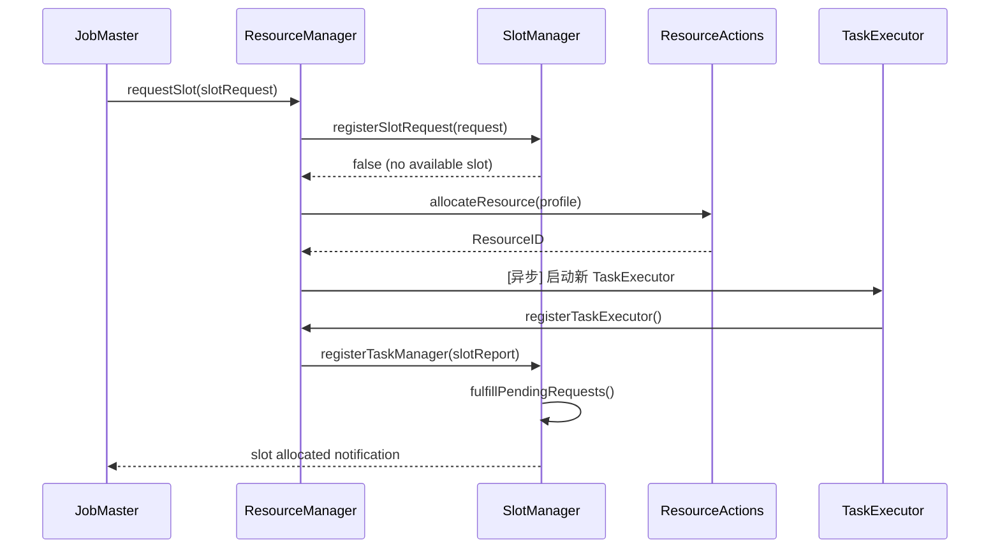
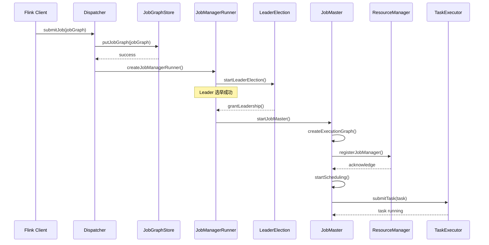
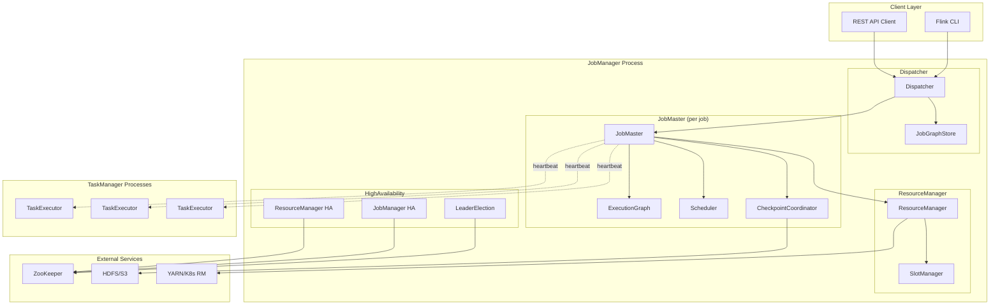
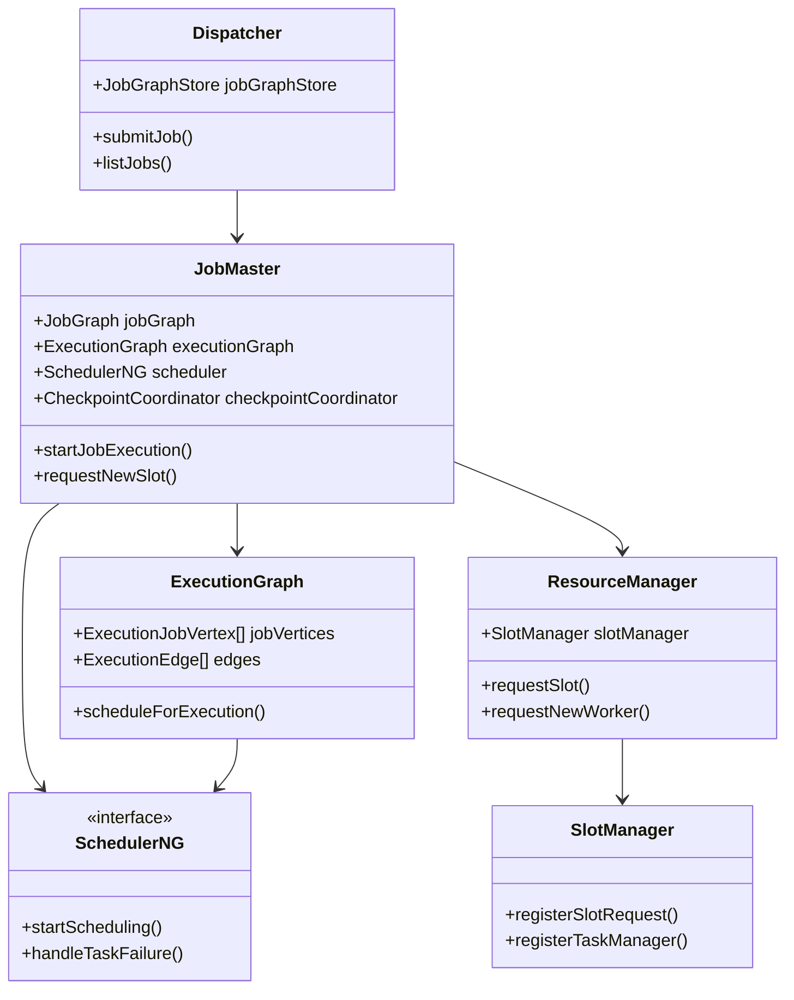

# Flink 运行时架构源码深度分析

> 所属阶段: Knowledge/Flink-Scala-Rust-Comprehensive/src-analysis | 前置依赖: [Flink架构概述](../../../Flink/01-concepts/deployment-architectures.md) | 形式化等级: L4

---

## 1. 概览

### 1.1 模块职责与设计目标

Flink Runtime 是整个 Flink 系统的核心执行引擎，负责作业的提交、调度、执行和容错。其设计遵循以下核心原则：

1. **Master-Worker 架构**: JobManager 作为协调中心，TaskManager 作为执行节点
2. **高可用性**: 基于 ZooKeeper/Kubernetes 的 Leader 选举机制
3. **资源弹性**: 支持动态扩缩容和故障恢复
4. **统一批流处理**: 相同的执行引擎处理有界和无界数据

### 1.2 源码模块划分

```
flink-runtime/
├── jobmaster/          # JobManager 核心实现
├── resourcemanager/    # 资源管理器
├── dispatcher/         # 作业分发与 REST API
├── highavailability/   # HA 服务抽象
├── clusterframework/   # 部署模式抽象
└── entrypoint/         # 入口点实现
```

---

## 2. 核心类分析

### 2.1 JobMaster - 作业管理核心

**完整路径**: `org.apache.flink.runtime.jobmaster.JobMaster`

**职责描述**:
JobMaster 是每个 Flink 作业的单一控制点，负责作业生命周期的完整管理。在 Flink 1.11+ 版本中，JobMaster 取代了旧的 JobManager 实现，提供了更清晰的责任分离。

**核心字段分析**:

```java
public class JobMaster extends FencedRpcEndpoint<JobMasterId>
    implements JobMasterGateway, JobManagerRunnerResult {

    // 作业图 - 经过优化后的执行计划
    private final JobGraph jobGraph;

    // 执行图 - 分布式执行视角
    private final ExecutionGraph executionGraph;

    // 调度策略 - 决定任务调度顺序
    private final SchedulerNG scheduler;

    // 检查点协调器 - 管理分布式快照
    private final CheckpointCoordinator checkpointCoordinator;

    // 心跳管理器 - 监控 TaskManager 健康
    private final HeartbeatManager<Void, Void> taskManagerHeartbeatManager;

    // 分区跟踪器 - 管理中间结果位置
    private final PartitionTracker partitionTracker;

    // 资源管理器连接 - 动态资源申请
    private ResourceManagerAddress resourceManagerAddress;
}
```

**关键方法分析**:

#### 2.1.1 startJobExecution() - 启动作业执行

```java
private void startJobExecution() {
    // 1. 验证作业状态
    validateRunsInMainThread();

    // 2. 启动心跳服务 - 向 ResourceManager 注册心跳
    startHeartbeatServices();

    // 3. 构建 ExecutionGraph - 这是核心转换逻辑
    // JobGraph (逻辑图) -> ExecutionGraph (执行图)
    ExecutionGraph newExecutionGraph = createAndRestoreExecutionGraph();

    // 4. 初始化检查点协调器
    if (checkpointCoordinator != null) {
        checkpointCoordinator.startCheckpointScheduler();
    }

    // 5. 调度执行 - 将任务分配到可用 slot
    scheduler.startScheduling();

    // 6. 监控服务启动
    establishResourceManagerConnection();
}
```

#### 2.1.2 notifyAllocationFailure() - 资源分配失败处理

```java
@Override
public void notifyAllocationFailure(
        AllocationID allocationID,
        Exception cause) {

    // 获取对应的 Execution 顶点
    final Execution execution = executionGraph.getRegisteredExecutions()
        .get(allocationID);

    if (execution != null) {
        // 标记执行失败，触发故障恢复
        execution.markFailed(cause);

        // 如果是部分资源失败，尝试重新调度
        if (isPartialResourceFailure(cause)) {
            // 释放失败的 slot，触发重新分配
            slotPool.releaseSlot(allocationID, cause);

            // 通知调度器重新尝试调度
            scheduler.restartTasks(Collections.singleton(execution.getVertex()));
        }
    }
}
```

**方法调用链**:

```
JobMaster.startJobExecution()
├── SchedulerNG.startScheduling()
│   └── PipelinedRegionSchedulingStrategy.startScheduling()
│       └── Execution.deploy()
│           └── TaskExecutor.submitTask()
│
└── ResourceManager.registerJobManager()
    └── SlotManager.registerJobManager()
```

---

### 2.2 ResourceManager - 资源管理器

**完整路径**: `org.apache.flink.runtime.resourcemanager.ResourceManager`

**职责描述**:
ResourceManager 负责集群资源的统一管理和分配。在 YARN/Kubernetes/Standalone 等不同部署模式下，有不同的具体实现。

**核心架构**:

```java
public abstract class ResourceManager<WorkerType extends ResourceIDRetrievable>
    extends FencedRpcEndpoint<ResourceManagerId>
    implements ResourceManagerGateway {

    // Slot 管理器 - 负责 slot 的分配与回收
    private final SlotManager slotManager;

    // 心跳服务 - 监控 TaskManager 存活
    private final HeartbeatManager<Void, Void> taskManagerHeartbeatManager;

    // JobManager 连接管理
    private final Map<JobID, JobManagerRegistration> jobManagerRegistrations;

    // 工作节点注册表
    private final Map<ResourceID, WorkerRegistration<WorkerType>>
        taskExecutors;

    // 高可用服务
    private final HighAvailabilityServices highAvailabilityServices;

    // Leader 选举服务
    private final LeaderElectionService leaderElectionService;
}
```

**关键方法分析**:

#### 2.2.1 requestSlot() - Slot 资源申请

```java
@Override
public CompletableFuture<Acknowledge> requestSlot(
        JobMasterId jobMasterId,
        SlotRequest slotRequest,
        Time timeout) {

    // 1. 验证 JobManager 注册状态
    JobManagerRegistration registration = jobManagerRegistrations
        .get(slotRequest.getJobId());

    if (registration == null) {
        throw new ResourceManagerException(
            "JobManager not registered for job " + slotRequest.getJobId());
    }

    // 2. 委托给 SlotManager 处理分配逻辑
    return CompletableFuture.supplyAsync(() -> {
        // SlotManager 内部逻辑：
        // - 首先检查是否有空闲 slot
        // - 如果没有，向资源框架申请新容器
        // - 返回分配的 slot 信息

        boolean accepted = slotManager.registerSlotRequest(slotRequest);

        if (!accepted) {
            // 触发资源扩展 - 向 YARN/K8s 申请新容器
            requestNewWorker(slotRequest.getResourceProfile());
        }

        return Acknowledge.get();
    }, getMainThreadExecutor());
}
```

#### 2.2.2 requestNewWorker() - 动态资源申请

```java
protected abstract CompletableFuture<WorkerType> requestNewWorker(
    ResourceProfile resourceProfile);

// 在 ActiveResourceManager 中的实现：
@Override
protected CompletableFuture<WorkerType> requestNewWorker(
        ResourceProfile resourceProfile) {

    // 检查资源配额
    if (!canAcquireNewWorkers()) {
        return FutureUtils.completedExceptionally(
            new ResourceManagerException("Resource quota exceeded"));
    }

    // 增加待处理请求计数
    numPendingWorkerCounter.incrementAndGet();

    // 向底层资源管理器申请资源
    // YARN: 向 RM 申请 Container
    // Kubernetes: 创建 Pod
    // Standalone: 启动新进程
    return resourceActions.allocateResource(resourceProfile)
        .thenApply(resourceID -> {
            // 记录待启动 worker
            startNewWorker(resourceProfile, resourceID);
            return resourceID;
        })
        .exceptionally(throwable -> {
            numPendingWorkerCounter.decrementAndGet();
            throw new CompletionException(throwable);
        });
}
```

**调用时序图**:



---

### 2.3 Dispatcher - 作业分发中心

**完整路径**: `org.apache.flink.runtime.dispatcher.Dispatcher`

**职责描述**:
Dispatcher 是 Flink 集群的入口点，负责接收作业提交请求、管理 JobManagerRunner 的生命周期，并提供作业列表查询等管理服务。

**核心实现**:

```java
public abstract class Dispatcher extends FencedRpcEndpoint<DispatcherId>
    implements DispatcherGateway {

    // 作业存储 - 持久化已提交的作业图
    private final JobGraphStore jobGraphStore;

    // JobManager 运行器工厂
    private final JobManagerRunnerFactory jobManagerRunnerFactory;

    // 运行中的作业
    private final Map<JobID, JobManagerRunner> jobManagerRunners;

    // 历史作业信息
    private final Map<JobID, CompletedJobInfo> completedJobs;

    // REST API 处理线程池
    private final Executor ioExecutor;
}
```

**关键方法分析**:

#### 2.3.1 submitJob() - 作业提交流程

```java
@Override
public CompletableFuture<Acknowledge> submitJob(
        JobGraph jobGraph,
        Time timeout) {

    final JobID jobId = jobGraph.getJobID();

    // 1. 持久化作业图 - 确保故障后可恢复
    return jobGraphStore.putJobGraph(jobGraph)
        .thenApplyAsync(ignored -> {
            // 2. 创建 JobManagerRunner
            // 在 HA 模式下，这会触发 Leader 选举
            JobManagerRunner runner = jobManagerRunnerFactory
                .createJobManagerRunner(
                    jobGraph,
                    this::onJobManagerRunnerComplete,
                    userCodeClassLoader
                );

            // 3. 存储并启动
            jobManagerRunners.put(jobId, runner);

            // 4. 异步启动 - 实际执行在 Leader 选举后
            runner.start();

            return Acknowledge.get();
        }, ioExecutor)
        .exceptionally(throwable -> {
            // 清理已持久化的作业图
            jobGraphStore.removeJobGraph(jobId);
            throw new CompletionException(
                "Failed to submit job " + jobId, throwable);
        });
}
```

#### 2.3.2 onJobManagerRunnerComplete() - 作业完成处理

```java
private void onJobManagerRunnerComplete(
        JobID jobId,
        JobManagerRunnerResult result) {

    // 获取执行结果
    final ArchivedExecutionGraph archivedExecutionGraph =
        result.getArchivedExecutionGraph();

    // 1. 从运行列表移除
    jobManagerRunners.remove(jobId);

    // 2. 归档执行历史
    completedJobs.put(jobId, new CompletedJobInfo(
        archivedExecutionGraph,
        System.currentTimeMillis()
    ));

    // 3. 清理持久化存储
    try {
        jobGraphStore.removeJobGraph(jobId);
    } catch (Exception e) {
        log.warn("Could not remove job graph from store", e);
    }

    // 4. 触发作业状态监听器
    jobTerminationListeners.forEach(listener ->
        listener.accept(jobId, archivedExecutionGraph.getState()));
}
```

---

### 2.4 HighAvailabilityServices - 高可用服务

**完整路径**: `org.apache.flink.runtime.highavailability.HighAvailabilityServices`

**职责描述**:
HA Services 为 Flink 集群组件提供 Leader 选举、服务发现和状态持久化能力，是实现 Flink 高可用的核心抽象。

**核心接口定义**:

```java
public interface HighAvailabilityServices extends AutoCloseable {

    // === Leader 选举服务 ===

    // ResourceManager 的 Leader 选举
    LeaderElectionService getResourceManagerLeaderElectionService();

    // Dispatcher 的 Leader 选举
    LeaderElectionService getDispatcherLeaderElectionService();

    // JobManager 的 Leader 选举 (每个作业独立)
    LeaderElectionService getJobManagerLeaderElectionService(JobID jobID);

    // === 服务发现 ===

    // ResourceManager 地址检索
    LeaderRetrievalService getResourceManagerLeaderRetriever();

    // Dispatcher 地址检索
    LeaderRetrievalService getDispatcherLeaderRetriever();

    // JobManager 地址检索
    LeaderRetrievalService getJobManagerLeaderRetriever(JobID jobID);

    // === 检查点存储 ===

    // 检查点状态句柄存储
    CheckpointRecoveryFactory getCheckpointRecoveryFactory();

    // 作业图存储
    JobGraphStore getJobGraphStore();

    // 已完成的检查点存储
    CompletedCheckpointStore getCompletedCheckpointStore(JobID jobID);
}
```

**ZooKeeper 实现分析**:

```java
public class ZooKeeperHaServices implements HighAvailabilityServices {

    // Curator Framework - ZooKeeper 客户端
    private final CuratorFramework curatorFramework;

    // 配置
    private final Configuration configuration;

    @Override
    public LeaderElectionService getResourceManagerLeaderElectionService() {
        // 使用 Curator 的 LeaderLatch 实现选举
        return new ZooKeeperLeaderElectionService(
            curatorFramework,
            "/leader/resource_manager",
            listener
        );
    }

    @Override
    public JobGraphStore getJobGraphStore() {
        // ZooKeeper 存储作业图元数据
        // 实际数据可能存储在 HDFS/S3
        return new ZooKeeperJobGraphStore(
            curatorFramework,
            "/jobgraphs",
            jobGraphStorageHelper
        );
    }
}
```

---

## 3. 调用链分析

### 3.1 作业提交流程时序图



### 3.2 资源分配流程调用链

```
JobMaster.requestNewSlot()
├── SlotPoolImpl.requestNewAllocatedSlot()
│   └── ResourceManagerGateway.requestSlot()
│       └── SlotManagerImpl.registerSlotRequest()
│           ├── ResourceAllocationStrategy.tryFulfillRequirement()
│           │   └── findAvailableSlots()
│           └── if (not fulfilled):
│               └── ResourceManager.requestNewWorker()
│                   ├── ActiveResourceManager.requestNewWorker()
│                   │   └── YarnResourceManagerDriver.allocateResource()
│                   │       └── AMRMClient.addContainerRequest()
│                   └── wait for TaskExecutor registration
└── TaskExecutor.registerSlot()
    └── SlotManager.registerSlot()
        └── fulfillPendingRequests()
            └── SlotPoolImpl.slotAllocated()
                └── Execution.assignResource()
```

---

## 4. 关键算法实现

### 4.1 ExecutionGraph 构建算法

**算法目标**: 将逻辑 JobGraph 转换为可分布式执行的 ExecutionGraph

```java
public ExecutionGraph buildExecutionGraph(JobGraph jobGraph) {
    // 1. 创建执行图结构
    ExecutionGraph executionGraph = new ExecutionGraph(
        jobInformation,
        futureExecutor,
        ioExecutor,
        slotProvider,
        classLoader,
        blobWriter,
        partitionReleaseStrategyFactory,
        shuffleMaster,
        partitionTracker,
        failureEnrichers,
        updateListener
    );

    // 2. 拓扑排序遍历所有 JobVertex
    List<JobVertex> sortedVertices = jobGraph.getVerticesSortedTopologically();

    // 3. 为每个 JobVertex 创建 ExecutionJobVertex
    for (JobVertex jobVertex : sortedVertices) {
        // 并行度计算
        int parallelism = jobVertex.getParallelism();
        int maxParallelism = jobVertex.getMaxParallelism();

        // 创建 ExecutionJobVertex
        ExecutionJobVertex ejv = new ExecutionJobVertex(
            executionGraph,
            jobVertex,
            parallelism,
            maxParallelism,
            createTimestamp,
            timeout
        );

        // 4. 为每个并行实例创建 ExecutionVertex
        for (int subtask = 0; subtask < parallelism; subtask++) {
            ExecutionVertex ev = new ExecutionVertex(
                ejv,
                subtask,
                intermediateResults,
                timeout
            );

            // 5. 创建当前 Execution 实例 (版本控制)
            Execution execution = new Execution(
                ev,
                0,  // attemptNumber
                createTimestamp,
                timeout
            );
            ev.setCurrentExecution(execution);
        }

        executionGraph.attachJobVertex(ejv);
    }

    // 6. 连接执行边 (基于 JobEdge)
    connectExecutionGraphEdges(executionGraph, jobGraph);

    return executionGraph;
}

private void connectExecutionGraphEdges(
        ExecutionGraph executionGraph,
        JobGraph jobGraph) {

    for (JobEdge jobEdge : jobGraph.getEdges()) {
        // 获取源和目标的 ExecutionJobVertex
        ExecutionJobVertex sourceEjv = executionGraph.getJobVertex(
            jobEdge.getSource().getProducer().getID());
        ExecutionJobVertex targetEjv = executionGraph.getJobVertex(
            jobEdge.getTarget().getID());

        // 创建 IntermediateResult (中间结果)
        IntermediateResult intermediateResult =
            sourceEjv.getProducedDataSet();

        // 为每个目标并行实例创建消费关系
        for (int targetSubtask = 0;
             targetSubtask < targetEjv.getParallelism();
             targetSubtask++) {

            ExecutionVertex targetVertex =
                targetEjv.getTaskVertices()[targetSubtask];

            // 根据分区策略确定输入依赖
            InputDependencyConstraint constraint =
                calculateInputDependency(jobEdge);

            // 建立执行依赖关系
            targetVertex.addInputDependency(
                intermediateResult,
                jobEdge.getDistributionPattern(),
                constraint
            );
        }
    }
}
```

### 4.2 调度策略选择算法

```java
public SchedulerNG createScheduler(
        JobGraph jobGraph,
        Configuration configuration) {

    // 根据配置选择调度策略
    SchedulerType schedulerType = configuration.get(
        JobManagerOptions.SCHEDULER);

    switch (schedulerType) {
        case NGG:  // 下一代调度器 (Flink 1.12+)
            return new PipelinedRegionScheduler(
                jobGraph,
                declarativeSlotPool,
                restartStrategy,
                componentMainThreadExecutor
            );

        case LEGACY:  // 传统调度器
        default:
            return new LegacyScheduler(
                jobGraph,
                slotProvider,
                restartStrategy
            );
    }
}

// PipelinedRegion 调度算法核心
public class PipelinedRegionScheduler implements SchedulerNG {

    @Override
    public void startScheduling() {
        // 1. 识别所有可独立调度的流水线区域
        Set<PipelinedRegion> regions =
            PipelinedRegionComputeUtil.computePipelinedRegions(jobGraph);

        // 2. 按拓扑顺序调度区域
        List<PipelinedRegion> sortedRegions =
            TopologySort.sort(regions);

        for (PipelinedRegion region : sortedRegions) {
            // 3. 检查区域是否满足调度条件
            if (isRegionSchedulable(region)) {
                // 4. 为区域内所有 ExecutionVertex 分配资源
                allocateSlotsForRegion(region);

                // 5. 部署区域内任务
                deployRegion(region);
            }
        }
    }

    private boolean isRegionSchedulable(PipelinedRegion region) {
        // 区域可调度的条件：
        // 1. 所有输入区域的输出都已产生
        // 2. 或区域包含数据源算子
        for (ConsumedPartitionGroup consumedGroup :
             region.getConsumedPartitionGroups()) {

            PipelinedRegion producerRegion =
                getProducerRegion(consumedGroup);

            if (!isRegionProduced(producerRegion)) {
                return false;
            }
        }
        return true;
    }
}
```

---

## 5. 版本演进

### 5.1 Flink 1.11: JobMaster 重构

**变更内容**:

- 引入 `JobMaster` 替代 `JobManager` 的单体实现
- 分离调度逻辑到 `SchedulerNG` 接口
- 引入 `DeclarativeSlotPool` 优化资源申请

**关键类变化**:

```java
// 1.10 及之前
class JobManager {
    void scheduleTask();  // 内嵌调度逻辑
}

// 1.11+
class JobMaster {
    SchedulerNG scheduler;  // 可插拔调度器
    SlotPool slotPool;      // 声明式资源池
}
```

### 5.2 Flink 1.12: PipelinedRegion 调度

**变更内容**:

- 引入基于流水线区域的增量调度
- 减少作业启动延迟
- 优化资源利用率

**性能对比**:

| 指标 | Legacy Scheduler | PipelinedRegion Scheduler |
|------|------------------|---------------------------|
| 作业启动时间 | O(N) | O(1) - 立即启动 |
| 资源申请批次 | 一次性全部 | 按需增量 |
| 失败恢复粒度 | 全图重启 | 区域级重启 |

### 5.3 Flink 1.14+: 声明式资源管理

**变更内容**:

- `DeclarativeSlotPool` 成为默认实现
- 支持动态资源声明
- 与 Kubernetes 原生集成

```java
// 声明式资源池接口
public interface DeclarativeSlotPool {
    // 声明所需资源
    void declareResourceRequirements(
        ResourceRequirements resourceRequirements);

    // 而非直接请求具体 slot
    // void requestSlot(...)
}
```

### 5.4 Flink 2.0: 统一调度架构

**预期变更**:

- 统一批流调度器实现
- 自适应调度器成为默认
- 移除 Legacy Scheduler 代码

---

## 6. 性能考量

### 6.1 资源申请优化

**问题**: 大规模作业启动时，同时申请数千个 slot 导致 RM 过载

**优化策略**:

```java
// 1. 批量申请 + 背压控制
class SlotPoolImpl {
    private static final int BATCH_SIZE = 100;

    private void requestSlotsBatch(List<SlotRequest> requests) {
        for (int i = 0; i < requests.size(); i += BATCH_SIZE) {
            List<SlotRequest> batch = requests.subList(
                i, Math.min(i + BATCH_SIZE, requests.size()));

            // 批量发送请求
            batch.forEach(this::requestSlotFromRM);

            // 控制发送速率，避免 RM 过载
            if (i + BATCH_SIZE < requests.size()) {
                Thread.sleep(BATCH_REQUEST_INTERVAL_MS);
            }
        }
    }
}

// 2. 增量调度 - 只申请即将执行的 slot
class PipelinedRegionScheduler {
    void onRegionConsumable(PipelinedRegion region) {
        // 当上游区域完成时，才申请下游资源
        allocateSlotsForRegion(region);
    }
}
```

### 6.2 心跳机制优化

**配置建议**:

```yaml
# flink-conf.yaml
# 减少心跳频率，降低网络开销
heartbeat.interval: 10000  # 默认 10000ms
heartbeat.timeout: 50000   # 默认 50000ms

# 针对大规模集群调优
resourcemanager.heartbeat.interval: 3000
jobmanager.heartbeat.interval: 10000
taskmanager.heartbeat.interval: 10000
```

### 6.3 高可用性能权衡

| HA 方案 | 故障恢复时间 | 元数据一致性 | 运维复杂度 |
|---------|-------------|-------------|-----------|
| None | N/A | 低 | 低 |
| ZooKeeper | ~10s | 高 | 中 |
| Kubernetes HA | ~5s | 高 | 低 |
| Embedded Journal | ~3s | 高 | 低 |

---

## 7. 可视化

### 7.1 运行时架构层次图



### 7.2 核心类依赖图



---

## 8. 引用参考
