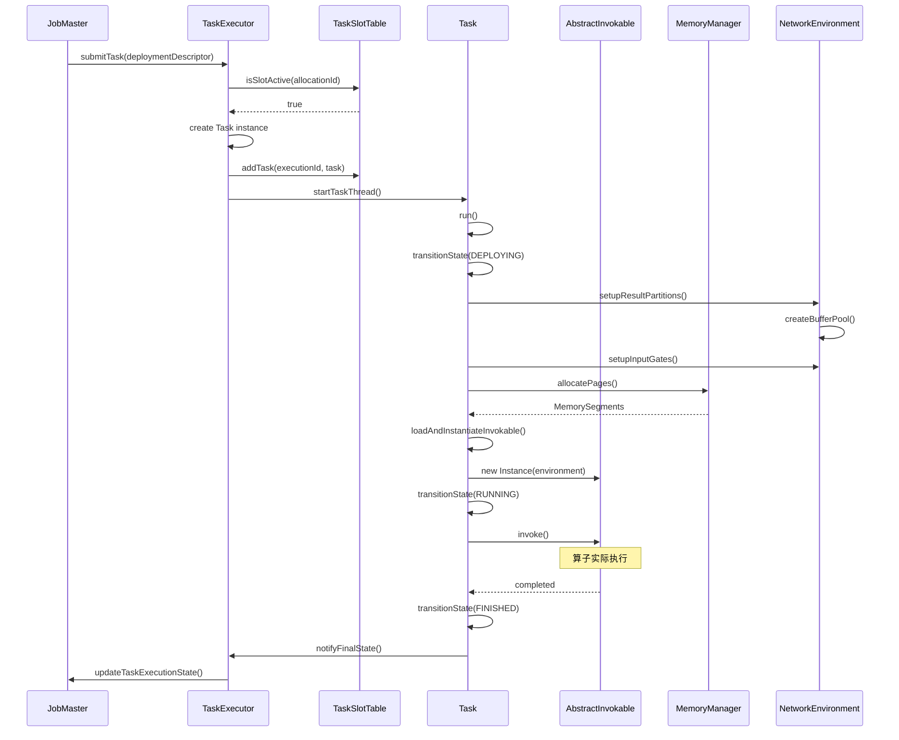
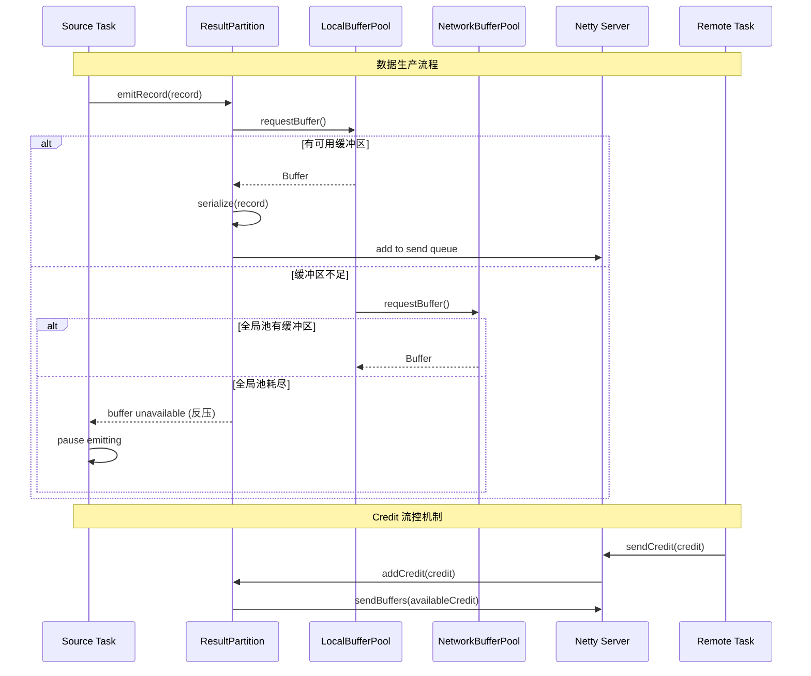
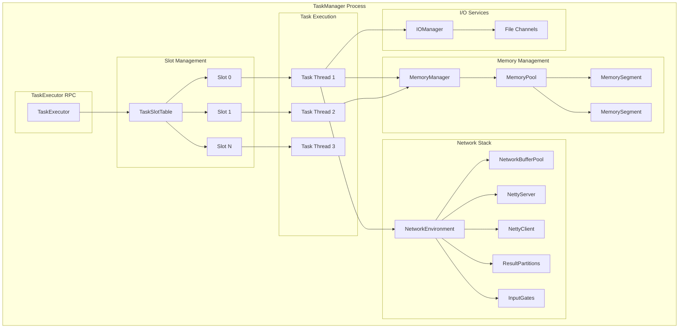
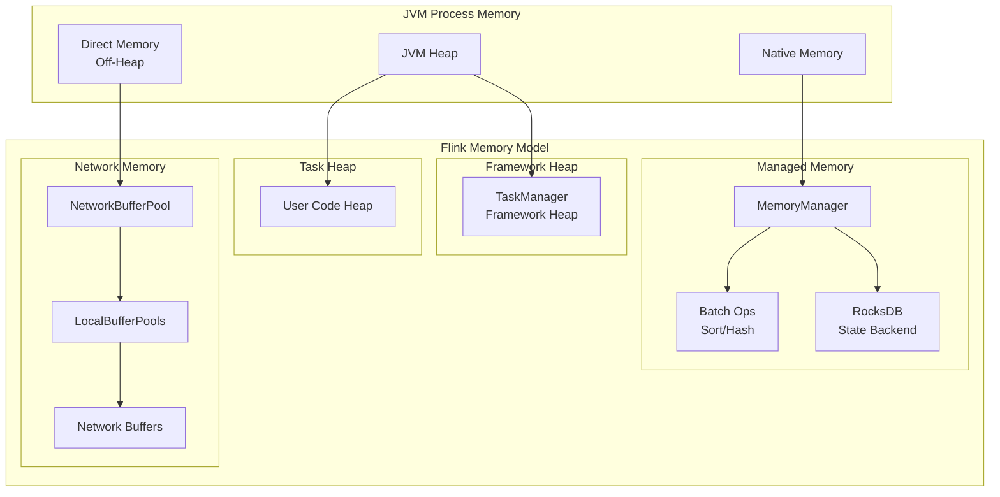

# TaskManager 深度源码分析

> 所属阶段: Knowledge/Flink-Scala-Rust-Comprehensive/src-analysis | 前置依赖: [Flink运行时架构](./flink-runtime-architecture.md) | 形式化等级: L4

---

## 1. 概览

### 1.1 模块职责

TaskManager (TM) 是 Flink 集群中的工作节点，负责：

1. **任务执行**: 接收并执行 JobManager 分配的具体任务
2. **资源管理**: 管理本地 CPU、内存和网络资源
3. **数据传输**: 通过 Netty 网络栈与其他 TaskManager 交换数据
4. **状态管理**: 维护算子状态和键值状态
5. **故障报告**: 向 JobManager 报告任务执行状态和异常

### 1.2 源码模块结构

```
flink-runtime/src/main/java/org/apache/flink/runtime/
├── taskexecutor/
│   ├── TaskExecutor.java           # TaskManager 核心入口
│   ├── TaskManagerRunner.java      # 启动器
│   └── TaskManagerServices.java    # 服务组装
├── taskmanager/
│   ├── Task.java                   # 单个任务执行实体
│   └── TaskManagerConfiguration.java
├── memory/
│   ├── MemoryManager.java          # 内存管理器
│   ├── MemoryPool.java             # 内存池
│   └── MemorySegment.java          # 内存段
└── io/network/
    ├── NetworkEnvironment.java     # 网络环境
    ├── netty/                      # Netty 集成
    └── partition/                  # 结果分区管理
```

---

## 2. 核心类分析

### 2.1 TaskExecutor - TaskManager 核心

**完整路径**: `org.apache.flink.runtime.taskexecutor.TaskExecutor`

**职责描述**:
TaskExecutor 是 TaskManager 的核心 RPC 组件，负责与 JobManager 通信、管理本地 slot 资源、执行具体的 Task。

**核心字段分析**:

```java
public class TaskExecutor extends RpcEndpoint
    implements TaskExecutorGateway, TaskManagerActions {

    // === 连接管理 ===

    // 当前连接的 ResourceManager
    private ResourceManagerConnection resourceManagerConnection;

    // 当前运行的任务 (JobID -> Task)
    private final Map<ExecutionAttemptID, Task> taskSlotTable;

    // === 本地资源 ===

    // Slot 表 - 管理本地 slot 分配
    private final TaskSlotTable<Task> taskSlotTable;

    // 作业管理器连接 (JobID -> JobManagerConnection)
    private final Map<JobID, JobManagerConnection> jobManagerConnections;

    // === 核心服务 ===

    // 内存管理器 - 管理堆外内存
    private final MemoryManager memoryManager;

    // IO 管理器 - 管理文件 IO 和临时文件
    private final IOManager ioManager;

    // 网络环境 - 管理网络连接和缓冲区
    private final NetworkEnvironment networkEnvironment;

    // 高可用服务
    private final HighAvailabilityServices haServices;

    // 心跳管理器
    private final HeartbeatManager<Void, Void> resourceManagerHeartbeatManager;
    private final HeartbeatManager<Void, Void> jobManagerHeartbeatManager;
}
```

**关键方法分析**:

#### 2.1.1 submitTask() - 任务提交核心

```java
@Override
public CompletableFuture<Acknowledge> submitTask(
        TaskDeploymentDescriptor tdd,
        JobMasterId jobMasterId,
        Time timeout) {

    final JobID jobId = tdd.getJobId();
    final ExecutionAttemptID executionAttemptId = tdd.getExecutionAttemptId();

    // 1. 预检查:验证 JobManager 连接和 slot 分配
    final JobManagerConnection jobManagerConnection =
        jobManagerConnections.get(jobId);

    if (jobManagerConnection == null) {
        throw new TaskSubmissionException(
            "No JobManager connected for job " + jobId);
    }

    // 2. 验证 slot 分配
    final AllocationID allocationId = tdd.getAllocationId();
    if (!taskSlotTable.isSlotActive(allocationId)) {
        throw new SlotNotActiveException(
            "Slot " + allocationId + " is not active");
    }

    // 3. 反序列化任务信息
    final JobInformation jobInformation = tdd.getJobInformation();
    final TaskInformation taskInformation = tdd.getTaskInformation();

    // 4. 准备执行配置
    TaskMetricGroup taskMetricGroup = taskManagerMetricGroup
        .addTaskForJob(
            jobId,
            taskInformation.getJobVertexId(),
            executionAttemptId,
            taskInformation.getTaskName(),
            tdd.getSubtaskIndex(),
            tdd.getAttemptNumber()
        );

    // 5. 创建 Task 实例 - 这是真正的执行单元
    Task task = new Task(
        jobInformation,
        taskInformation,
        executionAttemptId,
        allocationId,
        tdd.getSubtaskIndex(),
        tdd.getAttemptNumber(),
        tdd.getProducedPartitions(),
        tdd.getInputGates(),
        tdd.getTargetSlotNumber(),
        memoryManager,
        ioManager,
        networkEnvironment,
        taskManagerConfiguration,
        taskMetricGroup,
        resultPartitionConsumableNotifier,
        partitionStateChecker,
        getRpcService().getExecutor(),
        userCodeClassLoader,
        killedTasksRegistry
    );

    // 6. 添加到任务表并启动
    boolean added = taskSlotTable.addTask(executionAttemptId, task);
    if (!added) {
        throw new TaskSubmissionException(
            "Task with attempt ID " + executionAttemptId + " already exists");
    }

    // 7. 异步启动任务
    task.startTaskThread();

    return CompletableFuture.completedFuture(Acknowledge.get());
}
```

#### 2.1.2 freeSlot() - Slot 释放与资源回收

```java
@Override
public CompletableFuture<Acknowledge> freeSlot(
        AllocationID allocationId,
        Throwable cause,
        Time timeout) {

    // 1. 查找对应的 Task
    final Task task = taskSlotTable.removeTask(allocationId);

    if (task != null) {
        // 2. 标记任务失败
        task.failExternally(new CancelTaskException(
            "Slot " + allocationId + " is being freed", cause));
    }

    // 3. 释放 slot 资源
    final FlinkException slotReleaseException = cause != null
        ? new FlinkException("Slot released", cause)
        : new FlinkException("Slot released");

    // 4. 通知 ResourceManager
    resourceManagerGateway.notifySlotAvailable(
        getResourceID(),
        new SlotID(getResourceID(), slotNumber),
        allocationId
    );

    // 5. 清理本地状态
    taskSlotTable.freeSlot(allocationId);

    return CompletableFuture.completedFuture(Acknowledge.get());
}
```

---

### 2.2 Task - 任务执行实体

**完整路径**: `org.apache.flink.runtime.taskmanager.Task`

**职责描述**:
Task 是 Flink 中最细粒度的执行单元，封装了单个算子子任务的完整生命周期。每个 Task 运行在独立的线程中。

**状态机设计**:

```java
public enum ExecutionState {
    CREATED,           // 初始创建
    SCHEDULED,         // 已调度,等待资源
    DEPLOYING,         // 正在部署
    RUNNING,           // 正常运行
    FINISHED,          // 成功完成
    CANCELING,         // 正在取消
    CANCELED,          // 已取消
    FAILED,            // 执行失败
    RECONCILING        // 状态恢复中 (用于故障恢复)
}
```

**核心实现**:

```java
public class Task implements Runnable {

    // === 执行上下文 ===

    private final JobID jobId;
    private final ExecutionAttemptID executionId;
    private final AllocationID allocationId;

    // 任务配置信息
    private final TaskInfo taskInfo;
    private final Configuration taskConfiguration;

    // === 运行时组件 ===

    // 结果分区 - 输出数据
    private final Map<IntermediateDataSetID, ResultPartition>
        producedPartitions;

    // 输入门 - 接收上游数据
    private final Map<IntermediateDataSetID, InputGate>
        inputGates;

    // 运行时环境
    private Environment environment;
    private AbstractInvokable invokable;

    // === 线程与同步 ===

    // 执行线程
    private Thread executingThread;

    // 状态锁 - 保护执行状态转换
    private final Object lock = new Object();

    // 当前执行状态
    private volatile ExecutionState executionState = ExecutionState.CREATED;

    // 失败原因
    private volatile Throwable failureCause;

    // === 启动任务 ===

    void startTaskThread() {
        // 状态检查
        if (executionState != ExecutionState.CREATED) {
            throw new IllegalStateException(
                "Task must be in CREATED state to start");
        }

        // 创建并启动执行线程
        executingThread = new Thread(TASK_THREADS_GROUP, this,
            "Flink Task Thread: " + taskNameWithSubtask);
        executingThread.setDaemon(true);
        executingThread.start();
    }

    // === 主执行循环 ===

    @Override
    public void run() {
        try {
            // 1. 状态转换: DEPLOYING
            transitionState(ExecutionState.DEPLOYING, null);

            // 2. 用户代码类加载
            ClassLoader userCodeClassLoader = createUserCodeClassloader();

            // 3. 初始化结果分区 (输出)
            setupResultPartitions();

            // 4. 初始化输入门 (输入)
            setupInputGates();

            // 5. 创建 RuntimeEnvironment
            this.environment = new RuntimeEnvironment(
                this,
                taskConfiguration,
                taskInfo,
                userCodeClassLoader,
                memoryManager,
                ioManager,
                producedPartitions,
                inputGates,
                metrics
            );

            // 6. 实例化算子 (AbstractInvokable)
            this.invokable = loadAndInstantiateInvokable(
                userCodeClassLoader,
                taskConfiguration
            );

            // 7. 状态转换: RUNNING
            transitionState(ExecutionState.RUNNING, null);

            // 8. 执行算子主逻辑 - 这是真正的计算发生处
            invokable.invoke();

            // 9. 正常完成
            if (executionState == ExecutionState.RUNNING) {
                transitionState(ExecutionState.FINISHED, null);
            }

        } catch (Throwable t) {
            // 失败处理
            handleExecutionError(t);
        } finally {
            // 清理资源
            cleanup();
        }
    }

    // === 算子加载 ===

    private AbstractInvokable loadAndInstantiateInvokable(
            ClassLoader classLoader,
            Configuration config) throws Exception {

        // 从配置中获取算子类名
        final String invokableClassName = config.getString(
            ConfigConstants.TASK_CLASS, null);

        // 加载类
        final Class<? extends AbstractInvokable> invokableClass =
            Class.forName(invokableClassName, true, classLoader)
                .asSubclass(AbstractInvokable.class);

        // 实例化
        final Constructor<? extends AbstractInvokable> constructor =
            invokableClass.getConstructor(Environment.class);

        return constructor.newInstance(environment);
    }
}
```

---

### 2.3 MemoryManager - 内存管理器

**完整路径**: `org.apache.flink.runtime.memory.MemoryManager`

**职责描述**:
MemoryManager 是 Flink 内存管理的核心，负责堆外内存(Off-Heap)的分配和回收，主要用于：

- 批处理排序、哈希表的内存缓冲区
- 流处理的 RocksDB 状态后端内存
- 网络缓冲区的管理

**核心实现**:

```java
public class MemoryManager {

    // === 内存池 ===

    // 内存段集合 - 实际存储的数据结构
    private final Set<MemorySegment> availableMemory;

    // 已分配内存的跟踪 (Owner -> allocated segments)
    private final Map<Object, Set<MemorySegment>> allocatedSegments;

    // === 配置参数 ===

    // 总内存大小
    private final long totalSize;

    // 单个内存段大小 (默认 32KB)
    private final int segmentSize;

    // 内存类型:HEAP 或 OFF_HEAP
    private final MemoryType memoryType;

    // === 核心方法 ===

    /**
     * 申请内存页
     * @param owner 内存所有者 (用于垃圾回收跟踪)
     * @param numPages 申请的页数
     */
    public List<MemorySegment> allocatePages(
            Object owner,
            int numPages) throws MemoryAllocationException {

        final List<MemorySegment> segments = new ArrayList<>(numPages);

        synchronized (lock) {
            // 检查可用内存是否充足
            if (availableMemory.size() < numPages) {
                throw new MemoryAllocationException(
                    "Not enough memory available");
            }

            // 分配内存段
            final Iterator<MemorySegment> iterator =
                availableMemory.iterator();

            for (int i = 0; i < numPages; i++) {
                MemorySegment segment = iterator.next();
                iterator.remove();

                // 初始化内存 (清零)
                segment.free();

                segments.add(segment);
            }

            // 记录分配
            allocatedSegments.computeIfAbsent(owner, k -> new HashSet<>())
                .addAll(segments);

            // 更新统计
            reservedMemory += (long) numPages * segmentSize;
        }

        return segments;
    }

    /**
     * 释放内存页
     */
    public void release(List<MemorySegment> segments) {
        synchronized (lock) {
            for (MemorySegment segment : segments) {
                // 验证段所有权
                Object owner = segment.getOwner();
                Set<MemorySegment> ownerSegments =
                    allocatedSegments.get(owner);

                if (ownerSegments != null && ownerSegments.remove(segment)) {
                    // 归还到可用池
                    segment.free();
                    availableMemory.add(segment);
                    reservedMemory -= segmentSize;
                }
            }
        }
    }

    /**
     * 申请非分页的连续内存 (用于特定场景)
     */
    public MemorySegment allocateUnpooledSegment(int size, Object owner) {
        // 直接分配新的内存段,不进入池管理
        return allocateSegment(size, owner, true);
    }
}

// MemorySegment - 内存段封装
public final class MemorySegment {

    // 堆内存或堆外内存的引用
    private final byte[] heapMemory;
    private final long address;

    // 内存段大小
    private final int size;

    // 所有者引用 (用于 GC 跟踪)
    private Object owner;

    // === 内存访问方法 ===

    public byte get(int index) {
        // UNSAFE 直接内存访问
        return UNSAFE.getByte(address + index);
    }

    public void put(int index, byte b) {
        UNSAFE.putByte(address + index, b);
    }

    public int getInt(int index) {
        return UNSAFE.getInt(address + index);
    }

    public void putInt(int index, int value) {
        UNSAFE.putInt(address + index, value);
    }

    // ... 其他数据类型的读写方法
}
```

---

### 2.4 NetworkEnvironment - 网络环境

**完整路径**: `org.apache.flink.runtime.io.network.NetworkEnvironment`

**职责描述**:
NetworkEnvironment 管理 TaskManager 的所有网络相关资源，包括网络缓冲区、连接管理器和分区管理。

**核心组件**:

```java
public class NetworkEnvironment {

    // === 网络缓冲区 ===

    // 网络缓冲区池 - 用于数据传输
    private final NetworkBufferPool networkBufferPool;

    // 连接管理器 - 管理与其他 TaskManager 的连接
    private final ConnectionManager connectionManager;

    // === 结果分区管理 ===

    // 结果分区管理器 - 管理本地产生的数据分区
    private final ResultPartitionManager resultPartitionManager;

    // === 输入门管理 ===

    // 输入门管理器 - 管理远程数据消费
    private final InputGateMetricsReporter inputGateMetricsReporter;

    // === Netty 集成 ===

    // Netty 服务器 - 接收数据请求
    private final NettyServer nettyServer;

    // Netty 客户端 - 发起数据请求
    private final NettyClient nettyClient;
}
```

**NetworkBufferPool 实现**:

```java
public class NetworkBufferPool {

    // 总缓冲区数量
    private final int totalNumberOfMemorySegments;

    // 每个缓冲区大小 (默认 32KB)
    private final int memorySegmentSize;

    // 可用缓冲区队列
    private final ArrayDeque<MemorySegment> availableMemorySegments;

    // 本地缓冲区池列表 (每个 ResultPartition/InputGate 一个)
    private final List<BufferPool> bufferPools = new ArrayList<>();

    // === 缓冲区分配 ===

    public BufferPool createBufferPool(
            int numRequiredBuffers,
            int maxUsedBuffers) throws IOException {

        synchronized (availableMemorySegments) {
            // 检查是否有足够的缓冲区
            if (availableMemorySegments.size() < numRequiredBuffers) {
                throw new IOException("Insufficient number of network buffers");
            }

            // 创建本地缓冲区池
            LocalBufferPool localBufferPool = new LocalBufferPool(
                this,
                numRequiredBuffers,
                maxUsedBuffers
            );

            // 预分配必需缓冲区
            List<MemorySegment> segments = new ArrayList<>(numRequiredBuffers);
            for (int i = 0; i < numRequiredBuffers; i++) {
                segments.add(availableMemorySegments.poll());
            }
            localBufferPool.setNumResidentBuffers(segments);

            bufferPools.add(localBufferPool);
            return localBufferPool;
        }
    }

    // === 缓冲区回收 ===

    public void recycle(MemorySegment segment) {
        synchronized (availableMemorySegments) {
            availableMemorySegments.add(segment);
        }
    }
}
```

---

## 3. 调用链分析

### 3.1 任务启动时序图



### 3.2 Credit-Based 流控集成



---

## 4. 关键算法实现

### 4.1 任务状态机转换

```java
public class Task {

    // 状态转换核心逻辑
    private boolean transitionState(
            ExecutionState currentState,
            ExecutionState newState,
            Throwable cause) {

        synchronized (lock) {
            // 验证状态转换的合法性
            if (currentState != executionState) {
                return false;  // 当前状态不匹配
            }

            // 验证状态转换规则
            boolean validTransition = isValidStateTransition(
                currentState, newState);

            if (!validTransition) {
                throw new IllegalStateException(
                    "Invalid state transition from " + currentState +
                    " to " + newState);
            }

            // 执行状态转换
            this.executionState = newState;

            // 记录失败原因
            if (cause != null) {
                this.failureCause = cause;
            }

            // 通知状态监听器
            notifyListeners(executionState, newState, cause);

            return true;
        }
    }

    // 有效状态转换定义
    private boolean isValidStateTransition(
            ExecutionState from, ExecutionState to) {
        switch (from) {
            case CREATED:
                return to == ExecutionState.SCHEDULED ||
                       to == ExecutionState.CANCELING ||
                       to == ExecutionState.FAILED;
            case SCHEDULED:
                return to == ExecutionState.DEPLOYING ||
                       to == ExecutionState.CANCELING ||
                       to == ExecutionState.FAILED;
            case DEPLOYING:
                return to == ExecutionState.RUNNING ||
                       to == ExecutionState.CANCELING ||
                       to == ExecutionState.FAILED;
            case RUNNING:
                return to == ExecutionState.FINISHED ||
                       to == ExecutionState.CANCELING ||
                       to == ExecutionState.FAILED;
            case CANCELING:
                return to == ExecutionState.CANCELED ||
                       to == ExecutionState.FAILED;
            default:
                return false;
        }
    }
}
```

### 4.2 内存页分配策略

```java
import java.time.Duration;

public class MemoryManager {

    /**
     * 带超时的内存分配
     */
    public List<MemorySegment> allocatePages(
            Object owner,
            int numPages,
            Duration timeout) throws MemoryAllocationException {

        final long deadline = System.nanoTime() + timeout.toNanos();
        final List<MemorySegment> segments = new ArrayList<>(numPages);
        int remainingPages = numPages;

        while (remainingPages > 0) {
            synchronized (lock) {
                // 尝试分配尽可能多的页面
                int toAllocate = Math.min(
                    remainingPages,
                    availableMemory.size()
                );

                for (int i = 0; i < toAllocate; i++) {
                    MemorySegment segment = availableMemory.poll();
                    segment.free();
                    segment.setOwner(owner);
                    segments.add(segment);
                }

                remainingPages -= toAllocate;
                reservedMemory += (long) toAllocate * segmentSize;

                // 如果已满足,立即返回
                if (remainingPages == 0) {
                    return segments;
                }

                // 计算剩余等待时间
                long remainingNanos = deadline - System.nanoTime();
                if (remainingNanos <= 0) {
                    // 超时,回滚已分配
                    release(segments);
                    throw new MemoryAllocationException(
                        "Timeout waiting for memory");
                }

                try {
                    // 等待其他任务释放内存
                    lock.wait(remainingNanos / 1_000_000);
                } catch (InterruptedException e) {
                    release(segments);
                    Thread.currentThread().interrupt();
                    throw new MemoryAllocationException(
                        "Interrupted while allocating memory", e);
                }
            }
        }

        return segments;
    }

    /**
     * 垃圾回收风格的内存清理
     */
    public void cleanUpGarbageCollectedObjects() {
        synchronized (lock) {
            Iterator<Map.Entry<Object, Set<MemorySegment>>> iter =
                allocatedSegments.entrySet().iterator();

            while (iter.hasNext()) {
                Map.Entry<Object, Set<MemorySegment>> entry = iter.next();
                Object owner = entry.getKey();

                // 检查所有者是否已被 GC
                if (isGarbageCollected(owner)) {
                    // 回收其所有内存段
                    Set<MemorySegment> segments = entry.getValue();
                    for (MemorySegment segment : segments) {
                        segment.free();
                        availableMemory.add(segment);
                    }
                    reservedMemory -= (long) segments.size() * segmentSize;
                    iter.remove();

                    LOG.warn("Found leaked memory segments from " + owner);
                }
            }
        }
    }
}
```

---

## 5. 版本演进

### 5.1 Flink 1.10: 统一内存配置

**变更内容**:

- 引入统一的内存配置模型
- 明确划分托管内存(Managed Memory)和网络内存(Network Memory)
- 支持细粒度的内存类别配置

**配置对比**:

```yaml
# 1.9 及之前 (模糊配置)
taskmanager.memory.size: 1024m
taskmanager.memory.fraction: 0.7

# 1.10+ (精确配置)
taskmanager.memory.process.size: 4096m
taskmanager.memory.flink.size: 3072m
taskmanager.memory.managed.size: 1536m
taskmanager.memory.network.min: 128m
taskmanager.memory.network.max: 256m
```

### 5.2 Flink 1.14: 堆外内存优化

**变更内容**:

- RocksDB 状态后端使用托管内存
- 减少 JVM 垃圾回收压力
- 引入自动内存调整

```java
import org.apache.flink.configuration.Configuration;

// 1.14+ 自动化的 RocksDB 内存管理
public class RocksDBStateBackend {

    @Override
    public void configureStateBackend(
            Configuration config,
            MemoryManager memoryManager) {

        // 从 MemoryManager 获取固定大小的内存预算
        long memoryLimit = memoryManager.computeMemorySize(
            getMemoryFraction(config));

        // 配置 RocksDB 内存限制
        this.rocksDBMemoryController = new RocksDBMemoryController(
            memoryLimit,
            memoryManager  // 用于 GC 时通知
        );
    }
}
```

### 5.3 Flink 1.17: 细粒度资源管理

**变更内容**:

- 支持细粒度 Slot 资源申请 (基于 ResourceProfile)
- TaskManager 内多 Slot 隔离优化
- 更精确的资源匹配策略

```java
// 细粒度 Slot 资源管理
public class FineGrainedSlotManager {

    public boolean allocateSlot(
            ResourceProfile requestedProfile,
            AllocationID allocationId) {

        // 寻找最匹配的 TaskManager
        for (TaskManagerRegistration tm : registeredTaskManagers) {
            ResourceProfile available = tm.getAvailableResource();

            // 精确匹配资源需求
            if (available.isMatching(requestedProfile)) {
                tm.allocateSlot(requestedProfile, allocationId);
                return true;
            }
        }
        return false;
    }
}
```

### 5.4 Flink 2.0: 轻量级 TaskManager

**预期变更**:

- 更小的内存 footprint
- 更快的启动时间
- 更好的与 Kubernetes 集成

---

## 6. 性能考量

### 6.1 网络缓冲区调优

**配置建议**:

```yaml
# flink-conf.yaml

# 网络缓冲区数量计算
# 公式: 4 * 并行度^2 (每个任务通信链需要4个缓冲区)
taskmanager.memory.network.number-of-buffers: 2048

# 或自动计算 (推荐)
taskmanager.memory.network.min: 256m
taskmanager.memory.network.max: 512m

# 缓冲区大小 (默认 32KB,大数据场景可增大)
taskmanager.memory.segment-size: 32768
```

**背压诊断**:

```java
// 监控网络缓冲区使用率
public class NetworkMetrics {

    @VisibleForTesting
    public void reportBufferUsage() {
        int availableBuffers = networkBufferPool.getNumberOfAvailableMemorySegments();
        int totalBuffers = networkBufferPool.getTotalNumberOfBuffers();
        double usage = 1.0 - (double) availableBuffers / totalBuffers;

        if (usage > 0.9) {
            LOG.warn("High network buffer usage: {}%", usage * 100);
            // 触发背压检查
        }
    }
}
```

### 6.2 内存分配优化

**问题**: 大规模排序操作导致频繁的内存分配/释放

**优化策略**:

```java
// 使用预分配的内存页池
public class Sorter {

    private final MemoryManager memoryManager;
    private final List<MemorySegment> sortMemory;

    public Sorter(MemoryManager mm, int numPages) {
        this.memoryManager = mm;
        // 预分配排序所需内存
        this.sortMemory = mm.allocatePages(this, numPages);
    }

    public void sort() {
        // 使用预分配内存,避免运行时分配
        // ... 排序逻辑
    }

    public void close() {
        // 统一释放,而非逐页释放
        memoryManager.release(sortMemory);
    }
}
```

### 6.3 Task 线程模型

**最佳实践**:

- 每个 Task 运行在独立线程
- 避免 Task 内创建额外线程池
- 使用 Flink 的托管内存替代堆内存

---

## 7. 可视化

### 7.1 TaskManager 内部架构



### 7.2 内存管理层次图



---

## 8. 引用参考
