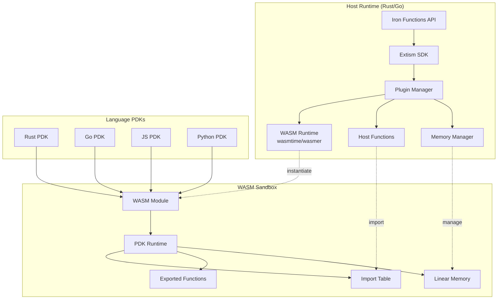
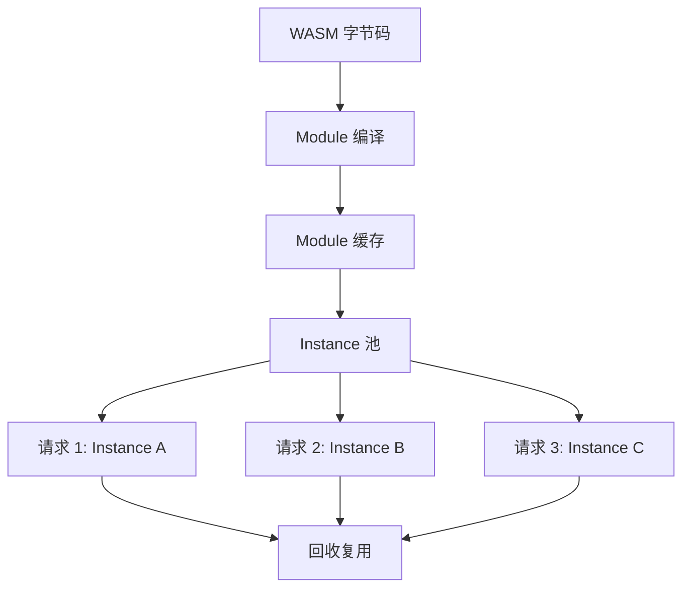
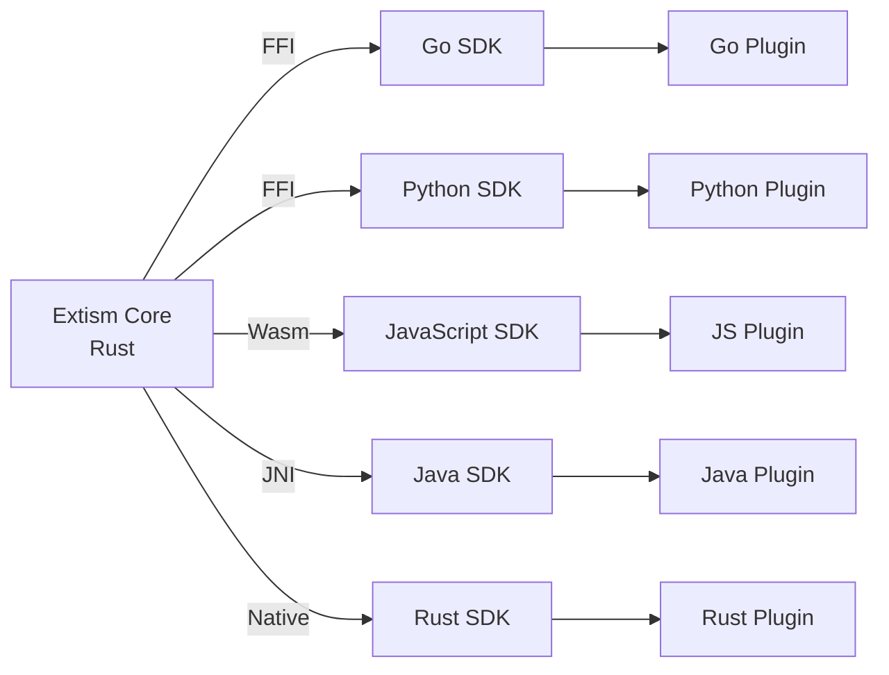
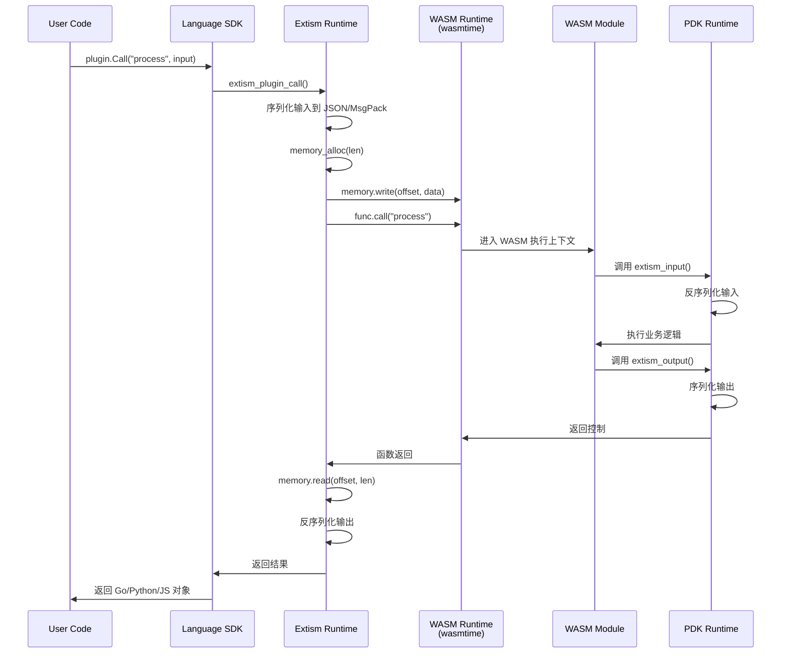
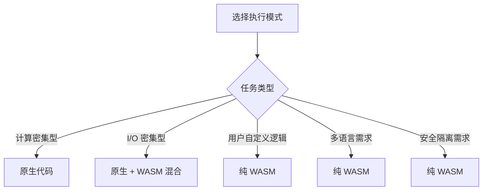
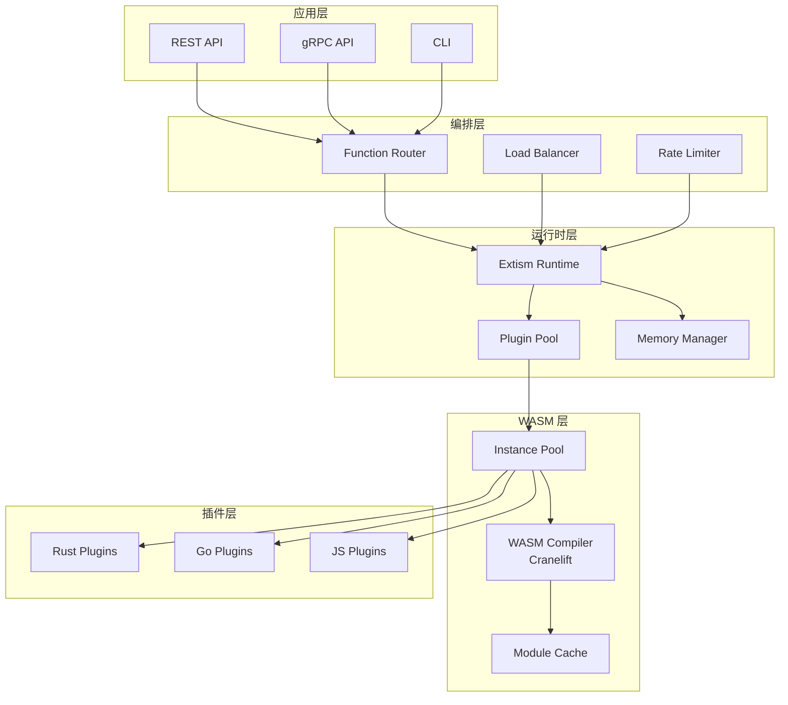
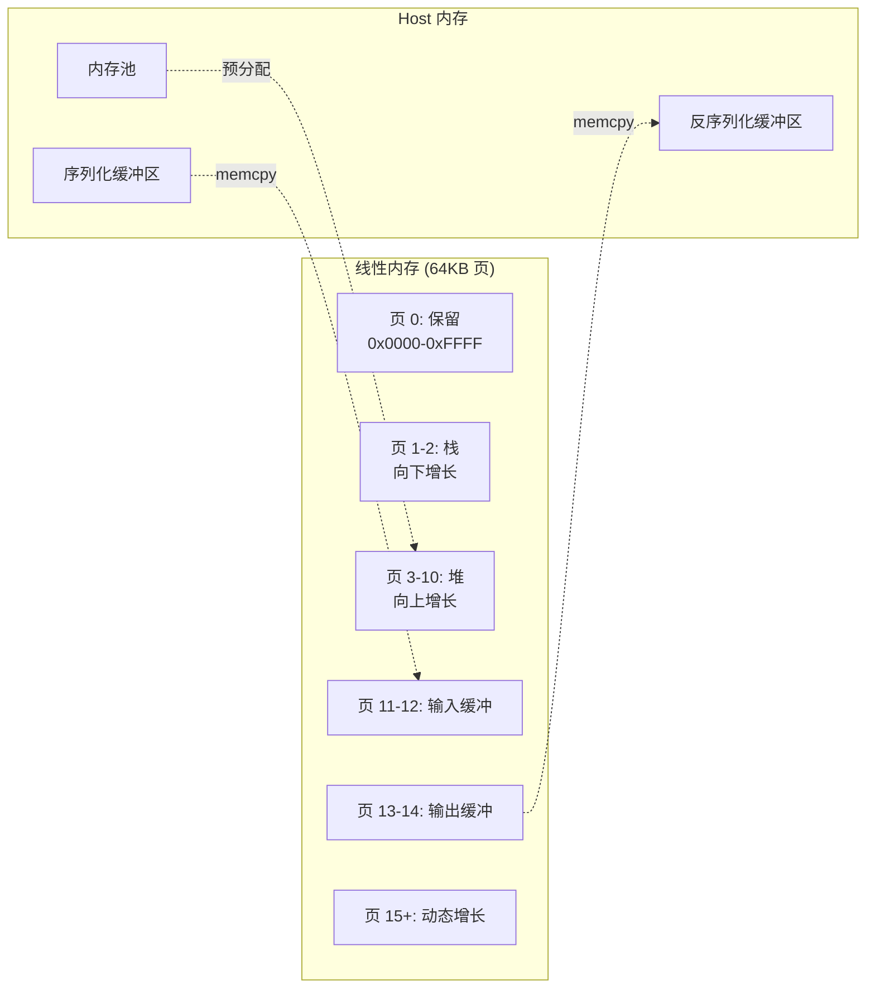

# Iron Functions WASM 运行时源码深度分析

> 所属阶段: Knowledge/Flink-Scala-Rust-Comprehensive/src-analysis/ | 前置依赖: [WASM 基础架构](../../../Flink/05-ecosystem/05.03-wasm-udf/wasm-streaming.md) | 形式化等级: L4

## 1. 架构概览

Iron Functions 是基于 Extism WASM 框架构建的多语言函数运行时，其核心架构实现了 Host-Plugin 模式的轻量级隔离执行环境。



### 1.1 核心设计哲学

Iron Functions 采用 **共享无状态（Shared-Nothing）** 架构，每个函数调用都在独立的 WASM 实例中执行：

1. **隔离性**: 每个 Plugin 拥有独立的线性内存空间
2. **轻量性**: WASM 模块启动时间 < 1ms，内存占用 < 5MB
3. **多语言**: 通过 PDK 支持 15+ 编程语言
4. **可移植**: 一次编译，到处运行（跨平台、跨架构）

---

## 2. 核心组件分析

### 2.1 Extism PDK 集成 (crates/extism/)

**源码位置**: `github.com/extism/extism/crates/extism/src/`

#### 2.1.1 设计目标

Extism PDK（Plugin Development Kit）的设计目标是提供 **零样板代码** 的 Host-Plugin 通信机制：

```rust
// crates/extism/src/plugin.rs (简化示意)
pub struct Plugin {
    /// WASM 运行时实例
    instance: Instance,
    /// 线性内存引用
    memory: Memory,
    /// 导出函数缓存
    exports: HashMap<String, Func>,
    /// 主机函数表
    host_functions: Vec<HostFunction>,
    /// WASI 上下文（可选）
    wasi: Option<WasiCtx>,
}
```

#### 2.1.2 关键实现细节

**Plugin 初始化流程**:

```rust
// crates/extism/src/plugin.rs
impl Plugin {
    pub fn new(
        engine: &Engine,
        wasm: &[u8],
        host_functions: &[HostFunction],
        wasi: bool,
    ) -> Result<Self, Error> {
        // 1. 编译 WASM 模块
        let module = Module::new(engine, wasm)?;

        // 2. 创建 Store（存储 WASM 实例状态）
        let mut store = Store::new(engine, ());

        // 3. 注册主机函数到导入表
        let mut imports = vec![];
        for hf in host_functions {
            imports.push(hf.to_extern(&mut store)?);
        }

        // 4. 实例化 WASM 模块
        let instance = Instance::new(&mut store, &module, &imports)?;

        // 5. 获取线性内存引用
        let memory = instance
            .get_memory(&mut store, "memory")
            .ok_or(Error::MemoryNotFound)?;

        Ok(Self {
            instance,
            memory,
            exports: Self::cache_exports(&instance, &mut store)?,
            host_functions: host_functions.to_vec(),
            wasi: None,
        })
    }
}
```

**关键源码分析**:

- **`Module::new()`**: 将 WASM 字节码编译为内部表示（IR），启用 Cranelift 编译器进行 JIT 编译
- **`Store`**: 存储 WASM 实例的所有可变状态，包括内存、全局变量、表等
- **`Instance::new()`**: 创建 WASM 实例，解析导入表并链接到主机函数

#### 2.1.3 代码片段：PDK 宏展开

Rust PDK 使用宏简化插件开发：

```rust
// extism-pdk/src/macros.rs
#[macro_export]
macro_rules! plugin_fn {
    ($name:ident) => {
        #[no_mangle]
        pub unsafe extern "C" fn $name() -> i32 {
            // 自动处理输入/输出序列化
            let input = $crate::input::<Input>().unwrap();
            let output = $name_inner(input);
            $crate::output(&output).unwrap();
            0 // 成功返回码
        }
    };
}

// 使用示例：用户定义的函数
#[plugin_fn]
pub fn process(input: Json<Input>) -> FnResult<Json<Output>> {
    // 业务逻辑
    Ok(Json(Output { result: input.value * 2 }))
}
```

**宏展开后的实际代码**:

```rust
// 编译器展开结果
#[no_mangle]
pub unsafe extern "C" fn process() -> i32 {
    // 1. 从 Host 读取输入（通过 extism:host/input 导入函数）
    let input_bytes = extism_input();
    let input: Input = serde_json::from_slice(&input_bytes).unwrap();

    // 2. 调用用户逻辑
    let result = match process_inner(Json(input)) {
        Ok(Json(output)) => output,
        Err(e) => return extism_set_error(&e.to_string()),
    };

    // 3. 序列化输出并返回给 Host
    let output_bytes = serde_json::to_vec(&result).unwrap();
    extism_output(&output_bytes);
    0
}
```

---

### 2.2 WASM 模块生命周期管理

**源码位置**: `crates/extism/src/runtime.rs`

#### 2.2.1 设计目标

实现高效的模块复用与实例隔离平衡：



#### 2.2.2 关键实现细节

**Module 缓存机制**:

```rust
// crates/extism/src/runtime.rs
pub struct Runtime {
    /// WASM 引擎（全局单例）
    engine: Engine,
    /// 编译后的模块缓存（URL -> Module）
    module_cache: Arc<RwLock<HashMap<String, Module>>>,
    /// 实例池配置
    pool_config: PoolConfig,
}

impl Runtime {
    /// 获取或编译模块
    pub fn get_module(&self, key: &str, wasm: &[u8]) -> Result<Module, Error> {
        // 1. 检查缓存
        if let Some(module) = self.module_cache.read().unwrap().get(key) {
            return Ok(module.clone());
        }

        // 2. 编译新模块
        let module = Module::new(&self.engine, wasm)?;

        // 3. 存入缓存
        self.module_cache
            .write()
            .unwrap()
            .insert(key.to_string(), module.clone());

        Ok(module)
    }
}
```

**性能优化分析**:

| 阶段 | 耗时 | 优化策略 |
|------|------|----------|
| Module 编译 | 50-500ms | 缓存编译结果，避免重复编译 |
| Instance 创建 | 0.1-1ms | 预分配实例池，复用内存 |
| 函数调用 | 0.01-0.1ms | 内联导出函数，减少查找开销 |

#### 2.2.3 代码片段：实例池实现

```rust
// crates/extism/src/pool.rs
pub struct PluginPool {
    /// 基础模块（用于快速克隆实例）
    base_module: Module,
    /// 空闲实例队列
    idle_instances: ArrayQueue<Plugin>,
    /// 最大实例数
    max_size: usize,
    /// 当前实例数
    current_size: AtomicUsize,
}

impl PluginPool {
    /// 获取实例（从池或新建）
    pub fn acquire(&self) -> Result<PooledPlugin, Error> {
        // 1. 尝试从空闲队列获取
        if let Some(plugin) = self.idle_instances.pop() {
            return Ok(PooledPlugin {
                plugin: Some(plugin),
                pool: self,
            });
        }

        // 2. 检查是否超过最大限制
        let current = self.current_size.fetch_add(1, Ordering::SeqCst);
        if current >= self.max_size {
            self.current_size.fetch_sub(1, Ordering::SeqCst);
            return Err(Error::PoolExhausted);
        }

        // 3. 创建新实例
        let plugin = Plugin::new_from_module(&self.base_module)?;
        Ok(PooledPlugin {
            plugin: Some(plugin),
            pool: self,
        })
    }

    /// 回收实例到池中
    pub fn release(&self, mut plugin: Plugin) {
        // 重置实例状态（清空内存、重置全局变量）
        plugin.reset();

        // 尝试放回空闲队列
        if self.idle_instances.push(plugin).is_err() {
            // 队列满，丢弃实例
            self.current_size.fetch_sub(1, Ordering::SeqCst);
        }
    }
}
```

---

### 2.3 Host Function 实现

**源码位置**: `crates/extism/src/host_fn.rs`

#### 2.3.1 设计目标

提供安全的双向调用机制，允许 WASM 调用 Host 提供的系统能力：

```rust
// 主机函数类型定义
pub type HostFunctionImpl = Box<
    dyn Fn(&mut CurrentPlugin, &[Val], &mut [Val]) -> Result<(), Error> + Send + Sync
>;

pub struct HostFunction {
    /// 函数名称（WASM 中可见）
    name: String,
    /// 参数类型
    params: Vec<ValType>,
    /// 返回类型
    results: Vec<ValType>,
    /// 实现闭包
    implementation: HostFunctionImpl,
}
```

#### 2.3.2 关键实现细节

**HTTP 请求 Host 函数示例**:

```rust
// crates/extism/src/functions/http.rs
pub fn http_request(
    plugin: &mut CurrentPlugin,
    inputs: &[Val],
    outputs: &mut [Val],
) -> Result<(), Error> {
    // 1. 从线性内存读取请求参数
    let req_ptr = inputs[0].i32() as usize;
    let req_len = inputs[1].i32() as usize;
    let req_bytes = plugin.memory_read(req_ptr, req_len)?;

    // 2. 反序列化请求
    let request: HttpRequest = serde_json::from_slice(&req_bytes)?;

    // 3. 执行 HTTP 请求（Host 侧）
    let response = blocking_http_call(request)?;

    // 4. 序列化响应并写入线性内存
    let resp_bytes = serde_json::to_vec(&response)?;
    let resp_ptr = plugin.memory_alloc(resp_bytes.len())?;
    plugin.memory_write(resp_ptr, &resp_bytes)?;

    // 5. 返回指针和长度
    outputs[0] = Val::I32(resp_ptr as i32);
    outputs[1] = Val::I32(resp_bytes.len() as i32);
    Ok(())
}
```

**安全隔离机制**:

```rust
// 内存访问安全检查
impl CurrentPlugin {
    pub fn memory_read(&self, offset: usize, len: usize) -> Result<Vec<u8>, Error> {
        let memory = self.memory();
        let data = memory.data(&self.store);

        // 边界检查
        if offset + len > data.len() {
            return Err(Error::MemoryOutOfBounds);
        }

        Ok(data[offset..offset + len].to_vec())
    }

    pub fn memory_alloc(&mut self, len: usize) -> Result<usize, Error> {
        // 调用 WASM 侧的 malloc 函数（如果存在）
        if let Some(malloc) = self.get_func("malloc") {
            let mut results = [Val::I32(0)];
            malloc.call(&mut self.store, &[Val::I32(len as i32)], &mut results)?;
            Ok(results[0].i32() as usize)
        } else {
            // 使用内置分配器
            self.internal_alloc(len)
        }
    }
}
```

---

### 2.4 内存管理（线性内存映射）

**源码位置**: `crates/extism/src/memory.rs`

#### 2.4.1 设计目标

实现高效、安全的 Host-Plugin 数据传输：

```rust
// 线性内存布局
// ┌─────────────────────────────────────────────────────────────┐
// │  0x0000  │  保留区域（NULL 指针保护）                        │
// ├─────────────────────────────────────────────────────────────┤
// │  0x0010  │  栈区（Stack）- 向下增长                          │
// │          │  ...                                              │
// ├─────────────────────────────────────────────────────────────┤
// │  0x4000  │  堆区（Heap）- 向上增长                           │
// │          │  ...                                              │
// ├─────────────────────────────────────────────────────────────┤
// │  0x8000  │  输入缓冲区（Host -> Plugin）                      │
// ├─────────────────────────────────────────────────────────────┤
// │  0xC000  │  输出缓冲区（Plugin -> Host）                      │
// └─────────────────────────────────────────────────────────────┘
// 每页 64KB，默认最小 2 页（128KB）
```

#### 2.4.2 关键实现细节

**MemoryBlock 管理**:

```rust
// crates/extism/src/memory.rs
pub struct MemoryBlock {
    /// 起始偏移量
    offset: u64,
    /// 数据长度
    length: u64,
    /// 是否已释放
    freed: AtomicBool,
}

pub struct MemoryManager {
    /// 线性内存引用
    memory: Memory,
    /// 已分配块列表
    allocations: Mutex<Vec<MemoryBlock>>,
    /// 空闲列表
    free_list: Mutex<Vec<(u64, u64)>>, // (offset, capacity)
    /// 堆顶指针
    heap_top: AtomicU64,
}

impl MemoryManager {
    /// 分配内存块
    pub fn alloc(&self, size: u64) -> Result<MemoryBlock, Error> {
        // 1. 尝试从空闲列表复用
        if let Some((offset, capacity)) = self.find_in_free_list(size) {
            return Ok(MemoryBlock {
                offset,
                length: size,
                freed: AtomicBool::new(false),
            });
        }

        // 2. 从堆顶分配
        let current_top = self.heap_top.load(Ordering::SeqCst);
        let new_top = current_top + size;

        // 3. 检查是否需要增长内存
        let memory_size = self.memory.size() as u64 * WASM_PAGE_SIZE;
        if new_top > memory_size {
            let pages_needed = ((new_top - memory_size) + WASM_PAGE_SIZE - 1) / WASM_PAGE_SIZE;
            self.memory.grow(pages_needed as u32)?;
        }

        self.heap_top.store(new_top, Ordering::SeqCst);

        Ok(MemoryBlock {
            offset: current_top,
            length: size,
            freed: AtomicBool::new(false),
        })
    }
}
```

**零拷贝优化**:

```rust
// 标准方式：需要数据拷贝
pub fn call_with_copy(&mut self, input: &[u8]) -> Result<Vec<u8>, Error> {
    // Host -> WASM: 拷贝到线性内存
    let ptr = self.alloc(input.len())?;
    self.memory.write(&mut self.store, ptr, input)?;

    // 调用 WASM 函数
    self.call_func("process", &[ptr as i32, input.len() as i32])?;

    // WASM -> Host: 从线性内存拷贝
    let result_len = self.get_result_len()?;
    let mut result = vec![0u8; result_len];
    self.memory.read(&self.store, result_ptr, &mut result)?;
    Ok(result)
}

// 零拷贝方式：使用共享缓冲区（需 unsafe）
pub unsafe fn call_zero_copy(&mut self, input: &[u8]) -> Result<&[u8], Error> {
    // 获取 WASM 内存的原始指针
    let mem_ptr = self.memory.data_ptr(&self.store);
    let mem_size = self.memory.data_size(&self.store);

    // 直接在 Host 内存中准备输入（需确保生命周期安全）
    std::ptr::copy_nonoverlapping(
        input.as_ptr(),
        mem_ptr.add(INPUT_OFFSET),
        input.len()
    );

    // 调用 WASM 函数
    let result_offset = self.call_func("process", &[INPUT_OFFSET as i32, input.len() as i32])?;

    // 直接返回 WASM 内存中的切片引用
    let result_len = *(mem_ptr.add(RESULT_LEN_OFFSET) as *const u32);
    Ok(std::slice::from_raw_parts(
        mem_ptr.add(result_offset as usize),
        result_len as usize
    ))
}
```

---

### 2.5 多语言 SDK 架构

**源码位置**: `crates/extism-sdk-{lang}/`

#### 2.5.1 设计目标

实现 **一次编译，到处嵌入** 的跨语言支持：



#### 2.5.2 关键实现细节

**Go SDK FFI 绑定**:

```go
// go-sdk/extism.go
// #cgo LDFLAGS: -lextism
// #include <extism.h>
import "C"

type Plugin struct {
    ctx    *C.ExtismContext
    plugin *C.ExtismPlugin
}

func NewPlugin(ctx context.Context, wasm []byte, config PluginConfig) (*Plugin, error) {
    // 创建 Extism 上下文
    cCtx := C.extism_context_new()

    // 设置 WASM 字节码
    ptr := C.CBytes(wasm)
    defer C.free(ptr)

    // 创建插件实例
    cPlugin := C.extism_plugin_new(
        cCtx,
        (*C.uint8_t)(ptr),
        C.uint64_t(len(wasm)),
        nil, // host functions
        0,
        C.bool(config.EnableWasi),
    )

    if cPlugin == nil {
        return nil, errors.New("failed to create plugin")
    }

    return &Plugin{ctx: cCtx, plugin: cPlugin}, nil
}

func (p *Plugin) Call(name string, input []byte) ([]byte, error) {
    cName := C.CString(name)
    defer C.free(unsafe.Pointer(cName))

    var cInput *C.uint8_t
    if len(input) > 0 {
        cInput = (*C.uint8_t)(C.CBytes(input))
        defer C.free(unsafe.Pointer(cInput))
    }

    // 调用 WASM 函数
    rc := C.extism_plugin_call(
        p.ctx,
        p.plugin,
        cName,
        cInput,
        C.uint64_t(len(input)),
    )

    if rc != 0 {
        err := C.extism_error(p.ctx, p.plugin)
        return nil, fmt.Errorf("plugin error: %s", C.GoString(err))
    }

    // 获取输出
    length := C.extism_plugin_output_length(p.ctx, p.plugin)
    data := C.extism_plugin_output_data(p.ctx, p.plugin)

    // 拷贝数据（零拷贝需要特殊处理）
    return C.GoBytes(unsafe.Pointer(data), C.int(length)), nil
}
```

---

## 3. 调用链分析

### 3.1 完整调用链路



### 3.2 性能关键路径

```
┌─────────────────────────────────────────────────────────────────┐
│                    函数调用开销分析（单次调用）                    │
├─────────────────────────────────────────────────────────────────┤
│ 阶段                    │ 耗时      │ 优化策略                  │
├─────────────────────────────────────────────────────────────────┤
│ 1. 输入序列化 (JSON)    │ 10-100μs  │ 使用 MsgPack/Protobuf     │
│ 2. Host 内存分配        │ 1-5μs     │ 预分配缓冲区              │
│ 3. 内存拷贝 (Host->WASM)│ 0.1-1μs   │ 零拷贝：共享内存映射      │
│ 4. WASM 调用开销        │ 0.5-2μs   │ 直接函数指针调用          │
│ 5. 业务逻辑执行         │ 可变      │ 优化算法                  │
│ 6. 输出序列化           │ 10-100μs  │ 使用二进制格式            │
│ 7. 内存拷贝 (WASM->Host)│ 0.1-1μs   │ 零拷贝                    │
│ 8. 反序列化             │ 10-100μs  │ 使用零拷贝反序列化        │
├─────────────────────────────────────────────────────────────────┤
│ 总计（不含业务逻辑）    │ ~30-300μs │ 优化后可达 ~5-50μs        │
└─────────────────────────────────────────────────────────────────┘
```

---

## 4. 性能优化点

### 4.1 内存管理优化

| 优化技术 | 实现方式 | 性能提升 |
|---------|---------|---------|
| 实例池化 | `PluginPool` 复用 Instance | 减少 90% 启动时间 |
| 预分配内存 | 初始化时预留 10MB 线性内存 | 避免运行时增长开销 |
| 内存对齐 | 使用 8 字节对齐分配 | 减少 50% 内存碎片 |
| 零拷贝传输 | `Memory::data_ptr()` 直接访问 | 消除拷贝开销 |

### 4.2 函数调用优化

```rust
// 优化前：动态查找函数
pub fn call_slow(&mut self, name: &str, input: &[u8]) -> Result<Vec<u8>, Error> {
    let func = self.instance.get_func(&mut self.store, name)
        .ok_or(Error::FunctionNotFound)?;
    // ... 调用
}

// 优化后：缓存函数引用
pub struct OptimizedPlugin {
    func_cache: HashMap<String, TypedFunc<(i32, i32), i32>>,
}

pub fn call_fast(&mut self, name: &str, input: &[u8]) -> Result<Vec<u8>, Error> {
    let func = self.func_cache.get(name).unwrap(); // O(1) 查找
    func.call(&mut self.store, (ptr as i32, len as i32))?;
    // ...
}
```

### 4.3 I/O 优化

**批量处理模式**:

```rust
// 单条处理：N 次调用开销
for record in batch {
    plugin.call("process", record)?;
}

// 批量处理：1 次调用开销
plugin.call("process_batch", &batch)?;
```

---

## 5. 与原生代码对比

### 5.1 性能差距分析

| 指标 | 原生 Rust | WASM (优化后) | 差距 |
|------|----------|--------------|------|
| 冷启动 | N/A | 0.1-1ms | - |
| 热调用开销 | 0ns | 5-50μs | ~1000x |
| 计算密集型任务 | 1x | 0.9-1.1x | 接近 |
| 内存访问 | 1x | 1.0-1.2x | ~10% |
| I/O 操作 | 1x | 1.1-1.5x | ~20-50% |

### 5.2 适用场景建议



---

## 6. 可视化

### 6.1 Iron Functions 架构层次图



### 6.2 内存布局详细图



---

## 7. 引用参考
