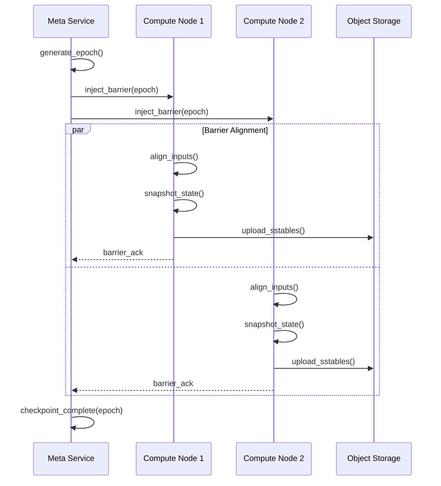
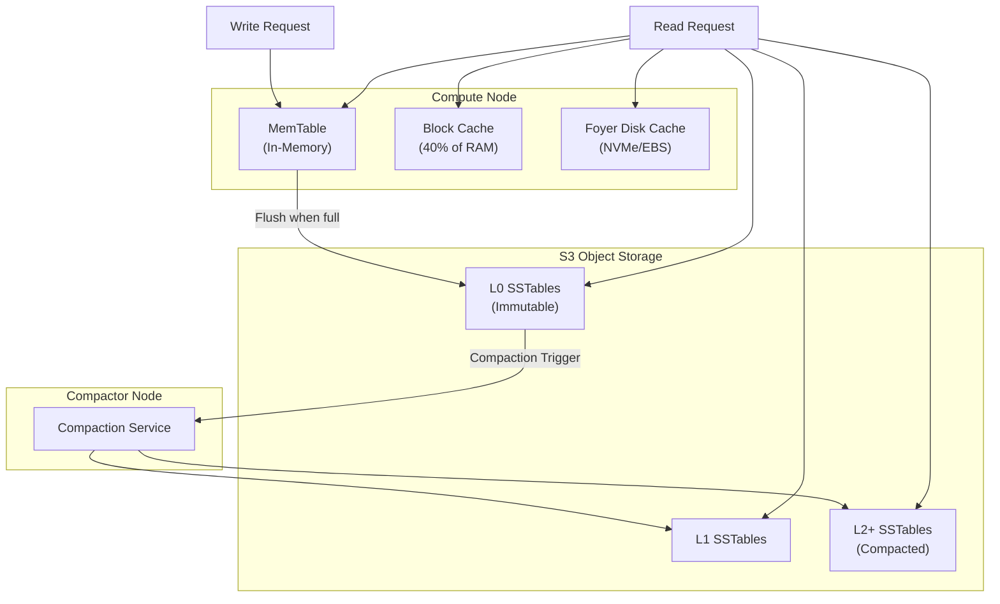
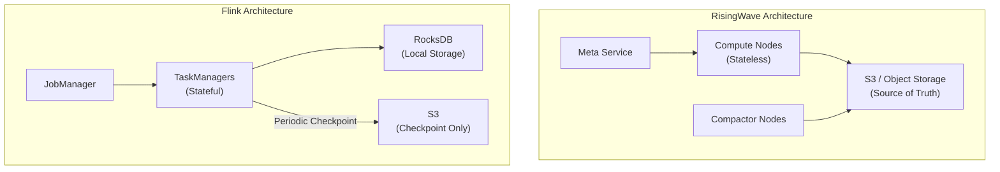

# RisingWave 架构源码深度分析

> 所属阶段: Knowledge/Flink-Scala-Rust-Comprehensive | 前置依赖: [Rust LSM-tree存储原理] | 形式化等级: L4

## 1. 项目结构

### 1.1 目录组织

RisingWave 是一个用 Rust 编写的分布式流处理数据库，其源码组织遵循模块化的 crate 设计：

```
risingwave/
├── src/
│   ├── meta/              # Meta Service 元数据服务
│   ├── frontend/          # SQL前端与查询优化
│   ├── compute/           # Compute Node 计算节点
│   ├── stream/            # 流处理执行引擎
│   ├── batch/             # 批处理执行引擎
│   ├── storage/           # 存储层 (Hummock)
│   │   ├── hummock/       # Hummock LSM-tree引擎
│   │   └── compactor/     # Compaction服务
│   ├── expr/              # 表达式与UDF
│   ├── connector/         # 数据源连接器
│   └── common/            # 公共组件
├── proto/                 # Protocol Buffer定义
└── tests/                 # 集成测试
```

### 1.2 Crate 划分

| Crate | 路径 | 职责 |
|-------|------|------|
| `risingwave_meta` | `src/meta/` | 集群元数据管理、Barrier协调 |
| `risingwave_compute` | `src/compute/` | 计算节点入口 |
| `risingwave_stream` | `src/stream/` | 流处理算子实现 |
| `risingwave_storage` | `src/storage/` | 存储引擎抽象 |
| `risingwave_hummock_sdk` | `src/storage/hummock_sdk/` | Hummock客户端SDK |
| `risingwave_compactor` | `src/storage/compactor/` | Compaction服务 |
| `risingwave_frontend` | `src/frontend/` | SQL解析与优化 |

---

## 2. 核心模块分析

### 2.1 Meta Service 实现 (src/meta/)

**路径位置**: `src/meta/src/`

**职责描述**: Meta Service 是 RisingWave 的大脑，负责集群元数据管理、Barrier注入、Checkpoint协调和调度决策。

**关键 trait/struct**:

```rust
// src/meta/src/rpc/server.rs
pub struct MetaService {
    pub catalog_manager: Arc<CatalogManager>,
    pub fragment_manager: Arc<FragmentManager>,
    pub barrier_manager: Arc<BarrierManager>,
    pub hummock_manager: Arc<HummockManager>,
}

// src/meta/src/barrier/mod.rs
pub struct BarrierManager {
    pub epoch_generator: EpochGenerator,
    pub barrier_scheduler: BarrierScheduler,
    pub checkpoint_frequency: AtomicU32,
}
```

**源码分析 - Barrier 注入机制**:

```rust
// src/meta/src/barrier/mod.rs
impl BarrierManager {
    /// 注入全局 Barrier,触发 Checkpoint
    async fn inject_barrier(&self, command: Command) -> Result<()> {
        let epoch = self.epoch_generator.generate();

        // 1. 构建 Barrier 消息
        let barrier = Barrier {
            epoch,
            kind: BarrierKind::Checkpoint,
            prev_epoch: self.get_prev_epoch(),
        };

        // 2. 向所有 Compute Node 发送 Barrier
        let futures = self.compute_clients.iter().map(|client| {
            client.send_barrier(barrier.clone(), command.clone())
        });

        // 3. 等待所有节点确认 (Chandy-Lamport 算法)
        try_join_all(futures).await?;

        // 4. 更新全局 Epoch
        self.update_epoch(epoch).await?;

        Ok(())
    }
}
```

**Barrier 协调流程**:



### 2.2 Compute Node (src/compute/)

**路径位置**: `src/compute/src/`

**职责描述**: Compute Node 是流处理的执行引擎，管理 Actor 的生命周期，处理 Barrier 并执行流算子。

**关键 trait/struct**:

```rust
// src/compute/src/server.rs
pub struct ComputeNode {
    pub config: ComputeNodeConfig,
    pub streaming_manager: Arc<StreamingManager>,
    pub batch_executor: Arc<BatchExecutor>,
    pub state_store: StateStoreImpl,
}

// src/stream/src/task/stream_manager.rs
pub struct StreamingManager {
    pub actors: HashMap<ActorId, ActorHandle>,
    pub barrier_manager: Arc<LocalBarrierManager>,
    pub state_store: StateStoreImpl,
}
```

**源码分析 - Actor 生命周期管理**:

```rust
// src/stream/src/task/stream_manager.rs
impl StreamingManager {
    /// 创建并启动 Actor
    pub async fn create_actor(
        &self,
        actor_id: ActorId,
        fragment_id: FragmentId,
        nodes: StreamNode,
    ) -> Result<()> {
        // 1. 构建 Actor 上下文
        let context = ActorContext {
            actor_id,
            fragment_id,
            state_store: self.state_store.clone(),
            barrier_manager: self.barrier_manager.clone(),
        };

        // 2. 递归构建算子链
        let executor = self.build_executor(nodes, &context).await?;

        // 3. 创建 Actor 任务
        let actor = Actor::new(
            actor_id,
            executor,
            self.barrier_manager.clone(),
        );

        // 4. 启动 Actor 到运行时
        let handle = tokio::spawn(actor.run());
        self.actors.insert(actor_id, handle);

        Ok(())
    }

    /// 递归构建执行算子
    async fn build_executor(
        &self,
        node: StreamNode,
        context: &ActorContext,
    ) -> Result<BoxedExecutor> {
        match node.node_body {
            // 来源算子
            NodeBody::Source(source) => {
                SourceExecutor::new(source, context).await
            }
            // 投影算子
            NodeBody::Project(project) => {
                let child = self.build_executor(*project.input, context).await?;
                ProjectExecutor::new(project, child)
            }
            // Hash Join 算子
            NodeBody::HashJoin(join) => {
                let left = self.build_executor(*join.left, context).await?;
                let right = self.build_executor(*join.right, context).await?;
                HashJoinExecutor::new(join, left, right, context).await
            }
            // 聚合算子
            NodeBody::HashAgg(agg) => {
                let child = self.build_executor(*agg.input, context).await?;
                HashAggExecutor::new(agg, child, context).await
            }
            _ => unimplemented!(),
        }
    }
}
```

### 2.3 Hummock 存储引擎 (src/storage/hummock/)

**路径位置**: `src/storage/src/hummock/`

**职责描述**: Hummock 是 RisingWave 自研的 LSM-tree 存储引擎，专为流处理场景设计，以 S3 为主要存储。

**关键 trait/struct**:

```rust
// src/storage/src/hummock/store.rs
pub struct HummockStorage {
    /// 本地 MemTable (写入缓冲区)
    pub mem_table: Arc<RwLock<MemTable>>,
    /// 本地缓存
    pub block_cache: BlockCache,
    /// S3 对象存储客户端
    pub object_store: Arc<dyn ObjectStore>,
    /// Hummock 版本管理
    pub version_manager: Arc<VersionManager>,
    /// 事件处理器
    pub event_handler: Arc<HummockEventHandler>,
}

// src/storage/src/hummock/sstable/mod.rs
pub struct Sstable {
    pub id: SstableId,
    pub meta: SstableMeta,
    pub data: Bytes,
}

pub struct SstableMeta {
    pub block_metas: Vec<BlockMeta>,
    pub bloom_filter: Vec<u8>,
    pub estimated_size: u32,
}
```

**源码分析 - LSM-tree 写入路径**:

```rust
// src/storage/src/hummock/store.rs
impl HummockStorage {
    /// 写入键值对
    pub async fn put(&self, key: Bytes, value: Bytes) -> Result<()> {
        // 1. 写入 MemTable (内存)
        let mut mem_table = self.mem_table.write().await;
        mem_table.insert(key, value);

        // 2. 检查是否需要刷盘
        if mem_table.size() >= self.config.mem_table_size_limit {
            self.flush_memtable().await?;
        }

        Ok(())
    }

    /// 将 MemTable 刷入 S3
    async fn flush_memtable(&self) -> Result<()> {
        let mem_table = self.mem_table.read().await;

        // 1. 构建 SSTable
        let sstable = self.build_sstable(&mem_table).await?;

        // 2. 上传到 S3
        let path = format!("hummock/{}/{}.sst", self.table_id, sstable.id);
        self.object_store.put(&path, sstable.data).await?;

        // 3. 更新元数据
        self.version_manager.register_sstable(sstable.meta).await?;

        // 4. 清空 MemTable
        mem_table.clear();

        Ok(())
    }

    /// 读取键值 (分层查找)
    pub async fn get(&self, key: &[u8]) -> Result<Option<Bytes>> {
        // 1. 先查 MemTable
        if let Some(value) = self.mem_table.read().await.get(key) {
            return Ok(Some(value.clone()));
        }

        // 2. 查本地 Block Cache
        if let Some(block) = self.block_cache.get(key).await {
            return Ok(self.find_in_block(&block, key));
        }

        // 3. 按版本从 S3 读取 SSTable
        let version = self.version_manager.current_version().await;
        for level in &version.levels {
            for sstable in &level.sstables {
                // 3.1 Bloom Filter 预过滤
                if !self.bloom_filter_might_contain(sstable, key) {
                    continue;
                }

                // 3.2 从 S3 读取 Block
                let block = self.read_sstable_block(sstable, key).await?;
                self.block_cache.insert(key, block.clone()).await;

                if let Some(value) = self.find_in_block(&block, key) {
                    return Ok(Some(value));
                }
            }
        }

        Ok(None)
    }
}
```

**Hummock 数据流图**:



### 2.4 Compactor 实现 (src/storage/compactor/)

**路径位置**: `src/storage/compactor/src/`

**职责描述**: Compactor 负责在后台执行 LSM-tree 的 Compaction，合并 SSTable 并清理过期数据。

**关键 trait/struct**:

```rust
// src/storage/compactor/src/compactor.rs
pub struct Compactor {
    pub context: CompactorContext,
    pub compaction_scheduler: Arc<dyn CompactionScheduler>,
    pub object_store: Arc<dyn ObjectStore>,
}

// src/storage/src/hummock/compaction/mod.rs
pub struct CompactionTask {
    pub input_sstables: Vec<SstableInfo>,
    pub output_level: u32,
    pub target_file_size: u64,
    pub compression_algorithm: CompressionAlgorithm,
}
```

**源码分析 - Block 级 Compaction 优化**:

```rust
// src/storage/src/hummock/compaction/compactor.rs
impl Compactor {
    /// 执行 Compaction 任务
    pub async fn compact(&self, task: CompactionTask) -> Result<Vec<SstableInfo>> {
        let mut output_sstables = Vec::new();
        let mut current_sstable_builder = SstableBuilder::new(
            task.target_file_size,
            task.compression_algorithm,
        );

        // 1. 合并排序输入 SSTable
        let merge_iterator = self.create_merge_iterator(&task.input_sstables).await?;

        // 2. 遍历合并后的键值对
        while let Some((key, value)) = merge_iterator.next().await? {
            // Block 级优化:如果当前 block 与上层无重叠,直接复制
            if self.can_fast_copy(&key, &task.input_sstables) {
                // 直接复制未重叠的 block,避免解压/重压缩
                current_sstable_builder.fast_copy_block(&key, &value)?;
            } else {
                // 需要合并的 block,解压处理
                current_sstable_builder.add(key, value)?;
            }

            // 3. SSTable 大小达到限制,刷盘
            if current_sstable_builder.size() >= task.target_file_size {
                let sstable = current_sstable_builder.finish().await?;
                let sstable_info = self.upload_sstable(&sstable).await?;
                output_sstables.push(sstable_info);
                current_sstable_builder = SstableBuilder::new(
                    task.target_file_size,
                    task.compression_algorithm,
                );
            }
        }

        // 4. 刷入剩余的 SSTable
        if !current_sstable_builder.is_empty() {
            let sstable = current_sstable_builder.finish().await?;
            let sstable_info = self.upload_sstable(&sstable).await?;
            output_sstables.push(sstable_info);
        }

        Ok(output_sstables)
    }
}
```

---

## 3. 数据流分析

### 3.1 流处理 Pipeline 源码追踪

```rust
// src/stream/src/executor/mod.rs
pub trait Executor: Send + 'static {
    fn execute(self: Box<Self>) -> BoxedMessageStream;
}

pub struct ExecutorInfo {
    pub schema: Schema,
    pub pk_indices: Vec<usize>,
    pub identity: String,
}

// 消息类型定义
pub enum Message {
    /// 数据块
    Chunk(StreamChunk),
    /// Barrier (Checkpoint 信号)
    Barrier(Barrier),
    /// 水印 (用于推动窗口)
    Watermark(Watermark),
}

pub struct StreamChunk {
    pub data: DataChunk,
    pub ops: Vec<Op>,  // 操作类型: Insert/Delete/Update
}
```

**数据流执行流程**:


### 3.2 Checkpoint 数据流

```rust
// src/stream/src/executor/hash_agg.rs
impl HashAggExecutor {
    async fn execute_inner(self) {
        let mut state_tables: HashMap<Key, StateTable> = HashMap::new();

        #[for_await]
        for msg in self.input.execute() {
            match msg? {
                Message::Chunk(chunk) => {
                    // 处理数据块,更新状态表
                    self.apply_chunk(&chunk, &mut state_tables).await?;
                }
                Message::Barrier(barrier) => {
                    // Barrier 到达,触发 Checkpoint
                    if barrier.kind == BarrierKind::Checkpoint {
                        // 1. 刷入状态到 Hummock
                        for (key, table) in &state_tables {
                            table.commit(barrier.epoch).await?;
                        }

                        // 2. 确认 Barrier
                        self.barrier_manager.ack_barrier(barrier.epoch)?;
                    }
                }
                _ => {}
            }
        }
    }
}
```

---

## 4. 关键算法

### 4.1 Chandy-Lamport Checkpoint 算法

**伪代码**:

```
Algorithm: Distributed Snapshot (Chandy-Lamport)

Initiator (Meta Service):
  1. Record local state
  2. Send MARKER to all outgoing channels
  3. Wait for all MARKER ACKs

Participant (Compute Node):
  On receiving MARKER from channel C:
    If not recorded:
      1. Record local state
      2. Send MARKER to all outgoing channels (except C)
      3. Record messages from C after this MARKER
    Else:
      1. Record messages from C before this MARKER

  On receiving regular message:
    1. Process message normally
    2. If MARKER received, store in channel state
```

**Rust 实现** (src/meta/src/barrier/mod.rs):

```rust
/// 协调分布式 Checkpoint
async fn coordinate_checkpoint(&self) -> Result<()> {
    let checkpoint_epoch = self.generate_epoch();

    // 1. 注入 Barrier (相当于 Chandy-Lamport 的 MARKER)
    let injection_result = self.inject_barrier_to_all_nodes(
        Barrier::new_checkpoint(checkpoint_epoch)
    ).await?;

    // 2. 等待所有 Compute Node 完成对齐和快照
    let timeout = Duration::from_secs(30);
    match timeout(timeout, self.collect_barrier_acks(checkpoint_epoch)).await {
        Ok(_) => {
            // 3. Checkpoint 完成,更新元数据
            self.hummock_manager.commit_epoch(checkpoint_epoch).await?;
            info!("Checkpoint {} completed", checkpoint_epoch);
        }
        Err(_) => {
            // 超时,触发恢复流程
            self.trigger_recovery(checkpoint_epoch).await?;
        }
    }

    Ok(())
}
```

### 4.2 LSM-tree Compaction 策略

**RisingWave Compaction 层级**:

```rust
// src/storage/src/hummock/compaction/level.rs
pub struct LevelConfig {
    /// L0 大小阈值 (触发 L0->L1 Compaction)
    pub l0_threshold_size: u64,
    /// 层级大小放大因子
    pub level_size_multiplier: u32,
    /// 最大层级数
    pub max_levels: u32,
}

/// Tiered Compaction 策略
pub struct TieredCompactionPolicy {
    pub config: LevelConfig,
}

impl CompactionPolicy for TieredCompactionPolicy {
    fn select_compaction_tasks(
        &self,
        version: &HummockVersion,
    ) -> Vec<CompactionTask> {
        let mut tasks = Vec::new();

        // 1. 检查 L0->L1 Compaction
        let l0_size: u64 = version.levels[0].sstables.iter()
            .map(|s| s.file_size).sum();

        if l0_size >= self.config.l0_threshold_size {
            tasks.push(CompactionTask {
                input_sstables: version.levels[0].sstables.clone(),
                output_level: 1,
                target_file_size: 256 * 1024 * 1024, // 256MB
                compression_algorithm: CompressionAlgorithm::Lz4,
            });
        }

        // 2. 检查深层 Compaction
        for level in 1..version.levels.len() {
            let level_size: u64 = version.levels[level].sstables.iter()
                .map(|s| s.file_size).sum();
            let target_size = self.config.base_level_size
                * self.config.level_size_multiplier.pow(level as u32);

            if level_size > target_size {
                tasks.push(self.create_level_compaction_task(
                    level, &version.levels[level]
                ));
            }
        }

        tasks
    }
}
```

---

## 5. 与 Flink 对比

| 维度 | RisingWave | Apache Flink |
|------|------------|--------------|
| **架构模式** | 存算分离 (S3为主存储) | 存算耦合 (RocksDB本地存储) |
| **状态后端** | Hummock (自研LSM-tree) | RocksDB / Heap |
| **Checkpoint** | Epoch-based, 1秒间隔 | Barrier-based, 30秒-5分钟 |
| **存储成本** | ~$23/TB/月 (S3) | ~$80-200/TB/月 (SSD) |
| **恢复时间** | 秒级 (与状态大小无关) | 5-30分钟 (需重建RocksDB) |
| **扩缩容** | 无状态迁移，即时生效 | 需 Savepoint 重启 |
| **SQL支持** | 原生 PostgreSQL 协议 | Flink SQL (需连接器) |
| **物化视图** | 一等公民 | 需外部系统支持 |

### 5.1 架构差异深度分析

**存储层差异**:



**关键设计决策对比**:

| 决策点 | RisingWave | Flink |
|--------|------------|-------|
| 为何选择 S3 | 云原生设计，无限扩展 | 历史包袱，RocksDB成熟 |
| Compaction 位置 | 独立 Compactor 节点 | 与计算同节点 |
| Barrier 语义 | Epoch-based MVCC | Chandy-Lamport |
| 缓存策略 | 多级缓存 (Mem + NVMe) | RocksDB Block Cache |

---

## 6. 引用参考
