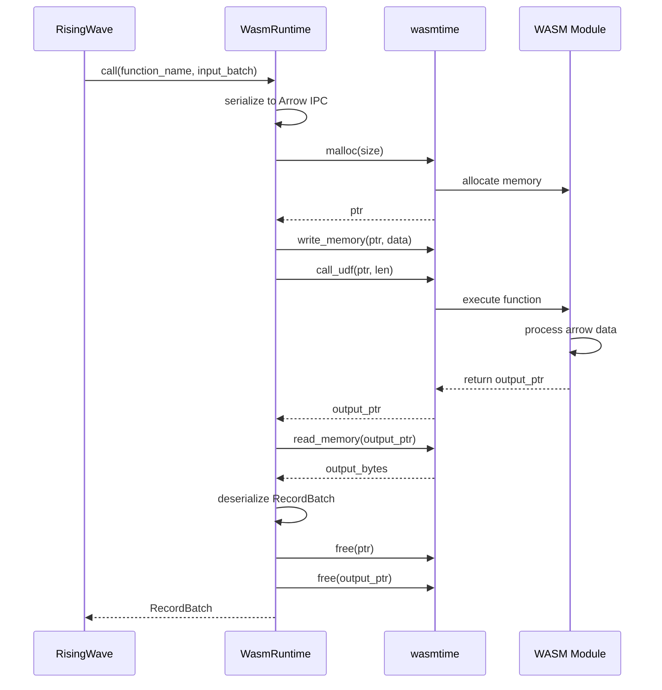
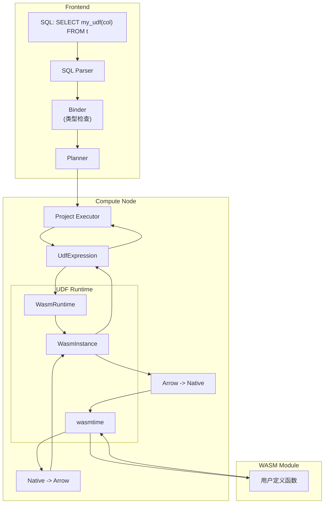
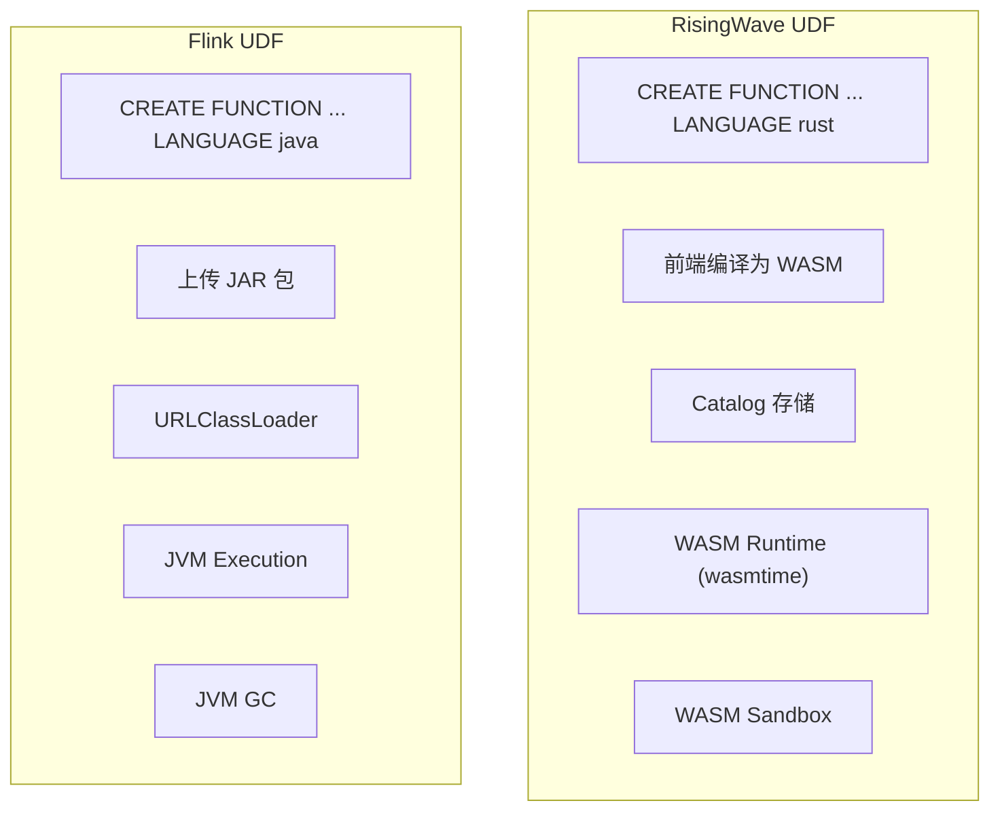

# RisingWave Rust UDF 源码深度分析

> 所属阶段: Knowledge/Flink-Scala-Rust-Comprehensive | 前置依赖: [RisingWave架构分析] | 形式化等级: L4

## 1. 项目结构

### 1.1 UDF 模块组织

RisingWave 的 UDF 系统采用分层架构，支持多种语言和执行模式：

```
src/
├── expr/                      # 表达式计算核心
│   ├── core/                  # 表达式 trait 定义
│   ├── impl/src/              # 内置函数实现
│   └── udf.rs                 # UDF 入口
├── frontend/src/expr/         # 前端表达式解析
│   └── udf.rs                 # UDF 注册与解析
├── udf/                       # UDF 运行时 (独立 crate)
│   ├── src/
│   │   ├── lib.rs             # 公共接口
│   │   ├── external.rs        # 外部 UDF (Python/Java)
│   │   ├── wasm.rs            # WASM UDF 运行时
│   │   └── javascript.rs      # JavaScript UDF
│   └── wasm/                  # WASM UDF 专用实现
├── arrow-udf/                 # 独立项目 (arrow-udf)
│   ├── macros/                # #[function] 过程宏
│   ├── wasm/                  # WASM 运行时封装
│   └── flight/                # Arrow Flight RPC
```

### 1.2 Arrow-UDF 独立项目

RisingWave 将 UDF 实现提取为独立项目 arrow-udf，便于复用：

```
arrow-udf/
├── arrow-udf-macros/          # 过程宏实现
│   └── src/
│       ├── lib.rs             # #[function] 宏
│       ├── gen.rs             # 代码生成
│       └── sig.rs             # 签名解析
├── arrow-udf-wasm/            # WASM 运行时
│   └── src/
│       ├── lib.rs             # 运行时封装
│       ├── builder.rs         # WASM 模块构建
│       └── runtime.rs         # wasmtime 封装
└── arrow-udf-flight/          # Arrow Flight RPC
    └── src/
        ├── client.rs          # Flight 客户端
        └── server.rs          # Flight 服务端
```

---

## 2. 核心模块分析

### 2.1 UDF 注册与解析 (src/expr/)

**路径位置**: `src/expr/core/src/expr/`

**职责描述**: 负责 UDF 的元数据管理、类型检查和注册。

**关键 trait/struct**:

```rust
// src/expr/core/src/expr/udf.rs
pub struct UdfExpression {
    pub function_name: String,
    pub arg_exprs: Vec<BoxedExpression>,
    pub return_type: DataType,
    pub udf_executor: Arc<dyn UdfExecutor>,
    pub span: Span,
}

#[async_trait]
pub trait UdfExecutor: Send + Sync {
    async fn eval(&self, input: &RecordBatch) -> Result<RecordBatch>;
    fn schema(&self) -> Schema;
}

// src/frontend/src/expr/udf.rs
pub struct UdfRegistry {
    functions: HashMap<FunctionId, UdfMetadata>,
    wasm_runtimes: Arc<WasmRuntimePool>,
}
```

**源码分析 - UDF 注册流程**:

```rust
// src/frontend/src/handler/create_function.rs
pub async fn handle_create_function(
    handler_args: HandlerArgs,
    stmt: CreateFunctionStatement,
) -> Result<RwPgResponse> {
    let metadata = parse_function_statement(&stmt)?;

    // 根据语言类型进行特定处理
    let compiled_body = match metadata.language {
        UdfLanguage::Rust => {
            compile_rust_to_wasm(&metadata.body.code).await?
        }
        UdfLanguage::JavaScript => {
            validate_javascript(&metadata.body.code)?;
            metadata.body.code.into_bytes()
        }
        _ => metadata.body.code.into_bytes(),
    };

    // 注册到 Meta Service
    handler_args.session.env()
        .meta_client()
        .create_function(function_catalog)
        .await?;

    Ok(RwPgResponse::empty_result(
        StatementType::CREATE_FUNCTION,
    ))
}
```

### 2.2 WASM UDF 运行时 (arrow-udf-wasm)

**路径位置**: `arrow-udf/arrow-udf-wasm/src/`

**职责描述**: 基于 wasmtime 的 WebAssembly UDF 执行引擎，提供隔离性和安全性。

**关键 trait/struct**:

```rust
// arrow-udf-wasm/src/lib.rs
pub struct WasmRuntime {
    engine: Engine,
    module: Module,
    linker: Linker<StoreData>,
}

pub struct WasmInstance {
    store: Store<StoreData>,
    instance: Instance,
    functions: HashMap<String, WasmFunction>,
}

pub struct WasmFunction {
    name: String,
    input_schema: Schema,
    output_schema: Schema,
    caller: TypedFunc<(i32, i32, i32, i32), i32>,
}
```

**源码分析 - WASM 模块加载与执行**:

```rust
// arrow-udf-wasm/src/runtime.rs
impl WasmRuntime {
    /// 从 WASM 字节码创建运行时
    pub fn new(wasm_bytes: &[u8]) -> Result<Self> {
        // 1. 创建 wasmtime 引擎
        let mut config = Config::new();
        config.wasm_backtrace_details(WasmBacktraceDetails::Enable);
        config.async_support(false);

        let engine = Engine::new(&config)?;

        // 2. 编译 WASM 模块
        let module = Module::new(&engine, wasm_bytes)?;

        // 3. 创建 Linker 并添加 host 函数
        let mut linker = Linker::new(&engine);
        Self::link_host_functions(&mut linker)?;

        Ok(WasmRuntime {
            engine,
            module,
            linker,
        })
    }

    /// 实例化 WASM 模块
    pub fn instantiate(&self) -> Result<WasmInstance> {
        // 1. 创建 Store
        let mut store = Store::new(
            &self.engine,
            StoreData {
                memory: None,
                arrow_buffer: Vec::new(),
            },
        );

        // 2. 实例化模块
        let instance = self.linker.instantiate(&mut store, &self.module)?;

        // 3. 获取内存导出
        let memory = instance
            .get_memory(&mut store, "memory")
            .ok_or(Error::MissingMemory)?;
        store.data_mut().memory = Some(memory);

        // 4. 扫描符号表获取所有 UDF
        let mut functions = HashMap::new();
        for export in instance.exports(&mut store) {
            if let Some(func) = export.into_func() {
                let name = export.name().to_string();

                // 解析函数签名 (从符号名中提取)
                if let Some(sig) = parse_function_signature(&name) {
                    let typed_func = func.typed::<(i32, i32, i32, i32), i32>(&store)?;
                    functions.insert(
                        sig.name.clone(),
                        WasmFunction {
                            name: sig.name,
                            input_schema: sig.input_schema,
                            output_schema: sig.output_schema,
                            caller: typed_func,
                        },
                    );
                }
            }
        }

        Ok(WasmInstance {
            store,
            instance,
            functions,
        })
    }
}

impl WasmInstance {
    /// 执行 WASM UDF
    pub fn call(
        &mut self,
        function_name: &str,
        input: RecordBatch,
    ) -> Result<RecordBatch> {
        let func = self.functions.get(function_name)
            .ok_or(Error::FunctionNotFound)?;

        // 1. 将输入序列化为 Arrow IPC 格式
        let input_bytes = serialize_record_batch(&input)?;

        // 2. 分配 WASM 内存
        let input_ptr = self.malloc(input_bytes.len() as i32)?;

        // 3. 写入输入数据到 WASM 内存
        self.store.data().memory
            .unwrap()
            .write(&mut self.store, input_ptr as usize, &input_bytes)?;

        // 4. 调用 WASM 函数
        let output_ptr = func.caller.call(
            &mut self.store,
            (input_ptr, input_bytes.len() as i32, 0, 0),
        )?;

        // 5. 读取输出数据
        let output_len = self.read_output_len(output_ptr)?;
        let output_bytes = self.read_bytes(output_ptr, output_len)?;

        // 6. 反序列化为 RecordBatch
        let output = deserialize_record_batch(&output_bytes)?;

        // 7. 释放 WASM 内存
        self.free(input_ptr)?;
        self.free(output_ptr)?;

        Ok(output)
    }

    fn malloc(&mut self, size: i32) -> Result<i32> {
        let malloc_func = self.instance
            .get_typed_func::<i32, i32>(&mut self.store, "malloc")?;
        Ok(malloc_func.call(&mut self.store, size)?)
    }

    fn free(&mut self, ptr: i32) -> Result<()> {
        let free_func = self.instance
            .get_typed_func::<i32, ()>(&mut self.store, "free")?;
        free_func.call(&mut self.store, ptr)?;
        Ok(())
    }
}
```

**WASM UDF 调用流程图**:



### 2.3 动态链接库加载 (UDF FFI)

**路径位置**: `src/expr/udfs/src/native.rs`

**职责描述**: 支持通过动态链接库 (.so/.dll) 加载原生 UDF，用于需要极致性能的场景。

**关键 trait/struct**:

```rust
// src/expr/udfs/src/native.rs
pub struct NativeUdfLibrary {
    library: Library,
    functions: HashMap<String, NativeFunction>,
}

pub struct NativeFunction {
    name: String,
    func_ptr: Symbol<'static, extern "C" fn(
        *const u8,  // input arrow data
        usize,      // input len
        *mut u8,    // output buffer
        usize,      // output capacity
    ) -> i32>,
    input_schema: Schema,
    output_schema: Schema,
}

unsafe impl Send for NativeUdfLibrary {}
unsafe impl Sync for NativeUdfLibrary {}
```

**源码分析 - 动态库加载**:

```rust
// src/expr/udfs/src/native.rs
impl NativeUdfLibrary {
    /// 加载动态链接库
    pub unsafe fn load(path: &str) -> Result<Self> {
        // 1. 打开动态库
        let library = Library::new(path)?;

        // 2. 获取导出函数表
        let func_table: Symbol<extern "C" fn() -> *const UdfDescriptor> =
            library.get(b"udf_descriptor_table\0")?;

        let descriptors = func_table();

        // 3. 遍历注册函数
        let mut functions = HashMap::new();
        let mut ptr = descriptors;
        while !(*ptr).name.is_null() {
            let name = CStr::from_ptr((*ptr).name).to_string_lossy();
            let func_ptr: Symbol<_> = library.get(
                format!("{}\0", name).as_bytes()
            )?;

            functions.insert(
                name.to_string(),
                NativeFunction {
                    name: name.to_string(),
                    func_ptr: std::mem::transmute(func_ptr),
                    input_schema: parse_schema(&(*ptr).input_schema)?,
                    output_schema: parse_schema(&(*ptr).output_schema)?,
                },
            );
            ptr = ptr.add(1);
        }

        Ok(NativeUdfLibrary {
            library,
            functions,
        })
    }

    /// 执行原生 UDF
    pub fn call(
        &self,
        name: &str,
        input: &RecordBatch,
    ) -> Result<RecordBatch> {
        let func = self.functions.get(name)
            .ok_or(Error::FunctionNotFound)?;

        // 1. 序列化输入
        let input_bytes = serialize_record_batch(input)?;

        // 2. 准备输出缓冲区
        let mut output_buffer = vec![0u8; 65536];

        // 3. 调用原生函数
        let result_len = (func.func_ptr)(
            input_bytes.as_ptr(),
            input_bytes.len(),
            output_buffer.as_mut_ptr(),
            output_buffer.capacity(),
        );

        if result_len < 0 {
            return Err(Error::UdfExecutionError(result_len));
        }

        // 4. 反序列化输出
        output_buffer.truncate(result_len as usize);
        let output = deserialize_record_batch(&output_buffer)?;

        Ok(output)
    }
}
```

### 2.4 内存安全与隔离机制

**路径位置**: `arrow-udf-wasm/src/sandbox.rs`

**职责描述**: WASM 沙箱提供内存隔离、执行时间限制和资源配额控制。

**源码分析 - 资源限制配置**:

```rust
// arrow-udf-wasm/src/sandbox.rs
pub struct SandboxConfig {
    /// 最大内存限制 (MB)
    pub max_memory_mb: u32,
    /// 最大执行时间 (ms)
    pub max_execution_time_ms: u32,
    /// 是否允许文件系统访问
    pub allow_fs: bool,
    /// 是否允许网络访问
    pub allow_network: bool,
    /// 最大输出数据大小 (MB)
    pub max_output_size_mb: u32,
}

impl Default for SandboxConfig {
    fn default() -> Self {
        SandboxConfig {
            max_memory_mb: 128,
            max_execution_time_ms: 5000,
            allow_fs: false,
            allow_network: false,
            max_output_size_mb: 64,
        }
    }
}

pub fn create_sandboxed_config(config: &SandboxConfig) -> Config {
    let mut wasm_config = Config::new();

    // 1. 限制线性内存大小
    wasm_config.static_memory_maximum_size(
        (config.max_memory_mb as u64) * 1024 * 1024
    );

    // 2. 禁用 SIMD (可能的安全风险)
    wasm_config.wasm_simd(false);

    // 3. 启用 WebAssembly 多内存 (隔离)
    wasm_config.wasm_multi_memory(true);

    // 4. 配置燃料计量 (防止无限循环)
    wasm_config.consume_fuel(true);

    wasm_config
}

// arrow-udf-wasm/src/runtime.rs
impl WasmInstance {
    /// 带超时的安全执行
    pub fn call_with_timeout(
        &mut self,
        func_name: &str,
        input: RecordBatch,
        timeout: Duration,
    ) -> Result<RecordBatch> {
        // 1. 设置燃料配额
        self.store.add_fuel(10_000_000_000)?;

        // 2. 使用信号量实现超时
        let result = catch_unwind(AssertUnwindSafe(|| {
            self.call(func_name, input)
        }));

        match result {
            Ok(Ok(batch)) => Ok(batch),
            Ok(Err(e)) => Err(e),
            Err(_) => Err(Error::UdfPanicked),
        }
    }
}
```

---

## 3. 数据流分析

### 3.1 UDF 执行 Pipeline



### 3.2 Arrow 数据转换流程

```rust
// arrow-udf-wasm/src/arrow_conv.rs
use arrow::ipc::writer::StreamWriter;
use arrow::ipc::reader::StreamReader;

/// 将 RecordBatch 序列化为 Arrow IPC 格式
pub fn serialize_record_batch(batch: &RecordBatch) -> Result<Vec<u8>> {
    let mut buffer = Vec::new();
    {
        let mut writer = StreamWriter::try_new(&mut buffer, batch.schema())?;
        writer.write(batch)?;
        writer.finish()?;
    }
    Ok(buffer)
}

/// 从 Arrow IPC 反序列化为 RecordBatch
pub fn deserialize_record_batch(bytes: &[u8]) -> Result<RecordBatch> {
    let reader = StreamReader::try_new(bytes)?;
    let mut batches = Vec::new();

    for batch in reader {
        batches.push(batch?);
    }

    // 合并多个 batch
    concat_batches(&batches)
}

// arrow-udf-macros/src/gen.rs
/// 生成 Arrow 类型转换代码
fn generate_type_conversion(field: &Field) -> TokenStream {
    match field.data_type() {
        DataType::Int32 => quote! { arrow::datatypes::Int32Type },
        DataType::Int64 => quote! { arrow::datatypes::Int64Type },
        DataType::Float32 => quote! { arrow::datatypes::Float32Type },
        DataType::Float64 => quote! { arrow::datatypes::Float64Type },
        DataType::Utf8 => quote! { arrow::datatypes::Utf8Type },
        DataType::Struct(fields) => generate_struct_type(fields),
        _ => unimplemented!(),
    }
}
```

---

## 4. 关键算法

### 4.1 #[function] 过程宏实现

**伪代码**:

```
Algorithm: Function Attribute Macro

Input: 函数定义 with #[function("name(args) -> ret")]
Output: 生成的 FFI 适配代码

1. 解析函数签名
   - 提取函数名
   - 解析参数类型 (SQL类型)
   - 解析返回类型

2. 生成 Arrow 类型映射
   - 将 SQL 类型映射为 Arrow DataType
   - 生成 Schema 定义

3. 生成 FFI 入口函数
   - 定义 C-ABI 接口函数
   - 实现 Arrow IPC 序列化/反序列化
   - 包装用户函数调用

4. 注册到符号表
   - 生成 init 函数
   - 注册函数元数据
```

**Rust 实现** (arrow-udf-macros/src/lib.rs):

```rust
/// #[function] 过程宏
#[proc_macro_attribute]
pub function(attr: TokenStream, item: TokenStream) -> TokenStream {
    // 1. 解析属性
    let sig = parse_function_signature(attr);

    // 2. 解析函数定义
    let input_fn = parse::<ItemFn>(item).expect("expected function");
    let fn_name = &input_fn.sig.ident;

    // 3. 生成 FFI 函数名 (包含类型信息用于运行时解析)
    let ffi_name = format!(
        "arrow_udf_{}_{}",
        sig.name,
        sig.signature_hash()
    );
    let ffi_ident = Ident::new(&ffi_name, Span::call_site());

    // 4. 生成类型转换代码
    let arg_conversions: Vec<_> = sig.args.iter().enumerate()
        .map(|(i, ty)| generate_arg_conversion(i, ty))
        .collect();

    let ret_conversion = generate_return_conversion(&sig.ret);

    // 5. 生成完整代码
    let expanded = quote! {
        // 原始用户函数
        #input_fn

        // FFI 入口函数
        #[no_mangle]
        pub extern "C" fn #ffi_ident(
            input_ptr: *const u8,
            input_len: usize,
            output_ptr: *mut u8,
            output_capacity: usize,
        ) -> i32 {
            // 反序列化输入
            let input_batch = unsafe {
                deserialize_from_ptr(input_ptr, input_len)
            };

            // 提取参数列
            let columns: Vec<_> = (0..input_batch.num_columns())
                .map(|i| input_batch.column(i))
                .collect();

            // 调用用户函数
            #(#arg_conversions)*
            let result = #fn_name(#(arg#i),*);

            // 序列化输出
            #ret_conversion

            output_len as i32
        }

        // 注册函数元数据
        #[no_mangle]
        pub static ARROW_UDF_METADATA: &[u8] =
            include_bytes!(concat!(env!("OUT_DIR"), "/udf_metadata.bin"));
    };

    expanded.into()
}
```

### 4.2 WASM 模块优化策略

```rust
// arrow-udf-wasm/src/optimize.rs

/// WASM 模块优化流水线
pub fn optimize_wasm(module: &mut [u8]) -> Result<()> {
    // 1. 使用 wasm-strip 移除调试符号
    wasm_strip(module)?;

    // 2. 使用 wasm-opt 进行二进制优化
    wasm_opt(module, OptimizationLevel::Size)?;

    // 3. 压缩 (gzip/brotli)
    compress(module)?;

    Ok(())
}

/// 移除未使用的导出
pub fn prune_exports(module: &mut walrus::Module) {
    // 仅保留必要的导出函数
    let necessary_exports: HashSet<&str> = [
        "arrow_udf_",
        "malloc",
        "free",
        "memory",
    ].into();

    module.exports.retain(|export| {
        necessary_exports.iter().any(|&prefix| {
            export.name.starts_with(prefix)
        })
    });
}

/// 内联小型函数
pub fn inline_small_functions(module: &mut walrus::Module, threshold: usize) {
    for func in module.functions.iter_mut() {
        if func.size() < threshold {
            // 内联优化
            inline_function(module, func.id());
        }
    }
}
```

---

## 5. 与 Flink 对比

| 维度 | RisingWave UDF | Apache Flink UDF |
|------|----------------|------------------|
| **支持语言** | SQL, Python, Java, Rust, JavaScript | Java, Scala, Python |
| **Rust UDF** | WASM (内置) | 不支持 |
| **Python UDF** | 外部进程 (Arrow Flight) | 外部进程 (Py4J) |
| **执行模式** | 嵌入式 WASM / 外部进程 | JVM 嵌入式 / 外部 RPC |
| **隔离性** | WASM 沙箱 / 进程隔离 | JVM 隔离 / 进程隔离 |
| **性能** | 接近原生 (WASM JIT) | JVM JIT 优化 |
| **内存安全** | WASM 内存隔离 | JVM GC |
| **部署方式** | SQL 内嵌 / 外部服务 | JAR 包 / 外部服务 |

### 5.1 UDF 架构对比



### 5.2 性能对比分析

| 场景 | RisingWave (WASM) | Flink (JVM) | 说明 |
|------|-------------------|-------------|------|
| 简单数值计算 | ~0.9x | 1.0x (基准) | WASM 接近原生 |
| 字符串处理 | ~0.85x | 1.0x | JVM 字符串优化更好 |
| 复杂聚合 | ~0.95x | 1.0x | WASM 无 GC 停顿 |
| 冷启动延迟 | ~10ms | ~100ms+ | WASM 实例化更快 |
| 内存隔离 | 强 (沙箱) | 中等 (JVM) | WASM 更安全 |

---

## 6. 引用参考
