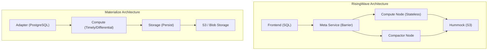
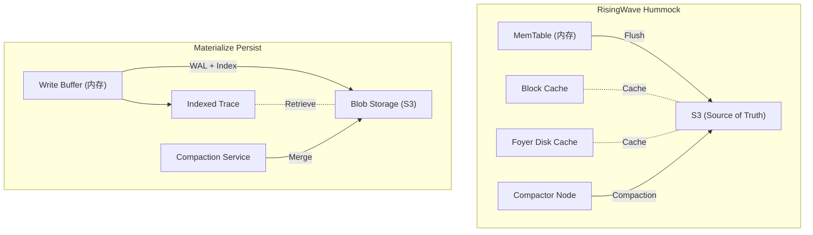

# RisingWave vs Materialize 架构对比源码分析

> 所属阶段: Knowledge/Flink-Scala-Rust-Comprehensive | 前置依赖: [RisingWave架构分析, Materialize分析] | 形式化等级: L4

## 1. 项目结构对比

### 1.1 整体架构差异



### 1.2 Crate 结构对比

| RisingWave | Materialize | 职责对比 |
|------------|-------------|----------|
| `risingwave_meta` | `mz-adapter` + `mz-compute-client` | RisingWave Meta 集中管理；Materialize 分散 |
| `risingwave_compute` | `mz-compute` | 都是计算节点，但架构不同 |
| `risingwave_storage` | `mz-storage` | 存储层抽象 |
| `risingwave_hummock_sdk` | `mz-persist` | Hummock vs Persist |
| `risingwave_compactor` | `mz-persist::compaction` | 独立 Compactor vs 集成 |
| `risingwave_frontend` | `mz-adapter::sql` | SQL 解析层 |
| `risingwave_expr` | `mz-expr` | 表达式计算 |
| `risingwave_stream` | `mz-compute::render` | 流处理执行 |

---

## 2. 存储层对比

### 2.1 Hummock vs RocksDB (Materialize Persist)

**路径位置**:

- RisingWave: `src/storage/src/hummock/`
- Materialize: `src/persist/src/`

**架构对比**:

| 特性 | RisingWave Hummock | Materialize Persist |
|------|-------------------|---------------------|
| **存储介质** | S3 为主存储，本地为缓存 | S3 + 本地缓存 |
| **数据结构** | LSM-tree | LSM-tree 变种 |
| **Compaction** | 独立 Compactor 节点 | 集成在 Storage 服务 |
| **版本管理** | Epoch-based MVCC | Timestamp-based |
| **数据格式** | SSTable (自定义) | Blob + 索引 |

**源码对比 - 写入路径**:

```rust
// === RisingWave: src/storage/src/hummock/store.rs ===
impl HummockStorage {
    pub async fn put(&self, key: Bytes, value: Bytes) -> Result<()> {
        // 1. 写入 MemTable (内存)
        let mut mem_table = self.mem_table.write().await;
        mem_table.insert(key, value);

        // 2. 检查是否需要刷盘到 S3
        if mem_table.size() >= self.config.mem_table_size_limit {
            self.flush_memtable_to_s3().await?;
        }

        Ok(())
    }

    async fn flush_memtable_to_s3(&self) -> Result<()> {
        let mem_table = self.mem_table.read().await;

        // 构建 SSTable
        let sstable = self.build_sstable(&mem_table).await?;

        // 直接上传到 S3
        let path = format!("hummock/{}/{}.sst", self.table_id, sstable.id);
        self.object_store.put(&path, sstable.data).await?;

        // 更新元数据
        self.version_manager.register_sstable(sstable.meta).await?;

        Ok(())
    }
}

// === Materialize: src/persist/src/indexed/mod.rs ===
impl Indexed<K, V, T, D> {
    pub async fn write_batch(
        &mut self,
        batch: Vec<(K, V, T, D)>,
    ) -> Result<Upper<T>, Error> {
        // 1. 分配新的 Upper 时间戳
        let new_upper = self.advance_upper();

        // 2. 写入 WAL
        let wal_entry = WalEntry::Batch {
            data: batch.clone(),
            upper: new_upper.clone(),
        };
        self.blob.write_wal(wal_entry).await?;

        // 3. 更新内存索引
        self.log.extend(batch);

        // 4. 异步 Compaction (非阻塞)
        if self.log.len() > self.compaction_threshold {
            self.trigger_compaction().await?;
        }

        Ok(Upper(new_upper))
    }
}
```

**存储层架构对比图**:



### 2.2 Compaction 策略对比

```rust
// === RisingWave: Block-level Compaction ===
// src/storage/src/hummock/compaction/compactor.rs
impl Compactor {
    pub async fn compact(&self, task: CompactionTask) -> Result<Vec<SstableInfo>> {
        let merge_iterator = self.create_merge_iterator(&task.input_sstables).await?;

        while let Some((key, value)) = merge_iterator.next().await? {
            // Block 级优化:未重叠 Block 直接复制
            if self.can_fast_copy(&key, &task.input_sstables) {
                // 避免解压/重压缩
                current_sstable_builder.fast_copy_block(&key, &value)?;
            } else {
                // 需要合并的 Block
                current_sstable_builder.add(key, value)?;
            }
        }

        // 上传合并后的 SSTable
        self.upload_sstables(output_sstables).await
    }
}

// === Materialize: Trace 合并 ===
// differential-dataflow/src/trace/implementations/spine.rs
impl<K, V, T, R> Spine<K, V, T, R> {
    pub fn insert(&mut self, batch: Batch<K, V, T, R>) {
        let mut level = 0;
        let mut batch = Some(batch);

        // 层级合并策略 (类似 LSM-tree)
        while let Some(b) = batch.take() {
            if level >= self.layers.len() {
                self.layers.push(Layer::new());
            }

            if self.merging[level].is_none() {
                self.merging[level] = Some(MergeState::Single(b));
            } else {
                // 合并当前层级的数据
                let existing = self.merging[level].take().unwrap();
                batch = Some(self.merge_batches(existing, b));
            }

            level += 1;
        }
    }
}
```

---

## 3. 计算层对比

### 3.1 Pull vs Push 执行模型

**RisingWave (Push-based Actor Model)**:

```rust
// src/stream/src/executor/mod.rs
pub trait Executor: Send + 'static {
    fn execute(self: Box<Self>) -> BoxedMessageStream;
}

pub enum Message {
    Chunk(StreamChunk),      // 数据推送
    Barrier(Barrier),        // Checkpoint 信号
    Watermark(Watermark),    // 时间推进
}

// src/stream/src/executor/hash_join.rs
impl HashJoinExecutor {
    async fn execute_inner(self) {
        #[for_await]
        for msg in self.input.execute() {
            match msg? {
                Message::Chunk(chunk) => {
                    // 主动处理到达的数据
                    self.process_chunk(chunk).await?;
                }
                Message::Barrier(barrier) => {
                    // 响应 Checkpoint 信号
                    self.checkpoint(barrier).await?;
                }
                _ => {}
            }
        }
    }
}
```

**Materialize (Pull-based Differential)**:

```rust
// differential-dataflow/src/operators/join.rs
impl<G, K, V1, V2, R1, R2> JoinCore for Arranged<G, K, V1, R1> {
    fn join_core(&self, other: &Arranged<G, K, V2, R2>, logic: F)
        -> Collection<G, (K, V3), R3>
    {
        self.stream.binary_frontier(
            &other.stream,
            "Join",
            move |capability, info| {
                let mut trace1_cursor = trace1.cursor();
                let mut trace2_cursor = trace2.cursor();

                move |input1, input2, output| {
                    // 当被拉动时才处理数据
                    input1.for_each(|time, data| {
                        // 在右侧 Trace 中查找匹配
                        trace2_cursor.seek_key(key);
                        while trace2_cursor.key_valid() {
                            // 产出 Join 结果
                            session.give(result);
                        }
                    });
                }
            }
        )
    }
}
```

**执行模型对比**:

| 特性 | RisingWave (Push) | Materialize (Pull) |
|------|------------------|-------------------|
| **驱动方式** | 数据到达驱动 | 查询需求驱动 |
| **延迟** | 端到端低延迟 | 按需延迟 |
| **资源利用** | 持续计算 | 惰性求值 |
| **背压** | 需要显式处理 | 自然背压 |
| **适用场景** | 持续流处理 | 交互式查询 |

### 3.2 状态管理对比

**RisingWave 状态管理**:

```rust
// src/stream/src/executor/hash_agg.rs
pub struct HashAggExecutor {
    /// 内存中的状态表
    state_tables: HashMap<Key, StateTable>,
    /// 状态存储后端
    state_store: StateStoreImpl,
}

impl HashAggExecutor {
    async fn process_chunk(&mut self, chunk: StreamChunk) -> Result<()> {
        for (key, value) in chunk.rows() {
            // 更新内存状态
            let table = self.state_tables.entry(key).or_insert(
                StateTable::new(self.state_store.clone())
            );
            table.update(value).await?;
        }
        Ok(())
    }

    async fn checkpoint(&mut self, barrier: Barrier) -> Result<()> {
        // 刷入状态到 Hummock
        for (key, table) in &self.state_tables {
            table.commit(barrier.epoch).await?;
        }
        Ok(())
    }
}
```

**Materialize 状态管理**:

```rust
// differential-dataflow/src/operators/arrange.rs
pub struct Arranged<G, T> {
    /// 共享的 Trace
    pub trace: T::Trace,
    /// 数据流
    pub stream: Stream<G, T::Batch>,
}

impl<G, K, V, R> Arranged<G, K, V, R> {
    /// 通过 Arrangement 共享状态
    pub fn reduce<L, V2, R2>(&self, logic: L) -> Collection<G, (K, V2), R2> {
        let trace = self.trace.clone();

        self.stream.unary_frontier("Reduce", move |cap, info| {
            move |input, output| {
                input.for_each(|time, data| {
                    let mut cursor = trace.cursor();
                    // 使用共享 Trace 进行计算
                    while cursor.key_valid() {
                        // 计算聚合值
                    }
                });
            }
        })
    }
}
```

---

## 4. SQL 解析与优化器对比

### 4.1 查询优化器架构

**RisingWave 优化器**:

```rust
// src/frontend/src/optimizer/
pub struct Optimizer {
    logical_plan: LogicalPlan,
    physical_plan: PhysicalPlan,
}

impl Optimizer {
    pub fn optimize(&mut self, stmt: Statement) -> Result<PlanRef> {
        // 1. 绑定 (Binder)
        let bound = Binder::new().bind(stmt)?;

        // 2. 逻辑计划
        let logical = LogicalPlanner::new().plan(bound)?;

        // 3. 逻辑优化
        let optimized = self.apply_logical_rules(logical)?;

        // 4. 物理计划
        let physical = PhysicalPlanner::new().plan(optimized)?;

        // 5. 物理优化
        self.apply_physical_rules(physical)
    }

    fn apply_logical_rules(&self, plan: PlanRef) -> Result<PlanRef> {
        // 谓词下推、投影下推、Join 重排等
        let rules: Vec<Box<dyn Rule>> = vec![
            Box::new(FilterPushDown),
            Box::new(ProjectPushDown),
            Box::new(JoinReorder),
            Box::new(SubqueryUnnesting),
        ];

        self.apply_rules_iteratively(plan, &rules)
    }
}
```

**Materialize 优化器**:

```rust
// src/sql/src/plan/
pub fn optimize(
    &mut self,
    stmt: Statement,
) -> Result<DataflowDescription, PlanError> {
    // 1. SQL 解析和名称解析
    let raw_plan = sql_parser::parse(stmt)?;
    let resolved_plan = NameResolver::resolve(raw_plan)?;

    // 2. 转换为内部表示 (HIR)
    let hir = HirRelationExpr::from(resolved_plan);

    // 3. 应用变换
    let transformed = hir
        .transform(InlineLets)      // 内联 let 绑定
        .transform(Fusion)          // 算子融合
        .transform(Demand)          // 需求分析
        .transform(MapFilterProject)?; // 投影下推

    // 4. 转换为数据流描述
    let dataflow = DataflowDescription::from(transformed);

    // 5. 索引和 Arrangement 优化
    self.optimize_arrangements(dataflow)
}
```

### 4.2 查询计划对比

| 优化器特性 | RisingWave | Materialize |
|-----------|------------|-------------|
| **优化阶段** | 逻辑优化 -> 物理优化 | 多遍变换 |
| **Join 优化** | 基于代价的 Join 重排 | 基于需求的索引选择 |
| **物化视图** | 增量计算 (Delta Join) | Arrangement 共享 |
| **子查询** | 去关联化 (Unnesting) | 内联 (Inlining) |
| **Streaming 优化** | Watermark 推导 | Frontier 追踪 |

---

## 5. 一致性实现对比

### 5.1 Checkpoint 机制对比

**RisingWave (Chandy-Lamport)**:

```rust
// src/meta/src/barrier/mod.rs
impl BarrierManager {
    async fn coordinate_checkpoint(&self) -> Result<()> {
        let epoch = self.generate_epoch();

        // 1. 注入 Barrier
        let injection_result = self.inject_barrier_to_all_nodes(
            Barrier::new_checkpoint(epoch)
        ).await?;

        // 2. 等待所有节点对齐
        self.collect_barrier_acks(epoch).await?;

        // 3. 提交 Epoch
        self.hummock_manager.commit_epoch(epoch).await?;

        Ok(())
    }
}

// 默认 1 秒间隔
const DEFAULT_CHECKPOINT_INTERVAL: Duration = Duration::from_secs(1);
```

**Materialize (Timely Frontier)**:

```rust
// timely-dataflow/src/progress/frontier.rs
impl<T: Timestamp> MutableAntichain<T> {
    /// Frontier 自然推进
    pub fn update_iter<I>(&mut self, updates: I) -> ChangeBatch<T>
    where
        I: IntoIterator<Item = (T, i64)>,
    {
        for (time, delta) in updates {
            // 更新计数
            if delta > 0 {
                self.occurances.insert(time.clone(), delta as usize);
            }

            // 重新计算 Frontier
            let new_frontier = self.rebuild_frontier();

            // 传播 Frontier 变化
            self.propagate_frontier_changes(new_frontier);
        }
    }
}

// 严格序列化保证
// 所有更新按单调递增的 timestamp 顺序处理
```

### 5.2 一致性模型对比

| 特性 | RisingWave | Materialize |
|------|------------|-------------|
| **一致性级别** | 快照一致性 (Snapshot) | 严格序列化 (Strict Serializable) |
| **延迟** | ~1 秒 (Checkpoint 间隔) | 毫秒级 |
| **并发控制** | MVCC (Epoch-based) | MVCC (Timestamp-based) |
| **恢复时间** | 秒级 | 零 (Active Replication) |
| **成本** | 低 (S3 存储) | 高 (2x+ 计算) |

---

## 6. 性能关键路径对比

### 6.1 数据摄取路径

**RisingWave 数据摄取**:

```
Source (Kafka/CDC)
  -> Connector (src/connector/src/)
  -> Parser (Protobuf/JSON/Avro)
  -> Stream Source Executor
  -> MemTable (Memory)
  -> Hummock Flush (S3)
  -> Compaction (异步)
```

**Materialize 数据摄取**:

```
Source (Kafka/CDC)
  -> Storage Controller (src/storage/src/)
  -> Persist Write
  -> WAL + Blob (S3)
  -> Indexed Trace
  -> Compute Dataflow
```

### 6.2 查询执行路径

**RisingWave 查询执行**:

```
SQL Query
  -> Parser (src/frontend/src/sqlparser/)
  -> Binder
  -> Optimizer
  -> Physical Plan
  -> Distributed Execution (Exchange)
  -> State Store Lookup (Hummock Cache)
  -> Result
```

**Materialize 查询执行**:

```
SQL Query
  -> Parser (src/sql/src/parser/)
  -> Name Resolution
  -> HIR -> MIR
  -> Dataflow Rendering
  -> Arrangement Lookup (Memory)
  -> Result
```

### 6.3 性能热点分析

| 热点 | RisingWave | Materialize | 优化策略 |
|------|------------|-------------|----------|
| **State Lookup** | Hummock Cache 命中 | Arrangement Memory 访问 | 多级缓存 vs 全内存 |
| **Join** | Hash Join + State Store | Delta Join + Arrangement | 增量计算 |
| **Compaction** | 独立 Compactor | 后台合并 | 资源隔离 |
| **Serialization** | Protobuf | 自定义 | 零拷贝优化 |
| **Network** | gRPC + Arrow | Timely 自定义 | 批量传输 |

---

## 7. 关键架构决策对比

### 7.1 设计哲学对比

| 决策 | RisingWave | Materialize |
|------|------------|-------------|
| **首要目标** | 云原生扩展性 | 严格一致性 |
| **状态位置** | 远程 (S3) | 本地 (Memory) |
| **计算模式** | Push (持续计算) | Pull (按需计算) |
| **部署方式** | 自托管 + Cloud | 仅 Cloud (SaaS) |
| **开源许可** | Apache 2.0 | BSL (4年后 Apache) |

### 7.2 适用场景对比

| 场景 | 推荐系统 | 原因 |
|------|----------|------|
| 高吞吐 ETL | RisingWave | 存算分离，独立扩展 |
| 强一致性金融 | Materialize | Strict Serializable |
| 大规模状态 | RisingWave | S3 无限存储 |
| 交互式分析 | Materialize | 低延迟内存查询 |
| 云成本敏感 | RisingWave | S3 存储成本低 |
| 递归查询 | Materialize | 原生支持迭代 |

---

## 8. 引用参考

---

*文档版本: v1.0 | 创建日期: 2026-04-15*
