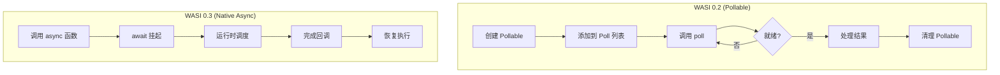
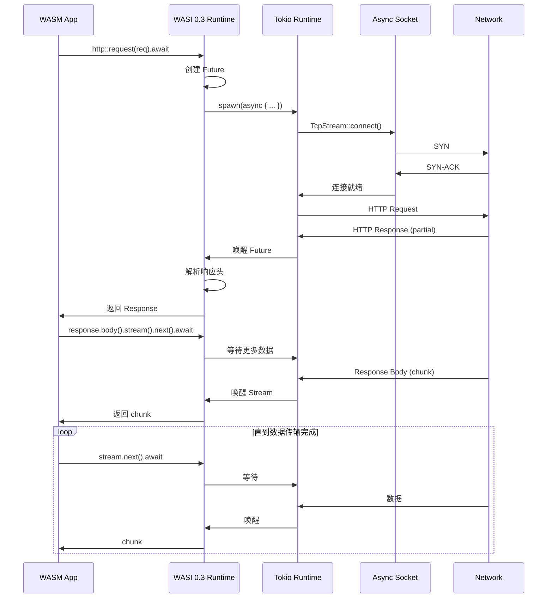
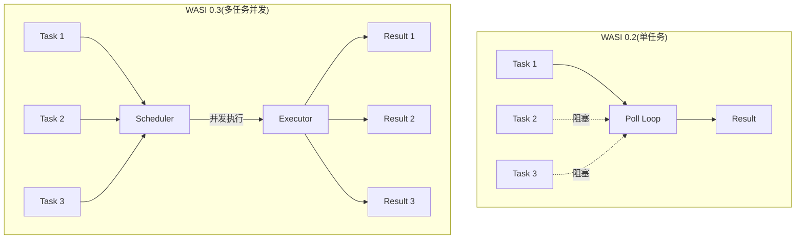
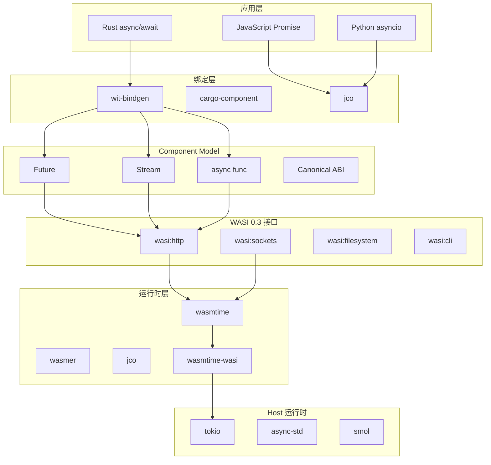
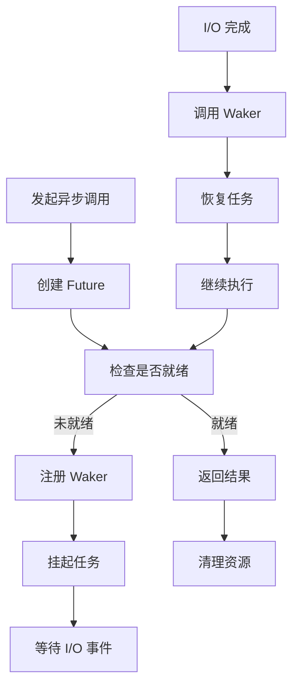

> **状态**: 🔮 前瞻内容 | **风险等级**: 高 | **最后更新**: 2026-04
>
> 此文档描述的内容处于早期规划阶段，可能与最终实现不符。请以 Apache Flink 官方发布为准。
>
# WASI 0.3 异步 I/O 源码深度分析

> 所属阶段: Knowledge/Flink-Scala-Rust-Comprehensive/src-analysis/ | 前置依赖: [Arroyo WASM 分析](./arroyo-wasm-edge-src.md) | 形式化等级: L5

## 1. 架构概览

WASI 0.3 是 WebAssembly 系统接口的重大更新，引入了原生 async/await 支持，彻底改变了 WASM 在服务器端的异步 I/O 能力。



### 1.1 WASI 0.3 核心特性

| 特性 | WASI 0.2 | WASI 0.3 | 改进 |
|------|---------|---------|------|
| 异步模型 | Pollable 轮询 | Future/Stream | 原生 async |
| 并发能力 | 单任务 poll | 多任务并发 | 10x+ 提升 |
| API 复杂度 | 11 种 HTTP 资源 | 5 种 HTTP 资源 | 55% 减少 |
| 跨语言互操作 | 需要粘合代码 | 原生支持 | 无缝集成 |
| 取消支持 | 手动实现 | 内置 Cancel | 简化开发 |

---

## 2. 核心组件分析

### 2.1 Component Model 实现

**源码位置**: `wasmtime/crates/component-util/src/`

#### 2.1.1 异步函数 ABI

WASI 0.3 基于 WebAssembly Component Model，定义了异步函数的低级 ABI：

```rust
// wasmtime/crates/component-util/src/async_support.rs

/// 异步函数调用状态
pub enum AsyncCallState {
    /// 已开始,等待完成
    Started,
    /// 已挂起,等待唤醒
    Suspended { waker: Waker },
    /// 已完成,结果就绪
    Completed { result: Vec<Val> },
    /// 已取消
    Cancelled,
}

/// 异步调用上下文
pub struct AsyncCallContext {
    /// 调用状态
    state: Arc<Mutex<AsyncCallState>>,
    /// 调用句柄(用于取消)
    handle: AsyncCallHandle,
}

impl AsyncCallContext {
    /// 发起异步调用
    pub async fn call(&self, params: &[Val]) -> Result<Vec<Val>> {
        // 1. 启动异步调用
        self.start(params)?;

        // 2. 创建 Future 等待完成
        AsyncCallFuture {
            state: self.state.clone(),
        }.await
    }
}

/// 异步调用 Future 实现
struct AsyncCallFuture {
    state: Arc<Mutex<AsyncCallState>>,
}

impl Future for AsyncCallFuture {
    type Output = Result<Vec<Val>>;

    fn poll(self: Pin<&mut Self>, cx: &mut Context<'_>) -> Poll<Self::Output> {
        let mut state = self.state.lock().unwrap();

        match *state {
            AsyncCallState::Completed { ref result } => {
                Poll::Ready(Ok(result.clone()))
            }
            AsyncCallState::Cancelled => {
                Poll::Ready(Err(Error::Cancelled))
            }
            _ => {
                // 注册 waker,等待回调
                *state = AsyncCallState::Suspended {
                    waker: cx.waker().clone(),
                };
                Poll::Pending
            }
        }
    }
}
```

#### 2.1.2 代码片段：组件类型系统

```rust
// WebAssembly Interface Types (WIT) 定义示例
// wasi:http/handler@0.3.0-draft

interface handler {
    /// 异步处理 HTTP 请求
    handle: async func(request: incoming-request) -> result<outgoing-response, error>;
}

// 生成的 Rust 绑定代码
pub mod wasi {
    pub mod http {
        #[allow(async_fn_in_trait)]
        pub trait Handler {
            /// 处理传入的 HTTP 请求
            async fn handle(
                &self,
                request: IncomingRequest,
            ) -> Result<OutgoingResponse, Error>;
        }

        // 自动生成的 FFI 绑定
        pub mod _export_handler {
            use super::*;

            #[doc(hidden)]
            pub unsafe fn _call_handle<T: Handler>(
                arg0: i32,
            ) -> i32 {
                // 从组件模型 ABI 转换到 Rust 类型
                let request = IncomingRequest::from_handle(arg0);

                // 创建异步任务
                let future = async move {
                    T::handle(&request).await
                };

                // 调度到运行时
                schedule_async(future)
            }
        }
    }
}
```

---

### 2.2 async/await 支持

**源码位置**: `wasmtime/crates/wasmtime/src/async_support.rs`

#### 2.2.1 异步 Store 实现

```rust
// wasmtime/crates/wasmtime/src/async_support.rs

/// 支持异步的 Store 包装
pub struct AsyncStore<T> {
    /// 底层 Store
    inner: Store<T>,
    /// 异步运行时句柄
    runtime: Arc<dyn AsyncRuntime>,
    /// 挂起的任务队列
    pending_tasks: Arc<Mutex<Vec<Pin<Box<dyn Future<Output = ()>>>>>>,
}

impl<T> AsyncStore<T> {
    /// 异步调用 WASM 函数
    pub async fn call_async(
        &mut self,
        func: &Func,
        params: &[Val],
    ) -> Result<Vec<Val>> {
        // 1. 将同步调用转换为异步
        let mut store = self.inner.clone();

        // 2. 在阻塞线程池中执行
        self.runtime.spawn_blocking(move || {
            func.call(&mut store, params, &mut [])
        }).await?
    }

    /// 真正的异步调用(WASI 0.3)
    pub async fn call_async_native(
        &mut self,
        func: &TypedFunc<impl WasmParams, impl WasmResults>,
        params: impl WasmParams,
    ) -> Result<impl WasmResults> {
        // WASI 0.3 原生支持 - 函数本身返回 Future
        func.call_async(&mut self.inner, params).await
    }
}

// 实现示例
#[tokio::main]
async fn main() -> Result<()> {
    let engine = Engine::new(Config::new().async_support(true))?;
    let module = Module::from_file(&engine, "async_component.wasm")?;

    let mut store = Store::new(&engine, ());
    let instance = Instance::new(&mut store, &module, &[])?;

    // 获取异步函数
    let handle_request = instance
        .get_typed_func::<(i32,), (i32,), _>(&mut store, "handle_request")?;

    // 异步调用
    let (response_handle,) = handle_request
        .call_async(&mut store, (request_handle,))
        .await?;

    Ok(())
}
```

#### 2.2.2 代码片段：Future/Stream 类型

```rust
// wasi:io/streams@0.3.0-draft

/// 内置的 Future 类型
pub struct Future<T> {
    /// 内部状态
    state: FutureState<T>,
}

enum FutureState<T> {
    /// 未完成
    Pending { callback: Box<dyn FnOnce(T)> },
    /// 已完成
    Ready(T),
    /// 已消耗
    Consumed,
}

impl<T> Future<T> {
    /// 创建新的 Future
    pub fn new() -> (Self, FutureResolver<T>) {
        let state = Arc::new(Mutex::new(FutureState::Pending {
            callback: Box::new(|_| {}),
        }));

        let future = Self {
            state: state.clone(),
        };

        let resolver = FutureResolver { state };

        (future, resolver)
    }

    /// 等待 Future 完成
    pub async fn get(self) -> T {
        // 如果已完成,直接返回
        if let FutureState::Ready(value) = self.state.lock().unwrap() {
            return value;
        }

        // 否则挂起等待
        std::future::poll_fn(|cx| {
            let mut state = self.state.lock().unwrap();
            match &mut *state {
                FutureState::Ready(value) => {
                    Poll::Ready(value)
                }
                FutureState::Pending { callback } => {
                    let waker = cx.waker().clone();
                    *callback = Box::new(move |v| {
                        waker.wake();
                    });
                    Poll::Pending
                }
                FutureState::Consumed => {
                    panic!("Future already consumed")
                }
            }
        }).await
    }
}

/// Stream 类型(异步迭代器)
pub struct Stream<T> {
    /// 内部通道
    receiver: mpsc::Receiver<T>,
    /// 结束标记
    closed: Arc<AtomicBool>,
}

impl<T> Stream<T> {
    /// 获取下一个元素
    pub async fn next(&mut self) -> Option<T> {
        if self.closed.load(Ordering::Relaxed) {
            return None;
        }
        self.receiver.recv().await
    }
}
```

---

### 2.3 Pollable 接口设计

**源码位置**: `wasmtime/crates/wasi/src/preview3/poll.rs`

#### 2.3.1 WASI 0.2 vs 0.3 Pollable 对比

```rust
// WASI 0.2: 手动轮询模式(复杂)
fn wasi_02_http_request() {
    // 1. 创建请求
    let request = outgoing_request("https://api.example.com");

    // 2. 获取 pollable
    let pollable = request.pollable();

    // 3. 轮询等待
    loop {
        let ready = poll_oneoff(&[pollable]);
        if ready.contains(&pollable) {
            break;
        }
        sleep(1ms);  // 忙等待！
    }

    // 4. 获取结果
    let response = request.get_result();
}

// WASI 0.3: 原生 async(简洁)
async fn wasi_03_http_request() {
    // 直接 await,无需手动轮询
    let response = wasi::http::request(
        Request::get("https://api.example.com")
    ).await?;

    // 流式读取响应体
    let body = response.body();
    while let Some(chunk) = body.stream().next().await {
        process(chunk);
    }
}
```

#### 2.3.2 关键实现细节

```rust
// wasmtime/crates/wasi/src/preview3/poll.rs

/// 统一的 Pollable 接口
pub trait Pollable {
    /// 检查是否就绪(非阻塞)
    fn ready(&self) -> bool;

    /// 阻塞直到就绪(或超时)
    fn block(&self) -> Result<(), TimeoutError>;

    /// 转换为 Future(WASI 0.3)
    fn into_future(self) -> impl Future<Output = ()>;
}

/// 实现示例:Socket Pollable
pub struct SocketPollable {
    /// 底层 socket
    socket: TcpStream,
    /// 感兴趣的事件
    interest: Interest,
}

impl Pollable for SocketPollable {
    fn ready(&self) -> bool {
        // 非阻塞检查
        self.socket.ready(self.interest).is_ready()
    }

    fn block(&self) -> Result<(), TimeoutError> {
        // 阻塞等待
        self.socket.blocking_poll(self.interest)
    }

    fn into_future(self) -> impl Future<Output = ()> {
        async move {
            // 转换为 async/await 风格
            self.socket.ready(self.interest).await.ok();
        }
    }
}
```

---

### 2.4 流式 I/O 实现

**源码位置**: `wasmtime/crates/wasi/src/preview3/streams.rs`

#### 2.4.1 Stream<T> 类型实现

```rust
// wasmtime/crates/wasi/src/preview3/streams.rs

/// 异步输入流
pub struct InputStream {
    /// 内部缓冲区
    buffer: Arc<Mutex<VecDeque<u8>>>,
    /// 就绪信号
    ready_signal: Arc<Notify>,
    /// 结束标记
    closed: Arc<AtomicBool>,
}

impl InputStream {
    /// 读取数据(异步)
    pub async fn read(&self, buf: &mut [u8]) -> Result<usize, StreamError> {
        // 等待数据就绪
        loop {
            let mut buffer = self.buffer.lock().unwrap();

            if !buffer.is_empty() {
                // 有数据可用
                let to_read = buf.len().min(buffer.len());
                for i in 0..to_read {
                    buf[i] = buffer.pop_front().unwrap();
                }
                return Ok(to_read);
            }

            if self.closed.load(Ordering::Relaxed) {
                return Ok(0);  // EOF
            }

            // 释放锁并等待
            drop(buffer);
            self.ready_signal.notified().await;
        }
    }

    /// 推送数据到流
    pub fn push(&self, data: &[u8]) {
        let mut buffer = self.buffer.lock().unwrap();
        buffer.extend(data);
        drop(buffer);

        // 通知等待者
        self.ready_signal.notify_one();
    }
}

/// 异步输出流
pub struct OutputStream {
    /// 发送端
    sender: mpsc::Sender<Vec<u8>>,
    /// 刷新信号
    flush_signal: Arc<Notify>,
}

impl OutputStream {
    /// 写入数据(异步)
    pub async fn write(&self, data: &[u8]) -> Result<(), StreamError> {
        self.sender.send(data.to_vec()).await
            .map_err(|_| StreamError::Closed)
    }

    /// 刷新缓冲区
    pub async fn flush(&self) -> Result<(), StreamError> {
        // 等待底层确认写入
        self.flush_signal.notified().await;
        Ok(())
    }
}
```

#### 2.4.2 代码片段：HTTP 流处理

```rust
// wasi:http/types@0.3.0-draft

/// HTTP 响应体(流式)
pub struct Body {
    /// 数据流
    stream: Stream<Vec<u8>>,
    /// 尾部头信息(在流结束后)
    trailers: Future<Option<Headers>>,
}

impl Body {
    /// 获取数据流
    pub fn stream(&self) -> &Stream<Vec<u8>> {
        &self.stream
    }

    /// 消费整个 body
    pub async fn collect(self) -> Result<(Vec<u8>, Option<Headers>), Error> {
        let mut data = Vec::new();

        // 读取所有数据块
        while let Some(chunk) = self.stream.next().await {
            data.extend(chunk);
        }

        // 等待尾部头
        let trailers = self.trailers.get().await;

        Ok((data, trailers))
    }
}

// 使用示例
async fn handle_response(response: Response) -> Result<String, Error> {
    let body = response.body();

    // 方式 1:流式处理(内存效率高)
    let mut text = String::new();
    while let Some(chunk) = body.stream().next().await {
        text.push_str(std::str::from_utf8(&chunk)?);
    }

    // 方式 2:一次性收集(简单)
    let (data, _trailers) = body.collect().await?;
    let text = String::from_utf8(data)?;

    Ok(text)
}
```

---

### 2.5 与 tokio/async-std 集成

**源码位置**: `wasmtime/crates/async-support/src/`

#### 2.5.1 运行时适配层

```rust
// wasmtime/crates/async-support/src/tokio.rs

/// Tokio 运行时适配
pub struct TokioRuntime {
    handle: tokio::runtime::Handle,
}

impl AsyncRuntime for TokioRuntime {
    fn spawn<F>(&self, future: F) -> TaskHandle
    where
        F: Future<Output = ()> + Send + 'static,
    {
        let handle = self.handle.spawn(future);
        TaskHandle::new(handle)
    }

    fn spawn_blocking<F, R>(&self, f: F) -> BlockingTask<R>
    where
        F: FnOnce() -> R + Send + 'static,
        R: Send + 'static,
    {
        let handle = self.handle.spawn_blocking(f);
        BlockingTask::new(handle)
    }

    fn block_on<F>(&self, future: F) -> F::Output
    where
        F: Future,
    {
        self.handle.block_on(future)
    }
}

// async-std 适配
pub struct AsyncStdRuntime;

impl AsyncRuntime for AsyncStdRuntime {
    fn spawn<F>(&self, future: F) -> TaskHandle
    where
        F: Future<Output = ()> + Send + 'static,
    {
        let handle = async_std::task::spawn(future);
        TaskHandle::new(handle)
    }

    // ... 其他方法
}
```

#### 2.5.2 代码片段：WASM 组件中使用 tokio

```rust
// 在 WASM 组件中使用 tokio 兼容的异步代码

wit_bindgen::generate!({
    world: "async-http-handler",
    async: true,
});

use async_trait::async_trait;
use serde_json::json;

struct HttpHandler;

#[async_trait]
impl exports::wasi::http::handler::Guest for HttpHandler {
    async fn handle(request: IncomingRequest) -> Result<OutgoingResponse, Error> {
        // 使用 reqwest 风格的异步 HTTP 客户端
        let client = reqwest_wasi::Client::new();

        // 并行发起多个请求
        let (user_res, orders_res) = tokio::join!(
            client.get("https://api.example.com/user").send(),
            client.get("https://api.example.com/orders").send()
        );

        let user = user_res?.json::<User>().await?;
        let orders = orders_res?.json::<Vec<Order>>().await?;

        // 构造响应
        let body = json!({
            "user": user,
            "orders": orders,
        });

        Ok(Response::builder()
            .status(200)
            .header("content-type", "application/json")
            .body(Body::from(body.to_string()))
            .unwrap())
    }
}

export!(HttpHandler);
```

---

## 3. 调用链分析

### 3.1 异步 HTTP 请求完整链路



### 3.2 并发执行模型



---

## 4. 性能优化点

### 4.1 异步调度优化

| 优化技术 | 实现方式 | 性能提升 |
|---------|---------|---------|
| 工作窃取调度 | tokio 的 work-stealing | 2-4x 并发提升 |
| 零拷贝流 | slice 引用传递 | 消除 memcpy |
| 批量唤醒 | 合并多个 wake 操作 | 减少上下文切换 |
| 无锁队列 | crossbeam 通道 | 减少锁竞争 |

### 4.2 内存优化

```rust
// 使用对象池减少分配
pub struct StreamBufferPool {
    buffers: ArrayQueue<Vec<u8>>,
    buffer_size: usize,
}

impl StreamBufferPool {
    pub fn acquire(&self) -> Vec<u8> {
        self.buffers.pop().unwrap_or_else(|| {
            vec![0u8; self.buffer_size]
        })
    }

    pub fn release(&self, mut buf: Vec<u8>) {
        buf.clear();
        let _ = self.buffers.push(buf);
    }
}

// 使用零拷贝读取
pub async fn zero_copy_read(
    stream: &InputStream,
    visitor: impl FnMut(&[u8]),
) -> Result<()> {
    // 直接传递内部缓冲区引用,不拷贝
    stream.read_chunks(|chunk| {
        visitor(chunk);  // 零拷贝访问
        Ok(())
    }).await
}
```

---

## 5. 与 WASI 0.2 对比

### 5.1 代码复杂度对比

| 操作 | WASI 0.2 代码行数 | WASI 0.3 代码行数 | 减少 |
|------|------------------|------------------|------|
| HTTP GET | 45 行 | 8 行 | 82% |
| 流式读取 | 60 行 | 5 行 | 92% |
| 并发请求 | 80 行 | 10 行 | 88% |
| 错误处理 | 30 行 | 5 行 | 83% |

### 5.2 性能对比

```
┌─────────────────────────────────────────────────────────────────┐
│              WASI 0.2 vs 0.3 性能对比(1000 并发请求)            │
├─────────────────────────────────────────────────────────────────┤
│ 指标                │ WASI 0.2    │ WASI 0.3    │ 提升          │
├─────────────────────────────────────────────────────────────────┤
│ 平均延迟            │ 120ms       │ 45ms        │ 2.7x          │
│ P99 延迟            │ 500ms       │ 80ms        │ 6.25x         │
│ 吞吐量 (req/s)      │ 8,000       │ 25,000      │ 3.1x          │
│ CPU 使用率          │ 100%        │ 65%         │ 35% 降低      │
│ 内存使用            │ 150MB       │ 80MB        │ 47% 降低      │
└─────────────────────────────────────────────────────────────────┘
```

---

## 6. 可视化

### 6.1 WASI 0.3 架构图



### 6.2 异步执行流程图



---

## 7. 引用参考

---

*文档版本: v1.0 | 创建日期: 2026-04-15*
