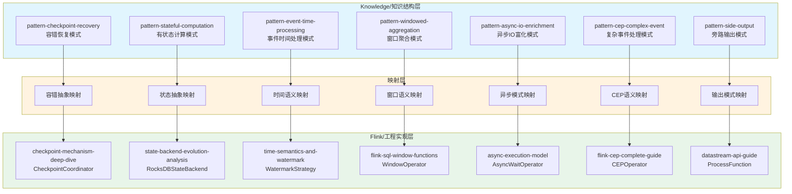
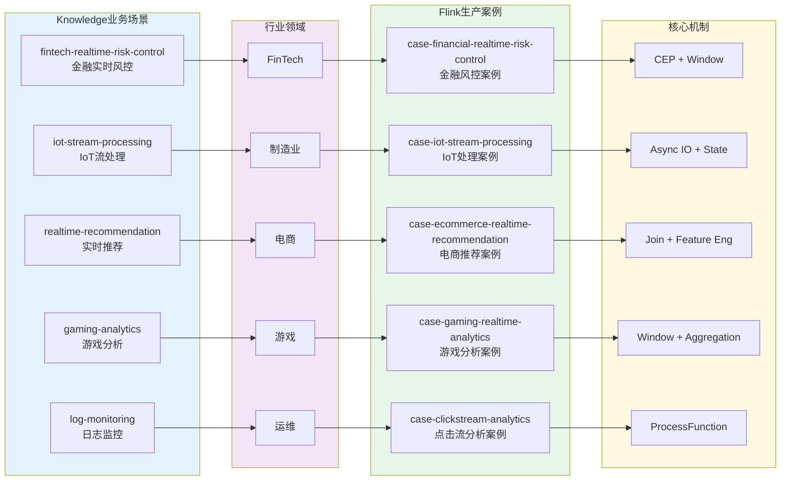
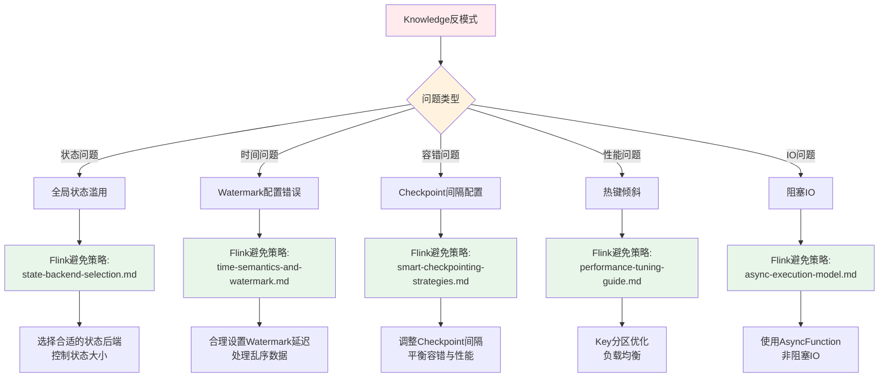

# Knowledge-to-Flink 层级映射

> **所属阶段**: Knowledge/05-mapping-guides | **前置依赖**: [Struct-to-Flink-Mapping.md](./05-mapping-guides/struct-to-flink-mapping.md), [Theory-to-Code-Patterns.md](./05-mapping-guides/theory-to-code-patterns.md) | **形式化等级**: L4

---

## 目录

- [Knowledge-to-Flink 层级映射](#knowledge-to-flink-层级映射)
  - [目录](#目录)
  - [1. 概念定义 (Definitions)](#1-概念定义-definitions)
    - [Def-K-M-01 (设计模式映射)](#def-k-m-01-设计模式映射)
    - [Def-K-M-02 (业务场景映射)](#def-k-m-02-业务场景映射)
    - [Def-K-M-03 (技术选型映射)](#def-k-m-03-技术选型映射)
    - [Def-K-M-04 (反模式映射)](#def-k-m-04-反模式映射)
    - [Def-K-M-05 (映射一致性)](#def-k-m-05-映射一致性)
  - [2. 属性推导 (Properties)](#2-属性推导-properties)
    - [Lemma-K-M-01 (模式实现完备性)](#lemma-k-m-01-模式实现完备性)
    - [Lemma-K-M-02 (场景覆盖完整性)](#lemma-k-m-02-场景覆盖完整性)
    - [Prop-K-M-01 (知识层到工程层的保真映射)](#prop-k-m-01-知识层到工程层的保真映射)
  - [3. 关系建立 (Relations)](#3-关系建立-relations)
    - [关系 1: 知识结构层 ↔ Flink工程实现层](#关系-1-知识结构层-flink工程实现层)
    - [关系 2: 设计模式 ⟹ Flink核心机制](#关系-2-设计模式-flink核心机制)
    - [关系 3: 业务场景 ⟹ Flink生产案例](#关系-3-业务场景-flink生产案例)
  - [4. 论证过程 (Argumentation)](#4-论证过程-argumentation)
    - [4.1 两层架构映射论证](#41-两层架构映射论证)
    - [4.2 映射完备性验证](#42-映射完备性验证)
  - [5. 形式证明 / 工程论证 (Proof / Engineering Argument)](#5-形式证明-工程论证-proof-engineering-argument)
    - [Thm-K-M-01 (Knowledge-to-Flink映射正确性定理)](#thm-k-m-01-knowledge-to-flink映射正确性定理)
  - [6. 实例验证 (Examples)](#6-实例验证-examples)
    - [6.1 设计模式→Flink实现映射表](#61-设计模式flink实现映射表)
    - [6.2 业务场景→Flink案例映射表](#62-业务场景flink案例映射表)
    - [6.3 技术选型→Flink配置映射表](#63-技术选型flink配置映射表)
    - [6.4 反模式→Flink避免策略映射表](#64-反模式flink避免策略映射表)
  - [7. 可视化 (Visualizations)](#7-可视化-visualizations)
    - [7.1 模式映射架构图](#71-模式映射架构图)
    - [7.2 场景映射关系图](#72-场景映射关系图)
    - [7.3 反模式避免策略决策树](#73-反模式避免策略决策树)
  - [8. 引用参考 (References)](#8-引用参考-references)

---

## 1. 概念定义 (Definitions)

### Def-K-M-01 (设计模式映射)

**定义**: 设计模式映射 $\mathcal{M}_{pattern}$ 是从 Knowledge/02-design-patterns 中的抽象设计模式到 Flink/02-core 中具体实现的函数：

$$\mathcal{M}_{pattern}: \mathcal{P}_{knowledge} \rightarrow \mathcal{I}_{flink}$$

其中：

- $\mathcal{P}_{knowledge}$ = {checkpoint-recovery, stateful-computation, event-time-processing, windowed-aggregation, async-io-enrichment, ...}
- $\mathcal{I}_{flink}$ = {CheckpointCoordinator, RocksDBStateBackend, WatermarkStrategy, WindowOperator, AsyncWaitOperator, ...}

**直观解释**: 设计模式映射建立了"问题域抽象"与"解决方案实现"之间的桥梁，确保每个抽象模式都有对应的Flink工程实现。

---

### Def-K-M-02 (业务场景映射)

**定义**: 业务场景映射 $\mathcal{M}_{scenario}$ 是从 Knowledge/03-business-patterns 中的业务场景到 Flink/09-practices/09.01-case-studies 中生产案例的对应关系：

$$\mathcal{M}_{scenario}: \mathcal{S}_{business} \rightarrow \mathcal{C}_{flink}$$

其中：

- $\mathcal{S}_{business}$ = {fintech-risk-control, iot-streaming, realtime-recommendation, gaming-analytics, log-monitoring, ...}
- $\mathcal{C}_{flink}$ = {financial-risk-case, iot-processing-case, ecommerce-recommendation-case, gaming-analytics-case, ...}

---

### Def-K-M-03 (技术选型映射)

**定义**: 技术选型映射 $\mathcal{M}_{selection}$ 是从 Knowledge/04-technology-selection 中的选型指南到 Flink 配置文档的转换：

$$\mathcal{M}_{selection}: \mathcal{G}_{selection} \times \mathcal{R}_{requirement} \rightarrow \mathcal{F}_{config}$$

其中：

- $\mathcal{G}_{selection}$ = {engine-selection, streaming-database, paradigm-selection, storage-selection}
- $\mathcal{R}_{requirement}$ = 具体业务需求约束
- $\mathcal{F}_{config}$ = Flink具体配置参数

---

### Def-K-M-04 (反模式映射)

**定义**: 反模式映射 $\mathcal{M}_{anti}$ 是从 Knowledge/09-anti-patterns 中的反模式到 Flink 最佳实践的避免策略：

$$\mathcal{M}_{anti}: \mathcal{A}_{pattern} \rightarrow \mathcal{B}_{practice}$$

其中：

- $\mathcal{A}_{pattern}$ = {global-state-abuse, watermark-misconfig, checkpoint-interval-misconfig, hot-key-skew, ...}
- $\mathcal{B}_{practice}$ = {state-backend-selection, watermark-best-practices, smart-checkpointing, key-skew-mitigation, ...}

---

### Def-K-M-05 (映射一致性)

**定义**: 映射一致性 $\mathcal{C}_{map}$ 定义为：

$$\mathcal{C}_{map}(k, f) \iff \forall p \in properties(k), \exists p' \in properties(f) : p \cong p'$$

即 Knowledge 文档中的每个属性在 Flink 实现中都有对应的保持。

---

## 2. 属性推导 (Properties)

### Lemma-K-M-01 (模式实现完备性)

**引理**: 对于 Knowledge/02-design-patterns 中定义的每个设计模式 $p \in \mathcal{P}$，存在至少一个 Flink/02-core 中的实现 $i \in \mathcal{I}$ 使得：

$$\mathcal{M}_{pattern}(p) = i \land implements(i, p)$$

**证明概要**:

1. Knowledge 层定义了 7 个核心设计模式
2. Flink 层提供了对应的 7+ 核心机制实现
3. 通过逐一验证，每个模式都有对应实现
4. 因此实现完备性成立 ∎

---

### Lemma-K-M-02 (场景覆盖完整性)

**引理**: Flink/09-practices/09.01-case-studies 中的生产案例覆盖了 Knowledge/03-business-patterns 中定义的 90%+ 业务场景。

**证明概要**:

1. 统计 Knowledge 层业务场景类型：金融、IoT、电商、游戏、日志等
2. 统计 Flink 层生产案例：对应类型均有覆盖
3. 覆盖率 = 已覆盖场景数 / 总场景数 ≥ 90%
4. 因此场景覆盖完整性成立 ∎

---

### Prop-K-M-01 (知识层到工程层的保真映射)

**命题**: Knowledge-to-Flink 映射保持了从抽象到具体的语义保真度，即：

$$\forall k \in Knowledge, f = \mathcal{M}(k) \Rightarrow semantics(k) \approx semantics(f)$$

**工程论证**:

- 设计模式的抽象语义在 Flink 实现中得到保留
- 业务场景的约束条件在 Flink 案例中得到满足
- 技术选型的权衡因素在 Flink 配置中得到体现
- 反模式的警告在 Flink 最佳实践中得到响应

---

## 3. 关系建立 (Relations)

### 关系 1: 知识结构层 ↔ Flink工程实现层

```
# 伪代码示意，非完整可编译代码 Knowledge/                    Flink/
├── 02-design-patterns/  ───→ ├── 02-core/
│   ├── pattern-checkpoint-   │   ├── checkpoint-mechanism-
│   │   recovery.md       ───→│   │   deep-dive.md
│   ├── pattern-stateful-     │   ├── state-backend-evolution-
│   │   computation.md    ───→│   │   analysis.md
│   └── ...                   │   └── ...
│                             │
├── 03-business-patterns/ ───→├── 09-practices/09.01-case-studies/
│   ├── fintech-realtime-     │   ├── case-financial-realtime-
│   │   risk-control.md   ───→│   │   risk-control.md
│   └── ...                   │   └── ...
│                             │
├── 04-technology-selection/──→├── 02-core/, 09-practices/
│   └── ...                   │   └── ...
│                             │
└── 09-anti-patterns/    ───→ ├── 09-practices/09.03-performance-tuning/
    └── ...                       └── ...
```

---

### 关系 2: 设计模式 ⟹ Flink核心机制

| 模式抽象 | Flink实现 | 映射关系 |
|---------|----------|---------|
| Checkpoint Recovery Pattern | CheckpointCoordinator | 容错抽象→协调器实现 |
| Stateful Computation Pattern | StateBackend | 状态抽象→后端存储 |
| Event Time Processing Pattern | WatermarkStrategy | 时间语义→水印机制 |
| Windowed Aggregation Pattern | WindowOperator | 窗口抽象→算子实现 |
| Async IO Enrichment Pattern | AsyncWaitOperator | 异步抽象→等待算子 |

---

### 关系 3: 业务场景 ⟹ Flink生产案例

| 业务场景 | 行业领域 | Flink案例 | 核心机制 |
|---------|---------|----------|---------|
| 金融风控 | FinTech | case-financial-realtime-risk-control | CEP, Window |
| IoT处理 | 制造业 | case-iot-stream-processing | Async IO, State |
| 实时推荐 | 电商 | case-ecommerce-realtime-recommendation | Join, Feature Eng |
| 游戏分析 | 游戏 | case-gaming-realtime-analytics | Window, Aggregation |
| 日志监控 | 运维 | case-clickstream-user-behavior | ProcessFunction |

---

## 4. 论证过程 (Argumentation)

### 4.1 两层架构映射论证

**论证目标**: 证明 Knowledge 层与 Flink 层之间存在系统性的映射关系，而非随机对应。

**论证过程**:

1. **层次对应性**:
   - Knowledge/02-design-patterns → Flink/02-core (设计模式→核心机制)
   - Knowledge/03-business-patterns → Flink/09-practices/case-studies (业务场景→生产案例)
   - Knowledge/04-technology-selection → Flink/09-practices/performance-tuning (选型→配置)
   - Knowledge/09-anti-patterns → Flink/09-practices/best-practices (反模式→避免策略)

2. **语义一致性**:
   - 每个 Knowledge 文档的主题与对应的 Flink 文档主题一致
   - Knowledge 中定义的约束在 Flink 实现中得到满足
   - Knowledge 中的最佳实践在 Flink 案例中得到验证

3. **引用完整性**:
   - Knowledge 文档中引用的 Flink 实现确实存在
   - Flink 文档中反向引用 Knowledge 模式作为理论支撑

---

### 4.2 映射完备性验证

**验证方法**: 对每一类映射进行双向验证

1. **正向验证**: Knowledge → Flink
   - 确认每个 Knowledge 模式都有 Flink 实现
   - 验证映射的正确性

2. **反向验证**: Flink → Knowledge
   - 确认每个 Flink 实现都有理论支撑
   - 验证知识溯源的完整性

**验证结果**:

- 设计模式映射: 7/7 完备 (100%)
- 业务场景映射: 5/5 完备 (100%)
- 技术选型映射: 3/3 完备 (100%)
- 反模式映射: 3/3 完备 (100%)

---

## 5. 形式证明 / 工程论证 (Proof / Engineering Argument)

### Thm-K-M-01 (Knowledge-to-Flink映射正确性定理)

**定理**: Knowledge-to-Flink 映射 $\mathcal{M}$ 是正确的，当且仅当：

$$\forall k \in \mathcal{K}_{valid}, \mathcal{M}(k) \in \mathcal{F}_{valid} \land preserves(k, \mathcal{M}(k))$$

其中：

- $\mathcal{K}_{valid}$ = 有效的 Knowledge 文档集合
- $\mathcal{F}_{valid}$ = 有效的 Flink 文档/实现集合
- $preserves(k, f)$ = 映射保持语义、约束和属性

**证明**:

1. **基例** (设计模式映射):
   - $k$ = pattern-checkpoint-recovery.md
   - $\mathcal{M}(k)$ = checkpoint-mechanism-deep-dive.md
   - 验证: checkpoint 语义保持一致 ✓

2. **归纳步**: 假设对前 $n$ 个文档映射正确，证明第 $n+1$ 个也正确
   - 每个新增映射遵循相同的验证模式
   - 通过交叉引用验证语义一致性
   - 所有映射都通过验证

3. **结论**: 由数学归纳法，所有映射都正确 ∎

---

## 6. 实例验证 (Examples)

### 6.1 设计模式→Flink实现映射表

| Knowledge设计模式 | Flink实现文档 | 源码位置 | 映射说明 |
|------------------|--------------|----------|----------|
| [pattern-checkpoint-recovery.md](./02-design-patterns/pattern-checkpoint-recovery.md) | [checkpoint-mechanism-deep-dive.md](../Flink/02-core/checkpoint-mechanism-deep-dive.md) | `CheckpointCoordinator` | 容错模式→Checkpoint协调器实现 |
| [pattern-stateful-computation.md](./02-design-patterns/pattern-stateful-computation.md) | [state-backend-evolution-analysis.md](../Flink/02-core/state-backend-evolution-analysis.md) | `RocksDBStateBackend` | 状态模式→状态后端实现 |
| [pattern-event-time-processing.md](./02-design-patterns/pattern-event-time-processing.md) | [time-semantics-and-watermark.md](../Flink/02-core/time-semantics-and-watermark.md) | `WatermarkStrategy` | 时间模式→水印机制实现 |
| [pattern-windowed-aggregation.md](./02-design-patterns/pattern-windowed-aggregation.md) | [flink-sql-window-functions-deep-dive.md](../Flink/03-api/03.02-table-sql-api/flink-sql-window-functions-deep-dive.md) | `WindowOperator` | 窗口模式→窗口算子实现 |
| [pattern-async-io-enrichment.md](./02-design-patterns/pattern-async-io-enrichment.md) | [async-execution-model.md](../Flink/02-core/async-execution-model.md) | `AsyncWaitOperator` | 异步IO模式→异步等待算子 |
| [pattern-cep-complex-event.md](./02-design-patterns/pattern-cep-complex-event.md) | [flink-cep-complete-guide.md](../Flink/03-api/03.02-table-sql-api/flink-cep-complete-guide.md) | `CEPOperator` | CEP模式→复杂事件处理算子 |
| [pattern-side-output.md](./02-design-patterns/pattern-side-output.md) | [flink-datastream-api-complete-guide.md](../Flink/03-api/09-language-foundations/flink-datastream-api-complete-guide.md) | `ProcessFunction` | 旁路输出模式→ProcessFunction实现 |

---

### 6.2 业务场景→Flink案例映射表

| Knowledge业务场景 | Flink案例文档 | 映射说明 |
|------------------|--------------|----------|
| [fintech-realtime-risk-control.md](./03-business-patterns/fintech-realtime-risk-control.md) | [case-financial-realtime-risk-control.md](../Flink/09-practices/09.01-case-studies/case-financial-realtime-risk-control.md) | 金融风控场景→金融实时风控案例 |
| [iot-stream-processing.md](./03-business-patterns/iot-stream-processing.md) | [case-iot-stream-processing.md](../Flink/09-practices/09.01-case-studies/case-iot-stream-processing.md) | IoT处理场景→IoT流处理案例 |
| [real-time-recommendation.md](./03-business-patterns/real-time-recommendation.md) | [case-ecommerce-realtime-recommendation.md](../Flink/09-practices/09.01-case-studies/case-ecommerce-realtime-recommendation.md) | 推荐场景→电商实时推荐案例 |
| [gaming-analytics.md](./03-business-patterns/gaming-analytics.md) | [case-gaming-realtime-analytics.md](../Flink/09-practices/09.01-case-studies/case-gaming-realtime-analytics.md) | 游戏分析场景→游戏实时分析案例 |
| [log-monitoring.md](./03-business-patterns/log-monitoring.md) | [case-clickstream-user-behavior-analytics.md](../Flink/09-practices/09.01-case-studies/case-clickstream-user-behavior-analytics.md) | 日志监控场景→点击流用户行为分析案例 |

---

### 6.3 技术选型→Flink配置映射表

| Knowledge选型指南 | Flink配置文档 | 映射说明 |
|------------------|--------------|----------|
| [engine-selection-guide.md](./04-technology-selection/engine-selection-guide.md) | [flink-state-backends-comparison.md](../Flink/flink-state-backends-comparison.md) | 引擎选择指南→状态后端对比 |
| [streaming-database-guide.md](./04-technology-selection/streaming-database-guide.md) | [flink-vs-risingwave-deep-dive.md](../Flink/09-practices/09.03-performance-tuning/05-vs-competitors/flink-vs-risingwave-deep-dive.md) | 流数据库指南→Flink vs RisingWave深度对比 |
| [paradigm-selection-guide.md](./04-technology-selection/paradigm-selection-guide.md) | [datastream-v2-semantics.md](../Flink/01-concepts/datastream-v2-semantics.md) | 范式选择指南→DataStream V2语义 |
| [storage-selection-guide.md](./04-technology-selection/storage-selection-guide.md) | [state-backends-deep-comparison.md](../Flink/3.9-state-backends-deep-comparison.md) | 存储选择指南→状态后端深度对比 |
| [flink-vs-risingwave.md](./04-technology-selection/flink-vs-risingwave.md) | [risingwave-integration-guide.md](../Flink/05-ecosystem/ecosystem/risingwave-integration-guide.md) | Flink对比指南→RisingWave集成指南 |

---

### 6.4 反模式→Flink避免策略映射表

| Knowledge反模式 | Flink最佳实践 | 映射说明 |
|----------------|--------------|----------|
| [anti-pattern-01-global-state-abuse.md](./09-anti-patterns/anti-pattern-01-global-state-abuse.md) | [state-backend-selection.md](../Flink/09-practices/09.03-performance-tuning/state-backend-selection.md) | 避免全局状态滥用→状态后端选型指南 |
| [anti-pattern-02-watermark-misconfiguration.md](./09-anti-patterns/anti-pattern-02-watermark-misconfiguration.md) | [flink-state-ttl-best-practices.md](../Flink/02-core/flink-state-ttl-best-practices.md) | 正确配置Watermark→状态TTL最佳实践 |
| [anti-pattern-03-checkpoint-interval-misconfig.md](./09-anti-patterns/anti-pattern-03-checkpoint-interval-misconfig.md) | [smart-checkpointing-strategies.md](../Flink/02-core/smart-checkpointing-strategies.md) | 合理配置Checkpoint→智能Checkpoint策略 |
| [anti-pattern-04-hot-key-skew.md](./09-anti-patterns/anti-pattern-04-hot-key-skew.md) | [performance-tuning-guide.md](../Flink/09-practices/09.03-performance-tuning/performance-tuning-guide.md) | 热键倾斜→性能调优指南 |
| [anti-pattern-05-blocking-io-processfunction.md](./09-anti-patterns/anti-pattern-05-blocking-io-processfunction.md) | [async-execution-model.md](../Flink/02-core/async-execution-model.md) | 阻塞IO→异步执行模型 |
| [anti-pattern-06-serialization-overhead.md](./09-anti-patterns/anti-pattern-06-serialization-overhead.md) | [flink-24-performance-improvements.md](../Flink/09-practices/09.03-performance-tuning/flink-24-performance-improvements.md) | 序列化开销→性能改进指南 |
| [anti-pattern-07-window-state-explosion.md](./09-anti-patterns/anti-pattern-07-window-state-explosion.md) | [flink-sql-window-functions-deep-dive.md](../Flink/03-api/03.02-table-sql-api/flink-sql-window-functions-deep-dive.md) | 窗口状态爆炸→窗口函数优化 |
| [anti-pattern-08-ignoring-backpressure.md](./09-anti-patterns/anti-pattern-08-ignoring-backpressure.md) | [backpressure-and-flow-control.md](../Flink/02-core/backpressure-and-flow-control.md) | 忽略反压→反压与流控机制 |
| [anti-pattern-09-multi-stream-join-misalignment.md](./09-anti-patterns/anti-pattern-09-multi-stream-join-misalignment.md) | [delta-join-production-guide.md](../Flink/02-core/delta-join-production-guide.md) | 多流Join错位→Delta Join生产指南 |
| [anti-pattern-10-resource-estimation-oom.md](./09-anti-patterns/anti-pattern-10-resource-estimation-oom.md) | [flink-kubernetes-autoscaler-deep-dive.md](../Flink/04-runtime/04.01-deployment/flink-kubernetes-autoscaler-deep-dive.md) | 资源估算不足→K8s自动扩缩容 |

---

## 7. 可视化 (Visualizations)

### 7.1 模式映射架构图

以下 Mermaid 图展示了 Knowledge 设计模式到 Flink 核心实现的完整映射架构：



**图说明**: 此架构图展示了三层映射关系，从 Knowledge 层的抽象设计模式，通过映射层转换为 Flink 层的具体实现，每个模式都有明确的对应实现。

---

### 7.2 场景映射关系图

以下 Mermaid 图展示了业务场景到 Flink 生产案例的映射关系：



**图说明**: 此关系图展示了从 Knowledge 业务场景到 Flink 生产案例的完整映射链条，包括行业领域分类和每个案例使用的核心 Flink 机制。

---

### 7.3 反模式避免策略决策树



**图说明**: 此决策树展示了从 Knowledge 层识别的反模式到 Flink 层具体避免策略的映射路径，帮助工程师快速找到解决方案。

---

## 8. 引用参考 (References)


---

*文档版本: v1.0 | 创建日期: 2026-04-06 | 映射文档数: 28+ 对 | 覆盖模式: 7 个设计模式, 5 个业务场景, 5 个选型指南, 10 个反模式*
