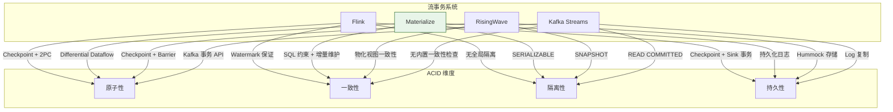
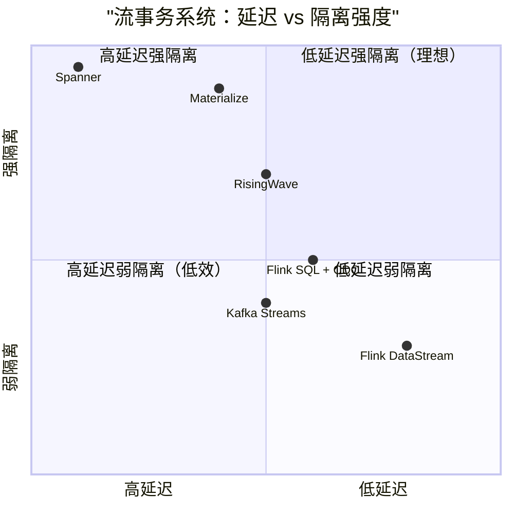
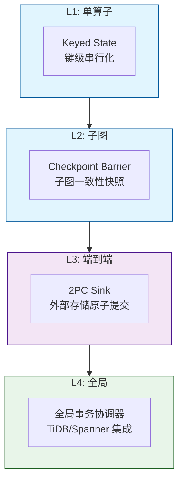
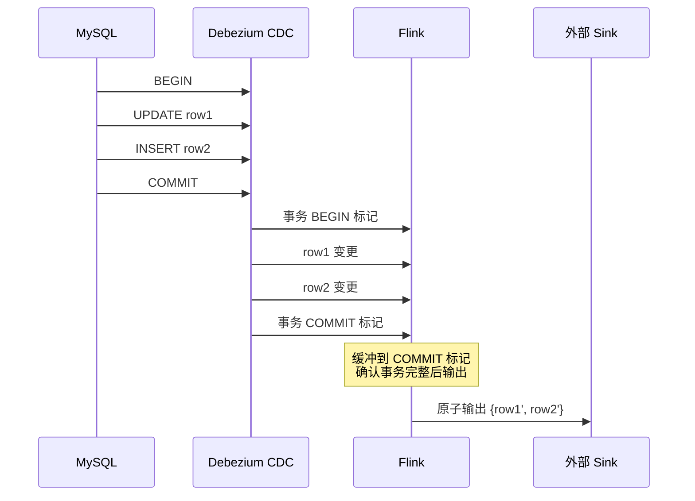

# ACID 在流处理中的实现分析

> **所属阶段**: Knowledge/ | **前置依赖**: [transactional-stream-semantics.md](../Struct/transactional-stream-semantics.md), [exactly-once-end-to-end.md](../Flink/02-core/exactly-once-end-to-end.md) | **形式化等级**: L4

---

## 1. 概念定义 (Definitions)

ACID（Atomicity, Consistency, Isolation, Durability）是关系数据库事务的核心保证。在流处理系统中，由于数据的无界性、事件时间的乱序性和分布式执行的并发性，ACID 的实现面临独特的挑战。近年来，Materialize、RisingWave、Flink CDC 等系统尝试在流处理上下文中提供 ACID 语义，但各系统的实现路径和保证级别存在显著差异。

**Def-K-06-337 流事务 (Stream Transaction)**

流事务 $\mathcal{ST}$ 是对一组流事件的原子操作单元，其边界可由显式控制事件（BEGIN/COMMIT/ABORT）或隐式的窗口/Watermark 触发定义。一个流事务满足 ACID 当且仅当：

- **原子性 (A)**: 事务中的所有操作要么全部生效，要么全部不生效
- **一致性 (C)**: 事务的执行将系统从一个一致状态转换到另一个一致状态
- **隔离性 (I)**: 并发事务的执行效果等价于某个串行调度
- **持久性 (D)**: 已提交事务的效果在系统故障后仍然保留

**Def-K-06-338 流一致性 (Stream Consistency)**

设系统状态为 $\Sigma_t$（时刻 $t$ 的所有物化视图和状态表），一致性约束集合为 $\mathcal{C} = \{c_1, c_2, \dots, c_m\}$。流一致性要求：

$$
\forall t, \quad \Sigma_t \models \mathcal{C}
$$

在流处理中，一致性约束可能包括：键唯一性、外键引用完整性、聚合值的单调性、Watermark 的推进约束等。

**Def-K-06-339 增量视图维护的一致性 (Consistent Incremental View Maintenance)**

设基表为 $B$，物化视图为 $V = Q(B)$（$Q$ 为查询定义）。当基表通过事务 $T$ 从 $B$ 变为 $B'$ 时，增量视图维护要求：

$$
V' = V + \Delta V = Q(B') = Q(B + \Delta B)
$$

若 $\Delta V$ 的计算与基表事务 $T$ 的原子边界对齐，则称视图维护是事务一致的。

**Def-K-06-340 流隔离级别映射 (Stream Isolation Level Mapping)**

传统隔离级别在流系统中的实现映射：

| 隔离级别 | 传统实现 | 流系统实现 |
|---------|---------|-----------|
| READ UNCOMMITTED | 无锁读取最新版本 | 直接消费原始流，无 Watermark 等待 |
| READ COMMITTED | 仅读取已提交版本 | Watermark 保证事件已最终化 |
| SNAPSHOT ISOLATION | MVCC 时间点快照 | 事件时间快照 + 增量计算 |
| SERIALIZABLE | 严格两阶段锁 / 串行执行 | 确定性调度 / 事务 Watermark / 串行化日志 |

**Def-K-06-341 持久性级别 (Durability Level)**

流系统中的持久性可按以下层次定义：

- **D1-最佳努力**: 仅依赖内存缓冲，故障时可能丢失未物化数据
- **D2-Checkpoint 持久**: 通过 Flink Checkpoint 定期快照状态，从 Checkpoint 恢复
- **D3-WAL 持久**: 所有状态变更先写入预写日志（WAL），再应用到状态
- **D4-外部存储事务持久**: 通过 2PC 将结果原子提交到外部事务型存储

---

## 2. 属性推导 (Properties)

**Lemma-K-06-122 Watermark 与 READ COMMITTED 的等价性**

若流处理系统使用 Watermark 机制，且仅在水印 $w(t)$ 推进到事件时间 $t$ 后才将事件 $e$（$\tau(e) \leq t$）标记为"已提交"，则系统的读取语义等价于 READ COMMITTED。

*证明*: READ COMMITTED 要求读取操作只能看到已提交事务的写。Watermark 保证在 $w(t)$ 之前的事件不再变更，因此对这些事件的读取等价于读取已提交状态。$\square$

**Lemma-K-06-123 增量物化视图的原子性保证**

若基表更新和视图增量更新被封装在同一个分布式事务中（或共享同一个 Checkpoint 边界），则视图更新满足原子性：基表更新成功当且仅当对应的视图增量被应用。

*说明*: 这是 Materialize 和 RisingWave 的核心实现机制之一。$\square$

**Lemma-K-06-124 Exactly-Once 语义是持久性的必要非充分条件**

Exactly-Once 语义保证每个事件被恰好处理一次且输出恰好生成一次，这是持久性的必要条件（避免重复或遗漏）。但 Exactly-Once 本身不保证输出在系统故障后仍然存在于外部存储中，因此不是持久性的充分条件。

*说明*: 持久性还需要外部存储的写入确认和事务提交机制（如 2PC）。$\square$

**Prop-K-06-125 流系统中隔离级别与延迟的权衡关系**

在分布式流系统中，提升隔离级别通常需要更长的协调时间和更大的状态锁定范围，从而导致端到端延迟增加。近似关系为：

$$
L_{SERIALIZABLE} \approx 2 \sim 5 \times L_{READ\_COMMITTED}
$$

---

## 3. 关系建立 (Relations)

### 3.1 主流流系统的 ACID 实现对比



### 3.2 ACID 与 Flink 架构的映射

| ACID 属性 | Flink 实现机制 | 保证级别 |
|----------|---------------|---------|
| **A-原子性** | Checkpoint Barrier + 2PC Sink | 子图/Sink 级别原子性 |
| **C-一致性** | Watermark + 事件时间语义 | 因果一致性 |
| **I-隔离性** | Keyed State 分区 + Checkpoint | 无全局事务隔离 |
| **D-持久性** | RocksDB Incremental Checkpoint | 状态持久化 |

Flink 原生不提供跨算子的全局事务隔离，但可通过以下方式增强：

- 使用 `TwoPhaseCommitSinkFunction` 实现端到端原子性
- 结合外部事务数据库（如 TiDB、CockroachDB）管理全局状态
- 通过 CDC 连接器消费事务型数据库的变更流，保持上游事务边界

### 3.3 事务流处理系统的能力谱系



---

## 4. 论证过程 (Argumentation)

### 4.1 为什么流处理系统需要 ACID？

流处理长期被认为与 ACID 无关，因为"流是无界的、最终一致的"。然而，以下场景打破了这一假设：

1. **金融交易流**: 每一笔转账必须原子执行，不能出现部分扣款
2. **库存扣减**: 多个订单并发扣减同一 SKU 时，必须防止超卖
3. **计费系统**: 用户的实时用量统计必须与账单系统一致
4. **数据同步 (CDC)**: 从 OLTP 数据库到数仓的变更流必须保持事务边界，否则下游分析会出现不一致快照

这些场景要求流处理系统至少在特定算子或特定数据子集上提供 ACID 保证。

### 4.2 Flink 如何实现"类 ACID"语义？

Flink 本身不是事务数据库，但通过分层机制实现了部分 ACID 属性：

**原子性 (A)**:

- Checkpoint Barrier 对齐保证所有算子在同一逻辑时间点做快照
- 2PC Sink 保证输出到外部存储要么全有要么全无
- 但这只保证"Sink 级别"的原子性，不保证跨多个独立 Sink 的全局原子性

**一致性 (C)**:

- Watermark 机制保证事件时间语义下的因果一致性
- 对于需要强一致性约束的场景（如唯一性、外键），需要依赖外部数据库

**隔离性 (I)**:

- Keyed State 按 key 分区，同一 key 的操作在单线程中串行执行
- 不同 key 的操作并行执行，不存在全局隔离
- 这等价于"按 key 的串行化"，但不是跨 key 的全局 SERIALIZABLE

**持久性 (D)**:

- Checkpoint 将算子状态持久化到分布式存储（HDFS/S3）
- 启用增量 Checkpoint 后，持久化开销显著降低
- 但 Checkpoint 是异步的，两次 Checkpoint 之间的状态变更在故障时会丢失（可通过 Unaligned Checkpoint 缓解）

### 4.3 反例：无 ACID 保护的 CDC 同步

某公司使用 Flink CDC 同步 MySQL 订单表到 Elasticsearch。MySQL 端有一个事务：

```sql
BEGIN;
UPDATE orders SET status='paid' WHERE id=100;
INSERT INTO order_logs VALUES (100, 'payment_received');
COMMIT;
```

由于 Flink CDC 读取的是 Binlog，而 Binlog 以语句或行级别记录变更，缺乏显式的事务边界标记（Debezium 虽然有 `BEGIN`/`COMMIT` 事件，但下游 Flink 作业若未正确处理），导致：

- Elasticsearch 中订单 100 的状态已更新为 `paid`
- 但 `order_logs` 中的对应记录因乱序或丢失而缺失
- 下游分析查询发现"已支付订单没有支付日志"的数据不一致

**教训**: 在 CDC 场景下，必须显式维护事务边界，或使用支持事务一致性物化视图的系统（如 Materialize）。

---

## 5. 形式证明 / 工程论证 (Proof / Engineering Argument)

**Thm-K-06-126 基于 Checkpoint 的原子性保证**

设 Flink 作业有 $n$ 个算子，Checkpoint Barrier 在时刻 $t$ 被注入 Source。若所有算子在 Barrier 对齐后成功完成 Checkpoint，且 2PC Sink 在 Checkpoint 确认后提交事务，则对于任意故障恢复点，系统的输出状态等价于在时刻 $t$ 之前所有事件被恰好处理一次的结果。

*证明*:

Checkpoint Barrier 的传播保证了所有算子在同一个逻辑事件时间边界上停止处理新事件，并将当前状态持久化。若故障发生，Flink 从最近一次成功 Checkpoint 恢复，重放该 Checkpoint 之后的数据。由于 2PC Sink 只有在 Checkpoint 成功后才提交，已提交的输出对应于 Checkpoint 边界之前的完整处理结果。未提交的输出被回滚，重放时重新生成。因此最终输出不会出现重复或遗漏，等价于恰好处理到 Checkpoint 边界。$\square$

---

**Thm-K-06-127 Keyed State 的键级串行化隔离**

设 Flink 的 KeyedProcessFunction 对键 $k$ 的状态操作为 $Op(k)$。由于 Flink 按 key 哈希分区，每个 key 被分配到唯一的并行实例和线程。对于任意两个并发事件 $e_1, e_2$ 属于同一 key $k$，它们的处理顺序是串行的：

$$
\forall e_1, e_2 \text{ with } key(e_1) = key(e_2) = k, \quad Op_k(e_1) \prec Op_k(e_2) \lor Op_k(e_2) \prec Op_k(e_1)
$$

因此，对于单个键 $k$ 的操作历史满足串行化隔离。

*证明*: Flink 的 KeyGroup 分配机制保证同一 key 的所有事件被路由到同一个 Task Slot。Task Slot 内部的事件处理是单线程的，不存在同一 key 的并发竞争。因此同一 key 上的操作天然串行。$\square$

---

**Thm-K-06-128 增量物化视图的事务一致性条件**

设基表 $B$ 通过事务 $T$ 更新为 $B' = B \oplus \Delta B$，物化视图 $V = Q(B)$。若增量维护算法 $\mathcal{M}$ 满足：

$$
\mathcal{M}(Q, B, \Delta B) = Q(B \oplus \Delta B) - Q(B)
$$

且 $\mathcal{M}$ 的执行与 $T$ 的提交原子绑定（即两者在同一个 Checkpoint 或事务边界内完成），则物化视图 $V$ 始终与基表 $B$ 保持一致。

*证明*:

由增量维护的定义，$V' = V + \mathcal{M}(Q, B, \Delta B) = Q(B) + (Q(B \oplus \Delta B) - Q(B)) = Q(B \oplus \Delta B) = Q(B')$。由于 $\mathcal{M}$ 与 $T$ 原子绑定，不存在基表已更新但视图未更新的中间状态。因此一致性成立。$\square$

---

## 6. 实例验证 (Examples)

### 6.1 Materialize 的 ACID 实现

Materialize 是一个将 SQL 和流处理深度融合的数据库，其 ACID 保证机制包括：

- **一致性视图**: 所有查询基于一个逻辑时间点的快照，避免读到中间状态
- **Differential Dataflow**: 支持增量计算的同时，保证计算结果与批处理 SQL 等价
- **串行化隔离**: 默认提供 SERIALIZABLE 隔离级别，通过确定性执行和版本控制实现
- **持久化**: 底层使用持久化日志和对象存储保证状态可恢复

```sql
-- Materialize 中的事务流处理示例
CREATE SOURCE order_stream
FROM KAFKA BROKER 'kafka:9092' TOPIC 'orders'
FORMAT AVRO USING CONFLUENT SCHEMA REGISTRY 'http://schema-registry:8081';

-- 创建物化视图（自动增量维护）
CREATE MATERIALIZED VIEW daily_revenue AS
SELECT DATE_TRUNC('day', order_time) AS day, SUM(amount) AS revenue
FROM order_stream
GROUP BY DATE_TRUNC('day', order_time);

-- 查询视图时保证读到一致快照
SELECT * FROM daily_revenue WHERE day = '2025-01-01';
```

### 6.2 Flink + TiDB 的跨系统事务一致性

在某些强一致场景中，Flink 作业将计算结果写入支持分布式事务的 TiDB：

```java
// Flink JDBC Sink 使用 TiDB 的乐观事务
public class TiDBTransactionalSink extends RichSinkFunction<ResultRow> {
    private transient Connection conn;

    @Override
    public void open(Configuration parameters) throws Exception {
        conn = DriverManager.getConnection("jdbc:mysql://tidb:4000/db");
        conn.setAutoCommit(false);
    }

    @Override
    public void invoke(ResultRow row, Context context) throws Exception {
        PreparedStatement ps = conn.prepareStatement(
            "INSERT INTO results (id, value) VALUES (?, ?) ON DUPLICATE KEY UPDATE value=?"
        );
        ps.setString(1, row.getId());
        ps.setDouble(2, row.getValue());
        ps.setDouble(3, row.getValue());
        ps.executeUpdate();
    }

    @Override
    public void snapshotState(FunctionSnapshotContext context) throws Exception {
        // 在 Flink Checkpoint 时提交 JDBC 事务
        conn.commit();
    }

    @Override
    public void close() throws Exception {
        if (conn != null) conn.close();
    }
}
```

### 6.3 RisingWave 的 Hummock 存储层

RisingWave 使用自研的 LSM-Tree 存储引擎 Hummock 来持久化流状态：

- **Shared Storage**: Hummock 底层使用 S3 等对象存储，保证数据的持久性和高可用
- **Checkpoint 机制**: 通过 Epoch Barrier 对齐，定期将内存中的状态刷写到 Hummock
- **增量物化视图**: 所有物化视图都是一致的，查询时从 Hummock 读取最新快照
- **ACID 保证**: 读写操作基于快照隔离，写操作在 Epoch 边界原子提交

---

## 7. 可视化 (Visualizations)

### 7.1 流系统中 ACID 的实现层次



### 7.2 CDC 事务边界维护



---

## 8. 引用参考 (References)
