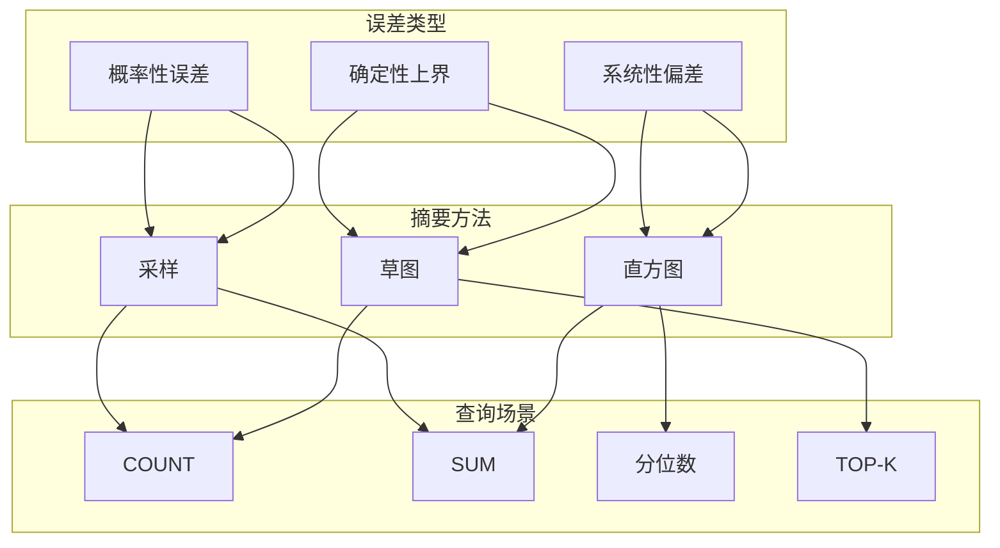
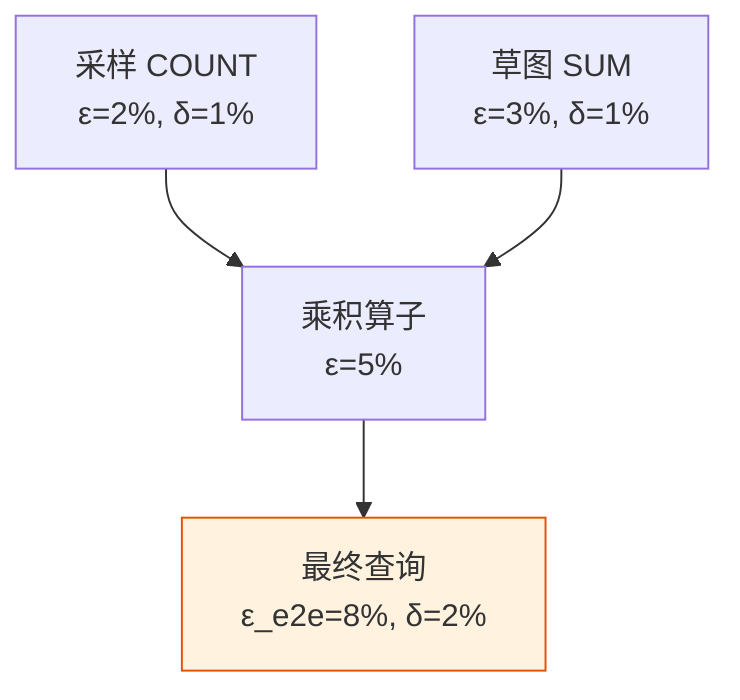
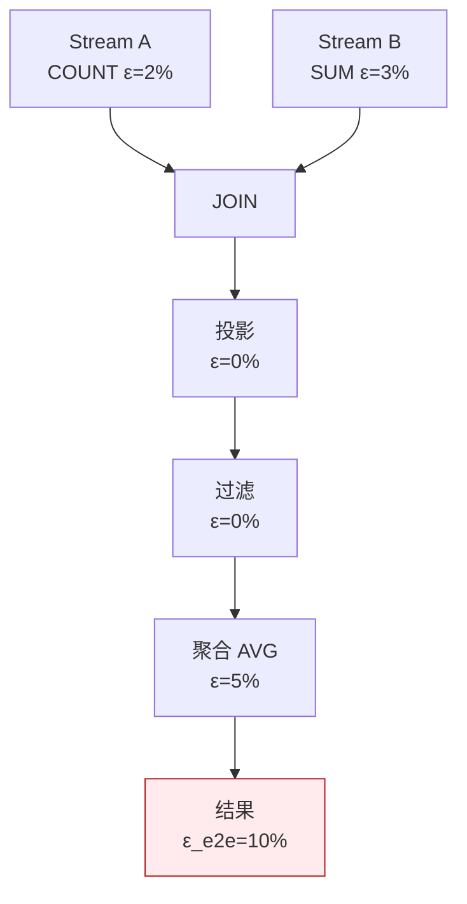

# 误差边界保证机制

> **所属阶段**: Knowledge/ | **前置依赖**: [aqp-streaming-formalization.md](../Struct/aqp-streaming-formalization.md), [unified-aqp-theory.md](../Struct/unified-aqp-theory.md) | **形式化等级**: L4

---

## 1. 概念定义 (Definitions)

近似查询处理（AQP）的核心价值在于用可控的精度损失换取显著的性能提升。
然而，"近似"本身如果没有明确的误差边界，就无法被用户信任和有效利用。
误差边界保证机制定义了如何为 AQP 结果计算置信区间、如何在复杂查询计划中传播误差，以及如何向用户呈现可解释的精度信息。
ThalamusDB（PACMMOD 2024）在这方面提出了针对流式场景的系统化方法。

**Def-K-06-378 AQP 误差边界 (AQP Error Bound)**

设近似查询结果为 $\hat{r}$，真实结果为 $r_{true}$。绝对误差边界 $\epsilon$ 和相对误差边界 $\epsilon_{rel}$ 分别定义为：

$$
|\hat{r} - r_{true}| \leq \epsilon \quad \text{和} \quad \frac{|\hat{r} - r_{true}|}{|r_{true}|} \leq \epsilon_{rel}
$$

若结果以概率至少 $1 - \delta$ 满足上述不等式，则称 $(\epsilon, \delta)$ 为该查询的有效误差边界。

**Def-K-06-379 流式查询置信区间 (Confidence Interval for Streaming Query)**

流式查询的置信区间是一个随时间动态更新的区间 $[L(t), U(t)]$，满足：

$$
P\left( r_{true}(t) \in [L(t), U(t)] \right) \geq 1 - \delta
$$

其中 $L(t) = \hat{r}(t) - \epsilon(t)$，$U(t) = \hat{r}(t) + \epsilon(t)$。当新数据到达或摘要更新时，$\hat{r}(t)$ 和 $\epsilon(t)$ 会被重新计算。

**Def-K-06-380 查询计划中的误差传播 (Error Propagation in Query Plan)**

对于由算子 $op_1, op_2, \dots, op_n$ 组成的查询计划 $\mathcal{P}$，若每个算子 $op_i$ 引入的误差为 $(\epsilon_i, \delta_i)$，则端到端误差 $(\epsilon_{e2e}, \delta_{e2e})$ 通过误差传播规则 $\mathcal{R}_{prop}$ 计算：

$$
(\epsilon_{e2e}, \delta_{e2e}) = \mathcal{R}_{prop}((\epsilon_1, \delta_1), (\epsilon_2, \delta_2), \dots, (\epsilon_n, \delta_n); \mathcal{P})
$$

常见的传播规则包括：

- **加法算子**: $\epsilon_{add} = \epsilon_1 + \epsilon_2$，$\delta_{add} = \delta_1 + \delta_2$
- **乘法算子**: $\epsilon_{mult} = |r_1|\epsilon_2 + |r_2|\epsilon_1 + \epsilon_1\epsilon_2$
- **除法算子**: $\epsilon_{div} = \frac{|r_1|\epsilon_2 + |r_2|\epsilon_1}{|r_2|( |r_2| - \epsilon_2 )}$

**Def-K-06-381 自适应误差预算分配 (Adaptive Error Budget Allocation)**

在多算子查询计划中，总误差预算 $\epsilon_{budget}$ 可按各算子的数据规模和计算成本进行自适应分配：

$$
\min_{\{\epsilon_i\}} \sum_{i=1}^{n} c_i(\epsilon_i) \quad \text{s.t.} \quad \mathcal{R}_{prop}(\epsilon_1, \dots, \epsilon_n) \leq \epsilon_{budget}
$$

其中 $c_i(\epsilon_i)$ 为算子 $i$ 在精度要求 $\epsilon_i$ 下的计算成本。通常 $c_i(\epsilon_i) \propto 1/\epsilon_i^2$。

---

## 2. 属性推导 (Properties)

**Lemma-K-06-142 摘要大小与误差的单调关系**

设摘要 $\sigma$ 的大小为 $s$。对于大多数采样和草图摘要，查询误差 $\epsilon$ 随 $s$ 单调递减：

$$
s_1 \geq s_2 \implies \epsilon(s_1) \leq \epsilon(s_2)
$$

*说明*: 更大的摘要包含更多的数据信息，因此能提供更精确的估计。$\square$

**Lemma-K-06-143 多算子误差的保守性**

使用 Union Bound 组合多个算子的置信度时，总置信度 $1 - \sum \delta_i$ 是保守的（即实际置信度通常高于该下界），特别是当各算子的误差来源独立时。

*说明*: 保守性意味着系统提供的误差保证是"安全的"，不会过度乐观。$\square$

**Prop-K-06-136 端到端误差膨胀效应**

在包含 $n$ 个算子的查询计划中，若每个算子的相对误差为 $\epsilon_0$，则端到端相对误差满足：

$$
\epsilon_{e2e} \leq n \cdot \epsilon_0 \cdot \max_i |r_i|
$$

其中 $|r_i|$ 为中间结果的幅值。算子链越长，误差越容易失控。

*说明*: 这一定量关系解释了为什么在复杂 AQP 查询中需要严格限制中间算子的误差。$\square$

---

## 3. 关系建立 (Relations)

### 3.1 误差类型与摘要方法的对应关系



### 3.2 误差传播在查询计划 DAG 中的可视化



### 3.3 主流 AQP 系统的误差保证能力

| 系统 | 误差类型 | 误差传播 | 自适应预算 | 流式支持 |
|------|---------|---------|-----------|---------|
| **BlinkDB** | 相对误差 | 基本 | 手动 | 否 |
| **VerdictDB** | 置信区间 | 完整 | 自动 | 有限 |
| **ThalamusDB** | PAC 保证 | 完整 | 自动 | 是 |
| **Apache Datasketches** | 确定性上界 | 部分 | 手动 | 是 |

---

## 4. 论证过程 (Argumentation)

### 4.1 为什么误差边界是 AQP 的必需品？

1. **可解释性**: 用户需要知道"这个结果有多可信"。一个没有误差边界的近似值几乎没有决策价值
2. **SLA 合规**: 许多业务系统需要在特定精度下运行。误差边界使得 AQP 能够满足这些 SLA
3. **资源调度**: 误差边界可以作为反馈信号，驱动系统自动调整摘要大小和采样率
4. **查询重写**: 优化器可以根据误差预算选择不同的执行计划，在精度和性能之间做智能权衡

### 4.2 流式场景下的误差计算挑战

与批式 AQP 不同，流式 AQP 的误差计算面临额外的复杂性：

1. **时间漂移**: 数据分布可能随时间变化，历史数据的误差估计对未来数据可能不再准确
2. **增量更新**: 摘要每收到一个新事件就更新一次，置信区间需要连续重算
3. **乱序数据**: 迟到事件可能修正之前已经发布的近似结果和误差边界
4. **多摘要并发**: 流式查询往往涉及多个算子和多个摘要，误差需要在实时更新的同时进行传播

ThalamusDB 的解决方案是使用**滑动窗口统计**来跟踪误差的时序变化，并在检测到显著漂移时触发摘要重建。

### 4.3 反例：忽略误差传播导致的用户误导

某实时仪表盘使用 AQP 显示两个指标：

- 指标 A（采样估计）：1,000 ± 100（10% 误差）
- 指标 B（采样估计）：500 ± 50（10% 误差）

仪表盘进一步显示"A/B 比率 = 2.0"，但未计算比率的误差。实际上，根据除法误差传播公式：

$$
\epsilon_{ratio} = \frac{1000 \cdot 50 + 500 \cdot 100}{500 \cdot (500 - 50)} = \frac{100000}{225000} \approx 0.44
$$

即比率的真实值可能在 $2.0 \pm 0.88$ 的范围内波动。用户基于"精确的 2.0"做出决策，结果导致误判。

**教训**: 复杂查询的端到端误差必须通过系统的误差传播规则计算并展示给用户。

---

## 5. 形式证明 / 工程论证 (Proof / Engineering Argument)

**Thm-K-06-149 流式采样的中心极限定理**

设流 $S$ 中的事件按时间被划分为 $m$ 个窗口，每个窗口大小为 $n_i$，从每个窗口中以概率 $p$ 采样。对于 COUNT 查询，令 $\hat{N} = \sum_{i=1}^{m} \hat{N}_i$ 为总估计值，其中 $\hat{N}_i$ 为第 $i$ 个窗口的采样估计。则当 $\min_i n_i \to \infty$ 时：

$$
\frac{\hat{N} - N}{\sqrt{\sum_{i=1}^{m} \frac{n_i(1-p)}{p}}} \xrightarrow{d} \mathcal{N}(0, 1)
$$

*证明*:

每个窗口的采样计数 $N_{sample}^{(i)} \sim B(n_i, p)$，其方差为 $n_i p(1-p)$。估计值 $\hat{N}_i = N_{sample}^{(i)} / p$ 的方差为 $n_i(1-p)/p^2$。各窗口独立，总方差为各窗口方差之和。由 Lindeberg-Lévy 中心极限定理，标准化后的总估计值收敛到标准正态分布。$\square$

---

**Thm-K-06-150 多算子误差的 Union Bound**

设查询计划 $\mathcal{P}$ 包含 $n$ 个算子，第 $i$ 个算子以概率至少 $1 - \delta_i$ 满足误差边界 $\epsilon_i$。若最终误差 $\epsilon_{e2e}$ 是各 $\epsilon_i$ 的单调非减函数，则：

$$
P(\epsilon_{e2e} \text{ 满足}) \geq 1 - \sum_{i=1}^{n} \delta_i
$$

*证明*:

令 $E_i$ 为"第 $i$ 个算子满足误差边界"的事件。我们需要 $P(\bigcap_{i} E_i)$。由 Bonferroni 不等式（Union Bound 的对偶形式）：

$$
P\left(\bigcap_{i=1}^{n} E_i\right) = 1 - P\left(\bigcup_{i=1}^{n} \overline{E_i}\right) \geq 1 - \sum_{i=1}^{n} P(\overline{E_i}) = 1 - \sum_{i=1}^{n} \delta_i
$$

由于 $\epsilon_{e2e}$ 单调依赖于各 $\epsilon_i$，所有 $E_i$ 发生必然导致 $\epsilon_{e2e}$ 满足。$\square$

---

## 6. 实例验证 (Examples)

### 6.1 自适应误差预算分配算法

```python
def allocate_error_budget(budget, num_operators, costs):
    """
    使用拉格朗日乘子法分配误差预算
    costs: 每个算子的成本函数系数 (c_i)
    """
    epsilons = []
    # 假设成本 c_i(eps_i) = costs[i] / eps_i^2
    # 拉格朗日条件：2 * costs[i] / eps_i^3 = lambda
    # 约束：sum(eps_i) = budget
    # => eps_i = (costs[i]^(1/3)) / sum(costs[j]^(1/3)) * budget
    total = sum(c ** (1/3) for c in costs)
    for c in costs:
        eps = (c ** (1/3) / total) * budget
        epsilons.append(eps)
    return epsilons

# 示例 budget = 0.1
costs = [1.0, 4.0, 1.0]  # 中间算子成本更高
allocations = allocate_error_budget(budget, 3, costs)
print(f"误差分配: {allocations}")
```

### 6.2 Python 中的误差传播计算器

```python
def propagate_addition(e1, e2, d1, d2):
    return e1 + e2, d1 + d2

def propagate_multiplication(r1, r2, e1, e2, d1, d2):
    # 乘法相对误差传播
    eps = abs(r1) * e2 + abs(r2) * e1 + e1 * e2
    delta = d1 + d2
    return eps, delta

def propagate_division(r1, r2, e1, e2, d1, d2):
    # 除法相对误差传播
    denom = abs(r2) * (abs(r2) - e2)
    if denom <= 0:
        return float('inf'), d1 + d2
    eps = (abs(r1) * e2 + abs(r2) * e1) / denom
    delta = d1 + d2
    return eps, delta

# 示例：A/B 比率的误差 r1, e1, d1 = 1000, 100, 0.01
r2, e2, d2 = 500, 50, 0.01
ratio_error, ratio_delta = propagate_division(r1, r2, e1, e2, d1, d2)
print(f"A/B 比率误差: ±{ratio_error:.2f} (δ={ratio_delta:.2f})")
```

### 6.3 流式置信区间的动态更新

```python
class StreamingConfidenceInterval:
    def __init__(self, confidence=0.95):
        self.z = 1.96 if confidence == 0.95 else 2.576
        self.sum_x = 0
        self.sum_x2 = 0
        self.n = 0

    def update(self, x):
        self.sum_x += x
        self.sum_x2 += x * x
        self.n += 1

    def get_ci(self):
        if self.n < 2:
            return 0, 0, 0
        mean = self.sum_x / self.n
        variance = (self.sum_x2 - self.sum_x ** 2 / self.n) / (self.n - 1)
        std_err = (variance / self.n) ** 0.5
        margin = self.z * std_err
        return mean, mean - margin, mean + margin
```

---

## 7. 可视化 (Visualizations)

### 7.1 误差在查询计划中的传播



### 7.2 误差预算分配与查询成本的关系

```mermaid
xychart-beta
    title "误差预算分配对总查询成本的影响"
    x-axis [均匀分配, 按数据量分配, 按成本敏感度分配, 最优拉格朗日分配]
    y-axis "总成本 (相对)" 0 --> 2.0
    bar "3 算子查询" {1.5, 1.2, 1.0, 0.85}
    bar "5 算子查询" {1.8, 1.4, 1.1, 0.90}
```

---

## 8. 引用参考 (References)

---

*文档版本: v1.0 | 创建日期: 2026-04-18*
