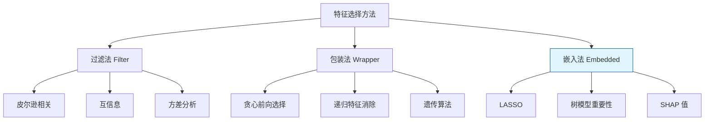
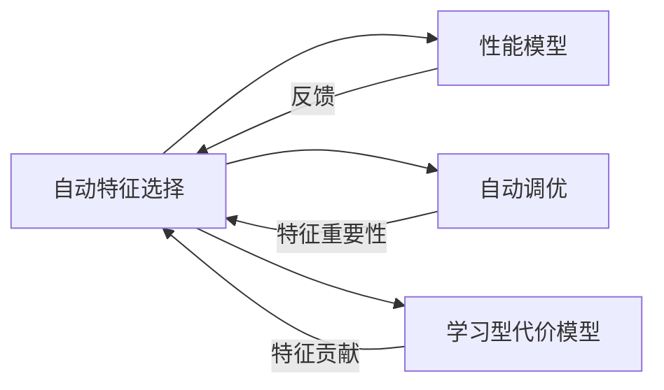

# 自动特征选择的流处理性能建模

> **所属阶段**: Knowledge/ | **前置依赖**: [learned-cost-models-streaming.md](../Struct/learned-cost-models-streaming.md), [llm-stream-tuning.md](./llm-stream-tuning.md) | **形式化等级**: L4

---

## 1. 概念定义 (Definitions)

流处理性能建模涉及大量特征：系统配置参数、工作负载统计信息、运行时指标、硬件规格等。
然而，并非所有特征都对性能预测同等重要。自动特征选择（Automated Feature Selection）旨在从高维特征空间中筛选出对目标性能指标最具预测能力的子集，从而提升模型的可解释性、降低过拟合风险，并减少在线推断时的特征采集开销。
Agnihotri et al.（AIDB 2025）针对流处理场景提出了专门的特征选择方法，考虑了特征之间的动态交互和时序相关性。

**Def-K-06-365 流处理性能特征空间 (Streaming Performance Feature Space)**

设流处理系统的完整特征集合为 $\mathcal{F} = \{f_1, f_2, \dots, f_m\}$，每个特征 $f_i$ 是从系统状态中提取的标量或向量。性能特征空间 $\mathcal{X}$ 为所有可能特征组合的集合：

$$
\mathcal{X} = 2^{\mathcal{F}}
$$

对于典型的 Flink 作业，$m$ 可能达到数百甚至上千（包括算子级指标、JVM 指标、操作系统指标、Kafka 指标等）。

**Def-K-06-366 特征重要性评分 (Feature Importance Score)**

特征重要性评分 $I(f_i)$ 量化了单个特征 $f_i$ 对目标性能变量 $Y$（如延迟、吞吐量）的预测贡献：

$$
I(f_i) = \mathbb{E}_{X_{\setminus i}} \left[ \text{Var}(Y | X_{\setminus i}) - \text{Var}(Y | X_{\setminus i}, f_i) \right]
$$

其中 $X_{\setminus i}$ 表示除 $f_i$ 外的所有特征。该定义基于条件方差减少：若知道 $f_i$ 能显著降低 $Y$ 的不确定性，则 $f_i$ 重要性高。

**Def-K-06-367 性能特征相关性 (Performance Feature Correlation)**

两个特征 $f_i$ 和 $f_j$ 的性能相关性定义为它们对目标变量 $Y$ 的联合解释能力与各自解释能力之和的比值：

$$
\rho_{perf}(f_i, f_j) = \frac{I(\{f_i, f_j\})}{I(f_i) + I(f_j)}
$$

- 若 $\rho_{perf} \approx 1$: 两特征对 $Y$ 的解释几乎不重叠（互补）
- 若 $\rho_{perf} \ll 1$: 两特征高度冗余

**Def-K-06-368 最优特征子集 (Optimal Feature Subset)**

设特征选择的目标为在预测性能和特征子集大小之间取得平衡。最优特征子集 $S^*$ 定义为：

$$
S^* = \arg\max_{S \subseteq \mathcal{F}} \left( R^2(Y | S) - \lambda |S| \right)
$$

其中 $R^2(Y | S)$ 为使用特征子集 $S$ 预测 $Y$ 的决定系数，$\lambda \geq 0$ 为复杂度惩罚系数，$|S|$ 为子集大小。

---

## 2. 属性推导 (Properties)

**Lemma-K-06-136 预测能力的单调性**

设 $S_1 \subseteq S_2 \subseteq \mathcal{F}$ 为两个特征子集。则对于任意有监督学习模型：

$$
R^2(Y | S_1) \leq R^2(Y | S_2)
$$

*说明*: 增加特征不会降低模型的训练集拟合能力（但可能因过拟合而降低测试集性能）。$\square$

**Lemma-K-06-137 冗余特征的边际效用递减**

设已选特征子集为 $S$，候选特征 $f \notin S$。若 $f$ 与 $S$ 中已有特征高度相关（即 $\exists f' \in S: \text{Corr}(f, f') \geq \tau$），则 $f$ 的边际效用 $R^2(Y | S \cup \{f\}) - R^2(Y | S)$ 显著小于 $f$ 与 $S$ 中所有特征均不相关时的边际效用。

*说明*: 这是特征选择中去除冗余特征的理论依据。$\square$

**Prop-K-06-132 特征选择的时间复杂度**

最优特征子集问题（无约束时）需要在 $2^m$ 个子集中搜索，是 NP-hard 的。贪心前向选择算法的时间复杂度为 $O(m \cdot k \cdot T_{model})$，其中 $k$ 为目标子集大小，$T_{model}$ 为单轮模型训练时间。

*说明*: 对于 $m > 1000$ 的流处理场景，必须使用近似算法或基于嵌入的重要性排序。$\square$

---

## 3. 关系建立 (Relations)

### 3.1 特征选择方法谱系



### 3.2 流处理特征的典型分类

| 特征类别 | 示例 | 重要性 | 采集成本 |
|---------|------|--------|---------|
| **查询计划特征** | JOIN 数量、窗口大小、算子并行度 | 高 | 低 |
| **运行时指标** | 吞吐量、延迟、反压率、GC 时间 | 高 | 中 |
| **系统配置特征** | Checkpoint 间隔、状态后端、缓冲区大小 | 高 | 低 |
| **JVM/OS 指标** | CPU 使用率、堆内存、线程数 | 中 | 低 |
| **外部系统指标** | Kafka lag、Broker 延迟、网络吞吐 | 中 | 中 |
| **细粒度算子指标** | 每个算子的处理速率、状态大小 | 中 | 高 |

### 3.3 自动特征选择与调优/代价模型的关系



特征选择是性能建模、自动调优和学习型代价模型的前置步骤。选出的关键特征不仅用于预测模型，还可以直接作为调优的抓手（如"并行度"和"Checkpoint 间隔"通常是重要性最高的特征）。

---

## 4. 论证过程 (Argumentation)

### 4.1 为什么流处理性能建模需要自动特征选择？

1. **维度灾难**: 现代流处理平台（Flink、Spark Streaming、Kafka Streams）暴露的指标可达数千维，直接使用全部特征会导致模型过拟合和训练成本激增
2. **特征冗余**: 许多指标高度相关（如"TaskManager CPU 使用率"与"系统 CPU 使用率"），冗余特征会稀释真正重要的信号
3. **在线推断成本**: 某些特征（如细粒度算子级指标）需要频繁采集和聚合，特征选择可以降低监控系统的负载
4. **可解释性**: 识别出少数关键特征后，运维人员更容易理解"什么因素主导了性能"，从而采取针对性措施

### 4.2 Agnihotri et al. 的流处理特征选择框架

AIDB 2025 的工作针对流处理提出了三阶段特征选择流程：

1. **时序稳定性过滤**: 首先去除在时间上波动过大、信噪比过低的特征。稳定性度量定义为时间序列的变异系数（Coefficient of Variation）：
   $$
   CV(f) = \frac{\sigma(f)}{\mu(f)}
   $$
   若 $CV(f) > \tau_{CV}$，则该特征被认为不稳定，予以剔除。

2. **互信息筛选**: 计算每个特征与目标性能变量的互信息 $MI(f_i, Y)$，保留 Top-$p\%$ 的特征。

3. **Shapley 值精排**: 在筛选后的特征子集上训练一个轻量级树模型（如 XGBoost），使用 SHAP 值计算每个特征对预测结果的边际贡献，最终选择累积 SHAP 贡献达到阈值（如 95%）的最小特征子集。

### 4.3 反例：忽略高阶交互导致错误特征选择

某团队使用简单的皮尔逊相关系数进行特征选择，目标是预测 Flink 作业的延迟。他们发现"网络内存比例"与延迟的线性相关性很低（$r = 0.1$），因此将其剔除。然而，在实际的物理执行计划中：

- 当网络内存比例较低（< 0.1）且吞吐量较高（> 100K/s）时，延迟会急剧上升
- "网络内存比例"单独看并不重要，但与"吞吐量"存在强交互效应

由于忽略了这种高阶交互，性能模型在高压场景下的预测准确率大幅下降。

**教训**: 简单的单变量特征选择方法（如皮尔逊相关）容易遗漏具有交互效应的重要特征。应使用能够捕捉交互的方法（如树模型重要性、SHAP 交互值）。

---

## 5. 形式证明 / 工程论证 (Proof / Engineering Argument)

**Thm-K-06-141 最优特征子集的存在性**

设特征集合 $\mathcal{F}$ 有限，$R^2(Y | S)$ 为定义在 $2^{\mathcal{F}}$ 上的实值函数，且 $|S|$ 为离散整数。则对于任意 $\lambda \geq 0$，目标函数：

$$
J(S) = R^2(Y | S) - \lambda |S|
$$

在 $2^{\mathcal{F}}$ 上必存在最大值点 $S^*$。

*证明*:

$2^{\mathcal{F}}$ 是有限集合（大小为 $2^{|\mathcal{F}|}$），$J(S)$ 是定义在有限集上的实值函数。根据极值定理，有限集上的实值函数必有最大值。因此 $S^*$ 存在。$\square$

---

**Thm-K-06-142 贪心前向选择的近似比**

若 $R^2(Y | S)$ 是关于 $S$ 的单调子模函数（monotone submodular），则贪心算法选择的 $k$ 个特征子集 $S_{greedy}$ 满足：

$$
R^2(Y | S_{greedy}) \geq \left(1 - \frac{1}{e}\right) \cdot R^2(Y | S_{opt}^k)
$$

其中 $S_{opt}^k$ 为大小为 $k$ 的最优子集。

*证明*:

这是 Nemhauser 等人的经典结果。对于单调子模函数，贪心算法每一步选择边际增益最大的元素，其累积收益至少达到最优解的 $(1 - 1/e)$ 比例。$\square$

*说明*: 在实践中，$R^2$ 不一定是严格的子模函数，但贪心算法通常仍能取得接近最优的效果。$\square$

---

## 6. 实例验证 (Examples)

### 6.1 使用 SHAP 进行特征选择

```python
import shap
import xgboost as xgb
from sklearn.datasets import make_regression

# 训练性能预测模型（示例）
model = xgb.XGBRegressor(n_estimators=100, max_depth=5)
model.fit(X_train, y_train)

# 计算 SHAP 值
explainer = shap.Explainer(model)
shap_values = explainer(X_train)

# 按平均绝对 SHAP 值排序特征
importance = np.abs(shap_values.values).mean(axis=0)
feature_importance = sorted(
    zip(feature_names, importance),
    key=lambda x: x[1],
    reverse=True
)

# 选择累积贡献达 95% 的最小特征子集
cumulative = 0
total = sum(importance)
selected_features = []
for name, score in feature_importance:
    selected_features.append(name)
    cumulative += score
    if cumulative / total >= 0.95:
        break

print(f"Selected {len(selected_features)} out of {len(feature_names)} features")
```

### 6.2 互信息筛选的 Python 实现

```python
from sklearn.feature_selection import mutual_info_regression
import pandas as pd

# 计算每个特征与目标变量的互信息
mi_scores = mutual_info_regression(X_train, y_train, random_state=42)
mi_series = pd.Series(mi_scores, index=feature_names).sort_values(ascending=False)

# 保留 Top-30% 特征
top_features = mi_series[mi_series > mi_series.quantile(0.7)].index.tolist()
print(f"Top features by MI: {top_features}")
```

### 6.3 流处理特征选择结果示例

某 Flink 集群在特征选择后得到的关键特征 Top 10：

| 排名 | 特征名 | SHAP 重要性 | 说明 |
|------|--------|------------|------|
| 1 | `parallelism.source` | 0.18 | Source 并行度 |
| 2 | `checkpoint.interval_ms` | 0.15 | Checkpoint 间隔 |
| 3 | `avg_input_rate` | 0.12 | 平均输入速率 |
| 4 | `state.backend.rocksdb` | 0.09 | 是否使用 RocksDB |
| 5 | `network.memory.fraction` | 0.08 | 网络内存占比 |
| 6 | `key_skewness` | 0.07 | 数据倾斜度 |
| 7 | `gc.pause.time` | 0.06 | GC 暂停时间 |
| 8 | `window.size_ms` | 0.05 | 窗口大小 |
| 9 | `sink.batch.size` | 0.04 | Sink 批大小 |
| 10 | `task.backpressure.ratio` | 0.03 | 反压比例 |

---

## 7. 可视化 (Visualizations)

### 7.1 自动特征选择三阶段流水线


### 7.2 特征数量与模型性能的关系

```mermaid
xychart-beta
    title "特征子集大小与模型性能"
    x-axis [5, 10, 20, 50, 100, 500, 1000]
    y-axis "R² (测试集)" 0 --> 1.0
    line "训练集 R²" {0.45, 0.62, 0.78, 0.89, 0.95, 0.99, 1.0}
    line "测试集 R²" {0.42, 0.60, 0.76, 0.88, 0.90, 0.85, 0.80}
```

*说明*: 测试集性能在特征数约 50-100 时达到峰值，继续增加特征会导致过拟合。

---

## 8. 引用参考 (References)
