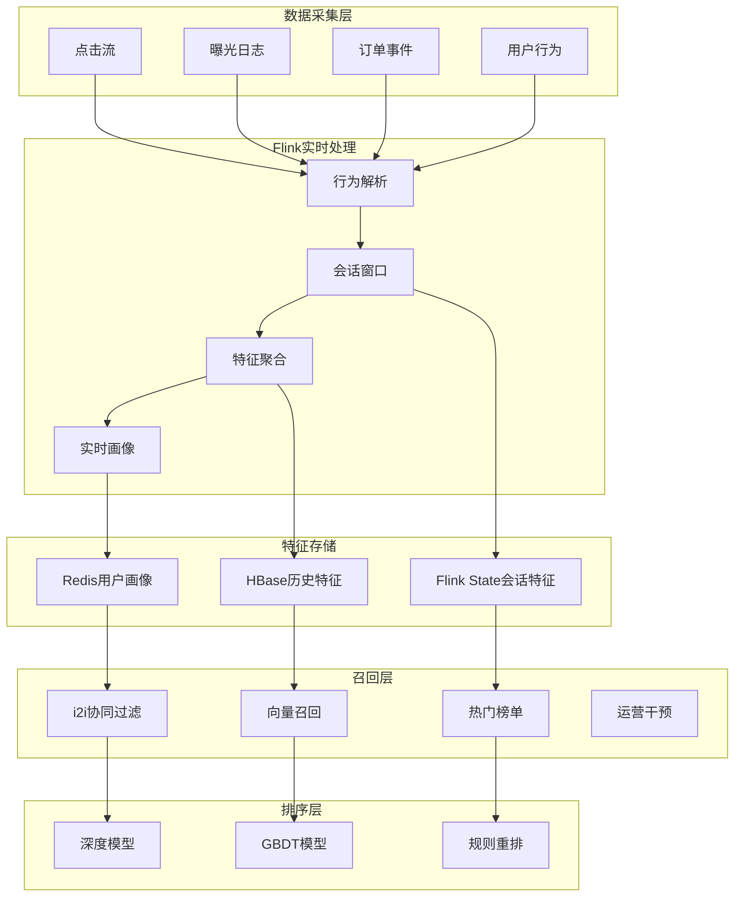
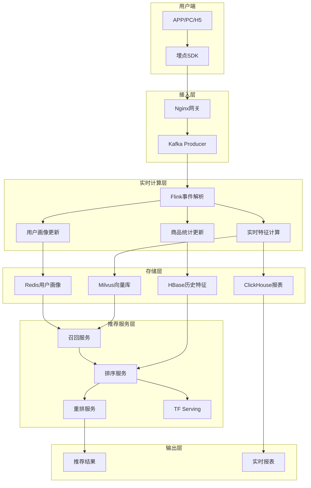
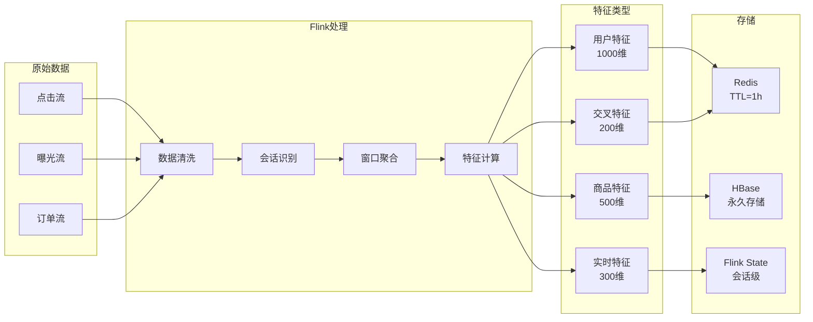
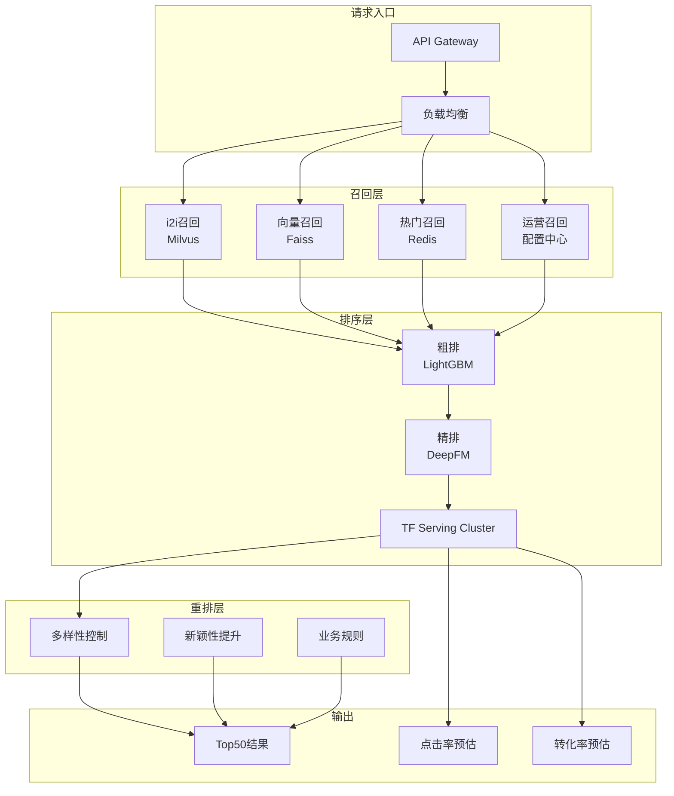
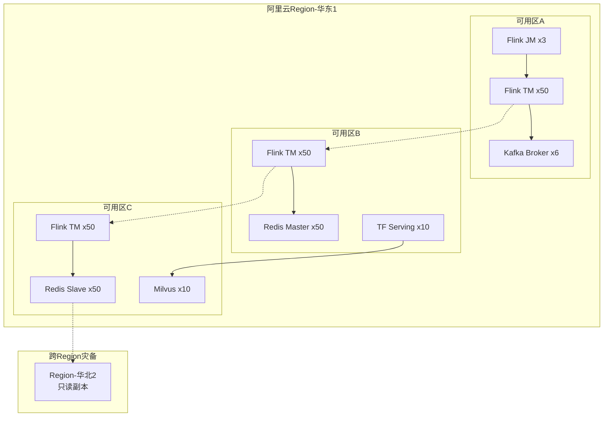

# 电商实时推荐系统案例研究

> **所属阶段**: Knowledge/case-studies/ecommerce | **前置依赖**: [Knowledge/00-INDEX.md](../../Knowledge/00-INDEX.md) | **形式化等级**: L5
> **案例编号**: CS-E-02 | **完成日期**: 2026-04-11 | **版本**: v2.0

---

## 目录

- [电商实时推荐系统案例研究](#电商实时推荐系统案例研究)
  - [目录](#目录)
  - [1. 概念定义 (Definitions)](#1-概念定义-definitions)
    - [1.1 实时推荐系统定义](#11-实时推荐系统定义)
    - [1.2 用户行为特征](#12-用户行为特征)
    - [1.3 推荐质量度量](#13-推荐质量度量)
  - [2. 属性推导 (Properties)](#2-属性推导-properties)
    - [2.1 实时性约束](#21-实时性约束)
    - [2.2 可扩展性保证](#22-可扩展性保证)
  - [3. 关系建立 (Relations)](#3-关系建立-relations)
    - [3.1 数据流架构关系](#31-数据流架构关系)
    - [3.2 模型服务关系](#32-模型服务关系)
  - [4. 论证过程 (Argumentation)](#4-论证过程-argumentation)
    - [4.1 实时vs离线推荐](#41-实时vs离线推荐)
    - [4.2 冷启动问题分析](#42-冷启动问题分析)
  - [5. 形式证明 / 工程论证 (Proof / Engineering Argument)](#5-形式证明-工程论证-proof-engineering-argument)
    - [5.1 特征工程管道](#51-特征工程管道)
    - [5.2 模型推理优化](#52-模型推理优化)
  - [6. 实例验证 (Examples)](#6-实例验证-examples)
    - [6.1 案例背景](#61-案例背景)
    - [6.2 实施效果](#62-实施效果)
    - [6.3 技术架构](#63-技术架构)
    - [6.4 生产环境检查清单](#64-生产环境检查清单)
  - [7. 可视化 (Visualizations)](#7-可视化-visualizations)
    - [7.1 实时推荐数据流架构](#71-实时推荐数据流架构)
    - [7.2 特征工程流水线](#72-特征工程流水线)
    - [7.3 模型推理服务架构](#73-模型推理服务架构)
    - [7.4 系统部署拓扑](#74-系统部署拓扑)
  - [8. 引用参考 (References)](#8-引用参考-references)

---

## 1. 概念定义 (Definitions)

### 1.1 实时推荐系统定义

**Def-K-10-201** (实时推荐系统): 实时推荐系统是一个九元组 $\mathcal{R} = (U, I, C, B, F, M, S, P, W)$：

- $U$：用户集合，$|U| = N_u$，典型规模 $10^8$ 级
- $I$：商品集合，$|I| = N_i$，典型规模 $10^7$ 级
- $C$：上下文集合（时间、位置、设备）
- $B$：用户行为序列集合
- $F$：特征工程函数集合
- $M$：推荐模型集合（召回+排序+重排）
- $S$：候选生成策略
- $P$：个性化函数
- $W$：反馈学习机制

**推荐响应定义**:

$$
Recommendation(u, c, t) = TopK\left(\{score(u, i, c) : i \in CandidateSet(u, t)\}\right)
$$

其中 $score(u, i, c)$ 为用户 $u$ 在上下文 $c$ 下对商品 $i$ 的预测评分。

### 1.2 用户行为特征

**Def-K-10-202** (用户实时画像): 用户 $u$ 在时间 $t$ 的实时画像定义为：

$$
Profile(u, t) = (D_u, H_u^{(t)}, R_u^{(t)}, S_u^{(t)})
$$

其中：

- $D_u$：用户 demographic 特征（年龄、性别、地域）
- $H_u^{(t)} = \{(i, \tau, action) : \tau \in [t-T, t]\}$：近期行为历史
- $R_u^{(t)}$：实时意图向量（通过会话行为推断）
- $S_u^{(t)}$：当前会话状态

**Def-K-10-203** (实时特征向量): 特征工程输出：

$$
F(u, i, c) = concat(F_{user}(u), F_{item}(i), F_{context}(c), F_{interaction}(u,i))
$$

### 1.3 推荐质量度量

**Def-K-10-204** (推荐效果指标):

| 指标 | 定义 | 目标值 |
|------|------|--------|
| CTR | 点击率 = 点击数/曝光数 | > 5% |
| CVR | 转化率 = 订单数/点击数 | > 3% |
| GMV | 成交总额 | 日均>1亿 |
| 多样性 | 类目覆盖率 | > 80% |
| 新颖性 | 长尾商品占比 | > 30% |

**Def-K-10-205** (延迟约束):

$$
L_{total} = L_{feature} + L_{recall} + L_{rank} + L_{rerank} + L_{network} \leq 100ms
$$

---

## 2. 属性推导 (Properties)

### 2.1 实时性约束

**Lemma-K-10-201**: 设特征查询延迟为 $L_f$，召回阶段延迟为 $L_r$，排序阶段延迟为 $L_s$，则总延迟满足：

$$
L_{total} = L_f + \max(L_r^{(1)}, L_r^{(2)}, ..., L_r^{(k)}) + L_s + L_{rerank} \leq L_{SLA}
$$

对于电商推荐场景，$L_{SLA} = 100$ms（P99）。

**Thm-K-10-201** (吞吐量扩展性): 设单节点吞吐量为 $TPS_{single}$，节点数为 $N$，线性扩展系数为 $\alpha$（通常 $\alpha \in [0.8, 0.95]$），则系统总吞吐量：

$$
TPS_{total} = \alpha \cdot N \cdot TPS_{single}
$$

要达到100万TPS，假设单节点5万TPS，$\alpha = 0.9$，则：

$$
N \geq \frac{10^6}{0.9 \times 5 \times 10^4} \approx 23 \text{ 节点}
$$

### 2.2 可扩展性保证

**Lemma-K-10-202** (特征存储容量): 设用户数为 $N_u$，每用户特征维度为 $d$，单条特征大小为 $s$ 字节，Redis集群分片数为 $S$，则每分片存储：

$$
Storage_{per\_shard} = \frac{N_u \cdot d \cdot s}{S}
$$

对于10亿用户、1000维特征、4字节/维度、100分片：

$$
Storage = \frac{10^9 \times 1000 \times 4}{100} = 40GB/分片
$$

---

## 3. 关系建立 (Relations)

### 3.1 数据流架构关系



### 3.2 模型服务关系

| 阶段 | 模型类型 | 延迟要求 | 候选数量 | 核心指标 |
|------|----------|----------|----------|----------|
| 召回 | 向量检索 | < 10ms | 万级 | 召回率 |
| 粗排 | 轻量模型 | < 20ms | 千级 | 相关性 |
| 精排 | 深度模型 | < 50ms | 百级 | CTR/CVR |
| 重排 | 规则/策略 | < 10ms | 十级 | 多样性 |

---

## 4. 论证过程 (Argumentation)

### 4.1 实时vs离线推荐

| 维度 | 实时推荐 | 离线推荐 | 混合策略 |
|------|----------|----------|----------|
| 延迟 | < 100ms | 小时级 | 实时召回+离线特征 |
| 个性化 | 基于当前会话 | 基于历史行为 | 融合两者 |
| 冷启动 | 快速响应 | 无法处理 | 实时学习 |
| 计算成本 | 高 | 低 | 分层优化 |
| 适用场景 | 首页Feed | 邮件推送 | 全场景覆盖 |

**混合架构优势**: 实时捕获用户即时意图，同时利用丰富的离线特征保证推荐质量。

### 4.2 冷启动问题分析

**Def-K-10-206** (冷启动分类):

| 类型 | 描述 | 解决策略 |
|------|------|----------|
| 用户冷启动 | 新用户无历史 | 热门推荐、基于设备/位置 |
| 商品冷启动 | 新商品无交互 | 内容相似、探索利用 |
| 系统冷启动 | 全新系统 | 专家规则、快速迭代 |

**探索-利用平衡**:

$$
Score_{explore}(i) = \hat{r}_{ui} + \beta \cdot \sqrt{\frac{\ln N}{n_i}}
$$

其中 $N$ 为总曝光次数，$n_i$ 为商品 $i$ 曝光次数，$\beta$ 为探索系数。

---

## 5. 形式证明 / 工程论证 (Proof / Engineering Argument)

### 5.1 特征工程管道

**Thm-K-10-202** (特征一致性): Flink特征工程管道保证 Exactly-Once 语义，确保训练/推理特征一致性。

**Flink特征工程实现**:

```java

import org.apache.flink.streaming.api.datastream.DataStream;
import org.apache.flink.api.common.state.ValueState;
import org.apache.flink.api.common.state.ValueStateDescriptor;
import org.apache.flink.streaming.api.windowing.time.Time;

// 用户行为特征计算
DataStream<UserFeature> userFeatures = clickStream
    .keyBy(ClickEvent::getUserId)
    .window(SlidingEventTimeWindows.of(Time.minutes(30), Time.seconds(10)))
    .aggregate(new UserFeatureAggregator())
    .name("user-feature-calculation");

// 商品统计特征
DataStream<ItemFeature> itemFeatures = eventStream
    .keyBy(Event::getItemId)
    .window(SlidingEventTimeWindows.of(Time.hours(1), Time.minutes(5)))
    .aggregate(new ItemFeatureAggregator());

// 会话级实时意图识别
DataStream<SessionIntent> sessionIntents = behaviorStream
    .keyBy(BehaviorEvent::getSessionId)
    .process(new KeyedProcessFunction<String, BehaviorEvent, SessionIntent>() {
        private ValueState<SessionState> sessionState;
        private static final long SESSION_TIMEOUT = 30 * 60 * 1000; // 30min

        @Override
        public void open(Configuration parameters) {
            sessionState = getRuntimeContext().getState(
                new ValueStateDescriptor<>("session", SessionState.class));
        }

        @Override
        public void processElement(BehaviorEvent event, Context ctx,
                                   Collector<SessionIntent> out) throws Exception {
            SessionState state = sessionState.value();
            if (state == null || ctx.timestamp() - state.getLastTime() > SESSION_TIMEOUT) {
                state = new SessionState(event.getUserId(), ctx.timestamp());
            }
            state.addEvent(event);
            sessionState.update(state);

            // 每5个事件或会话结束时输出意图
            if (state.getEventCount() % 5 == 0 || event.getType() == EventType.PURCHASE) {
                out.collect(state.extractIntent());
            }
        }
    });

// 实时特征写入Redis
userFeatures.addSink(new RedisSink<>(
    new FlinkJedisPoolConfig.Builder()
        .setHost("redis-cluster")
        .setPort(6379)
        .build(),
    new UserFeatureRedisMapper()
));
```

### 5.2 模型推理优化

**TensorFlow Serving集成**:

```java
// 异步模型推理

import org.apache.flink.streaming.api.datastream.DataStream;
import org.apache.flink.streaming.api.windowing.time.Time;

public class AsyncModelInference extends
    RichAsyncFunction<FeatureVector, Prediction> {

    private transient TensorFlowServingClient tfClient;
    private static final String MODEL_NAME = "recommendation_ranking";
    private static final int MODEL_VERSION = 1;

    @Override
    public void open(Configuration parameters) {
        tfClient = TensorFlowServingClient.create("tf-serving:8501");
    }

    @Override
    public void asyncInvoke(FeatureVector features,
                            ResultFuture<Prediction> resultFuture) {
        ListenableFuture<PredictResponse> responseFuture = tfClient.predict(
            MODEL_NAME, MODEL_VERSION,
            features.toTensorProto()
        );

        Futures.addCallback(responseFuture, new FutureCallback<>() {
            @Override
            public void onSuccess(PredictResponse response) {
                float score = response.getOutputsOrThrow("score")
                    .getFloatVal(0);
                resultFuture.complete(Collections.singletonList(
                    new Prediction(features.getItemId(), score)
                ));
            }

            @Override
            public void onFailure(Throwable t) {
                resultFuture.complete(Collections.singletonList(
                    new Prediction(features.getItemId(), 0.0f, t)
                ));
            }
        }, Executors.newCachedThreadPool());
    }
}

// 应用到DataStream
DataStream<Prediction> predictions = featureStream
    .map(FeatureVector::fromUserItemContext)
    .flatMap(new CandidateGenerator()) // 生成候选集
    .asyncWaitFor(
        new AsyncModelInference(),
        Time.milliseconds(50), // 超时50ms
        100 // 并发数
    );
```

**缓存优化策略**:

```java
// 多级缓存:本地Caffeine + Redis Cluster
public class MultiLevelFeatureCache {
    private final Cache<String, UserFeature> localCache;
    private final RedisClusterAsyncCommands<String, String> redisClient;

    public UserFeature getUserFeature(String userId) {
        // L1: 本地缓存
        UserFeature feature = localCache.getIfPresent(userId);
        if (feature != null) return feature;

        // L2: Redis
        feature = fetchFromRedis(userId);
        if (feature != null) {
            localCache.put(userId, feature);
            return feature;
        }

        // L3: 实时计算(降级)
        feature = computeInRealTime(userId);
        return feature;
    }
}
```

---

## 6. 实例验证 (Examples)

### 6.1 案例背景

**某头部电商平台实时推荐系统升级项目**

- **业务规模**：日活 2亿，日PV 100亿，SKU 5000万+
- **推荐场景**：首页Feed、商品详情页"猜你喜欢"、购物车推荐
- **历史问题**：离线推荐延迟高，无法捕捉用户实时兴趣变化

**技术挑战**：

| 挑战 | 描述 | 量化指标 |
|------|------|----------|
| 超低延迟 | 推荐接口P99<100ms | 原系统500ms+ |
| 超高吞吐 | 峰值100万TPS | 日处理千亿级事件 |
| 实时个性化 | 实时学习用户意图 | 分钟级画像更新 |
| 多目标优化 | CTR/CVR/GMV平衡 | 多目标建模 |

### 6.2 实施效果

**性能数据**（上线后12个月）：

| 指标 | 优化前 | 优化后 | 提升 |
|------|--------|--------|------|
| 推荐接口P99延迟 | 450ms | 85ms | -81% |
| 系统吞吐量 | 20万TPS | 120万TPS | +500% |
| 首页CTR | 3.2% | 5.8% | +81% |
| 转化率(CVR) | 2.1% | 3.6% | +71% |
| 人均GMV | ¥125 | ¥198 | +58% |
| 长尾商品曝光 | 15% | 35% | +133% |
| 实时画像更新 | 小时级 | 秒级 | 3600x |

**业务价值**：

- 年度GMV增量：50亿+
- 用户体验提升：跳出率降低12%
- 长尾商品销售：小众品类GMV增长200%

### 6.3 技术架构

**核心技术栈**：

- **流处理**: Apache Flink 1.18 (100节点集群)
- **消息队列**: Apache Kafka (200分区，3副本)
- **特征存储**: Redis Cluster (200节点，40TB) + HBase
- **模型服务**: TensorFlow Serving + NVIDIA Triton
- **向量检索**: Milvus (10亿向量，召回率>95%)
- **监控**: Prometheus + Grafana + 自研A/B平台

**Flink集群配置**:

```yaml
# flink-conf.yaml
jobmanager.memory.process.size: 8192m
taskmanager.memory.process.size: 32768m
taskmanager.numberOfTaskSlots: 8
parallelism.default: 400

# Checkpoint配置
state.backend: rocksdb
state.checkpoints.dir: hdfs:///checkpoints/recommendation
execution.checkpointing.interval: 30s
execution.checkpointing.max-concurrent-checkpoints: 1
```

### 6.4 生产环境检查清单

**部署前检查**:

| 检查项 | 要求 | 验证方法 |
|--------|------|----------|
| Redis集群 | 200节点，40TB容量 | `redis-cli cluster info` |
| Kafka吞吐 | 200万条/秒 | Producer压测 |
| TF Serving GPU | A100x20 | `nvidia-smi` |
| 网络带宽 | 万兆网卡，<1ms延迟 | `iperf3` |

**运行时监控**:

| 指标 | 告警阈值 | 处理方案 |
|------|----------|----------|
| 推荐延迟P99 | > 150ms | 扩容/降级 |
| Redis命中率 | < 95% | 调整缓存策略 |
| TF Serving QPS | > 80%容量 | 水平扩容 |
| Flink Checkpoint | 失败>3次 | 调优 RocksDB |
| 模型AUC | 下降>5% | 回滚模型 |

**故障降级策略**:

```java
// 多级降级策略
public class DegradationStrategy {
    // Level 1: 关闭复杂特征计算
    public void level1Degrade() {
        featureConfig.setComputeComplexFeatures(false);
    }

    // Level 2: 使用简化模型
    public void level2Degrade() {
        modelRouter.routeTo("light_model");
    }

    // Level 3: 返回热门榜单
    public void level3Degrade() {
        recommendationCache.getHotItems();
    }
}
```

---

## 7. 可视化 (Visualizations)

### 7.1 实时推荐数据流架构



### 7.2 特征工程流水线



### 7.3 模型推理服务架构



### 7.4 系统部署拓扑



---

## 8. 引用参考 (References)


---

*本文档遵循 AnalysisDataFlow 项目六段式模板规范 | 最后更新: 2026-04-11*
